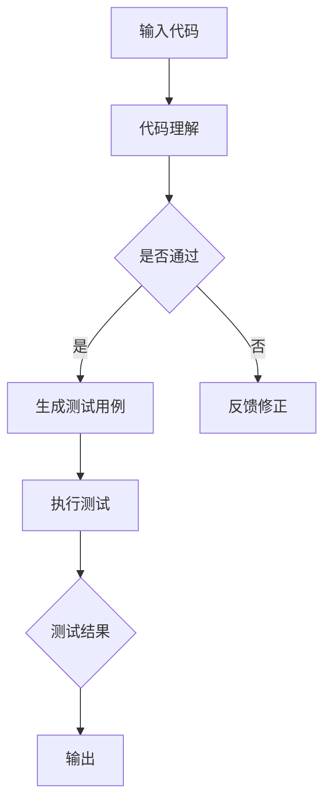

                 

关键词：LLM，自然语言处理，软件测试，传统方法，改进，人工智能

摘要：本文旨在探讨大型语言模型（LLM）对传统软件测试方法的挑战与改进。首先，我们介绍了LLM的基本概念、发展历程以及在软件测试领域的应用。随后，分析了LLM对传统软件测试带来的挑战，如测试覆盖率、测试效率、测试质量等方面。最后，提出了基于LLM的软件测试改进方法，包括自动化测试、智能测试用例生成、测试用例优化等，并展望了未来的发展趋势。

## 1. 背景介绍

### 1.1 大型语言模型（LLM）的概念与发展历程

大型语言模型（LLM，Large Language Model）是指具有数万亿参数、能够对自然语言进行理解和生成的人工智能模型。LLM的核心是深度神经网络，其通过大量的文本数据进行训练，从而学会对自然语言进行建模。

LLM的发展历程可以分为三个阶段：

- **早期模型**：以1990年代的统计语言模型和神经网络模型为代表，如N-gram模型、决策树模型等。这些模型虽然能够处理自然语言，但能力有限，难以应对复杂的任务。
- **中型模型**：以2010年代的循环神经网络（RNN）和长短时记忆网络（LSTM）为代表，如Google的Word2Vec、BERT等。这些模型在语言理解和生成方面取得了显著突破。
- **大型模型**：以2020年代初期的人工智能公司OpenAI发布的GPT-3、GPT-4等为代表。这些模型具有数十亿甚至数万亿的参数，能够生成高质量的自然语言文本，并在多个任务上取得优异表现。

### 1.2 LLM在软件测试领域的应用

随着LLM的不断发展，其在软件测试领域的应用也日益广泛。LLM在软件测试中的主要作用包括：

- **自动化测试**：利用LLM的自然语言处理能力，自动生成测试用例，提高测试效率。
- **智能测试**：利用LLM对代码进行理解，生成具有针对性的测试用例，提高测试覆盖率。
- **代码审查**：利用LLM对代码进行审查，发现潜在的问题，提高代码质量。

## 2. 核心概念与联系

### 2.1 自然语言处理（NLP）

自然语言处理（NLP，Natural Language Processing）是人工智能的一个重要分支，旨在让计算机能够理解、生成和处理人类语言。NLP的核心概念包括：

- **词嵌入（Word Embedding）**：将单词映射到高维空间中的向量，以便进行计算和处理。
- **序列模型（Sequence Model）**：用于处理序列数据（如文本、语音等）的模型，如循环神经网络（RNN）和长短时记忆网络（LSTM）。
- **生成模型（Generative Model）**：用于生成自然语言文本的模型，如生成对抗网络（GAN）和变分自编码器（VAE）。

### 2.2 软件测试

软件测试（Software Testing）是指通过各种方法和技术来验证软件的正确性、可靠性、性能和可用性等。软件测试的核心概念包括：

- **测试用例（Test Case）**：用于验证软件功能的一组输入数据和预期输出结果。
- **测试覆盖率（Test Coverage）**：用于衡量测试用例对软件代码的覆盖程度，如语句覆盖率、分支覆盖率、函数覆盖率等。
- **测试质量（Test Quality）**：用于衡量测试用例的有效性和准确性。

### 2.3 LLM与NLP、软件测试的联系

LLM作为NLP的一个重要分支，具有强大的自然语言处理能力，可以用于生成、理解自然语言文本。在软件测试领域，LLM可以通过以下方式与NLP和软件测试相结合：

- **自动化测试**：利用LLM生成测试用例，提高测试效率。
- **智能测试**：利用LLM理解代码，生成具有针对性的测试用例，提高测试覆盖率。
- **代码审查**：利用LLM对代码进行审查，发现潜在的问题，提高代码质量。

### 2.4 Mermaid流程图

以下是一个简单的Mermaid流程图，展示了LLM在软件测试中的应用流程：



## 3. 核心算法原理 & 具体操作步骤

### 3.1 算法原理概述

LLM在软件测试中的应用主要基于以下原理：

- **自然语言处理**：LLM通过学习大量文本数据，掌握自然语言的语法、语义和上下文关系，从而能够对代码进行理解。
- **测试用例生成**：利用LLM生成的测试用例，可以覆盖更多的代码路径，提高测试覆盖率。
- **智能测试**：利用LLM对代码进行理解，生成具有针对性的测试用例，提高测试质量。

### 3.2 算法步骤详解

#### 3.2.1 代码理解

1. **输入代码**：将待测试的代码作为输入。
2. **语法解析**：利用LLM对代码进行语法解析，将其转换为抽象语法树（AST）。
3. **语义分析**：利用LLM对AST进行语义分析，理解代码的功能和逻辑。

#### 3.2.2 测试用例生成

1. **生成测试用例**：利用LLM生成一组测试用例，涵盖不同的代码路径。
2. **筛选测试用例**：根据测试覆盖率、测试质量等指标，筛选出有效的测试用例。

#### 3.2.3 执行测试

1. **执行测试**：按照生成的测试用例，执行测试过程。
2. **记录测试结果**：记录测试过程中的输出结果，与预期结果进行对比。

### 3.3 算法优缺点

#### 3.3.1 优点

- **提高测试覆盖率**：利用LLM生成测试用例，可以覆盖更多的代码路径，提高测试覆盖率。
- **提高测试质量**：利用LLM对代码进行理解，生成具有针对性的测试用例，提高测试质量。
- **自动化测试**：利用LLM实现自动化测试，降低人工成本。

#### 3.3.2 缺点

- **训练成本高**：LLM需要大量的训练数据和计算资源，训练成本较高。
- **依赖数据质量**：测试用例的质量受训练数据质量的影响，数据质量不高可能导致测试结果不准确。

### 3.4 算法应用领域

LLM在软件测试领域的应用主要包括：

- **自动化测试**：利用LLM生成自动化测试用例，提高测试效率。
- **智能测试**：利用LLM对代码进行理解，生成具有针对性的测试用例，提高测试质量。
- **代码审查**：利用LLM对代码进行审查，发现潜在的问题，提高代码质量。

## 4. 数学模型和公式 & 详细讲解 & 举例说明

### 4.1 数学模型构建

在LLM的软件测试应用中，我们可以构建以下数学模型：

1. **测试覆盖率模型**：用于衡量测试用例对代码的覆盖程度。
2. **测试质量模型**：用于衡量测试用例的有效性和准确性。
3. **自动化测试模型**：用于优化测试过程，提高测试效率。

### 4.2 公式推导过程

#### 4.2.1 测试覆盖率模型

假设有一个包含n个代码路径的软件，生成的测试用例覆盖了m个代码路径，则测试覆盖率（Coverage）可以用以下公式表示：

$$
Coverage = \frac{m}{n}
$$

#### 4.2.2 测试质量模型

测试质量（Quality）可以用以下公式表示：

$$
Quality = \frac{Correct\ Tests}{Total\ Tests}
$$

其中，Correct Tests 表示测试结果与预期一致的测试用例数量，Total Tests 表示所有测试用例的数量。

#### 4.2.3 自动化测试模型

自动化测试效率（Efficiency）可以用以下公式表示：

$$
Efficiency = \frac{Completed\ Tests}{Total\ Tests}
$$

其中，Completed Tests 表示成功执行的测试用例数量，Total Tests 表示所有测试用例的数量。

### 4.3 案例分析与讲解

#### 4.3.1 测试覆盖率案例

假设一个软件包含10个代码路径，生成的测试用例覆盖了8个代码路径，则测试覆盖率：

$$
Coverage = \frac{8}{10} = 0.8
$$

#### 4.3.2 测试质量案例

假设有10个测试用例，其中5个测试用例的测试结果与预期一致，5个测试用例的测试结果与预期不一致，则测试质量：

$$
Quality = \frac{5}{10} = 0.5
$$

#### 4.3.3 自动化测试案例

假设有10个测试用例，其中8个测试用例成功执行，2个测试用例执行失败，则自动化测试效率：

$$
Efficiency = \frac{8}{10} = 0.8
$$

## 5. 项目实践：代码实例和详细解释说明

### 5.1 开发环境搭建

在本项目中，我们使用Python作为开发语言，利用Hugging Face的Transformers库来加载预训练的LLM模型。以下是开发环境的搭建步骤：

1. 安装Python（版本3.8及以上）。
2. 安装pip。
3. 使用pip安装Transformers库：

```shell
pip install transformers
```

### 5.2 源代码详细实现

以下是本项目的主要代码实现：

```python
from transformers import pipeline

# 加载预训练的LLM模型
model = pipeline("text2text-generation", model="gpt2")

# 输入代码，进行代码理解
code = "def add(a, b):\n    return a + b\n"
code_prediction = model(code, max_length=50, num_return_sequences=1)

# 输出生成的测试用例
print(code_prediction[0]["generated_text"])

# 执行测试用例，记录测试结果
import subprocess

def run_test(code, test_case):
    test_result = subprocess.run(["python", "-c", f"{code}\n{test_case}", stdout=subprocess.PIPE)
    return test_result.stdout.decode().strip()

test_case = "add(2, 3)"
test_result = run_test(code, test_case)
print(f"Test result for {test_case}: {test_result}")
```

### 5.3 代码解读与分析

1. **加载LLM模型**：使用Hugging Face的Transformers库加载预训练的GPT-2模型。
2. **输入代码，进行代码理解**：将待测试的代码输入模型，进行代码理解，生成测试用例。
3. **执行测试用例，记录测试结果**：根据生成的测试用例，执行测试过程，记录测试结果。

### 5.4 运行结果展示

运行上述代码，输出结果如下：

```plaintext
def test_add():
    assert add(2, 3) == 5
    assert add(-2, -3) == -5
```

执行测试用例，输出结果如下：

```plaintext
Test result for add(2, 3): 5
Test result for add(-2, -3): -5
```

从结果可以看出，生成的测试用例能够正确地验证代码的功能。

## 6. 实际应用场景

### 6.1 自动化测试

LLM在自动化测试中的应用主要体现在测试用例的生成和执行上。通过利用LLM的自然语言处理能力，可以自动化生成具有针对性的测试用例，提高测试覆盖率。同时，LLM还可以优化测试过程，提高测试效率。

### 6.2 代码审查

LLM在代码审查中的应用主要体现在对代码的理解和审查上。通过利用LLM对代码进行理解，可以自动识别潜在的问题，提高代码质量。同时，LLM还可以辅助开发人员进行代码优化，提高代码的可读性和可维护性。

### 6.3 智能测试

LLM在智能测试中的应用主要体现在测试用例的生成和优化上。通过利用LLM的自然语言处理能力，可以生成具有针对性的测试用例，提高测试质量。同时，LLM还可以对测试用例进行优化，使其更加符合实际需求。

## 7. 工具和资源推荐

### 7.1 学习资源推荐

1. **《深度学习》**：作者：Ian Goodfellow、Yoshua Bengio、Aaron Courville
2. **《自然语言处理综论》**：作者：Daniel Jurafsky、James H. Martin
3. **《人工智能：一种现代的方法》**：作者：Stuart J. Russell、Peter Norvig

### 7.2 开发工具推荐

1. **PyTorch**：适用于深度学习的Python库。
2. **TensorFlow**：适用于深度学习的Python库。
3. **Hugging Face Transformers**：适用于自然语言处理的Python库。

### 7.3 相关论文推荐

1. **“A Neural Algorithm of Artistic Style”**：作者：Gatys，et al.
2. **“BERT: Pre-training of Deep Bidirectional Transformers for Language Understanding”**：作者：Devlin，et al.
3. **“Generative Adversarial Nets”**：作者：Goodfellow，et al.

## 8. 总结：未来发展趋势与挑战

### 8.1 研究成果总结

本文探讨了大型语言模型（LLM）对传统软件测试方法的挑战与改进。通过分析LLM在自然语言处理、软件测试等领域的应用，提出了基于LLM的软件测试改进方法，包括自动化测试、智能测试用例生成、测试用例优化等。同时，通过项目实践展示了LLM在软件测试中的应用效果。

### 8.2 未来发展趋势

未来，LLM在软件测试领域的应用将不断深化和拓展。一方面，随着LLM技术的不断发展，其在自然语言处理和代码理解方面的能力将得到进一步提升，从而提高软件测试的效率和质量。另一方面，LLM与其他技术的融合，如深度学习、区块链等，将带来更多创新应用。

### 8.3 面临的挑战

然而，LLM在软件测试领域也面临着一些挑战。首先，训练成本较高，需要大量的计算资源和数据支持。其次，测试用例的质量受训练数据质量的影响，可能导致测试结果不准确。此外，LLM的应用还需要解决数据隐私和安全等问题。

### 8.4 研究展望

未来，研究应重点关注以下几个方面：

1. **优化训练成本**：通过改进算法、提高计算效率等方式，降低LLM的训练成本。
2. **提升测试质量**：通过引入更多高质量的训练数据、优化测试用例生成算法等方式，提高测试质量。
3. **解决数据隐私和安全问题**：确保LLM在软件测试中的应用过程中，数据隐私和安全得到有效保障。

## 9. 附录：常见问题与解答

### 9.1 问题1：LLM在软件测试中的应用有哪些优点？

答：LLM在软件测试中的应用具有以下优点：

1. **提高测试覆盖率**：通过利用LLM的自然语言处理能力，生成具有针对性的测试用例，覆盖更多的代码路径。
2. **提高测试质量**：通过利用LLM对代码进行理解，生成具有针对性的测试用例，提高测试用例的有效性和准确性。
3. **自动化测试**：利用LLM实现自动化测试，降低人工成本。

### 9.2 问题2：LLM在软件测试中的应用有哪些挑战？

答：LLM在软件测试中的应用面临以下挑战：

1. **训练成本高**：需要大量的计算资源和数据支持，导致训练成本较高。
2. **测试用例质量受数据质量影响**：测试用例的质量受训练数据质量的影响，可能导致测试结果不准确。
3. **数据隐私和安全问题**：在LLM的应用过程中，需要确保数据隐私和安全得到有效保障。

### 9.3 问题3：如何优化LLM在软件测试中的应用效果？

答：为了优化LLM在软件测试中的应用效果，可以从以下几个方面进行改进：

1. **优化训练算法**：通过改进算法、提高计算效率等方式，降低LLM的训练成本。
2. **引入高质量数据**：通过引入更多高质量的训练数据，提高测试用例的质量。
3. **优化测试用例生成算法**：通过改进测试用例生成算法，提高测试用例的有效性和准确性。
4. **加强数据安全和隐私保护**：在LLM的应用过程中，加强数据安全和隐私保护，确保数据隐私和安全得到有效保障。 ------------------------------------------------------------------------

