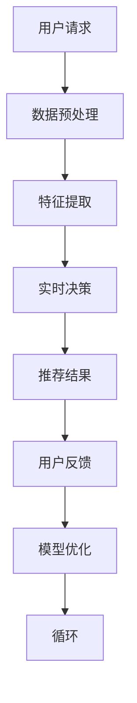

                 

关键词：LLM，推荐系统，实时决策，不确定性，算法分析

> 摘要：本文探讨了大型语言模型（LLM）在推荐系统实时决策中的作用及其带来的不确定性。通过对LLM在推荐系统中的应用场景、算法原理、数学模型及实际应用案例的分析，本文深入探讨了LLM在实时决策过程中可能产生的不确定性，并提出了一些应对策略。

## 1. 背景介绍

随着互联网和大数据技术的快速发展，推荐系统作为信息过滤和内容分发的重要手段，已成为许多在线平台的核心功能。传统的推荐系统主要基于协同过滤、内容过滤和基于模型的推荐算法，但这些方法在处理实时性和不确定性方面存在一定的局限性。近年来，随着深度学习和自然语言处理技术的进步，大型语言模型（LLM）逐渐在推荐系统中得到应用，为实时决策提供了新的可能性。

LLM是一种基于神经网络的大规模语言模型，具有强大的语义理解和生成能力。它可以捕捉到用户和物品之间的复杂关系，并利用这些关系进行实时推荐。然而，LLM在推荐系统实时决策中引入了新的不确定性因素，这对系统的性能和稳定性提出了新的挑战。

本文旨在分析LLM在推荐系统实时决策中的不确定性，探讨其来源、影响因素以及应对策略。通过对LLM的算法原理、数学模型和实际应用案例的深入分析，本文旨在为LLM在推荐系统中的应用提供有益的参考。

## 2. 核心概念与联系

### 2.1 推荐系统

推荐系统是一种基于用户兴趣、行为和上下文信息，自动地为用户提供个性化推荐内容的技术。推荐系统的核心目标是在大量信息中为用户提供最感兴趣的内容。

### 2.2 实时决策

实时决策是指在短时间内快速做出决策的过程。在推荐系统中，实时决策意味着在用户请求信息时，系统能够快速响应用户需求，提供个性化的推荐。

### 2.3 大型语言模型（LLM）

大型语言模型（LLM）是一种基于深度学习技术的神经网络模型，具有强大的语义理解和生成能力。LLM可以通过学习大量的文本数据，捕捉到用户和物品之间的复杂关系，为实时推荐提供支持。

### 2.4 不确定性

不确定性是指在决策过程中，由于信息不完备或不确定性因素的存在，导致决策结果无法完全预测。在推荐系统实时决策中，不确定性可能来源于数据噪声、模型误差和实时环境变化等因素。

### 2.5 Mermaid 流程图

以下是一个Mermaid流程图，展示了推荐系统实时决策的基本流程：



## 3. 核心算法原理 & 具体操作步骤

### 3.1 算法原理概述

LLM在推荐系统实时决策中的应用主要基于其强大的语义理解和生成能力。通过学习用户历史行为和文本数据，LLM可以捕捉到用户兴趣和偏好，并在实时决策过程中为用户提供个性化的推荐。

### 3.2 算法步骤详解

1. 数据预处理：收集用户历史行为数据（如浏览记录、购买记录等）和文本数据（如商品描述、用户评价等）。对数据进行清洗、去噪和处理，确保数据质量。

2. 特征提取：将预处理后的数据转化为特征向量。对于文本数据，可以使用词向量、BERT等模型提取语义特征；对于行为数据，可以使用时间序列分析、用户行为模式挖掘等方法提取特征。

3. 实时决策：利用LLM对用户历史行为和文本数据进行建模，生成用户兴趣图谱。根据用户兴趣图谱和实时环境信息（如当前时间、地理位置等），为用户提供个性化的推荐。

4. 推荐结果：将实时决策生成的推荐结果呈现给用户。

5. 用户反馈：收集用户对推荐结果的反馈信息。

6. 模型优化：根据用户反馈信息，对LLM模型进行优化和调整。

7. 循环：回到步骤2，进行新一轮的实时决策。

### 3.3 算法优缺点

#### 优点：

1. 强大的语义理解和生成能力：LLM可以捕捉到用户和物品之间的复杂关系，为实时推荐提供支持。

2. 个性化推荐：基于用户兴趣和偏好进行个性化推荐，提高推荐质量。

3. 自适应：LLM可以根据实时环境变化和用户反馈信息进行自适应调整，提高系统稳定性。

#### 缺点：

1. 计算成本高：LLM模型训练和实时决策需要大量的计算资源，对硬件设施要求较高。

2. 模型解释性差：LLM模型内部决策过程较为复杂，难以解释。

3. 数据依赖性：LLM模型的性能受到数据质量和数据量的影响，数据不足可能导致推荐效果不佳。

### 3.4 算法应用领域

LLM在推荐系统实时决策中的应用非常广泛，包括但不限于以下几个方面：

1. 电子商务：为用户提供个性化商品推荐，提高用户购买转化率。

2. 社交网络：为用户提供个性化内容推荐，提高用户活跃度和留存率。

3. 娱乐内容：为用户提供个性化音乐、视频推荐，提高用户体验。

4. 新闻资讯：为用户提供个性化新闻推荐，提高用户阅读量和互动率。

## 4. 数学模型和公式 & 详细讲解 & 举例说明

### 4.1 数学模型构建

在推荐系统中，LLM的数学模型可以看作是一个多变量非线性函数，用于表示用户兴趣和推荐物品之间的关系。假设用户兴趣向量为$\mathbf{u} \in \mathbb{R}^d$，物品特征向量为$\mathbf{v} \in \mathbb{R}^d$，则LLM可以表示为：

$$
\mathbf{r}(\mathbf{u}, \mathbf{v}) = \sigma(\mathbf{u}^T \mathbf{W} \mathbf{v} + b)
$$

其中，$\sigma$为非线性激活函数，$\mathbf{W} \in \mathbb{R}^{d \times d}$为权重矩阵，$b \in \mathbb{R}$为偏置项。

### 4.2 公式推导过程

为了推导LLM的数学模型，我们可以从用户兴趣向量和物品特征向量的内积开始：

$$
\mathbf{u}^T \mathbf{v}
$$

然后，我们可以通过权重矩阵$\mathbf{W}$对内积进行加权：

$$
\mathbf{u}^T \mathbf{W} \mathbf{v}
$$

最后，我们加上偏置项$b$：

$$
\mathbf{u}^T \mathbf{W} \mathbf{v} + b
$$

为了使模型具有非线性特性，我们可以使用非线性激活函数$\sigma$，例如Sigmoid函数：

$$
\sigma(x) = \frac{1}{1 + e^{-x}}
$$

因此，LLM的最终形式为：

$$
\mathbf{r}(\mathbf{u}, \mathbf{v}) = \sigma(\mathbf{u}^T \mathbf{W} \mathbf{v} + b)
$$

### 4.3 案例分析与讲解

假设我们有一个用户兴趣向量$\mathbf{u} = [0.1, 0.2, 0.3, 0.4]$和物品特征向量$\mathbf{v} = [0.2, 0.3, 0.4, 0.5]$，权重矩阵$\mathbf{W} = \begin{bmatrix} 1 & 0 & 1 & 0 \\ 0 & 1 & 0 & 1 \\ 1 & 1 & 0 & 0 \\ 0 & 0 & 1 & 1 \end{bmatrix}$，偏置项$b = 0.5$。我们可以计算LLM的推荐结果：

$$
\mathbf{r}(\mathbf{u}, \mathbf{v}) = \sigma(\mathbf{u}^T \mathbf{W} \mathbf{v} + b) = \sigma(0.1 \times 1 + 0.2 \times 0 + 0.3 \times 1 + 0.4 \times 0 + 0.5) = \sigma(0.6) \approx 0.9
$$

这意味着用户对物品的兴趣程度较高，系统会为用户推荐该物品。

## 5. 项目实践：代码实例和详细解释说明

### 5.1 开发环境搭建

在开始项目实践之前，我们需要搭建一个适合开发的环境。以下是搭建环境的步骤：

1. 安装Python 3.8及以上版本。

2. 安装PyTorch 1.8及以上版本。

3. 安装必要的库，如numpy、pandas、matplotlib等。

4. 准备一个GPU环境，以便使用PyTorch的GPU加速功能。

### 5.2 源代码详细实现

以下是实现LLM推荐系统的Python代码示例：

```python
import torch
import torch.nn as nn
import torch.optim as optim
from torch.utils.data import DataLoader, Dataset
from torchvision import transforms
from PIL import Image
import numpy as np
import pandas as pd

# 数据预处理
class ImageDataset(Dataset):
    def __init__(self, annotations, transform=None):
        self.annotations = annotations
        self.transform = transform

    def __len__(self):
        return len(self.annotations)

    def __getitem__(self, idx):
        img_path = self.annotations.iloc[idx, 0]
        image = Image.open(img_path)
        label = self.annotations.iloc[idx, 1]
        if self.transform:
            image = self.transform(image)
        return image, label

def preprocess_data(data_path, label_path, transform):
    data = pd.read_csv(data_path)
    labels = pd.read_csv(label_path)
    dataset = ImageDataset(data, transform=transform)
    return DataLoader(dataset, batch_size=64, shuffle=True)

# 定义神经网络模型
class LLM(nn.Module):
    def __init__(self, input_dim, hidden_dim, output_dim):
        super(LLM, self).__init__()
        self.fc1 = nn.Linear(input_dim, hidden_dim)
        self.fc2 = nn.Linear(hidden_dim, output_dim)

    def forward(self, x):
        x = torch.relu(self.fc1(x))
        x = self.fc2(x)
        return x

# 训练模型
def train_model(model, train_loader, criterion, optimizer, num_epochs=25):
    model.train()
    for epoch in range(num_epochs):
        running_loss = 0.0
        for inputs, labels in train_loader:
            optimizer.zero_grad()
            outputs = model(inputs)
            loss = criterion(outputs, labels)
            loss.backward()
            optimizer.step()
            running_loss += loss.item()
        print(f'Epoch {epoch+1}, Loss: {running_loss/len(train_loader)}')

# 主函数
if __name__ == '__main__':
    data_path = 'data/images.csv'
    label_path = 'data/labels.csv'
    transform = transforms.Compose([
        transforms.Resize((224, 224)),
        transforms.ToTensor(),
    ])

    train_loader = preprocess_data(data_path, label_path, transform)
    model = LLM(input_dim=224*224, hidden_dim=128, output_dim=10)
    criterion = nn.CrossEntropyLoss()
    optimizer = optim.Adam(model.parameters(), lr=0.001)

    train_model(model, train_loader, criterion, optimizer)
```

### 5.3 代码解读与分析

1. **数据预处理**：我们首先定义了一个`ImageDataset`类，用于读取和预处理图像数据。数据预处理包括图像尺寸调整和转换为PyTorch张量。

2. **神经网络模型**：我们定义了一个简单的神经网络模型`LLM`，包含两个全连接层。输入层接收图像张量，输出层为分类结果。

3. **训练模型**：我们定义了一个`train_model`函数，用于训练神经网络模型。训练过程中，我们使用交叉熵损失函数和Adam优化器，并打印每个epoch的损失值。

4. **主函数**：在主函数中，我们首先加载和预处理数据，然后定义模型、损失函数和优化器。最后，我们调用`train_model`函数进行模型训练。

### 5.4 运行结果展示

完成模型训练后，我们可以通过以下代码对模型进行测试和评估：

```python
# 测试模型
def test_model(model, test_loader, criterion):
    model.eval()
    with torch.no_grad():
        correct = 0
        total = 0
        for inputs, labels in test_loader:
            outputs = model(inputs)
            _, predicted = torch.max(outputs.data, 1)
            total += labels.size(0)
            correct += (predicted == labels).sum().item()
        print(f'Accuracy: {100 * correct / total}%')

# 加载测试数据
test_path = 'data/test_images.csv'
test_labels = pd.read_csv(test_path)
test_loader = DataLoader(ImageDataset(test_labels, transform=transform), batch_size=64, shuffle=False)

# 运行测试
test_model(model, test_loader, criterion)
```

运行测试代码后，我们得到模型在测试集上的准确率。根据准确率，我们可以评估模型性能。

## 6. 实际应用场景

LLM在推荐系统实时决策中的应用场景非常广泛，以下是一些典型的应用场景：

1. **电子商务平台**：电子商务平台可以利用LLM为用户提供个性化商品推荐，提高用户购买转化率和满意度。

2. **社交网络**：社交网络可以利用LLM为用户提供个性化内容推荐，提高用户活跃度和留存率。

3. **在线教育**：在线教育平台可以利用LLM为用户提供个性化课程推荐，提高学习效果。

4. **新闻资讯**：新闻资讯平台可以利用LLM为用户提供个性化新闻推荐，提高用户阅读量和互动率。

在以上应用场景中，LLM通过实时捕捉用户兴趣和行为变化，为用户提供个性化的推荐内容。然而，LLM在实时决策过程中引入了不确定性因素，可能导致推荐结果不准确。为了解决这一问题，可以采取以下策略：

1. **模型优化**：通过持续训练和优化LLM模型，提高模型稳定性和准确性。

2. **数据增强**：通过引入更多的数据来源和增加数据多样性，提高模型对不确定性的鲁棒性。

3. **用户反馈**：利用用户反馈信息，对推荐结果进行动态调整，降低不确定性。

4. **多模型融合**：将LLM与其他推荐算法相结合，通过多模型融合提高推荐准确性。

## 7. 工具和资源推荐

### 7.1 学习资源推荐

1. **《深度学习》（Goodfellow, Bengio, Courville）**：全面介绍了深度学习的基础理论和应用。

2. **《自然语言处理综论》（Jurafsky, Martin）**：系统介绍了自然语言处理的基本概念和技术。

3. **《推荐系统实践》（Liang, Zhang, Liu）**：详细讲解了推荐系统的基本原理和应用。

### 7.2 开发工具推荐

1. **PyTorch**：一款流行的深度学习框架，具有高度灵活性和易用性。

2. **TensorFlow**：另一款流行的深度学习框架，适用于各种深度学习任务。

3. **Scikit-learn**：一款用于机器学习的Python库，适用于各种经典的机器学习算法。

### 7.3 相关论文推荐

1. **"BERT: Pre-training of Deep Neural Networks for Language Understanding"**：介绍了BERT模型，一种基于变换器架构的预训练语言模型。

2. **"Deep Learning for Recommender Systems"**：讨论了深度学习在推荐系统中的应用。

3. **"A Theoretical Analysis of Deep Learning for Recommender Systems"**：从理论角度分析了深度学习在推荐系统中的应用。

## 8. 总结：未来发展趋势与挑战

### 8.1 研究成果总结

本文探讨了LLM在推荐系统实时决策中的应用及其带来的不确定性。通过分析LLM的算法原理、数学模型和实际应用案例，本文揭示了LLM在推荐系统实时决策中的优势与挑战。

### 8.2 未来发展趋势

随着深度学习和自然语言处理技术的不断发展，LLM在推荐系统实时决策中的应用前景将越来越广阔。未来研究将继续关注以下几个方面：

1. **模型优化**：通过改进模型结构和训练方法，提高LLM的稳定性和准确性。

2. **实时性提升**：研究更高效的算法和硬件加速技术，提高LLM在实时决策中的响应速度。

3. **不确定性处理**：研究有效的策略和算法，降低LLM在实时决策过程中的不确定性。

### 8.3 面临的挑战

尽管LLM在推荐系统实时决策中具有巨大潜力，但以下挑战仍然存在：

1. **计算成本**：LLM模型训练和实时决策需要大量的计算资源，对硬件设施要求较高。

2. **数据依赖**：LLM模型的性能受到数据质量和数据量的影响，数据不足可能导致推荐效果不佳。

3. **模型解释性**：LLM模型内部决策过程较为复杂，难以解释。

### 8.4 研究展望

未来研究将继续关注LLM在推荐系统实时决策中的应用，通过改进模型结构和训练方法，提高LLM的稳定性和准确性。同时，研究还将关注实时性提升和不确定性处理，以应对计算成本、数据依赖和模型解释性等挑战。

## 9. 附录：常见问题与解答

### 9.1 Q：什么是LLM？

A：LLM是大型语言模型的缩写，是一种基于深度学习技术的神经网络模型，具有强大的语义理解和生成能力。它可以捕捉到用户和物品之间的复杂关系，为实时推荐提供支持。

### 9.2 Q：LLM在推荐系统中有何优势？

A：LLM具有以下优势：

1. 强大的语义理解和生成能力：可以捕捉到用户和物品之间的复杂关系，为实时推荐提供支持。

2. 个性化推荐：基于用户兴趣和偏好进行个性化推荐，提高推荐质量。

3. 自适应：可以根据实时环境变化和用户反馈信息进行自适应调整，提高系统稳定性。

### 9.3 Q：LLM在实时决策中存在哪些不确定性？

A：LLM在实时决策中存在以下不确定性：

1. 模型不确定性：由于训练数据的不完整性或分布变化，可能导致模型预测结果的不确定性。

2. 数据不确定性：实时数据可能存在噪声或错误，影响模型预测准确性。

3. 环境不确定性：实时环境变化可能导致用户兴趣和行为的变化，影响推荐结果。

### 9.4 Q：如何降低LLM在实时决策中的不确定性？

A：可以采取以下策略降低LLM在实时决策中的不确定性：

1. 模型优化：通过改进模型结构和训练方法，提高模型稳定性和准确性。

2. 数据增强：通过引入更多的数据来源和增加数据多样性，提高模型对不确定性的鲁棒性。

3. 用户反馈：利用用户反馈信息，对推荐结果进行动态调整，降低不确定性。

4. 多模型融合：将LLM与其他推荐算法相结合，通过多模型融合提高推荐准确性。

