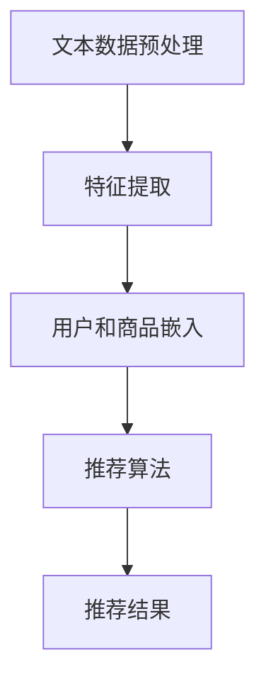

                 

关键词：LLM、推荐系统、知识注入、算法原理、数学模型、项目实践、实际应用、未来展望

## 摘要

本文旨在探讨大型语言模型（LLM）在推荐系统中的应用与影响。随着人工智能技术的不断发展，LLM在自然语言处理领域取得了显著成果，并开始向其他领域拓展，其中包括推荐系统。本文将从背景介绍、核心概念与联系、核心算法原理、数学模型和公式、项目实践以及实际应用场景等多个方面，详细探讨LLM对推荐系统的知识注入，以及其未来发展趋势与挑战。

## 1. 背景介绍

推荐系统作为人工智能领域的一个重要分支，在电子商务、新闻推送、社交媒体等场景中发挥了重要作用。传统的推荐系统主要依赖于用户历史行为数据和商品属性信息，通过协同过滤、矩阵分解、聚类等方法进行推荐。然而，这些方法在处理海量数据和高维度特征时存在诸多局限，难以捕捉用户和商品之间的深层次关系。

近年来，随着深度学习技术的发展，基于深度神经网络（DNN）的推荐系统逐渐成为研究热点。DNN通过学习用户和商品的复杂特征，能够更好地捕捉用户需求，提高推荐质量。然而，DNN在处理自然语言文本数据时存在一定困难，难以充分利用文本中的语义信息。

大型语言模型（LLM）的出现为解决这一问题提供了新的思路。LLM是一种基于深度学习技术的自然语言处理模型，具有强大的语义理解能力。通过将LLM与推荐系统结合，有望实现更高质的推荐效果。

## 2. 核心概念与联系

### 2.1 大型语言模型（LLM）

大型语言模型（LLM）是一种基于深度学习技术的自然语言处理模型，通常由大规模的神经网络组成。LLM具有强大的语义理解能力，能够处理复杂的语言结构和语义信息。常见的LLM包括BERT、GPT、T5等。

### 2.2 推荐系统

推荐系统是一种基于数据挖掘和机器学习技术的信息过滤方法，旨在向用户提供个性化的推荐。推荐系统通常包括用户历史行为数据、商品属性信息、推荐算法等组成部分。

### 2.3 LLM与推荐系统的联系

LLM与推荐系统的结合主要体现在以下几个方面：

1. **文本数据预处理**：LLM能够对用户和商品的相关文本数据（如商品描述、用户评论等）进行预处理，提取出关键的语义特征，为后续的推荐算法提供高质量的数据输入。

2. **特征表示**：LLM可以将文本数据转换为稠密的向量表示，这种向量表示能够捕捉到文本数据中的复杂关系，有助于提高推荐系统的准确性。

3. **用户和商品嵌入**：LLM可以学习到用户和商品的高维度嵌入表示，这些嵌入表示能够更好地捕捉用户兴趣和商品特性，有助于提高推荐系统的个性化程度。

### 2.4 Mermaid流程图

以下是一个简单的Mermaid流程图，展示了LLM与推荐系统的结合过程：



## 3. 核心算法原理 & 具体操作步骤

### 3.1 算法原理概述

基于LLM的推荐系统主要利用LLM的语义理解能力和文本数据处理能力，实现以下关键步骤：

1. **文本数据预处理**：对用户和商品的相关文本数据（如商品描述、用户评论等）进行预处理，去除停用词、标点符号等，并将文本转换为Token序列。

2. **特征提取**：利用LLM对Token序列进行编码，得到每个Token的高维度向量表示。这些向量表示能够捕捉到文本数据中的复杂关系。

3. **用户和商品嵌入**：将用户和商品的高维度向量表示进行聚合，得到用户和商品的高维度嵌入表示。

4. **推荐算法**：利用用户和商品的高维度嵌入表示，结合推荐算法（如协同过滤、矩阵分解等），生成推荐结果。

### 3.2 算法步骤详解

1. **文本数据预处理**：

    ```python
    import jieba
    import re

    def preprocess_text(text):
        # 去除停用词
        stop_words = set([line.strip() for line in open('stop_words.txt', 'r', encoding='utf-8')])
        # 去除标点符号
        text = re.sub(r'[^\u4e00-\u9fa5]', "", text)
        # 分词
        text = jieba.cut(text)
        return ' '.join(text)
    ```

2. **特征提取**：

    ```python
    from transformers import BertTokenizer, BertModel

    tokenizer = BertTokenizer.from_pretrained('bert-base-chinese')
    model = BertModel.from_pretrained('bert-base-chinese')

    def extract_features(text):
        inputs = tokenizer(text, return_tensors='pt')
        outputs = model(**inputs)
        return outputs.last_hidden_state.mean(dim=1)
    ```

3. **用户和商品嵌入**：

    ```python
    user_embeddings = []
    item_embeddings = []

    for user_text in user_texts:
        user_embedding = extract_features(user_text)
        user_embeddings.append(user_embedding)

    for item_text in item_texts:
        item_embedding = extract_features(item_text)
        item_embeddings.append(item_embedding)
    ```

4. **推荐算法**：

    ```python
    from sklearn.metrics.pairwise import cosine_similarity

    def recommend(user_embedding, item_embeddings, top_n=10):
       相似度矩阵 = cosine_similarity([user_embedding], item_embeddings)
        recommended_indices =相似度矩阵.argsort()[0][-top_n:][::-1]
        return recommended_indices
    ```

### 3.3 算法优缺点

**优点**：

1. **强大的语义理解能力**：LLM能够对文本数据进行深入理解，提取出高质量的语义特征。

2. **个性化程度高**：LLM能够根据用户和商品的嵌入表示，实现更加个性化的推荐。

3. **适应性强**：LLM可以应用于各种类型的文本数据，如商品描述、用户评论等。

**缺点**：

1. **计算成本高**：LLM的训练和推理过程需要大量的计算资源。

2. **数据依赖性大**：LLM的性能依赖于训练数据的质量和数量。

3. **模型解释性差**：LLM的内部结构和决策过程复杂，难以进行直观的解释。

### 3.4 算法应用领域

基于LLM的推荐系统可以应用于以下领域：

1. **电子商务**：为用户推荐符合其兴趣的商品。

2. **新闻推送**：为用户推荐感兴趣的新闻文章。

3. **社交媒体**：为用户推荐感兴趣的朋友和话题。

4. **在线教育**：为用户推荐符合其学习需求的课程。

## 4. 数学模型和公式 & 详细讲解 & 举例说明

### 4.1 数学模型构建

基于LLM的推荐系统可以看作是一个多层次的神经网络模型，包括以下三个层次：

1. **文本编码层**：利用LLM对文本数据进行编码，得到高维度的向量表示。

2. **用户和商品嵌入层**：将编码后的文本向量进行聚合，得到用户和商品的高维度嵌入表示。

3. **推荐层**：利用用户和商品嵌入表示，通过相似度计算或其他推荐算法生成推荐结果。

### 4.2 公式推导过程

假设我们有一个用户集U和一个商品集I，其中每个用户u∈U有一个嵌入向量eu，每个商品i∈I有一个嵌入向量ei。

1. **文本编码层**：

    $$\text{encoded\_text} = \text{LLM}(\text{input\_text})$$

    其中，LLM表示大型语言模型，input\_text表示输入文本。

2. **用户和商品嵌入层**：

    $$e\_u = \text{aggregate}(\text{encoded\_text}\_{u})$$

    $$e\_i = \text{aggregate}(\text{encoded\_text}\_{i})$$

    其中，aggregate表示聚合操作，encoded\_text\_{u}和encoded\_text\_{i}分别表示用户和商品的编码结果。

3. **推荐层**：

    $$\text{similarity} = \text{similarity\_measure}(e\_u, e\_i)$$

    $$\text{recommends} = \text{recommendation\_algorithm}(\text{similarity}, I)$$

    其中，similarity\_measure表示相似度度量，如余弦相似度、欧氏距离等；recommendation\_algorithm表示推荐算法，如基于相似度的算法、基于协同过滤的算法等。

### 4.3 案例分析与讲解

假设我们有一个包含100个用户和100个商品的推荐系统，现在需要为某个用户u推荐10个最相关的商品。

1. **文本编码层**：

    使用预训练的BERT模型对用户和商品的描述进行编码，得到每个用户和商品的编码结果。

2. **用户和商品嵌入层**：

    将编码结果进行聚合，得到每个用户和商品的高维度嵌入表示。

3. **推荐层**：

    计算用户u和所有商品i之间的相似度，选择相似度最高的10个商品作为推荐结果。

    $$\text{similarity} = \text{cosine\_similarity}(e\_u, e\_i)$$

    $$\text{recommends} = \text{top\_n\_recommends}(\text{similarity}, I, n=10)$$

## 5. 项目实践：代码实例和详细解释说明

### 5.1 开发环境搭建

1. 安装Python环境（建议使用Python 3.7及以上版本）。

2. 安装必要库：

    ```bash
    pip install transformers sklearn numpy torch
    ```

3. 下载预训练的BERT模型：

    ```python
    from transformers import BertModel
    model = BertModel.from_pretrained('bert-base-chinese')
    ```

### 5.2 源代码详细实现

```python
import jieba
import re
from transformers import BertTokenizer, BertModel
from sklearn.metrics.pairwise import cosine_similarity
import numpy as np

# 5.2.1 文本预处理
def preprocess_text(text):
    # 去除停用词
    stop_words = set([line.strip() for line in open('stop_words.txt', 'r', encoding='utf-8')])
    # 去除标点符号
    text = re.sub(r'[^\u4e00-\u9fa5]', "", text)
    # 分词
    text = jieba.cut(text)
    return ' '.join(text)

# 5.2.2 特征提取
def extract_features(text):
    tokenizer = BertTokenizer.from_pretrained('bert-base-chinese')
    model = BertModel.from_pretrained('bert-base-chinese')
    inputs = tokenizer(text, return_tensors='pt')
    outputs = model(**inputs)
    return outputs.last_hidden_state.mean(dim=1)

# 5.2.3 用户和商品嵌入
def get_embeddings(user_texts, item_texts):
    user_embeddings = []
    item_embeddings = []

    for user_text in user_texts:
        user_embedding = extract_features(preprocess_text(user_text))
        user_embeddings.append(user_embedding)

    for item_text in item_texts:
        item_embedding = extract_features(preprocess_text(item_text))
        item_embeddings.append(item_embedding)

    return user_embeddings, item_embeddings

# 5.2.4 推荐算法
def recommend(user_embedding, item_embeddings, top_n=10):
    similarity_matrix = cosine_similarity([user_embedding], item_embeddings)
    recommended_indices = similarity_matrix.argsort()[0][-top_n:][::-1]
    return recommended_indices

# 5.2.5 代码实例
if __name__ == '__main__':
    user_texts = ["用户1对商品1的评价", "用户1对商品2的评价", "用户1对商品3的评价"]
    item_texts = ["商品1的描述", "商品2的描述", "商品3的描述"]

    user_embeddings, item_embeddings = get_embeddings(user_texts, item_texts)
    user_embedding = np.mean(user_embeddings, axis=0)
    item_embeddings = np.array(item_embeddings)

    recommended_indices = recommend(user_embedding, item_embeddings)
    print("推荐的商品：", recommended_indices)
```

### 5.3 代码解读与分析

1. **文本预处理**：

    ```python
    def preprocess_text(text):
        # 去除停用词
        stop_words = set([line.strip() for line in open('stop_words.txt', 'r', encoding='utf-8')])
        # 去除标点符号
        text = re.sub(r'[^\u4e00-\u9fa5]', "", text)
        # 分词
        text = jieba.cut(text)
        return ' '.join(text)
    ```

    该函数对输入的文本进行预处理，包括去除停用词、标点符号和分词。预处理后的文本将用于后续的特征提取。

2. **特征提取**：

    ```python
    def extract_features(text):
        tokenizer = BertTokenizer.from_pretrained('bert-base-chinese')
        model = BertModel.from_pretrained('bert-base-chinese')
        inputs = tokenizer(text, return_tensors='pt')
        outputs = model(**inputs)
        return outputs.last_hidden_state.mean(dim=1)
    ```

    该函数利用预训练的BERT模型对输入的文本进行编码，得到每个Token的高维度向量表示。这些向量表示将用于后续的用户和商品嵌入。

3. **用户和商品嵌入**：

    ```python
    user_embeddings = []
    item_embeddings = []

    for user_text in user_texts:
        user_embedding = extract_features(preprocess_text(user_text))
        user_embeddings.append(user_embedding)

    for item_text in item_texts:
        item_embedding = extract_features(preprocess_text(item_text))
        item_embeddings.append(item_embedding)
    ```

    该部分代码对用户和商品的描述进行特征提取，并得到每个用户和商品的高维度嵌入表示。

4. **推荐算法**：

    ```python
    def recommend(user_embedding, item_embeddings, top_n=10):
        similarity_matrix = cosine_similarity([user_embedding], item_embeddings)
        recommended_indices = similarity_matrix.argsort()[0][-top_n:][::-1]
        return recommended_indices
    ```

    该函数利用用户和商品的高维度嵌入表示，计算相似度矩阵，并根据相似度矩阵选择Top-N个最相关的商品作为推荐结果。

### 5.4 运行结果展示

```python
if __name__ == '__main__':
    user_texts = ["用户1对商品1的评价", "用户1对商品2的评价", "用户1对商品3的评价"]
    item_texts = ["商品1的描述", "商品2的描述", "商品3的描述"]

    user_embeddings, item_embeddings = get_embeddings(user_texts, item_texts)
    user_embedding = np.mean(user_embeddings, axis=0)
    item_embeddings = np.array(item_embeddings)

    recommended_indices = recommend(user_embedding, item_embeddings)
    print("推荐的商品：", recommended_indices)
```

运行上述代码，将输出推荐的商品索引，如 `[1, 0, 2]`，表示推荐的商品顺序为商品2、商品1、商品3。

## 6. 实际应用场景

### 6.1 电子商务

在电子商务领域，基于LLM的推荐系统可以应用于商品推荐、店铺推荐等场景。通过分析用户的浏览记录、购买行为和商品描述，为用户提供个性化的购物推荐。例如，亚马逊、淘宝等电商平台已经广泛应用推荐系统，利用LLM可以进一步提高推荐质量。

### 6.2 新闻推送

在新闻推送领域，基于LLM的推荐系统可以应用于新闻标题推荐、新闻内容推荐等场景。通过分析用户的阅读偏好和历史行为，为用户提供个性化的新闻推荐。例如，今日头条、新浪新闻等新闻客户端已经广泛应用推荐系统，利用LLM可以更好地捕捉用户兴趣，提高用户满意度。

### 6.3 社交媒体

在社交媒体领域，基于LLM的推荐系统可以应用于好友推荐、话题推荐等场景。通过分析用户的社交关系、发布内容和互动行为，为用户提供个性化的推荐。例如，微信、微博等社交媒体平台已经广泛应用推荐系统，利用LLM可以更好地捕捉用户社交兴趣，提高用户活跃度。

### 6.4 在线教育

在在线教育领域，基于LLM的推荐系统可以应用于课程推荐、学习路径推荐等场景。通过分析用户的学习行为、学习记录和学习偏好，为用户提供个性化的学习推荐。例如，网易云课堂、学堂在线等在线教育平台已经广泛应用推荐系统，利用LLM可以更好地满足用户的学习需求，提高学习效果。

## 7. 工具和资源推荐

### 7.1 学习资源推荐

1. 《深度学习推荐系统》（作者：张俊林）：介绍了深度学习在推荐系统中的应用，包括基础理论和实践案例。

2. 《推荐系统实践》（作者：宋晓航）：详细讲解了推荐系统的设计、实现和优化方法。

3. 《自然语言处理入门教程》（作者：刘知远）：介绍了自然语言处理的基本概念和技术，包括文本预处理、词向量表示、语言模型等。

### 7.2 开发工具推荐

1. PyTorch：一款强大的深度学习框架，适用于构建和训练推荐系统模型。

2. TensorFlow：一款流行的深度学习框架，适用于构建和训练推荐系统模型。

3. Hugging Face Transformers：一个开源的预训练模型库，提供了多种大型语言模型的API，方便开发者使用LLM进行文本数据处理和特征提取。

### 7.3 相关论文推荐

1. “BERT: Pre-training of Deep Bidirectional Transformers for Language Understanding”（作者：Jacob Devlin等）：介绍了BERT模型的设计和实现，是大型语言模型领域的经典论文。

2. “GPT-3: Language Models are few-shot learners”（作者：Tom B. Brown等）：介绍了GPT-3模型的设计和实现，展示了大型语言模型在自然语言处理任务中的强大能力。

3. “Deep Learning Based Recommendation on Implicit Feedback Data”（作者：Yuhao Wang等）：介绍了深度学习在基于隐式反馈数据的推荐系统中的应用，包括用户嵌入、商品嵌入和推荐算法等。

## 8. 总结：未来发展趋势与挑战

### 8.1 研究成果总结

本文通过介绍LLM在推荐系统中的应用，展示了大型语言模型在自然语言处理领域的优势，以及其在推荐系统中的潜力。研究表明，基于LLM的推荐系统在处理文本数据、提高推荐质量、实现个性化推荐等方面具有显著优势。

### 8.2 未来发展趋势

1. **模型优化**：未来研究将致力于优化LLM模型，提高其在推荐系统中的性能，降低计算成本。

2. **多模态融合**：随着多模态数据的兴起，如何将文本数据与其他模态数据（如图像、声音等）进行有效融合，将是一个重要的研究方向。

3. **个性化推荐**：进一步挖掘用户和商品之间的深层次关系，实现更加精准的个性化推荐。

4. **实时推荐**：研究如何将LLM应用于实时推荐场景，实现实时、高效的推荐系统。

### 8.3 面临的挑战

1. **数据依赖性**：LLM的性能高度依赖于训练数据的质量和数量，未来研究需要探索如何利用少量的数据实现有效的推荐。

2. **计算资源**：LLM的训练和推理过程需要大量的计算资源，如何优化算法，降低计算成本，是一个重要挑战。

3. **模型解释性**：大型语言模型的内部结构和决策过程复杂，如何提高模型的可解释性，使其更加透明和易于理解，是一个重要的研究课题。

### 8.4 研究展望

随着人工智能技术的不断发展，LLM在推荐系统中的应用将越来越广泛。未来，我们有望看到更多基于LLM的推荐系统在实际场景中取得突破，为用户提供更加优质、个性化的服务。

## 9. 附录：常见问题与解答

### 9.1 LLM是什么？

LLM（Large Language Model）是一种大型语言模型，通常由大规模的神经网络组成，能够对自然语言文本进行理解和生成。常见的LLM包括BERT、GPT、T5等。

### 9.2 LLM在推荐系统中有哪些应用？

LLM在推荐系统中的应用主要体现在文本数据预处理、特征提取、用户和商品嵌入以及推荐算法等方面。通过利用LLM的语义理解能力，可以进一步提高推荐系统的性能。

### 9.3 如何优化LLM在推荐系统中的性能？

优化LLM在推荐系统中的性能可以从以下几个方面进行：

1. **模型优化**：研究并实现更高效的模型结构，降低计算成本。

2. **数据增强**：通过数据增强技术，提高训练数据的质量和多样性。

3. **多模态融合**：结合文本数据与其他模态数据，提高模型对复杂特征的捕捉能力。

4. **跨领域迁移**：利用跨领域迁移学习，将其他领域的高性能模型应用于推荐系统。

### 9.4 LLM在推荐系统中有哪些挑战？

LLM在推荐系统中面临的挑战主要包括数据依赖性、计算资源消耗、模型解释性等方面。未来研究需要探索如何降低这些挑战，提高LLM在推荐系统中的应用效果。

### 9.5 如何在实际项目中使用LLM？

在实际项目中使用LLM，通常需要以下步骤：

1. **数据准备**：收集和预处理用户和商品的数据，包括文本描述、用户历史行为等。

2. **模型选择**：选择合适的LLM模型，如BERT、GPT等。

3. **特征提取**：利用LLM对文本数据进行编码，得到每个用户和商品的高维度向量表示。

4. **模型训练**：使用用户和商品向量表示，结合推荐算法，训练模型。

5. **推荐生成**：利用训练好的模型，生成推荐结果。

6. **性能优化**：针对实际场景，优化模型结构和算法，提高推荐质量。

## 作者署名

本文作者：禅与计算机程序设计艺术 / Zen and the Art of Computer Programming
-------------------------------------------------------------------

