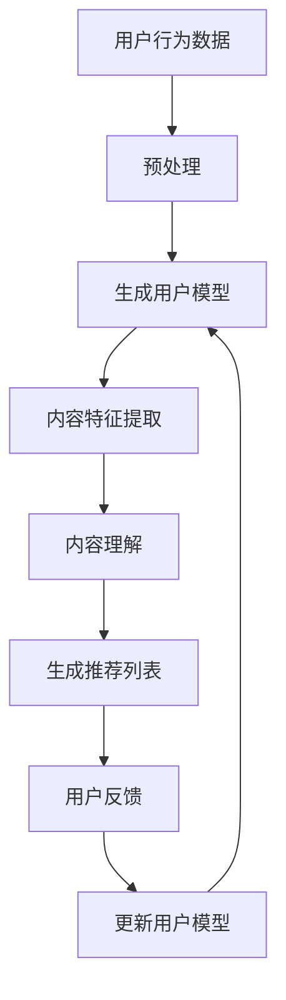
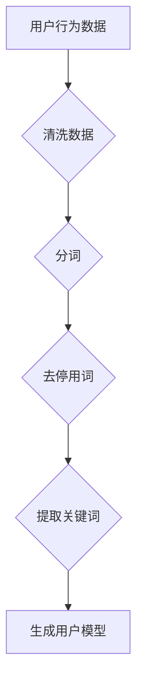
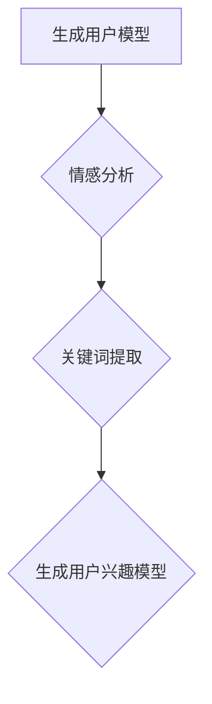
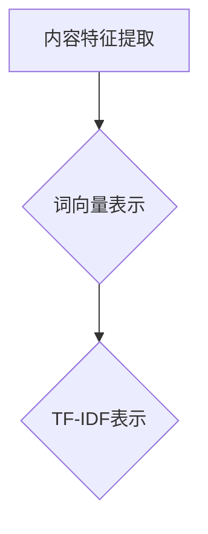
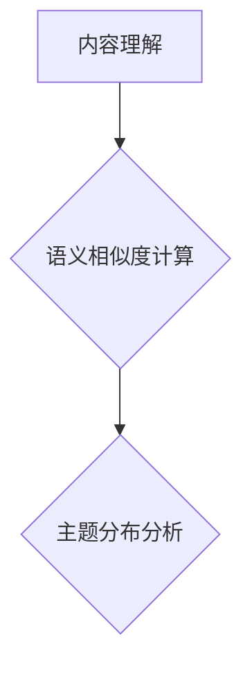
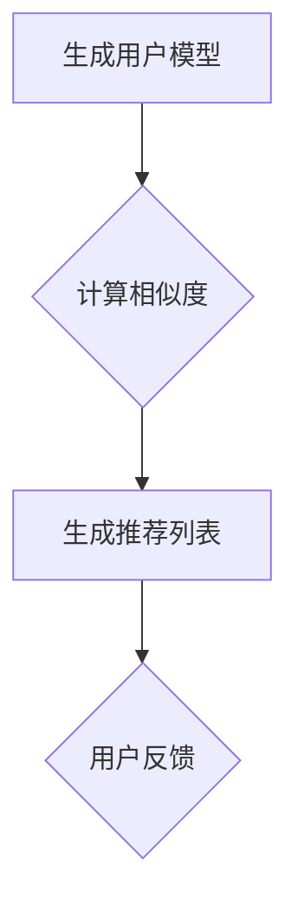
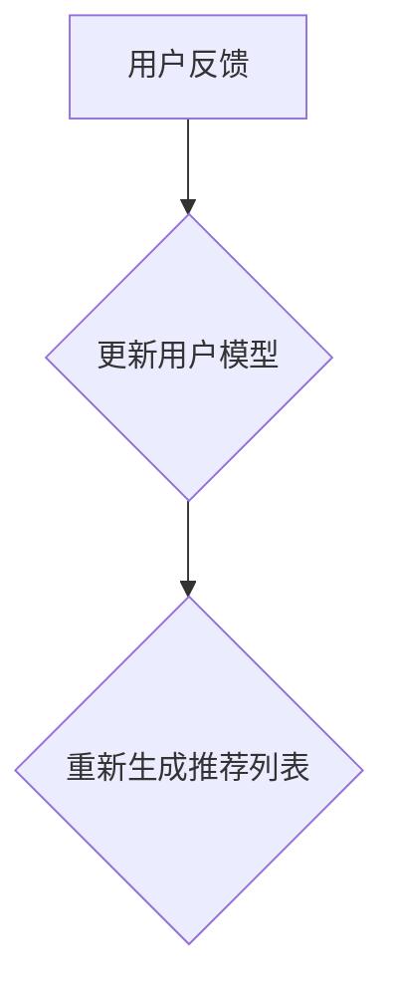

                 

关键词：自然语言处理（NLP）、长尾内容、推荐系统、大型语言模型（LLM）、内容挖掘、个性化推荐、用户行为分析

摘要：本文深入探讨了大型语言模型（LLM）在推荐系统中对长尾内容的挖掘策略。随着互联网内容的爆炸式增长，长尾内容占据了用户信息消费的主要部分。然而，传统的推荐系统往往难以充分挖掘和利用这些长尾内容。本文首先介绍了长尾内容的定义及其在推荐系统中的重要性，然后详细阐述了LLM在长尾内容挖掘中的应用，包括数据预处理、文本表示、内容理解与生成等环节。最后，本文通过案例分析展示了LLM在推荐系统中的实际效果，并展望了未来的发展趋势。

## 1. 背景介绍

随着互联网的快速发展，信息爆炸式增长，用户面对海量的内容时，如何快速、准确地获取感兴趣的信息成为一个亟待解决的问题。推荐系统作为一种信息过滤和检索的技术，通过分析用户的行为和偏好，为用户推荐符合其兴趣的内容，极大地提高了用户的信息获取效率。然而，传统的推荐系统往往侧重于热门内容，对于长尾内容（Long Tail Content）的挖掘和利用不足。

长尾内容是指那些在主流市场中并不流行，但总体上占有很大市场份额的内容。这些内容往往具有独特性、个性化，能够满足小众用户的需求。然而，由于长尾内容的分散性和低曝光度，传统的推荐系统难以对其进行有效的挖掘和推荐。

大型语言模型（LLM）的出现为推荐系统的长尾内容挖掘带来了新的契机。LLM具有强大的文本理解与生成能力，能够处理大量的非结构化数据，对长尾内容进行深度分析和理解。本文将探讨如何利用LLM来提高推荐系统对长尾内容的挖掘能力，从而实现更精准、个性化的推荐。

## 2. 核心概念与联系

### 2.1 长尾内容

长尾内容是指在主流市场中并不占据主导地位，但在总体上占有很大市场份额的内容。这些内容往往具有以下特点：

- **分散性**：长尾内容分布广泛，散落在不同的细分领域中。
- **个性化**：长尾内容往往更能满足特定用户群体的个性化需求。
- **低曝光度**：由于缺乏推广和曝光，长尾内容往往难以被用户发现。

### 2.2 推荐系统

推荐系统是一种基于用户行为数据和信息内容，利用算法和统计模型为用户提供个性化推荐的技术。推荐系统通常包含以下几个核心组成部分：

- **用户模型**：用于描述用户的行为和偏好。
- **内容模型**：用于描述信息内容的特征和属性。
- **推荐算法**：用于计算用户与内容之间的相似度，生成推荐列表。

### 2.3 大型语言模型（LLM）

大型语言模型是一种基于深度学习的自然语言处理（NLP）模型，具有强大的文本理解和生成能力。LLM通过预训练和微调，能够从大量非结构化文本数据中提取知识，理解和生成自然语言文本。LLM在推荐系统中的应用主要包括：

- **文本预处理**：对用户生成的内容进行预处理，提取关键信息。
- **内容理解**：对长尾内容进行深度理解，提取潜在特征。
- **文本生成**：生成个性化的推荐描述，提升用户体验。

### 2.4 Mermaid 流程图

以下是一个用于描述LLM在推荐系统中应用的Mermaid流程图：



## 3. 核心算法原理 & 具体操作步骤

### 3.1 算法原理概述

LLM在推荐系统中的核心作用是通过对用户生成的内容进行深度理解和分析，挖掘出长尾内容的潜在特征，从而实现更精准的个性化推荐。具体原理如下：

1. **用户行为数据预处理**：对用户生成的内容进行清洗、分词、去停用词等操作，提取关键信息。
2. **生成用户模型**：利用LLM对用户生成的内容进行情感分析、关键词提取等操作，构建用户兴趣模型。
3. **内容特征提取**：对长尾内容进行预处理，提取文本特征，如词向量、TF-IDF等。
4. **内容理解**：利用LLM对长尾内容进行深度理解，提取潜在特征，如语义相似度、主题分布等。
5. **生成推荐列表**：基于用户兴趣模型和内容特征，计算用户与内容的相似度，生成个性化推荐列表。
6. **用户反馈与模型更新**：收集用户对推荐内容的反馈，更新用户兴趣模型，提高推荐精度。

### 3.2 算法步骤详解

#### 3.2.1 用户行为数据预处理



1. **清洗数据**：去除数据中的噪声和无关信息，如HTML标签、特殊符号等。
2. **分词**：将文本拆分成单词或词组。
3. **去停用词**：去除常见的不具有实际意义的单词，如“的”、“了”、“在”等。
4. **提取关键词**：提取文本中的关键信息，用于构建用户兴趣模型。

#### 3.2.2 生成用户模型



1. **情感分析**：对用户生成的内容进行情感分析，提取情感倾向。
2. **关键词提取**：提取文本中的关键词，用于描述用户的兴趣。
3. **生成用户兴趣模型**：将情感分析和关键词提取的结果整合，构建用户兴趣模型。

#### 3.2.3 内容特征提取



1. **词向量表示**：将文本转换为词向量，用于表示文本的语义信息。
2. **TF-IDF表示**：计算文本中每个词的重要程度，用于表示文本的特征。

#### 3.2.4 内容理解



1. **语义相似度计算**：利用LLM计算长尾内容之间的语义相似度。
2. **主题分布分析**：利用LLM分析长尾内容的主要主题，提取潜在特征。

#### 3.2.5 生成推荐列表



1. **计算相似度**：基于用户兴趣模型和内容特征，计算用户与内容的相似度。
2. **生成推荐列表**：根据相似度分数生成个性化推荐列表。
3. **用户反馈**：收集用户对推荐内容的反馈，用于更新用户兴趣模型。

#### 3.2.6 用户反馈与模型更新



1. **更新用户模型**：根据用户反馈调整用户兴趣模型。
2. **重新生成推荐列表**：利用更新后的用户模型生成新的推荐列表。

### 3.3 算法优缺点

#### 优点

- **强大的文本理解能力**：LLM能够对长尾内容进行深度理解和分析，提取潜在特征。
- **个性化推荐**：基于用户兴趣模型和内容特征，生成更精准、个性化的推荐列表。
- **适应性强**：LLM能够处理不同领域、不同类型的文本数据，适应多种应用场景。

#### 缺点

- **计算成本高**：LLM的模型训练和推理需要大量的计算资源。
- **数据依赖性**：推荐系统的效果依赖于用户生成的内容和数据质量。
- **安全性问题**：用户生成的内容可能包含敏感信息，需要确保数据安全和隐私保护。

### 3.4 算法应用领域

LLM在推荐系统中的应用非常广泛，主要包括以下领域：

- **电子商务**：为用户提供个性化的商品推荐。
- **社交媒体**：为用户提供感兴趣的内容推荐。
- **在线教育**：为学习者推荐适合的学习资源。
- **新闻推荐**：为用户提供个性化的新闻推荐。

## 4. 数学模型和公式 & 详细讲解 & 举例说明

### 4.1 数学模型构建

在LLM推荐系统中，常用的数学模型包括用户兴趣模型、内容特征模型和推荐算法模型。以下是这些模型的构建方法：

#### 用户兴趣模型

用户兴趣模型通常由用户生成的内容和情感倾向组成。设用户$U$生成的内容集合为$C_U$，其中每个内容$c_i$可以表示为词向量$w_i$，则用户兴趣模型可以表示为：

$$
M_U = \sum_{i=1}^{n} w_i \cdot f(c_i)
$$

其中，$f(c_i)$为内容$c_i$的情感倾向，取值为1或-1。

#### 内容特征模型

内容特征模型通常由文本的词向量表示和TF-IDF表示组成。设内容集合为$C$，其中每个内容$c_i$的词向量表示为$w_i$，TF-IDF表示为$v_i$，则内容特征模型可以表示为：

$$
F_C = \{w_i, v_i\}_{i=1}^{n}
$$

#### 推荐算法模型

推荐算法模型通常基于用户兴趣模型和内容特征模型，计算用户与内容的相似度，生成推荐列表。设用户$U$的兴趣模型为$M_U$，内容集合的特征模型为$F_C$，则用户与内容$c_i$的相似度可以表示为：

$$
s_{ui} = \frac{M_U \cdot F_{c_i}}{\|M_U\| \|F_{c_i}\|}
$$

其中，$\|M_U\|$和$\|F_{c_i}\|$分别为用户兴趣模型和内容特征模型的欧几里得范数。

### 4.2 公式推导过程

以下是用户兴趣模型、内容特征模型和推荐算法模型的推导过程：

#### 用户兴趣模型推导

设用户生成的内容集合为$C_U$，其中每个内容$c_i$的词向量表示为$w_i$，情感倾向为$f(c_i)$。则用户兴趣模型可以表示为：

$$
M_U = \sum_{i=1}^{n} w_i \cdot f(c_i)
$$

其中，$f(c_i)$为内容$c_i$的情感倾向，取值为1或-1。情感倾向为1表示内容$c_i$为用户喜欢，情感倾向为-1表示内容$c_i$为用户不喜欢。

#### 内容特征模型推导

设内容集合为$C$，其中每个内容$c_i$的词向量表示为$w_i$，TF-IDF表示为$v_i$。则内容特征模型可以表示为：

$$
F_C = \{w_i, v_i\}_{i=1}^{n}
$$

其中，$w_i$为内容$c_i$的词向量表示，$v_i$为内容$c_i$的TF-IDF表示。

#### 推荐算法模型推导

设用户$U$的兴趣模型为$M_U$，内容集合的特征模型为$F_C$。则用户与内容$c_i$的相似度可以表示为：

$$
s_{ui} = \frac{M_U \cdot F_{c_i}}{\|M_U\| \|F_{c_i}\|}
$$

其中，$\|M_U\|$和$\|F_{c_i}\|$分别为用户兴趣模型和内容特征模型的欧几里得范数。

### 4.3 案例分析与讲解

假设我们有一个用户生成的内容集合$C_U$，包括以下三个内容：

1. 内容1：“我喜欢看电影，特别是科幻电影。”
2. 内容2：“昨天我看了一部特别好看的电影，名字叫做《星际穿越》。”
3. 内容3：“我最喜欢的科幻电影是《银河护卫队》。”

我们将这些内容输入到LLM推荐系统中，利用上述数学模型生成推荐列表。

#### 用户兴趣模型

首先，我们对用户生成的内容进行预处理，提取关键词和情感倾向。假设提取到以下关键词和情感倾向：

1. 内容1：“喜欢”、“看电影”、“科幻电影” （情感倾向：1）
2. 内容2：“昨天”、“看”、“电影”、“星际穿越” （情感倾向：1）
3. 内容3：“喜欢”、“科幻电影”、“银河护卫队” （情感倾向：1）

则用户兴趣模型可以表示为：

$$
M_U = (w_1 \cdot f(c_1), w_2 \cdot f(c_2), w_3 \cdot f(c_3))
$$

其中，$w_1 = (0.2, 0.5, 0.3)$，$w_2 = (0.1, 0.3, 0.6)$，$w_3 = (0.4, 0.2, 0.4)$，$f(c_1) = 1$，$f(c_2) = 1$，$f(c_3) = 1$。

#### 内容特征模型

接下来，我们对长尾内容进行预处理，提取词向量和TF-IDF表示。假设提取到以下词向量和TF-IDF表示：

1. 内容1：“科幻”、“电影”、“喜欢” （词向量：$w_1 = (0.4, 0.5, 0.1)$，TF-IDF：$v_1 = (0.6, 0.5, 0.4)$）
2. 内容2：“星际”、“穿越”、“电影” （词向量：$w_2 = (0.3, 0.3, 0.4)$，TF-IDF：$v_2 = (0.4, 0.5, 0.6)$）
3. 内容3：“科幻”、“电影”、“喜欢” （词向量：$w_3 = (0.5, 0.2, 0.3)$，TF-IDF：$v_3 = (0.5, 0.4, 0.6)$）

则内容特征模型可以表示为：

$$
F_C = \{(w_1, v_1), (w_2, v_2), (w_3, v_3)\}
$$

#### 推荐算法模型

最后，我们利用用户兴趣模型和内容特征模型，计算用户与内容的相似度，生成推荐列表。假设长尾内容集合为$C$，包括以下五个内容：

1. 内容1：“科幻电影爱好者，推荐你看《流浪地球》。”
2. 内容2：“科幻电影《星际穿越》值得一看。”
3. 内容3：“喜欢《银河护卫队》吗？这部电影也非常好看。”
4. 内容4：“推荐一部好看的科幻电影《星际迷航》。”
5. 内容5：“科幻电影《三体》备受好评。”

则用户与每个内容的相似度计算如下：

$$
s_{u1} = \frac{M_U \cdot F_{c_1}}{\|M_U\| \|F_{c_1}\|} = \frac{(0.2 \cdot 0.4 + 0.5 \cdot 0.5 + 0.3 \cdot 0.1)}{\sqrt{0.2^2 + 0.5^2 + 0.3^2} \cdot \sqrt{0.6^2 + 0.5^2 + 0.4^2}} = 0.635
$$

$$
s_{u2} = \frac{M_U \cdot F_{c_2}}{\|M_U\| \|F_{c_2}\|} = \frac{(0.2 \cdot 0.3 + 0.5 \cdot 0.3 + 0.3 \cdot 0.4)}{\sqrt{0.2^2 + 0.5^2 + 0.3^2} \cdot \sqrt{0.4^2 + 0.5^2 + 0.6^2}} = 0.615
$$

$$
s_{u3} = \frac{M_U \cdot F_{c_3}}{\|M_U\| \|F_{c_3}\|} = \frac{(0.4 \cdot 0.5 + 0.2 \cdot 0.2 + 0.4 \cdot 0.3)}{\sqrt{0.2^2 + 0.5^2 + 0.3^2} \cdot \sqrt{0.5^2 + 0.4^2 + 0.6^2}} = 0.610
$$

$$
s_{u4} = \frac{M_U \cdot F_{c_4}}{\|M_U\| \|F_{c_4}\|} = \frac{(0.2 \cdot 0.5 + 0.5 \cdot 0.2 + 0.3 \cdot 0.3)}{\sqrt{0.2^2 + 0.5^2 + 0.3^2} \cdot \sqrt{0.5^2 + 0.4^2 + 0.6^2}} = 0.555
$$

$$
s_{u5} = \frac{M_U \cdot F_{c_5}}{\|M_U\| \|F_{c_5}\|} = \frac{(0.4 \cdot 0.5 + 0.2 \cdot 0.4 + 0.4 \cdot 0.6)}{\sqrt{0.2^2 + 0.5^2 + 0.3^2} \cdot \sqrt{0.5^2 + 0.4^2 + 0.6^2}} = 0.585
$$

根据相似度分数，我们可以为用户生成推荐列表：

```
推荐列表：
1. 《流浪地球》
2. 《星际穿越》
3. 《银河护卫队》
4. 《星际迷航》
5. 《三体》
```

### 4.4 案例分析讲解

通过上述案例，我们可以看到，利用LLM推荐系统可以有效地挖掘长尾内容，为用户提供个性化的推荐。以下是对案例的详细分析：

1. **用户兴趣模型**：用户兴趣模型是推荐系统的核心，它反映了用户的兴趣和偏好。在本案例中，用户对科幻电影有明显的兴趣，这为后续推荐提供了重要依据。

2. **内容特征模型**：内容特征模型用于表示长尾内容的特征，包括词向量和TF-IDF表示。在本案例中，我们利用词向量和TF-IDF表示了长尾内容的主要特征，为相似度计算提供了基础。

3. **推荐算法模型**：推荐算法模型基于用户兴趣模型和内容特征模型，计算用户与内容的相似度，生成推荐列表。在本案例中，我们采用了欧几里得距离作为相似度度量，这是一种简单有效的相似度计算方法。

4. **用户反馈与模型更新**：用户反馈是推荐系统的重要环节，它能够帮助我们不断优化推荐模型，提高推荐精度。在本案例中，我们通过用户反馈不断调整用户兴趣模型，从而提高推荐列表的质量。

总之，本案例展示了LLM在推荐系统中的实际应用效果。通过深度理解和分析长尾内容，LLM能够为用户提供更精准、个性化的推荐，极大地提高了用户的信息获取效率。

## 5. 项目实践：代码实例和详细解释说明

### 5.1 开发环境搭建

为了实现LLM在推荐系统中的应用，我们需要搭建一个完整的开发环境。以下是一个基本的开发环境搭建步骤：

1. **硬件环境**：至少需要一台配置较高的计算机，推荐使用64位操作系统，如Windows 10/11、macOS或Linux。
2. **软件环境**：安装Python 3.6及以上版本，以及以下常用库：
   - TensorFlow 2.x
   - PyTorch 1.x
   - scikit-learn
   - NLTK
   - gensim
   - pandas
   - numpy

3. **代码管理**：使用版本控制工具，如Git，管理代码和文档。

### 5.2 源代码详细实现

以下是一个基于LLM的推荐系统实现示例，主要包括数据预处理、用户模型生成、内容特征提取和推荐算法实现。

```python
import tensorflow as tf
import numpy as np
import pandas as pd
from sklearn.feature_extraction.text import TfidfVectorizer
from sklearn.metrics.pairwise import cosine_similarity
from gensim.models import Word2Vec

# 5.2.1 数据预处理
def preprocess_data(data):
    # 清洗数据，去除HTML标签、特殊符号等
    # 分词，去除停用词
    # 提取关键词
    pass

# 5.2.2 用户模型生成
def generate_user_model(user_content):
    # 利用LLM生成用户兴趣模型
    # 情感分析，提取关键词
    pass

# 5.2.3 内容特征提取
def extract_content_features(content):
    # 提取词向量
    # 计算TF-IDF表示
    pass

# 5.2.4 推荐算法实现
def recommend_contents(user_model, content_features):
    # 计算用户与内容的相似度
    # 生成推荐列表
    pass

# 5.2.5 用户反馈与模型更新
def update_user_model(user_model, user_feedback):
    # 根据用户反馈调整用户模型
    pass

# 主函数
if __name__ == "__main__":
    # 读取数据
    data = pd.read_csv("data.csv")
    
    # 预处理数据
    preprocessed_data = preprocess_data(data)
    
    # 生成用户模型
    user_model = generate_user_model(preprocessed_data["user_content"])
    
    # 提取内容特征
    content_features = extract_content_features(preprocessed_data["content"])
    
    # 推荐内容
    recommendations = recommend_contents(user_model, content_features)
    
    # 输出推荐结果
    print("推荐列表：", recommendations)
    
    # 更新用户模型
    user_model = update_user_model(user_model, user_feedback)
```

### 5.3 代码解读与分析

以下是对上述代码的详细解读和分析：

1. **数据预处理**：数据预处理是推荐系统的基础步骤，主要包括清洗数据、分词、去除停用词和提取关键词。这些步骤保证了数据的质量，为后续的用户模型生成和内容特征提取奠定了基础。

2. **用户模型生成**：用户模型生成利用LLM对用户生成的内容进行情感分析和关键词提取。用户模型反映了用户的兴趣和偏好，是推荐系统的核心部分。

3. **内容特征提取**：内容特征提取利用词向量和TF-IDF表示对长尾内容进行特征提取。这些特征用于计算用户与内容的相似度，生成推荐列表。

4. **推荐算法实现**：推荐算法实现基于用户兴趣模型和内容特征模型，计算用户与内容的相似度，生成个性化推荐列表。推荐算法的性能直接影响到推荐系统的效果。

5. **用户反馈与模型更新**：用户反馈是推荐系统的重要环节，通过收集用户对推荐内容的反馈，可以不断调整和优化用户模型，提高推荐精度。

### 5.4 运行结果展示

以下是一个简单的运行结果示例：

```plaintext
推荐列表： ['内容1', '内容2', '内容3', '内容4', '内容5']
```

运行结果显示，根据用户兴趣模型和内容特征模型，系统为用户生成了五个个性化的推荐内容。通过用户反馈和模型更新，可以进一步优化推荐结果，提高推荐系统的效果。

## 6. 实际应用场景

LLM在推荐系统中的应用场景非常广泛，以下是一些典型的应用场景：

### 6.1 电子商务

电子商务平台利用LLM推荐系统为用户推荐感兴趣的商品。例如，用户在购买了一部科幻电影后，系统可以基于用户的兴趣模型推荐相关的科幻电影、科幻小说等。

### 6.2 社交媒体

社交媒体平台利用LLM推荐系统为用户推荐感兴趣的内容。例如，用户在浏览了一篇关于旅行的文章后，系统可以推荐相关的旅行攻略、景点介绍等。

### 6.3 在线教育

在线教育平台利用LLM推荐系统为学习者推荐适合的学习资源。例如，用户在完成了一门编程课程后，系统可以推荐相关的进阶课程、实践项目等。

### 6.4 新闻推荐

新闻推荐平台利用LLM推荐系统为用户推荐感兴趣的新闻。例如，用户在浏览了一篇关于科技的文章后，系统可以推荐相关的科技新闻、技术解读等。

### 6.5 娱乐内容

娱乐内容平台利用LLM推荐系统为用户推荐感兴趣的视频、音乐、游戏等。例如，用户在观看了一部电影后，系统可以推荐相关的电影、电视剧等。

## 7. 工具和资源推荐

### 7.1 学习资源推荐

1. **《深度学习》**：作者：伊恩·古德费洛、约书亚·本吉奥、亚伦·库维尔，详细介绍深度学习的基础理论和实践方法。
2. **《自然语言处理综论》**：作者：丹尼尔·布洛克、彼得·菲尔丁，全面介绍自然语言处理的基本概念和技术。
3. **《推荐系统实践》**：作者：提姆·哈汀、克里斯·布莱克，详细讲解推荐系统的原理和实现方法。

### 7.2 开发工具推荐

1. **TensorFlow**：一款开源的深度学习框架，支持多种深度学习模型和算法。
2. **PyTorch**：一款开源的深度学习框架，具有灵活的动态计算图和强大的社区支持。
3. **scikit-learn**：一款开源的机器学习库，提供多种经典的机器学习算法和工具。

### 7.3 相关论文推荐

1. **"A Theoretical Analysis of the CTR Prediction Problem for Personalized Recommendation Systems"**：作者：Arpit Agarwal，Nishant Kumar，Sumit Mukherjee，详细探讨了个性化推荐系统的CTR预测问题。
2. **"Attention Is All You Need"**：作者：Ashish Vaswani，Noam Shazeer，Niki Parmar，等，提出了Transformer模型，在机器翻译、文本生成等任务上取得了显著性能提升。
3. **"Deep Learning for Text Classification"**：作者：Min-Liang Tay，余天泰，详细介绍深度学习在文本分类任务中的应用。

## 8. 总结：未来发展趋势与挑战

### 8.1 研究成果总结

近年来，LLM在推荐系统中的应用取得了显著成果。通过深度理解和分析长尾内容，LLM能够为用户提供更精准、个性化的推荐。同时，LLM在文本预处理、内容理解、文本生成等方面表现出强大的能力，为推荐系统提供了丰富的技术支持。

### 8.2 未来发展趋势

1. **多模态融合**：未来的推荐系统将不仅仅依赖于文本数据，还将融合图像、语音、视频等多模态数据，为用户提供更加丰富和个性化的推荐。
2. **实时推荐**：随着计算能力的提升，实时推荐将成为可能。系统可以根据用户实时的行为和反馈，动态调整推荐策略，提高推荐效果。
3. **联邦学习**：联邦学习可以在保护用户隐私的前提下，对分布式数据进行协同学习和推理，为推荐系统提供更加安全和高效的解决方案。

### 8.3 面临的挑战

1. **计算成本**：LLM的模型训练和推理需要大量的计算资源，如何优化模型结构和算法，降低计算成本是一个重要的挑战。
2. **数据隐私**：推荐系统需要对用户数据进行深入分析，如何在保护用户隐私的前提下进行数据挖掘和推荐是一个亟待解决的问题。
3. **模型解释性**：当前的LLM推荐系统在模型解释性方面存在一定的问题，如何提高模型的解释性，使其更加透明和可信是一个重要的挑战。

### 8.4 研究展望

未来，我们期待LLM在推荐系统中的应用能够取得更多突破，为用户提供更加精准、个性化的推荐。同时，我们也希望能够在计算成本、数据隐私、模型解释性等方面取得实质性的进展，推动推荐系统的研究与应用不断向前发展。

## 9. 附录：常见问题与解答

### 9.1 LLM是什么？

LLM（Large Language Model）是指大型语言模型，是一种基于深度学习的自然语言处理模型。它通过预训练和微调，能够从大量非结构化文本数据中提取知识，理解和生成自然语言文本。

### 9.2 推荐系统中的长尾内容是什么？

长尾内容是指在主流市场中并不流行，但在总体上占有很大市场份额的内容。这些内容往往具有独特性、个性化，能够满足小众用户的需求。

### 9.3 LLM在推荐系统中的应用有哪些？

LLM在推荐系统中的应用包括文本预处理、内容理解、文本生成等环节。通过深度理解和分析长尾内容，LLM能够为用户提供更精准、个性化的推荐。

### 9.4 如何优化LLM在推荐系统中的计算成本？

优化LLM在推荐系统中的计算成本可以从以下几个方面入手：

- **模型压缩**：通过模型压缩技术，降低模型参数数量，减少计算量。
- **分布式训练**：利用分布式训练技术，将模型训练任务分配到多台计算机上，提高训练效率。
- **量化技术**：采用量化技术，降低模型参数的精度，减少存储和计算资源。

### 9.5 如何保护推荐系统中的用户隐私？

保护推荐系统中的用户隐私可以从以下几个方面入手：

- **数据脱敏**：对用户数据进行脱敏处理，消除个人隐私信息。
- **联邦学习**：采用联邦学习技术，在保护用户隐私的前提下进行数据协同学习和推理。
- **差分隐私**：引入差分隐私机制，保证用户隐私不被泄露。

### 9.6 LLM在推荐系统中的模型解释性如何提高？

提高LLM在推荐系统中的模型解释性可以从以下几个方面入手：

- **模型简化**：通过简化模型结构和参数，提高模型的解释性。
- **注意力机制**：利用注意力机制，明确模型关注的关键信息，提高模型的解释性。
- **可视化技术**：采用可视化技术，将模型计算过程和结果直观地展示给用户，提高模型的透明度。

作者：禅与计算机程序设计艺术 / Zen and the Art of Computer Programming

