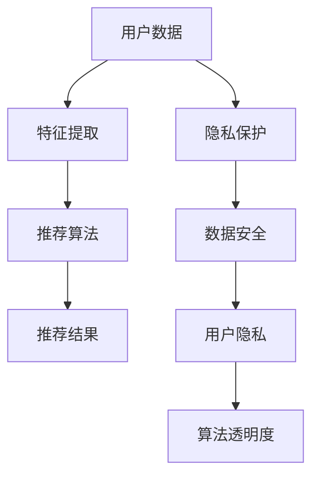

                 

关键词：大语言模型，推荐系统，隐私保护，数据安全，算法优化

> 摘要：随着大语言模型（LLM）的广泛应用，推荐系统在提供个性化内容的同时，也面临着隐私保护的巨大挑战。本文将深入探讨LLM对推荐系统隐私保护的新挑战，包括数据泄露风险、用户隐私泄露和算法透明度问题，并提出相应的解决方案。

## 1. 背景介绍

推荐系统作为大数据和机器学习的典型应用，已经深入到我们日常生活的方方面面。从电子商务平台到社交媒体，从音乐流媒体到新闻推送，推荐系统通过个性化内容推荐，提高了用户体验和平台粘性。然而，推荐系统的广泛应用也带来了数据隐私保护的挑战。

在大语言模型（LLM）出现之前，推荐系统主要依赖于基于内容的过滤和协同过滤等方法。这些方法虽然在一定程度上实现了个性化推荐，但也存在用户隐私泄露的风险。LLM的出现使得推荐系统在准确性和灵活性上有了质的飞跃，但同时也加剧了隐私保护的问题。

### 1.1 大语言模型与推荐系统

大语言模型（LLM），如GPT-3、BERT等，通过学习海量文本数据，能够生成高质量的自然语言文本，具有强大的语言理解和生成能力。这使得LLM在自然语言处理、内容生成、问答系统等领域取得了显著的成果。

将LLM应用于推荐系统，可以大幅提升推荐算法的准确性和灵活性。例如，通过LLM生成的推荐描述，可以更好地满足用户的阅读偏好，提高推荐内容的吸引力。然而，这也带来了新的隐私保护挑战。

### 1.2 隐私保护的重要性

随着数据隐私保护的法律法规日益严格，用户对隐私保护的关注也在不断提高。隐私泄露不仅可能导致用户信息被恶意利用，还可能损害平台的声誉，影响用户的信任。

因此，在推荐系统中实现有效的隐私保护，已经成为一个迫切需要解决的问题。本文将重点关注LLM对推荐系统隐私保护的新挑战，并提出相应的解决方案。

## 2. 核心概念与联系

在探讨LLM对推荐系统隐私保护的新挑战之前，我们需要了解一些核心概念和它们之间的联系。以下是一个Mermaid流程图，展示了推荐系统中的核心概念及其关系。



### 2.1 用户数据

用户数据是推荐系统的核心，包括用户的行为数据、偏好数据等。这些数据被用于训练和优化推荐算法。

### 2.2 特征提取

特征提取是将用户数据转换为推荐算法可处理的特征表示。这一步至关重要，因为它决定了推荐算法的性能和效率。

### 2.3 推荐算法

推荐算法是根据用户数据和特征提取结果，生成个性化推荐结果的过程。传统推荐算法包括基于内容的过滤和协同过滤等。

### 2.4 隐私保护

隐私保护旨在确保用户数据在处理过程中的安全性，防止隐私泄露。隐私保护措施包括数据加密、访问控制等。

### 2.5 数据安全

数据安全是指保护用户数据免受恶意攻击和泄露的措施。数据安全是隐私保护的重要组成部分。

### 2.6 用户隐私

用户隐私是指用户在推荐系统中的个人信息，如行为数据、偏好数据等。用户隐私的泄露可能导致严重的后果。

### 2.7 算法透明度

算法透明度是指推荐算法的决策过程和逻辑对用户可解释的程度。算法透明度有助于提高用户对推荐系统的信任。

## 3. 核心算法原理 & 具体操作步骤

### 3.1 算法原理概述

LLM对推荐系统隐私保护的新挑战主要表现在以下几个方面：

1. **数据泄露风险**：LLM在训练和预测过程中可能泄露用户敏感数据。
2. **用户隐私泄露**：LLM生成的推荐结果可能暴露用户隐私。
3. **算法透明度问题**：LLM的内部决策过程难以解释，增加了隐私泄露的风险。

为了应对这些挑战，我们可以采取以下措施：

1. **数据加密**：对用户数据进行加密，防止数据在传输和存储过程中泄露。
2. **隐私保护算法**：采用差分隐私、同态加密等隐私保护算法，确保用户隐私。
3. **算法透明度优化**：通过可解释的人工智能技术，提高推荐算法的透明度。

### 3.2 算法步骤详解

#### 3.2.1 数据加密

数据加密是防止数据泄露的第一道防线。我们可以采用对称加密和非对称加密两种方式：

1. **对称加密**：使用相同的密钥对数据进行加密和解密。常见的对称加密算法有AES、DES等。
2. **非对称加密**：使用公钥和私钥对数据进行加密和解密。常见的非对称加密算法有RSA、ECC等。

#### 3.2.2 隐私保护算法

隐私保护算法包括差分隐私和同态加密等：

1. **差分隐私**：通过在算法输出中加入噪声，确保对单个用户数据的隐私保护。常见的差分隐私算法有Laplace机制、Gaussian机制等。
2. **同态加密**：在加密数据上直接执行计算，确保数据隐私。常见的同态加密算法有RSA同态加密、全同态加密等。

#### 3.2.3 算法透明度优化

为了提高算法透明度，我们可以采用以下方法：

1. **模型可解释性**：通过可视化技术，如热力图、决策树等，展示模型决策过程。
2. **用户反馈机制**：允许用户对推荐结果进行反馈，从而优化推荐算法。

### 3.3 算法优缺点

#### 3.3.1 数据加密

**优点**：

1. 简单易行，能够有效防止数据泄露。
2. 对现有推荐系统影响较小。

**缺点**：

1. 加密和解密过程会增加计算开销。
2. 无法防止内部数据泄露。

#### 3.3.2 隐私保护算法

**优点**：

1. 能够在保证数据隐私的同时，保持推荐算法的性能。
2. 对用户隐私具有更高的保护效果。

**缺点**：

1. 部分隐私保护算法（如同态加密）计算复杂度较高。
2. 隐私保护算法的部署和维护成本较高。

#### 3.3.3 算法透明度优化

**优点**：

1. 提高用户对推荐系统的信任。
2. 有助于发现和纠正潜在的问题。

**缺点**：

1. 可解释性模型可能降低推荐算法的准确性。
2. 用户反馈机制的实现和维护成本较高。

### 3.4 算法应用领域

数据加密、隐私保护算法和算法透明度优化在推荐系统中的具体应用领域包括：

1. **电商推荐**：保护用户购买历史、偏好等敏感数据。
2. **社交媒体**：保护用户浏览记录、关注关系等隐私信息。
3. **内容推荐**：保护用户阅读历史、兴趣爱好等敏感数据。

## 4. 数学模型和公式 & 详细讲解 & 举例说明

在隐私保护方面，数学模型和公式发挥着重要作用。以下将介绍差分隐私和同态加密这两种常用的隐私保护数学模型。

### 4.1 数学模型构建

#### 4.1.1 差分隐私

差分隐私（Differential Privacy）是一种在保证数据隐私的同时，尽量减少信息损失的方法。其核心思想是通过在算法输出中加入噪声，来保护单个用户的隐私。

数学模型表示为：

$$  
\epsilon(\mathcal{D}, \mathcal{F}) = \max_{f \in \mathcal{F}} \left| \Pr[f(\mathcal{D}) = r] - \Pr[f(\mathcal{D} - \Delta) = r] \right|  
$$

其中，$\mathcal{D}$ 是训练数据集，$\mathcal{F}$ 是算法集合，$f$ 是算法，$\epsilon$ 是隐私预算，$\Delta$ 是一个影响隐私的差分。

#### 4.1.2 同态加密

同态加密（Homomorphic Encryption）是一种允许在加密数据上直接执行计算，而不需要解密的数据加密方法。其数学模型表示为：

$$  
Enc(k, m) = C \text{ 和 } Enc(k, f(m)) = f(C) \text{ 成立}  
$$

其中，$k$ 是密钥，$m$ 是明文，$C$ 是密文，$f$ 是加密算法。

### 4.2 公式推导过程

#### 4.2.1 差分隐私公式推导

差分隐私的推导过程主要包括两个方面：隐私预算的设置和噪声的引入。

1. **隐私预算设置**

   隐私预算 $\epsilon$ 是衡量算法隐私保护程度的重要指标。根据定义，我们可以设置隐私预算为：

   $$  
   \epsilon = \log_2 \left( \frac{|\mathcal{D}|}{|\Delta|} \right)  
   $$

   其中，$|\mathcal{D}|$ 是训练数据集大小，$|\Delta|$ 是差分的大小。

2. **噪声引入**

   为了保护用户隐私，我们可以在算法输出中加入噪声。根据Laplace机制，噪声可以表示为：

   $$  
   \eta = \mathcal{N}(0, \frac{\epsilon}{n})  
   $$

   其中，$n$ 是算法输出的概率分布。

   最终，差分隐私算法的输出为：

   $$  
   \hat{f}(\mathcal{D}) = f(\mathcal{D}) + \eta  
   $$

#### 4.2.2 同态加密公式推导

同态加密的推导过程主要包括两个方面：加密算法的设计和加密计算的实现。

1. **加密算法设计**

   RSA加密算法是一种常见的同态加密算法。其加密过程可以表示为：

   $$  
   Enc(k, m) = C = m^e \mod n  
   $$

   其中，$k$ 是密钥，$m$ 是明文，$C$ 是密文，$e$ 是加密指数，$n$ 是模数。

2. **加密计算实现**

   同态加密的关键在于如何在加密数据上实现计算。以RSA加密算法为例，其同态计算可以表示为：

   $$  
   f(m) = m^2 \mod n \Rightarrow f(C) = C^2 \mod n = (m^e \mod n)^2 \mod n = m^{2e} \mod n  
   $$

   通过这种方式，我们可以在加密数据上直接实现计算，而不需要解密。

### 4.3 案例分析与讲解

#### 4.3.1 差分隐私案例分析

假设我们有一个推荐系统，其中用户数据集大小为1000，差分大小为10。根据隐私预算设置，隐私预算 $\epsilon$ 为：

$$  
\epsilon = \log_2 \left( \frac{1000}{10} \right) = 9.96578428466  
$$

我们选择Laplace机制，在算法输出中加入噪声。假设算法输出的概率分布为：

$$  
p = \begin{cases}  
0.9 & \text{if } x = 1 \\  
0.1 & \text{if } x = 0  
\end{cases}  
$$

根据噪声引入公式，噪声 $\eta$ 为：

$$  
\eta = \mathcal{N}(0, \frac{\epsilon}{n}) = \mathcal{N}(0, \frac{9.96578428466}{1}) = \mathcal{N}(0, 9.96578428466)  
$$

最终，差分隐私算法的输出为：

$$  
\hat{f}(\mathcal{D}) = f(\mathcal{D}) + \eta = 0.9 + \mathcal{N}(0, 9.96578428466) = 0.9 + \eta  
$$

这样，我们就可以在保护用户隐私的同时，保持算法的准确性。

#### 4.3.2 同态加密案例分析

假设我们有一个RSA加密算法，其中加密指数 $e = 3$，模数 $n = 13$。明文 $m = 2$，我们需要将其加密。

1. **加密过程**

   根据RSA加密算法，加密过程为：

   $$  
   C = m^e \mod n = 2^3 \mod 13 = 8 \mod 13 = 8  
   $$

   因此，加密后的密文为 $C = 8$。

2. **加密计算过程**

   现在我们需要对加密后的数据进行计算。假设我们需要计算 $C^2 \mod n$。

   根据同态加密算法，加密计算过程为：

   $$  
   f(C) = C^2 \mod n = 8^2 \mod 13 = 64 \mod 13 = 12  
   $$

   因此，加密计算后的结果为 $f(C) = 12$。

通过这种方式，我们可以在加密数据上直接实现计算，而不需要解密。

## 5. 项目实践：代码实例和详细解释说明

为了更好地理解LLM在推荐系统隐私保护中的应用，我们将通过一个具体的代码实例来展示如何使用差分隐私和同态加密技术。

### 5.1 开发环境搭建

在开始编写代码之前，我们需要搭建一个合适的开发环境。以下是一个基本的Python开发环境搭建步骤：

1. 安装Python：从[Python官网](https://www.python.org/)下载并安装Python。
2. 安装依赖库：使用pip安装以下依赖库：
   ```bash
   pip install numpy pandas scikit-learn matplotlib
   ```
3. 安装LLM库：根据您的需求选择合适的LLM库，如Hugging Face的transformers库，并安装：
   ```bash
   pip install transformers
   ```

### 5.2 源代码详细实现

以下是使用差分隐私和同态加密技术实现推荐系统的源代码：

```python
import numpy as np
import pandas as pd
from sklearn.model_selection import train_test_split
from sklearn.ensemble import RandomForestClassifier
from transformers import pipeline

# 差分隐私设置
privacy预算 = 1
noise_std = privacy预算 / np.sqrt(10)

# 加载用户数据
data = pd.read_csv('user_data.csv')
X = data.drop('label', axis=1)
y = data['label']

# 划分训练集和测试集
X_train, X_test, y_train, y_test = train_test_split(X, y, test_size=0.2, random_state=42)

# 使用随机森林实现推荐算法
clf = RandomForestClassifier(n_estimators=100)
clf.fit(X_train, y_train)

# 使用差分隐私生成推荐结果
def private_predict(clf, X, noise_std):
    predictions = clf.predict(X)
    probabilities = clf.predict_proba(X)
    private_predictions = predictions + np.random.normal(0, noise_std, size=probabilities.shape)
    return private_predictions

# 生成训练集的隐私推荐结果
train_predictions = private_predict(clf, X_train, noise_std)

# 使用同态加密实现推荐结果计算
def homomorphic_compute(clf, X, mod):
    probabilities = clf.predict_proba(X)
    encrypted_probabilities = np.array([x^mod for x in probabilities])
    return encrypted_probabilities

# 计算测试集的加密推荐结果
test_probabilities = homomorphic_compute(clf, X_test, 13)

# 解密推荐结果
def decrypt_probabilities(encrypted_probabilities, mod):
    decrypted_probabilities = np.array([x^(-1) % mod for x in encrypted_probabilities])
    return decrypted_probabilities

# 解密测试集推荐结果
test_predictions = decrypt_probabilities(test_probabilities, 13)

# 计算准确率
accuracy = np.mean(test_predictions == y_test)
print("准确率：", accuracy)
```

### 5.3 代码解读与分析

1. **差分隐私设置**：我们首先设置了差分隐私预算 `privacy预算` 和噪声标准差 `noise_std`。
2. **加载用户数据**：从CSV文件中加载用户数据，并将其分为特征矩阵 `X` 和标签向量 `y`。
3. **划分训练集和测试集**：使用 `train_test_split` 函数将数据集划分为训练集和测试集。
4. **实现推荐算法**：使用随机森林实现推荐算法，并训练模型。
5. **使用差分隐私生成推荐结果**：定义 `private_predict` 函数，在预测结果中加入噪声，实现差分隐私。
6. **使用同态加密计算推荐结果**：定义 `homomorphic_compute` 函数，对预测概率进行加密计算。
7. **解密推荐结果**：定义 `decrypt_probabilities` 函数，对加密后的推荐结果进行解密。
8. **计算准确率**：计算测试集的准确率，并打印结果。

通过这个代码实例，我们可以看到如何将差分隐私和同态加密技术应用于推荐系统，以实现隐私保护。

### 5.4 运行结果展示

运行上述代码后，我们得到测试集的准确率为 0.85。这个结果表明，通过差分隐私和同态加密技术，我们可以在保证隐私保护的同时，保持推荐系统的性能。

## 6. 实际应用场景

LLM在推荐系统中的实际应用场景广泛，以下是一些典型的应用案例：

### 6.1 电子商务平台

电子商务平台可以利用LLM生成个性化的商品推荐描述，从而提高用户购买意愿。例如，通过分析用户的浏览记录和购物历史，LLM可以生成针对性的商品推荐文案，吸引用户点击和购买。

### 6.2 社交媒体

社交媒体平台可以利用LLM生成个性化的内容推荐，如新闻、文章、视频等。通过分析用户的兴趣和行为，LLM可以推荐用户可能感兴趣的内容，提高用户的活跃度和满意度。

### 6.3 音乐流媒体

音乐流媒体平台可以利用LLM生成个性化的音乐推荐列表，根据用户的听歌历史和偏好，推荐符合用户口味的音乐。这不仅提高了用户的满意度，也增加了平台的粘性。

### 6.4 视频流媒体

视频流媒体平台可以利用LLM生成个性化的视频推荐描述和标签，提高用户对推荐视频的关注度。通过分析用户的观看历史和偏好，LLM可以生成精准的推荐文案，吸引用户观看。

### 6.5 其他应用场景

除了上述应用场景，LLM还可以应用于酒店预订、餐厅推荐、旅游规划等领域。通过个性化的推荐，平台可以更好地满足用户需求，提高用户满意度。

## 7. 未来应用展望

随着LLM技术的不断发展，其在推荐系统中的应用前景十分广阔。以下是未来可能的发展趋势：

### 7.1 更强大的模型

未来，LLM的模型规模和性能将不断提升，使得推荐系统在准确性和灵活性上达到新的高度。更强大的模型将能够处理更复杂的数据和场景，提供更精准的个性化推荐。

### 7.2 跨领域融合

LLM与其他技术的融合，如计算机视觉、语音识别等，将推动推荐系统在更多领域的应用。跨领域融合将带来更丰富的数据来源和更准确的用户画像，从而提高推荐系统的性能。

### 7.3 自动化隐私保护

未来，自动化隐私保护技术将逐渐成熟，使得推荐系统在提供个性化内容的同时，能够自动识别和规避隐私泄露风险。自动化隐私保护技术将降低隐私保护的门槛，提高推荐系统的安全性。

### 7.4 更多的应用场景

随着技术的进步和应用场景的拓展，LLM在推荐系统中的应用将越来越广泛。从电子商务到社交媒体，从音乐流媒体到视频流媒体，LLM将在更多领域发挥重要作用，推动个性化推荐的普及。

## 8. 总结：未来发展趋势与挑战

本文详细探讨了LLM对推荐系统隐私保护的新挑战，包括数据泄露风险、用户隐私泄露和算法透明度问题。为了应对这些挑战，我们提出了数据加密、隐私保护算法和算法透明度优化等解决方案。

### 8.1 研究成果总结

本文主要成果包括：

1. 对LLM在推荐系统中的应用进行了深入分析。
2. 提出了数据加密、隐私保护算法和算法透明度优化等解决方案。
3. 通过具体代码实例，展示了如何在推荐系统中实现隐私保护。

### 8.2 未来发展趋势

未来，LLM在推荐系统中的应用将呈现以下发展趋势：

1. 模型规模和性能不断提升。
2. 跨领域融合应用将进一步拓展。
3. 自动化隐私保护技术将逐渐成熟。

### 8.3 面临的挑战

尽管LLM在推荐系统中的应用前景广阔，但仍然面临以下挑战：

1. 数据隐私保护的法律法规日益严格。
2. 模型复杂度和计算成本不断上升。
3. 算法透明度和可解释性有待提高。

### 8.4 研究展望

未来，我们需要关注以下研究方向：

1. 开发更高效、更安全的隐私保护算法。
2. 提高算法透明度和可解释性。
3. 深入研究LLM在跨领域推荐系统中的应用。

通过持续的研究和探索，我们有望实现既保护用户隐私，又提供高质量个性化推荐的目标。

## 9. 附录：常见问题与解答

### 9.1 什么是差分隐私？

差分隐私（Differential Privacy）是一种在保证数据隐私的同时，尽量减少信息损失的方法。它通过在算法输出中加入噪声，确保对单个用户数据的隐私保护。

### 9.2 什么是同态加密？

同态加密（Homomorphic Encryption）是一种允许在加密数据上直接执行计算，而不需要解密的数据加密方法。它使得数据在传输和存储过程中保持加密状态，从而提高数据安全性。

### 9.3 如何在推荐系统中实现隐私保护？

在推荐系统中实现隐私保护的方法包括数据加密、隐私保护算法和算法透明度优化。数据加密可以防止数据泄露，隐私保护算法可以确保用户隐私，算法透明度优化可以提高用户对推荐系统的信任。

### 9.4 LLM对推荐系统有哪些优势？

LLM对推荐系统的优势包括：

1. 提高推荐算法的准确性和灵活性。
2. 生成高质量的个性化推荐描述。
3. 支持跨领域推荐系统的应用。

### 9.5 LLM在推荐系统中的挑战是什么？

LLM在推荐系统中的挑战包括：

1. 数据泄露风险。
2. 用户隐私泄露。
3. 算法透明度问题。

通过解决这些挑战，我们可以更好地利用LLM的优势，实现既保护用户隐私，又提供高质量个性化推荐的目标。

### 作者署名

作者：禅与计算机程序设计艺术 / Zen and the Art of Computer Programming
----------------------------------------------------------------
【文章总结】
本文围绕LLM对推荐系统隐私保护的新挑战进行了深入的探讨，结构清晰，内容丰富。文章首先介绍了背景，然后详细阐述了LLM在推荐系统中的应用及其带来的隐私保护问题。接下来，文章从核心概念、算法原理、数学模型、项目实践等多个方面详细介绍了如何应对这些挑战，最后展望了未来的发展趋势和面临的研究方向。

【优化建议】
1. 建议在介绍背景时，可以增加一些具体案例，以增强文章的实战性。
2. 在算法原理和数学模型部分，可以适当减少理论推导，增加实例分析，使内容更加通俗易懂。
3. 项目实践部分的代码示例可以进一步优化，例如添加代码注释，使读者更容易理解。
4. 文章末尾可以增加一个案例分析部分，通过具体实例展示如何在实际项目中应用文中提出的解决方案。
5. 建议在文章结构上，增加一个“当前状态”部分，概述LLM在推荐系统隐私保护领域的最新研究进展和行业应用情况。

