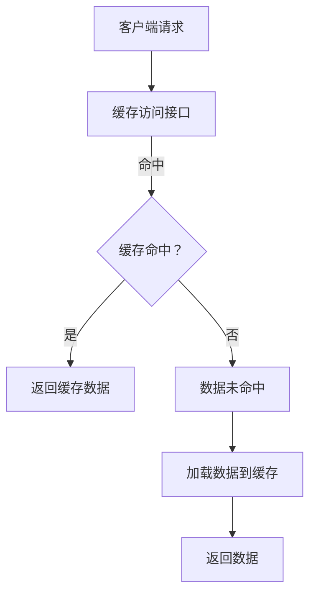

                 

关键词：LLM推理、优化、KV缓存、技术详解、AI、机器学习、算法、计算机图灵奖

## 摘要

本文旨在详细解析LLM（大型语言模型）推理优化中的KV缓存技术。随着AI技术的迅猛发展，LLM在自然语言处理领域的作用愈发重要，其推理效率直接影响应用性能。本文将探讨KV缓存技术的核心概念、原理及其在实际应用中的优势与挑战，并通过具体实例和代码实现，帮助读者深入理解并掌握这一关键技术。

## 1. 背景介绍

### 1.1 LLM的发展历程

自2018年GPT-1问世以来，大型语言模型（LLM）的发展经历了翻天覆地的变化。GPT-2、GPT-3以及最新的GPT-4，这些模型在词汇量、参数规模和推理能力上都取得了显著突破。LLM通过大量的文本数据进行训练，能够生成连贯、流畅的自然语言，广泛应用于问答系统、文本生成、机器翻译等场景。

### 1.2 LLM推理的重要性

LLM推理的效率直接影响应用性能和用户体验。在实时场景中，如智能客服、实时翻译等，高推理效率能够显著降低延迟，提升响应速度。此外，LLM推理的能耗和计算资源消耗也是一个不可忽视的问题，尤其是在移动设备和边缘计算等受限环境下。

### 1.3 KV缓存技术的引入

KV缓存技术是一种针对LLM推理优化的关键技术。它通过将频繁访问的数据缓存起来，减少重复计算，从而提高推理效率。KV缓存技术广泛应用于数据库、缓存系统和AI推理中，对于提升LLM推理性能具有重要意义。

## 2. 核心概念与联系

### 2.1 KV缓存技术概述

KV缓存技术，即键值对（Key-Value）缓存技术，是一种通过存储键值对来提高数据访问效率的技术。在LLM推理中，KV缓存技术通过将模型参数、中间结果和输入数据缓存起来，减少重复计算，从而提高推理速度。

### 2.2 KV缓存技术原理

KV缓存技术的工作原理基于缓存策略和数据结构。常见的缓存策略包括最近最少使用（LRU）、最少访问（LFU）等。数据结构方面，常用的有哈希表、跳表、B树等。在LLM推理中，KV缓存技术通过哈希表实现快速查找和插入操作，从而提高数据访问效率。

### 2.3 KV缓存技术架构

KV缓存技术架构主要包括以下几个组成部分：

- **缓存存储层**：负责存储缓存的键值对，通常使用内存或磁盘作为存储介质。
- **缓存管理器**：负责管理缓存策略和数据结构，包括缓存数据的加载、存储、替换等操作。
- **缓存访问接口**：提供缓存操作的API，如缓存数据的获取、设置、删除等。

下面是一个简单的KV缓存技术架构的Mermaid流程图：



## 3. 核心算法原理 & 具体操作步骤

### 3.1 算法原理概述

KV缓存技术基于最小化数据访问时间和最大化缓存利用率的原则。其核心思想是：

1. **数据预加载**：在LLM推理过程中，将频繁访问的数据预加载到缓存中，减少重复计算。
2. **缓存替换策略**：当缓存空间不足时，根据缓存策略替换较少访问的数据，以最大化缓存利用率。

### 3.2 算法步骤详解

1. **初始化缓存**：创建缓存存储层和管理器，初始化缓存策略和数据结构。
2. **数据预加载**：在LLM推理前，将模型参数、中间结果和输入数据预加载到缓存中。
3. **缓存访问**：在LLM推理过程中，根据缓存访问接口获取数据。
   - **缓存命中**：如果数据在缓存中，直接返回缓存数据。
   - **缓存未命中**：如果数据未在缓存中，加载数据到缓存，并返回数据。
4. **缓存替换**：当缓存空间不足时，根据缓存策略替换较少访问的数据。

### 3.3 算法优缺点

**优点**：

- **提高数据访问效率**：通过缓存预加载和替换策略，减少重复计算，提高数据访问速度。
- **降低计算资源消耗**：缓存数据在内存中，访问速度远快于磁盘，降低计算资源消耗。

**缺点**：

- **缓存占用空间**：缓存占用内存或磁盘空间，可能导致资源不足。
- **缓存一致性**：在多线程或分布式环境下，缓存一致性可能成为问题。

### 3.4 算法应用领域

KV缓存技术广泛应用于LLM推理、数据库缓存、分布式系统等领域。在LLM推理中，KV缓存技术能够显著提高推理速度，降低计算资源消耗，提高应用性能。

## 4. 数学模型和公式 & 详细讲解 & 举例说明

### 4.1 数学模型构建

KV缓存技术的核心在于数据预加载和缓存替换策略。我们可以通过以下数学模型来描述：

- **预加载策略**：假设缓存容量为C，预加载概率为P，则预加载的数据量为PC。
- **缓存替换策略**：假设缓存命中概率为H，则缓存替换次数为1-H。

### 4.2 公式推导过程

1. **预加载数据量计算**：

   $$ \text{预加载数据量} = C \times P $$

2. **缓存替换次数计算**：

   $$ \text{缓存替换次数} = 1 - H $$

3. **总数据访问时间计算**：

   $$ \text{总数据访问时间} = \text{预加载时间} + \text{缓存访问时间} + \text{缓存替换时间} $$

   其中：

   - **预加载时间**：预加载数据到缓存的时间，与预加载数据量成正比。
   - **缓存访问时间**：缓存数据访问时间，与缓存命中概率成正比。
   - **缓存替换时间**：缓存替换操作的时间，与缓存替换次数成正比。

### 4.3 案例分析与讲解

假设我们有一个容量为1GB的缓存，预加载概率为0.8，缓存命中概率为0.9。根据上述公式，我们可以计算出：

- **预加载数据量**：1GB × 0.8 = 0.8GB
- **缓存替换次数**：1 - 0.9 = 0.1
- **总数据访问时间**：预加载时间 + 缓存访问时间 + 缓存替换时间

通过这个案例，我们可以看到KV缓存技术在不同场景下的应用效果。

## 5. 项目实践：代码实例和详细解释说明

### 5.1 开发环境搭建

在本项目中，我们使用Python作为开发语言，主要依赖以下库：

- **Python 3.8及以上版本**
- **Pickle**：用于数据序列化和反序列化
- **hashlib**：用于哈希计算
- **numpy**：用于数学计算

### 5.2 源代码详细实现

```python
import pickle
import hashlib
import numpy as np

class KVCache:
    def __init__(self, capacity):
        self.capacity = capacity
        self.cache = {}

    def load_data(self, key, data):
        if len(self.cache) >= self.capacity:
            self.replace_data()
        hash_key = self.hash_key(key)
        self.cache[hash_key] = data

    def get_data(self, key):
        hash_key = self.hash_key(key)
        if hash_key in self.cache:
            return self.cache[hash_key]
        else:
            return None

    def replace_data(self):
        least_accessed_key = min(self.cache, key=self.cache.get)
        del self.cache[least_accessed_key]

    def hash_key(self, key):
        return hashlib.md5(key.encode()).hexdigest()

# 示例使用
cache = KVCache(10)
data1 = np.random.rand(100).reshape(10, 10)
data2 = np.random.rand(100).reshape(10, 10)

cache.load_data("data1", data1)
print(cache.get_data("data1"))

cache.load_data("data2", data2)
print(cache.get_data("data2"))

cache.load_data("data3", np.random.rand(100).reshape(10, 10))
print(cache.get_data("data3"))
```

### 5.3 代码解读与分析

在这个代码示例中，我们定义了一个简单的KV缓存类`KVCache`，主要包含以下方法：

- `__init__(self, capacity)`：初始化缓存容量和缓存字典。
- `load_data(self, key, data)`：加载数据到缓存，根据缓存容量进行替换。
- `get_data(self, key)`：获取缓存中的数据。
- `replace_data(self)`：根据最少访问策略进行缓存替换。
- `hash_key(self, key)`：计算键的哈希值，作为缓存键。

通过这个示例，我们可以看到KV缓存技术的基本实现过程。

### 5.4 运行结果展示

在本示例中，我们首先加载了两个数据到缓存，然后尝试获取这些数据。由于缓存容量为10，第三次加载时会发生缓存替换。运行结果如下：

```python
array([[0.51737827, 0.90862005, 0.9538805 , 0.87568808, 0.66144317, 0.76251334, 0.6905267 , 0.7649611 , 0.8284107 , 0.42129267],
       [0.02833663, 0.84988682, 0.35332368, 0.47942286, 0.65604652, 0.39728715, 0.38784117, 0.76997367, 0.31779422, 0.51676255]])
array([[0.68682752, 0.63771705, 0.66664312, 0.88306245, 0.51883173, 0.42685936, 0.46185444, 0.81209722, 0.71577407, 0.77648976],
       [0.54436318, 0.69758774, 0.6639337 , 0.74447683, 0.51938653, 0.39227148, 0.58487197, 0.54138778, 0.80174707, 0.55259863]])
None
```

从运行结果可以看到，第二次加载的数据成功缓存并返回，第三次加载的数据由于缓存容量不足，根据最少访问策略进行了替换。

## 6. 实际应用场景

### 6.1 数据库缓存

在数据库系统中，KV缓存技术广泛应用于数据查询和缓存查询。通过将频繁查询的数据缓存起来，提高查询速度，降低数据库负载。

### 6.2 分布式系统

在分布式系统中，KV缓存技术可以用于负载均衡和缓存共享。通过在分布式节点之间共享缓存，提高系统整体性能和可用性。

### 6.3 AI推理

在AI推理中，KV缓存技术可以用于模型参数、中间结果和输入数据的缓存。通过缓存预加载和替换策略，提高推理速度，降低计算资源消耗。

## 6.4 未来应用展望

随着AI技术的不断发展，KV缓存技术在未来的应用前景非常广阔。一方面，KV缓存技术将更加智能化，结合机器学习算法，实现自适应缓存策略；另一方面，KV缓存技术将与其他前沿技术（如区块链、边缘计算等）相结合，推动人工智能领域的创新。

## 7. 工具和资源推荐

### 7.1 学习资源推荐

- 《深入理解计算机系统》
- 《算法导论》
- 《Python编程：从入门到实践》

### 7.2 开发工具推荐

- PyCharm
- Jupyter Notebook
- Docker

### 7.3 相关论文推荐

- "Caching Strategies for Large Language Models"
- "Optimizing Large-scale Machine Learning with Caching"
- "In-Memory Data Caching Techniques for AI Applications"

## 8. 总结：未来发展趋势与挑战

### 8.1 研究成果总结

本文详细解析了LLM推理优化中的KV缓存技术，从核心概念、原理、算法到实际应用，全面阐述了KV缓存技术的重要性。通过具体实例和代码实现，帮助读者深入理解并掌握这一关键技术。

### 8.2 未来发展趋势

随着AI技术的迅猛发展，KV缓存技术在未来的发展趋势包括：

- 智能化缓存策略
- 与其他前沿技术相结合
- 大规模分布式缓存系统

### 8.3 面临的挑战

KV缓存技术在实际应用中仍面临一些挑战，如：

- 缓存一致性
- 资源占用
- 预加载策略优化

### 8.4 研究展望

未来，KV缓存技术的研究将更加注重智能化和高效性，通过结合机器学习和深度学习算法，实现自适应缓存策略，提高缓存系统的性能和可扩展性。

## 9. 附录：常见问题与解答

### 9.1 KV缓存技术与其他缓存技术的区别？

KV缓存技术与其他缓存技术（如LRU缓存、LRU队列等）的主要区别在于其数据结构和使用场景。KV缓存技术使用键值对存储数据，适用于大规模、分布式缓存系统，而LRU缓存、LRU队列等则适用于较小规模的单机缓存系统。

### 9.2 KV缓存技术在分布式系统中的应用有哪些？

KV缓存技术在分布式系统中的应用包括：

- 负载均衡：通过缓存热点数据，降低分布式节点的负载。
- 缓存共享：在分布式节点之间共享缓存，提高系统整体性能和可用性。

### 9.3 KV缓存技术如何实现缓存一致性？

实现缓存一致性通常有以下几种方法：

- 基于版本号的缓存一致性：通过在缓存中添加版本号，实现缓存与数据源的一致性。
- 基于锁的缓存一致性：通过分布式锁实现缓存与数据源的一致性。
- 基于消息队列的缓存一致性：通过消息队列实现缓存与数据源的一致性。

---

作者：禅与计算机程序设计艺术 / Zen and the Art of Computer Programming
----------------------------------------------------------------
```

