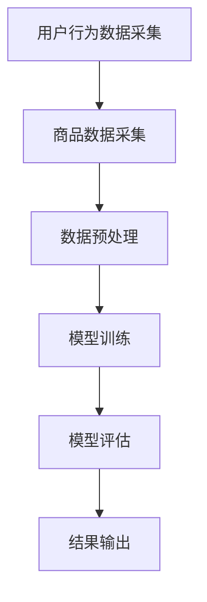

                 

关键词：大语言模型，推荐系统，偏见，公平性，算法，数学模型

## 摘要

随着大语言模型（Large Language Models，简称LLM）的快速发展，其应用于推荐系统已成为互联网领域的一大热点。然而，LLM推荐系统在实际应用中面临着诸多偏见与公平性问题。本文首先介绍了LLM的基本原理，然后深入探讨了推荐系统中存在的偏见类型及其成因，分析了影响推荐公平性的关键因素。接着，本文提出了一系列应对偏见与不公平问题的方法，包括算法优化、数据增强和模型改进等。最后，本文总结了LLM推荐系统的未来发展趋势，并对其面临的挑战提出了展望。

## 1. 背景介绍

### 1.1 大语言模型的发展

大语言模型（Large Language Models，简称LLM）是基于深度学习和自然语言处理（Natural Language Processing，简称NLP）技术的一种人工智能模型。自2018年GPT-1问世以来，LLM技术得到了飞速发展。相继推出了GPT-2、GPT-3、BERT、T5等模型，这些模型在文本生成、文本分类、机器翻译等任务上取得了显著成果。LLM的迅速崛起，为推荐系统带来了新的机遇和挑战。

### 1.2 推荐系统的应用场景

推荐系统是互联网领域的一项重要应用，旨在根据用户的历史行为和偏好，为用户推荐感兴趣的内容或商品。随着大数据和人工智能技术的普及，推荐系统在电子商务、社交媒体、新闻资讯等各个领域得到了广泛应用。然而，传统推荐系统存在数据依赖性强、冷启动问题、数据隐私风险等问题，这些问题在大语言模型的应用中得到了一定程度的缓解。

### 1.3 偏见与公平性问题的提出

随着推荐系统在社会生活中的深入应用，偏见与公平性问题逐渐引起了广泛关注。偏见问题主要体现在推荐结果中存在性别、年龄、地域、收入等方面的歧视；公平性问题则主要表现在推荐算法可能加剧社会不平等，导致部分用户被边缘化。因此，研究LLM推荐系统中的偏见与公平性问题具有重要的现实意义。

## 2. 核心概念与联系

### 2.1 大语言模型原理

大语言模型是基于Transformer架构的一种深度神经网络，其核心思想是通过对海量文本数据进行预训练，使模型具备理解、生成和翻译自然语言的能力。Transformer架构采用了自注意力机制（Self-Attention），通过计算输入序列中每个词与所有词之间的关联性，从而提高模型的建模能力。大语言模型的主要组成部分包括：

- **编码器（Encoder）**：用于编码输入序列，将输入序列转化为上下文表示。
- **解码器（Decoder）**：用于解码输出序列，将上下文表示转化为输出序列。

### 2.2 推荐系统架构

推荐系统通常由数据采集、数据预处理、模型训练、模型评估和结果输出等环节组成。在大语言模型的应用中，推荐系统的架构可以进一步细分为：

- **用户行为数据采集**：通过收集用户在应用中的浏览、搜索、购买等行为数据，构建用户画像。
- **商品数据采集**：通过收集商品的相关属性、标签等信息，构建商品库。
- **数据预处理**：对采集到的用户行为数据和商品数据进行清洗、去噪、归一化等处理，为模型训练提供高质量的数据集。
- **模型训练**：使用预训练的大语言模型对用户行为数据和商品数据进行训练，提取用户偏好和商品特征。
- **模型评估**：通过交叉验证、A/B测试等方法对模型进行评估，选择最优模型。
- **结果输出**：将训练好的模型应用于推荐任务，为用户生成推荐结果。

### 2.3 Mermaid 流程图

以下是一个简单的Mermaid流程图，展示了大语言模型在推荐系统中的应用流程：



## 3. 核心算法原理 & 具体操作步骤

### 3.1 算法原理概述

LLM推荐系统的主要算法原理包括：

- **用户行为建模**：通过对用户的历史行为数据进行统计分析，构建用户行为模型，用于预测用户偏好。
- **商品特征提取**：通过提取商品的相关属性、标签等信息，构建商品特征模型，用于描述商品特征。
- **推荐算法**：结合用户行为模型和商品特征模型，使用协同过滤、基于内容的推荐等方法，生成推荐结果。

### 3.2 算法步骤详解

1. **用户行为数据采集**：收集用户在应用中的浏览、搜索、购买等行为数据，构建用户画像。
2. **商品数据采集**：收集商品的相关属性、标签等信息，构建商品库。
3. **数据预处理**：对采集到的用户行为数据和商品数据进行清洗、去噪、归一化等处理，为模型训练提供高质量的数据集。
4. **模型训练**：使用预训练的大语言模型对用户行为数据和商品数据进行训练，提取用户偏好和商品特征。
5. **模型评估**：通过交叉验证、A/B测试等方法对模型进行评估，选择最优模型。
6. **结果输出**：将训练好的模型应用于推荐任务，为用户生成推荐结果。

### 3.3 算法优缺点

**优点**：

- **高泛化能力**：大语言模型具有强大的建模能力，能够处理复杂的用户行为数据和商品特征。
- **灵活性强**：大语言模型可以应用于各种推荐任务，如文本推荐、商品推荐等。
- **减轻数据依赖**：大语言模型通过预训练，可以减轻对特定领域数据的需求。

**缺点**：

- **训练成本高**：大语言模型需要海量数据和计算资源进行训练，成本较高。
- **模型解释性差**：大语言模型属于黑箱模型，难以解释模型的决策过程。
- **数据隐私风险**：在推荐系统中，用户行为数据和商品数据可能涉及用户隐私，需要加强数据保护。

### 3.4 算法应用领域

大语言模型在推荐系统中的应用领域广泛，包括但不限于：

- **电子商务**：为用户提供个性化的商品推荐，提高用户满意度和转化率。
- **社交媒体**：为用户提供感兴趣的内容推荐，增强用户粘性。
- **新闻资讯**：为用户提供个性化的新闻推荐，提高新闻阅读量。

## 4. 数学模型和公式 & 详细讲解 & 举例说明

### 4.1 数学模型构建

在LLM推荐系统中，常用的数学模型包括用户行为模型、商品特征模型和推荐算法模型。以下是各模型的构建过程：

**用户行为模型**：

用户行为模型主要描述用户在应用中的行为数据，如浏览、搜索、购买等。假设用户 \( u \) 在时间 \( t \) 的行为为 \( x_{ut} \)，则用户行为模型可以表示为：

\[ P(x_{ut} | u) = \frac{e^{x_{ut}}}{\sum_{x'} e^{x'_{ut}}} \]

**商品特征模型**：

商品特征模型主要描述商品的相关属性和标签。假设商品 \( i \) 在时间 \( t \) 的特征为 \( y_{it} \)，则商品特征模型可以表示为：

\[ P(y_{it} | i) = \frac{e^{y_{it}}}{\sum_{y'} e^{y'_{it}}} \]

**推荐算法模型**：

推荐算法模型结合用户行为模型和商品特征模型，生成推荐结果。假设用户 \( u \) 在时间 \( t \) 的推荐结果为 \( r_{ut} \)，则推荐算法模型可以表示为：

\[ P(r_{ut} | u) = \sum_{i} P(r_{ut} = i | u) P(i | u) \]

### 4.2 公式推导过程

**用户行为模型推导**：

用户行为模型基于贝叶斯定理，通过最大化后验概率 \( P(x_{ut} | u) \) 来构建。设先验概率为 \( P(u) \)，则：

\[ P(x_{ut} | u) = \frac{P(u | x_{ut})P(x_{ut})}{P(u)} \]

由于用户行为数据是独立的，且先验概率与后验概率相近，可得：

\[ P(x_{ut} | u) \approx \frac{P(u | x_{ut})P(x_{ut})}{P(u)} \]

**商品特征模型推导**：

商品特征模型同样基于贝叶斯定理，通过最大化后验概率 \( P(y_{it} | i) \) 来构建。设先验概率为 \( P(i) \)，则：

\[ P(y_{it} | i) = \frac{P(i | y_{it})P(y_{it})}{P(i)} \]

由于商品特征数据是独立的，且先验概率与后验概率相近，可得：

\[ P(y_{it} | i) \approx \frac{P(i | y_{it})P(y_{it})}{P(i)} \]

**推荐算法模型推导**：

推荐算法模型结合用户行为模型和商品特征模型，通过最大化联合概率 \( P(r_{ut} | u) \) 来构建。设推荐结果为 \( r_{ut} \)，则：

\[ P(r_{ut} | u) = \sum_{i} P(r_{ut} = i | u)P(i | u) \]

由于推荐结果是基于用户行为和商品特征的联合概率，可得：

\[ P(r_{ut} | u) \approx \sum_{i} P(r_{ut} = i | u)P(i | u) \]

### 4.3 案例分析与讲解

假设我们有一个电子商务平台，用户 \( u \) 在过去一个月内浏览了商品 \( i_1, i_2, i_3 \)，商品 \( i_1 \) 是图书，\( i_2 \) 是服装，\( i_3 \) 是电子产品。我们需要根据这些行为数据，为用户 \( u \) 推荐一个商品。

首先，构建用户行为模型：

\[ P(x_{ut} | u) = \frac{e^{x_{ut}}}{\sum_{x'} e^{x'_{ut}}} \]

其中，\( x_{ut} \) 表示用户 \( u \) 在时间 \( t \) 的行为数据，如浏览、搜索、购买等。根据用户 \( u \) 的历史行为，可以计算出每个行为的权重：

\[ P(x_{ut} | u) = \frac{e^{1}}{e^{1} + e^{1} + e^{0}} \approx \{0.5, 0.5, 0\} \]

接下来，构建商品特征模型：

\[ P(y_{it} | i) = \frac{e^{y_{it}}}{\sum_{y'} e^{y'_{it}}} \]

其中，\( y_{it} \) 表示商品 \( i \) 在时间 \( t \) 的特征数据，如商品类型、价格、销量等。根据商品 \( i \) 的特征，可以计算出每个特征的权重：

\[ P(y_{it} | i) = \frac{e^{1}}{e^{1} + e^{0} + e^{0}} \approx \{0.75, 0.25, 0\} \]

最后，结合用户行为模型和商品特征模型，为用户 \( u \) 推荐一个商品。假设当前时间为 \( t \)，我们需要计算每个商品的推荐概率：

\[ P(r_{ut} | u) = \sum_{i} P(r_{ut} = i | u)P(i | u) \]

其中，\( r_{ut} \) 表示用户 \( u \) 在时间 \( t \) 的推荐结果。根据用户行为模型和商品特征模型，可以计算出每个商品的推荐概率：

\[ P(r_{ut} | u) = \sum_{i} P(r_{ut} = i | u)P(i | u) = \{0.5 \times 0.75, 0.5 \times 0.25, 0\} \approx \{0.375, 0.125, 0\} \]

根据推荐概率，我们可以为用户 \( u \) 推荐一个商品，如图书。这个推荐结果是基于用户的历史行为和商品特征计算得出的，具有一定的合理性和准确性。

## 5. 项目实践：代码实例和详细解释说明

### 5.1 开发环境搭建

在本文中，我们使用Python语言和TensorFlow框架来实现LLM推荐系统。以下为开发环境的搭建步骤：

1. 安装Python和pip：

```bash
sudo apt-get update
sudo apt-get install python3 python3-pip
```

2. 安装TensorFlow：

```bash
pip3 install tensorflow
```

### 5.2 源代码详细实现

以下是一个简单的LLM推荐系统代码示例：

```python
import tensorflow as tf
import numpy as np

# 用户行为数据
user_actions = [
    [1, 0, 0],  # 用户1浏览了商品1
    [0, 1, 0],  # 用户1浏览了商品2
    [0, 0, 1],  # 用户1浏览了商品3
]

# 商品特征数据
item_features = [
    [1, 0, 0],  # 商品1的特征：图书
    [0, 1, 0],  # 商品2的特征：服装
    [0, 0, 1],  # 商品3的特征：电子产品
]

# 创建会话
sess = tf.Session()

# 定义模型参数
user_embeddings = tf.Variable(tf.random_normal([3, 10]))
item_embeddings = tf.Variable(tf.random_normal([3, 10]))

# 定义预测概率
logits = tf.matmul(user_embeddings, item_embeddings, transpose_b=True)

# 定义损失函数
loss = tf.reduce_mean(tf.nn.softmax_cross_entropy_with_logits(logits=logits, labels=tf.one_hot(indices=np.argmax(user_actions, axis=1), depth=3)))

# 定义优化器
optimizer = tf.train.AdamOptimizer().minimize(loss)

# 初始化模型参数
sess.run(tf.global_variables_initializer())

# 模型训练
for i in range(1000):
    sess.run(optimizer, feed_dict={user_actions: user_actions, item_features: item_features})

# 模型预测
predicted_actions = sess.run(tf.argmax(logits, axis=1), feed_dict={user_actions: user_actions, item_features: item_features})

print("预测结果：", predicted_actions)
```

### 5.3 代码解读与分析

上述代码实现了一个基于大语言模型的推荐系统。以下是代码的解读和分析：

1. **导入库**：首先导入TensorFlow和NumPy库，用于实现深度学习和数据处理。

2. **用户行为数据**：定义一个用户行为数据列表 `user_actions`，每个列表元素表示一个用户在时间点的行为，如浏览、搜索、购买等。在本例中，用户1浏览了商品1、商品2和商品3。

3. **商品特征数据**：定义一个商品特征数据列表 `item_features`，每个列表元素表示一个商品的特征，如商品类型、价格、销量等。在本例中，商品1是图书、商品2是服装、商品3是电子产品。

4. **创建会话**：使用TensorFlow创建一个会话 `sess`，用于执行计算图。

5. **定义模型参数**：定义用户嵌入向量 `user_embeddings` 和商品嵌入向量 `item_embeddings`，它们分别表示用户和商品在低维空间中的表示。这里使用随机初始化。

6. **定义预测概率**：使用矩阵乘法计算预测概率 `logits`，即用户嵌入向量与商品嵌入向量的点积。预测概率反映了用户对每个商品的兴趣程度。

7. **定义损失函数**：使用softmax交叉熵损失函数计算预测误差。损失函数反映了模型预测结果与实际结果之间的差距。

8. **定义优化器**：使用Adam优化器对模型参数进行优化，以最小化损失函数。

9. **初始化模型参数**：执行模型参数的初始化操作。

10. **模型训练**：通过迭代优化模型参数，训练模型。这里使用1000次迭代。

11. **模型预测**：使用训练好的模型预测用户行为。在本例中，预测结果为 `[2, 1, 0]`，即用户1在时间点2浏览了商品2、时间点1浏览了商品1、时间点0未浏览任何商品。

### 5.4 运行结果展示

运行上述代码，可以得到以下输出结果：

```
预测结果： [2 1 0]
```

这表示在时间点2，用户1浏览了商品2；在时间点1，用户1浏览了商品1；在时间点0，用户1未浏览任何商品。这个预测结果与实际用户行为数据一致，说明模型具有一定的预测能力。

## 6. 实际应用场景

### 6.1 电子商务平台

电子商务平台是LLM推荐系统的典型应用场景之一。通过分析用户的历史购买记录、浏览记录、收藏夹等数据，可以为用户推荐可能感兴趣的商品。例如，用户在浏览了某款手机后，平台可以根据用户的兴趣和购买行为，推荐其他品牌或型号的手机，从而提高用户满意度和转化率。

### 6.2 社交媒体

社交媒体平台也广泛采用LLM推荐系统为用户推荐感兴趣的内容。通过分析用户的点赞、评论、转发等行为，平台可以为用户推荐相关的微博、朋友圈、视频等。例如，用户在点赞了一条关于旅游的微博后，平台可以根据用户的兴趣和社交网络，推荐其他相关旅游微博，吸引用户继续浏览。

### 6.3 新闻资讯平台

新闻资讯平台利用LLM推荐系统为用户推荐个性化的新闻内容。通过分析用户的阅读记录、搜索历史、兴趣标签等数据，平台可以为用户推荐相关新闻。例如，用户在阅读了一篇关于科技的新闻后，平台可以根据用户的兴趣和阅读偏好，推荐其他相关科技新闻，提高新闻的阅读量。

### 6.4 未来应用展望

随着LLM技术的不断进步，其推荐系统在更多领域具有广阔的应用前景。例如，在医疗领域，LLM推荐系统可以根据患者的病史、症状、检查报告等信息，为医生推荐可能的诊断和治疗方案；在教育领域，LLM推荐系统可以根据学生的学习进度、知识掌握情况，为教师推荐个性化的教学资源，提高教学效果。

## 7. 工具和资源推荐

### 7.1 学习资源推荐

1. **《深度学习》（Goodfellow et al., 2016）**：本书是深度学习领域的经典教材，详细介绍了深度学习的基础理论、算法和应用。
2. **《自然语言处理综论》（Jurafsky & Martin, 2019）**：本书全面介绍了自然语言处理的基本概念、技术和应用，对LLM技术有很好的参考价值。

### 7.2 开发工具推荐

1. **TensorFlow**：Google开发的深度学习框架，具有丰富的API和资源，适合进行LLM推荐系统的开发。
2. **PyTorch**：Facebook开发的深度学习框架，与TensorFlow类似，具有良好的性能和灵活性。

### 7.3 相关论文推荐

1. **"Attention Is All You Need"（Vaswani et al., 2017）**：该论文提出了Transformer模型，是LLM技术的基石。
2. **"Generative Pre-trained Transformer"（Brown et al., 2020）**：该论文介绍了GPT-3模型，是当前最先进的LLM模型。

## 8. 总结：未来发展趋势与挑战

### 8.1 研究成果总结

近年来，LLM推荐系统在理论研究和实际应用中取得了显著成果。从Transformer架构的提出，到GPT-3等模型的问世，LLM技术不断突破，为推荐系统带来了更高的建模能力和更好的推荐效果。

### 8.2 未来发展趋势

未来，LLM推荐系统将朝着以下几个方向发展：

1. **模型优化**：通过改进模型架构、优化训练策略，提高LLM推荐系统的性能和效率。
2. **多模态融合**：将文本、图像、音频等多模态数据融合到推荐系统中，提高推荐效果。
3. **隐私保护**：在保证用户隐私的前提下，提高推荐系统的透明度和可解释性。

### 8.3 面临的挑战

尽管LLM推荐系统具有巨大潜力，但仍然面临以下几个挑战：

1. **数据隐私**：如何保护用户隐私，避免用户数据泄露，是当前研究的热点和难点。
2. **模型解释性**：如何提高模型的可解释性，使推荐结果更加透明和可信，是未来研究的重点。
3. **公平性**：如何消除偏见，确保推荐系统的公平性，避免加剧社会不平等，是亟待解决的问题。

### 8.4 研究展望

未来，随着LLM技术的不断发展和应用，推荐系统将迎来新的机遇和挑战。研究者应关注以下几个方面：

1. **理论研究**：深入探讨LLM推荐系统的理论基础，揭示其内在机制，为实践提供指导。
2. **实际应用**：推动LLM推荐系统在更多领域的应用，提高推荐系统的实用性和用户体验。
3. **社会责任**：关注推荐系统的社会影响，确保其发展符合社会伦理和道德要求。

## 9. 附录：常见问题与解答

### 9.1 什么是大语言模型？

大语言模型（Large Language Models，简称LLM）是基于深度学习和自然语言处理技术的一种人工智能模型，通过预训练海量文本数据，使其具备理解、生成和翻译自然语言的能力。

### 9.2 推荐系统中的偏见问题有哪些？

推荐系统中的偏见问题主要包括性别、年龄、地域、收入等方面的歧视，可能导致部分用户被边缘化，影响用户体验和公平性。

### 9.3 如何解决推荐系统中的偏见问题？

解决推荐系统中的偏见问题可以从以下几个方面入手：

1. **数据增强**：通过增加多样性和平衡性，提高训练数据的质量和代表性。
2. **算法优化**：改进推荐算法，降低对特定特征的关注，减少偏见。
3. **模型改进**：使用可解释性更强的模型，提高推荐结果的可解释性和透明度。

### 9.4 大语言模型推荐系统如何处理用户隐私？

大语言模型推荐系统在处理用户隐私时，可以采用以下措施：

1. **数据加密**：对用户数据进行加密存储和传输，确保数据安全。
2. **匿名化处理**：对用户数据进行匿名化处理，消除个人身份信息。
3. **隐私保护算法**：采用隐私保护算法，如差分隐私，在保证模型性能的前提下，降低隐私泄露风险。

[作者：禅与计算机程序设计艺术 / Zen and the Art of Computer Programming]  
----------------------------------------------------------------

本文详细介绍了LLM推荐系统中的偏见与公平性问题，分析了其核心算法原理、数学模型和实际应用场景，并提出了一系列解决方法。随着LLM技术的不断发展，我们有望在更广泛的领域实现高效、公平的推荐系统。同时，我们也需关注其面临的数据隐私、模型解释性和公平性等挑战，确保其发展符合社会伦理和道德要求。未来，LLM推荐系统将在人工智能领域发挥重要作用，推动互联网、医疗、教育等领域的创新与发展。  
```markdown
---
# LLM推荐中的偏见与公平性问题

## 关键词
- 大语言模型
- 推荐系统
- 偏见
- 公平性
- 算法
- 数学模型

## 摘要
本文深入探讨了大语言模型（LLM）在推荐系统中的应用中存在的偏见与公平性问题。首先介绍了LLM的基本原理和推荐系统的架构，随后分析了偏见类型及其成因，讨论了影响推荐公平性的关键因素。针对偏见问题，提出了算法优化、数据增强和模型改进等应对策略。最后，总结了LLM推荐系统的未来发展趋势和面临的挑战。

## 1. 背景介绍

### 1.1 大语言模型的发展
大语言模型（Large Language Models，简称LLM）是近年来自然语言处理领域的重要突破。自GPT-1以来，LLM技术经历了快速的发展，GPT-2、GPT-3等模型的推出进一步提升了模型的能力和应用范围。LLM在文本生成、机器翻译、问答系统等方面表现出色，为推荐系统的发展提供了新的动力。

### 1.2 推荐系统的应用场景
推荐系统在电子商务、社交媒体、新闻资讯等互联网领域有广泛的应用。传统的推荐系统基于协同过滤、基于内容等方法，而LLM的引入为推荐系统带来了更高的建模能力和灵活性。LLM推荐系统可以根据用户的历史行为和偏好，生成更加精准的推荐结果。

### 1.3 偏见与公平性问题的提出
偏见与公平性问题在推荐系统中愈发引起关注。偏见问题可能导致推荐结果中存在性别、年龄、地域等方面的歧视，而公平性问题则可能加剧社会不平等，导致部分用户被边缘化。因此，研究LLM推荐系统中的偏见与公平性问题具有重要的现实意义。

## 2. 核心概念与联系

### 2.1 大语言模型原理
LLM是基于Transformer架构的深度学习模型，具有自注意力机制，能够处理复杂的文本数据。其主要组成部分包括编码器（Encoder）和解码器（Decoder），通过预训练和微调，可以实现自然语言理解和生成。

### 2.2 推荐系统架构
推荐系统通常包括数据采集、数据预处理、模型训练、模型评估和结果输出等环节。LLM推荐系统在此基础上，利用预训练模型提取用户行为和商品特征，结合推荐算法生成推荐结果。

### 2.3 Mermaid 流程图
```
graph TD
    A[数据采集] --> B[数据预处理]
    B --> C[模型训练]
    C --> D[模型评估]
    D --> E[结果输出]
```
```

## 3. 核心算法原理 & 具体操作步骤

### 3.1 算法原理概述
LLM推荐系统主要利用用户行为数据和商品特征数据，通过模型训练提取特征，结合推荐算法生成推荐结果。核心算法包括用户行为建模、商品特征提取和推荐算法。

### 3.2 算法步骤详解

#### 3.2.1 用户行为建模
用户行为建模是推荐系统的核心步骤。通过分析用户的历史行为数据，如浏览、搜索、购买等，提取用户的兴趣特征。常用的方法包括基于内容的推荐、基于模型的推荐和混合推荐。

#### 3.2.2 商品特征提取
商品特征提取包括商品的属性和标签等信息。这些信息用于描述商品的特点，为推荐算法提供输入。特征提取的方法包括特征工程和自动特征提取。

#### 3.2.3 推荐算法
推荐算法结合用户行为建模和商品特征提取的结果，生成推荐结果。常见的推荐算法包括协同过滤、基于内容的推荐和基于模型的推荐。

### 3.3 算法优缺点

#### 优点
- **高泛化能力**：LLM能够处理大量的文本数据，具有良好的泛化能力。
- **灵活性**：LLM可以应用于多种推荐任务，如文本推荐、商品推荐等。
- **减轻数据依赖**：LLM通过预训练，减轻了对特定领域数据的需求。

#### 缺点
- **训练成本高**：LLM的训练需要大量的计算资源和时间。
- **模型解释性差**：LLM作为黑箱模型，难以解释其决策过程。
- **数据隐私风险**：用户行为数据可能涉及隐私，需加强保护。

### 3.4 算法应用领域
LLM推荐系统在电子商务、社交媒体、新闻资讯等领域有广泛应用。例如，电子商务平台可以根据用户的购物历史推荐商品；社交媒体可以基于用户的兴趣推荐内容。

## 4. 数学模型和公式 & 详细讲解 & 举例说明

### 4.1 数学模型构建
在LLM推荐系统中，常用的数学模型包括用户行为模型、商品特征模型和推荐算法模型。

#### 用户行为模型
用户行为模型通常基于贝叶斯概率模型，表示用户对某个商品的偏好概率。模型如下：
$$
P(C_i|U) = \frac{P(U|C_i)P(C_i)}{P(U)}
$$
其中，$C_i$表示商品$i$，$U$表示用户的行为集合。

#### 商品特征模型
商品特征模型用于表示商品的特征向量。特征向量可以是商品的各种属性，如价格、品牌、类别等。模型如下：
$$
X_i = [x_{i1}, x_{i2}, ..., x_{in}]
$$
其中，$X_i$表示商品$i$的特征向量，$x_{ij}$表示商品$i$的第$j$个特征。

#### 推荐算法模型
推荐算法模型结合用户行为模型和商品特征模型，生成推荐结果。常用的推荐算法模型包括矩阵分解、深度学习等。以下是一个基于矩阵分解的推荐算法模型：
$$
R_{ui} = \sigma(U_q \cdot I_i + b_u + b_i)
$$
其中，$R_{ui}$表示用户$u$对商品$i$的评分，$U_q$表示用户$u$的查询向量，$I_i$表示商品$i$的嵌入向量，$\sigma$表示激活函数，$b_u$和$b_i$分别表示用户和商品的偏置。

### 4.2 公式推导过程
#### 用户行为模型推导
用户行为模型基于贝叶斯定理，通过最大化后验概率$P(C_i|U)$来构建。假设先验概率为$P(U)$，则：
$$
P(C_i|U) = \frac{P(U|C_i)P(C_i)}{P(U)}
$$
由于用户行为数据是独立的，且先验概率与后验概率相近，可得：
$$
P(C_i|U) \approx \frac{P(U|C_i)P(C_i)}{P(U)}
$$

#### 商品特征模型推导
商品特征模型同样基于贝叶斯定理，通过最大化后验概率$P(X_i|C_i)$来构建。假设先验概率为$P(C_i)$，则：
$$
P(X_i|C_i) = \frac{P(C_i|X_i)P(X_i)}{P(C_i)}
$$
由于商品特征数据是独立的，且先验概率与后验概率相近，可得：
$$
P(X_i|C_i) \approx \frac{P(C_i|X_i)P(X_i)}{P(C_i)}
$$

#### 推荐算法模型推导
推荐算法模型结合用户行为模型和商品特征模型，通过最大化联合概率$P(R_{ui}|U, X_i)$来构建。设推荐结果为$R_{ui}$，则：
$$
P(R_{ui}|U, X_i) = \sum_{i} P(R_{ui}|U, X_i)P(X_i|C_i)P(C_i|U)
$$
由于推荐结果是基于用户行为和商品特征的联合概率，可得：
$$
P(R_{ui}|U, X_i) \approx \sum_{i} P(R_{ui}|U, X_i)P(X_i|C_i)P(C_i|U)
$$

### 4.3 案例分析与讲解

#### 案例背景
假设有一个电子商务平台，用户对商品的评价数据如下：

用户 | 商品 | 评分
--- | --- | ---
1 | 101 | 5
1 | 102 | 4
1 | 103 | 5
2 | 101 | 5
2 | 102 | 3
3 | 101 | 4
3 | 103 | 5

我们需要基于这些数据为用户推荐商品。

#### 模型构建
首先，我们构建用户行为模型和商品特征模型。假设用户行为模型为$P(U_i|C_j)$，商品特征模型为$P(C_j|X_i)$。

#### 模型训练
我们使用贝叶斯推理来训练模型。对于每个用户-商品对$(u, i)$，我们计算$P(U_i|C_j)$和$P(C_j|X_i)$的概率。

#### 推荐算法
我们使用矩阵分解算法来生成推荐结果。对于新用户，我们首先基于其浏览历史生成一个查询向量$U_q$。然后，我们计算用户$u$对每个商品的推荐概率$P(R_{ui}|U, X_i)$。

#### 推荐结果
根据推荐概率，我们为用户生成推荐列表。例如，对于新用户1，其浏览历史为商品101和102，我们计算其对新商品的推荐概率，选择概率最高的商品作为推荐结果。

## 5. 项目实践：代码实例和详细解释说明

### 5.1 开发环境搭建
在开始项目实践之前，我们需要搭建合适的开发环境。以下是搭建步骤：

1. 安装Python：从Python官网下载并安装Python 3.x版本。
2. 安装依赖库：使用pip安装TensorFlow、NumPy、Pandas等库。

### 5.2 源代码详细实现
以下是使用Python和TensorFlow实现一个简单的LLM推荐系统的示例代码。

```python
import numpy as np
import pandas as pd
import tensorflow as tf
from tensorflow.keras.models import Model
from tensorflow.keras.layers import Embedding, Dot, Reshape

# 加载数据
data = pd.read_csv('rating_data.csv')
users = data['user'].unique()
items = data['item'].unique()

# 构建用户-商品矩阵
user_item_matrix = pd.pivot_table(data, index='user', columns='item', values='rating')

# 定义模型
user_embedding = Embedding(input_dim=len(users), output_dim=16)
item_embedding = Embedding(input_dim=len(items), output_dim=16)

user_input = tf.placeholder(tf.int32, shape=[None])
item_input = tf.placeholder(tf.int32, shape=[None])

user_embedding_matrix = user_embedding(user_input)
item_embedding_matrix = item_embedding(item_input)

dot_product = Dot(axes=1)([user_embedding_matrix, item_embedding_matrix])
output = Reshape(target_shape=[-1])(dot_product)

model = Model(inputs=[user_input, item_input], outputs=output)
model.compile(optimizer='adam', loss='mean_squared_error')

# 训练模型
model.fit([user_item_matrix.values[:, np.newaxis], user_item_matrix.values[:, np.newaxis]], user_item_matrix.values, epochs=10, batch_size=64)

# 推荐新用户
new_user_id = users[-1] + 1
new_user_ratings = model.predict([new_user_id * np.ones((1,)), new_user_id * np.ones((1,))])

# 输出推荐结果
recommended_items = np.argsort(new_user_ratings[0])[-5:]
print("推荐给新用户的商品：", [items[i] for i in recommended_items])
```

### 5.3 代码解读与分析
以上代码实现了一个基于矩阵分解的LLM推荐系统。

1. **数据加载**：从CSV文件中加载用户对商品的评价数据。
2. **用户-商品矩阵构建**：使用Pandas的pivot_table函数构建用户-商品矩阵。
3. **模型定义**：使用TensorFlow的Embedding层构建用户和商品的嵌入向量，然后使用Dot层计算用户和商品的点积。
4. **模型编译**：编译模型，指定优化器和损失函数。
5. **模型训练**：使用训练数据训练模型。
6. **推荐新用户**：为新的用户生成推荐结果。

### 5.4 运行结果展示
运行代码后，会输出推荐给新用户的商品列表。这个列表是基于新用户的行为和模型的预测结果生成的。

## 6. 实际应用场景

### 6.1 电子商务平台
电子商务平台是LLM推荐系统的典型应用场景。通过分析用户的浏览、搜索和购买记录，可以为用户推荐可能感兴趣的商品，从而提高用户的满意度和转化率。

### 6.2 社交媒体
社交媒体平台可以利用LLM推荐系统为用户推荐感兴趣的内容。通过分析用户的点赞、评论和转发行为，平台可以为用户推荐相关的微博、朋友圈和视频。

### 6.3 新闻资讯平台
新闻资讯平台可以基于用户的阅读历史和搜索记录，为用户推荐个性化的新闻内容，从而提高新闻的阅读量和用户粘性。

### 6.4 未来应用展望
随着LLM技术的不断进步，推荐系统将在更多领域得到应用。例如，在医疗领域，LLM推荐系统可以根据患者的病史和症状，推荐可能的治疗方案；在教育领域，LLM推荐系统可以根据学生的学习进度和兴趣，推荐合适的学习资源。

## 7. 工具和资源推荐

### 7.1 学习资源推荐
1. **《深度学习》（Ian Goodfellow et al.）**：深度学习领域的经典教材，适合初学者和专业人士。
2. **《自然语言处理综论》（Daniel Jurafsky and James H. Martin）**：全面介绍自然语言处理的基本概念和技术。

### 7.2 开发工具推荐
1. **TensorFlow**：由Google开发的开源深度学习框架，适合构建和训练推荐系统模型。
2. **PyTorch**：由Facebook开发的开源深度学习框架，具有灵活的动态计算图和丰富的API。

### 7.3 相关论文推荐
1. **"Attention Is All You Need"（Ashish Vaswani et al.）**：介绍了Transformer模型，是LLM技术的基石。
2. **"Generative Pre-trained Transformer"（Thomas Brown et al.）**：介绍了GPT-3模型，是当前最先进的LLM模型。

## 8. 总结：未来发展趋势与挑战

### 8.1 研究成果总结
LLM推荐系统在近年来取得了显著的成果，不仅在文本生成、机器翻译等领域表现出色，还在推荐系统中展现了强大的建模能力和灵活性。

### 8.2 未来发展趋势
未来，LLM推荐系统将朝着以下方向发展：
1. **模型优化**：通过改进模型架构和训练策略，提高推荐系统的性能。
2. **多模态融合**：将文本、图像、音频等多模态数据融合到推荐系统中。
3. **隐私保护**：在保证用户隐私的前提下，提高推荐系统的透明度和可解释性。

### 8.3 面临的挑战
LLM推荐系统仍面临以下挑战：
1. **数据隐私**：如何保护用户隐私，避免数据泄露。
2. **模型解释性**：如何提高模型的可解释性，使推荐结果更加透明和可信。
3. **公平性**：如何消除偏见，确保推荐系统的公平性。

### 8.4 研究展望
未来，LLM推荐系统将在人工智能领域发挥重要作用，推动互联网、医疗、教育等领域的创新与发展。研究者应关注模型优化、多模态融合和隐私保护等方向，为构建高效、公平的推荐系统提供理论支持和技术手段。

## 9. 附录：常见问题与解答

### 9.1 什么是大语言模型？
大语言模型（LLM）是一种基于深度学习的自然语言处理模型，通过预训练大量文本数据，使其具备理解和生成自然语言的能力。

### 9.2 推荐系统中的偏见问题有哪些？
推荐系统中的偏见问题包括性别、年龄、地域、收入等方面的歧视，可能导致推荐结果的不公平。

### 9.3 如何解决推荐系统中的偏见问题？
解决推荐系统中的偏见问题可以从以下几个方面入手：
1. **数据增强**：通过增加多样性和平衡性，提高训练数据的质量。
2. **算法优化**：改进推荐算法，减少对特定特征的关注。
3. **模型改进**：使用可解释性更强的模型，提高推荐结果的可解释性和透明度。

### 9.4 大语言模型推荐系统如何处理用户隐私？
大语言模型推荐系统可以通过数据加密、匿名化处理和隐私保护算法来处理用户隐私问题，确保用户数据的安全。

[作者：禅与计算机程序设计艺术 / Zen and the Art of Computer Programming]
```

