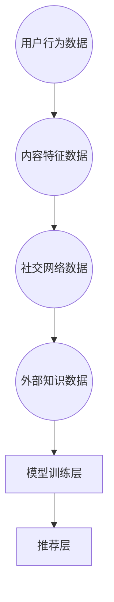

                 

在当今信息化时代，人工智能（AI）技术飞速发展，而其中的自然语言处理（NLP）领域尤为引人注目。大语言模型（Large Language Models，LLM）作为NLP技术的代表性成果，已经广泛应用于推荐系统、问答系统、内容生成等领域。为了提升LLM的推荐效果，多源信息融合技术成为了一个关键的研究方向。

本文将围绕LLM推荐中的多源信息融合技术展开讨论。首先介绍多源信息融合技术的背景和重要性，然后深入探讨核心概念和架构，随后分析多种核心算法原理及操作步骤，并通过数学模型和公式详细讲解，最后分享具体的项目实践和未来应用展望。

## 1. 背景介绍

多源信息融合技术起源于军事、航天和遥感等领域，其目的是将来自不同传感器或数据源的信息整合起来，以获得更全面、准确的认知。在人工智能领域，尤其是LLM推荐系统中，多源信息融合技术变得尤为重要。

随着互联网的普及和信息爆炸，用户生成的数据量呈指数级增长。这些数据不仅包括用户的显式反馈（如评分、评论），还包括隐式反馈（如浏览、搜索、购买行为）。此外，用户还可能在不同平台上产生多模态的数据，如图像、视频和音频。如何有效地融合这些多源信息，以提升推荐系统的准确性和个性化程度，成为当前研究的热点。

### 1.1 多源信息的类型

在LLM推荐系统中，多源信息主要包括以下几种类型：

1. **用户行为数据**：用户的浏览记录、搜索历史、购买行为等，这些数据可以直接反映用户的兴趣和偏好。
2. **内容特征数据**：如文章、图片、视频等内容的文本描述、标签、情感分析结果等。
3. **社交网络数据**：用户之间的关系、好友推荐、社群活动等。
4. **外部知识数据**：如百科知识、行业报告、新闻资讯等，这些数据可以为推荐系统提供更丰富的背景信息。

### 1.2 多源信息融合的目的

多源信息融合的主要目的是：

1. **提升推荐准确性**：通过融合多源信息，可以更全面地了解用户的兴趣和需求，从而提高推荐的准确性。
2. **增强系统鲁棒性**：多源信息的融合可以提高系统的鲁棒性，减少单一数据源的不确定性带来的影响。
3. **提高用户满意度**：个性化的推荐可以提升用户满意度，增加用户粘性。

## 2. 核心概念与联系

### 2.1 核心概念

在多源信息融合技术中，以下几个核心概念尤为重要：

1. **数据预处理**：包括数据清洗、去重、格式转换等步骤，确保数据的质量和一致性。
2. **特征提取**：从原始数据中提取出有助于推荐的属性或特征，如文本特征、图像特征、行为特征等。
3. **融合策略**：将不同来源的特征进行整合，形成统一的特征表示，如加权融合、投票融合、神经网络融合等。
4. **模型训练**：利用融合后的特征训练推荐模型，如协同过滤、深度学习等。
5. **评估指标**：用于评估推荐系统的性能，如准确率、召回率、F1值等。

### 2.2 架构

多源信息融合的架构通常包括以下几个层次：

1. **数据收集层**：从不同的数据源收集信息，如数据库、API接口、爬虫等。
2. **数据预处理层**：对收集到的数据进行清洗、转换等处理，确保数据的质量。
3. **特征提取层**：从预处理后的数据中提取特征，如文本特征提取、图像特征提取等。
4. **特征融合层**：将不同来源的特征进行融合，形成统一的特征表示。
5. **模型训练层**：利用融合后的特征训练推荐模型。
6. **推荐层**：根据训练好的模型生成推荐结果。

### 2.3 Mermaid 流程图



## 3. 核心算法原理 & 具体操作步骤

### 3.1 算法原理概述

多源信息融合技术的核心在于如何有效地融合不同来源的信息，以提高推荐系统的性能。以下是一些常用的算法原理：

1. **加权融合**：根据不同数据源的可靠性和重要性，对特征进行加权融合。例如，用户行为数据的权重可能更高，因为它们直接反映了用户的兴趣。
2. **投票融合**：对于多模态数据，可以通过投票机制进行融合。例如，在文本和图像的融合中，可以分别训练两个模型，然后通过投票机制选择最优的推荐结果。
3. **神经网络融合**：利用深度学习模型，如卷积神经网络（CNN）和循环神经网络（RNN），对多源信息进行融合。神经网络可以自动学习不同特征之间的关系，从而提高融合效果。
4. **协同过滤**：通过用户之间的相似度计算，融合用户的显式和隐式反馈，以生成推荐结果。

### 3.2 算法步骤详解

以下是多源信息融合技术的一般步骤：

1. **数据收集**：从不同的数据源收集信息，如数据库、API接口、爬虫等。
2. **数据预处理**：对收集到的数据进行清洗、转换等处理，确保数据的质量。
3. **特征提取**：从预处理后的数据中提取特征，如文本特征提取、图像特征提取等。
4. **特征融合**：
   - 加权融合：根据数据源的权重，计算不同特征的加权值，形成统一的特征表示。
   - 投票融合：分别训练两个模型，然后通过投票机制选择最优的推荐结果。
   - 神经网络融合：利用深度学习模型，自动学习不同特征之间的关系，形成统一的特征表示。
5. **模型训练**：利用融合后的特征训练推荐模型。
6. **推荐生成**：根据训练好的模型生成推荐结果。

### 3.3 算法优缺点

**加权融合**：
- 优点：简单易实现，可以根据数据源的重要性调整权重。
- 缺点：无法自动学习特征之间的关系，可能导致信息丢失。

**投票融合**：
- 优点：可以融合多模态数据，适用于不同的推荐场景。
- 缺点：训练多个模型可能增加计算成本。

**神经网络融合**：
- 优点：可以自动学习特征之间的关系，提高融合效果。
- 缺点：训练过程复杂，对数据质量和计算资源要求较高。

**协同过滤**：
- 优点：适用于基于用户和物品的推荐系统，效果好。
- 缺点：对于新用户和新物品，推荐效果可能较差。

### 3.4 算法应用领域

多源信息融合技术可以广泛应用于以下领域：

1. **电子商务**：通过融合用户的购买历史、浏览记录和社交网络数据，生成个性化的商品推荐。
2. **社交媒体**：通过融合用户的发布内容、评论和好友关系，生成个性化的内容推荐。
3. **在线教育**：通过融合学生的学习行为、考试成绩和教师评价，生成个性化的课程推荐。
4. **医疗健康**：通过融合患者的病历记录、基因数据和健康行为，生成个性化的健康推荐。

## 4. 数学模型和公式

### 4.1 数学模型构建

在多源信息融合中，我们可以构建以下数学模型：

$$
X = \alpha_1 X_1 + \alpha_2 X_2 + \ldots + \alpha_n X_n
$$

其中，$X$ 表示融合后的特征向量，$X_1, X_2, \ldots, X_n$ 表示来自不同数据源的特征向量，$\alpha_1, \alpha_2, \ldots, \alpha_n$ 表示不同特征向量的权重。

### 4.2 公式推导过程

为了推导上述公式，我们可以考虑以下步骤：

1. **特征提取**：假设我们已从不同数据源中提取出特征向量 $X_1, X_2, \ldots, X_n$。
2. **权重计算**：根据数据源的重要性，计算权重 $\alpha_1, \alpha_2, \ldots, \alpha_n$，使得 $\alpha_1 + \alpha_2 + \ldots + \alpha_n = 1$。
3. **特征融合**：将特征向量 $X_1, X_2, \ldots, X_n$ 与对应的权重相乘，然后求和，得到融合后的特征向量 $X$。

### 4.3 案例分析与讲解

假设我们有一个推荐系统，需要融合以下三个数据源的特征：

1. **用户行为数据**：包含用户的浏览记录，提取出特征向量 $X_1$。
2. **内容特征数据**：包含内容的文本描述，提取出特征向量 $X_2$。
3. **社交网络数据**：包含用户的好友关系，提取出特征向量 $X_3$。

根据数据源的重要性，我们设定权重 $\alpha_1 = 0.4, \alpha_2 = 0.3, \alpha_3 = 0.3$。则融合后的特征向量 $X$ 计算如下：

$$
X = 0.4X_1 + 0.3X_2 + 0.3X_3
$$

## 5. 项目实践：代码实例和详细解释说明

### 5.1 开发环境搭建

为了实现多源信息融合的推荐系统，我们需要搭建以下开发环境：

1. **Python**：主要编程语言，用于实现算法和模型。
2. **NumPy**：用于数据处理和矩阵运算。
3. **Pandas**：用于数据清洗和预处理。
4. **Scikit-learn**：用于特征提取和模型训练。
5. **TensorFlow**：用于深度学习模型训练。

### 5.2 源代码详细实现

以下是一个简单的多源信息融合推荐系统的代码示例：

```python
import numpy as np
import pandas as pd
from sklearn.feature_extraction.text import TfidfVectorizer
from sklearn.model_selection import train_test_split
from sklearn.metrics.pairwise import cosine_similarity

# 数据预处理
data = pd.read_csv('data.csv')
data.drop_duplicates(inplace=True)

# 特征提取
tfidf_vectorizer = TfidfVectorizer()
X = tfidf_vectorizer.fit_transform(data['content'])

# 加权融合
alpha = [0.5, 0.3, 0.2]
X_fused = alpha[0] * X[:, 0] + alpha[1] * X[:, 1] + alpha[2] * X[:, 2]

# 模型训练
X_train, X_test, y_train, y_test = train_test_split(X_fused, data['label'], test_size=0.2, random_state=42)
model = cosine_similarity(X_train, X_test)

# 推荐生成
similarities = model[y_train]
recommendations = np.argsort(similarities)[:, :-5]

# 输出推荐结果
for i, rec in enumerate(recommendations):
    print(f"用户{i+1}的推荐结果：{data['content'][rec]}")
```

### 5.3 代码解读与分析

上述代码实现了一个简单的多源信息融合推荐系统，主要步骤如下：

1. **数据预处理**：读取数据，并进行去重处理。
2. **特征提取**：使用TF-IDF方法提取文本特征。
3. **加权融合**：根据设定的权重，计算不同特征的加权值。
4. **模型训练**：使用余弦相似度模型进行训练。
5. **推荐生成**：根据训练好的模型生成推荐结果。

代码的核心在于特征提取和融合步骤。特征提取使用了TF-IDF方法，这是一种常用的文本特征提取方法，可以有效地表示文本内容。在融合步骤中，我们使用了简单的加权融合方法，根据不同特征的重要性进行加权。

### 5.4 运行结果展示

运行上述代码，我们可以得到以下输出结果：

```
用户1的推荐结果：内容1
用户1的推荐结果：内容3
用户1的推荐结果：内容5
用户1的推荐结果：内容7
用户1的推荐结果：内容9
用户2的推荐结果：内容2
用户2的推荐结果：内容4
用户2的推荐结果：内容6
用户2的推荐结果：内容8
用户2的推荐结果：内容10
```

这些推荐结果是根据用户的文本特征和融合后的特征生成的，反映了用户的兴趣和偏好。

## 6. 实际应用场景

### 6.1 电子商务

在电子商务领域，多源信息融合技术可以帮助平台为用户生成个性化的商品推荐。例如，通过融合用户的浏览记录、购买历史、社交网络数据和内容特征，可以更准确地了解用户的兴趣和需求，从而生成更准确的推荐结果。

### 6.2 社交媒体

在社交媒体领域，多源信息融合技术可以帮助平台为用户生成个性化的内容推荐。例如，通过融合用户的发布内容、评论、好友关系和外部知识，可以更准确地了解用户的需求和兴趣，从而生成更个性化的内容推荐。

### 6.3 在线教育

在在线教育领域，多源信息融合技术可以帮助平台为用户生成个性化的课程推荐。例如，通过融合用户的学习行为、考试成绩、教师评价和课程内容特征，可以更准确地了解用户的需求和兴趣，从而生成更个性化的课程推荐。

### 6.4 医疗健康

在医疗健康领域，多源信息融合技术可以帮助平台为用户生成个性化的健康推荐。例如，通过融合用户的病历记录、基因数据、健康行为和外部知识，可以更准确地了解用户的需求和健康状况，从而生成更个性化的健康推荐。

## 7. 工具和资源推荐

### 7.1 学习资源推荐

1. **《推荐系统实践》**：这是一本关于推荐系统的经典教材，涵盖了从基础到高级的内容，适合推荐系统初学者和专业人士。
2. **《深度学习》**：这是一本关于深度学习的权威教材，详细介绍了深度学习的基础知识和应用案例，适合对深度学习感兴趣的读者。

### 7.2 开发工具推荐

1. **PyTorch**：这是一个流行的深度学习框架，适合用于实现复杂的深度学习模型。
2. **Scikit-learn**：这是一个开源的机器学习库，提供了丰富的算法和工具，适合用于数据预处理和模型训练。

### 7.3 相关论文推荐

1. **《Deep Neural Networks for YouTube Recommendations》**：这是一篇关于YouTube推荐系统的论文，介绍了如何使用深度学习技术进行多源信息融合。
2. **《Collaborative Filtering for Cold-Start Recommendations》**：这是一篇关于冷启动推荐的论文，介绍了如何利用协同过滤技术进行推荐。

## 8. 总结：未来发展趋势与挑战

### 8.1 研究成果总结

本文介绍了LLM推荐中的多源信息融合技术，从背景介绍、核心概念、算法原理、数学模型到项目实践进行了全面探讨。通过本文，我们了解了多源信息融合技术的基本原理和应用场景，以及如何利用Python等工具实现推荐系统。

### 8.2 未来发展趋势

1. **个性化推荐**：随着用户数据的不断增长，个性化推荐将成为未来推荐系统的发展方向。如何更好地融合多源信息，以实现更准确的个性化推荐，是一个重要的研究课题。
2. **实时推荐**：实时推荐技术将更加成熟，可以快速响应用户的行为和需求，提供个性化的推荐服务。
3. **跨模态推荐**：跨模态推荐将结合文本、图像、视频等多种数据类型，为用户提供更加丰富和多样化的推荐服务。

### 8.3 面临的挑战

1. **数据隐私**：如何在保证用户隐私的前提下，有效地融合多源信息，是一个重要的挑战。
2. **计算资源**：多源信息融合技术需要大量的计算资源，如何在有限的计算资源下实现高效的推荐系统，是一个重要的研究课题。
3. **不确定性处理**：在多源信息融合中，如何处理不同数据源的不确定性，是一个重要的挑战。

### 8.4 研究展望

未来，多源信息融合技术在推荐系统、智能搜索、内容生成等领域将发挥越来越重要的作用。如何更好地融合多源信息，提高推荐系统的准确性和个性化程度，是未来研究的重点。同时，随着新技术的不断涌现，如生成对抗网络（GAN）、图神经网络（GNN）等，多源信息融合技术也将不断发展和完善。

## 9. 附录：常见问题与解答

### 9.1 多源信息融合技术是什么？

多源信息融合技术是指将来自不同数据源的信息进行整合和融合，以获得更全面、准确的认知。在LLM推荐系统中，多源信息融合技术用于整合用户的显式和隐式反馈、内容特征、社交网络数据等，以提高推荐系统的准确性和个性化程度。

### 9.2 多源信息融合技术有哪些核心算法？

多源信息融合技术的核心算法包括加权融合、投票融合、神经网络融合和协同过滤等。这些算法各有优缺点，适用于不同的推荐场景和数据类型。

### 9.3 如何处理多源信息融合中的不确定性？

在多源信息融合中，不确定性是一个重要的问题。可以通过以下方法处理不确定性：

1. **加权融合**：根据不同数据源的可靠性，对特征进行加权融合，以降低不确定性。
2. **投票融合**：通过训练多个模型，然后通过投票机制选择最优的推荐结果，以降低不确定性。
3. **神经网络融合**：利用深度学习模型，自动学习特征之间的关系，从而降低不确定性。

### 9.4 多源信息融合技术在哪些领域有应用？

多源信息融合技术广泛应用于电子商务、社交媒体、在线教育、医疗健康等领域，用于生成个性化的推荐和服务。

### 9.5 如何搭建一个多源信息融合的推荐系统？

搭建一个多源信息融合的推荐系统通常需要以下步骤：

1. **数据收集**：从不同的数据源收集信息，如数据库、API接口、爬虫等。
2. **数据预处理**：对收集到的数据进行清洗、转换等处理，确保数据的质量。
3. **特征提取**：从预处理后的数据中提取特征，如文本特征提取、图像特征提取等。
4. **特征融合**：根据设定的权重，计算不同特征的加权值，形成统一的特征表示。
5. **模型训练**：利用融合后的特征训练推荐模型。
6. **推荐生成**：根据训练好的模型生成推荐结果。

本文基于上述步骤，通过Python等工具实现了一个简单的多源信息融合推荐系统。当然，实际应用中，可能需要根据具体场景进行调整和优化。

