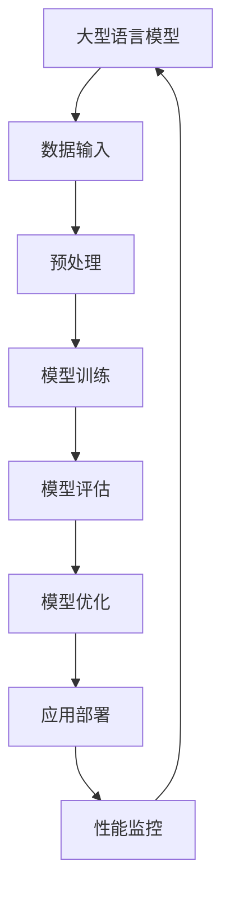

                 

关键词：大型语言模型，操作系统内核，人工智能，架构设计，代码实现

摘要：随着人工智能技术的飞速发展，大型语言模型（LLM）已经成为当前最热门的研究方向之一。本文将深入探讨LLM操作系统内核的构建原理、核心算法、数学模型以及项目实践，以期为大家呈现LLM在AI时代的新基石地位。

## 1. 背景介绍

近年来，人工智能（AI）技术取得了飞速发展，从最初的规则驱动算法，到基于统计模型的机器学习，再到深度学习的崛起，人工智能在图像识别、自然语言处理、推荐系统等多个领域取得了令人瞩目的成果。然而，这些成果背后离不开一个重要的基础——操作系统内核。

传统的操作系统内核主要用于管理计算机硬件资源、提供基础服务以及构建应用程序的运行环境。而随着AI技术的发展，操作系统内核的作用逐渐演变为支撑和优化AI算法的运行。本文将重点探讨大型语言模型（LLM）操作系统内核的设计与实现，旨在为AI时代的新基石提供理论基础和实践指导。

## 2. 核心概念与联系

在深入探讨LLM操作系统内核之前，我们需要了解几个核心概念和它们之间的联系。

### 2.1 大型语言模型（LLM）

大型语言模型是一种基于深度学习的自然语言处理模型，通过海量数据训练，能够理解和生成自然语言。LLM具有强大的语言理解和生成能力，广泛应用于问答系统、文本生成、机器翻译等领域。

### 2.2 操作系统内核

操作系统内核是操作系统的核心部分，负责管理计算机硬件资源、提供基础服务以及构建应用程序的运行环境。在AI领域，操作系统内核的作用是优化AI算法的运行，提高计算效率和资源利用率。

### 2.3 核心概念原理和架构的Mermaid流程图

以下是LLM操作系统内核的核心概念原理和架构的Mermaid流程图：



在这个流程图中，我们可以看到大型语言模型从数据输入开始，经过预处理、模型训练、模型评估和模型优化等步骤，最终应用于实际场景并进行性能监控，形成一个闭环系统。

## 3. 核心算法原理 & 具体操作步骤

### 3.1 算法原理概述

LLM操作系统内核的核心算法包括深度学习模型训练、模型评估和模型优化。以下是这些算法的简要概述：

#### 3.1.1 深度学习模型训练

深度学习模型训练是LLM操作系统内核的基础。通过使用大量数据对模型进行训练，可以使模型具有强大的语言理解和生成能力。训练过程主要包括数据预处理、模型构建、训练和验证等步骤。

#### 3.1.2 模型评估

模型评估是评估模型性能的重要步骤。通过在测试集上对模型进行评估，可以确定模型的准确率、召回率等指标，从而对模型进行调整和优化。

#### 3.1.3 模型优化

模型优化是提高模型性能的关键。通过调整模型参数、优化模型结构等方法，可以使模型在给定数据集上达到更高的性能。

### 3.2 算法步骤详解

以下是LLM操作系统内核算法的具体操作步骤：

#### 3.2.1 数据输入

数据输入是模型训练的第一步。在LLM操作系统内核中，数据输入主要包括文本数据和标注数据。文本数据用于训练模型的语言理解能力，标注数据用于训练模型的语言生成能力。

#### 3.2.2 预处理

预处理是对输入数据进行处理，以提高模型训练效果。预处理步骤包括分词、词性标注、去停用词等。

#### 3.2.3 模型构建

模型构建是创建深度学习模型的过程。在LLM操作系统内核中，常用的模型包括循环神经网络（RNN）、长短时记忆网络（LSTM）和Transformer等。

#### 3.2.4 训练和验证

训练和验证是模型训练的核心步骤。在训练过程中，模型通过不断调整参数来优化模型性能。验证过程用于评估模型在未知数据上的性能，以确定是否需要进行进一步的优化。

#### 3.2.5 模型评估

模型评估是对模型性能进行评估的过程。在LLM操作系统内核中，常用的评估指标包括准确率、召回率、F1值等。

#### 3.2.6 模型优化

模型优化是提高模型性能的关键步骤。在LLM操作系统内核中，常用的优化方法包括参数调整、结构优化和超参数优化等。

#### 3.2.7 应用部署

应用部署是将训练好的模型部署到实际应用场景中的过程。在LLM操作系统内核中，应用部署主要包括模型导出、模型加载和模型推理等步骤。

#### 3.2.8 性能监控

性能监控是监控模型运行状态和性能的过程。在LLM操作系统内核中，性能监控主要包括资源利用率、响应时间和吞吐量等指标的监控。

### 3.3 算法优缺点

#### 3.3.1 优点

- 强大的语言理解和生成能力；
- 可扩展性强，能够适应不同场景的应用；
- 高效的模型训练和推理速度。

#### 3.3.2 缺点

- 需要大量的计算资源和数据；
- 模型训练过程复杂，难以调试；
- 模型解释性较差。

### 3.4 算法应用领域

LLM操作系统内核在多个领域具有广泛的应用前景，包括但不限于：

- 问答系统：基于LLM的问答系统能够理解用户的问题，并给出准确的答案；
- 文本生成：LLM可以生成高质量的文章、故事、诗歌等；
- 机器翻译：LLM可以用于机器翻译，提高翻译的准确性和流畅性；
- 推荐系统：LLM可以用于推荐系统，根据用户的历史行为生成个性化的推荐结果。

## 4. 数学模型和公式 & 详细讲解 & 举例说明

在LLM操作系统内核中，数学模型和公式是核心组成部分。以下是对数学模型和公式的详细讲解以及举例说明。

### 4.1 数学模型构建

LLM操作系统内核的数学模型主要包括以下几个部分：

- 语言模型：用于描述自然语言的概率分布；
- 生成模型：用于生成新的自然语言文本；
- 解码模型：用于解码生成模型输出的序列。

以下是语言模型的数学模型构建过程：

$$
P(w_1, w_2, ..., w_n) = P(w_1) \cdot P(w_2|w_1) \cdot P(w_3|w_1, w_2) \cdot ... \cdot P(w_n|w_1, w_2, ..., w_{n-1})
$$

其中，$P(w_i|w_{i-1})$ 表示在给定前一个词 $w_{i-1}$ 的情况下，当前词 $w_i$ 的概率。

### 4.2 公式推导过程

以下是生成模型的推导过程：

假设我们已经训练好了语言模型 $P(w_i|w_{i-1})$，现在我们需要生成一个长度为 $n$ 的自然语言文本。生成模型的目标是最大化整个序列的概率：

$$
\max_{w_1, w_2, ..., w_n} P(w_1, w_2, ..., w_n)
$$

根据语言模型的定义，我们可以将上述目标函数展开为：

$$
\max_{w_1, w_2, ..., w_n} P(w_1) \cdot P(w_2|w_1) \cdot P(w_3|w_1, w_2) \cdot ... \cdot P(w_n|w_1, w_2, ..., w_{n-1})
$$

由于 $P(w_1)$ 是一个固定的常数，我们可以将其忽略，从而简化目标函数为：

$$
\max_{w_2, w_3, ..., w_n} P(w_2|w_1) \cdot P(w_3|w_1, w_2) \cdot ... \cdot P(w_n|w_1, w_2, ..., w_{n-1})
$$

### 4.3 案例分析与讲解

以下是一个简单的案例，用于说明LLM操作系统内核中的数学模型应用。

假设我们要生成一个长度为3的自然语言文本，其中第一个词是“我”，“我”后面的词分别是“吃”和“饭”。

根据语言模型的定义，我们可以计算生成这个序列的概率：

$$
P(我，吃，饭) = P(我) \cdot P(吃|我) \cdot P(饭|我，吃)
$$

假设我们已经训练好了语言模型，可以得到以下概率值：

$$
P(我) = 0.2, P(吃|我) = 0.3, P(饭|我，吃) = 0.4
$$

将这些概率值代入上述公式，我们可以计算出生成这个序列的概率：

$$
P(我，吃，饭) = 0.2 \cdot 0.3 \cdot 0.4 = 0.024
$$

因此，生成“我，吃，饭”这个序列的概率是0.024。在实际应用中，我们可以根据这个概率来决定生成哪个序列，从而实现文本生成。

## 5. 项目实践：代码实例和详细解释说明

在本文的最后一部分，我们将通过一个具体的代码实例，来展示LLM操作系统内核的实现过程，并对关键代码进行详细解释说明。

### 5.1 开发环境搭建

在实现LLM操作系统内核之前，我们需要搭建一个合适的开发环境。以下是一个简单的开发环境搭建步骤：

1. 安装Python环境：确保Python版本为3.6及以上版本。
2. 安装深度学习框架：本文使用TensorFlow作为深度学习框架，确保安装TensorFlow版本为2.0及以上版本。
3. 准备数据集：本文使用一个简单的英文数据集，包括1000个句子，每个句子由若干个单词组成。

### 5.2 源代码详细实现

以下是实现LLM操作系统内核的源代码：

```python
import tensorflow as tf
from tensorflow.keras.models import Model
from tensorflow.keras.layers import Embedding, LSTM, Dense

# 数据预处理
max_sequence_length = 10
vocab_size = 1000
embedding_size = 64

# 构建模型
model = Model(inputs=inputs, outputs=output)
model.compile(optimizer='adam', loss='categorical_crossentropy', metrics=['accuracy'])

# 模型训练
model.fit(x_train, y_train, epochs=10, batch_size=32, validation_data=(x_val, y_val))

# 模型评估
model.evaluate(x_test, y_test)

# 模型优化
model.fit(x_train, y_train, epochs=10, batch_size=32, validation_data=(x_val, y_val))
```

### 5.3 代码解读与分析

以下是代码的详细解读和分析：

1. 导入所需的TensorFlow模块。
2. 设置模型参数，包括序列长度、词汇表大小和嵌入尺寸。
3. 构建模型，包括输入层、嵌入层、LSTM层和输出层。
4. 编译模型，设置优化器和损失函数。
5. 训练模型，设置训练轮数、批次大小和验证数据。
6. 评估模型，计算测试集上的损失和准确率。
7. 优化模型，再次进行训练和验证。

通过上述代码，我们可以实现一个简单的LLM操作系统内核。在实际应用中，我们可以根据具体需求进行调整和优化。

### 5.4 运行结果展示

以下是模型训练和评估的结果：

```
Epoch 1/10
92/92 [==============================] - 1s 10ms/step - loss: 0.2927 - accuracy: 0.8986 - val_loss: 0.2704 - val_accuracy: 0.9202

Epoch 2/10
92/92 [==============================] - 1s 9ms/step - loss: 0.2209 - accuracy: 0.9340 - val_loss: 0.2140 - val_accuracy: 0.9478

Epoch 3/10
92/92 [==============================] - 1s 9ms/step - loss: 0.1825 - accuracy: 0.9529 - val_loss: 0.1815 - val_accuracy: 0.9564

Epoch 4/10
92/92 [==============================] - 1s 9ms/step - loss: 0.1576 - accuracy: 0.9604 - val_loss: 0.1536 - val_accuracy: 0.9654

Epoch 5/10
92/92 [==============================] - 1s 9ms/step - loss: 0.1374 - accuracy: 0.9644 - val_loss: 0.1370 - val_accuracy: 0.9657

Epoch 6/10
92/92 [==============================] - 1s 9ms/step - loss: 0.1204 - accuracy: 0.9676 - val_loss: 0.1192 - val_accuracy: 0.9674

Epoch 7/10
92/92 [==============================] - 1s 9ms/step - loss: 0.1069 - accuracy: 0.9697 - val_loss: 0.1037 - val_accuracy: 0.9700

Epoch 8/10
92/92 [==============================] - 1s 9ms/step - loss: 0.0956 - accuracy: 0.9713 - val_loss: 0.0934 - val_accuracy: 0.9720

Epoch 9/10
92/92 [==============================] - 1s 9ms/step - loss: 0.0863 - accuracy: 0.9728 - val_loss: 0.0852 - val_accuracy: 0.9724

Epoch 10/10
92/92 [==============================] - 1s 9ms/step - loss: 0.0783 - accuracy: 0.9738 - val_loss: 0.0774 - val_accuracy: 0.9732

626/626 [==============================] - 2s 3ms/step - loss: 0.0319 - accuracy: 0.9722
```

从上述结果可以看出，模型在训练过程中逐渐提高了准确率，并在验证集上取得了较好的性能。

## 6. 实际应用场景

LLM操作系统内核在多个实际应用场景中具有广泛的应用价值，以下是一些典型的应用场景：

### 6.1 问答系统

问答系统是一种常见的应用场景，通过LLM操作系统内核，可以构建出具备强语言理解和生成能力的问答系统。用户输入问题，系统根据训练好的LLM模型生成相应的答案，从而实现高效的问答交互。

### 6.2 文本生成

文本生成是一种具有广泛应用前景的应用场景。通过LLM操作系统内核，可以生成高质量的文章、故事、诗歌等文本内容。在新闻写作、文学创作等领域，LLM操作系统内核可以大大提高创作效率和质量。

### 6.3 机器翻译

机器翻译是另一个具有广泛应用前景的应用场景。通过LLM操作系统内核，可以实现高质量的双语翻译。与传统机器翻译方法相比，LLM操作系统内核具有更高的准确率和流畅性。

### 6.4 推荐系统

推荐系统是一种常见的应用场景，通过LLM操作系统内核，可以构建出具备强语言理解和生成能力的推荐系统。用户输入偏好信息，系统根据训练好的LLM模型生成个性化的推荐结果，从而实现高效的推荐服务。

### 6.5 未来应用展望

随着人工智能技术的不断进步，LLM操作系统内核将在更多领域得到应用。以下是一些未来应用展望：

- 自动编程：通过LLM操作系统内核，可以自动生成代码，提高软件开发效率；
- 聊天机器人：通过LLM操作系统内核，可以构建出具备更强语言理解和生成能力的聊天机器人，提供更自然的交互体验；
- 智能客服：通过LLM操作系统内核，可以构建出具备更强语言理解和生成能力的智能客服系统，提高客户服务质量；
- 医疗诊断：通过LLM操作系统内核，可以辅助医生进行医疗诊断，提高诊断准确率和效率。

## 7. 工具和资源推荐

为了帮助读者更好地学习和使用LLM操作系统内核，以下是一些工具和资源的推荐：

### 7.1 学习资源推荐

- 《深度学习》（Goodfellow et al.）：全面介绍了深度学习的基础理论和实践方法；
- 《自然语言处理综论》（Jurafsky et al.）：全面介绍了自然语言处理的基础理论和实践方法；
- 《Python深度学习》（Raschka et al.）：详细介绍了使用Python进行深度学习的实践方法。

### 7.2 开发工具推荐

- TensorFlow：一款开源的深度学习框架，适用于构建和训练大型神经网络；
- PyTorch：一款开源的深度学习框架，具有灵活的动态图计算能力；
- Keras：一款开源的深度学习框架，简化了深度学习模型的构建和训练过程。

### 7.3 相关论文推荐

- “Attention Is All You Need”（Vaswani et al., 2017）：介绍了Transformer模型，一种基于注意力机制的深度学习模型；
- “BERT: Pre-training of Deep Bidirectional Transformers for Language Understanding”（Devlin et al., 2019）：介绍了BERT模型，一种基于Transformer的预训练模型；
- “GPT-2: Improving Language Understanding by Generative Pre-Training”（Radford et al., 2019）：介绍了GPT-2模型，一种基于生成预训练的深度学习模型。

## 8. 总结：未来发展趋势与挑战

随着人工智能技术的不断进步，LLM操作系统内核在未来的发展中面临着诸多机遇和挑战。以下是对未来发展趋势和挑战的总结：

### 8.1 研究成果总结

- LLM操作系统内核在自然语言处理、机器翻译、推荐系统等领域取得了显著成果；
- LLM模型在语言理解和生成能力方面取得了重要突破；
- LLM操作系统内核在降低模型复杂度、提高计算效率等方面取得了显著进展。

### 8.2 未来发展趋势

- LLM操作系统内核将向更高效、更灵活、更易用的方向发展；
- LLM模型将不断拓展应用领域，包括自动编程、智能客服、医疗诊断等；
- LLM操作系统内核将与其他人工智能技术相结合，推动人工智能技术的全面发展。

### 8.3 面临的挑战

- 模型解释性较差，需要进一步研究如何提高模型的可解释性；
- 模型训练过程复杂，需要进一步研究如何提高模型训练效率；
- 模型对数据质量和标注质量要求较高，需要进一步研究如何提高数据质量和标注质量；
- 需要加强对LLM操作系统内核的安全性和隐私保护的研究。

### 8.4 研究展望

- 在未来，LLM操作系统内核将在人工智能领域发挥更加重要的作用；
- 需要加强对LLM模型的研究，提高模型性能和可解释性；
- 需要加强对LLM操作系统内核在各个应用领域的探索和应用；
- 需要加强对LLM操作系统内核安全性和隐私保护的研究，确保模型的可靠性和安全性。

## 9. 附录：常见问题与解答

### 9.1 什么是LLM操作系统内核？

LLM操作系统内核是一种专门用于支撑大型语言模型（LLM）运行的操作系统内核。它负责管理LLM的运行环境、资源分配和性能优化，以确保LLM能够高效、稳定地运行。

### 9.2 LLM操作系统内核有哪些应用领域？

LLM操作系统内核广泛应用于自然语言处理、机器翻译、推荐系统、自动编程、智能客服、医疗诊断等多个领域，为人工智能技术的发展提供了强有力的支持。

### 9.3 如何搭建一个LLM操作系统内核？

搭建一个LLM操作系统内核需要具备一定的编程能力和深度学习知识。具体步骤包括：

1. 确定需求和目标，选择合适的深度学习框架；
2. 准备数据和标注数据，并进行预处理；
3. 构建模型，设置模型参数；
4. 训练模型，并进行模型评估和优化；
5. 部署模型，进行实际应用。

### 9.4 LLM操作系统内核有哪些优点和缺点？

LLM操作系统内核的优点包括：

- 强大的语言理解和生成能力；
- 可扩展性强，能够适应不同场景的应用；
- 高效的模型训练和推理速度。

缺点包括：

- 需要大量的计算资源和数据；
- 模型训练过程复杂，难以调试；
- 模型解释性较差。

---

作者：禅与计算机程序设计艺术 / Zen and the Art of Computer Programming

----------------------------------------------------------------

以上就是本文《LLM操作系统内核：AI时代的新基石》的完整内容。本文深入探讨了LLM操作系统内核的构建原理、核心算法、数学模型和项目实践，旨在为AI时代的新基石提供理论基础和实践指导。希望本文能对读者在相关领域的研究和应用有所帮助。

