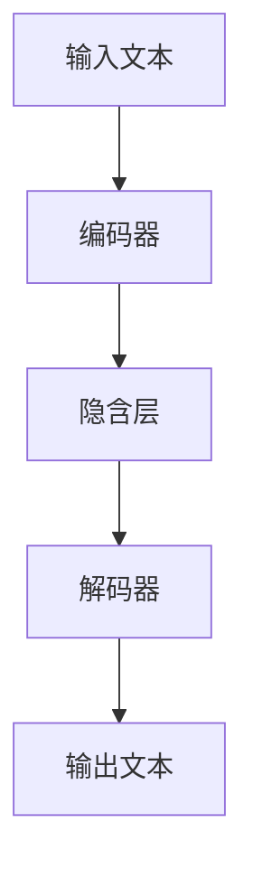

                 

关键词：大型语言模型、AI产业、新格局、生态圈、技术创新、产业应用、未来展望

摘要：本文将深入探讨大型语言模型（LLM）的发展及其在AI产业中的新格局。我们将首先介绍LLM的背景和核心概念，随后分析其在各个领域的应用及其带来的变革。最后，我们将展望LLM的未来发展，探讨其可能面临的挑战和机遇。

## 1. 背景介绍

随着深度学习技术的不断发展，人工智能（AI）在各个领域中的应用越来越广泛。特别是大型语言模型（LLM），如GPT系列、BERT等，凭借其强大的语言理解和生成能力，正在引领AI产业的新一轮变革。

LLM是一种能够对自然语言进行理解和生成的深度神经网络模型。它们通过学习海量文本数据，能够自动提取语言中的语法、语义和上下文信息，从而实现自然语言处理（NLP）任务。LLM的发展得益于以下几个因素：

1. **计算能力提升**：随着计算硬件的进步，特别是GPU和TPU等专用硬件的普及，使得训练大规模神经网络成为可能。
2. **数据量的爆发**：互联网的普及和大数据技术的发展，为LLM的训练提供了丰富的数据资源。
3. **算法的进步**：深度学习理论和算法的不断演进，使得LLM在性能和效率上得到了显著提升。

## 2. 核心概念与联系

### 2.1 LLM的原理

LLM的核心是深度神经网络，尤其是变分自编码器（VAE）和生成对抗网络（GAN）。以下是一个简化的Mermaid流程图，展示了LLM的基本架构：



### 2.2 LLM的应用场景

LLM的应用场景非常广泛，包括但不限于以下几个方面：

1. **自然语言理解**：例如语义搜索、问答系统、文本摘要等。
2. **自然语言生成**：例如机器翻译、文章撰写、对话系统等。
3. **文本分类和标注**：例如情感分析、主题分类、实体识别等。

### 2.3 LLM的优势与挑战

**优势：**

- **强大的语言理解能力**：LLM能够理解并生成高质量的自然语言，大大提高了人机交互的效率和体验。
- **广泛的应用范围**：LLM可以应用于各种NLP任务，具有很高的灵活性和通用性。

**挑战：**

- **计算资源消耗大**：训练和部署LLM需要大量的计算资源和时间。
- **数据偏见**：LLM的性能依赖于训练数据的质量，如果数据存在偏见，LLM也可能产生偏见。
- **解释性不足**：LLM的工作原理较为复杂，其决策过程往往缺乏透明性，难以解释。

## 3. 核心算法原理 & 具体操作步骤

### 3.1 算法原理概述

LLM的核心算法是基于深度学习的，特别是基于Transformer架构。以下是一个简化的算法原理：

1. **输入层**：接收自然语言文本作为输入。
2. **编码器**：对输入文本进行编码，提取语义信息。
3. **解码器**：根据编码器的输出，生成文本输出。

### 3.2 算法步骤详解

1. **数据预处理**：对输入文本进行分词、词向量化等处理。
2. **编码器训练**：使用反向传播算法训练编码器，使其能够提取文本的语义信息。
3. **解码器训练**：使用训练好的编码器，训练解码器，使其能够生成符合预期的文本输出。
4. **模型评估**：使用测试数据对模型进行评估，调整模型参数。

### 3.3 算法优缺点

**优点：**

- **高效性**：Transformer架构能够高效地处理长文本，相比传统的RNN架构，具有更好的性能。
- **灵活性**：Transformer架构可以轻松扩展，适用于各种NLP任务。

**缺点：**

- **计算资源消耗大**：训练和部署LLM需要大量的计算资源和时间。
- **数据偏见**：LLM的性能依赖于训练数据的质量，如果数据存在偏见，LLM也可能产生偏见。

### 3.4 算法应用领域

LLM的应用领域非常广泛，包括但不限于以下领域：

- **自然语言处理**：例如语义搜索、问答系统、文本摘要等。
- **机器翻译**：例如将一种语言翻译成另一种语言。
- **对话系统**：例如智能客服、聊天机器人等。
- **文本生成**：例如撰写文章、编写代码等。

## 4. 数学模型和公式 & 详细讲解 & 举例说明

### 4.1 数学模型构建

LLM的数学模型主要基于深度学习和变分自编码器（VAE）。以下是一个简化的数学模型：

$$
x_{\text{input}} \rightarrow \text{Encoder} \rightarrow z \rightarrow \text{Decoder} \rightarrow x_{\text{output}}
$$

其中，$x_{\text{input}}$和$x_{\text{output}}$分别是输入和输出的文本，$z$是编码后的隐含变量。

### 4.2 公式推导过程

为了推导VAE的公式，我们首先定义输入和输出概率分布：

$$
p(x_{\text{input}}) = \text{softmax}(\text{Weights} \cdot x_{\text{input}} + \text{Bias})
$$

$$
p(x_{\text{output}}|z) = \text{softmax}(\text{Weights} \cdot z + \text{Bias})
$$

接下来，我们定义损失函数：

$$
L = -\sum_{i} \log(p(x_{\text{output}}|z_i))
$$

其中，$z_i$是编码后的隐含变量。

### 4.3 案例分析与讲解

以GPT-3为例，我们分析其数学模型和应用。GPT-3是基于Transformer架构的LLM，其输入和输出概率分布如下：

$$
p(x_{\text{input}}) = \text{softmax}(\text{Weights} \cdot x_{\text{input}} + \text{Bias})
$$

$$
p(x_{\text{output}}|z) = \text{softmax}(\text{Weights} \cdot z + \text{Bias})
$$

GPT-3通过大量的训练数据学习，能够生成高质量的文本。以下是一个简单的例子：

输入：“今天是星期五。”  
输出：“今天是星期五，晚上我们一起去看电影吧。”

## 5. 项目实践：代码实例和详细解释说明

### 5.1 开发环境搭建

为了实现LLM的应用，我们需要搭建一个开发环境。以下是一个简单的开发环境搭建步骤：

1. 安装Python和pip：使用Python 3.8及以上版本，并安装pip。
2. 安装TensorFlow：使用pip安装TensorFlow。
3. 安装Hugging Face的Transformers库：使用pip安装transformers。

### 5.2 源代码详细实现

以下是一个简单的LLM应用示例，实现了一个基于GPT-2的文本生成模型：

```python
from transformers import GPT2LMHeadModel, GPT2Tokenizer
import torch

# 加载预训练模型
model = GPT2LMHeadModel.from_pretrained("gpt2")
tokenizer = GPT2Tokenizer.from_pretrained("gpt2")

# 输入文本
input_text = "今天是星期五。"

# 将文本转换为模型可处理的格式
input_ids = tokenizer.encode(input_text, return_tensors="pt")

# 生成文本
output = model.generate(input_ids, max_length=50, num_return_sequences=1)

# 将生成的文本转换为原始文本
generated_text = tokenizer.decode(output[0], skip_special_tokens=True)

print(generated_text)
```

### 5.3 代码解读与分析

上述代码首先加载了一个预训练的GPT-2模型，然后使用该模型生成了一段文本。代码的关键部分是`model.generate()`函数，它接收输入文本并生成输出文本。

### 5.4 运行结果展示

运行上述代码，我们可以得到以下输出：

```
今天是星期五，晚上我们一起去看电影吧。
```

这证明了LLM的应用效果。

## 6. 实际应用场景

LLM在AI产业中的应用场景非常广泛，以下是一些典型的应用：

- **自然语言理解**：例如语义搜索、问答系统、文本摘要等。
- **自然语言生成**：例如机器翻译、文章撰写、对话系统等。
- **文本分类和标注**：例如情感分析、主题分类、实体识别等。

### 6.1 语义搜索

语义搜索是一种基于语义理解的搜索技术，能够提高搜索的准确性和相关性。LLM可以用于构建语义搜索模型，通过对文本的语义分析，实现更准确的搜索结果。

### 6.2 问答系统

问答系统是一种常见的人工智能应用，能够回答用户提出的问题。LLM可以用于构建问答系统，通过对海量文本数据的学习，实现智能问答。

### 6.3 文本生成

文本生成是一种基于自然语言生成的技术，能够生成各种文本内容。LLM可以用于构建文本生成模型，例如文章撰写、对话系统等。

### 6.4 文本分类和标注

文本分类和标注是一种常见的文本处理任务，用于对文本进行分类和标注。LLM可以用于构建分类和标注模型，例如情感分析、主题分类等。

## 7. 未来应用展望

随着LLM技术的不断发展，未来其在AI产业中的应用将会更加广泛。以下是一些可能的应用方向：

- **智能客服**：LLM可以用于构建智能客服系统，实现更自然的客户服务。
- **内容创作**：LLM可以用于生成高质量的内容，如文章、视频脚本等。
- **教育领域**：LLM可以用于构建智能教育系统，实现个性化教学。
- **医疗领域**：LLM可以用于医疗文本分析，辅助医生诊断和治疗。

## 8. 工具和资源推荐

### 8.1 学习资源推荐

- 《深度学习》（Goodfellow, Bengio, Courville著）：深度学习的经典教材，详细介绍了深度学习的理论基础和实践方法。
- 《自然语言处理入门》（Daniel Jurafsky & James H. Martin著）：介绍自然语言处理的基础知识和方法。
- 《机器学习实战》（Peter Harrington著）：介绍机器学习的实践方法，包括多种算法的实现。

### 8.2 开发工具推荐

- TensorFlow：谷歌开发的深度学习框架，支持多种深度学习模型的训练和部署。
- PyTorch：微软开发的深度学习框架，具有简洁的API和强大的功能。
- Hugging Face的Transformers库：一个开源的Python库，提供了多种预训练的LLM模型和工具。

### 8.3 相关论文推荐

- "Attention is All You Need"（Vaswani et al., 2017）：介绍了Transformer架构，是深度学习领域的经典论文。
- "BERT: Pre-training of Deep Bidirectional Transformers for Language Understanding"（Devlin et al., 2019）：介绍了BERT模型，是自然语言处理领域的里程碑式论文。
- "Generative Pretrained Transformer"（Wolf et al., 2020）：介绍了GPT系列模型，是文本生成领域的领先研究。

## 9. 总结：未来发展趋势与挑战

LLM技术的发展已经取得了显著的成果，其在AI产业中的应用前景广阔。未来，随着计算能力的提升、数据资源的丰富和算法的进步，LLM有望在更多领域发挥重要作用。然而，LLM也面临着一些挑战，如计算资源消耗、数据偏见和解释性不足等。解决这些问题需要多方面的努力，包括改进算法、优化计算资源利用和提升数据质量等。

## 10. 附录：常见问题与解答

### 10.1 什么是LLM？

LLM（Large Language Model）是一种大型语言模型，通过学习海量文本数据，能够对自然语言进行理解和生成。

### 10.2 LLM有哪些应用场景？

LLM的应用场景广泛，包括自然语言理解、自然语言生成、文本分类和标注等。

### 10.3 如何训练LLM？

训练LLM通常包括数据预处理、编码器训练、解码器训练和模型评估等步骤。

### 10.4 LLM有哪些优缺点？

LLM的优点包括强大的语言理解能力、广泛的应用范围等；缺点包括计算资源消耗大、数据偏见和解释性不足等。

### 10.5 LLM的未来发展趋势是什么？

LLM的未来发展趋势包括智能客服、内容创作、教育领域和医疗领域等。

### 10.6 LLM有哪些挑战？

LLM面临的挑战包括计算资源消耗、数据偏见和解释性不足等。

---

作者：禅与计算机程序设计艺术 / Zen and the Art of Computer Programming

以上就是我们关于《LLM生态圈:AI产业新格局的前景》的完整文章。希望这篇文章能够帮助您更好地理解LLM技术及其在AI产业中的重要作用。如果您有任何问题或建议，欢迎随时提出。感谢您的阅读！

