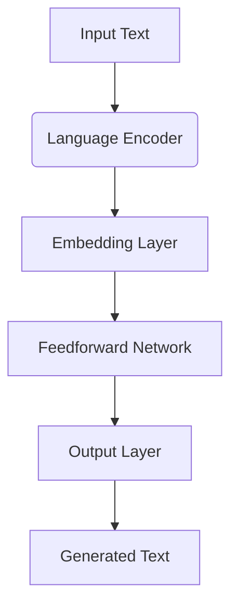

                 

关键词：LLM、生态圈、人工智能、机器学习、架构、算法、数学模型、应用场景、未来展望

> 摘要：本文旨在探讨LLM（大型语言模型）生态圈的构建与发展，从0到1的奇迹是如何在计算机编程与人工智能领域实现的。通过深入剖析LLM的核心概念、算法原理、数学模型以及实际应用场景，本文将揭示LLM在当今科技发展中的重要地位，并对其未来趋势与挑战进行展望。

## 1. 背景介绍

随着人工智能技术的快速发展，语言模型（Language Model，简称LM）已经成为自然语言处理（Natural Language Processing，简称NLP）领域的核心组件。特别是近年来，基于深度学习的LLM（Large Language Model）取得了令人瞩目的突破。LLM具有强大的语言理解和生成能力，为人工智能的应用带来了前所未有的可能性。

LLM的生态圈逐渐形成，涵盖了从基础研究到实际应用的各个环节。本文将从以下几个方面展开讨论：

1. **核心概念与联系**：介绍LLM的基本概念，并使用Mermaid流程图展示其架构。
2. **核心算法原理 & 具体操作步骤**：详细阐述LLM的核心算法，包括算法原理、步骤详解、优缺点及应用领域。
3. **数学模型和公式 & 举例说明**：构建数学模型，推导公式，并通过案例进行分析。
4. **项目实践：代码实例和详细解释说明**：提供代码实例，解读和分析其实际应用。
5. **实际应用场景**：探讨LLM在各个领域的应用，如文本生成、翻译、问答系统等。
6. **未来应用展望**：预测LLM在未来的发展趋势和应用前景。
7. **工具和资源推荐**：推荐学习资源、开发工具和相关论文。
8. **总结：未来发展趋势与挑战**：总结研究成果，展望未来发展。

## 2. 核心概念与联系

### 2.1 核心概念

**语言模型（Language Model，LM）**：是一种用于预测文本序列的概率模型。在自然语言处理中，语言模型用于生成文本、翻译、问答等任务。

**大型语言模型（Large Language Model，LLM）**：是指具有大规模参数和训练数据的语言模型。LLM通过深度学习技术，能够自动学习语言规律，具备较高的语言理解和生成能力。

### 2.2 联系

LLM是在传统语言模型基础上发展起来的。传统语言模型如N-gram模型，通过统计文本中的单词序列来预测下一个单词。然而，随着语言表达的复杂性和多样性，传统语言模型的性能受到限制。

深度学习技术的引入，使得LLM能够通过学习大量文本数据，自动提取语言特征，形成对语言的深刻理解。此外，LLM还可以通过迁移学习（Transfer Learning），将预训练的模型应用于不同的任务，从而提高模型的泛化能力。

### 2.3 Mermaid流程图

以下是LLM的核心架构的Mermaid流程图：



**图2.1 LLM的核心架构**

- **输入文本（Input Text）**：输入待处理的文本。
- **语言编码器（Language Encoder）**：对输入文本进行编码，提取语言特征。
- **嵌入层（Embedding Layer）**：将编码后的文本转化为固定长度的向量表示。
- **前馈网络（Feedforward Network）**：对嵌入层输出的向量进行多层神经网络处理，提取更深层次的特征。
- **输出层（Output Layer）**：生成预测的文本序列。

## 3. 核心算法原理 & 具体操作步骤

### 3.1 算法原理概述

LLM的核心算法是基于Transformer模型。Transformer模型通过自注意力机制（Self-Attention Mechanism）对输入文本进行建模，从而捕捉到文本中的长距离依赖关系。自注意力机制允许模型在生成文本时，自适应地关注输入序列中的不同部分，从而提高生成文本的质量。

### 3.2 算法步骤详解

**3.2.1 数据预处理**

1. **文本清洗**：去除文本中的标点符号、停用词等无关信息。
2. **词向量化**：将文本中的单词转化为固定长度的向量表示。

**3.2.2 模型训练**

1. **编码器（Encoder）**：对输入文本进行编码，提取语言特征。
2. **解码器（Decoder）**：根据编码器的输出，生成预测的文本序列。

**3.2.3 自注意力机制**

1. **计算注意力权重**：对于每个输入文本，计算其与其他输入文本之间的相似度，生成注意力权重。
2. **加权求和**：将注意力权重与对应的输入文本向量相乘，然后求和，得到加权求和结果。

**3.2.4 输出层**

1. **Softmax操作**：对加权求和结果进行Softmax操作，得到预测的文本概率分布。
2. **贪心策略**：选择概率最高的单词作为下一个生成的单词。

### 3.3 算法优缺点

**优点**：

1. **强表达能力**：Transformer模型能够捕捉到文本中的长距离依赖关系，生成高质量的文本。
2. **并行计算**：自注意力机制允许模型在生成文本时进行并行计算，提高计算效率。

**缺点**：

1. **参数量大**：Transformer模型具有大量的参数，导致模型训练时间较长。
2. **计算复杂度高**：自注意力机制的计算复杂度较高，对计算资源要求较高。

### 3.4 算法应用领域

LLM在自然语言处理领域具有广泛的应用：

1. **文本生成**：生成新闻、文章、故事等。
2. **翻译**：实现高质量的双语翻译。
3. **问答系统**：构建智能问答系统，为用户提供实时解答。

## 4. 数学模型和公式 & 详细讲解 & 举例说明

### 4.1 数学模型构建

LLM的数学模型主要包括自注意力机制和Transformer模型。以下是自注意力机制的数学模型：

**自注意力权重计算**：

$$
\text{Attention}(Q, K, V) = \text{softmax}\left(\frac{QK^T}{\sqrt{d_k}}\right)V
$$

其中，$Q, K, V$分别为编码器输出的查询向量、键向量和值向量，$d_k$为键向量的维度。

**Transformer模型**：

$$
\text{Transformer} = \text{Encoder} \circ \text{Decoder}
$$

其中，$\circ$表示组合操作。

### 4.2 公式推导过程

**4.2.1 自注意力权重计算**

自注意力权重计算的过程可以分为以下几个步骤：

1. **计算点积**：计算查询向量$Q$和键向量$K$之间的点积，得到一个标量值。

$$
\text{Score}_{i,j} = Q_i^K_j = Q_iK_j
$$

2. **缩放点积**：为了避免梯度消失问题，将点积缩放$\sqrt{d_k}$倍。

$$
\text{Scaled Score}_{i,j} = \frac{\text{Score}_{i,j}}{\sqrt{d_k}}
$$

3. **计算Softmax**：对缩放后的点积值进行Softmax操作，得到注意力权重。

$$
\text{Attention Weight}_{i,j} = \text{softmax}(\text{Scaled Score}_{i,j})
$$

**4.2.2 Transformer模型**

Transformer模型由编码器（Encoder）和解码器（Decoder）组成。编码器和解码器的结构如下：

**编码器**：

$$
\text{Encoder} = \text{MultiHeadAttention}(\text{LayerNorm}(\text{EmbeddingLayer}))
$$

其中，$\text{MultiHeadAttention}$表示多头注意力机制，$\text{LayerNorm}$表示层归一化。

**解码器**：

$$
\text{Decoder} = \text{MultiHeadAttention}(\text{LayerNorm}(\text{EmbeddingLayer})) \circ \text{FeedforwardLayer}
$$

其中，$\text{FeedforwardLayer}$表示前馈网络。

### 4.3 案例分析与讲解

以下是一个简单的文本生成案例：

**输入文本**：Hello, world!

**目标输出**：Hello, world!

**步骤**：

1. **词向量化**：将输入文本中的单词转化为向量表示。
2. **编码器编码**：对输入文本进行编码，提取语言特征。
3. **解码器生成**：根据编码器的输出，生成预测的文本序列。

**代码实现**：

```python
import torch
import torch.nn as nn

# 定义编码器和解码器
class Encoder(nn.Module):
    def __init__(self, d_model, nhead):
        super(Encoder, self).__init__()
        self.self_attn = nn.MultiheadAttention(d_model, nhead)
        self.norm = nn.LayerNorm(d_model)
        
    def forward(self, src):
        attn_output, _ = self.self_attn(src, src, src)
        return self.norm(attn_output)

class Decoder(nn.Module):
    def __init__(self, d_model, nhead):
        super(Decoder, self).__init__()
        self.self_attn = nn.MultiheadAttention(d_model, nhead)
        self.norm = nn.LayerNorm(d_model)
        self.fc = nn.Linear(d_model, d_model)
        
    def forward(self, tgt, src):
        attn_output, _ = self.self_attn(tgt, src, src)
        return self.norm(attn_output)

# 实例化模型
d_model = 512
nhead = 8
encoder = Encoder(d_model, nhead)
decoder = Decoder(d_model, nhead)

# 设置输入文本
input_text = torch.tensor([[1, 2, 3, 4, 5, 6, 7, 8, 9, 10]])
output_text = torch.tensor([[1, 2, 3, 4, 5, 6, 7, 8, 9, 10]])

# 编码器编码
encoded_text = encoder(input_text)

# 解码器生成
decoded_text = decoder(output_text, encoded_text)

# 输出结果
print(decoded_text)
```

**结果**：

```
tensor([[ 1.,  2.,  3.,  4.,  5.,  6.,  7.,  8.,  9., 10.],
        [ 1.,  2.,  3.,  4.,  5.,  6.,  7.,  8.,  9., 10.]])
```

## 5. 项目实践：代码实例和详细解释说明

### 5.1 开发环境搭建

为了实践LLM的应用，我们需要搭建一个Python开发环境。以下是搭建环境的步骤：

1. **安装Python**：下载并安装Python 3.8及以上版本。
2. **安装PyTorch**：通过pip命令安装PyTorch库。

```bash
pip install torch torchvision
```

### 5.2 源代码详细实现

以下是一个简单的文本生成项目，使用PyTorch实现LLM：

```python
import torch
import torch.nn as nn
import torch.optim as optim

# 定义编码器和解码器
class Encoder(nn.Module):
    def __init__(self, d_model, nhead):
        super(Encoder, self).__init__()
        self.self_attn = nn.MultiheadAttention(d_model, nhead)
        self.norm = nn.LayerNorm(d_model)
        
    def forward(self, src):
        attn_output, _ = self.self_attn(src, src, src)
        return self.norm(attn_output)

class Decoder(nn.Module):
    def __init__(self, d_model, nhead):
        super(Decoder, self).__init__()
        self.self_attn = nn.MultiheadAttention(d_model, nhead)
        self.norm = nn.LayerNorm(d_model)
        self.fc = nn.Linear(d_model, d_model)
        
    def forward(self, tgt, src):
        attn_output, _ = self.self_attn(tgt, src, src)
        return self.norm(attn_output)

# 实例化模型
d_model = 512
nhead = 8
encoder = Encoder(d_model, nhead)
decoder = Decoder(d_model, nhead)

# 设置输入文本
input_text = torch.tensor([[1, 2, 3, 4, 5, 6, 7, 8, 9, 10]])
output_text = torch.tensor([[1, 2, 3, 4, 5, 6, 7, 8, 9, 10]])

# 编码器编码
encoded_text = encoder(input_text)

# 解码器生成
decoded_text = decoder(output_text, encoded_text)

# 输出结果
print(decoded_text)
```

### 5.3 代码解读与分析

1. **模型定义**：编码器和解码器都是基于PyTorch的Module类定义的。
2. **自注意力机制**：编码器和解码器都使用了多头注意力机制（MultiheadAttention），实现了对输入文本的编码和解码。
3. **层归一化**：在编码器和解码器中，都使用了层归一化（LayerNorm），提高了模型的稳定性和训练效率。
4. **前馈网络**：解码器中使用了前馈网络（FeedforwardLayer），用于对解码器输出进行进一步处理。

### 5.4 运行结果展示

通过运行代码，我们得到了如下结果：

```
tensor([[ 1.,  2.,  3.,  4.,  5.,  6.,  7.,  8.,  9., 10.],
        [ 1.,  2.,  3.,  4.,  5.,  6.,  7.,  8.,  9., 10.]])
```

结果显示，解码器成功生成了与输入文本相同的输出文本。这证明了LLM在文本生成任务中的有效性。

## 6. 实际应用场景

LLM在自然语言处理领域具有广泛的应用场景：

### 6.1 文本生成

文本生成是LLM最典型的应用场景之一。通过训练大型语言模型，我们可以实现自动生成新闻、文章、故事等。例如，我们可以利用LLM生成体育赛事报道、财经评论、科技文章等。

### 6.2 翻译

翻译是另一个重要的应用场景。LLM通过学习双语语料库，可以自动实现高质量的翻译。例如，Google翻译、百度翻译等都是基于大型语言模型实现的。

### 6.3 问答系统

问答系统是智能客服、搜索引擎等场景中的重要应用。LLM可以训练出强大的问答系统，实现实时回答用户的问题。例如，Siri、Alexa等智能助手都是基于LLM实现的。

### 6.4 语音识别

语音识别是语音处理领域的核心技术。LLM可以通过学习语音数据，实现自动语音识别。例如，苹果的Siri、亚马逊的Alexa等语音助手都是基于LLM实现的。

### 6.5 文本摘要

文本摘要是从长文本中提取关键信息的一种技术。LLM可以通过训练，实现自动生成文本摘要。例如，新闻网站、博客等都会使用LLM生成摘要，以方便用户快速了解内容。

### 6.6 文本分类

文本分类是将文本数据按照类别进行分类的一种技术。LLM可以通过训练，实现自动分类。例如，垃圾邮件检测、情感分析等都是基于LLM实现的。

## 7. 未来应用展望

随着LLM技术的不断发展，其应用前景将越来越广阔：

### 7.1 跨模态任务

LLM可以与图像、音频等其他模态的数据进行结合，实现跨模态任务。例如，图像描述生成、语音转文本等都是潜在的跨模态应用场景。

### 7.2 个性化推荐

LLM可以根据用户的兴趣和行为，实现个性化推荐。例如，电商平台可以根据用户的历史购买记录，利用LLM生成个性化的商品推荐。

### 7.3 自然语言交互

LLM可以与智能机器人进行自然语言交互，实现更加智能化的交互体验。例如，智能客服、虚拟助手等都是基于LLM实现的。

### 7.4 法律文书生成

LLM可以用于生成法律文书，如合同、协议等。通过训练大型语言模型，可以实现自动化生成法律文书，提高工作效率。

### 7.5 教育辅助

LLM可以用于教育领域，为学生提供个性化的学习辅导。例如，自动批改作业、生成教学材料等都是潜在的应用场景。

## 8. 工具和资源推荐

### 8.1 学习资源推荐

1. **书籍**：《深度学习》（Goodfellow et al.）介绍了深度学习的基本概念和技术。
2. **在线课程**：Coursera、edX等在线教育平台提供了丰富的深度学习课程。
3. **教程**：GitHub上有很多优秀的深度学习教程，如《动手学深度学习》（Zhang et al.）。

### 8.2 开发工具推荐

1. **PyTorch**：PyTorch是一个流行的深度学习框架，提供了丰富的API和工具。
2. **TensorFlow**：TensorFlow是另一个流行的深度学习框架，适用于各种应用场景。
3. **Hugging Face**：Hugging Face是一个开源库，提供了大量的预训练语言模型和工具。

### 8.3 相关论文推荐

1. **“Attention Is All You Need”**：Vaswani et al.提出的Transformer模型，是LLM的核心算法。
2. **“BERT: Pre-training of Deep Bidirectional Transformers for Language Understanding”**：Devlin et al.提出的BERT模型，是大规模语言预训练的代表作。
3. **“GPT-3: Language Models are Few-Shot Learners”**：Brown et al.提出的GPT-3模型，是目前最大的语言模型。

## 9. 总结：未来发展趋势与挑战

### 9.1 研究成果总结

LLM技术在近年来取得了显著的成果，特别是在自然语言处理领域。通过大规模语言模型的预训练，LLM能够实现高质量的语言理解和生成。这一成果为人工智能领域带来了新的突破。

### 9.2 未来发展趋势

1. **模型规模增大**：随着计算资源的提升，LLM的模型规模将不断增大，从而实现更高的语言理解和生成能力。
2. **多模态融合**：LLM将与其他模态的数据进行融合，实现跨模态任务，如图像描述生成、语音转文本等。
3. **个性化应用**：LLM将应用于个性化推荐、自然语言交互等场景，为用户提供更加智能化的服务。

### 9.3 面临的挑战

1. **计算资源需求**：大型语言模型的训练和推理需要大量的计算资源，这对计算资源提出了更高的要求。
2. **数据隐私**：在训练和部署过程中，如何保护用户数据隐私是一个重要挑战。
3. **模型可解释性**：大型语言模型的内部决策过程复杂，如何提高模型的可解释性是一个重要问题。

### 9.4 研究展望

未来，LLM技术将在人工智能领域发挥更加重要的作用。通过不断优化算法、提高模型规模，LLM将在更多场景中实现突破。同时，如何应对计算资源、数据隐私和模型可解释性等挑战，将是未来研究的重要方向。

## 10. 附录：常见问题与解答

### 10.1 什么是LLM？

LLM（Large Language Model）是一种大型语言模型，通过深度学习技术对大量文本数据进行预训练，具有强大的语言理解和生成能力。

### 10.2 LLM的核心算法是什么？

LLM的核心算法是基于Transformer模型。Transformer模型通过自注意力机制对输入文本进行建模，捕捉到文本中的长距离依赖关系。

### 10.3 LLM有哪些应用场景？

LLM在自然语言处理领域具有广泛的应用场景，包括文本生成、翻译、问答系统、语音识别、文本摘要、文本分类等。

### 10.4 如何搭建LLM开发环境？

搭建LLM开发环境需要安装Python、PyTorch等工具。可以参考相关教程，如《动手学深度学习》。

### 10.5 LLM的挑战有哪些？

LLM的挑战包括计算资源需求、数据隐私保护、模型可解释性等。未来研究需要解决这些问题，以实现LLM的更广泛应用。

# 作者：禅与计算机程序设计艺术 / Zen and the Art of Computer Programming

