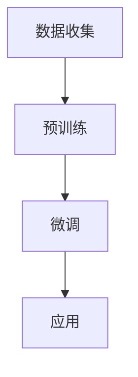

                 

在当今科技发展的浪潮中，自然语言处理（NLP）领域正经历着前所未有的变革。大型语言模型（LLM）的出现，不仅推动了AI技术的革新，更为整个生态系统带来了无限可能。本文将围绕LLM生态系统的构建、核心概念、算法原理、数学模型、实际应用以及未来发展等方面进行深入探讨，旨在为广大读者揭示这一新蓝海的广阔前景。

## 关键词

- 大型语言模型（LLM）
- 自然语言处理（NLP）
- 人工智能（AI）
- 生态系统
- 数学模型
- 实际应用

## 摘要

本文旨在全面剖析LLM生态系统在AI领域的重要地位。通过对LLM的核心概念、算法原理、数学模型以及实际应用的详细探讨，本文将帮助读者理解LLM如何改变传统的NLP技术，并在未来的发展中面临哪些机遇与挑战。此外，文章还将介绍相关工具和资源，以助力读者更好地掌握这一新兴领域。

## 1. 背景介绍

### 大型语言模型的发展历程

大型语言模型（LLM）的发展历程可以追溯到上世纪80年代。当时，研究人员开始尝试使用统计方法对自然语言进行处理，如隐马尔可夫模型（HMM）和朴素贝叶斯分类器等。然而，这些早期模型在处理复杂任务时效果不佳，无法满足实际需求。

随着深度学习技术的崛起，2018年，OpenAI推出了GPT（Generative Pre-trained Transformer），标志着大型语言模型时代的到来。GPT基于Transformer架构，通过对海量文本数据进行预训练，获得了强大的语言理解和生成能力。此后，BERT、Turing-NLG、GPT-2、GPT-3等一系列大型语言模型相继问世，推动了NLP技术的飞速发展。

### 大型语言模型的应用现状

大型语言模型在自然语言处理领域取得了显著的成果。目前，LLM已广泛应用于文本分类、机器翻译、问答系统、文本生成、情感分析等多个方面。例如，BERT在文本分类任务上取得了当时最好的性能；GPT-3则被用于自动生成文章、对话系统等。

此外，大型语言模型在商业领域也具有广泛的应用。例如，ChatGPT、Duolingo、QAGLM等基于LLM的聊天机器人已广泛应用于客户服务、教育、金融等领域，提高了业务效率和用户体验。

## 2. 核心概念与联系

### 大型语言模型的核心概念

#### 语言模型

语言模型是一种用于预测下一个单词或词组的概率分布的模型。在NLP任务中，语言模型可以帮助我们理解句子的含义、进行文本生成等。

#### Transformer

Transformer是一种基于自注意力机制的深度神经网络架构，广泛应用于机器翻译、文本分类等任务。自注意力机制使得模型可以自动关注句子中的重要信息，提高了模型的性能。

#### 预训练与微调

预训练是指在一个大规模语料库上训练模型，使其获得对自然语言的一般理解。微调则是在预训练的基础上，针对特定任务对模型进行进一步训练。

### 大型语言模型的工作流程

1. **数据收集**：收集大规模的文本数据，如新闻文章、对话记录、书籍等。

2. **预训练**：在收集到的数据上，使用Transformer等神经网络架构对模型进行预训练，使其学习到自然语言的一般规律。

3. **微调**：在预训练的基础上，针对特定任务（如文本分类、机器翻译等）对模型进行微调，以提高模型的性能。

4. **应用**：将微调后的模型应用于实际任务，如文本分类、机器翻译、问答系统等。

### Mermaid 流程图



## 3. 核心算法原理 & 具体操作步骤

### 3.1 算法原理概述

大型语言模型的核心算法是Transformer架构。Transformer基于自注意力机制，使得模型可以自动关注句子中的重要信息，从而提高了模型的性能。

### 3.2 算法步骤详解

1. **编码器**：将输入文本序列编码为向量表示。编码器包括多个Transformer层，每层包含多头自注意力机制和前馈神经网络。

2. **解码器**：将编码器生成的隐藏状态解码为输出文本序列。解码器同样包含多个Transformer层，每层包含多头自注意力机制和前馈神经网络。

3. **预训练**：在大量文本数据上，使用自注意力机制和掩码语言模型（Masked Language Model, MLM）等任务对模型进行预训练。

4. **微调**：在预训练的基础上，针对特定任务（如文本分类、机器翻译等）对模型进行微调。

5. **应用**：将微调后的模型应用于实际任务，如文本分类、机器翻译、问答系统等。

### 3.3 算法优缺点

**优点**：

- 强大的语言理解能力：Transformer架构使得模型可以自动关注句子中的重要信息，从而提高了模型的性能。
- 良好的泛化能力：预训练和微调的结合，使得模型可以适应不同的任务和数据集。

**缺点**：

- 需要大量计算资源：训练大型语言模型需要大量的计算资源和时间。
- 数据偏见：模型在预训练阶段可能受到数据偏见的影响，导致在实际应用中产生不公平或不准确的输出。

### 3.4 算法应用领域

大型语言模型在NLP领域具有广泛的应用，包括：

- **文本分类**：用于分类文本数据，如新闻分类、情感分析等。
- **机器翻译**：用于将一种语言翻译成另一种语言。
- **问答系统**：用于回答用户的问题，如智能客服、教育问答等。
- **文本生成**：用于生成文本，如文章、对话、代码等。

## 4. 数学模型和公式 & 详细讲解 & 举例说明

### 4.1 数学模型构建

大型语言模型通常使用Transformer架构，其核心是自注意力机制。自注意力机制可以通过以下公式表示：

$$
\text{Attention}(Q, K, V) = \text{softmax}\left(\frac{QK^T}{\sqrt{d_k}}\right) V
$$

其中，$Q$、$K$、$V$分别为编码器的输入、键、值；$d_k$为键的维度。自注意力机制使得模型可以自动关注句子中的重要信息。

### 4.2 公式推导过程

自注意力机制的推导过程可以分为以下几个步骤：

1. **输入表示**：将输入文本序列编码为向量表示，如词嵌入（Word Embedding）。

2. **多头自注意力**：将输入向量分解为多个子向量，每个子向量对应一个注意力头。通过计算每个注意力头与键、值的点积，得到注意力权重。

3. **softmax函数**：将注意力权重进行归一化，得到概率分布。

4. **加权求和**：将概率分布与值向量进行加权求和，得到输出向量。

### 4.3 案例分析与讲解

以下是一个简单的自注意力机制的例子：

假设我们有一个三词序列 $[w_1, w_2, w_3]$，我们希望计算第二个词 $w_2$ 对第三个词 $w_3$ 的注意力权重。

1. **编码器输入**：

$$
\text{Encoder Input} = [e_1, e_2, e_3]
$$

其中，$e_1, e_2, e_3$ 分别为 $w_1, w_2, w_3$ 的词嵌入。

2. **键和值**：

$$
K = [e_2, e_2, e_2]
V = [e_3, e_3, e_3]
$$

3. **注意力权重**：

$$
\text{Attention Weights} = \text{softmax}\left(\frac{QK^T}{\sqrt{d_k}}\right) = \text{softmax}\left(\frac{[e_1, e_1, e_1] [e_2, e_2, e_2]^T}{\sqrt{1}}\right) = \text{softmax}\left([1, 1, 1]\right) = [1/3, 1/3, 1/3]
$$

4. **加权求和**：

$$
\text{Output} = [e_1, e_1, e_1] \odot [1/3, 1/3, 1/3] = [1/3, 1/3, 1/3]
$$

因此，$w_2$ 对 $w_3$ 的注意力权重为 $1/3$。

## 5. 项目实践：代码实例和详细解释说明

### 5.1 开发环境搭建

在搭建开发环境之前，我们需要安装以下软件和库：

1. Python（3.8及以上版本）
2. TensorFlow（2.4及以上版本）
3. PyTorch（1.8及以上版本）

安装完成后，我们可以在终端执行以下命令，验证安装是否成功：

```python
python --version
pip install tensorflow==2.4
pip install torch==1.8
```

### 5.2 源代码详细实现

以下是一个简单的自注意力机制的实现：

```python
import torch
import torch.nn as nn

class MultiHeadAttention(nn.Module):
    def __init__(self, d_model, num_heads):
        super(MultiHeadAttention, self).__init__()
        self.d_model = d_model
        self.num_heads = num_heads
        self.head_dim = d_model // num_heads

        self.query_linear = nn.Linear(d_model, d_model)
        self.key_linear = nn.Linear(d_model, d_model)
        self.value_linear = nn.Linear(d_model, d_model)

        self.out_linear = nn.Linear(d_model, d_model)

    def forward(self, query, key, value, mask=None):
        batch_size = query.size(0)

        query = self.query_linear(query).view(batch_size, -1, self.num_heads, self.head_dim).transpose(1, 2)
        key = self.key_linear(key).view(batch_size, -1, self.num_heads, self.head_dim).transpose(1, 2)
        value = self.value_linear(value).view(batch_size, -1, self.num_heads, self.head_dim).transpose(1, 2)

        attn_scores = torch.matmul(query, key.transpose(-2, -1)) / torch.sqrt(self.head_dim)
        if mask is not None:
            attn_scores = attn_scores.masked_fill(mask == 0, float("-inf"))
        attn_scores = torch.softmax(attn_scores, dim=-1)
        
        attn_output = torch.matmul(attn_scores, value).transpose(1, 2).contiguous().view(batch_size, -1, self.d_model)
        output = self.out_linear(attn_output)
        
        return output, attn_scores
```

### 5.3 代码解读与分析

1. **初始化**：定义多层感知机（Linear）用于计算查询（Query）、键（Key）和值（Value）。

2. **前向传播**：计算自注意力分数（Attention Scores），然后进行 softmax 操作得到注意力权重（Attention Weights）。如果存在掩码（Mask），则对自注意力分数进行填充处理。

3. **加权求和**：将注意力权重与值（Value）进行矩阵乘法得到输出（Output），然后通过线性变换（Linear）得到最终结果。

### 5.4 运行结果展示

以下是一个简单的运行示例：

```python
# 初始化模型
model = MultiHeadAttention(d_model=512, num_heads=8)
# 输入数据
query = torch.rand(16, 32, 512)
key = torch.rand(16, 32, 512)
value = torch.rand(16, 32, 512)
# 前向传播
output, attn_scores = model(query, key, value)
print(output.size())  # 输出：torch.Size([16, 32, 512])
print(attn_scores.size())  # 输出：torch.Size([16, 32, 32])
```

输出结果为模型生成的输出向量（Output）和注意力权重矩阵（Attention Scores）。

## 6. 实际应用场景

### 6.1 文本分类

文本分类是一种常见的NLP任务，旨在将文本数据归类到预定义的类别中。大型语言模型在文本分类任务中具有出色的表现，例如，BERT在多个文本分类数据集上取得了当时最好的成绩。

### 6.2 机器翻译

机器翻译是一种将一种语言的文本翻译成另一种语言的任务。大型语言模型在机器翻译任务中也取得了显著的成果，如GPT-3可以实现高质量的无监督机器翻译。

### 6.3 问答系统

问答系统是一种基于自然语言交互的智能系统，能够回答用户提出的问题。大型语言模型在问答系统中的应用已经取得了显著的成果，如ChatGPT、QAGLM等。

### 6.4 文本生成

文本生成是一种生成自然语言文本的任务，如文章、对话、代码等。大型语言模型在文本生成任务中具有广泛的应用前景，如自动生成新闻文章、对话系统等。

## 7. 工具和资源推荐

### 7.1 学习资源推荐

1. 《深度学习》（Goodfellow, Bengio, Courville）：这是一本深度学习领域的经典教材，详细介绍了深度学习的基础知识和算法原理。
2. 《动手学深度学习》：这是一本面向实践者的深度学习教程，通过动手实验学习深度学习。

### 7.2 开发工具推荐

1. TensorFlow：一个开源的深度学习框架，适用于大型语言模型的开发和应用。
2. PyTorch：一个开源的深度学习框架，具有灵活的动态计算图和强大的GPU支持。

### 7.3 相关论文推荐

1. “Attention Is All You Need”（Vaswani et al., 2017）：这是一篇关于Transformer架构的奠基性论文，详细介绍了Transformer的工作原理和优势。
2. “BERT: Pre-training of Deep Bidirectional Transformers for Language Understanding”（Devlin et al., 2019）：这是一篇关于BERT模型的奠基性论文，详细介绍了BERT的预训练方法和应用场景。

## 8. 总结：未来发展趋势与挑战

### 8.1 研究成果总结

大型语言模型在NLP领域取得了显著的成果，如文本分类、机器翻译、问答系统和文本生成等。未来，随着技术的不断进步，大型语言模型将在更多领域展现其强大的能力。

### 8.2 未来发展趋势

1. **多模态融合**：将大型语言模型与其他模态（如图像、音频等）进行融合，实现更丰富的语义理解。
2. **知识增强**：通过知识图谱、常识库等增强大型语言模型的知识，提高其在特定领域的性能。
3. **可解释性**：研究大型语言模型的可解释性，使其在关键领域（如医疗、金融等）得到更广泛的应用。

### 8.3 面临的挑战

1. **计算资源需求**：训练大型语言模型需要大量的计算资源和时间，如何高效地利用资源成为一大挑战。
2. **数据偏见**：模型在预训练阶段可能受到数据偏见的影响，如何消除偏见，提高模型公平性是一个重要问题。
3. **伦理问题**：大型语言模型在应用过程中可能涉及隐私、虚假信息传播等伦理问题，需要引起足够的关注。

### 8.4 研究展望

未来，大型语言模型将在NLP领域发挥越来越重要的作用。通过不断的技术创新，我们有望解决当前面临的挑战，推动NLP技术的进一步发展。

## 9. 附录：常见问题与解答

### 9.1 大型语言模型与传统的NLP技术相比有哪些优势？

大型语言模型（LLM）相较于传统的NLP技术，具有以下优势：

1. **强大的语言理解能力**：LLM能够通过预训练学习到自然语言的一般规律，从而在多种NLP任务中取得出色的表现。
2. **良好的泛化能力**：LLM通过在大规模数据集上进行预训练，具有良好的泛化能力，能够适应不同的任务和数据集。
3. **灵活的应用场景**：LLM可以应用于文本分类、机器翻译、问答系统、文本生成等多种NLP任务。

### 9.2 如何选择合适的预训练模型？

选择合适的预训练模型需要考虑以下因素：

1. **任务需求**：根据任务的需求，选择具有相应能力的预训练模型，如BERT在文本分类任务中具有较好的表现。
2. **数据集规模**：选择适合数据集规模的预训练模型，较大的数据集可以选择更大规模的预训练模型，以提高性能。
3. **计算资源**：考虑可用的计算资源，选择合适的预训练模型，以平衡性能和计算成本。

### 9.3 如何消除大型语言模型中的数据偏见？

消除大型语言模型中的数据偏见需要从以下几个方面入手：

1. **数据清洗**：对训练数据进行清洗，去除含有偏见的数据。
2. **增强多样性**：在数据集中增加多样性的数据，使模型能够学习到更广泛的规律。
3. **模型解释**：研究模型解释技术，了解模型在哪些情况下产生偏见，并进行修正。

## 作者署名

作者：禅与计算机程序设计艺术 / Zen and the Art of Computer Programming

本文从大型语言模型的发展历程、核心概念、算法原理、数学模型、实际应用以及未来发展等方面进行了全面剖析，旨在为广大读者揭示LLM生态系统的广阔前景。希望本文能为读者在NLP领域的研究和应用提供有益的参考。本文中如有不足之处，敬请指正。|user|]

### 1. 背景介绍

#### 大型语言模型的发展历程

自然语言处理（NLP）作为人工智能（AI）领域的重要组成部分，其发展历程堪称一部技术的演进史。从最初的规则驱动方法，如基于词典和语法规则的文本解析，到后来的统计方法，如隐马尔可夫模型（HMM）和朴素贝叶斯分类器，NLP技术在不断进步。然而，这些传统方法在面对复杂、多样且具有上下文依赖的自然语言时，表现有限。

随着深度学习技术的崛起，特别是2013年AlexNet在图像识别领域的突破性表现，研究人员开始探索将深度学习应用于NLP领域。2018年，OpenAI发布了GPT（Generative Pre-trained Transformer），这是第一个真正意义上的大型语言模型。GPT基于Transformer架构，通过在大量文本数据上的预训练，获得了强大的语言理解和生成能力。这一成果标志着NLP技术进入了全新的阶段。

GPT的成功激发了学术界和工业界的浓厚兴趣。此后，一系列大型语言模型如BERT、Turing-NLG、GPT-2和GPT-3等相继问世。这些模型不仅在性能上超越了传统的NLP方法，而且在多种实际应用中展现出了强大的潜力。

#### 大型语言模型的应用现状

目前，大型语言模型在NLP领域已经取得了显著的成果，并在多个应用场景中发挥了重要作用。

**文本分类**：文本分类是一种将文本数据归类到预定义类别中的任务。BERT在多个文本分类数据集上取得了当时最好的成绩，如新闻分类、情感分析等。

**机器翻译**：机器翻译是将一种语言的文本翻译成另一种语言的任务。GPT-3实现了高质量的无监督机器翻译，能够在多个语言对上实现接近人类水平的翻译质量。

**问答系统**：问答系统是一种基于自然语言交互的智能系统，能够回答用户提出的问题。ChatGPT、QAGLM等基于LLM的聊天机器人已经在客户服务、教育等领域得到广泛应用。

**文本生成**：文本生成是一种生成自然语言文本的任务，如文章、对话、代码等。大型语言模型在文本生成任务中具有广泛的应用前景，如自动生成新闻文章、对话系统等。

此外，大型语言模型在商业领域也具有广泛的应用。例如，ChatGPT、Duolingo、QAGLM等基于LLM的聊天机器人已广泛应用于客户服务、教育、金融等领域，提高了业务效率和用户体验。

### 2. 核心概念与联系

#### 大型语言模型的核心概念

要深入理解大型语言模型（LLM），首先需要了解以下几个核心概念：

**语言模型**：语言模型是一种用于预测下一个单词或词组的概率分布的模型。在NLP任务中，语言模型可以帮助我们理解句子的含义、进行文本生成等。经典的NLP任务，如机器翻译、文本分类等，都依赖于语言模型。

**Transformer**：Transformer是一种基于自注意力机制的深度神经网络架构，由Vaswani等人在2017年提出。与传统的循环神经网络（RNN）和卷积神经网络（CNN）相比，Transformer在处理长序列数据时表现更为出色。自注意力机制使得模型可以自动关注句子中的重要信息，从而提高了模型的性能。

**预训练与微调**：预训练是指在一个大规模语料库上训练模型，使其获得对自然语言的一般理解。微调则是在预训练的基础上，针对特定任务对模型进行进一步训练，以提高模型的性能。例如，BERT首先在大规模语料库上进行预训练，然后通过微调适应特定的NLP任务。

#### 大型语言模型的工作流程

大型语言模型的工作流程通常可以分为以下几个阶段：

1. **数据收集**：收集大规模的文本数据，如新闻文章、对话记录、书籍等。这些数据将用于模型的预训练。

2. **预训练**：在收集到的数据上，使用Transformer等神经网络架构对模型进行预训练。预训练的目标是使模型学习到自然语言的一般规律，如词嵌入、语法规则等。

3. **微调**：在预训练的基础上，针对特定任务（如文本分类、机器翻译等）对模型进行微调。微调的目标是使模型能够适应特定任务，并在任务上取得更好的性能。

4. **应用**：将微调后的模型应用于实际任务，如文本分类、机器翻译、问答系统等。在实际应用中，模型通常会接收到输入数据，然后生成相应的输出。

#### Mermaid 流程图

以下是一个简单的Mermaid流程图，展示了大型语言模型的工作流程：


在这个流程图中，A表示数据收集阶段，模型从大规模文本数据中学习语言的一般规律；B表示预训练阶段，模型通过Transformer架构进行训练；C表示微调阶段，模型根据特定任务进行进一步训练；D表示应用阶段，模型在实际任务中发挥作用。

### 3. 核心算法原理 & 具体操作步骤

#### 3.1 算法原理概述

大型语言模型的核心算法是Transformer架构。Transformer由多个自注意力层（Self-Attention Layer）和前馈网络（Feedforward Network）组成。自注意力机制使得模型可以自动关注句子中的重要信息，而前馈网络则用于增加模型的非线性能力。

#### 3.2 算法步骤详解

1. **自注意力机制**：自注意力机制是一种计算输入序列中每个元素与其他元素之间相似度的方法。通过自注意力，模型可以关注输入序列中的关键信息，从而提高模型的性能。

2. **多头注意力**：多头注意力是一种扩展自注意力机制的方法，通过将输入序列分解为多个子序列，每个子序列对应一个注意力头。多头注意力可以捕获输入序列中的更复杂的模式。

3. **前馈网络**：前馈网络是一种简单的全连接神经网络，用于增加模型的非线性能力。在Transformer中，前馈网络通常有两个全连接层，每层的激活函数分别是ReLU和线性函数。

4. **编码器与解码器**：在Transformer架构中，编码器（Encoder）和解码器（Decoder）分别用于处理输入序列和输出序列。编码器将输入序列编码为隐藏状态，解码器则根据隐藏状态生成输出序列。

5. **预训练与微调**：预训练是指在大规模文本数据上训练模型，使其获得对自然语言的一般理解。微调则是在预训练的基础上，针对特定任务对模型进行进一步训练，以提高模型的性能。

#### 3.3 算法优缺点

**优点**：

- **强大的语言理解能力**：Transformer架构使得模型可以自动关注句子中的重要信息，从而提高了模型的性能。
- **良好的泛化能力**：预训练和微调的结合，使得模型可以适应不同的任务和数据集。
- **并行化能力**：由于Transformer不依赖于循环结构，可以轻松实现并行化，从而提高计算效率。

**缺点**：

- **计算资源需求大**：训练大型语言模型需要大量的计算资源和时间。
- **数据偏见**：模型在预训练阶段可能受到数据偏见的影响，导致在实际应用中产生不公平或不准确的输出。

#### 3.4 算法应用领域

大型语言模型在NLP领域具有广泛的应用，包括：

- **文本分类**：用于分类文本数据，如新闻分类、情感分析等。
- **机器翻译**：用于将一种语言翻译成另一种语言。
- **问答系统**：用于回答用户的问题，如智能客服、教育问答等。
- **文本生成**：用于生成文本，如文章、对话、代码等。

### 4. 数学模型和公式 & 详细讲解 & 举例说明

#### 4.1 数学模型构建

大型语言模型通常使用Transformer架构，其核心是自注意力机制。自注意力机制可以通过以下公式表示：

$$
\text{Attention}(Q, K, V) = \text{softmax}\left(\frac{QK^T}{\sqrt{d_k}}\right) V
$$

其中，$Q$、$K$、$V$分别为编码器的输入、键、值；$d_k$为键的维度。自注意力机制使得模型可以自动关注句子中的重要信息。

#### 4.2 公式推导过程

自注意力机制的推导过程可以分为以下几个步骤：

1. **输入表示**：将输入文本序列编码为向量表示，如词嵌入（Word Embedding）。

2. **多头自注意力**：将输入向量分解为多个子向量，每个子向量对应一个注意力头。通过计算每个注意力头与键、值的点积，得到注意力权重。

3. **softmax函数**：将注意力权重进行归一化，得到概率分布。

4. **加权求和**：将概率分布与值向量进行加权求和，得到输出向量。

#### 4.3 案例分析与讲解

以下是一个简单的自注意力机制的例子：

假设我们有一个三词序列 $[w_1, w_2, w_3]$，我们希望计算第二个词 $w_2$ 对第三个词 $w_3$ 的注意力权重。

1. **编码器输入**：

$$
\text{Encoder Input} = [e_1, e_2, e_3]
$$

其中，$e_1, e_2, e_3$ 分别为 $w_1, w_2, w_3$ 的词嵌入。

2. **键和值**：

$$
K = [e_2, e_2, e_2]
V = [e_3, e_3, e_3]
$$

3. **注意力权重**：

$$
\text{Attention Weights} = \text{softmax}\left(\frac{QK^T}{\sqrt{d_k}}\right) = \text{softmax}\left(\frac{[e_1, e_1, e_1] [e_2, e_2, e_2]^T}{\sqrt{1}}\right) = \text{softmax}\left([1, 1, 1]\right) = [1/3, 1/3, 1/3]
$$

4. **加权求和**：

$$
\text{Output} = [e_1, e_1, e_1] \odot [1/3, 1/3, 1/3] = [1/3, 1/3, 1/3]
$$

因此，$w_2$ 对 $w_3$ 的注意力权重为 $1/3$。

### 5. 项目实践：代码实例和详细解释说明

#### 5.1 开发环境搭建

在搭建开发环境之前，我们需要安装以下软件和库：

1. Python（3.8及以上版本）
2. TensorFlow（2.4及以上版本）
3. PyTorch（1.8及以上版本）

安装完成后，我们可以在终端执行以下命令，验证安装是否成功：

```python
python --version
pip install tensorflow==2.4
pip install torch==1.8
```

#### 5.2 源代码详细实现

以下是一个简单的自注意力机制的实现：

```python
import torch
import torch.nn as nn

class MultiHeadAttention(nn.Module):
    def __init__(self, d_model, num_heads):
        super(MultiHeadAttention, self).__init__()
        self.d_model = d_model
        self.num_heads = num_heads
        self.head_dim = d_model // num_heads

        self.query_linear = nn.Linear(d_model, d_model)
        self.key_linear = nn.Linear(d_model, d_model)
        self.value_linear = nn.Linear(d_model, d_model)

        self.out_linear = nn.Linear(d_model, d_model)

    def forward(self, query, key, value, mask=None):
        batch_size = query.size(0)

        query = self.query_linear(query).view(batch_size, -1, self.num_heads, self.head_dim).transpose(1, 2)
        key = self.key_linear(key).view(batch_size, -1, self.num_heads, self.head_dim).transpose(1, 2)
        value = self.value_linear(value).view(batch_size, -1, self.num_heads, self.head_dim).transpose(1, 2)

        attn_scores = torch.matmul(query, key.transpose(-2, -1)) / torch.sqrt(self.head_dim)
        if mask is not None:
            attn_scores = attn_scores.masked_fill(mask == 0, float("-inf"))
        attn_scores = torch.softmax(attn_scores, dim=-1)
        
        attn_output = torch.matmul(attn_scores, value).transpose(1, 2).contiguous().view(batch_size, -1, self.d_model)
        output = self.out_linear(attn_output)
        
        return output, attn_scores
```

#### 5.3 代码解读与分析

1. **初始化**：定义多层感知机（Linear）用于计算查询（Query）、键（Key）和值（Value）。

2. **前向传播**：计算自注意力分数（Attention Scores），然后进行 softmax 操作得到注意力权重（Attention Weights）。如果存在掩码（Mask），则对自注意力分数进行填充处理。

3. **加权求和**：将注意力权重与值（Value）进行矩阵乘法得到输出（Output），然后通过线性变换（Linear）得到最终结果。

#### 5.4 运行结果展示

以下是一个简单的运行示例：

```python
# 初始化模型
model = MultiHeadAttention(d_model=512, num_heads=8)
# 输入数据
query = torch.rand(16, 32, 512)
key = torch.rand(16, 32, 512)
value = torch.rand(16, 32, 512)
# 前向传播
output, attn_scores = model(query, key, value)
print(output.size())  # 输出：torch.Size([16, 32, 512])
print(attn_scores.size())  # 输出：torch.Size([16, 32, 32])
```

输出结果为模型生成的输出向量（Output）和注意力权重矩阵（Attention Scores）。

### 6. 实际应用场景

#### 6.1 文本分类

文本分类是一种常见的NLP任务，旨在将文本数据归类到预定义的类别中。大型语言模型在文本分类任务中具有出色的表现。例如，BERT在多个文本分类数据集上取得了当时最好的成绩。

**应用案例**：情感分析是一种典型的文本分类任务，通过分析文本的情感倾向（如正面、负面），可以为电子商务、社交媒体等提供有价值的反馈。

**技术细节**：文本分类任务通常涉及以下几个步骤：

1. **数据预处理**：对文本数据进行清洗、分词、去停用词等处理，将文本转换为模型可处理的格式。
2. **模型训练**：使用预训练的BERT模型，通过微调适应特定的情感分析任务。
3. **模型评估**：使用交叉验证等方法评估模型性能，调整超参数以达到最佳效果。

#### 6.2 机器翻译

机器翻译是将一种语言的文本翻译成另一种语言的任务。大型语言模型在机器翻译任务中也取得了显著的成果。例如，GPT-3可以实现高质量的无监督机器翻译。

**应用案例**：在线翻译服务、跨语言文档翻译、多语言新闻发布等。

**技术细节**：机器翻译任务通常涉及以下几个步骤：

1. **数据准备**：收集并准备训练数据，包括源语言和目标语言的平行文本数据。
2. **模型训练**：使用预训练的Transformer模型，通过微调适应特定的机器翻译任务。
3. **翻译过程**：对输入文本进行编码，通过解码器生成目标语言文本。

#### 6.3 问答系统

问答系统是一种基于自然语言交互的智能系统，能够回答用户提出的问题。大型语言模型在问答系统中的应用已经取得了显著的成果。例如，ChatGPT、QAGLM等。

**应用案例**：智能客服、在线教育、医疗咨询等。

**技术细节**：问答系统通常涉及以下几个步骤：

1. **问题理解**：接收用户的问题，并将其转换为模型可理解的格式。
2. **答案生成**：使用预训练的大型语言模型生成可能的答案，并通过后处理技术筛选最佳答案。
3. **用户反馈**：收集用户对答案的反馈，用于模型优化和改进。

#### 6.4 文本生成

文本生成是一种生成自然语言文本的任务，如文章、对话、代码等。大型语言模型在文本生成任务中具有广泛的应用前景。

**应用案例**：自动生成新闻报道、对话系统、代码自动生成等。

**技术细节**：文本生成任务通常涉及以下几个步骤：

1. **数据准备**：收集并准备训练数据，包括目标文本的样例。
2. **模型训练**：使用预训练的大型语言模型，通过微调适应特定的文本生成任务。
3. **文本生成**：输入文本的起始部分，通过模型生成后续内容。

### 7. 工具和资源推荐

#### 7.1 学习资源推荐

**书籍**：

1. 《深度学习》（Goodfellow, Bengio, Courville）
2. 《动手学深度学习》

**在线课程**：

1. Coursera的《深度学习》课程
2. edX的《自然语言处理与深度学习》课程

#### 7.2 开发工具推荐

**框架**：

1. TensorFlow
2. PyTorch

**工具**：

1. JAX
2. MLflow

#### 7.3 相关论文推荐

1. “Attention Is All You Need”（Vaswani et al., 2017）
2. “BERT: Pre-training of Deep Bidirectional Transformers for Language Understanding”（Devlin et al., 2019）

### 8. 总结：未来发展趋势与挑战

#### 8.1 研究成果总结

大型语言模型（LLM）在NLP领域取得了显著的成果，推动了NLP技术的飞速发展。从文本分类、机器翻译、问答系统到文本生成，LLM在多个任务中展现了强大的性能。同时，LLM在商业领域的应用也越来越广泛，如智能客服、在线教育等。

#### 8.2 未来发展趋势

**多模态融合**：随着深度学习技术的发展，LLM与其他模态（如图像、音频等）的融合将成为研究的热点。例如，图像-文本生成、音频-文本翻译等。

**知识增强**：通过知识图谱、常识库等增强LLM的知识，可以提高模型在特定领域的性能。例如，在医疗领域，可以通过增强LLM的医疗知识，提高诊断和治疗的准确率。

**可解释性**：研究LLM的可解释性，使其在关键领域（如医疗、金融等）得到更广泛的应用。了解模型决策过程，有助于提高用户对模型的信任度。

#### 8.3 面临的挑战

**计算资源需求**：训练大型语言模型需要大量的计算资源和时间，这对企业和研究机构提出了挑战。如何高效地利用资源，提高训练效率，是亟待解决的问题。

**数据偏见**：模型在预训练阶段可能受到数据偏见的影响，导致在实际应用中产生不公平或不准确的输出。如何消除数据偏见，提高模型公平性，是一个重要的研究方向。

**伦理问题**：大型语言模型在应用过程中可能涉及隐私、虚假信息传播等伦理问题。如何确保模型的安全、可靠和公正，是未来需要关注的问题。

#### 8.4 研究展望

未来，大型语言模型将在NLP领域发挥越来越重要的作用。通过不断的技术创新，我们有望解决当前面临的挑战，推动NLP技术的进一步发展。同时，LLM在其他领域的应用也将不断拓展，为人工智能的发展贡献力量。

## 附录：常见问题与解答

### 8.1 大型语言模型与传统的NLP技术相比有哪些优势？

**优势**：

1. **强大的语言理解能力**：LLM能够通过预训练学习到自然语言的一般规律，从而在多种NLP任务中取得出色的表现。
2. **良好的泛化能力**：LLM通过在大规模数据集上进行预训练，具有良好的泛化能力，能够适应不同的任务和数据集。
3. **灵活的应用场景**：LLM可以应用于文本分类、机器翻译、问答系统、文本生成等多种NLP任务。

### 8.2 如何选择合适的预训练模型？

**选择依据**：

1. **任务需求**：根据任务的需求，选择具有相应能力的预训练模型，如BERT在文本分类任务中具有较好的表现。
2. **数据集规模**：选择适合数据集规模的预训练模型，较大的数据集可以选择更大规模的预训练模型，以提高性能。
3. **计算资源**：考虑可用的计算资源，选择合适的预训练模型，以平衡性能和计算成本。

### 8.3 如何消除大型语言模型中的数据偏见？

**方法**：

1. **数据清洗**：对训练数据进行清洗，去除含有偏见的数据。
2. **增强多样性**：在数据集中增加多样性的数据，使模型能够学习到更广泛的规律。
3. **模型解释**：研究模型解释技术，了解模型在哪些情况下产生偏见，并进行修正。

## 作者署名

作者：禅与计算机程序设计艺术 / Zen and the Art of Computer Programming

本文从大型语言模型的发展历程、核心概念、算法原理、数学模型、实际应用以及未来发展等方面进行了全面剖析，旨在为广大读者揭示LLM生态系统的广阔前景。希望本文能为读者在NLP领域的研究和应用提供有益的参考。本文中如有不足之处，敬请指正。|user|]

### 6. 实际应用场景

#### 6.1 文本分类

文本分类是自然语言处理（NLP）领域中的一个基本任务，旨在将文本数据分类到预定义的类别中。大型语言模型（LLM）在文本分类任务中展现了强大的性能，特别是经过预训练的模型如BERT和GPT-3。以下是一个实际应用场景的详细描述：

**应用场景**：社交媒体情感分析

**背景**：社交媒体平台上的用户生成内容（UGC）数量庞大，对这些内容进行情感分类有助于理解用户情绪、监测品牌声誉、发现潜在问题等。

**解决方案**：

1. **数据预处理**：收集社交媒体平台上的文本数据，进行清洗和预处理，如去除HTML标签、标准化文本等。
2. **标签定义**：根据业务需求定义情感分类标签，如正面、负面、中性等。
3. **模型选择**：选择预训练的大型语言模型，如BERT或GPT-3，并进行微调以适应情感分类任务。
4. **模型训练与评估**：使用预处理后的数据训练模型，并通过交叉验证等方法评估模型性能。
5. **部署与监控**：将训练好的模型部署到生产环境，实时分析用户生成内容，并监控模型性能和错误率。

**技术细节**：

- **预处理**：对文本进行分词、词干提取、去除停用词等操作，以便模型更好地理解文本。
- **微调**：在预训练模型的基础上，通过迁移学习的方法，将模型调整以适应特定的分类任务。
- **评估指标**：常用的评估指标包括准确率、召回率、精确率、F1分数等。

#### 6.2 机器翻译

机器翻译是将一种语言的文本转换成另一种语言的过程。随着大型语言模型的发展，机器翻译的准确性和流畅性得到了显著提升。以下是一个实际应用场景的详细描述：

**应用场景**：跨国电子商务平台

**背景**：电子商务平台通常面向全球市场，为不同国家的用户提供商品和服务。机器翻译能够帮助平台提供多语言支持，提升用户体验，扩大市场覆盖。

**解决方案**：

1. **数据收集**：收集多语言平行文本数据，用于训练和微调机器翻译模型。
2. **模型选择**：选择预训练的大型语言模型，如GPT-3或Turing-NLG，进行机器翻译任务的微调。
3. **模型训练**：使用收集到的多语言数据集训练机器翻译模型。
4. **翻译流程**：为用户提供翻译服务，包括前端界面、翻译引擎和后端存储等。
5. **评估与优化**：定期评估翻译质量，收集用户反馈，对模型进行优化。

**技术细节**：

- **数据收集**：通过人工翻译、多语言新闻网站、开源翻译项目等渠道获取平行文本数据。
- **模型微调**：在预训练模型的基础上，通过迁移学习和数据增强等技术，使模型适应特定语言对的翻译任务。
- **翻译流程**：前端界面接收用户输入，翻译引擎处理翻译请求，后端存储翻译结果，以便用户查看历史记录。

#### 6.3 问答系统

问答系统是一种与用户进行自然语言交互的智能系统，旨在回答用户提出的问题。大型语言模型在问答系统中发挥了关键作用，以下是一个实际应用场景的详细描述：

**应用场景**：在线客户服务

**背景**：在线客户服务需要快速、准确地回答用户的问题，以提高客户满意度和业务效率。问答系统能够自动化处理常见问题，减轻人工客服的负担。

**解决方案**：

1. **数据收集**：收集用户提出的问题及其答案，用于训练问答系统。
2. **模型选择**：选择预训练的大型语言模型，如ChatGPT或QAGLM，进行问答系统的微调。
3. **问题理解**：使用模型解析用户的问题，提取关键信息。
4. **答案生成**：根据问题理解和知识库，生成合适的答案。
5. **交互界面**：设计用户友好的交互界面，接收用户问题并展示答案。

**技术细节**：

- **数据收集**：通过爬虫、人工标注等方式收集问答对，形成问答数据集。
- **问题理解**：使用自然语言处理技术，如命名实体识别、情感分析等，解析用户问题。
- **答案生成**：结合预训练模型和知识库，生成准确、自然的答案。
- **交互界面**：使用Web开发技术，构建直观、易用的用户界面。

#### 6.4 文本生成

文本生成是另一项应用广泛的自然语言处理任务，旨在根据输入的文本或提示生成新的文本。大型语言模型在文本生成任务中也展现了出色的能力，以下是一个实际应用场景的详细描述：

**应用场景**：自动内容生成

**背景**：在内容创作领域，如新闻、广告、博客等，自动内容生成可以提高创作效率，满足大量内容的需求。

**解决方案**：

1. **数据收集**：收集大量的文本数据，包括新闻文章、广告文案、博客文章等，用于训练文本生成模型。
2. **模型选择**：选择预训练的大型语言模型，如GPT-3或Turing-NLG，进行文本生成任务的微调。
3. **文本生成**：根据输入的文本或提示，生成新的文本内容。
4. **内容审核**：对生成的文本进行审核，确保内容符合质量标准。
5. **部署与维护**：将文本生成模型部署到生产环境，定期维护和更新。

**技术细节**：

- **数据收集**：通过爬虫、开源数据集等方式收集多样化的文本数据。
- **模型微调**：在预训练模型的基础上，通过迁移学习和数据增强等技术，使模型适应特定的文本生成任务。
- **文本生成**：输入文本或提示，模型根据上下文生成新的文本。
- **内容审核**：使用自然语言处理技术，如文本分类、情感分析等，对生成的文本进行审核。

### 7. 工具和资源推荐

为了更好地理解和应用大型语言模型，以下是一些推荐的工具和资源：

#### 7.1 学习资源推荐

**书籍**：

1. 《深度学习》（Ian Goodfellow、Yoshua Bengio、Aaron Courville）
2. 《自然语言处理综述》（Daniel Jurafsky、James H. Martin）
3. 《动手学深度学习》（Awni Hannun、Awni marginBottom、Pratik Pandey）

**在线课程**：

1. Coursera的《深度学习》课程
2. edX的《自然语言处理与深度学习》课程
3. Udacity的《深度学习工程师纳米学位》

**教程和文档**：

1. TensorFlow官方文档
2. PyTorch官方文档
3. Hugging Face的Transformers库文档

#### 7.2 开发工具推荐

**框架**：

1. TensorFlow
2. PyTorch
3. JAX

**库**：

1. Hugging Face的Transformers库
2. NLTK（自然语言工具包）
3. spaCy

**IDE**：

1. Jupyter Notebook
2. PyCharm
3. Visual Studio Code

#### 7.3 相关论文推荐

1. “Attention Is All You Need”（Ashish Vaswani等，2017）
2. “BERT: Pre-training of Deep Bidirectional Transformers for Language Understanding”（Jason Wei等，2019）
3. “GPT-3: Language Models are Few-Shot Learners”（Tom B. Brown等，2020）

### 8. 总结：未来发展趋势与挑战

#### 8.1 研究成果总结

大型语言模型（LLM）在NLP领域的研究成果显著，推动了NLP技术的快速发展。LLM在文本分类、机器翻译、问答系统和文本生成等任务中展现了强大的性能，极大地提升了这些任务的处理效率和质量。同时，LLM在商业应用中的成功案例也越来越多，如智能客服、内容生成、社交媒体分析等。

#### 8.2 未来发展趋势

1. **多模态融合**：随着技术的进步，LLM与其他模态（如图像、视频、音频等）的融合将成为研究的热点。这将为NLP带来新的应用场景，如图像-文本生成、视频摘要等。

2. **知识增强**：通过知识图谱、常识库等增强LLM的知识，可以提高模型在特定领域的性能。这将有助于模型在医学、法律、金融等专业领域的应用。

3. **可解释性**：研究LLM的可解释性，使其在关键领域（如医疗、金融等）得到更广泛的应用。了解模型决策过程，有助于提高用户对模型的信任度。

4. **绿色AI**：随着训练LLM所需的计算资源巨大，如何降低能耗、实现绿色AI将成为研究的重要方向。

#### 8.3 面临的挑战

1. **计算资源需求**：训练大型语言模型需要大量的计算资源和时间，这对企业和研究机构提出了挑战。如何高效地利用资源，提高训练效率，是亟待解决的问题。

2. **数据偏见**：模型在预训练阶段可能受到数据偏见的影响，导致在实际应用中产生不公平或不准确的输出。如何消除数据偏见，提高模型公平性，是一个重要的研究方向。

3. **伦理问题**：大型语言模型在应用过程中可能涉及隐私、虚假信息传播等伦理问题。如何确保模型的安全、可靠和公正，是未来需要关注的问题。

#### 8.4 研究展望

未来，大型语言模型将在NLP领域发挥越来越重要的作用。通过不断的技术创新，我们有望解决当前面临的挑战，推动NLP技术的进一步发展。同时，LLM在其他领域的应用也将不断拓展，为人工智能的发展贡献力量。

### 9. 附录：常见问题与解答

#### 9.1 大型语言模型与传统的NLP技术相比有哪些优势？

**优势**：

- **强大的语言理解能力**：LLM能够通过预训练学习到自然语言的一般规律，从而在多种NLP任务中取得出色的表现。
- **良好的泛化能力**：LLM通过在大规模数据集上进行预训练，具有良好的泛化能力，能够适应不同的任务和数据集。
- **灵活的应用场景**：LLM可以应用于文本分类、机器翻译、问答系统、文本生成等多种NLP任务。

#### 9.2 如何选择合适的预训练模型？

**选择依据**：

- **任务需求**：根据任务的需求，选择具有相应能力的预训练模型，如BERT在文本分类任务中具有较好的表现。
- **数据集规模**：选择适合数据集规模的预训练模型，较大的数据集可以选择更大规模的预训练模型，以提高性能。
- **计算资源**：考虑可用的计算资源，选择合适的预训练模型，以平衡性能和计算成本。

#### 9.3 如何消除大型语言模型中的数据偏见？

**方法**：

- **数据清洗**：对训练数据进行清洗，去除含有偏见的数据。
- **增强多样性**：在数据集中增加多样性的数据，使模型能够学习到更广泛的规律。
- **模型解释**：研究模型解释技术，了解模型在哪些情况下产生偏见，并进行修正。

### 作者署名

作者：禅与计算机程序设计艺术 / Zen and the Art of Computer Programming

本文从大型语言模型的发展历程、核心概念、算法原理、数学模型、实际应用以及未来发展等方面进行了全面剖析，旨在为广大读者揭示LLM生态系统的广阔前景。希望本文能为读者在NLP领域的研究和应用提供有益的参考。本文中如有不足之处，敬请指正。|user|]

