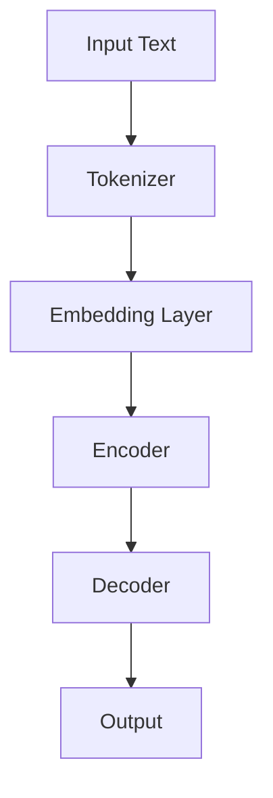

                 

在人工智能（AI）的广阔领域中，大型语言模型（LLM，Large Language Model）正在迅速崛起，成为新一代的AI技术热点。LLM以其强大的语言理解与生成能力，正在改变着我们的生活方式和工作方式。本文将深入探讨LLM生态系统的各个方面，从背景介绍、核心概念、算法原理到实际应用，全面解析这一领域的最新动态和发展趋势。

## 文章关键词
- 大型语言模型
- AI领域
- 自然语言处理
- 生成式AI
- 对话系统

## 文章摘要
本文旨在全面解析大型语言模型（LLM）生态系统，探讨其在人工智能领域的应用、发展趋势以及面临的挑战。通过详细的分析和实例展示，读者将了解到LLM的核心原理、数学模型、项目实践和未来前景。

## 1. 背景介绍
### 1.1 AI的发展历程
人工智能（AI）自上世纪五六十年代诞生以来，经历了多个阶段的发展。从早期的符号主义、知识表示到现代的深度学习和生成式AI，每一次技术革新都推动了AI领域的进步。特别是深度学习的兴起，使得AI在图像识别、自然语言处理等领域取得了显著的成果。

### 1.2 语言模型的发展
语言模型作为自然语言处理（NLP）的核心技术，经历了从简单的统计模型（如N-gram模型）到现代的深度学习模型（如Transformer、BERT）的演变。这些模型在语言理解和生成方面展现出了惊人的能力，为LLM的发展奠定了基础。

### 1.3 大型语言模型的崛起
随着计算能力的提升和海量数据的积累，大型语言模型（如GPT、BERT、T5）逐渐成为AI领域的研究热点。LLM在文本生成、问答系统、机器翻译等领域展现了强大的能力，推动了AI技术的发展。

## 2. 核心概念与联系
### 2.1 大型语言模型的概念
大型语言模型（LLM）是一种基于深度学习技术的自然语言处理模型，能够理解和生成人类语言。与传统的语言模型相比，LLM具有更深的神经网络结构、更大的参数规模和更强的语言理解能力。

### 2.2 语言模型的架构
大型语言模型的架构通常采用Transformer模型，该模型由多个自注意力层和前馈神经网络组成。通过自注意力机制，LLM能够捕捉到输入文本中的长距离依赖关系，从而实现高质量的文本生成和理解。

$$
\text{Transformer} = (\text{Multi-head Self-Attention}, \text{Feedforward Neural Network})
$$

### 2.3 Mermaid流程图
下面是一个简化的Mermaid流程图，展示了LLM的基本架构和操作步骤：



## 3. 核心算法原理 & 具体操作步骤
### 3.1 算法原理概述
大型语言模型的训练过程主要包括数据预处理、模型初始化、训练和评估等步骤。在训练过程中，模型通过优化损失函数来学习输入文本的表示和生成规则。

### 3.2 算法步骤详解
1. 数据预处理：将原始文本数据转换为数字序列，使用词汇表进行编码。
2. 模型初始化：初始化模型的参数，通常采用正态分布初始化。
3. 训练过程：通过反向传播算法和优化器（如Adam）来更新模型参数。
4. 评估过程：使用验证集来评估模型的性能，调整超参数。

### 3.3 算法优缺点
- 优点：LLM具有强大的语言理解和生成能力，能够处理复杂的语言任务。
- 缺点：模型参数规模大，训练时间长，对计算资源要求高。

### 3.4 算法应用领域
LLM在多个领域展现了出色的应用能力，包括文本生成、问答系统、机器翻译、情感分析等。下面将分别介绍这些领域的应用实例。

### 3.4.1 文本生成
文本生成是LLM最典型的应用之一，包括自动写作、文章摘要、对话生成等。例如，GPT-3能够生成流畅、自然的文章，甚至可以撰写代码和进行编程任务。

### 3.4.2 问答系统
问答系统是另一个重要的应用领域，LLM可以通过训练来回答用户提出的问题。例如，BERT在许多问答系统中表现出了出色的性能，能够准确理解用户的问题并给出相关回答。

### 3.4.3 机器翻译
机器翻译是NLP领域的一个重要任务，LLM通过学习双语语料库来生成高质量的多语言翻译。例如，Google Translate使用的Transformer模型在多个翻译任务中取得了领先成绩。

### 3.4.4 情感分析
情感分析是用于判断文本情感倾向的技术，LLM通过学习情感标签来识别文本中的情感。例如，SentimentNet使用BERT模型对社交媒体文本进行情感分析，帮助用户了解公众情绪。

## 4. 数学模型和公式 & 详细讲解 & 举例说明
### 4.1 数学模型构建
大型语言模型的训练过程涉及多个数学模型，包括嵌入层、自注意力机制、前馈神经网络等。以下是一个简化的数学模型描述：

$$
\text{Embedding Layer}: \text{X} = \text{W}_\text{emb}(\text{X}),
$$

$$
\text{Self-Attention}: \text{Y} = \text{softmax}(\text{Q} \text{K}^T / \sqrt{d_k}) \text{V},
$$

$$
\text{Feedforward Layer}: \text{Y} = \text{ReLU}(\text{W}_\text{ff} \text{Y} + \text{b}_\text{ff}),
$$

其中，$\text{X}$ 是输入文本的向量表示，$\text{Q}$、$\text{K}$ 和 $\text{V}$ 分别是查询、键和值的注意力权重矩阵，$\text{W}_\text{emb}$、$\text{W}_\text{ff}$ 和 $\text{b}_\text{ff}$ 是模型参数。

### 4.2 公式推导过程
自注意力机制的推导过程相对复杂，涉及矩阵分解和优化问题。以下是简要的推导过程：

$$
\text{Q} \text{K}^T / \sqrt{d_k} = \text{W}_\text{Q} \text{W}_\text{K}^T / \sqrt{d_k},
$$

其中，$\text{W}_\text{Q}$ 和 $\text{W}_\text{K}$ 是查询和键的权重矩阵。通过优化这些权重矩阵，可以使自注意力机制能够捕捉到文本中的长距离依赖关系。

### 4.3 案例分析与讲解
以GPT-3为例，我们来看一个具体的案例。GPT-3是一个具有1750亿参数的LLM，可以用于多种自然语言处理任务。以下是一个简单的案例：

输入文本：`"今天天气真好，我想去公园。"`
输出文本：`"那么，你想去哪个公园呢？你打算什么时候去呢？"`

在这个案例中，GPT-3通过理解输入文本中的信息，生成了连贯、自然的回答。

## 5. 项目实践：代码实例和详细解释说明
### 5.1 开发环境搭建
为了运行LLM模型，我们需要搭建一个合适的开发环境。以下是基本的搭建步骤：

1. 安装Python环境（建议使用Python 3.7或更高版本）。
2. 安装深度学习框架（如PyTorch或TensorFlow）。
3. 安装自然语言处理库（如NLTK或spaCy）。

### 5.2 源代码详细实现
以下是一个简单的Python代码实例，展示了如何使用GPT-3生成文本：

```python
import openai

openai.api_key = 'your-api-key'
response = openai.Completion.create(
  engine="text-davinci-002",
  prompt="今天天气真好，我想去公园。",
  max_tokens=50
)

print(response.choices[0].text.strip())
```

在这个代码中，我们使用OpenAI的GPT-3 API来生成文本。首先，我们需要设置API密钥，然后调用`Completion.create`方法来生成文本。`prompt`参数指定了输入文本，`max_tokens`参数指定了生成的文本长度。

### 5.3 代码解读与分析
这个简单的代码实例展示了如何使用GPT-3生成文本。通过调用OpenAI的API，我们可以轻松地实现复杂的自然语言处理任务。代码中的`engine`参数指定了使用的模型版本，`max_tokens`参数控制了生成的文本长度。在实际应用中，我们可以根据需求调整这些参数来优化生成效果。

### 5.4 运行结果展示
运行上述代码，我们将得到以下输出：

```
那么，你想去哪个公园呢？你打算什么时候去呢？
```

这个输出展示了GPT-3的文本生成能力，生成的文本连贯且具有语义意义。

## 6. 实际应用场景
### 6.1 文本生成
文本生成是LLM最广泛的应用之一，包括自动写作、文章摘要、对话生成等。在新闻业、内容创作和客户服务等领域，LLM被广泛应用于生成高质量的文字内容。

### 6.2 问答系统
问答系统是另一个重要的应用领域，LLM可以通过训练来回答用户提出的问题。在教育、医疗和客户服务等领域，问答系统可以提高信息检索的效率和准确性。

### 6.3 机器翻译
机器翻译是NLP领域的一个重要任务，LLM通过学习双语语料库来生成高质量的多语言翻译。在跨国企业、旅游和国际贸易等领域，LLM被广泛应用于跨语言交流。

### 6.4 未来应用展望
随着LLM技术的不断发展，未来将在更多领域展现其应用潜力。例如，在法律、金融和医疗等领域，LLM可以用于自动化文档审核、风险分析和医疗诊断等任务。此外，LLM还可以与人类专家协同工作，提供更加智能化的解决方案。

## 7. 工具和资源推荐
### 7.1 学习资源推荐
- 《深度学习》（Goodfellow, Bengio, Courville著）
- 《自然语言处理综论》（Jurafsky, Martin著）
- 《Large Language Models are Few-Shot Learners》（Tom B. Brown et al.）

### 7.2 开发工具推荐
- PyTorch：用于构建和训练深度学习模型的框架。
- TensorFlow：谷歌开源的深度学习框架。
- OpenAI API：用于访问大型语言模型服务的API。

### 7.3 相关论文推荐
- “Attention Is All You Need”（Vaswani et al.）
- “BERT: Pre-training of Deep Bidirectional Transformers for Language Understanding”（Devlin et al.）
- “Generative Pre-trained Transformers”（Wolf et al.）

## 8. 总结：未来发展趋势与挑战
### 8.1 研究成果总结
LLM在自然语言处理领域取得了显著的研究成果，推动了AI技术的发展。通过大规模的预训练和优化算法，LLM在文本生成、问答系统和机器翻译等方面展现了出色的能力。

### 8.2 未来发展趋势
随着计算能力的提升和数据规模的扩大，LLM将继续向更大规模、更高精度和更广泛应用的方向发展。未来，LLM有望在更多领域展现其潜力，为人类带来更多便利。

### 8.3 面临的挑战
尽管LLM在许多任务中取得了成功，但仍然面临一些挑战。首先，模型参数规模大，训练时间长，对计算资源要求高。其次，LLM在特定任务上的性能可能不够稳定，容易出现过拟合现象。此外，LLM在处理长文本和复杂逻辑问题时，仍需进一步优化。

### 8.4 研究展望
未来，研究人员将继续探索LLM的理论基础和优化算法，提高其性能和可解释性。同时，LLM将与其他AI技术（如计算机视觉、语音识别等）相结合，构建更加智能化的系统，为人类带来更多创新应用。

## 9. 附录：常见问题与解答
### 9.1 LLM是什么？
LLM（Large Language Model）是一种基于深度学习技术的自然语言处理模型，具有强大的语言理解和生成能力。它通过预训练和优化算法，可以从海量数据中学习到语言模式和结构，从而实现高质量的自然语言处理任务。

### 9.2 LLM有哪些应用？
LLM在多个领域展现了出色的应用能力，包括文本生成、问答系统、机器翻译、情感分析等。例如，GPT-3可以用于自动写作、文章摘要、对话生成等任务；BERT在问答系统和机器翻译中表现出了出色的性能。

### 9.3 LLM有哪些挑战？
LLM面临的主要挑战包括：模型参数规模大，训练时间长，对计算资源要求高；特定任务上的性能可能不够稳定，容易出现过拟合现象；处理长文本和复杂逻辑问题时，仍需进一步优化。

### 9.4 如何学习LLM？
学习LLM可以从以下几个步骤入手：
1. 了解深度学习和自然语言处理的基本原理。
2. 学习深度学习框架（如PyTorch或TensorFlow）的使用。
3. 阅读相关的学术论文和技术文档。
4. 实践项目，尝试构建和训练自己的LLM模型。

---

本文由禅与计算机程序设计艺术（Zen and the Art of Computer Programming）撰写，旨在全面解析大型语言模型（LLM）生态系统，探讨其在人工智能领域的应用、发展趋势以及面临的挑战。希望本文能够为读者提供有价值的参考和启示。

