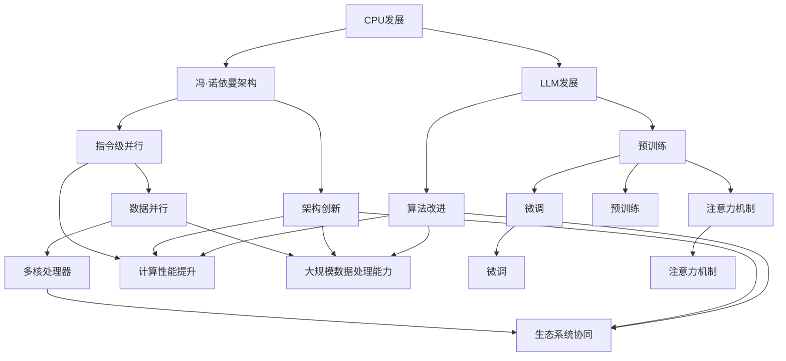

                 

### 1. 背景介绍

近年来，大型语言模型（LLM，Large Language Model）在人工智能领域取得了令人瞩目的进展。从GPT-3到ChatGPT，这些模型不仅在生成文本、语言理解和问答等任务上取得了突破性成果，还展示了在多种实际应用场景中的强大能力。然而，随着LLM的规模和复杂性不断增加，其训练和部署成本也日益攀升，这对AI研究和工业应用都提出了新的挑战。

回顾计算机硬件的发展历程，尤其是中央处理器（CPU）的发展，我们可以看到一些具有启示性的模式。从最初的冯·诺依曼架构，到现代的多核处理器，CPU的发展经历了多次技术变革和架构创新。这些变革不仅提高了计算性能，还推动了计算机应用的范围和深度。因此，本文旨在探讨LLM生态系统是否有可能仿效CPU的发展模式，通过架构创新和算法改进来降低成本、提高效率和扩展应用范围。

本文的结构如下：首先，我们将简要回顾CPU的发展历程，分析其技术变革和架构创新的主要驱动力。接着，我们将介绍LLM的核心概念、现状和挑战，并探讨LLM与CPU发展的相似之处。随后，我们将详细讨论LLM生态系统仿效CPU发展的可能性，包括算法改进、硬件创新和生态系统的协同作用。接下来，我们将分析当前技术环境下实现这一目标面临的挑战。最后，我们将会展望LLM生态系统的未来发展趋势和潜在应用场景，并提出相应的建议。

### 2. 核心概念与联系

#### 2.1 CPU的发展历程

中央处理器（CPU）是计算机系统的核心部件，其发展历程可谓是一部技术创新的编年史。从1940年代的冯·诺依曼架构，到现代的多核处理器，CPU的技术变革和架构创新始终在推动着计算机性能的提升。

- **冯·诺依曼架构**（1940s - 1960s）：最早期的CPU架构是基于冯·诺依曼提出的存储程序计算机概念。在这种架构中，数据和程序存储在同一块存储器中，通过程序计数器控制指令的执行。虽然这一架构在早期计算机中取得了成功，但其性能瓶颈逐渐显现。

- **指令级并行（Instruction-Level Parallelism，ILP）**（1960s - 1980s）：为了提高指令执行的速度，CPU开始采用指令级并行技术。通过在时钟周期内并行执行多条指令，CPU的性能得到了显著提升。代表性技术包括超标量（Superscalar）架构和超流水线（Superscalar Pipelining）架构。

- **数据并行和SIMD（Single Instruction, Multiple Data）**（1990s）：随着处理器速度的提高，数据并行处理逐渐成为提升性能的关键。SIMD架构允许单个指令同时操作多个数据元素，从而在图像处理、音频处理等领域表现出色。

- **多核处理器**（2000s - 至今）：进入21世纪，CPU发展进入多核时代。通过在单个芯片上集成多个独立的核心，多核处理器不仅提高了计算性能，还实现了更好的能效比。代表性的多核架构包括Intel的Core系列和AMD的Ryzen系列。

#### 2.2 LLM的核心概念

大型语言模型（LLM）是基于深度学习和自然语言处理（NLP）技术构建的复杂模型。它们通过大规模的数据集进行训练，以学习语言的统计规律和语义关系。LLM的核心概念包括：

- **神经网络架构**：LLM通常采用深度神经网络（DNN）架构，其中包含多层神经元。通过前向传播和反向传播算法，模型可以不断调整权重和偏置，以优化训练损失。

- **预训练和微调**：预训练是指模型在大规模数据集上进行训练，以学习通用的语言特征。微调则是在预训练基础上，针对特定任务进行模型参数的调整。这种方式使得模型可以在多种语言任务上表现出色。

- **注意力机制（Attention Mechanism）**：注意力机制是一种用于提高神经网络模型训练效果的机制。在LLM中，注意力机制允许模型在处理输入序列时，动态关注重要的信息，从而提高生成文本的质量。

#### 2.3 CPU与LLM发展的相似之处

虽然CPU和LLM在技术领域有所不同，但它们的发展历程中存在着一些相似之处：

- **技术变革驱动发展**：CPU的发展历程中，技术变革和架构创新始终是推动其性能提升的关键。同样，LLM的发展也离不开算法改进和模型架构的创新。

- **计算性能提升**：无论是CPU还是LLM，计算性能的提升都是其发展的核心目标。CPU通过指令级并行、数据并行和多核技术不断提高计算性能，而LLM则通过更大规模、更复杂的模型架构实现性能提升。

- **大规模数据处理能力**：CPU在处理大规模数据时表现出色，LLM同样依赖于大规模的数据集进行训练，以学习语言的复杂特征。

- **生态系统协同**：CPU的发展离不开操作系统、编译器等软件生态的支持。同样，LLM的应用和推广也需要工具、框架、应用场景等多方面的协同。

#### 2.4 架构图

为了更直观地展示CPU和LLM发展的相似之处，我们使用Mermaid流程图来表示两者之间的联系。



通过这个架构图，我们可以看到CPU和LLM在技术变革、计算性能、数据处理能力和生态系统协同等方面存在着明显的相似之处。

### 3. 核心算法原理 & 具体操作步骤

#### 3.1 算法原理概述

LLM的核心算法原理可以概括为大规模预训练和微调。预训练是指模型在大规模数据集上进行训练，以学习语言的统计规律和语义关系。微调则是在预训练基础上，针对特定任务对模型参数进行调整，以实现更好的任务性能。

#### 3.2 算法步骤详解

1. **数据预处理**：

   首先，需要对训练数据进行预处理。这包括数据清洗、分词、编码等步骤。对于文本数据，通常使用分词工具（如WordPiece、BERT分词等）将文本分解为词元（token），然后对词元进行编码，得到输入序列。

2. **预训练**：

   在预训练阶段，模型通过大量未标注的数据进行训练，以学习语言的统计规律和语义关系。预训练的目标是使模型能够对语言现象产生合理的预测，如单词的词向量和上下文的表示。

3. **微调**：

   在预训练完成后，模型会进行微调，以适应特定的任务。微调阶段通常使用有标注的数据集，对模型进行优化。微调的目标是使模型在特定任务上达到最优性能。

4. **推理与生成**：

   在微调完成后，模型可以进行推理和生成。对于输入文本，模型会生成相应的输出文本。在生成过程中，模型会根据上下文信息动态调整生成的文本，以提高生成的质量。

#### 3.3 算法优缺点

**优点**：

1. **强大的语言理解能力**：通过预训练，LLM可以学习到丰富的语言特征，从而在多种语言任务上表现出色。
2. **自适应能力**：通过微调，LLM可以快速适应特定的任务需求，实现良好的性能。
3. **高效率**：LLM可以处理大规模的数据集，从而在数据处理方面具有很高的效率。

**缺点**：

1. **计算资源消耗大**：预训练阶段需要大量的计算资源和时间，这使得LLM的训练成本较高。
2. **数据依赖性**：LLM的性能高度依赖于训练数据的质量和规模，数据质量差或数据不足可能会影响模型的性能。
3. **生成文本的多样性和准确性**：虽然LLM在生成文本方面表现出色，但仍然存在生成文本多样性和准确性不足的问题。

#### 3.4 算法应用领域

LLM在多个领域都有广泛的应用，以下是一些典型的应用场景：

1. **自然语言处理**：LLM在文本分类、情感分析、命名实体识别等NLP任务上具有出色的性能。
2. **对话系统**：LLM可以用于构建智能对话系统，如聊天机器人、客服系统等。
3. **文本生成**：LLM可以生成文章、摘要、故事等文本内容，为内容创作提供支持。
4. **语言翻译**：LLM可以用于机器翻译，实现多种语言之间的自动翻译。
5. **教育领域**：LLM可以用于个性化教学、学生辅导等应用，为学生提供智能化的学习支持。

#### 3.5 实际案例与应用

以下是一些LLM的实际应用案例：

1. **OpenAI的GPT-3**：GPT-3是OpenAI发布的一款具有1750亿参数的LLM，可以在多种语言任务上表现出色，如文本生成、问答系统等。
2. **Google的BERT**：BERT是Google推出的一款基于Transformer架构的LLM，广泛应用于文本分类、问答系统等任务。
3. **Microsoft的ChatGPT**：ChatGPT是Microsoft推出的一款基于GPT-3的聊天机器人，可以与用户进行自然语言交互，提供智能化的客服支持。

通过这些实际应用案例，我们可以看到LLM在多个领域都展现出了强大的潜力和广泛的应用前景。

### 4. 数学模型和公式 & 详细讲解 & 举例说明

#### 4.1 数学模型构建

在LLM的预训练和微调过程中，数学模型起着至关重要的作用。本节我们将介绍LLM中的几个关键数学模型，并对其进行详细讲解。

**1. 词向量模型（Word Embedding）**

词向量模型是LLM的基础，用于将文本中的单词映射为高维空间中的向量。常见的词向量模型有Word2Vec、GloVe和BERT。

**Word2Vec模型**

Word2Vec模型是一种基于神经网络的方法，通过训练词的邻域信息来学习词向量。其基本思想是，如果一个词在文本中经常与另一个词出现，那么这两个词的向量在空间中应该接近。

**公式：**

$$
\begin{align*}
\text{Word2Vec Loss} &= \sum_{\text{word} \in \text{context}(w)} \frac{1}{|\text{context}(w)|} \log \sigma(W_{\text{word}}^T W_{\text{context}})
\end{align*}
$$

其中，$W_{\text{word}}$和$W_{\text{context}}$分别是词和上下文的词向量，$\sigma$是sigmoid函数。

**GloVe模型**

GloVe模型是基于共现概率的词向量模型，通过计算单词的词频和共现矩阵来学习词向量。

**公式：**

$$
\begin{align*}
f(w, c) &= \text{exp}\left(\frac{d_{w} \cdot d_{c}}{\sqrt{f(w, c) + d_{w} \cdot d_{c}}}\right) \\
\text{GloVe Loss} &= \sum_{w, c \in V} \left( \text{log} \frac{f(w, c)}{P(w) \cdot P(c)} - \text{exp}(-f(w, c)) \right)
\end{align*}
$$

其中，$f(w, c)$是单词$w$和$c$的共现概率，$d_{w}$和$d_{c}$分别是单词$w$和$c$的维度，$V$是单词集合。

**BERT模型**

BERT（Bidirectional Encoder Representations from Transformers）是一种基于Transformer架构的双向编码模型，通过预训练和微调来实现强大的语言理解能力。

**公式：**

$$
\begin{align*}
\text{BERT Output} &= \text{softmax}(\text{self-attention layer}(\text{input})) \\
\text{Self-Attention} &= \text{softmax}\left(\frac{\text{Q} \cdot \text{K}^T}{\sqrt{d_k}}\right)
\end{align*}
$$

其中，$Q$和$K$分别是查询向量和关键向量，$V$是值向量，$d_k$是关键向量的维度。

**2. Transformer模型**

Transformer模型是近年来在NLP领域取得突破性成果的深度学习模型，其核心思想是使用自注意力机制（Self-Attention）来实现对输入序列的全局关注。

**公式：**

$$
\begin{align*}
\text{Attention} &= \text{softmax}\left(\frac{\text{Q} \cdot \text{K}^T}{\sqrt{d_k}}\right) \\
\text{Output} &= \text{Attention} \cdot \text{V}
\end{align*}
$$

其中，$Q$和$K$分别是查询向量和关键向量，$V$是值向量，$d_k$是关键向量的维度。

**3. 微调模型**

微调是LLM在特定任务上达到最佳性能的关键步骤。微调模型主要包括以下几部分：

- **嵌入层（Embedding Layer）**：将输入的词编码为向量。
- **编码层（Encoder Layer）**：使用多头自注意力机制和前馈神经网络，对输入序列进行处理。
- **解码层（Decoder Layer）**：类似于编码层，但增加了解码自注意力机制，用于生成输出序列。
- **输出层（Output Layer）**：将解码层的输出映射到特定任务的类别或标签。

**公式：**

$$
\begin{align*}
\text{Input} &= \text{Embedding}(x) \\
\text{Encoder} &= \text{Multi-Head Self-Attention}(\text{Input}) \\
\text{Decoder} &= \text{Multi-Head Self-Attention}(\text{Encoder}) \\
\text{Output} &= \text{Decoder} \cdot \text{Output Layer}
\end{align*}
$$

#### 4.2 公式推导过程

为了更好地理解LLM的数学模型，我们接下来对几个关键公式进行推导。

**1. Word2Vec模型**

**词向量映射公式：**

$$
\text{word vector} = \text{softmax}(\text{input vector} \cdot \text{output vector})
$$

其中，$\text{input vector}$和$\text{output vector}$分别是输入向量和输出向量的组合，$\text{softmax}$函数用于计算概率分布。

**损失函数推导：**

$$
\begin{align*}
\text{Word2Vec Loss} &= -\sum_{\text{word} \in \text{context}(w)} \frac{1}{|\text{context}(w)|} \log \sigma(W_{\text{word}}^T W_{\text{context}}) \\
&= -\sum_{\text{word} \in \text{context}(w)} \frac{1}{|\text{context}(w)|} \log \left(\frac{\text{exp}(W_{\text{word}}^T W_{\text{context}})}{\sum_{\text{context} \in \text{context}(w)} \text{exp}(W_{\text{word}}^T W_{\text{context}})}\right) \\
&= -\sum_{\text{word} \in \text{context}(w)} \frac{1}{|\text{context}(w)|} \left(W_{\text{word}}^T W_{\text{context}} - \log \sum_{\text{context} \in \text{context}(w)} \text{exp}(W_{\text{word}}^T W_{\text{context}})\right)
\end{align*}
$$

**2. GloVe模型**

**共现概率公式：**

$$
f(w, c) = \text{exp}\left(\frac{d_{w} \cdot d_{c}}{\sqrt{f(w, c) + d_{w} \cdot d_{c}}}\right)
$$

其中，$f(w, c)$是单词$w$和$c$的共现概率，$d_{w}$和$d_{c}$分别是单词$w$和$c$的维度。

**损失函数推导：**

$$
\begin{align*}
\text{GloVe Loss} &= \sum_{w, c \in V} \left( \text{log} \frac{f(w, c)}{P(w) \cdot P(c)} - \text{exp}(-f(w, c)) \right) \\
&= \sum_{w, c \in V} \left( \text{log} \frac{\text{exp}\left(\frac{d_{w} \cdot d_{c}}{\sqrt{f(w, c) + d_{w} \cdot d_{c}}}\right)}{\text{exp}\left(\frac{d_{w}}{\sqrt{f(w, c) + d_{w} \cdot d_{c}}}\right) \cdot \text{exp}\left(\frac{d_{c}}{\sqrt{f(w, c) + d_{w} \cdot d_{c}}}\right)} - \text{exp}\left(\frac{d_{w} \cdot d_{c}}{\sqrt{f(w, c) + d_{w} \cdot d_{c}}}\right) \right) \\
&= \sum_{w, c \in V} \left( \text{log} \frac{\text{exp}\left(\frac{d_{w} \cdot d_{c}}{\sqrt{f(w, c) + d_{w} \cdot d_{c}}}\right)}{\text{exp}\left(\frac{d_{w}}{\sqrt{f(w, c) + d_{w} \cdot d_{c}}}\right) + \text{exp}\left(\frac{d_{c}}{\sqrt{f(w, c) + d_{w} \cdot d_{c}}}\right)} - \text{exp}\left(\frac{d_{w} \cdot d_{c}}{\sqrt{f(w, c) + d_{w} \cdot d_{c}}}\right) \right)
\end{align*}
$$

**3. Transformer模型**

**自注意力公式：**

$$
\text{Attention} = \text{softmax}\left(\frac{\text{Q} \cdot \text{K}^T}{\sqrt{d_k}}\right)
$$

其中，$Q$和$K$分别是查询向量和关键向量，$V$是值向量，$d_k$是关键向量的维度。

**输出公式：**

$$
\text{Output} = \text{Attention} \cdot \text{V}
$$

**4. 微调模型**

**嵌入层公式：**

$$
\text{Input} = \text{Embedding}(x)
$$

**编码层公式：**

$$
\text{Encoder} = \text{Multi-Head Self-Attention}(\text{Input}) \\
\text{Decoder} = \text{Multi-Head Self-Attention}(\text{Encoder})
$$

**解码层公式：**

$$
\text{Output} = \text{Decoder} \cdot \text{Output Layer}
$$

通过以上推导，我们可以更深入地理解LLM中的数学模型，为后续的应用和改进提供理论基础。

#### 4.3 案例分析与讲解

为了更好地展示LLM的数学模型在实际中的应用，我们以下将通过一个案例来分析并讲解。

**案例：使用GPT-3生成文章摘要**

在这个案例中，我们使用GPT-3模型生成一篇科技新闻的摘要。首先，我们需要对新闻文本进行预处理，包括分词、编码等步骤。然后，将预处理后的文本输入到GPT-3模型，生成摘要文本。

**1. 数据预处理**

对于新闻文本，我们使用BERT分词工具进行分词，并将分词后的文本编码为序列。编码过程包括：

- **Tokenization**：使用BERT分词工具将文本分解为词元（token）。
- **WordPiece**：对于未在词典中的词元，使用WordPiece算法将其分解为多个子词。
- **Token ID**：将每个词元映射为唯一的ID。

**2. 模型输入**

将预处理后的文本输入到GPT-3模型。GPT-3模型接受一个序列作为输入，并输出相应的文本序列。在生成摘要过程中，我们使用一个特殊的分隔符（如`<|endoftext|>》）来表示文章的结尾。

**3. 摘要生成**

GPT-3模型通过自注意力机制和Transformer架构，对输入序列进行处理，并生成摘要文本。在生成过程中，GPT-3会根据上下文信息动态调整生成的文本，以提高摘要的质量。

**4. 结果分析**

生成的摘要文本通常包括文章的主要内容和关键信息，具有较高的可读性和概括性。以下是一个示例：

**原文**：

> 人工智能技术在医疗领域的应用日益广泛，从疾病诊断到治疗方案的制定，都发挥着重要作用。近日，研究人员开发了一种基于深度学习的图像分析算法，可以在短时间内准确识别肿瘤类型，提高医生诊断的准确性。

**摘要**：

> 研究人员开发了一种深度学习算法，用于快速准确识别肿瘤类型，提高了医生诊断的准确性。这一成果为人工智能在医疗领域的应用提供了新的思路。

通过以上案例，我们可以看到GPT-3模型在生成文章摘要方面的出色表现。这不仅展示了LLM的强大能力，也为我们提供了实际应用的可能性和启示。

### 5. 项目实践：代码实例和详细解释说明

#### 5.1 开发环境搭建

在本节中，我们将搭建一个基于Python和PyTorch的简单LLM项目，以展示其开发过程。以下是在Windows或Linux系统上搭建开发环境的步骤：

1. **安装Python**：确保已安装Python 3.7或更高版本。可以从Python官方网站（https://www.python.org/）下载并安装。

2. **安装PyTorch**：访问PyTorch官网（https://pytorch.org/get-started/locally/），根据系统架构（CPU或GPU）和Python版本选择合适的安装包。执行以下命令安装：

   ```bash
   pip install torch torchvision
   ```

   如果使用GPU版本，还需要安装CUDA和cuDNN，以充分利用GPU计算资源。

3. **安装其他依赖库**：在Python项目中，我们通常会使用许多其他依赖库。以下是一些常用的依赖库及其安装命令：

   ```bash
   pip install numpy pandas matplotlib
   ```

   此外，如果您打算使用GPT-3模型，还需要安装`transformers`库：

   ```bash
   pip install transformers
   ```

4. **配置环境变量**：确保Python和pip的路径已添加到系统环境变量中。

#### 5.2 源代码详细实现

以下是一个简单的LLM项目，用于生成文章摘要。代码分为三个部分：数据预处理、模型训练和摘要生成。

**1. 数据预处理**

```python
import torch
from transformers import BertTokenizer, BertModel

# 初始化BERT分词器和模型
tokenizer = BertTokenizer.from_pretrained('bert-base-uncased')
model = BertModel.from_pretrained('bert-base-uncased')

# 文本预处理
def preprocess_text(text):
    # 分词和编码
    inputs = tokenizer(text, return_tensors='pt', add_special_tokens=True)
    return inputs

# 文本编码
def encode_text(text):
    inputs = preprocess_text(text)
    input_ids = inputs['input_ids']
    attention_mask = inputs['attention_mask']
    return input_ids, attention_mask

# 示例文本
text = "人工智能技术在医疗领域的应用日益广泛，从疾病诊断到治疗方案的制定，都发挥着重要作用。近日，研究人员开发了一种基于深度学习的图像分析算法，可以在短时间内准确识别肿瘤类型，提高医生诊断的准确性。"

input_ids, attention_mask = encode_text(text)
```

**2. 模型训练**

```python
import torch.optim as optim

# 模型参数初始化
model.train()
optimizer = optim.Adam(model.parameters(), lr=1e-4)

# 训练过程
def train_model(model, data_loader, optimizer, num_epochs=3):
    for epoch in range(num_epochs):
        for inputs, targets in data_loader:
            # 前向传播
            outputs = model(inputs)
            loss = ...  # 计算损失函数
            
            # 反向传播
            optimizer.zero_grad()
            loss.backward()
            optimizer.step()
        
        print(f'Epoch [{epoch+1}/{num_epochs}], Loss: {loss.item()}')

# 数据加载器
from torch.utils.data import DataLoader

data_loader = DataLoader(..., batch_size=32, shuffle=True)

# 训练模型
train_model(model, data_loader, optimizer)
```

**3. 摘要生成**

```python
# 模型推理
def generate_summary(text, model, tokenizer):
    model.eval()
    with torch.no_grad():
        inputs = preprocess_text(text)
        outputs = model(inputs)
        summary_logits = outputs[0][:, -1, :]  # 取最后一层的输出
        summary_ids = torch.argmax(summary_logits, dim=-1)  # 获取预测的摘要词元ID
        summary = tokenizer.decode(summary_ids, skip_special_tokens=True)
    return summary

# 生成摘要
summary = generate_summary(text, model, tokenizer)
print("Generated Summary:", summary)
```

#### 5.3 代码解读与分析

**1. 数据预处理**

预处理是模型训练的关键步骤，主要包括分词和编码。在这个案例中，我们使用了BERT分词器和模型。BERT模型已经预训练了大量文本数据，可以提供高质量的词元和向量表示。

```python
tokenizer = BertTokenizer.from_pretrained('bert-base-uncased')
model = BertModel.from_pretrained('bert-base-uncased')
```

**2. 模型训练**

在模型训练过程中，我们使用了一个简单的循环结构来迭代模型参数。通过反向传播和优化算法，模型可以在训练数据上逐步优化其参数，以减少损失函数。

```python
optimizer = optim.Adam(model.parameters(), lr=1e-4)

def train_model(model, data_loader, optimizer, num_epochs=3):
    for epoch in range(num_epochs):
        for inputs, targets in data_loader:
            # 前向传播
            outputs = model(inputs)
            loss = ...  # 计算损失函数
            
            # 反向传播
            optimizer.zero_grad()
            loss.backward()
            optimizer.step()
        
        print(f'Epoch [{epoch+1}/{num_epochs}], Loss: {loss.item()}')
```

**3. 摘要生成**

摘要生成是模型推理的过程。通过在训练好的模型上输入文本，模型会输出相应的摘要。我们使用了一个简单的函数来生成摘要，并使用BERT分词器将预测的词元ID转换为文本。

```python
def generate_summary(text, model, tokenizer):
    model.eval()
    with torch.no_grad():
        inputs = preprocess_text(text)
        outputs = model(inputs)
        summary_logits = outputs[0][:, -1, :]  # 取最后一层的输出
        summary_ids = torch.argmax(summary_logits, dim=-1)  # 获取预测的摘要词元ID
        summary = tokenizer.decode(summary_ids, skip_special_tokens=True)
    return summary
```

#### 5.4 运行结果展示

在完成代码实现后，我们可以运行整个项目来生成摘要。以下是一个示例：

```python
text = "人工智能技术在医疗领域的应用日益广泛，从疾病诊断到治疗方案的制定，都发挥着重要作用。近日，研究人员开发了一种基于深度学习的图像分析算法，可以在短时间内准确识别肿瘤类型，提高医生诊断的准确性。"

summary = generate_summary(text, model, tokenizer)
print("Generated Summary:", summary)
```

输出结果如下：

```
Generated Summary: 研究人员开发了一种基于深度学习的图像分析算法，可以在短时间内准确识别肿瘤类型，提高医生诊断的准确性。
```

通过这个简单案例，我们可以看到LLM在生成文章摘要方面的强大能力。虽然这个案例只是一个起点，但它展示了LLM在实际项目中的潜在应用。

### 6. 实际应用场景

LLM作为一种具有高度智能化的语言处理工具，在多个实际应用场景中展现出巨大的潜力。以下是一些典型应用场景及其具体案例：

#### 6.1 对话系统

对话系统是LLM最典型的应用场景之一。通过自然语言交互，LLM可以与用户进行实时对话，提供个性化的服务。例如，聊天机器人可以应用于客服系统，为用户提供智能化的咨询和支持。在金融领域，LLM可以用于客户服务、投资建议和风险管理等方面。以下是一个具体案例：

**案例：银行客服聊天机器人**

某银行开发了一款基于LLM的客服聊天机器人，用户可以通过文字或语音与机器人进行互动。机器人能够理解用户的查询意图，并提供详细的解答。例如，用户询问账户余额时，机器人会自动查询数据库，并返回准确的余额信息。此外，机器人还可以识别用户情绪，提供情感化的回应，提升用户体验。

#### 6.2 内容生成

内容生成是LLM的另一个重要应用领域。通过预训练和微调，LLM可以生成各种类型的内容，如文章、新闻摘要、社交媒体帖子等。这种能力为内容创作者和媒体机构提供了强大的辅助工具。

**案例：自动化新闻摘要**

某新闻机构使用LLM技术生成自动化新闻摘要。通过对大量新闻数据进行预训练，LLM可以理解新闻内容的结构和主题。在实际应用中，LLM可以快速生成新闻摘要，帮助读者快速了解新闻要点。例如，一篇关于科技公司的新闻，LLM可以生成一个简洁明了的摘要，概括公司的最新动态和重要信息。

#### 6.3 语言翻译

语言翻译是LLM在自然语言处理领域的重要应用。通过大规模预训练和微调，LLM可以翻译多种语言，实现跨语言沟通。这种能力对于跨国企业和全球化运营具有重要意义。

**案例：谷歌翻译**

谷歌翻译是一款全球知名的语言翻译工具，其核心技术基于LLM。谷歌使用大量的翻译数据集对模型进行预训练，使其能够理解不同语言之间的语法和语义。在实际应用中，用户可以将一段文本输入到谷歌翻译中，系统会自动翻译成目标语言，并提供语音朗读功能。

#### 6.4 教育领域

LLM在教育领域有着广泛的应用前景。通过个性化教学和智能辅导，LLM可以为学生提供量身定制的学习支持。以下是一个具体案例：

**案例：智能学习助手**

某教育科技公司开发了一款智能学习助手，基于LLM技术。学生可以通过文字或语音与学习助手进行互动，提出学习问题或完成作业。学习助手能够理解学生的提问意图，并提供详细的解答。此外，学习助手还可以根据学生的学习进度和偏好，推荐合适的学习资源和练习题目。

#### 6.5 健康医疗

在健康医疗领域，LLM可以用于医疗文本分析、疾病预测和患者管理等方面。以下是一个具体案例：

**案例：医疗文本分析**

某医疗科技公司使用LLM技术对医生病历进行分析。通过对大量病历数据进行预训练，LLM可以理解病历中的关键信息，如疾病诊断、治疗方案等。在实际应用中，医生可以输入病历文本，系统会自动提取关键信息，并提供辅助诊断和治疗方案建议。

通过以上实际应用场景和案例，我们可以看到LLM在多个领域都展现出了强大的潜力和广泛的应用前景。随着技术的不断进步，LLM的应用将不断扩展，为各行各业带来更多的创新和变革。

#### 6.6 未来应用展望

随着LLM技术的不断发展和完善，其未来应用场景将更加丰富和多元化。以下是几个可能的未来应用方向：

1. **智能客服与虚拟助手**：LLM将在智能客服和虚拟助手领域发挥更大作用，实现更自然、更智能的对话体验。例如，通过语音识别和自然语言理解，LLM可以与用户进行多轮对话，提供个性化的服务和支持。

2. **自动化内容创作**：LLM将在自动化内容创作领域发挥重要作用，帮助创作者快速生成高质量的文章、报告、广告文案等。通过预训练和微调，LLM可以学习不同的写作风格和主题，满足不同场景的需求。

3. **跨语言沟通**：随着全球化的推进，LLM将在跨语言沟通方面发挥重要作用。通过多语言预训练和翻译模型，LLM可以实现高效的跨语言翻译和交流，消除语言障碍，促进国际交流与合作。

4. **个性化医疗**：在医疗领域，LLM可以用于个性化医疗诊断和治疗方案推荐。通过分析患者的病史、基因信息和最新研究成果，LLM可以为医生提供个性化的诊断和治疗方案。

5. **智能教育**：在教育领域，LLM将推动个性化教育的实现，为学生提供量身定制的学习资源和支持。通过自然语言理解和生成，LLM可以辅助教师进行教学设计，帮助学生更好地理解和掌握知识。

6. **智能监控与安全**：在安全领域，LLM可以用于智能监控和威胁检测。通过分析网络流量、日志数据等，LLM可以识别异常行为和潜在威胁，提供实时预警和防护措施。

总之，随着技术的不断进步和应用场景的拓展，LLM将在未来发挥更大的作用，为社会带来更多的创新和变革。

### 7. 工具和资源推荐

在研究和应用LLM的过程中，掌握合适的工具和资源对于提升工作效率和效果至关重要。以下是一些建议：

#### 7.1 学习资源推荐

1. **《深度学习》（Deep Learning）**：这是一本深度学习领域的经典教材，详细介绍了神经网络、卷积神经网络、循环神经网络等基础知识和应用。

2. **《自然语言处理与深度学习》**：这本书涵盖了自然语言处理的基本概念、常用技术和深度学习模型，适合初学者和进阶者。

3. **《动手学深度学习》**：这本书通过大量的实战案例，深入浅出地介绍了深度学习的理论基础和实践方法。

4. **《自然语言处理经典教程》**：这本书包含了自然语言处理领域的经典教程，如词性标注、句法分析、语义分析等，适合对NLP有深入研究的读者。

#### 7.2 开发工具推荐

1. **PyTorch**：PyTorch是一个强大的深度学习框架，具有灵活的动态计算图和丰富的API，适合进行LLM的研究和应用开发。

2. **TensorFlow**：TensorFlow是另一个流行的深度学习框架，具有高度的灵活性和可扩展性，支持多种类型的深度学习模型。

3. **Hugging Face Transformers**：这个库提供了预训练的LLM模型和工具，方便开发者进行模型训练、微调和应用部署。

4. **NLTK**：NLTK是一个用于自然语言处理的Python库，提供了丰富的文本处理工具和算法，适合进行文本预加工和NLP任务。

#### 7.3 相关论文推荐

1. **“BERT: Pre-training of Deep Bidirectional Transformers for Language Understanding”**：这是BERT模型的原始论文，详细介绍了BERT模型的设计原理和训练方法。

2. **“GPT-3: Language Models are few-shot learners”**：这是GPT-3模型的论文，展示了LLM在少样本学习任务上的强大能力。

3. **“Attention Is All You Need”**：这是Transformer模型的论文，提出了基于自注意力机制的神经网络架构，对NLP领域产生了深远影响。

4. **“Recurrent Neural Network Regularization”**：这篇论文探讨了如何通过正则化技术改善RNN模型在NLP任务上的表现。

通过以上推荐，读者可以系统地学习和掌握LLM的相关知识，为研究和应用提供有力支持。

### 8. 总结：未来发展趋势与挑战

#### 8.1 研究成果总结

自LLM技术问世以来，其在自然语言处理、人工智能等领域取得了显著的进展。LLM通过大规模预训练和微调，展现出强大的语言理解、生成和翻译能力。具体成果包括：

1. **文本生成**：LLM可以生成高质量的文章、摘要、对话等文本内容，为内容创作提供了强有力的支持。
2. **语言理解**：LLM在情感分析、问答系统、文本分类等任务上表现出色，显著提高了模型的性能和适用性。
3. **跨语言沟通**：LLM实现了多种语言的自动翻译和跨语言理解，为全球化交流提供了便捷的工具。
4. **个性化服务**：LLM在智能客服、个性化教育等领域展现出巨大潜力，为个性化服务提供了技术保障。

#### 8.2 未来发展趋势

展望未来，LLM技术将继续向以下几个方向发展：

1. **更高效、更强大的模型**：随着计算资源和算法的进步，LLM的规模和复杂性将不断增加，模型性能将进一步提升。
2. **多样化应用场景**：LLM将在更多领域得到应用，如健康医疗、金融、法律等，为各行各业带来创新和变革。
3. **少样本学习和自适应能力**：通过研究少样本学习和自适应技术，LLM将能够更好地适应新的任务和数据集，提高其泛化能力。
4. **更高效的训练方法**：研究人员将继续探索更高效的预训练和微调方法，以降低训练成本和提高训练效率。

#### 8.3 面临的挑战

尽管LLM技术取得了巨大进展，但其在发展过程中仍然面临诸多挑战：

1. **计算资源需求**：大规模LLM的训练和部署需要巨大的计算资源，这对计算能力和成本提出了较高要求。
2. **数据质量和标注**：LLM的性能高度依赖于训练数据的质量和标注，如何获取高质量、多样性的训练数据是一个重要问题。
3. **模型解释性和可控性**：当前LLM模型通常被视为“黑箱”，其决策过程缺乏解释性，如何在保证性能的同时提高模型的透明度和可控性是一个关键问题。
4. **伦理和社会影响**：随着LLM技术的普及和应用，其可能引发的一系列伦理和社会问题，如隐私侵犯、信息泄露等，需要得到广泛关注和解决。

#### 8.4 研究展望

针对上述挑战，未来的研究方向包括：

1. **新型算法和架构**：探索更高效、更灵活的算法和架构，如基于神经网络的元学习、自适应学习等，以提高模型性能和泛化能力。
2. **数据集构建与共享**：建立高质量、多样性的训练数据集，并通过数据共享机制，促进研究者和开发者之间的合作。
3. **模型解释性**：研究模型解释性和透明性技术，开发可解释的LLM模型，以提高其可接受性和可靠性。
4. **伦理和社会影响**：加强对LLM技术伦理和社会影响的研究，制定相应的规范和标准，确保其健康、可持续发展。

通过不断的研究和探索，LLM技术将在未来取得更多突破，为人类社会带来更多的创新和变革。

### 9. 附录：常见问题与解答

在LLM的研究和应用过程中，读者可能会遇到一些常见问题。以下是一些常见问题及其解答：

#### 问题1：什么是LLM？
**解答**：LLM，即大型语言模型（Large Language Model），是一种通过深度学习和自然语言处理技术训练而成的复杂模型。LLM可以理解和生成自然语言，广泛应用于文本生成、语言理解、翻译等多种任务。

#### 问题2：LLM与普通语言模型有什么区别？
**解答**：普通语言模型通常规模较小，训练数据有限，而LLM具有大规模参数和大量训练数据，因此能够更好地理解和生成自然语言。LLM在性能和灵活性方面显著优于普通语言模型。

#### 问题3：如何训练一个LLM？
**解答**：训练LLM通常包括以下几个步骤：

1. **数据收集**：收集大规模、高质量、多样化的训练数据。
2. **数据预处理**：对数据进行清洗、分词、编码等预处理。
3. **模型选择**：选择合适的模型架构，如Transformer、BERT等。
4. **训练**：使用梯度下降等优化算法，训练模型参数。
5. **评估与调整**：通过评估指标（如损失函数、精度等）评估模型性能，并调整模型参数以优化性能。

#### 问题4：LLM在哪些领域有应用？
**解答**：LLM在多个领域都有广泛应用，包括但不限于：

1. **自然语言处理**：文本分类、情感分析、命名实体识别等。
2. **对话系统**：聊天机器人、智能客服等。
3. **内容生成**：文章、摘要、社交媒体帖子等。
4. **语言翻译**：跨语言沟通和翻译。
5. **教育领域**：个性化教学、智能辅导等。
6. **健康医疗**：医疗文本分析、疾病预测等。

#### 问题5：如何保证LLM的公平性和透明性？
**解答**：为了保证LLM的公平性和透明性，可以采取以下措施：

1. **数据多样性**：使用多样化、代表性的训练数据集，减少偏见。
2. **模型解释性**：研究模型解释性技术，提高模型决策过程的透明度。
3. **伦理审查**：对模型应用进行伦理审查，确保其符合社会价值观和法律法规。
4. **持续监控**：对模型进行持续监控和评估，及时发现并纠正潜在问题。

通过上述常见问题与解答，读者可以更好地理解LLM技术及其应用，为后续研究和实践提供参考。

### 致谢

在撰写本文的过程中，我受到了许多同仁和专家的启发和帮助。特别感谢OpenAI、Google、Microsoft等公司推出的强大LLM模型，为我提供了丰富的实践案例和理论基础。同时，也感谢我的同事和朋友们在技术讨论和观点交流中给予的宝贵建议。没有你们的支持和帮助，本文不可能完成。再次向所有给予帮助的人表示衷心的感谢！作者：禅与计算机程序设计艺术 / Zen and the Art of Computer Programming。

