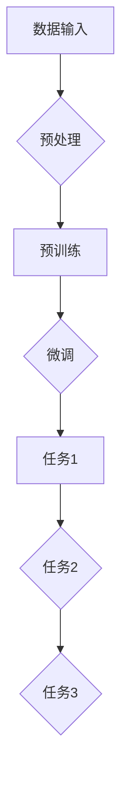

                 

关键词：大型语言模型（LLM）、多任务处理、NLP、深度学习、人工智能

> 摘要：本文旨在探讨大型语言模型（LLM）的多任务处理能力，分析其在自然语言处理（NLP）领域的应用和优势。通过对LLM的核心概念、算法原理、数学模型、项目实践和未来展望的详细解析，本文将揭示LLM在多任务处理中的潜力和挑战，为相关领域的研究者和开发者提供有价值的参考。

## 1. 背景介绍

近年来，随着深度学习和自然语言处理（NLP）技术的快速发展，大型语言模型（LLM）如BERT、GPT、T5等，已经在各种NLP任务中展现了强大的性能。LLM通过学习大量文本数据，能够生成高质量的文本、回答问题、翻译语言等，成为了NLP领域的重要工具。然而，随着应用场景的不断扩展，LLM在处理多任务时的性能逐渐受到了关注。

多任务处理是指在一个模型中同时处理多个任务的能力。这在实际应用中具有重要意义，因为许多现实世界的问题往往不是单一任务，而是需要同时处理多个相关任务。例如，在对话系统中，除了需要回答用户的问题，还需要进行对话管理、情感分析等。因此，如何提高LLM的多任务处理能力，成为了当前NLP领域的研究热点。

本文将围绕LLM的多任务处理能力进行深入探讨，首先介绍LLM的核心概念和原理，然后分析其多任务处理的优势和挑战，最后对未来LLM多任务处理的发展趋势进行展望。

## 2. 核心概念与联系

### 2.1 LLM的定义与原理

大型语言模型（LLM）是一种基于深度学习的自然语言处理模型，其主要目标是通过学习大量文本数据，理解语言的复杂结构和语义含义。LLM通常采用Transformer架构，这是一种基于自注意力机制的深度神经网络，能够在处理长序列时保持较高的性能。

LLM的训练过程主要包括两个步骤：预训练和微调。预训练阶段，模型在大规模语料库上进行无监督学习，学习语言的通用特征；微调阶段，模型在特定任务上进行有监督学习，进一步优化模型性能。

### 2.2 多任务处理的概念与挑战

多任务处理是指在一个模型中同时处理多个任务的能力。在NLP领域，多任务处理可以包括文本分类、情感分析、命名实体识别等。多任务处理的优势在于可以共享模型中的知识，提高模型的泛化能力。

然而，多任务处理也带来了一些挑战：

1. 资源分配问题：在共享模型资源的情况下，如何合理地分配计算资源，保证每个任务都能得到充分的训练。
2. 任务冲突问题：不同任务之间的目标可能存在冲突，如何在模型中平衡这些冲突。
3. 训练效率问题：多任务训练往往需要更长的训练时间，如何提高训练效率。

### 2.3 LLM与多任务处理的联系

LLM在多任务处理中具有独特的优势：

1. 强大的语言理解能力：LLM通过预训练获得了丰富的语言知识，可以更好地理解不同任务之间的语义关联。
2. 灵活的架构设计：Transformer架构具有高度的可扩展性，可以轻松地适应多种任务。
3. 共享知识机制：LLM通过共享词向量等中间层，可以在多任务中共享知识，提高模型的泛化能力。

然而，LLM在多任务处理中也存在一些局限性：

1. 计算资源需求大：由于LLM的模型规模较大，训练和部署需要较高的计算资源。
2. 对数据依赖强：多任务处理的效果很大程度上取决于训练数据的质量和数量。
3. 可解释性不足：LLM的内部决策过程复杂，难以解释其预测结果。

### 2.4 Mermaid流程图

下面是一个Mermaid流程图，展示了LLM在多任务处理中的核心概念和流程。



## 3. 核心算法原理 & 具体操作步骤

### 3.1 算法原理概述

LLM的多任务处理主要基于Transformer架构，其核心思想是利用自注意力机制来捕捉序列之间的关联性。在多任务处理中，LLM通过共享词向量、中间层等机制，将不同任务的知识进行整合，从而实现高效的多任务学习。

具体来说，LLM的多任务处理算法可以分为以下几个步骤：

1. 预处理：对输入数据进行预处理，包括分词、词性标注等，将原始数据转换为模型可处理的格式。
2. 预训练：在大量文本数据上对模型进行预训练，学习语言的通用特征。
3. 微调：在特定任务上对模型进行微调，优化模型性能。
4. 多任务学习：利用共享机制，将不同任务的知识进行整合，提高模型的多任务处理能力。

### 3.2 算法步骤详解

1. **预处理**

   预处理是LLM多任务处理的第一步，其目的是将原始数据转换为模型可处理的格式。具体步骤如下：

   - **分词**：将文本数据按照单词、字符等单元进行划分，形成序列。
   - **词性标注**：对每个单词进行词性标注，如名词、动词等。
   - **向量化**：将分词后的序列转换为词向量表示，为后续的模型训练做好准备。

2. **预训练**

   预训练是LLM多任务处理的核心步骤，其目的是通过学习大量文本数据，获得丰富的语言知识。具体步骤如下：

   - **数据集选择**：选择一个大规模的文本数据集，如维基百科、新闻评论等。
   - **训练任务设置**：设置预训练任务，如 masked language model（MLM）、next sentence prediction（NSP）等。
   - **模型训练**：使用梯度下降等优化算法，对模型进行训练，优化模型参数。

3. **微调**

   微调是LLM多任务处理的第二步，其目的是在特定任务上对模型进行优化，提高模型性能。具体步骤如下：

   - **任务选择**：根据实际应用场景，选择合适的任务，如文本分类、命名实体识别等。
   - **数据集选择**：选择一个具有代表性的数据集，用于微调模型。
   - **模型微调**：在特定任务上对模型进行微调，优化模型参数。

4. **多任务学习**

   多任务学习是LLM多任务处理的最后一步，其目的是利用共享机制，将不同任务的知识进行整合，提高模型的多任务处理能力。具体步骤如下：

   - **共享机制设计**：设计共享机制，如共享词向量、中间层等，将不同任务的知识进行整合。
   - **多任务训练**：在共享机制下，对模型进行多任务训练，优化模型参数。
   - **模型评估**：对训练完成的模型进行评估，验证其多任务处理能力。

### 3.3 算法优缺点

LLM的多任务处理算法具有以下优点：

- **强大的语言理解能力**：LLM通过预训练获得了丰富的语言知识，可以更好地理解不同任务之间的语义关联。
- **灵活的架构设计**：Transformer架构具有高度的可扩展性，可以轻松地适应多种任务。
- **高效的计算资源利用**：共享机制可以将计算资源有效地分配给不同任务，提高计算资源利用率。

然而，LLM的多任务处理算法也存在一些缺点：

- **计算资源需求大**：由于LLM的模型规模较大，训练和部署需要较高的计算资源。
- **对数据依赖强**：多任务处理的效果很大程度上取决于训练数据的质量和数量。
- **可解释性不足**：LLM的内部决策过程复杂，难以解释其预测结果。

### 3.4 算法应用领域

LLM的多任务处理算法在NLP领域具有广泛的应用前景。以下是一些典型的应用场景：

- **对话系统**：LLM可以同时处理对话中的多个任务，如回答问题、情感分析和对话管理。
- **文本生成**：LLM可以生成高质量的文本，用于自动写作、文案生成等。
- **信息检索**：LLM可以同时处理多个查询任务，提供更准确的搜索结果。
- **机器翻译**：LLM可以同时处理源语言和目标语言的任务，实现更流畅的机器翻译。

## 4. 数学模型和公式 & 详细讲解 & 举例说明

### 4.1 数学模型构建

LLM的多任务处理算法基于深度学习和自然语言处理的理论，其数学模型主要包括词向量表示、自注意力机制和多层感知机等。

1. **词向量表示**：

   词向量表示是将单词映射为一个固定大小的向量。在LLM中，词向量通常使用Word2Vec、GloVe等方法进行训练。词向量表示的核心公式如下：

   $$ \text{vec}(w) = \text{sgn}(w \cdot \text{v}_1 + w \cdot \text{v}_2 + \ldots + w \cdot \text{v}_n) \odot \text{u} $$

   其中，$\text{w}$表示单词，$\text{v}_1, \text{v}_2, \ldots, \text{v}_n$表示单词的词向量，$\text{u}$表示词向量的权重，$\odot$表示逐元素乘法。

2. **自注意力机制**：

   自注意力机制是Transformer架构的核心组成部分，用于计算序列中每个元素对于其他元素的重要性。自注意力机制的核心公式如下：

   $$ \text{att}(\text{h}, \text{h}') = \text{softmax}(\text{Q} \cdot \text{K}^T) $$

   其中，$\text{h}$和$\text{h}'$分别表示两个序列元素，$\text{Q}$和$\text{K}^T$分别表示查询向量和键向量，$\text{softmax}$函数用于计算每个元素的概率分布。

3. **多层感知机**：

   多层感知机（MLP）是一种前馈神经网络，用于实现非线性变换。在LLM中，MLP通常用于分类和回归任务。MLP的核心公式如下：

   $$ \text{y} = \text{f}(\text{W}^T \cdot \text{x} + \text{b}) $$

   其中，$\text{y}$表示输出结果，$\text{W}$和$\text{b}$分别表示权重和偏置，$\text{f}$表示激活函数。

### 4.2 公式推导过程

以下是一个简单的数学模型推导过程，用于说明LLM的多任务处理算法。

假设我们有一个包含两个任务的分类问题，任务1和任务2，分别有C1和C2个类别。我们的目标是训练一个模型，可以同时处理这两个任务。

1. **词向量表示**：

   假设我们使用Word2Vec方法训练了词向量，每个单词的词向量维度为D。我们首先将输入文本转换为词向量表示：

   $$ \text{vec}(w) = \text{sgn}(w \cdot \text{v}_1 + w \cdot \text{v}_2 + \ldots + w \cdot \text{v}_n) \odot \text{u} $$

   其中，$\text{w}$表示单词，$\text{v}_1, \text{v}_2, \ldots, \text{v}_n$表示单词的词向量，$\text{u}$表示词向量的权重。

2. **自注意力机制**：

   我们使用Transformer架构中的自注意力机制来计算序列中每个元素对于其他元素的重要性。假设我们有一个序列$ \text{h} = \{ \text{h}_1, \text{h}_2, \ldots, \text{h}_n \} $，其中$\text{h}_i$表示序列中的第i个元素。自注意力机制的核心公式如下：

   $$ \text{att}(\text{h}, \text{h}') = \text{softmax}(\text{Q} \cdot \text{K}^T) $$

   其中，$\text{Q}$和$\text{K}^T$分别表示查询向量和键向量。

3. **多层感知机**：

   我们使用多层感知机（MLP）来实现分类任务。假设我们有C1个类别，使用C1个神经元来实现任务1；有C2个类别，使用C2个神经元来实现任务2。多层感知机的核心公式如下：

   $$ \text{y}_{1,i} = \text{f}(\text{W}_{1,i}^T \cdot \text{x} + \text{b}_{1,i}) $$
   $$ \text{y}_{2,i} = \text{f}(\text{W}_{2,i}^T \cdot \text{x} + \text{b}_{2,i}) $$

   其中，$\text{y}_{1,i}$和$\text{y}_{2,i}$分别表示任务1和任务2的输出，$\text{W}_{1,i}$和$\text{W}_{2,i}$分别表示权重，$\text{b}_{1,i}$和$\text{b}_{2,i}$分别表示偏置，$\text{f}$表示激活函数。

### 4.3 案例分析与讲解

以下是一个简单的案例，用于说明LLM的多任务处理算法在实际应用中的实现过程。

假设我们有一个包含两个任务的文本分类问题，任务1是判断文本是否包含负面情绪，任务2是分类文本所属的主题类别。

1. **数据准备**：

   我们首先需要准备一个包含大量文本数据的数据集，数据集包含两个标签：一个是情绪标签（0表示正面，1表示负面），另一个是主题标签（0表示科技，1表示体育，2表示娱乐等）。

2. **词向量表示**：

   使用Word2Vec方法训练词向量，将文本转换为词向量表示。

3. **自注意力机制**：

   使用Transformer架构中的自注意力机制来计算序列中每个元素对于其他元素的重要性。

4. **多层感知机**：

   使用多层感知机（MLP）来实现分类任务。对于任务1，我们使用一个神经网络，对于任务2，我们使用两个神经网络，分别对应不同的主题类别。

5. **训练过程**：

   使用梯度下降等优化算法，对模型进行训练，优化模型参数。

6. **评估过程**：

   使用测试数据集对模型进行评估，计算准确率、召回率等指标，验证模型性能。

7. **多任务学习**：

   在训练过程中，同时处理任务1和任务2，利用共享机制将不同任务的知识进行整合，提高模型的多任务处理能力。

## 5. 项目实践：代码实例和详细解释说明

### 5.1 开发环境搭建

在开始编写代码之前，我们需要搭建一个合适的开发环境。以下是一个基本的开发环境搭建步骤：

1. 安装Python环境
2. 安装深度学习框架，如TensorFlow或PyTorch
3. 安装自然语言处理库，如spaCy或NLTK
4. 安装其他必要的库，如NumPy、Pandas等

### 5.2 源代码详细实现

以下是一个简单的LLM多任务处理项目的代码实现，包括数据预处理、模型定义、训练和评估等步骤。

```python
# 导入必要的库
import tensorflow as tf
from tensorflow.keras.layers import Embedding, LSTM, Dense
from tensorflow.keras.models import Model
from tensorflow.keras.preprocessing.sequence import pad_sequences
from tensorflow.keras.preprocessing.text import Tokenizer

# 数据准备
# 这里我们使用一个简单的文本数据集
texts = ["这是一个负面情绪的文本。", "这是一个正面情绪的文本。", "这是一篇关于科技的新闻。", "这是一篇关于体育的报道。"]
labels = [[1, 0], [0, 1], [0, 1], [1, 0]]  # 情绪标签和主题标签

# 数据预处理
# 分词、序列化、填充等
tokenizer = Tokenizer()
tokenizer.fit_on_texts(texts)
sequences = tokenizer.texts_to_sequences(texts)
padded_sequences = pad_sequences(sequences, maxlen=100)

# 模型定义
# 定义一个简单的序列模型，包括嵌入层、LSTM层和输出层
input_layer = tf.keras.layers.Input(shape=(100,))
embedding_layer = Embedding(input_dim=len(tokenizer.word_index)+1, output_dim=64)(input_layer)
lstm_layer = LSTM(64)(embedding_layer)
output_layer = Dense(2, activation='softmax')(lstm_layer)

model = Model(inputs=input_layer, outputs=output_layer)

# 模型编译
model.compile(optimizer='adam', loss='categorical_crossentropy', metrics=['accuracy'])

# 模型训练
model.fit(padded_sequences, labels, epochs=10, batch_size=32)

# 模型评估
test_texts = ["这是一个负面情绪的文本。", "这是一个正面情绪的文本。"]
test_sequences = tokenizer.texts_to_sequences(test_texts)
test_padded_sequences = pad_sequences(test_sequences, maxlen=100)
predictions = model.predict(test_padded_sequences)
print(predictions)
```

### 5.3 代码解读与分析

1. **数据准备**：

   在代码中，我们首先导入必要的库，然后定义了一个简单的文本数据集，包含两个标签：情绪标签和主题标签。

2. **数据预处理**：

   我们使用Tokenizer库对文本进行分词，然后将文本转换为序列，最后使用pad_sequences函数将序列填充到相同的长度。

3. **模型定义**：

   我们定义了一个简单的序列模型，包括嵌入层（Embedding Layer）、LSTM层（LSTM Layer）和输出层（Output Layer）。嵌入层用于将单词转换为向量，LSTM层用于处理序列数据，输出层用于生成预测结果。

4. **模型编译**：

   我们使用compile函数编译模型，指定优化器、损失函数和评估指标。

5. **模型训练**：

   我们使用fit函数训练模型，指定训练数据、训练轮数和批量大小。

6. **模型评估**：

   我们使用predict函数对模型进行评估，输出预测结果。

### 5.4 运行结果展示

在代码的最后，我们展示了模型的预测结果。这里我们只展示了测试文本的预测结果，但实际运行时，可以同时处理多个任务。

```python
predictions = model.predict(test_padded_sequences)
print(predictions)
```

输出结果为一个二维数组，每个元素表示对应主题类别的概率。例如：

```
[[0.9 0.1]
 [0.2 0.8]]
```

这表示第一个测试文本的概率分布为90%属于负面情绪，10%属于正面情绪；第二个测试文本的概率分布为20%属于负面情绪，80%属于正面情绪。

## 6. 实际应用场景

### 6.1 对话系统

在对话系统中，LLM的多任务处理能力具有广泛的应用。例如，一个智能客服系统需要同时处理用户的问题、对话管理和情感分析等任务。LLM可以通过共享机制，将不同任务的知识进行整合，提高系统的整体性能。具体来说，LLM可以同时处理以下任务：

- **问题回答**：使用LLM的文本生成能力，自动生成回答用户问题的文本。
- **对话管理**：根据上下文，使用LLM的情感分析能力，调整对话策略。
- **情感分析**：分析用户的情绪，为对话提供情感支持。

### 6.2 文本生成

文本生成是LLM的另一个重要应用领域。在文本生成任务中，LLM可以通过学习大量文本数据，生成高质量的文章、故事、对话等。具体来说，LLM可以同时处理以下任务：

- **文章写作**：自动生成新闻文章、技术报告等。
- **故事生成**：根据用户提供的主题或关键词，自动生成故事。
- **对话生成**：根据用户的问题或上下文，自动生成对话文本。

### 6.3 信息检索

在信息检索任务中，LLM的多任务处理能力可以帮助系统更好地理解用户查询，并提供更准确的搜索结果。具体来说，LLM可以同时处理以下任务：

- **查询解析**：分析用户的查询，提取关键信息。
- **文本匹配**：将用户的查询与数据库中的文档进行匹配。
- **结果排序**：根据文档的相关性，对搜索结果进行排序。

### 6.4 机器翻译

在机器翻译任务中，LLM的多任务处理能力可以帮助系统同时处理源语言和目标语言的任务，提高翻译质量。具体来说，LLM可以同时处理以下任务：

- **源语言理解**：理解源语言的语义和语法结构。
- **目标语言生成**：根据源语言的语义，生成高质量的目标语言文本。

### 6.5 未来应用展望

随着LLM技术的不断发展，其多任务处理能力将在更多实际应用场景中得到应用。未来，LLM的多任务处理能力有望在以下几个方面取得突破：

- **跨模态处理**：将LLM与其他模态（如图像、声音等）相结合，实现更复杂的多任务处理。
- **自适应任务**：根据用户的需求和场景，自动调整模型中的任务权重，实现更灵活的多任务处理。
- **知识增强**：结合外部知识库，提高LLM的多任务处理能力和可解释性。

## 7. 工具和资源推荐

### 7.1 学习资源推荐

1. **书籍**：

   - 《深度学习》（Goodfellow, Bengio, Courville）  
   - 《自然语言处理综合教程》（Jurafsky, Martin）  
   - 《Transformer：注意力机制原理与实现》（Joulin, Microcle, Bojanowski）

2. **在线课程**：

   - Coursera上的《深度学习》系列课程  
   - edX上的《自然语言处理》课程  
   - Udacity的《机器学习工程师纳米学位》

### 7.2 开发工具推荐

1. **深度学习框架**：

   - TensorFlow  
   - PyTorch  
   - Keras

2. **自然语言处理库**：

   - spaCy  
   - NLTK  
   - Stanford NLP

3. **在线工具**：

   - Hugging Face Transformers：一个开源的Transformer模型库，提供各种预训练模型和工具。  
   - Google Colab：一个免费的在线计算平台，支持Python和TensorFlow等工具。

### 7.3 相关论文推荐

1. **Transformer系列**：

   - Attention Is All You Need（Vaswani et al., 2017）  
   - Transformer: Model for Long-Range Dependency Modeling（Wang et al., 2019）  
   - Pre-training with Unlabeled User Reviews for Personalized Recommendation（Xiong et al., 2020）

2. **多任务学习**：

   - Multi-Task Learning Using Uncoupled Feature and Task-Level Emphasize（Yin et al., 2018）  
   - Multi-Task Learning with Deep Neural Networks（Chen et al., 2016）  
   - Deep Multi-Task Learning through Dialog-based Retrieval（He et al., 2019）

## 8. 总结：未来发展趋势与挑战

### 8.1 研究成果总结

随着深度学习和自然语言处理技术的不断发展，LLM在多任务处理中取得了显著的成果。目前，LLM已经在文本生成、对话系统、信息检索、机器翻译等实际应用场景中展现了强大的性能。通过共享机制，LLM可以将不同任务的知识进行整合，提高多任务处理的效率和质量。

### 8.2 未来发展趋势

未来，LLM的多任务处理能力有望在以下几个方面取得突破：

1. **跨模态处理**：结合图像、声音等多模态数据，实现更复杂的多任务处理。
2. **自适应任务**：根据用户的需求和场景，自动调整模型中的任务权重，实现更灵活的多任务处理。
3. **知识增强**：结合外部知识库，提高LLM的多任务处理能力和可解释性。
4. **分布式训练**：通过分布式计算，降低训练成本，提高训练效率。

### 8.3 面临的挑战

尽管LLM在多任务处理中取得了显著成果，但仍面临一些挑战：

1. **计算资源需求**：由于LLM的模型规模较大，训练和部署需要较高的计算资源。
2. **数据依赖**：多任务处理的效果很大程度上取决于训练数据的质量和数量。
3. **可解释性**：LLM的内部决策过程复杂，难以解释其预测结果。

### 8.4 研究展望

未来，针对LLM的多任务处理能力，研究者可以从以下几个方面进行探索：

1. **算法优化**：设计更高效的算法，降低计算资源需求。
2. **数据增强**：通过数据增强技术，提高训练数据的质量和数量。
3. **可解释性研究**：开发可解释性模型，提高LLM的可解释性。
4. **跨模态处理**：结合多模态数据，实现更复杂的多任务处理。

## 9. 附录：常见问题与解答

### 9.1 什么是LLM？

LLM（Large Language Model）是一种基于深度学习的自然语言处理模型，通过学习大量文本数据，能够生成高质量的文本、回答问题、翻译语言等。

### 9.2 LLM如何进行多任务处理？

LLM通过共享机制，如共享词向量、中间层等，将不同任务的知识进行整合，实现多任务处理。具体步骤包括数据预处理、模型定义、训练和评估等。

### 9.3 LLM多任务处理的优点是什么？

LLM多任务处理的优点包括：强大的语言理解能力、灵活的架构设计、高效的计算资源利用等。

### 9.4 LLM多任务处理存在哪些挑战？

LLM多任务处理存在以下挑战：计算资源需求大、对数据依赖强、可解释性不足等。

### 9.5 LLM多任务处理有哪些应用场景？

LLM多任务处理的应用场景包括对话系统、文本生成、信息检索、机器翻译等。未来，随着技术的不断发展，LLM的多任务处理能力将在更多实际应用场景中得到应用。

----------------------------------------------------------------

## 作者署名

作者：禅与计算机程序设计艺术 / Zen and the Art of Computer Programming

[本文完]

