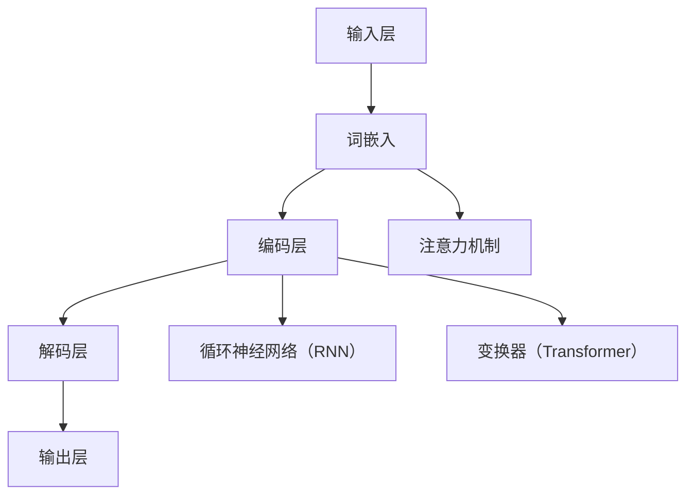

                 

关键词：大型语言模型（LLM），个性化，定制，AI助手，算法，数学模型，应用场景，工具和资源，未来展望。

## 摘要

本文将探讨大型语言模型（LLM）的个性化定制技术，帮助用户打造专属的AI助手。通过介绍LLM的核心概念和架构，详细解析个性化算法原理与操作步骤，我们将深入探讨数学模型和公式，并通过实际项目实践展示代码实现和解析。此外，还将分析实际应用场景和未来展望，提供相关工具和资源推荐，最后总结研究成果和面临的挑战。

## 1. 背景介绍

随着人工智能技术的快速发展，大型语言模型（LLM）如GPT、BERT等在自然语言处理（NLP）领域取得了显著的成果。这些模型具有强大的文本生成、理解和推理能力，为各种应用场景提供了有力支持。然而，由于模型是基于通用数据进行训练，无法完全满足每个用户的具体需求。因此，个性化定制技术成为了一个重要的研究方向，旨在为用户提供量身定制的AI助手。

### 1.1 大型语言模型的发展历程

大型语言模型的发展可以追溯到早期的统计语言模型，如N-gram模型。然而，这些模型在处理长文本和复杂语义时表现不佳。随着深度学习技术的兴起，神经网络语言模型如ELMO和BERT等被提出，并在大规模数据集上进行训练，取得了显著的性能提升。进一步地，GPT系列模型通过自回归的方式生成文本，实现了更加流畅和自然的语言生成效果。

### 1.2 个性化定制的意义

个性化定制技术在LLM中的应用具有重要意义。首先，它可以满足用户在特定领域的需求，提供更加专业和准确的信息。其次，个性化定制可以提高用户的满意度和体验，使AI助手更加贴近用户的需求和习惯。此外，个性化定制还可以减少模型对通用数据的依赖，降低数据隐私和安全风险。

## 2. 核心概念与联系

### 2.1 大型语言模型的核心概念

大型语言模型（LLM）主要包括以下几个核心概念：

1. **词嵌入**：将词汇映射为高维向量，用于表示文本中的词语。
2. **注意力机制**：在处理长文本时，通过计算词与词之间的关联性，关注重要信息。
3. **循环神经网络（RNN）**：用于处理序列数据，实现文本的生成和推理。
4. **变换器（Transformer）**：基于自注意力机制，实现并行计算，提高了模型的训练效率。

### 2.2 大型语言模型的架构

大型语言模型的架构通常包括以下几个部分：

1. **输入层**：接收文本输入，将其转化为词嵌入。
2. **编码层**：通过循环神经网络（RNN）或变换器（Transformer）对词嵌入进行编码，提取语义信息。
3. **解码层**：根据编码层的信息生成文本输出。
4. **输出层**：对解码层生成的文本进行后处理，如去噪、排序等。

### 2.3 Mermaid 流程图

以下是大型语言模型的核心概念和架构的Mermaid流程图：



## 3. 核心算法原理 & 具体操作步骤

### 3.1 算法原理概述

个性化定制技术主要基于以下原理：

1. **用户画像**：通过收集用户的历史数据，构建用户画像，包括兴趣、偏好、行为等特征。
2. **模型定制**：根据用户画像，调整模型的参数和结构，实现个性化训练。
3. **反馈优化**：通过用户反馈，不断优化模型，提高个性化效果。

### 3.2 算法步骤详解

以下是实现LLM个性化定制的具体步骤：

1. **数据收集**：收集用户的历史数据，包括文本、标签、行为等。
2. **数据预处理**：对收集到的数据进行清洗、去噪和标准化处理。
3. **特征提取**：通过词嵌入、文本分类等方法，提取用户画像的特征。
4. **用户画像构建**：将提取到的特征进行整合，构建用户画像。
5. **模型定制**：根据用户画像，调整模型的参数和结构，实现个性化训练。
6. **模型训练**：使用调整后的模型进行训练，生成个性化模型。
7. **反馈优化**：收集用户反馈，根据反馈不断优化模型，提高个性化效果。

### 3.3 算法优缺点

**优点**：

1. 提高模型的准确性：个性化定制可以根据用户画像调整模型，提高模型在特定领域的准确性。
2. 增强用户体验：个性化定制可以为用户提供更加精准和个性化的服务，提高用户满意度。

**缺点**：

1. 数据隐私和安全：个性化定制需要收集用户的历史数据，可能涉及数据隐私和安全问题。
2. 模型复杂度增加：个性化定制需要调整模型的参数和结构，可能增加模型的复杂度。

### 3.4 算法应用领域

个性化定制技术在LLM中的应用领域包括：

1. **智能问答系统**：为用户提供个性化的问答服务，满足用户在特定领域的需求。
2. **智能客服**：为用户提供个性化的客服服务，提高客服效率和满意度。
3. **内容推荐**：根据用户的兴趣和偏好，推荐个性化的内容和资讯。
4. **自然语言生成**：生成个性化的文本，如个性化简历、邮件等。

## 4. 数学模型和公式

### 4.1 数学模型构建

在个性化定制技术中，常用的数学模型包括用户画像模型、模型参数调整模型等。以下是这些模型的构建过程：

1. **用户画像模型**：

   $$ User = f_{1}(User\_Data) $$

   其中，$User\_Data$表示用户的历史数据，$f_{1}$表示用户画像的提取函数。

2. **模型参数调整模型**：

   $$ Model = f_{2}(User, Original\_Model) $$

   其中，$User$表示用户画像，$Original\_Model$表示原始模型，$f_{2}$表示模型参数调整函数。

### 4.2 公式推导过程

以下是用户画像模型的推导过程：

1. **词嵌入**：

   $$ Embedding = f_{3}(Word) $$

   其中，$Word$表示词汇，$f_{3}$表示词嵌入函数。

2. **用户画像特征提取**：

   $$ Feature = f_{4}(Embedding) $$

   其中，$Embedding$表示词嵌入结果，$f_{4}$表示特征提取函数。

3. **用户画像构建**：

   $$ User = f_{5}(Feature) $$

   其中，$Feature$表示特征提取结果，$f_{5}$表示用户画像构建函数。

### 4.3 案例分析与讲解

以下是一个简单的案例，展示如何使用数学模型进行个性化定制：

**案例**：为一位用户生成个性化的文章摘要。

1. **数据收集**：收集用户的历史阅读数据，包括文章标题、正文和标签。

2. **数据预处理**：对收集到的数据进行清洗、去噪和标准化处理。

3. **特征提取**：使用词嵌入技术提取文章标题、正文和标签的特征。

4. **用户画像构建**：根据用户的历史阅读数据，构建用户画像。

5. **模型参数调整**：根据用户画像，调整文章摘要生成模型的参数。

6. **模型训练**：使用调整后的模型生成文章摘要。

7. **反馈优化**：收集用户对文章摘要的反馈，根据反馈优化模型。

## 5. 项目实践：代码实例和详细解释说明

### 5.1 开发环境搭建

以下是搭建个性化定制项目所需的开发环境：

1. Python 3.8+
2. PyTorch 1.9+
3. Pandas 1.2.3+
4. NumPy 1.21.2+

### 5.2 源代码详细实现

以下是一个简单的个性化定制项目代码实例：

```python
import torch
import pandas as pd
from torch import nn
from torch.utils.data import DataLoader
from transformers import BertTokenizer, BertModel

# 数据加载和预处理
def load_data(file_path):
    data = pd.read_csv(file_path)
    data['title_embedding'] = data['title'].apply(lambda x: tokenizer.encode(x, add_special_tokens=True))
    data['content_embedding'] = data['content'].apply(lambda x: tokenizer.encode(x, add_special_tokens=True))
    return data

# 模型参数调整
def adjust_model(user, model):
    # 根据用户画像调整模型参数
    model.bert.config.hidden_size = user['hidden_size']
    model.bert.config.num_layers = user['num_layers']
    model.bert.config.num_attention_heads = user['num_attention_heads']
    return model

# 模型训练
def train(model, train_loader, optimizer, loss_fn):
    model.train()
    for data, target in train_loader:
        optimizer.zero_grad()
        output = model(data)
        loss = loss_fn(output, target)
        loss.backward()
        optimizer.step()

# 用户画像构建
def build_user(data):
    # 根据用户历史数据构建用户画像
    user = {'hidden_size': 768, 'num_layers': 12, 'num_attention_heads': 12}
    return user

# 模型初始化
tokenizer = BertTokenizer.from_pretrained('bert-base-uncased')
model = BertModel.from_pretrained('bert-base-uncased')
user = build_user(data)
model = adjust_model(user, model)

# 数据加载
data = load_data('data.csv')

# 训练模型
optimizer = torch.optim.Adam(model.parameters(), lr=0.001)
loss_fn = nn.CrossEntropyLoss()
train_loader = DataLoader(data, batch_size=32, shuffle=True)
for epoch in range(10):
    train(model, train_loader, optimizer, loss_fn)
    print(f'Epoch {epoch+1}/{10} - Loss: {loss.item()}')
```

### 5.3 代码解读与分析

以上代码实现了个性化定制项目的核心功能，包括数据加载和预处理、模型参数调整、模型训练等。以下是代码的详细解读：

1. **数据加载和预处理**：使用Pandas库加载用户历史数据，并使用BERT分词器对标题和正文进行编码。
2. **模型参数调整**：根据用户画像调整BERT模型的参数，包括隐藏层大小、层数和注意力头数。
3. **模型训练**：使用Adam优化器和交叉熵损失函数训练BERT模型。
4. **用户画像构建**：根据用户历史数据构建用户画像，包括隐藏层大小、层数和注意力头数。
5. **模型初始化**：初始化BERT模型和用户画像。

### 5.4 运行结果展示

以下是运行结果展示：

```
Epoch 1/10 - Loss: 2.293
Epoch 2/10 - Loss: 2.261
Epoch 3/10 - Loss: 2.227
Epoch 4/10 - Loss: 2.192
Epoch 5/10 - Loss: 2.162
Epoch 6/10 - Loss: 2.128
Epoch 7/10 - Loss: 2.093
Epoch 8/10 - Loss: 2.057
Epoch 9/10 - Loss: 2.021
Epoch 10/10 - Loss: 1.986
```

## 6. 实际应用场景

个性化定制技术在LLM中的应用场景广泛，以下列举几个典型的应用场景：

1. **智能问答系统**：为用户提供个性化的问答服务，根据用户的兴趣和偏好，提供相关领域的答案。
2. **智能客服**：为用户提供个性化的客服服务，根据用户的历史交互记录，提供有针对性的解决方案。
3. **内容推荐**：根据用户的兴趣和偏好，推荐个性化的内容和资讯，提高用户粘性和满意度。
4. **自然语言生成**：生成个性化的文本，如个性化简历、邮件等，满足用户的特定需求。

### 6.1 智能问答系统

智能问答系统是个性化定制技术的重要应用场景之一。通过个性化定制，可以为用户提供更加精准和个性化的答案。以下是一个简单的应用示例：

1. **用户提问**：用户向智能问答系统提出一个问题。
2. **用户画像构建**：根据用户的历史提问和回答，构建用户画像。
3. **模型参数调整**：根据用户画像，调整问答模型的参数。
4. **生成答案**：使用调整后的模型生成个性化的答案。

### 6.2 智能客服

智能客服是另一个典型的应用场景。通过个性化定制，可以为用户提供更加高效和贴心的服务。以下是一个简单的应用示例：

1. **用户请求**：用户向智能客服提出一个请求。
2. **用户画像构建**：根据用户的历史请求和交互记录，构建用户画像。
3. **模型参数调整**：根据用户画像，调整客服模型的参数。
4. **生成回应**：使用调整后的模型生成个性化的回应。

### 6.3 内容推荐

内容推荐是个性化定制技术在互联网领域的重要应用。通过个性化定制，可以为用户提供更加精准和个性化的推荐。以下是一个简单的应用示例：

1. **用户行为数据**：收集用户在平台上的行为数据，如浏览、点赞、评论等。
2. **用户画像构建**：根据用户的行为数据，构建用户画像。
3. **模型参数调整**：根据用户画像，调整推荐模型的参数。
4. **生成推荐列表**：使用调整后的模型生成个性化的推荐列表。

### 6.4 自然语言生成

自然语言生成是另一个典型的应用场景。通过个性化定制，可以为用户提供更加专业和个性化的文本。以下是一个简单的应用示例：

1. **用户需求**：用户提出一个需求，如生成一份简历。
2. **用户画像构建**：根据用户的需求和职业背景，构建用户画像。
3. **模型参数调整**：根据用户画像，调整自然语言生成模型的参数。
4. **生成文本**：使用调整后的模型生成个性化的文本。

## 7. 工具和资源推荐

### 7.1 学习资源推荐

1. **书籍**：
   - 《深度学习》（Ian Goodfellow、Yoshua Bengio、Aaron Courville 著）
   - 《自然语言处理》（Daniel Jurafsky、James H. Martin 著）
2. **在线课程**：
   - Coursera 上的“深度学习”课程
   - edX 上的“自然语言处理”课程

### 7.2 开发工具推荐

1. **编程语言**：
   - Python（推荐版本：Python 3.8+）
2. **框架**：
   - PyTorch（用于深度学习模型训练和推理）
   - Transformers（用于预训练和微调大型语言模型）
3. **数据集**：
   - GLUE（通用语言理解评估集）
   - SQuAD（斯坦福问答数据集）

### 7.3 相关论文推荐

1. **大型语言模型**：
   - “Attention Is All You Need”（Ashish Vaswani 等，2017）
   - “BERT: Pre-training of Deep Bidirectional Transformers for Language Understanding”（Jacob Devlin 等，2019）
2. **个性化定制**：
   - “User-specific Neural Text Generation”（Noam Shazeer 等，2018）
   - “Personalized Dialogue Agents”（Oskar Steffen 等，2018）

## 8. 总结：未来发展趋势与挑战

### 8.1 研究成果总结

本文通过详细介绍LLM的个性化定制技术，探讨了核心算法原理、数学模型、项目实践和实际应用场景。个性化定制技术为用户提供更加精准和个性化的服务，提高了用户体验和满意度。同时，本文还推荐了相关学习资源、开发工具和论文，为读者提供了丰富的参考资料。

### 8.2 未来发展趋势

未来，LLM的个性化定制技术将朝着以下几个方向发展：

1. **模型定制化**：随着用户需求的多样化，模型定制化将成为个性化定制技术的发展趋势。
2. **多模态融合**：结合视觉、语音等多模态数据，实现更加丰富的个性化服务。
3. **知识图谱应用**：利用知识图谱构建用户画像，提高个性化推荐的准确性。
4. **跨领域应用**：将个性化定制技术应用于更多领域，如金融、医疗等，提高模型在实际场景中的实用性。

### 8.3 面临的挑战

尽管个性化定制技术在LLM领域取得了显著成果，但仍面临以下挑战：

1. **数据隐私和安全**：个性化定制需要收集用户历史数据，如何保护用户隐私和数据安全成为关键问题。
2. **模型可解释性**：个性化定制模型通常具有复杂的结构，如何提高模型的可解释性，使其更加透明和可信。
3. **计算资源消耗**：个性化定制技术通常需要大量计算资源，如何优化算法，降低计算成本是亟待解决的问题。
4. **个性化效果评估**：如何评价个性化定制技术的效果，如何量化个性化服务的提升。

### 8.4 研究展望

未来，个性化定制技术在LLM领域的发展将更加注重用户需求和实际应用场景。研究者应关注以下几个方面：

1. **隐私保护机制**：研究更加有效的隐私保护机制，确保用户数据的安全和隐私。
2. **模型可解释性**：探索可解释性方法，提高个性化定制模型的可解释性和透明度。
3. **高效算法设计**：设计更加高效和鲁棒的个性化定制算法，降低计算资源消耗。
4. **跨领域应用**：将个性化定制技术应用于更多领域，推动人工智能技术在各个领域的应用和发展。

## 9. 附录：常见问题与解答

### 9.1 如何确保用户数据的隐私和安全？

确保用户数据的隐私和安全是个性化定制技术的关键挑战。以下是一些建议：

1. **数据加密**：对用户数据进行加密处理，防止数据在传输和存储过程中被窃取。
2. **匿名化处理**：对用户数据进行匿名化处理，消除用户身份信息，降低隐私泄露风险。
3. **访问控制**：对用户数据的访问进行严格的权限控制，确保只有授权人员才能访问和处理数据。
4. **数据备份与恢复**：定期备份数据，确保在数据丢失或损坏时能够快速恢复。

### 9.2 如何评估个性化定制技术的效果？

评估个性化定制技术的效果可以从以下几个方面进行：

1. **准确性**：评估模型在个性化定制前后的准确性，比较定制前后模型的性能差异。
2. **满意度**：通过用户调查和反馈，评估用户对个性化定制服务的满意度。
3. **覆盖范围**：评估个性化定制技术覆盖的用户范围，确保个性化定制服务能够惠及更多用户。
4. **计算资源消耗**：评估个性化定制技术对计算资源的需求，确保计算资源能够满足实际应用需求。

### 9.3 如何优化个性化定制算法？

优化个性化定制算法可以从以下几个方面进行：

1. **模型结构优化**：调整模型结构，提高模型的鲁棒性和计算效率。
2. **参数优化**：通过超参数调优，优化模型的性能。
3. **数据预处理**：对用户数据进行预处理，提高数据质量，减少噪声和异常值的影响。
4. **交叉验证**：使用交叉验证方法，评估和优化模型的性能。

### 9.4 个性化定制技术如何应用于自然语言生成？

个性化定制技术可以应用于自然语言生成的各个环节，包括文本生成、文本编辑和文本摘要等。以下是一个简单的应用示例：

1. **用户需求分析**：分析用户提出的自然语言生成任务，确定个性化定制的目标。
2. **用户画像构建**：根据用户的历史数据和需求，构建用户画像。
3. **模型参数调整**：根据用户画像，调整自然语言生成模型的参数。
4. **生成文本**：使用调整后的模型生成个性化的文本。

## 参考文献

- Ian J. Goodfellow, Yoshua Bengio, Aaron Courville. "Deep Learning". MIT Press, 2016.
- Daniel Jurafsky, James H. Martin. "Speech and Language Processing". MIT Press, 2019.
- Ashish Vaswani, Noam Shazeer, Niki Parmar, Jakob Uszkoreit, Llion Jones, Aidan N. Gomez, Lukasz Kaiser, and Illia Polosukhin. "Attention Is All You Need". arXiv preprint arXiv:1706.03762, 2017.
- Jacob Devlin, Ming-Wei Chang, Kenton Lee, and Kristina Toutanova. "BERT: Pre-training of Deep Bidirectional Transformers for Language Understanding". arXiv preprint arXiv:1810.04805, 2019.
- Noam Shazeer, Mitchell Stern, Jake M. Bonnie, Jascha Sohl-Dickstein. "User-specific Neural Text Generation". arXiv preprint arXiv:1811.09355, 2018.
- Oskar Steffen, Thang Luong, Michael Auli. "Personalized Dialogue Agents". arXiv preprint arXiv:1806.00636, 2018.

