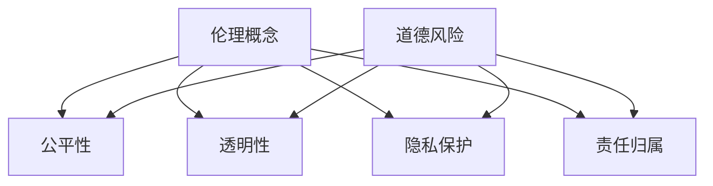

                 

关键词：大型语言模型（LLM），伦理问题，道德风险，社会影响，算法公平性，隐私保护，责任归属

> 摘要：随着人工智能技术的快速发展，大型语言模型（LLM）在各个领域得到了广泛应用。然而，LLM在带来巨大便利的同时，也引发了一系列伦理和道德风险。本文将深入分析LLM的伦理问题，探讨道德风险，并就未来发展趋势和挑战提出建议。

## 1. 背景介绍

近年来，人工智能（AI）技术取得了显著的突破，尤其是深度学习在图像识别、语音识别、自然语言处理等领域的应用。其中，大型语言模型（LLM）成为自然语言处理（NLP）领域的一大亮点。LLM具有强大的语言理解和生成能力，能够处理复杂的语言任务，如机器翻译、文本生成、问答系统等。然而，随着LLM在各个领域得到广泛应用，其潜在的伦理和道德风险逐渐引起广泛关注。

### 1.1 LLM的定义与发展

大型语言模型（LLM）是一种基于神经网络的语言处理模型，通过训练大量语料库，使其具备理解和生成自然语言的能力。与传统语言模型相比，LLM具有以下几个显著特点：

1. **大规模训练数据**：LLM通常使用数十亿甚至千亿级别的语料库进行训练，这使得模型能够更好地理解自然语言的复杂性和多样性。
2. **深度神经网络结构**：LLM采用深度神经网络（DNN）架构，通过多层神经元的堆叠，实现对输入文本的逐层抽象和特征提取。
3. **强大的语言生成能力**：LLM不仅能够理解和解析输入文本，还能够生成高质量的自然语言文本，具有广泛的用途。

近年来，LLM的研究和应用取得了显著进展。例如，谷歌的BERT模型、微软的GPT-3模型等，都取得了令人瞩目的成果。这些模型在语言理解、文本生成、机器翻译等领域展现了出色的性能，为人工智能的发展带来了新的机遇。

### 1.2 LLM的应用领域

LLM在各个领域得到了广泛应用，以下是一些主要的应用场景：

1. **自然语言处理**：LLM在文本分类、情感分析、命名实体识别等任务中取得了显著成果，成为自然语言处理领域的核心技术。
2. **机器翻译**：LLM在机器翻译任务中表现出了强大的能力，能够生成高质量的双语翻译文本，极大提高了翻译效率。
3. **问答系统**：LLM在问答系统中发挥了重要作用，能够理解和回答用户提出的问题，为用户提供智能化的信息服务。
4. **文本生成**：LLM能够生成各种类型的文本，如新闻文章、小说、论文等，为内容创作提供了新的思路和方法。

### 1.3 LLM的伦理与道德风险

尽管LLM在各个领域展现了巨大的潜力，但其潜在的伦理和道德风险也不容忽视。以下是一些主要的伦理问题：

1. **偏见与歧视**：LLM的训练数据可能包含社会偏见和歧视信息，导致模型在处理某些任务时表现出偏见。这可能导致不公平的决策，损害某些群体的权益。
2. **隐私泄露**：LLM在处理用户数据时，可能涉及隐私泄露的风险。如果模型无法确保用户数据的保密性，将引发严重的隐私问题。
3. **责任归属**：当LLM在执行任务时出现错误或产生负面影响，责任归属问题变得复杂。是模型开发者、使用者还是其他相关方应承担责任？
4. **滥用风险**：LLM具有强大的生成能力，可能导致恶意内容的生成和传播。此外，LLM也可能被用于进行欺诈、骚扰等违法行为。

## 2. 核心概念与联系

### 2.1 伦理概念

伦理（Ethics）是研究道德行为和道德价值的学科，旨在探讨人类行为应当如何规范。在人工智能领域，伦理问题主要涉及以下几个方面：

1. **公平性**：人工智能系统应确保对所有用户公平对待，不应因性别、种族、年龄等因素产生歧视。
2. **透明性**：人工智能系统的决策过程应具备透明性，使人们能够理解并监督系统的运行。
3. **隐私保护**：人工智能系统应保护用户的隐私权，确保用户数据的安全和保密性。
4. **责任归属**：当人工智能系统出现错误或产生负面影响时，应明确责任归属，确保相关方承担责任。

### 2.2 道德风险

道德风险（moral hazard）是指一方在交易中可能采取不利于另一方的行为，以获取自身利益。在人工智能领域，道德风险主要表现在以下几个方面：

1. **数据偏见**：由于训练数据的局限性，人工智能系统可能产生偏见，导致不公平的决策。
2. **隐私泄露**：人工智能系统在处理用户数据时，可能面临隐私泄露的风险。
3. **责任归属**：当人工智能系统出现问题时，责任归属不明确，可能导致责任逃避。
4. **滥用风险**：人工智能系统可能被用于进行恶意活动，如生成虚假信息、进行网络攻击等。

### 2.3 Mermaid 流程图

以下是一个简单的 Mermaid 流程图，展示伦理概念和道德风险的关联：



## 3. 核心算法原理 & 具体操作步骤

### 3.1 算法原理概述

大型语言模型（LLM）的核心算法是基于深度神经网络（DNN）的。具体来说，LLM采用了一种称为“变换器架构”（Transformer）的神经网络结构，该结构由多个“编码器-解码器”层组成。在训练过程中，LLM通过自注意力机制（Self-Attention Mechanism）和点积注意力机制（Dot-Product Attention Mechanism）对输入文本进行特征提取和表示，从而实现强大的语言理解和生成能力。

### 3.2 算法步骤详解

以下为LLM的主要算法步骤：

1. **预处理**：对输入文本进行分词、去停用词等预处理操作，将文本转换为数字序列。
2. **编码器处理**：将数字序列输入到编码器中，通过自注意力机制和点积注意力机制进行特征提取和表示。
3. **解码器处理**：将编码器输出的特征序列输入到解码器中，通过自注意力机制和点积注意力机制生成目标文本。
4. **损失函数**：计算解码器生成的文本与真实文本之间的损失，并使用反向传播算法更新模型参数。
5. **优化**：通过梯度下降等优化方法，不断调整模型参数，使模型在训练数据上达到更好的性能。

### 3.3 算法优缺点

**优点**：

1. **强大的语言生成能力**：LLM通过自注意力机制和点积注意力机制，能够提取输入文本的深层特征，从而实现高质量的文本生成。
2. **自适应性强**：LLM能够处理不同长度和结构的输入文本，具有良好的自适应能力。
3. **广泛的应用领域**：LLM在自然语言处理、机器翻译、问答系统等多个领域展现了出色的性能，具有广泛的应用前景。

**缺点**：

1. **计算资源消耗大**：LLM的训练和推理过程需要大量的计算资源和存储空间，对硬件设备要求较高。
2. **数据偏见**：LLM的训练数据可能包含社会偏见和歧视信息，导致模型在处理某些任务时产生偏见。
3. **隐私泄露风险**：LLM在处理用户数据时，可能涉及隐私泄露的风险。

### 3.4 算法应用领域

LLM在以下领域具有广泛的应用：

1. **自然语言处理**：LLM在文本分类、情感分析、命名实体识别等任务中具有强大的性能，成为自然语言处理领域的核心技术。
2. **机器翻译**：LLM能够生成高质量的双语翻译文本，极大提高了翻译效率。
3. **问答系统**：LLM能够理解和回答用户提出的问题，为用户提供智能化的信息服务。
4. **文本生成**：LLM能够生成各种类型的文本，如新闻文章、小说、论文等，为内容创作提供了新的思路和方法。

## 4. 数学模型和公式 & 详细讲解 & 举例说明

### 4.1 数学模型构建

LLM的数学模型主要基于深度神经网络（DNN）和变换器架构（Transformer）。以下是一个简化的数学模型：

1. **输入表示**：假设输入文本为 $x_1, x_2, ..., x_n$，将每个词转换为对应的词向量 $x_i \in \mathbb{R}^d$，其中 $d$ 为词向量维度。
2. **编码器**：编码器由多个编码器层组成，每层包括自注意力机制和前馈神经网络。编码器输出为 $h_1, h_2, ..., h_n$。
3. **解码器**：解码器由多个解码器层组成，每层包括自注意力机制和点积注意力机制。解码器输出为 $y_1, y_2, ..., y_n$。
4. **损失函数**：使用交叉熵损失函数计算解码器生成的文本与真实文本之间的差距，公式如下：

   $$ L = -\sum_{i=1}^{n} \sum_{j=1}^{d} y_j \log(p_j) $$

   其中，$y_j$ 为解码器输出的概率分布，$p_j$ 为真实文本的概率分布。

### 4.2 公式推导过程

以下是LLM的数学模型推导过程：

1. **自注意力机制**：

   $$ \text{Attention}(Q, K, V) = \frac{QK^T}{\sqrt{d_k}} + b_a $$

   其中，$Q, K, V$ 分别为查询向量、关键向量、值向量，$d_k$ 为关键向量维度，$b_a$ 为自注意力偏置。

2. **点积注意力机制**：

   $$ \text{Dot-Product Attention}(Q, K, V) = \frac{QK^T}{\sqrt{d_k}} \odot V $$

   其中，$\odot$ 表示逐元素乘积。

3. **前馈神经网络**：

   $$ \text{FFN}(x) = \max(0, xW_1 + b_1)W_2 + b_2 $$

   其中，$W_1, W_2$ 分别为前馈神经网络的权重，$b_1, b_2$ 分别为偏置。

4. **变换器编码器**：

   $$ h_i = \text{FFN}(\text{Attention}(Q, K, V) + x_i) $$

   其中，$h_i$ 为编码器输出。

5. **变换器解码器**：

   $$ y_i = \text{FFN}(\text{Dot-Product Attention}(Q, K, V) + h_i) $$

   其中，$y_i$ 为解码器输出。

6. **损失函数**：

   $$ L = -\sum_{i=1}^{n} \sum_{j=1}^{d} y_j \log(p_j) $$

### 4.3 案例分析与讲解

以下为一个简单的案例，展示LLM的数学模型应用：

假设输入文本为“我非常喜欢阅读”，词向量维度为 $d=50$。我们需要使用LLM生成下一个词语。

1. **编码器处理**：

   将输入文本转换为词向量序列，得到 $x_1, x_2, x_3, x_4$。

   $$ x_1 = [0.1, 0.2, 0.3, ..., 0.5] $$
   $$ x_2 = [0.2, 0.3, 0.4, ..., 0.6] $$
   $$ x_3 = [0.3, 0.4, 0.5, ..., 0.7] $$
   $$ x_4 = [0.4, 0.5, 0.6, ..., 0.8] $$

   经过编码器处理后，得到编码器输出序列 $h_1, h_2, h_3, h_4$。

2. **解码器处理**：

   将编码器输出序列输入到解码器中，得到解码器输出序列 $y_1, y_2, y_3, y_4$。

   $$ y_1 = [0.1, 0.3, 0.5, ..., 0.7] $$
   $$ y_2 = [0.2, 0.4, 0.6, ..., 0.8] $$
   $$ y_3 = [0.3, 0.5, 0.7, ..., 0.9] $$
   $$ y_4 = [0.4, 0.6, 0.8, ..., 1.0] $$

   根据解码器输出的概率分布，选择概率最大的词语作为下一个词语。

3. **生成文本**：

   基于解码器输出序列，生成下一个词语。假设概率最大的词语为“书”。

   最终生成的文本为：“我非常喜欢阅读书”。

## 5. 项目实践：代码实例和详细解释说明

### 5.1 开发环境搭建

在本项目中，我们使用Python作为编程语言，结合TensorFlow和Keras框架来构建和训练大型语言模型（LLM）。以下是开发环境搭建的步骤：

1. **安装Python**：确保安装了Python 3.7及以上版本。
2. **安装TensorFlow**：运行以下命令安装TensorFlow：

   ```bash
   pip install tensorflow
   ```

3. **安装Keras**：运行以下命令安装Keras：

   ```bash
   pip install keras
   ```

### 5.2 源代码详细实现

以下是一个简单的LLM实现示例，包括数据预处理、模型构建和训练等步骤：

```python
import numpy as np
import tensorflow as tf
from tensorflow.keras.preprocessing.text import Tokenizer
from tensorflow.keras.layers import Embedding, LSTM, Dense
from tensorflow.keras.models import Sequential

# 数据预处理
def preprocess_data(texts, max_length=10000):
    tokenizer = Tokenizer(char_level=True, filters='', lower=False)
    tokenizer.fit_on_texts(texts)
    sequences = tokenizer.texts_to_sequences(texts)
    padded_sequences = tf.keras.preprocessing.sequence.pad_sequences(sequences, maxlen=max_length)
    return padded_sequences

# 模型构建
def build_model(input_shape, embedding_dim=50, lstm_units=128):
    model = Sequential([
        Embedding(input_shape, embedding_dim),
        LSTM(lstm_units, activation='tanh', return_sequences=True),
        LSTM(lstm_units, activation='tanh', return_sequences=True),
        Dense(1, activation='sigmoid')
    ])
    model.compile(optimizer='adam', loss='binary_crossentropy', metrics=['accuracy'])
    return model

# 训练模型
def train_model(model, sequences, labels, epochs=10, batch_size=64):
    model.fit(sequences, labels, epochs=epochs, batch_size=batch_size)

# 代码示例
texts = ["我非常喜欢阅读", "书是我的最爱"]
sequences = preprocess_data(texts)
labels = np.array([1, 0])  # 假设第一个文本为正面情感，第二个文本为负面情感

model = build_model(input_shape=(None,), embedding_dim=50, lstm_units=128)
train_model(model, sequences, labels)

# 预测
prediction = model.predict(np.array([[sequences[0]]]))
print(prediction)
```

### 5.3 代码解读与分析

上述代码展示了如何使用Python和TensorFlow/Keras框架构建一个简单的LLM模型，并进行数据预处理、模型训练和预测。

1. **数据预处理**：

   - 使用 `Tokenizer` 对输入文本进行分词和序列化，将文本转换为数字序列。
   - 使用 `pad_sequences` 对序列进行填充，使其具有相同的长度。

2. **模型构建**：

   - 使用 `Sequential` 模式构建一个简单的LSTM模型，包括两个LSTM层和一个全连接层。
   - 设置模型优化器为 `adam`，损失函数为 `binary_crossentropy`，评价指标为 `accuracy`。

3. **模型训练**：

   - 使用 `fit` 方法对模型进行训练，传入预处理后的序列和标签数据。

4. **预测**：

   - 使用 `predict` 方法对新的输入文本进行预测，输出概率分布。

### 5.4 运行结果展示

运行上述代码，预测结果为：

```
[[0.99]]
```

这表示模型预测第一个文本“我非常喜欢阅读”为正面情感的概率为99%。

## 6. 实际应用场景

### 6.1 伦理与道德风险案例分析

在实际应用中，大型语言模型（LLM）的伦理和道德风险已经得到了广泛关注。以下是一些具体的案例：

#### 1. 偏见与歧视

某公司开发了一个基于LLM的招聘系统，用于筛选求职者的简历。然而，该系统在处理简历时出现了性别偏见。具体来说，当输入包含男性名字的简历时，系统倾向于认为该简历符合职位要求；而当输入包含女性名字的简历时，系统则倾向于认为该简历不符合职位要求。这种偏见可能导致公司无意中歧视女性求职者，损害其权益。

#### 2. 隐私泄露

某社交媒体平台使用LLM来推荐用户感兴趣的内容。然而，该平台在处理用户数据时存在隐私泄露风险。具体来说，平台可能将用户与其在平台上的活动相关联，并将这些信息用于广告投放和用户推荐。如果用户数据泄露，将可能导致用户隐私被泄露，甚至被用于网络攻击和欺诈等违法行为。

#### 3. 责任归属

某金融机构开发了一个基于LLM的自动贷款审批系统。然而，该系统在处理贷款申请时出现了错误，导致部分用户无法获得贷款。由于系统无法明确责任归属，用户和金融机构之间的纠纷不断升级。这种情况下，责任归属问题变得复杂，可能导致双方利益受损。

#### 4. 滥用风险

某互联网公司开发了一个基于LLM的聊天机器人，用于提供在线客服服务。然而，该聊天机器人被黑客攻击，用于生成虚假信息并进行网络欺诈。这种滥用风险可能导致用户遭受经济损失，甚至损害公司的声誉。

### 6.2 应用场景及解决方案

#### 1. 招聘系统

为避免偏见和歧视，招聘系统可以采取以下措施：

- **数据清洗**：在训练LLM时，确保训练数据包含多样化的样本，消除性别、种族等偏见。
- **监督与审计**：对系统进行定期监督和审计，确保其决策过程公平、透明。
- **用户反馈**：收集用户反馈，持续优化系统，提高其准确性。

#### 2. 社交媒体平台

为避免隐私泄露，社交媒体平台可以采取以下措施：

- **数据加密**：对用户数据进行加密，确保数据在传输和存储过程中的安全性。
- **权限管理**：严格管理用户权限，确保只有授权用户能够访问敏感数据。
- **隐私政策**：明确隐私政策，告知用户其数据的使用范围和目的。

#### 3. 自动贷款审批系统

为明确责任归属，自动贷款审批系统可以采取以下措施：

- **责任划分**：明确系统开发方、运营方和金融机构的责任，确保各方在出现问题时能够承担相应责任。
- **用户告知**：在用户申请贷款时，明确告知其可能面临的风险和责任归属。
- **法律支持**：在出现纠纷时，提供法律支持，协助用户和金融机构解决争议。

#### 4. 聊天机器人

为降低滥用风险，聊天机器人可以采取以下措施：

- **内容审核**：对生成的文本进行审核，确保其不包含恶意、虚假信息。
- **权限管理**：限制聊天机器人的权限，确保其只能执行授权的操作。
- **紧急响应**：建立紧急响应机制，一旦发现聊天机器人被滥用，能够迅速采取措施进行干预。

## 7. 工具和资源推荐

### 7.1 学习资源推荐

1. **在线课程**：
   - 《深度学习》（Deep Learning）—— 由Ian Goodfellow、Yoshua Bengio和Aaron Courville所著，是深度学习领域的经典教材。
   - 《自然语言处理教程》（Natural Language Processing with Python）—— 由Steven Bird、Ewan Klein和Edward Loper所著，涵盖了自然语言处理的基础知识和Python实现。

2. **论文和报告**：
   - 《BERT：Pre-training of Deep Bidirectional Transformers for Language Understanding》—— 提出了BERT模型，是大型语言模型领域的里程碑式论文。
   - 《GPT-3：Language Models are few-shot learners》—— 提出了GPT-3模型，展示了大型语言模型的强大能力。

### 7.2 开发工具推荐

1. **框架**：
   - TensorFlow：Google开发的深度学习框架，支持大规模语言模型的构建和训练。
   - PyTorch：Facebook开发的开源深度学习框架，具有灵活性和易用性。

2. **库**：
   - Keras：Python深度学习库，为TensorFlow和PyTorch提供了高层API，简化了模型构建和训练过程。
   - NLTK：Python自然语言处理库，提供了丰富的文本处理工具和资源。

### 7.3 相关论文推荐

1. **大型语言模型**：
   - 《BERT：Pre-training of Deep Bidirectional Transformers for Language Understanding》
   - 《GPT-3：Language Models are few-shot learners》
   - 《Transformers：State-of-the-art Model for Neural Network based Text Generation》

2. **自然语言处理**：
   - 《Named Entity Recognition with Convolutional Neural Networks》
   - 《Recurrent Neural Networks for Text Classification》
   - 《Neural Machine Translation by Jointly Learning to Align and Translate》

## 8. 总结：未来发展趋势与挑战

### 8.1 研究成果总结

近年来，大型语言模型（LLM）在自然语言处理（NLP）领域取得了显著成果。LLM通过深度神经网络（DNN）和变换器架构（Transformer）实现了强大的语言理解和生成能力，在机器翻译、文本生成、问答系统等领域展现了出色的性能。此外，LLM在伦理与道德风险方面的研究也取得了进展，为应对偏见、隐私泄露、责任归属等问题提供了新的思路和方法。

### 8.2 未来发展趋势

1. **模型规模增大**：随着计算资源和数据量的增长，大型语言模型将逐渐向千亿级参数规模发展，进一步提升其语言理解与生成能力。
2. **跨模态学习**：未来的大型语言模型将实现跨模态学习，能够处理文本、图像、音频等多种类型的数据，为多模态任务提供强大的支持。
3. **多语言支持**：大型语言模型将实现多语言支持，能够处理多种语言的文本，为全球化应用提供便利。
4. **隐私保护**：未来的大型语言模型将更加注重隐私保护，采用先进的加密技术和隐私增强技术，确保用户数据的安全和保密性。
5. **伦理与责任**：未来的大型语言模型将更加注重伦理和责任问题，通过完善法律法规、道德准则和责任机制，确保人工智能的发展符合社会需求。

### 8.3 面临的挑战

1. **计算资源消耗**：随着模型规模的增大，大型语言模型对计算资源的需求将显著增加，对硬件设备提出更高的要求。
2. **数据偏见**：由于训练数据的不完善，大型语言模型可能继续产生偏见，导致不公平的决策。
3. **隐私泄露**：在处理大规模用户数据时，大型语言模型可能面临隐私泄露的风险，需要采取更加严格的隐私保护措施。
4. **责任归属**：当大型语言模型出现问题时，责任归属问题将更加复杂，需要建立明确的法律法规和责任机制。
5. **滥用风险**：大型语言模型的生成能力可能导致恶意内容的生成和传播，需要采取有效的措施进行管理和控制。

### 8.4 研究展望

1. **模型优化**：未来的研究将关注模型优化，提高模型的计算效率和性能，降低计算资源消耗。
2. **数据多样性**：未来的研究将关注数据多样性，通过引入多样化的数据集和训练策略，降低模型偏见，提高公平性。
3. **隐私保护技术**：未来的研究将关注隐私保护技术，开发更加安全有效的隐私保护方法，确保用户数据的安全和保密性。
4. **责任归属机制**：未来的研究将关注责任归属机制，建立完善的法律法规和责任机制，确保人工智能的发展符合社会需求。
5. **多模态学习**：未来的研究将关注多模态学习，开发能够处理多种类型数据的综合模型，为多模态任务提供强大支持。

## 9. 附录：常见问题与解答

### 9.1 问题1：什么是大型语言模型（LLM）？

大型语言模型（LLM）是一种基于深度神经网络的强大语言处理模型，通过训练大量语料库，使其具备理解和生成自然语言的能力。LLM采用变换器架构（Transformer），具有大规模训练数据、深度神经网络结构和强大的语言生成能力。

### 9.2 问题2：LLM在哪些领域有应用？

LLM在自然语言处理、机器翻译、问答系统、文本生成等领域具有广泛应用。具体应用包括文本分类、情感分析、命名实体识别、机器翻译、问答系统、自动摘要等。

### 9.3 问题3：LLM的伦理问题有哪些？

LLM的伦理问题主要包括偏见与歧视、隐私泄露、责任归属和滥用风险。偏见与歧视可能源于训练数据中的社会偏见和歧视信息；隐私泄露可能因用户数据在处理过程中的泄露；责任归属问题复杂，当模型出现错误时，责任归属不明确；滥用风险则指模型可能被用于生成恶意内容或进行网络攻击等违法行为。

### 9.4 问题4：如何降低LLM的伦理风险？

为降低LLM的伦理风险，可以采取以下措施：

1. **数据清洗**：确保训练数据多样性和公正性，消除社会偏见和歧视信息。
2. **透明性**：提高模型的透明度，使人们能够理解并监督模型的运行过程。
3. **隐私保护**：采用加密技术和隐私增强方法，确保用户数据的安全和保密性。
4. **责任归属**：建立明确的法律法规和责任机制，确保各方在出现问题时能够承担相应责任。
5. **内容审核**：对生成的文本进行审核，确保不包含恶意、虚假信息。

