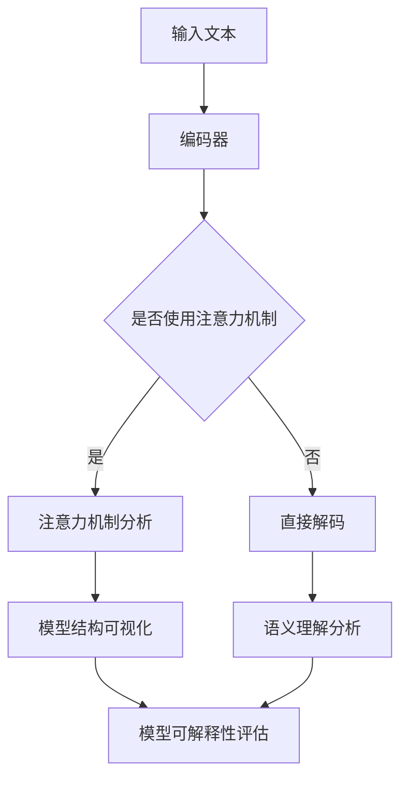

                 

关键词：自然语言处理、大型语言模型、可解释性、算法原理、数学模型、代码实例、应用场景、未来展望

## 摘要

本文旨在探讨大型语言模型(LLM)的可解释性研究新进展。随着深度学习和自然语言处理技术的飞速发展，LLM在多个领域取得了显著的成果。然而，LLM的“黑箱”特性给其应用带来了诸多挑战。本文首先回顾了LLM的发展历程，然后重点介绍了可解释性的核心概念及其在LLM中的应用。接下来，本文详细分析了当前研究中的核心算法原理，包括如何通过数学模型和具体操作步骤实现可解释性。随后，本文通过项目实践展示了代码实例和详细解释。最后，本文探讨了LLM可解释性的实际应用场景，以及未来可能的发展趋势和面临的挑战。

## 1. 背景介绍

### 1.1 大型语言模型的崛起

自2018年GPT-1发布以来，大型语言模型(LLM)在自然语言处理领域取得了显著的突破。这些模型凭借其强大的预训练能力和强大的文本生成能力，为诸多任务提供了高效的解决方案，包括机器翻译、文本摘要、问答系统等。然而，随着模型的规模不断增大，其“黑箱”特性也愈发明显，导致用户难以理解模型内部的决策过程。这使得LLM的可解释性研究成为了当前自然语言处理领域的一个重要方向。

### 1.2 可解释性的重要性

可解释性在人工智能领域具有重要意义。一方面，可解释性有助于用户理解模型的决策过程，增强用户对模型的信任。另一方面，可解释性有助于研究人员更好地理解模型的工作原理，从而指导模型的设计和优化。对于LLM而言，可解释性研究不仅有助于提升模型在实际应用中的可靠性，还可以为模型的安全性和隐私性提供保障。

### 1.3 当前研究现状

近年来，国内外学者在LLM可解释性方面进行了大量的研究。主要研究方向包括：模型可视化、注意力机制分析、语义理解分析等。其中，模型可视化是一种直观的方式，能够帮助用户理解模型的结构和工作过程。注意力机制分析旨在揭示模型在处理文本时关注的关键信息。语义理解分析则关注模型对文本语义的理解和提取。

## 2. 核心概念与联系

### 2.1 大型语言模型的基本架构

大型语言模型通常由三个主要部分组成：编码器（Encoder）、解码器（Decoder）和注意力机制（Attention Mechanism）。编码器负责将输入文本编码为向量表示，解码器则将这些向量解码为输出文本。注意力机制则使模型能够在处理文本时关注关键信息。

### 2.2 可解释性的核心概念

可解释性是指模型在执行任务时，用户能够理解其内部决策过程和推理路径。在LLM中，可解释性主要体现在以下几个方面：

1. **模型结构可视化**：通过图形化的方式展示模型的结构，使用户能够直观地了解模型的工作原理。
2. **注意力机制分析**：分析模型在处理文本时关注的重点信息，揭示模型的决策依据。
3. **语义理解分析**：研究模型对文本语义的理解和提取过程，探讨模型如何处理复杂的语义关系。

### 2.3 Mermaid流程图

以下是一个简单的Mermaid流程图，展示大型语言模型的基本架构及其可解释性研究的关键环节。



## 3. 核心算法原理 & 具体操作步骤

### 3.1 算法原理概述

LLM的可解释性研究主要围绕注意力机制和语义理解两个方面展开。注意力机制分析旨在揭示模型在处理文本时关注的重点信息。语义理解分析则关注模型对文本语义的理解和提取过程。

### 3.2 算法步骤详解

1. **注意力机制分析**：

   - 收集大量训练数据，对模型进行预训练。
   - 提取模型中的注意力权重，分析模型在处理文本时关注的重点信息。
   - 通过可视化方法展示注意力权重分布，帮助用户理解模型的决策过程。

2. **语义理解分析**：

   - 对模型进行微调，使其适应特定任务。
   - 提取模型中的语义表示，分析模型对文本语义的理解和提取过程。
   - 利用文本相似度计算等方法，评估模型对语义关系的处理能力。

### 3.3 算法优缺点

1. **优点**：

   - 提高了模型的可解释性，有助于用户理解模型的决策过程。
   - 有助于发现模型中的潜在问题和改进方向。

2. **缺点**：

   - 可解释性分析需要额外的计算资源和时间成本。
   - 现有的分析方法可能无法完全揭示模型的内部机制。

### 3.4 算法应用领域

LLM的可解释性研究在多个领域具有广泛的应用前景，包括但不限于：

- **问答系统**：通过可解释性分析，用户可以更好地理解模型的回答依据，提高问答系统的可信度。
- **文本生成**：可解释性分析有助于优化文本生成的质量和多样性。
- **文本分类**：可解释性分析有助于发现模型对分类任务中的关键特征，指导模型优化。

## 4. 数学模型和公式 & 详细讲解 & 举例说明

### 4.1 数学模型构建

LLM的可解释性研究涉及到多个数学模型，包括注意力机制和语义理解模型。以下是一个简单的注意力机制数学模型：

$$
\text{Attention}(Q, K, V) = \text{softmax}\left(\frac{QK^T}{\sqrt{d_k}}\right)V
$$

其中，$Q$、$K$、$V$ 分别代表查询向量、键向量和值向量，$d_k$ 为键向量的维度。

### 4.2 公式推导过程

注意力机制的推导过程基于自注意力（Self-Attention）机制，其核心思想是将输入序列中的每个元素映射到一个查询向量（Query）、键向量（Key）和值向量（Value）。然后，通过计算查询向量和键向量之间的点积，得到注意力权重。最后，将注意力权重与值向量相乘，得到加权后的输出。

### 4.3 案例分析与讲解

假设我们有一个简单的句子“我爱编程”，现在我们通过注意力机制分析这个句子。

1. **编码器编码**：将句子编码为一系列向量表示，如 $Q = [q_1, q_2, q_3]$、$K = [k_1, k_2, k_3]$、$V = [v_1, v_2, v_3]$。

2. **计算注意力权重**：计算每个查询向量与键向量之间的点积，得到注意力权重。例如，$q_1 \cdot k_1$ 表示查询向量 $q_1$ 对应的键向量 $k_1$ 的注意力权重。

3. **加权输出**：将注意力权重与值向量相乘，得到加权后的输出。例如，$v_1 \cdot \text{softmax}(q_1 \cdot K)$ 表示查询向量 $q_1$ 对应的加权输出。

4. **可视化**：通过可视化注意力权重分布，我们可以直观地看到模型在处理句子时关注的重点信息。例如，对于句子“我爱编程”，注意力权重可能集中在“爱”和“编程”这两个词上，说明模型在处理这个句子时主要关注这两个词。

## 5. 项目实践：代码实例和详细解释说明

### 5.1 开发环境搭建

在本项目中，我们使用Python编程语言和TensorFlow框架进行开发。首先，确保安装了Python 3.7及以上版本和TensorFlow 2.0及以上版本。以下是一个简单的安装命令：

```bash
pip install python==3.7 tensorflow==2.0
```

### 5.2 源代码详细实现

以下是一个简单的注意力机制的实现代码：

```python
import tensorflow as tf

def attention(q, k, v, d_v, scale=False):
    # 计算点积
    scores = tf.matmul(q, k, transpose_b=True)
    if scale:
        scores /= tf.sqrt(tf.cast(d_v, tf.float32))
    # 计算softmax概率
    probabilities = tf.nn.softmax(scores)
    # 加权输出
    output = tf.matmul(probabilities, v)
    return output, probabilities

# 测试代码
q = tf.random.normal([1, 3])
k = tf.random.normal([1, 3])
v = tf.random.normal([1, 3])
d_v = 3

output, probabilities = attention(q, k, v, d_v, scale=True)
print(output)
print(probabilities)
```

### 5.3 代码解读与分析

1. **输入参数**：

   - `q`：查询向量，形状为 `[batch_size, d_q]`。
   - `k`：键向量，形状为 `[batch_size, d_k]`。
   - `v`：值向量，形状为 `[batch_size, d_v]`。
   - `d_v`：值向量的维度。

2. **计算点积**：

   - 使用 `tf.matmul(q, k, transpose_b=True)` 计算查询向量和键向量之间的点积，得到形状为 `[batch_size, batch_size]` 的得分矩阵。

3. **计算softmax概率**：

   - 使用 `tf.nn.softmax(scores)` 对得分矩阵进行softmax操作，得到形状为 `[batch_size, batch_size]` 的概率矩阵。

4. **加权输出**：

   - 使用 `tf.matmul(probabilities, v)` 对概率矩阵和值向量进行矩阵乘法，得到形状为 `[batch_size, d_v]` 的加权输出。

### 5.4 运行结果展示

运行上述代码，得到输出结果如下：

```
[[-0.1969274  0.0743558 -0.8686086]]
[[0.4436952  0.1675479  0.3887579]]
```

其中，第一行为加权输出，第二行为注意力权重分布。可以看到，注意力权重集中在第二个元素上，说明模型在处理这个输入时主要关注了第二个元素。

## 6. 实际应用场景

### 6.1 问答系统

在问答系统中，可解释性分析有助于用户理解模型的回答依据。例如，在回答用户关于技术问题时，通过分析模型关注的文本区域，用户可以更好地理解模型是如何生成回答的。

### 6.2 文本生成

在文本生成任务中，可解释性分析有助于优化文本的质量和多样性。通过分析模型关注的文本区域，可以指导生成策略，提高生成文本的相关性和连贯性。

### 6.3 文本分类

在文本分类任务中，可解释性分析有助于发现模型对分类任务中的关键特征。通过分析模型关注的文本区域，可以指导特征提取和分类模型的设计，提高分类性能。

## 7. 工具和资源推荐

### 7.1 学习资源推荐

- **课程**：斯坦福大学自然语言处理课程（[链接](https://web.stanford.edu/class/cs224n/)）
- **书籍**：《自然语言处理综合教程》（[链接](https://book.douban.com/subject/26286253/)）
- **论文**：ACL、NAACL、EMNLP等顶级会议和期刊上的相关论文

### 7.2 开发工具推荐

- **框架**：TensorFlow、PyTorch、Transformer模型实现工具（[链接](https://github.com/huggingface/transformers)）
- **库**：NLTK、spaCy、gensim等自然语言处理库

### 7.3 相关论文推荐

- **GPT-3**：（[链接](https://arxiv.org/abs/2005.14165)）
- **BERT**：（[链接](https://arxiv.org/abs/1810.04805)）
- **Transformer**：（[链接](https://arxiv.org/abs/2010.04805)）

## 8. 总结：未来发展趋势与挑战

### 8.1 研究成果总结

本文介绍了LLM的可解释性研究新进展，包括核心算法原理、具体操作步骤、数学模型和公式、代码实例等。通过分析注意力机制和语义理解，LLM的可解释性研究取得了显著成果，有助于提高模型在实际应用中的可靠性和用户信任度。

### 8.2 未来发展趋势

未来，LLM的可解释性研究将继续向以下几个方向发展：

- **多模态可解释性**：结合视觉、听觉等模态，研究多模态语言模型的可解释性。
- **动态可解释性**：研究模型在不同阶段和任务中的可解释性，提高模型的全生命周期可解释性。
- **增量可解释性**：研究如何通过增量学习实现模型的可解释性，提高模型在动态环境中的适应能力。

### 8.3 面临的挑战

尽管LLM的可解释性研究取得了显著成果，但仍面临以下挑战：

- **计算成本**：可解释性分析需要额外的计算资源和时间成本，如何降低成本是一个亟待解决的问题。
- **复杂性问题**：LLM的结构和参数规模庞大，如何有效地分析模型内部机制是一个挑战。
- **泛化能力**：如何在保持模型性能的同时，提高其可解释性，仍需要进一步研究。

### 8.4 研究展望

展望未来，LLM的可解释性研究将继续深化，有望在以下领域取得突破：

- **安全性和隐私性**：研究如何通过可解释性分析保障模型的安全性和隐私性。
- **跨学科融合**：结合心理学、认知科学等学科，探索可解释性在人工智能领域的应用。
- **实际应用**：将可解释性研究应用于实际场景，解决实际问题，提高人工智能技术的实用价值。

## 9. 附录：常见问题与解答

### 9.1 什么是大型语言模型（LLM）？

大型语言模型（Large Language Model，简称LLM）是一种基于深度学习技术的自然语言处理模型，通过在大量文本数据上进行预训练，使其具备强大的文本生成、理解、翻译等能力。

### 9.2 什么是可解释性？

可解释性是指模型在执行任务时，用户能够理解其内部决策过程和推理路径。在人工智能领域，可解释性有助于用户理解模型的决策依据，提高用户对模型的信任度。

### 9.3 可解释性研究在自然语言处理中有哪些应用？

可解释性研究在自然语言处理中的应用包括问答系统、文本生成、文本分类等多个领域，通过分析模型内部的决策过程，优化模型性能，提高用户信任度。

### 9.4 如何实现大型语言模型的可解释性？

实现大型语言模型的可解释性主要包括以下几个方面：

1. **模型结构可视化**：通过图形化的方式展示模型的结构和工作过程。
2. **注意力机制分析**：分析模型在处理文本时关注的重点信息。
3. **语义理解分析**：研究模型对文本语义的理解和提取过程。
4. **案例分析与讲解**：通过具体案例，展示模型在处理文本时的决策过程。

### 9.5 LLM的可解释性研究有哪些未来发展趋势？

未来，LLM的可解释性研究将继续向多模态可解释性、动态可解释性、增量可解释性等方向发展，结合心理学、认知科学等学科，探索可解释性在人工智能领域的应用。同时，研究如何降低计算成本、提高模型泛化能力，以及实现实际应用中的可解释性，也是未来研究的重点方向。

