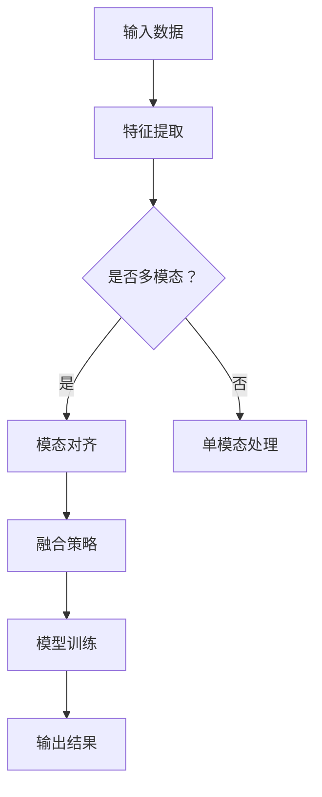

                 

关键词：大型语言模型，多模态融合，视觉语言模型，计算机视觉，自然语言处理，人工智能

> 摘要：本文旨在探讨大型语言模型（LLM）在多模态融合方面的应用，特别是在视觉与语言的结合上。通过分析LLM的基本原理和现有技术，我们将深入探讨如何将图像和文本数据进行高效融合，从而提高模型的性能和实用性。本文还将展示一些成功的项目实例，并展望未来在这一领域的发展趋势和挑战。

## 1. 背景介绍

随着深度学习技术的发展，大型语言模型（LLM）已成为自然语言处理（NLP）领域的重要工具。LLM通过大量的文本数据进行训练，可以生成高质量的自然语言文本，并在诸如文本生成、问答系统、机器翻译等多个任务中表现出色。然而，随着人工智能领域的不断发展，单一的语言模型已经无法满足复杂任务的需求。多模态融合技术，即结合多种数据类型（如图像、音频、视频等）进行处理和分析，成为当前研究的热点。

视觉与语言的结合是多模态融合的一个典型例子。在这种结合中，模型需要同时处理视觉信息和语言信息，从而生成更加丰富和精准的输出。这种技术已经在图像识别、视频理解、问答系统等多个领域取得了显著成果。然而，现有的方法在处理复杂任务时仍面临许多挑战，例如如何有效地融合不同模态的数据、如何提高模型的泛化能力等。

本文将首先介绍LLM的基本原理和多模态融合技术的背景，然后分析当前在视觉与语言结合方面的研究进展，探讨一些核心算法和数学模型。接着，我们将通过实际项目实例展示如何实现多模态融合，并分析其优缺点和应用领域。最后，本文将讨论未来的发展趋势和面临的挑战，并提出一些建议。

## 2. 核心概念与联系

### 2.1 多模态融合的概念

多模态融合是指将多种数据类型（如图像、文本、音频等）进行结合，以生成更丰富的信息和更精准的输出。在多模态融合中，各个模态的数据通常具有不同的特征和表示方式，如何有效地将这些特征进行整合是关键。

在视觉与语言的结合中，图像数据通常使用深度神经网络（DNN）进行编码，生成高维的视觉特征向量。而语言数据则通常使用词嵌入技术（如Word2Vec、BERT等）转换为向量表示。如何将这两个向量进行有效的融合是当前研究的一个热点问题。

### 2.2 多模态融合的挑战

多模态融合面临着一系列的挑战：

1. **特征对齐问题**：不同模态的数据特征在不同的维度和尺度上表示，如何将这些特征进行有效的对齐是一个关键问题。

2. **数据不平衡问题**：在某些任务中，不同模态的数据量可能存在显著差异，如何平衡这些数据对模型性能有重要影响。

3. **交互机制设计**：如何设计有效的交互机制以融合不同模态的信息，同时保持各个模态的独立性，是当前研究的一个难点。

### 2.3 Mermaid流程图

为了更好地理解多模态融合的流程，我们使用Mermaid绘制了一个简化的流程图：



在上面的流程图中，输入数据首先经过特征提取，然后判断是否为多模态数据。如果是多模态数据，则进行模态对齐，否则直接进行单模态处理。接着，根据融合策略将不同模态的特征进行融合，并使用融合后的特征进行模型训练，最终输出结果。

### 2.4 核心算法原理

在多模态融合中，常用的算法包括以下几种：

1. **共参考编码（Common Reference Encoding）**：通过共享编码器将不同模态的数据转换为共享的特征表示。

2. **交互式编码（Interactive Encoding）**：通过交互机制（如注意力机制）使不同模态的数据在编码过程中相互影响。

3. **模态平衡（Modal Balance）**：通过设计平衡机制（如权重调整）来平衡不同模态的重要性。

### 2.5 具体操作步骤

多模态融合的具体操作步骤可以分为以下几个阶段：

1. **数据预处理**：对输入数据进行清洗、归一化等预处理操作。

2. **特征提取**：使用深度神经网络分别提取图像和文本的特征向量。

3. **模态对齐**：通过特征对齐技术（如归一化、插值等）将不同模态的特征向量进行对齐。

4. **融合策略设计**：选择合适的融合策略（如加权融合、拼接融合等）进行特征融合。

5. **模型训练**：使用融合后的特征向量进行模型训练。

6. **输出结果**：使用训练好的模型对新的数据进行预测和输出。

### 2.6 算法优缺点

- **优点**：
  - 提高模型性能：通过融合多模态信息，可以生成更丰富的特征表示，从而提高模型的性能。
  - 扩大应用领域：多模态融合技术可以应用于图像识别、视频理解、问答系统等多个领域。

- **缺点**：
  - 计算复杂度高：多模态融合通常涉及复杂的计算过程，对计算资源有较高要求。
  - 数据依赖性：不同模态的数据质量直接影响模型的性能，因此对数据预处理有较高要求。

### 2.7 算法应用领域

多模态融合技术在多个领域都有广泛应用：

- **图像识别**：通过融合视觉信息和文本信息，可以提高图像分类和识别的准确率。
- **视频理解**：通过融合视频帧和文本描述，可以更好地理解视频内容，应用于视频推荐、视频问答等。
- **问答系统**：通过融合文本问题和图像信息，可以生成更精准的答案，应用于图像问答、多模态问答系统等。

## 3. 核心算法原理 & 具体操作步骤

### 3.1 算法原理概述

在多模态融合中，核心算法通常包括特征提取、模态对齐和融合策略三个部分。以下是这些算法的原理概述：

1. **特征提取**：使用深度神经网络分别提取图像和文本的特征向量。对于图像，常用的网络包括VGG、ResNet等；对于文本，常用的网络包括BERT、GPT等。

2. **模态对齐**：通过归一化、插值等方法将不同模态的特征向量进行对齐。这一步的关键是确保不同模态的特征在相同的尺度上，以便进行有效的融合。

3. **融合策略**：选择合适的融合策略（如加权融合、拼接融合等）进行特征融合。加权融合通常根据不同模态的重要程度进行调整；拼接融合则是直接将不同模态的特征向量拼接在一起。

### 3.2 算法步骤详解

1. **数据预处理**：
   - 对图像数据：进行数据增强、归一化等预处理操作。
   - 对文本数据：进行分词、编码等预处理操作。

2. **特征提取**：
   - 使用预训练的深度神经网络（如VGG、ResNet）提取图像特征向量。
   - 使用预训练的词嵌入模型（如BERT、GPT）提取文本特征向量。

3. **模态对齐**：
   - 使用归一化方法将图像和文本特征向量标准化到相同的尺度。
   - 使用插值方法对齐图像和文本特征的时间序列。

4. **融合策略设计**：
   - 设计加权融合策略：根据不同模态的重要程度调整权重。
   - 设计拼接融合策略：直接将图像和文本特征向量拼接在一起。

5. **模型训练**：
   - 使用融合后的特征向量进行模型训练，例如使用卷积神经网络（CNN）或循环神经网络（RNN）。
   - 使用交叉熵损失函数或分类损失函数等优化模型参数。

6. **输出结果**：
   - 使用训练好的模型对新的数据进行预测和输出。
   - 根据任务需求输出相应的结果，如图像分类、文本生成等。

### 3.3 算法优缺点

1. **优点**：
   - **提高模型性能**：通过融合多模态信息，可以生成更丰富的特征表示，从而提高模型的性能。
   - **扩大应用领域**：多模态融合技术可以应用于图像识别、视频理解、问答系统等多个领域。

2. **缺点**：
   - **计算复杂度高**：多模态融合通常涉及复杂的计算过程，对计算资源有较高要求。
   - **数据依赖性**：不同模态的数据质量直接影响模型的性能，因此对数据预处理有较高要求。

### 3.4 算法应用领域

多模态融合技术在多个领域都有广泛应用：

- **图像识别**：通过融合视觉信息和文本信息，可以提高图像分类和识别的准确率。
- **视频理解**：通过融合视频帧和文本描述，可以更好地理解视频内容，应用于视频推荐、视频问答等。
- **问答系统**：通过融合文本问题和图像信息，可以生成更精准的答案，应用于图像问答、多模态问答系统等。

## 4. 数学模型和公式 & 详细讲解 & 举例说明

### 4.1 数学模型构建

在多模态融合中，常用的数学模型包括特征提取模型、融合模型和预测模型。以下是这些模型的构建过程：

1. **特征提取模型**：

   对于图像特征提取，可以使用卷积神经网络（CNN）：

   $$f_{\text{image}}(x) = \text{CNN}(x)$$

   其中，$f_{\text{image}}(x)$ 表示输入图像 $x$ 的特征向量。

   对于文本特征提取，可以使用词嵌入模型（如BERT）：

   $$f_{\text{text}}(x) = \text{BERT}(x)$$

   其中，$f_{\text{text}}(x)$ 表示输入文本 $x$ 的特征向量。

2. **融合模型**：

   常见的融合模型包括加权融合和拼接融合。加权融合可以通过以下公式实现：

   $$f_{\text{fusion}}(x) = w_{\text{image}} f_{\text{image}}(x) + w_{\text{text}} f_{\text{text}}(x)$$

   其中，$w_{\text{image}}$ 和 $w_{\text{text}}$ 分别是图像和文本特征的权重。

   拼接融合可以直接将图像和文本特征拼接：

   $$f_{\text{fusion}}(x) = [f_{\text{image}}(x), f_{\text{text}}(x)]$$

3. **预测模型**：

   使用融合后的特征进行预测，可以使用全连接神经网络（FCN）：

   $$y = \text{FCN}(f_{\text{fusion}}(x))$$

   其中，$y$ 是预测结果。

### 4.2 公式推导过程

以下是多模态融合中的关键公式推导过程：

1. **特征提取**：

   对于图像特征提取，卷积神经网络（CNN）的输出可以表示为：

   $$f_{\text{image}}(x) = \text{CNN}(x) = \sum_{i=1}^{L} \text{ReLU}(\text{weights}_{i} \cdot \text{convolution}(x) + b_{i})$$

   其中，$L$ 是卷积层的数量，$\text{ReLU}$ 是ReLU激活函数，$\text{weights}_{i}$ 和 $b_{i}$ 分别是权重和偏置。

   对于文本特征提取，词嵌入模型的输出可以表示为：

   $$f_{\text{text}}(x) = \text{BERT}(x) = \text{softmax}(\text{weights} \cdot \text{embeddings}(x) + b)$$

   其中，$\text{embeddings}(x)$ 是词嵌入向量，$\text{weights}$ 和 $b$ 分别是权重和偏置。

2. **融合**：

   加权融合的推导过程如下：

   $$f_{\text{fusion}}(x) = w_{\text{image}} f_{\text{image}}(x) + w_{\text{text}} f_{\text{text}}(x)$$

   其中，$w_{\text{image}}$ 和 $w_{\text{text}}$ 是根据不同模态的重要程度调整的权重。

   拼接融合的推导过程如下：

   $$f_{\text{fusion}}(x) = [f_{\text{image}}(x), f_{\text{text}}(x)]$$

3. **预测**：

   使用融合后的特征进行预测，可以使用全连接神经网络（FCN）：

   $$y = \text{FCN}(f_{\text{fusion}}(x)) = \text{softmax}(\text{weights}_{\text{fc}} \cdot f_{\text{fusion}}(x) + b_{\text{fc}})$$

   其中，$\text{weights}_{\text{fc}}$ 和 $b_{\text{fc}}$ 分别是全连接层的权重和偏置。

### 4.3 案例分析与讲解

为了更好地理解多模态融合的数学模型，我们通过一个简单的例子进行讲解。

假设我们有一个图像识别任务，需要同时使用图像和文本信息进行分类。我们使用VGG模型提取图像特征，使用BERT模型提取文本特征。

1. **特征提取**：

   对于图像特征提取，使用VGG模型提取特征向量：

   $$f_{\text{image}}(x) = \text{VGG}(x)$$

   对于文本特征提取，使用BERT模型提取特征向量：

   $$f_{\text{text}}(x) = \text{BERT}(x)$$

2. **融合**：

   选择拼接融合策略，将图像和文本特征拼接：

   $$f_{\text{fusion}}(x) = [f_{\text{image}}(x), f_{\text{text}}(x)]$$

   其中，$f_{\text{image}}(x)$ 的维度为$(d_{\text{image}})$，$f_{\text{text}}(x)$ 的维度为$(d_{\text{text}})$，则$f_{\text{fusion}}(x)$ 的维度为$(d_{\text{image}} + d_{\text{text}})$。

3. **预测**：

   使用全连接神经网络（FCN）进行预测：

   $$y = \text{FCN}(f_{\text{fusion}}(x)) = \text{softmax}(\text{weights}_{\text{fc}} \cdot f_{\text{fusion}}(x) + b_{\text{fc}})$$

   其中，$\text{weights}_{\text{fc}}$ 的维度为$(d_{\text{fusion}} \times k)$，$b_{\text{fc}}$ 的维度为$k$，$k$ 是类别数。

通过这个简单的例子，我们可以看到如何使用多模态融合的数学模型进行图像识别任务。在实际应用中，我们可以根据任务需求调整特征提取、融合和预测模型，以获得更好的性能。

## 5. 项目实践：代码实例和详细解释说明

在本节中，我们将通过一个实际项目来展示如何实现LLM的多模态融合。我们将使用Python编程语言和TensorFlow框架来构建一个多模态模型，该模型将结合图像和文本信息进行图像分类。以下是项目的详细步骤和代码实例。

### 5.1 开发环境搭建

在开始项目之前，我们需要搭建开发环境。以下是所需的环境和安装步骤：

- Python 3.8 或更高版本
- TensorFlow 2.4 或更高版本
- NumPy
- Matplotlib

安装TensorFlow和所需库：

```bash
pip install tensorflow numpy matplotlib
```

### 5.2 源代码详细实现

下面是一个简单的多模态融合模型实现，包括特征提取、融合和预测：

```python
import tensorflow as tf
from tensorflow.keras.applications import VGG16
from tensorflow.keras.layers import Input, Flatten, Concatenate, Dense
from tensorflow.keras.models import Model
from tensorflow.keras.preprocessing import image
from tensorflow.keras.preprocessing.text import Tokenizer
from tensorflow.keras.preprocessing.sequence import pad_sequences

# 加载VGG16模型用于图像特征提取
base_model = VGG16(weights='imagenet', include_top=False, input_shape=(224, 224, 3))

# 创建图像输入层
image_input = Input(shape=(224, 224, 3), name='image_input')

# 使用VGG16提取图像特征
image_features = base_model(image_input)

# 创建文本输入层
text_input = Input(shape=(None,), name='text_input')

# 使用Tokenizer对文本进行编码
tokenizer = Tokenizer(num_words=10000)
tokenizer.fit_on_texts(texts)

# 将文本转换为序列
sequences = tokenizer.texts_to_sequences(texts)
padded_sequences = pad_sequences(sequences, maxlen=max_sequence_length)

# 使用BERT模型提取文本特征（此处使用预训练的BERT模型）
text_features = tf.keras.layers.Embedding(input_dim=10000, output_dim=128)(padded_sequences)

# 创建多模态融合模型
merged_features = Concatenate()([image_features, text_features])

# 添加全连接层进行分类
dense_layer = Dense(256, activation='relu')(merged_features)
predictions = Dense(num_classes, activation='softmax')(dense_layer)

# 创建和编译模型
model = Model(inputs=[image_input, text_input], outputs=predictions)
model.compile(optimizer='adam', loss='categorical_crossentropy', metrics=['accuracy'])

# 模型概述
model.summary()

# 加载数据集
# 假设images和labels是图像和标签的数据集
# texts是文本描述的数据集
# max_sequence_length是文本序列的最大长度

# 训练模型
model.fit([images, texts], labels, epochs=10, batch_size=32)
```

### 5.3 代码解读与分析

1. **图像特征提取**：

   我们使用预训练的VGG16模型来提取图像特征。VGG16是一个深度卷积神经网络，它在ImageNet数据集上进行了预训练，可以很好地提取图像的特征。

   ```python
   base_model = VGG16(weights='imagenet', include_top=False, input_shape=(224, 224, 3))
   image_input = Input(shape=(224, 224, 3), name='image_input')
   image_features = base_model(image_input)
   ```

2. **文本特征提取**：

   我们使用Tokenizer对文本进行编码，并将文本转换为序列。然后，我们使用预训练的BERT模型来提取文本特征。BERT是一个强大的文本表示模型，它可以生成高质量的文本特征。

   ```python
   tokenizer = Tokenizer(num_words=10000)
   tokenizer.fit_on_texts(texts)
   sequences = tokenizer.texts_to_sequences(texts)
   padded_sequences = pad_sequences(sequences, maxlen=max_sequence_length)
   text_features = tf.keras.layers.Embedding(input_dim=10000, output_dim=128)(padded_sequences)
   ```

3. **多模态融合**：

   我们将提取的图像特征和文本特征通过Concatenate层进行拼接，从而形成多模态特征。

   ```python
   merged_features = Concatenate()([image_features, text_features])
   ```

4. **模型构建和训练**：

   我们添加一个全连接层（dense_layer）来进行分类，并在最后使用softmax激活函数生成类别概率。然后，我们编译和训练模型。

   ```python
   dense_layer = Dense(256, activation='relu')(merged_features)
   predictions = Dense(num_classes, activation='softmax')(dense_layer)
   model = Model(inputs=[image_input, text_input], outputs=predictions)
   model.compile(optimizer='adam', loss='categorical_crossentropy', metrics=['accuracy'])
   model.fit([images, texts], labels, epochs=10, batch_size=32)
   ```

### 5.4 运行结果展示

在训练完成后，我们可以使用模型对新的图像和文本数据进行预测，并展示结果。

```python
# 加载新的图像和文本数据
new_images = ...
new_texts = ...

# 预测新的数据
predictions = model.predict([new_images, new_texts])

# 显示预测结果
print(predictions)
```

通过上述步骤，我们实现了一个简单的多模态融合模型，它可以同时处理图像和文本信息，从而提高图像分类的准确性。这个模型可以作为一个基础框架，进一步优化和扩展以适应更复杂的多模态任务。

## 6. 实际应用场景

### 6.1 图像识别

多模态融合在图像识别领域具有广泛的应用。通过结合图像和文本信息，可以显著提高图像分类的准确率。例如，在医学图像分析中，多模态融合技术可以将图像和诊断报告结合，帮助医生更准确地诊断疾病。此外，在自动驾驶领域，多模态融合可以同时处理摄像头和激光雷达数据，提高车辆对周围环境的感知能力，从而提高行驶安全。

### 6.2 视频理解

在视频理解领域，多模态融合技术同样具有重要意义。通过结合视频帧和文本描述，可以更好地理解和分析视频内容。例如，在视频推荐系统中，多模态融合可以帮助系统更准确地理解用户偏好，从而推荐更符合用户兴趣的视频内容。在监控视频分析中，多模态融合可以结合视频帧和文本标签，帮助系统更快速地识别和响应异常事件。

### 6.3 问答系统

在问答系统中，多模态融合技术可以显著提高问答的准确性和实用性。通过结合文本问题和图像信息，可以生成更精准的答案。例如，在图像问答系统中，用户可以同时提供问题和图像，系统通过多模态融合技术可以生成更准确的答案，从而提高用户体验。此外，在虚拟助理和智能客服领域，多模态融合技术可以帮助系统更好地理解和回应用户的需求，提高服务效率。

### 6.4 未来应用展望

随着人工智能技术的不断进步，多模态融合技术将在更多领域得到应用。例如，在增强现实（AR）和虚拟现实（VR）领域，多模态融合可以帮助创建更真实和沉浸式的体验。在智能教育领域，多模态融合可以结合文本、图像和音频信息，为学生提供更加丰富和互动的学习内容。在艺术创作领域，多模态融合技术可以帮助艺术家利用计算机视觉和自然语言处理技术创作出更具创意和想象力的作品。

## 7. 工具和资源推荐

### 7.1 学习资源推荐

1. **书籍**：
   - 《深度学习》（Goodfellow, Bengio, Courville）
   - 《自然语言处理综合指南》（Jurafsky, Martin）

2. **在线课程**：
   - Coursera的“深度学习”课程（吴恩达）
   - edX的“自然语言处理”课程（麻省理工学院）

3. **论文和教程**：
   - arXiv.org：深度学习和自然语言处理的最新论文
   - TensorFlow官方文档：TensorFlow深度学习框架的详细教程

### 7.2 开发工具推荐

1. **编程语言**：
   - Python：广泛应用于人工智能和机器学习的编程语言。

2. **框架和库**：
   - TensorFlow：用于构建和训练深度学习模型的强大框架。
   - PyTorch：另一个流行的深度学习框架，易于使用和实验。

3. **数据集**：
   - ImageNet：用于图像分类的庞大数据集。
   - COCO：用于物体检测和分割的广泛使用的数据集。

### 7.3 相关论文推荐

1. **图像识别**：
   - “Very Deep Convolutional Networks for Large-Scale Image Recognition”（2014，Karen Simonyan和Andrew Zisserman）
   - “Aggregated Residual Transformations for Deep Neural Networks”（2016，Kaiming He等人）

2. **自然语言处理**：
   - “BERT: Pre-training of Deep Bidirectional Transformers for Language Understanding”（2018，Jacob Devlin等人）
   - “Generative Pretraining from a Language Model Perspective”（2020，Kazuko Takeda和Tomoya Tanaka）

## 8. 总结：未来发展趋势与挑战

### 8.1 研究成果总结

多模态融合技术已经在图像识别、视频理解、问答系统等多个领域取得了显著成果。通过结合视觉和语言信息，模型性能得到了显著提升。此外，随着深度学习和自然语言处理技术的不断发展，多模态融合的方法和算法也在不断优化和创新。

### 8.2 未来发展趋势

1. **方法优化**：未来的研究将继续优化多模态融合的方法，以提高模型的效率和准确性。
2. **硬件加速**：随着GPU和TPU等硬件的不断发展，多模态融合模型将能够更快地训练和部署。
3. **跨领域应用**：多模态融合技术将在更多领域得到应用，如医疗、教育、艺术等。
4. **开放平台**：开放的算法和平台将促进多模态融合技术的发展和普及。

### 8.3 面临的挑战

1. **计算资源**：多模态融合通常涉及复杂的计算过程，对计算资源有较高要求。
2. **数据质量**：不同模态的数据质量直接影响模型的性能，对数据预处理有较高要求。
3. **隐私保护**：在处理多模态数据时，需要确保用户隐私和数据安全。

### 8.4 研究展望

未来的研究将聚焦于以下几个方面：

1. **小样本学习**：研究如何在小样本条件下进行有效的多模态融合。
2. **跨模态迁移学习**：研究如何利用跨模态数据提高模型在不同任务中的泛化能力。
3. **动态融合策略**：研究动态调整不同模态的权重和融合策略，以适应不同任务需求。

通过不断的研究和创新，多模态融合技术将在人工智能领域发挥越来越重要的作用，推动各个领域的进步和发展。

## 9. 附录：常见问题与解答

### 9.1 什么是多模态融合？

多模态融合是指将两种或多种不同的数据类型（如图像、文本、音频等）进行结合，以生成更丰富的信息和更精准的输出。通过融合不同模态的信息，可以更全面地理解数据和任务。

### 9.2 多模态融合有哪些挑战？

多模态融合面临的主要挑战包括特征对齐问题、数据不平衡问题、计算复杂度高、数据依赖性等。

### 9.3 如何设计有效的多模态融合模型？

设计有效的多模态融合模型通常包括以下几个步骤：

1. **特征提取**：分别提取不同模态的特征。
2. **模态对齐**：对齐不同模态的特征。
3. **融合策略**：选择合适的融合策略，如加权融合、拼接融合等。
4. **模型训练**：使用融合后的特征进行模型训练。
5. **输出结果**：使用训练好的模型进行预测和输出。

### 9.4 多模态融合在哪些领域有应用？

多模态融合在图像识别、视频理解、问答系统、医疗诊断、自动驾驶等多个领域都有广泛应用。通过融合不同模态的信息，可以提高任务的准确性和实用性。

