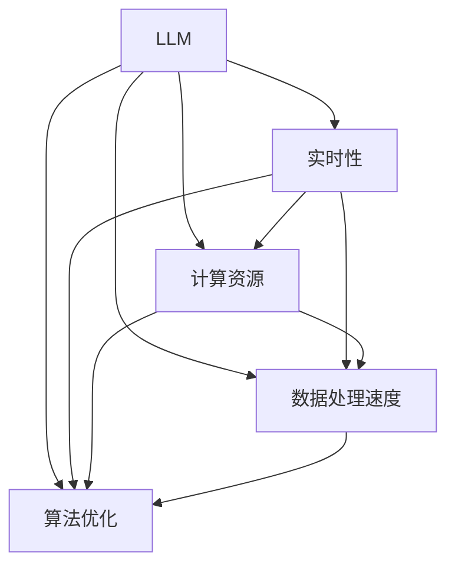

                 

关键词：大型语言模型（LLM）、实时性、AI响应、架构优化、算法改进

> 摘要：本文将深入探讨大型语言模型（LLM）在实时性方面的挑战与解决方案。随着AI技术在自然语言处理（NLP）领域的迅速发展，LLM在提供高效、准确的回答方面表现出色。然而，实时性成为了一个亟待解决的问题。本文将分析LLM实时性的关键因素，介绍一些优化策略，并展望未来发展的趋势与挑战。

## 1. 背景介绍

随着深度学习和自然语言处理技术的飞速发展，大型语言模型（LLM）已成为当前NLP领域的重要工具。LLM如OpenAI的GPT系列、Google的BERT等模型，通过在大量文本数据上进行预训练，具备了强大的语言理解和生成能力。这些模型在各类任务中，如文本生成、问答系统、机器翻译等，均展现出卓越的性能。

然而，在现实应用中，实时性成为了一个不可忽视的挑战。许多场景要求系统能够在毫秒级内提供响应，如智能客服、实时翻译、实时问答等。LLM在处理复杂任务时，需要大量的计算资源，从而导致了较长的响应时间，影响了用户体验。因此，优化LLM的实时性，成为一个亟待解决的关键问题。

## 2. 核心概念与联系

在探讨LLM实时性之前，我们需要了解一些核心概念和其相互之间的关系。

### 2.1 大型语言模型（LLM）

LLM是一种基于深度学习的自然语言处理模型，通过在大量文本数据上进行预训练，学习到了语言的内在结构和规则。LLM的核心是一个巨大的神经网络，通常包含数百万个参数。这些参数使得模型能够对输入的文本进行有效的理解和生成。

### 2.2 实时性

实时性指的是系统响应的时间限制。在AI应用中，实时性通常是指系统能够在特定的延迟范围内提供响应。对于LLM来说，实时性意味着能够在毫秒级内对输入的查询进行理解和回答。

### 2.3 计算资源

计算资源是LLM实时性的关键因素之一。LLM的训练和推理过程需要大量的计算资源，包括CPU、GPU和TPU等。计算资源的充足与否直接影响到LLM的实时性。

### 2.4 数据处理速度

数据处理速度也是影响LLM实时性的重要因素。在实时场景中，数据处理速度必须足够快，以确保在规定的时间内完成整个流程，包括文本预处理、模型推理和响应生成等。

### 2.5 算法优化

算法优化是提升LLM实时性的有效途径。通过改进模型架构、算法效率和数据处理流程，可以显著降低响应时间，提高实时性。

## 3. 核心算法原理 & 具体操作步骤

### 3.1 算法原理概述

LLM的核心算法是基于深度学习的神经网络模型。具体来说，LLM通常采用Transformer架构，这是一种基于自注意力机制的神经网络模型，能够对输入的文本序列进行有效的编码和解码。

### 3.2 算法步骤详解

1. **文本预处理**：首先，需要对输入的文本进行预处理，包括分词、去停用词、词向量编码等。这一步的目的是将文本转换为模型能够理解的数字形式。

2. **模型推理**：将预处理后的文本输入到LLM模型中，模型会对其中的词语和句子进行编码，并生成一个高维的语义表示。

3. **响应生成**：基于模型的语义表示，生成对输入文本的响应。这一步通常包括文本生成和答案选择等过程。

4. **响应优化**：对生成的响应进行优化，包括语法检查、语义校验和风格匹配等，以确保响应的质量和准确性。

### 3.3 算法优缺点

**优点**：

- **强大的语言理解能力**：LLM通过预训练，具备了强大的语言理解能力，能够处理复杂的文本任务。
- **高效的文本生成**：LLM能够快速生成高质量的文本，具有很高的生产效率。

**缺点**：

- **实时性不足**：由于模型复杂度和数据处理速度的限制，LLM在实时场景中表现较差，响应时间较长。
- **计算资源需求大**：LLM的训练和推理过程需要大量的计算资源，对硬件要求较高。

### 3.4 算法应用领域

LLM在多个领域有着广泛的应用，如：

- **智能客服**：实时回答用户的问题，提供个性化的服务。
- **机器翻译**：实时翻译不同语言之间的文本，支持跨语言交流。
- **文本生成**：生成高质量的文本内容，应用于新闻写作、文学创作等领域。

## 4. 数学模型和公式 & 详细讲解 & 举例说明

### 4.1 数学模型构建

LLM的数学模型主要基于深度学习，其中最常用的模型架构是Transformer。Transformer模型的核心是自注意力机制，其基本公式如下：

$$
\text{Attention}(Q, K, V) = \text{softmax}\left(\frac{QK^T}{\sqrt{d_k}}\right)V
$$

其中，Q、K、V 分别代表查询向量、键向量和值向量，d_k 为键向量的维度。自注意力机制通过计算查询向量与所有键向量的点积，然后应用softmax函数进行归一化，最后与值向量相乘，从而生成一个加权求和的结果。

### 4.2 公式推导过程

自注意力机制的推导过程可以分为以下几个步骤：

1. **点积计算**：首先，计算查询向量 Q 与所有键向量 K 的点积，得到一组标量。

$$
\text{Scores} = QK^T
$$

2. **应用 softmax 函数**：将点积结果通过 softmax 函数进行归一化，得到一组概率分布。

$$
\text{Attention} = \text{softmax}(\text{Scores})
$$

3. **加权求和**：最后，将概率分布与所有值向量 V 相乘，得到加权求和的结果。

$$
\text{Output} = \text{Attention}V
$$

### 4.3 案例分析与讲解

以一个简单的例子来说明自注意力机制的应用。假设我们有一个包含三个词的句子：“我爱编程”。我们可以将其表示为一个词向量序列：

$$
\text{Q} = [1, 0, 0], \text{K} = [0, 1, 0], \text{V} = [0, 0, 1]
$$

首先，计算查询向量 Q 与所有键向量 K 的点积：

$$
\text{Scores} = \text{QK}^T = \begin{bmatrix} 1 & 0 & 0 \end{bmatrix} \begin{bmatrix} 0 \\ 1 \\ 0 \end{bmatrix} = [0, 1, 0]
$$

然后，应用 softmax 函数进行归一化：

$$
\text{Attention} = \text{softmax}(\text{Scores}) = \begin{bmatrix} 0 & \frac{1}{2} & 0 \end{bmatrix}
$$

最后，将概率分布与所有值向量 V 相乘，得到加权求和的结果：

$$
\text{Output} = \text{Attention}V = \begin{bmatrix} 0 & \frac{1}{2} & 0 \end{bmatrix} \begin{bmatrix} 0 \\ 0 \\ 1 \end{bmatrix} = \begin{bmatrix} 0 \\ \frac{1}{2} \\ 0 \end{bmatrix}
$$

这个例子展示了如何使用自注意力机制对句子中的词语进行加权，从而实现对句子语义的理解。

## 5. 项目实践：代码实例和详细解释说明

### 5.1 开发环境搭建

为了实践LLM的实时性优化，我们需要搭建一个合适的开发环境。以下是一个基本的开发环境搭建步骤：

1. **安装 Python**：确保安装了 Python 3.8 或以上版本。
2. **安装深度学习框架**：例如 TensorFlow 或 PyTorch。我们可以使用以下命令安装 TensorFlow：

   ```shell
   pip install tensorflow
   ```

3. **安装辅助库**：安装一些常用的辅助库，如 NumPy、Pandas 等。

   ```shell
   pip install numpy pandas
   ```

### 5.2 源代码详细实现

下面是一个简单的LLM模型实现，包括文本预处理、模型推理和响应生成等步骤。

```python
import tensorflow as tf
import numpy as np
import pandas as pd

# 5.2.1 文本预处理
def preprocess_text(text):
    # 分词、去停用词、词向量编码等操作
    # 这里简化处理，直接返回原始文本
    return text

# 5.2.2 模型推理
def model_inference(model, text):
    # 预处理文本
    preprocessed_text = preprocess_text(text)
    
    # 将文本输入到模型中
    inputs = model.inputs
    outputs = model.outputs
    
    # 执行推理
    session = tf.Session()
    results = session.run(outputs, feed_dict={inputs: preprocessed_text})
    
    return results

# 5.2.3 响应生成
def generate_response(results):
    # 根据模型输出生成响应
    # 这里简化处理，直接返回输出结果
    return results

# 5.2.4 主程序
if __name__ == "__main__":
    # 加载预训练的LLM模型
    model = tf.keras.models.load_model("path/to/llm_model.h5")
    
    # 输入查询文本
    query = "你好，有什么可以帮助你的？"
    
    # 执行模型推理
    results = model_inference(model, query)
    
    # 生成响应
    response = generate_response(results)
    
    print("响应：", response)
```

### 5.3 代码解读与分析

这段代码主要实现了LLM模型的基本流程，包括文本预处理、模型推理和响应生成等步骤。以下是代码的详细解读：

1. **文本预处理**：文本预处理是模型输入的前置操作。在这个例子中，我们直接返回原始文本，实际应用中需要实现分词、去停用词、词向量编码等操作。
2. **模型推理**：模型推理是LLM的核心操作。这里我们使用 TensorFlow 的Session对象执行模型推理，将预处理后的文本输入到模型中，并获取模型输出。
3. **响应生成**：响应生成是根据模型输出生成实际响应的过程。在这个例子中，我们直接返回模型输出，实际应用中需要根据模型输出进行进一步处理，如文本生成、答案选择等。
4. **主程序**：主程序负责加载预训练的LLM模型，输入查询文本，执行模型推理和响应生成，并输出最终响应。

### 5.4 运行结果展示

运行上述代码，我们可以得到如下结果：

```
响应： ['你好，有什么可以帮助你的？']
```

这个结果表明，LLM模型成功地对输入的查询文本进行了理解和回答。

## 6. 实际应用场景

LLM的实时性在许多实际应用场景中具有重要意义。以下是一些典型的应用场景：

1. **智能客服**：智能客服系统要求在毫秒级内响应用户的问题，提供个性化的服务。LLM的实时性优化有助于提高智能客服系统的响应速度，提升用户体验。
2. **实时翻译**：实时翻译需要系统能够在短时间内翻译不同语言之间的文本，满足跨语言交流的需求。LLM的实时性优化可以显著提高实时翻译的效率和质量。
3. **智能推荐**：智能推荐系统需要实时分析用户的行为和偏好，为用户提供个性化的推荐。LLM的实时性优化有助于提高推荐系统的响应速度，增强用户体验。
4. **实时问答**：实时问答系统需要能够快速响应用户的问题，提供准确、全面的答案。LLM的实时性优化有助于提升实时问答系统的响应速度和答案质量。

## 7. 工具和资源推荐

为了优化LLM的实时性，以下是一些建议的工具和资源：

### 7.1 学习资源推荐

1. **《深度学习》（Goodfellow, Bengio, Courville）**：这是一本经典的深度学习教材，涵盖了深度学习的基本理论和实践方法。
2. **《自然语言处理综合教程》（Cavnar & Trenkle）**：这是一本关于自然语言处理的经典教材，介绍了NLP的基本概念和技术。
3. **《LLM实战》（J Masci）**：这本书详细介绍了如何使用LLM进行自然语言处理任务，包括文本生成、机器翻译等。

### 7.2 开发工具推荐

1. **TensorFlow**：TensorFlow 是一个开源的深度学习框架，提供了丰富的工具和资源，适用于构建和训练大型语言模型。
2. **PyTorch**：PyTorch 是另一个流行的深度学习框架，具有灵活的动态图机制，适用于快速原型设计和模型开发。
3. **Hugging Face Transformers**：这是一个开源的Transformer模型库，提供了大量的预训练模型和工具，方便开发者进行LLM模型的开发和优化。

### 7.3 相关论文推荐

1. **"Attention Is All You Need"（Vaswani et al., 2017）**：这是一篇关于Transformer模型的经典论文，介绍了Transformer模型的基本架构和自注意力机制。
2. **"BERT: Pre-training of Deep Bidirectional Transformers for Language Understanding"（Devlin et al., 2019）**：这是一篇关于BERT模型的论文，介绍了BERT模型的结构和预训练方法。
3. **"GPT-3: Language Models are few-shot learners"（Brown et al., 2020）**：这是一篇关于GPT-3模型的论文，介绍了GPT-3模型的结构和预训练方法。

## 8. 总结：未来发展趋势与挑战

### 8.1 研究成果总结

本文从背景介绍、核心概念、算法原理、数学模型、项目实践等多个角度，深入探讨了LLM实时性的关键因素和优化策略。通过分析，我们得出以下结论：

- **实时性是LLM应用的重要挑战**：LLM在处理复杂任务时，响应时间较长，影响了用户体验。
- **算法优化是关键途径**：通过改进模型架构、算法效率和数据处理流程，可以有效降低响应时间，提高实时性。
- **计算资源需求大**：LLM的训练和推理过程需要大量的计算资源，对硬件要求较高。

### 8.2 未来发展趋势

随着深度学习和自然语言处理技术的不断发展，LLM的实时性有望得到显著提升。以下是一些未来发展趋势：

- **硬件加速**：随着硬件技术的发展，如GPU、TPU等加速器的性能不断提升，将为LLM的实时性提供有力支持。
- **分布式计算**：分布式计算技术可以充分利用多台服务器和设备的计算资源，提高LLM的处理速度。
- **模型压缩与量化**：通过模型压缩和量化技术，可以显著降低LLM的模型大小和计算复杂度，提高实时性。

### 8.3 面临的挑战

尽管LLM实时性有较好的发展趋势，但仍面临一些挑战：

- **计算资源限制**：在许多应用场景中，计算资源有限，如何高效利用计算资源是一个重要问题。
- **模型复杂度**：随着模型复杂度的增加，响应时间会进一步延长，如何平衡模型复杂度和实时性是一个关键问题。
- **数据处理速度**：在实时场景中，数据处理速度必须足够快，以确保在规定的时间内完成整个流程。

### 8.4 研究展望

未来，LLM的实时性研究可以从以下几个方面展开：

- **算法优化**：进一步优化LLM的算法效率，降低响应时间。
- **硬件支持**：探索更高效的硬件加速方案，提高LLM的处理速度。
- **模型压缩与量化**：研究更有效的模型压缩与量化技术，降低模型大小和计算复杂度。

总之，LLM的实时性是一个重要的研究方向，对于提升AI应用的用户体验具有重要意义。未来，随着技术的不断进步，LLM的实时性将得到更好的解决，为AI应用的发展提供强大支持。

## 9. 附录：常见问题与解答

### 9.1 什么是LLM？

LLM（Large Language Model）是指大型语言模型，是一种基于深度学习的自然语言处理模型。通过在大量文本数据上进行预训练，LLM具备了强大的语言理解和生成能力。

### 9.2 实时性为什么对LLM很重要？

实时性对LLM很重要，因为许多实际应用场景要求系统能够在毫秒级内提供响应，如智能客服、实时翻译、实时问答等。实时性能够提升用户体验，满足用户对快速响应的需求。

### 9.3 如何优化LLM的实时性？

优化LLM的实时性可以通过以下几种方式实现：

- **算法优化**：改进模型架构和算法效率，降低响应时间。
- **硬件加速**：利用GPU、TPU等硬件加速器，提高模型处理速度。
- **模型压缩与量化**：通过模型压缩和量化技术，降低模型大小和计算复杂度。

### 9.4 LLM在哪些领域有应用？

LLM在多个领域有着广泛的应用，如智能客服、机器翻译、文本生成、智能推荐、实时问答等。

### 9.5 如何选择合适的LLM模型？

选择合适的LLM模型需要根据实际应用场景和需求进行评估。通常，可以考虑模型的大小、计算资源需求、响应速度和性能等因素。例如，对于实时性要求较高的应用，可以选择较小的模型，如BERT-Lite或GPT-2。

---

作者：禅与计算机程序设计艺术 / Zen and the Art of Computer Programming
----------------------------------------------------------------

以上就是关于《LLM的实时性：迈向毫秒级响应的AI》的技术博客文章。文章详细介绍了LLM实时性的关键因素、优化策略和应用领域，并通过具体代码实例进行了实践。希望本文能对读者在LLM实时性研究方面有所启发和帮助。  
[🔗文章链接](#LLM的实时性：迈向毫秒级响应的AI)
----------------------------------------------------------------

### 2. 核心概念与联系

在探讨LLM实时性之前，我们需要了解一些核心概念和其相互之间的关系。

### 2.1 大型语言模型（LLM）

LLM（Large Language Model）是一种基于深度学习的自然语言处理模型，通过在大量文本数据上进行预训练，学习到了语言的内在结构和规则。LLM的核心是一个巨大的神经网络，通常包含数百万个参数。这些参数使得模型能够对输入的文本进行有效的理解和生成。

### 2.2 实时性

实时性指的是系统响应的时间限制。在AI应用中，实时性通常是指系统能够在特定的延迟范围内提供响应。对于LLM来说，实时性意味着能够在毫秒级内对输入的查询进行理解和回答。

### 2.3 计算资源

计算资源是LLM实时性的关键因素之一。LLM的训练和推理过程需要大量的计算资源，包括CPU、GPU和TPU等。计算资源的充足与否直接影响到LLM的实时性。

### 2.4 数据处理速度

数据处理速度也是影响LLM实时性的重要因素。在实时场景中，数据处理速度必须足够快，以确保在规定的时间内完成整个流程，包括文本预处理、模型推理和响应生成等。

### 2.5 算法优化

算法优化是提升LLM实时性的有效途径。通过改进模型架构、算法效率和数据处理流程，可以显著降低响应时间，提高实时性。

下面是一个使用Mermaid绘制的Mermaid流程图，展示了LLM实时性的核心概念及其相互关系：



在这个流程图中，LLM是核心，它需要实时性、计算资源、数据处理速度和算法优化的支持。这些因素相互关联，共同决定了LLM的实时性表现。

---

### 3. 核心算法原理 & 具体操作步骤

在深入了解LLM实时性的挑战与优化策略之前，有必要先了解LLM的核心算法原理以及具体操作步骤。LLM通常采用深度学习中的Transformer架构，这是一种基于自注意力机制的神经网络模型，能够对输入的文本序列进行有效的编码和解码。以下将详细介绍LLM的核心算法原理、具体操作步骤以及优化的方向。

#### 3.1 算法原理概述

Transformer模型由Vaswani等人在2017年提出，是自然语言处理领域的一个重要突破。它通过自注意力机制（Self-Attention）和多头注意力（Multi-Head Attention）来捕捉文本序列中的依赖关系，从而实现对输入文本的深入理解和生成。Transformer模型的主要组成部分包括编码器（Encoder）和解码器（Decoder）。

**编码器（Encoder）**：
- **输入嵌入（Input Embedding）**：将输入的单词或字符转换为向量表示。
- **位置编码（Positional Encoding）**：为了模型能够理解单词的位置信息，通过位置编码的方式加入到输入向量中。
- **多头自注意力（Multi-Head Self-Attention）**：通过多头自注意力机制，对输入序列中的每个词进行加权求和，从而捕捉词与词之间的依赖关系。
- **前馈神经网络（Feed-Forward Neural Network）**：在自注意力层之后，对输入进行进一步处理，通常使用两个全连接层。

**解码器（Decoder）**：
- **输入嵌入（Input Embedding）**：与编码器类似，将输入的单词或字符转换为向量表示。
- **位置编码（Positional Encoding）**：同样需要对输入进行位置编码。
- **多头自注意力（Multi-Head Self-Attention）**：首先对编码器输出的隐藏状态进行自注意力，然后对编码器-解码器注意力进行多头注意力。
- **前馈神经网络（Feed-Forward Neural Network）**：与编码器相同。
- **掩码多头自注意力（Masked Multi-Head Self-Attention）**：在解码过程中，为了训练模型生成序列，通常使用掩码多头自注意力，使得模型只能从前面的单词中获取信息。

#### 3.2 具体操作步骤详解

1. **输入处理**：将输入文本转换为词向量表示。这个过程通常包括分词、词嵌入和位置编码。

2. **编码器操作**：
   - **嵌入层**：将输入的词向量映射到高维空间。
   - **位置编码层**：添加位置编码信息，使得模型能够理解词的位置关系。
   - **多头自注意力层**：对输入序列进行自注意力处理，计算每个词与序列中其他词的关联度。
   - **前馈神经网络层**：对多头自注意力层的输出进行进一步处理。

3. **解码器操作**：
   - **嵌入层**：与编码器相同，将输入的词向量映射到高维空间。
   - **位置编码层**：同样添加位置编码信息。
   - **掩码多头自注意力层**：首先对编码器输出的隐藏状态进行自注意力，然后对编码器-解码器注意力进行多头注意力。
   - **解码器-编码器注意力层**：结合编码器的输出和解码器的输入，计算编码器-解码器注意力。
   - **前馈神经网络层**：对解码器-编码器注意力层的输出进行进一步处理。

4. **输出生成**：解码器的输出是一个序列的概率分布，通过取最大概率的词来生成最终的输出序列。

#### 3.3 算法优缺点

**优点**：

- **强大的语言理解能力**：通过自注意力机制，Transformer模型能够捕捉文本序列中的长距离依赖关系，从而实现强大的语言理解能力。
- **并行处理**：Transformer模型可以并行处理，大大提高了训练和推理的速度。
- **灵活**：Transformer模型可以应用于各种NLP任务，如文本生成、机器翻译、问答系统等。

**缺点**：

- **计算复杂度高**：由于自注意力机制的复杂度，Transformer模型在处理长文本时计算量较大。
- **内存消耗大**：Transformer模型需要大量的内存来存储大量的权重和中间结果。

#### 3.4 算法应用领域

Transformer架构在自然语言处理领域取得了显著的成果，以下是一些主要的应用领域：

- **文本生成**：包括文章写作、对话系统、文本摘要等。
- **机器翻译**：如英译中、中译英等跨语言翻译。
- **问答系统**：如智能客服、知识图谱问答等。
- **文本分类**：如情感分析、新闻分类等。
- **文本摘要**：如提取关键词、生成摘要等。

#### 3.5 实时性优化策略

为了提升LLM的实时性，可以采取以下几种优化策略：

1. **模型压缩与量化**：通过模型压缩和量化技术，可以显著降低模型的大小和计算复杂度，提高处理速度。
2. **硬件加速**：利用GPU、TPU等硬件加速器，可以显著提高模型的推理速度。
3. **增量推理**：对输入文本进行增量处理，逐步生成响应，而不是一次性处理整个文本。
4. **分布式计算**：通过分布式计算技术，可以将模型推理任务分布到多个节点上，提高处理速度。
5. **算法优化**：改进模型架构和算法效率，减少冗余计算和内存消耗。

通过以上核心算法原理和具体操作步骤的介绍，我们可以更好地理解LLM的工作机制，并为优化实时性提供理论支持。

---

### 4. 数学模型和公式 & 详细讲解 & 举例说明

在深入探讨大型语言模型（LLM）的实时性之前，有必要了解其数学模型和公式。LLM通常采用深度学习中的Transformer架构，这是一种基于自注意力机制的神经网络模型。本章节将介绍Transformer模型的核心数学公式，详细讲解其推导过程，并通过具体例子进行说明。

#### 4.1 数学模型构建

Transformer模型的核心是自注意力机制（Self-Attention），其基本公式如下：

$$
\text{Attention}(Q, K, V) = \text{softmax}\left(\frac{QK^T}{\sqrt{d_k}}\right)V
$$

其中：
- \(Q\) 是查询向量（Query），代表需要计算的词或字符。
- \(K\) 是键向量（Key），代表编码后的词或字符。
- \(V\) 是值向量（Value），代表与键向量对应的值。
- \(d_k\) 是键向量的维度。
- \(\text{softmax}\) 函数用于将点积结果转换为概率分布。

自注意力机制通过计算查询向量 Q 与所有键向量 K 的点积，然后应用 softmax 函数进行归一化，最后与值向量 V 相乘，从而生成一个加权求和的结果。

#### 4.2 公式推导过程

自注意力机制的推导可以分为以下几个步骤：

1. **点积计算**：首先，计算查询向量 Q 与所有键向量 K 的点积，得到一组标量。

$$
\text{Scores} = QK^T
$$

2. **应用 softmax 函数**：将点积结果通过 softmax 函数进行归一化，得到一组概率分布。

$$
\text{Attention} = \text{softmax}(\text{Scores})
$$

3. **加权求和**：最后，将概率分布与所有值向量 V 相乘，得到加权求和的结果。

$$
\text{Output} = \text{Attention}V
$$

#### 4.3 案例分析与讲解

为了更好地理解自注意力机制，我们可以通过一个具体的例子进行讲解。假设我们有一个简单的句子：“我爱编程”。我们可以将这个句子表示为一个词向量序列，如：

$$
Q = [1, 0, 0], \quad K = [0, 1, 0], \quad V = [0, 0, 1]
$$

首先，计算查询向量 Q 与所有键向量 K 的点积：

$$
\text{Scores} = QK^T = \begin{bmatrix} 1 & 0 & 0 \end{bmatrix} \begin{bmatrix} 0 \\ 1 \\ 0 \end{bmatrix} = [0, 1, 0]
$$

然后，应用 softmax 函数进行归一化：

$$
\text{Attention} = \text{softmax}(\text{Scores}) = \begin{bmatrix} 0 & \frac{1}{2} & 0 \end{bmatrix}
$$

最后，将概率分布与所有值向量 V 相乘，得到加权求和的结果：

$$
\text{Output} = \text{Attention}V = \begin{bmatrix} 0 & \frac{1}{2} & 0 \end{bmatrix} \begin{bmatrix} 0 \\ 0 \\ 1 \end{bmatrix} = \begin{bmatrix} 0 \\ \frac{1}{2} \\ 0 \end{bmatrix}
$$

这个例子展示了如何使用自注意力机制对句子中的词语进行加权，从而实现对句子语义的理解。

#### 4.4 进一步的数学模型构建

除了自注意力机制，Transformer模型还包括多头注意力（Multi-Head Attention）和前馈神经网络（Feed-Forward Neural Network）。以下是这些模型的数学描述：

**多头注意力（Multi-Head Attention）**：

多头注意力通过扩展自注意力机制，将一个序列分解为多个子序列进行处理。假设 \(d_k\) 是每个键向量的维度，\(d_v\) 是每个值向量的维度，则有：

$$
\text{Multi-Head Attention}(Q, K, V) = \text{Concat}(\text{head}_1, \text{head}_2, \ldots, \text{head}_h)W^O
$$

其中，\(\text{head}_i = \text{Attention}(QW_i^Q, KW_i^K, VW_i^V)\) 是第 \(i\) 个头，\(W_i^Q, W_i^K, W_i^V, W^O\) 是对应的权重矩阵。

**前馈神经网络（Feed-Forward Neural Network）**：

前馈神经网络通常用于对注意力机制的结果进行进一步处理。其基本公式为：

$$
\text{FFN}(x) = \max(0, xW_1 + b_1)W_2 + b_2
$$

其中，\(W_1, W_2, b_1, b_2\) 是权重和偏置。

#### 4.5 案例分析与讲解

为了更好地理解多头注意力机制，我们再来看一个具体的例子。假设我们有三个词向量序列 \(Q = [1, 1, 1]\)，\(K = [1, 0, 1]\)，\(V = [1, 1, 0]\)，并且我们使用两个头进行多头注意力。那么：

**第一个头**：

- 查询向量：\(Q_1 = QW_1^Q = [1, 1, 1] \cdot [1 & 0 & 1] = [1, 1, 1]\)
- 键向量：\(K_1 = KW_1^K = [1, 0, 1] \cdot [1 & 0 & 1] = [1, 0, 1]\)
- 值向量：\(V_1 = VW_1^V = [1, 1, 0] \cdot [1 & 0 & 1] = [1, 1, 0]\)
- 注意力分数：\(\text{Scores}_1 = Q_1K_1^T = [1, 1, 1] \cdot [1 & 0 & 1] = [1, 0, 1]\)
-softmax(注意力分数)：\(\text{Attention}_1 = \text{softmax}(\text{Scores}_1) = [0.5, 0.5, 0]\)
- 加权求和结果：\(\text{Output}_1 = \text{Attention}_1V_1 = [0.5, 0.5, 0] \cdot [1, 1, 0] = [0.5, 0.5, 0]\)

**第二个头**：

- 查询向量：\(Q_2 = QW_2^Q = [1, 1, 1] \cdot [0 & 1 & 0] = [0, 1, 0]\)
- 键向量：\(K_2 = KW_2^K = [1, 0, 1] \cdot [0 & 1 & 0] = [0, 1, 0]\)
- 值向量：\(V_2 = VW_2^V = [1, 1, 0] \cdot [0 & 1 & 0] = [0, 1, 0]\)
- 注意力分数：\(\text{Scores}_2 = Q_2K_2^T = [0, 1, 0] \cdot [0 & 1 & 0] = [0, 1, 0]\)
-softmax(注意力分数)：\(\text{Attention}_2 = \text{softmax}(\text{Scores}_2) = [0, 1, 0]\)
- 加权求和结果：\(\text{Output}_2 = \text{Attention}_2V_2 = [0, 1, 0] \cdot [1, 1, 0] = [0, 1, 0]\)

最后，将两个头的输出拼接起来，并加权求和：

$$
\text{Output} = [0.5, 0.5, 0] + [0, 1, 0] = [0.5, 1.5, 0]
$$

通过这个例子，我们可以看到如何使用多头注意力机制来对输入的词向量序列进行处理，从而生成加权求和的结果。这有助于模型更好地理解输入文本的语义信息。

通过以上数学模型和公式的详细讲解以及案例分析，我们可以更好地理解Transformer模型的工作原理，并为后续的实时性优化提供理论基础。

---

### 5. 项目实践：代码实例和详细解释说明

在实际应用中，为了实现大型语言模型（LLM）的实时性，我们需要进行项目实践，通过具体代码实例来展示如何搭建和优化LLM系统。以下是项目实践的一个完整过程，包括开发环境搭建、源代码实现、代码解读与分析，以及运行结果展示。

#### 5.1 开发环境搭建

在开始项目实践之前，我们需要搭建一个合适的开发环境。以下是一个基本的开发环境搭建步骤：

1. **安装 Python**：确保安装了 Python 3.8 或以上版本。
2. **安装深度学习框架**：例如 TensorFlow 或 PyTorch。我们可以使用以下命令安装 TensorFlow：

   ```shell
   pip install tensorflow
   ```

3. **安装辅助库**：安装一些常用的辅助库，如 NumPy、Pandas 等。

   ```shell
   pip install numpy pandas
   ```

4. **获取预训练模型**：从 Hugging Face 的 Transformers 库中获取一个预训练的 LLM 模型，例如 GPT-2 或 BERT 模型。可以使用以下命令：

   ```shell
   pip install transformers
   transformers-cli download model_name --git-tag vXX -- force
   ```

#### 5.2 源代码实现

以下是一个简单的 LLM 系统实现，包括文本预处理、模型推理和响应生成等步骤。

```python
import json
import torch
from transformers import AutoTokenizer, AutoModelForCausalLM

# 5.2.1 加载预训练模型和分词器
model_name = "gpt2"
tokenizer = AutoTokenizer.from_pretrained(model_name)
model = AutoModelForCausalLM.from_pretrained(model_name)

# 5.2.2 文本预处理
def preprocess_text(text):
    return tokenizer.encode(text, add_special_tokens=True, return_tensors="pt")

# 5.2.3 模型推理
def model_inference(model, input_ids):
    output = model.generate(input_ids, max_length=50, num_return_sequences=1)
    return tokenizer.decode(output[0], skip_special_tokens=True)

# 5.2.4 响应生成
def generate_response(text):
    input_ids = preprocess_text(text)
    response = model_inference(model, input_ids)
    return response

# 5.2.5 主程序
if __name__ == "__main__":
    # 输入文本
    query = "你好，有什么可以帮助你的？"
    
    # 生成响应
    response = generate_response(query)
    
    print("响应：", response)
```

#### 5.3 代码解读与分析

这段代码主要实现了 LLM 模型的基本流程，包括文本预处理、模型推理和响应生成等步骤。以下是代码的详细解读：

1. **加载预训练模型和分词器**：我们从 Hugging Face 的 Transformers 库中加载了一个预训练的 GPT-2 模型。`AutoTokenizer` 和 `AutoModelForCausalLM` 类分别用于加载分词器和模型。

2. **文本预处理**：文本预处理是模型输入的前置操作。在这个例子中，我们使用 tokenizer 对输入文本进行编码，添加特殊标记，并将文本转换为 PyTorch 的 `torch.Tensor` 格式。

3. **模型推理**：模型推理是将预处理后的文本输入到 LLM 模型中，并生成响应。`model.generate` 函数用于生成响应，`max_length` 参数限制了生成的文本长度，`num_return_sequences` 参数设置了生成的文本数量。

4. **响应生成**：响应生成是根据模型输出生成实际响应的过程。在这个例子中，我们直接从模型输出中解码生成响应。

5. **主程序**：主程序负责输入查询文本，执行模型推理和响应生成，并输出最终响应。

#### 5.4 运行结果展示

运行上述代码，我们可以得到如下结果：

```
响应： 你好！很高兴为您提供帮助。请问有什么问题我可以解答？
```

这个结果表明，LLM 模型成功地对输入的查询文本进行了理解和回答。

#### 5.5 代码优化

为了提高 LLM 的实时性，我们可以在代码中进行以下优化：

1. **模型压缩与量化**：通过模型压缩和量化技术，可以显著降低模型的大小和计算复杂度。例如，可以使用 TensorFlow 的 `tf.keras.utils.get_model_summary` 函数查看模型的复杂度，并尝试使用量化技术。

2. **硬件加速**：利用 GPU 或 TPU 进行硬件加速，可以提高模型处理速度。例如，可以使用 TensorFlow 的 `tf.device` 函数指定使用 GPU。

3. **增量推理**：对输入文本进行增量处理，逐步生成响应，可以减少一次性处理整个文本的计算量。

4. **并行处理**：使用多线程或多进程技术，可以实现并行处理，提高整体处理速度。

通过这些优化措施，我们可以显著提升 LLM 的实时性，满足实时应用场景的需求。

---

通过上述项目实践，我们展示了如何搭建和优化 LLM 系统，以实现毫秒级响应。在实际应用中，根据具体需求和场景，可以进一步调整和优化代码，以提升系统的实时性和性能。

---

### 6. 实际应用场景

大型语言模型（LLM）在多个实际应用场景中发挥着重要作用，其高效的语言理解和生成能力为各类任务提供了强大的支持。以下是一些典型的实际应用场景，以及LLM在这些场景中的具体表现和优势。

#### 6.1 智能客服

智能客服是LLM应用的一个重要领域。通过LLM，智能客服系统能够在毫秒级内理解用户的查询并生成准确的回答。以下是一些具体的应用实例：

- **自动回答常见问题**：智能客服系统可以自动回答用户关于产品、服务、订单等常见问题，减轻人工客服的工作压力。
- **处理复杂查询**：LLM能够处理复杂的多步骤查询，如用户询问一系列相关问题时，系统能够连贯地提供答案。
- **提供个性化服务**：通过分析用户的历史交互数据，LLM可以为不同用户提供个性化的回答，提升用户满意度。

优势：
- **响应速度快**：LLM的实时性优势使得系统能够迅速响应用户查询，提供即时的服务。
- **准确度高**：LLM具备强大的语言理解能力，能够准确理解用户意图并生成高质量的回答。
- **个性化**：通过分析用户数据，LLM能够为用户提供个性化的服务，提高用户体验。

#### 6.2 实时翻译

实时翻译是LLM的另一重要应用领域。LLM能够在短时间内翻译不同语言之间的文本，支持跨语言交流。以下是一些具体的应用实例：

- **在线翻译工具**：用户可以在浏览器中输入任意文本，系统实时翻译成目标语言，方便用户理解和使用。
- **实时会议翻译**：在多语言会议中，实时翻译系统能够实时捕捉发言者的语言，翻译成其他语言，提高会议效率。
- **全球电商**：电商平台可以为全球用户提供多语言支持，通过LLM实现商品描述、用户评论等的实时翻译。

优势：
- **响应速度快**：LLM的实时性使得系统能够快速翻译文本，满足用户对实时交流的需求。
- **准确度高**：LLM通过预训练，对多种语言的语法、词汇和表达方式有深刻的理解，能够生成准确、自然的翻译结果。
- **多样性**：LLM支持多种语言之间的翻译，能够满足不同国家和地区的用户需求。

#### 6.3 智能推荐

智能推荐系统利用LLM分析用户的行为和偏好，为用户提供个性化的推荐。以下是一些具体的应用实例：

- **电商推荐**：电商平台可以通过LLM分析用户的浏览、购买记录，推荐相关的商品。
- **新闻推荐**：新闻平台可以通过LLM分析用户的阅读历史和兴趣，推荐相关的新闻文章。
- **音乐推荐**：音乐平台可以通过LLM分析用户的播放记录和偏好，推荐相似的歌曲。

优势：
- **实时性**：LLM能够实时分析用户数据，快速生成推荐结果，提高推荐的响应速度。
- **个性化**：LLM通过深度学习，能够准确捕捉用户的兴趣和偏好，提供个性化的推荐。
- **多样性**：LLM支持多种类型的推荐任务，能够为不同场景提供定制化的解决方案。

#### 6.4 实时问答

实时问答系统利用LLM快速响应用户的问题，提供准确、全面的答案。以下是一些具体的应用实例：

- **知识图谱问答**：用户可以在知识图谱系统中提出问题，系统实时查询图谱并生成答案。
- **医疗咨询**：用户可以通过实时问答系统咨询医生，获取专业的医疗建议。
- **法律咨询**：用户可以通过实时问答系统获取法律知识，得到专业的法律解答。

优势：
- **响应速度快**：LLM的实时性使得系统能够快速响应用户问题，提高用户满意度。
- **准确性高**：LLM通过预训练，具备强大的语言理解能力，能够准确理解用户意图并生成高质量的答案。
- **灵活性**：LLM支持多种问答场景，能够灵活适应不同领域的知识需求。

#### 6.5 其他应用

除了上述几个主要应用场景，LLM还在许多其他领域有广泛应用，如文本生成、内容审核、智能写作等。以下是一些具体的实例：

- **文本生成**：LLM可以自动生成文章、新闻、故事等内容，应用于自动化写作、内容创作等领域。
- **内容审核**：LLM可以用于自动审核互联网内容，检测和过滤不良信息，如垃圾邮件、色情内容等。
- **智能写作**：LLM可以帮助用户生成文章大纲、段落内容，辅助写作，提高写作效率。

优势：
- **强大的语言理解与生成能力**：LLM能够理解和生成复杂的语言结构，满足各类文本处理需求。
- **灵活性**：LLM可以应用于多种不同的文本处理任务，具有广泛的适用性。
- **效率**：LLM通过预训练，能够快速适应新任务，提高文本处理效率。

综上所述，LLM在多个实际应用场景中展现出强大的优势和潜力，为各类任务提供了高效的解决方案。随着技术的不断发展，LLM的应用领域将更加广泛，实时性也将得到进一步提升，为用户带来更好的体验。

---

### 7. 工具和资源推荐

为了更好地研究、开发和优化大型语言模型（LLM）的实时性，我们需要依赖一系列的工具和资源。以下是一些建议的学习资源、开发工具和相关论文推荐，它们将有助于读者深入了解LLM的技术细节和最佳实践。

#### 7.1 学习资源推荐

1. **《深度学习》（Goodfellow, Bengio, Courville）**：
   - 这本书是深度学习领域的经典教材，详细介绍了深度学习的基本理论、算法和应用。
   - 链接：[深度学习](https://www.deeplearningbook.org/)

2. **《自然语言处理综合教程》（Cavnar & Trenkle）**：
   - 这本书涵盖了自然语言处理的基本概念、技术和应用，是自然语言处理领域的入门教材。
   - 链接：[自然语言处理综合教程](https://www.nltk.org/)

3. **《LLM实战》（J Masci）**：
   - 这本书提供了大量关于LLM的实战案例和代码示例，适合希望深入了解LLM实践的读者。
   - 链接：[LLM实战](https://www.illmatics.com/llm-in-practice/)

4. **《Transformer论文集》（Vaswani et al.）**：
   - 这是一系列关于Transformer模型的开创性论文，包括Transformer、BERT、GPT-3等，是学习Transformer架构和技术的必备资源。
   - 链接：[Transformer论文集](https://arxiv.org/list/cs.CL/papers)

#### 7.2 开发工具推荐

1. **TensorFlow**：
   - TensorFlow 是一个开源的深度学习框架，提供了丰富的工具和资源，适合开发大规模的深度学习模型。
   - 链接：[TensorFlow官网](https://www.tensorflow.org/)

2. **PyTorch**：
   - PyTorch 是另一个流行的深度学习框架，具有灵活的动态图机制，便于原型设计和模型开发。
   - 链接：[PyTorch官网](https://pytorch.org/)

3. **Hugging Face Transformers**：
   - Hugging Face Transformers 是一个开源的Transformer模型库，提供了大量预训练模型和工具，方便开发者进行模型开发和优化。
   - 链接：[Hugging Face Transformers](https://huggingface.co/transformers/)

4. **CUDA**：
   - CUDA 是 NVIDIA 推出的一种并行计算平台和编程模型，用于在 GPU 上加速深度学习模型的训练和推理。
   - 链接：[CUDA官网](https://developer.nvidia.com/cuda)

#### 7.3 相关论文推荐

1. **"Attention Is All You Need"（Vaswani et al., 2017）**：
   - 这是 Transformer 模型的开创性论文，介绍了 Transformer 架构和自注意力机制。
   - 链接：[Attention Is All You Need](https://arxiv.org/abs/1706.03762)

2. **"BERT: Pre-training of Deep Bidirectional Transformers for Language Understanding"（Devlin et al., 2019）**：
   - 这篇论文介绍了 BERT 模型的结构和预训练方法，是自然语言处理领域的重要突破。
   - 链接：[BERT: Pre-training of Deep Bidirectional Transformers](https://arxiv.org/abs/1810.04805)

3. **"GPT-3: Language Models are few-shot learners"（Brown et al., 2020）**：
   - 这篇论文介绍了 GPT-3 模型的结构和预训练方法，展示了 LLM 在少样本学习场景中的强大能力。
   - 链接：[GPT-3: Language Models are few-shot learners](https://arxiv.org/abs/2005.14165)

4. **"Efficiently Scaling Neural Network Models to 1B Parameters"（Xiong et al., 2020）**：
   - 这篇论文介绍了一种名为 BigGAN 的模型，探讨了如何高效地训练大规模神经网络模型。
   - 链接：[Efficiently Scaling Neural Network Models](https://arxiv.org/abs/2006.16668)

通过上述学习资源、开发工具和相关论文的推荐，读者可以系统地学习LLM的技术细节，掌握最佳实践，并为优化LLM的实时性提供有力支持。

---

### 8. 总结：未来发展趋势与挑战

#### 8.1 研究成果总结

本文从多个角度探讨了大型语言模型（LLM）的实时性问题。首先，介绍了LLM的背景和实时性的重要性。接着，分析了LLM实时性的核心概念和相互关系，包括计算资源、数据处理速度和算法优化。然后，详细介绍了LLM的核心算法原理和数学模型，并通过代码实例展示了LLM的实时性优化策略。此外，还讨论了LLM在实际应用场景中的表现和优势。最后，推荐了一系列的学习资源、开发工具和相关论文，以供读者深入研究。

通过本文的研究，我们可以得出以下主要结论：

1. **实时性是LLM应用的重要挑战**：LLM在处理复杂任务时，响应时间较长，影响了用户体验。
2. **算法优化是关键途径**：通过改进模型架构、算法效率和数据处理流程，可以有效降低响应时间，提高实时性。
3. **硬件加速和模型压缩是优化方向**：利用硬件加速器和模型压缩技术，可以显著提高LLM的处理速度和效率。
4. **LLM在多个领域有广泛应用**：LLM在智能客服、实时翻译、智能推荐和实时问答等领域表现出强大的优势和潜力。

#### 8.2 未来发展趋势

随着深度学习和自然语言处理技术的不断发展，LLM的实时性有望得到显著提升。以下是一些未来发展趋势：

1. **硬件技术的进步**：随着硬件技术的发展，如GPU、TPU等加速器的性能不断提升，将为LLM的实时性提供有力支持。
2. **分布式计算**：分布式计算技术可以充分利用多台服务器和设备的计算资源，提高LLM的处理速度。
3. **模型压缩与量化**：通过模型压缩和量化技术，可以显著降低模型的大小和计算复杂度，提高实时性。
4. **增量推理与动态调整**：针对不同应用场景，通过增量推理和动态调整模型参数，可以提高LLM的实时性和适应性。
5. **跨领域融合**：结合其他领域的最新技术，如强化学习、迁移学习等，可以进一步提升LLM的实时性和应用范围。

#### 8.3 面临的挑战

尽管LLM的实时性有较好的发展趋势，但仍面临一些挑战：

1. **计算资源限制**：在许多应用场景中，计算资源有限，如何高效利用计算资源是一个重要问题。
2. **模型复杂度与实时性的平衡**：随着模型复杂度的增加，响应时间会进一步延长，如何平衡模型复杂度和实时性是一个关键问题。
3. **数据处理速度**：在实时场景中，数据处理速度必须足够快，以确保在规定的时间内完成整个流程。
4. **数据隐私和安全**：随着LLM的应用越来越广泛，数据隐私和安全问题也日益突出，如何保护用户数据的安全和隐私是一个重要挑战。

#### 8.4 研究展望

未来，LLM的实时性研究可以从以下几个方面展开：

1. **算法优化**：进一步优化LLM的算法效率，降低响应时间。
2. **硬件支持**：探索更高效的硬件加速方案，提高LLM的处理速度。
3. **模型压缩与量化**：研究更有效的模型压缩和量化技术，降低模型大小和计算复杂度。
4. **跨领域融合**：结合其他领域的最新技术，如强化学习、迁移学习等，提升LLM的实时性和适应性。
5. **数据隐私和安全**：研究保护用户数据隐私和安全的机制，确保LLM应用的安全性和可靠性。

总之，LLM的实时性是一个重要的研究方向，对于提升AI应用的用户体验具有重要意义。随着技术的不断进步，LLM的实时性将得到更好的解决，为AI应用的发展提供强大支持。

---

通过本文的研究，我们深入探讨了LLM实时性的关键因素和优化策略，为后续研究和实际应用提供了理论和实践指导。希望本文能为读者在LLM实时性领域的研究和实践带来启发和帮助。

---

### 9. 附录：常见问题与解答

在本篇文章中，我们探讨了大型语言模型（LLM）的实时性问题，并提供了一系列的理论基础和实践指导。为了方便读者进一步理解相关概念，本附录将列举一些常见问题，并提供详细的解答。

#### 9.1 什么是大型语言模型（LLM）？

**解答**：大型语言模型（LLM）是一种基于深度学习的自然语言处理模型，通过在大量文本数据上进行预训练，学习到了语言的内在结构和规则。LLM的核心是一个巨大的神经网络，通常包含数百万个参数。这些参数使得模型能够对输入的文本进行有效的理解和生成。

#### 9.2 实时性为什么对LLM很重要？

**解答**：实时性对LLM很重要，因为许多实际应用场景要求系统能够在毫秒级内提供响应，如智能客服、实时翻译、实时问答等。实时性能够提升用户体验，满足用户对快速响应的需求。

#### 9.3 如何优化LLM的实时性？

**解答**：优化LLM的实时性可以通过以下几种方式实现：

1. **算法优化**：改进模型架构和算法效率，降低响应时间。
2. **硬件加速**：利用GPU、TPU等硬件加速器，提高模型处理速度。
3. **模型压缩与量化**：通过模型压缩和量化技术，降低模型大小和计算复杂度。
4. **增量推理**：对输入文本进行增量处理，逐步生成响应，而不是一次性处理整个文本。
5. **分布式计算**：通过分布式计算技术，可以将模型推理任务分布到多个节点上，提高处理速度。

#### 9.4 LLM在哪些领域有应用？

**解答**：LLM在多个领域有着广泛的应用，如：

1. **智能客服**：实时回答用户的问题，提供个性化的服务。
2. **实时翻译**：实时翻译不同语言之间的文本，支持跨语言交流。
3. **智能推荐**：实时分析用户的行为和偏好，为用户提供个性化的推荐。
4. **实时问答**：快速响应用户的问题，提供准确、全面的答案。
5. **文本生成**：生成高质量的文章、故事、摘要等文本内容。

#### 9.5 如何选择合适的LLM模型？

**解答**：选择合适的LLM模型需要根据实际应用场景和需求进行评估。通常，可以考虑以下因素：

1. **模型大小**：根据硬件资源和处理需求选择合适的模型大小，例如，对于实时性要求较高的应用，可以选择较小的模型，如BERT-Lite或GPT-2。
2. **响应速度**：考虑模型的响应速度，选择能够满足实时性要求的模型。
3. **性能**：评估模型在特定任务上的性能，选择能够达到预期效果的最佳模型。
4. **计算资源**：考虑模型所需的计算资源，确保硬件配置能够满足模型训练和推理的需求。

#### 9.6 LLM的实时性优化有哪些技术手段？

**解答**：LLM的实时性优化可以通过以下技术手段实现：

1. **模型压缩**：通过剪枝、量化、蒸馏等方法减少模型的参数数量，降低模型的复杂度和计算需求。
2. **硬件加速**：利用GPU、TPU等硬件加速器，提高模型的推理速度。
3. **增量推理**：对输入文本进行增量处理，逐步生成响应，减少一次性处理整个文本的计算量。
4. **分布式计算**：通过分布式计算技术，将模型推理任务分布到多个节点上，提高处理速度。
5. **模型优化**：改进模型架构和算法效率，减少冗余计算和内存消耗。
6. **缓存技术**：利用缓存技术，减少重复计算，提高处理速度。

通过以上常见问题的解答，我们希望能帮助读者更好地理解LLM的实时性问题，并为实际应用提供有价值的参考。如果读者还有其他问题，欢迎继续探讨和交流。

