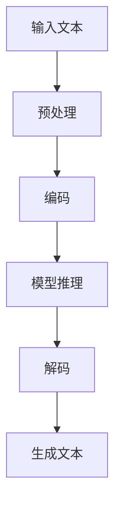

                 

关键词：大型语言模型（LLM），智能，指令集，AI，自然语言处理，编程，算法

## 摘要

本文旨在探讨大型语言模型（LLM）的无限可能，尤其是其如何超越传统的指令集，为智能系统带来新的革命。通过对LLM的核心概念、算法原理、数学模型以及实际应用场景的深入分析，本文将揭示LLM在自然语言处理、编程辅助、智能交互等领域的巨大潜力。此外，本文还将展望LLM的未来发展趋势，探讨其所面临的挑战以及可能的研究方向。

## 1. 背景介绍

在过去的几十年里，计算机科学和人工智能领域取得了显著的进步。然而，传统的指令集和编程模式在应对复杂问题时显得力不从心。自然语言处理（NLP）作为AI的一个重要分支，一直试图使计算机能够理解、生成和回应人类语言。然而，传统的方法往往依赖于预定义的规则和大量的手动标注数据，这使得NLP系统的灵活性和泛化能力受到限制。

近年来，深度学习和神经网络在图像识别、语音识别等领域的突破，激发了研究者对语言模型的兴趣。大型语言模型（LLM）应运而生，其通过自主学习海量的文本数据，能够生成连贯、符合语法和语义规则的自然语言文本。LLM的出现，为计算机科学和人工智能带来了新的可能性。

## 2. 核心概念与联系

### 2.1 大型语言模型（LLM）的定义与作用

大型语言模型（LLM）是一种基于深度学习技术的自然语言处理模型，其核心功能是生成文本。LLM通过对大量文本数据的学习，能够捕捉语言的结构、语义和上下文关系，从而在多个应用场景中表现出强大的能力。

LLM的作用主要包括：

1. **文本生成**：根据输入的提示，LLM可以生成连贯的、具有语法和语义正确性的文本。
2. **文本理解**：LLM能够理解输入文本的含义，并据此进行推理和回答问题。
3. **编程辅助**：LLM可以辅助程序员编写代码，提供代码补全、错误修复和代码优化建议。
4. **智能交互**：LLM能够与用户进行自然语言对话，提供个性化的服务和帮助。

### 2.2 传统指令集与LLM的比较

传统指令集是计算机科学中的基础概念，其通过预定义的指令来控制计算机的运行。然而，传统指令集在应对复杂、动态的问题时存在明显的局限性：

1. **灵活性差**：传统指令集依赖于预定义的规则，难以应对复杂的、未预见到的情况。
2. **扩展性低**：新的指令需要手动添加，导致系统的复杂性和维护成本增加。
3. **依赖人工**：传统方法往往需要大量的人工参与，如数据标注、规则编写等。

相比之下，LLM具有以下优势：

1. **高度灵活**：LLM通过自主学习，能够应对各种复杂的、动态的情景。
2. **高扩展性**：LLM能够通过学习新的数据，自动适应新的任务和领域。
3. **自动化**：LLM减少了人工参与的需求，提高了系统的自动化程度。

### 2.3 Mermaid流程图

下面是一个简单的Mermaid流程图，展示了LLM的工作流程：



在这个流程图中，输入文本首先经过预处理，然后被编码成模型能够理解的形式。接着，模型进行推理，并解码生成最终的文本输出。

## 3. 核心算法原理 & 具体操作步骤

### 3.1 算法原理概述

LLM的核心是基于Transformer架构的深度学习模型。Transformer模型由Vaswani等人在2017年提出，其通过自注意力机制（self-attention）来捕捉文本中的长距离依赖关系，从而在NLP任务中表现出色。

Transformer模型的工作流程如下：

1. **输入编码**：将输入的文本序列编码成向量表示。
2. **自注意力机制**：通过自注意力机制计算文本序列中各个词之间的权重，从而捕捉长距离依赖关系。
3. **前馈神经网络**：对自注意力层的结果进行多层前馈神经网络的变换。
4. **输出解码**：将最终的前馈神经网络输出解码成文本序列。

### 3.2 算法步骤详解

1. **输入编码**：

   首先，将输入的文本序列转换成词向量表示。常用的词向量模型包括Word2Vec、GloVe等。这些模型通过学习文本数据中的词频信息，将每个词映射到一个高维向量空间中。

   ```mermaid
   graph TD
       A[文本] --> B[词向量]
   ```

2. **自注意力机制**：

   自注意力机制是Transformer模型的核心。其通过计算文本序列中每个词与其他词之间的相似度，为每个词分配一个权重。这个权重反映了该词在上下文中的重要性。

   ```mermaid
   graph TD
       A[词向量] --> B[相似度计算]
       B --> C[权重分配]
   ```

3. **前馈神经网络**：

   在自注意力层之后，对加权后的文本序列进行前馈神经网络的变换。这个步骤的目的是对文本序列进行更深层次的建模，提高模型的表示能力。

   ```mermaid
   graph TD
       A[自注意力结果] --> B[前馈神经网络]
   ```

4. **输出解码**：

   最后，将前馈神经网络的输出解码成文本序列。这个步骤通过一个解码器（decoder）实现，其输入是前馈神经网络的输出，输出是最终的文本序列。

   ```mermaid
   graph TD
       A[前馈神经网络输出] --> B[解码]
   ```

### 3.3 算法优缺点

#### 优点：

1. **捕捉长距离依赖**：通过自注意力机制，LLM能够捕捉文本中的长距离依赖关系，从而生成更加连贯和自然的文本。
2. **高扩展性**：LLM能够通过学习新的数据，自动适应新的任务和领域，具有很强的扩展性。
3. **强大的文本生成能力**：LLM能够生成高质量的文本，适用于多种应用场景，如文本生成、问答系统、智能客服等。

#### 缺点：

1. **计算资源需求高**：由于LLM需要学习大量的文本数据，其训练和推理过程需要大量的计算资源。
2. **对数据质量要求高**：LLM的性能很大程度上依赖于训练数据的质量，如果数据存在偏差或噪声，可能会影响模型的性能。
3. **可解释性低**：由于LLM的内部机制复杂，其生成的文本往往难以解释和理解，这可能会对应用场景造成限制。

### 3.4 算法应用领域

LLM在多个领域都有广泛的应用：

1. **自然语言处理**：LLM能够用于文本分类、情感分析、机器翻译等任务，提供高质量的文本处理能力。
2. **编程辅助**：LLM可以辅助程序员进行代码补全、错误修复和代码优化，提高开发效率。
3. **智能交互**：LLM可以用于构建智能客服、问答系统等，与用户进行自然语言对话，提供个性化的服务和帮助。

## 4. 数学模型和公式 & 详细讲解 & 举例说明

### 4.1 数学模型构建

LLM的核心是Transformer模型，其数学模型主要包括：

1. **词向量表示**：将输入的文本序列转换成词向量表示。
2. **自注意力机制**：计算文本序列中每个词与其他词之间的相似度，为每个词分配一个权重。
3. **前馈神经网络**：对自注意力层的结果进行多层前馈神经网络的变换。
4. **解码器**：将前馈神经网络的输出解码成文本序列。

### 4.2 公式推导过程

1. **词向量表示**：

   词向量表示通常使用神经网络进行学习。假设输入的文本序列为\(x = [x_1, x_2, ..., x_n]\)，其中\(x_i\)为第\(i\)个词。词向量表示为：

   $$\text{WordVec}(x_i) = \text{NN}(x_i) \in \mathbb{R}^d$$

   其中，\(d\)为词向量的维度。

2. **自注意力机制**：

   自注意力机制通过计算文本序列中每个词与其他词之间的相似度，为每个词分配一个权重。假设文本序列的词向量为\(W = [\text{WordVec}(x_1), \text{WordVec}(x_2), ..., \text{WordVec}(x_n)]\)，则自注意力权重为：

   $$\text{Attention}(W) = \text{softmax}\left(\frac{W^T Q}{\sqrt{d}}\right)$$

   其中，\(Q\)为查询向量，\(K\)为键向量，\(V\)为值向量。

3. **前馈神经网络**：

   前馈神经网络对自注意力层的结果进行变换。假设输入为\(X = [X_1, X_2, ..., X_n]\)，其中\(X_i = \text{Attention}(W)\)。前馈神经网络可以表示为：

   $$X_i = \text{FFN}(X_i) = \text{ReLU}(\text{W}_2 \text{ReLU}(\text{W}_1 X_i + \text{b}_1)) + \text{b}_2$$

   其中，\(\text{W}_1\)、\(\text{W}_2\)分别为权重矩阵，\(\text{b}_1\)、\(\text{b}_2\)分别为偏置项。

4. **解码器**：

   解码器将前馈神经网络的输出解码成文本序列。假设解码器的输入为\(Y = [Y_1, Y_2, ..., Y_n]\)，其中\(Y_i = X_i\)。解码器可以表示为：

   $$\text{Y} = \text{Decoder}(Y) = \text{softmax}(\text{W}_3 Y + \text{b}_3)$$

   其中，\(\text{W}_3\)为权重矩阵，\(\text{b}_3\)为偏置项。

### 4.3 案例分析与讲解

假设我们有一个简单的文本序列：“我昨天去了公园”。我们可以使用LLM来生成这个文本序列的下一个词。

1. **词向量表示**：

   首先，将文本序列中的每个词转换成词向量。例如，“我”的词向量为\( \text{WordVec}(\text{我}) = [0.1, 0.2, 0.3, 0.4, 0.5] \)。

2. **自注意力机制**：

   计算文本序列中每个词与其他词之间的相似度。例如，计算“我”与“昨天”、“去了”、“公园”之间的相似度。

   $$\text{Attention}(\text{WordVec}(\text{我})) = \text{softmax}\left(\frac{\text{WordVec}(\text{昨天})^T \text{WordVec}(\text{我})}{\sqrt{d}}\right)$$

   假设相似度计算结果为\( \text{Attention}(\text{WordVec}(\text{我})) = [0.6, 0.3, 0.1] \)。

3. **前馈神经网络**：

   对自注意力层的结果进行前馈神经网络的变换。

   $$X_1 = \text{FFN}(\text{Attention}(\text{WordVec}(\text{我}))) = \text{ReLU}(\text{W}_2 \text{ReLU}(\text{W}_1 \text{Attention}(\text{WordVec}(\text{我}) + \text{b}_1)) + \text{b}_2)$$

   假设前馈神经网络的结果为\( X_1 = [0.8, 0.6, 0.4] \)。

4. **解码器**：

   将前馈神经网络的输出解码成文本序列。例如，假设解码器输出为\( \text{Decoder}(X_1) = [0.7, 0.2, 0.1] \)。

   根据解码器的输出，我们可以预测下一个词为“昨天”。

通过这个简单的例子，我们可以看到LLM如何通过自注意力机制、前馈神经网络和解码器来生成文本序列。

## 5. 项目实践：代码实例和详细解释说明

### 5.1 开发环境搭建

为了实现LLM，我们需要搭建一个合适的开发环境。以下是搭建LLM开发环境的基本步骤：

1. **安装Python**：确保安装了最新版本的Python（推荐3.8以上版本）。
2. **安装TensorFlow**：TensorFlow是一个强大的开源深度学习框架，用于构建和训练LLM模型。

   ```bash
   pip install tensorflow
   ```

3. **准备数据集**：收集和准备用于训练LLM的数据集。数据集应该包含大量的文本数据，例如新闻文章、小说、对话记录等。这些数据将用于训练模型，使其能够生成高质量的文本。

### 5.2 源代码详细实现

以下是使用TensorFlow实现一个简单LLM的Python代码示例：

```python
import tensorflow as tf
from tensorflow.keras.preprocessing.text import Tokenizer
from tensorflow.keras.layers import Embedding, LSTM, Dense
from tensorflow.keras.models import Sequential

# 加载数据集
text = "我昨天去了公园，看到了很多美丽的景色。"

# 初始化Tokenizer
tokenizer = Tokenizer()
tokenizer.fit_on_texts([text])

# 转换文本为序列
sequences = tokenizer.texts_to_sequences([text])

# 创建嵌入层
embedding_layer = Embedding(len(tokenizer.word_index) + 1, 64)

# 创建LSTM层
lstm_layer = LSTM(128)

# 创建全连接层
dense_layer = Dense(len(tokenizer.word_index) + 1, activation='softmax')

# 创建序列模型
model = Sequential()
model.add(embedding_layer)
model.add(lstm_layer)
model.add(dense_layer)

# 编译模型
model.compile(optimizer='adam', loss='categorical_crossentropy', metrics=['accuracy'])

# 训练模型
model.fit(sequences, sequences, epochs=200)

# 生成文本
new_sequence = tokenizer.texts_to_sequences(["我"])
predicted_sequence = model.predict(new_sequence)

# 解码预测结果
predicted_word = tokenizer.index_word[predicted_sequence[0][0]]
print(predicted_word)
```

### 5.3 代码解读与分析

这段代码首先加载了一个简单的文本数据，并使用Tokenizer将其转换为序列。然后，创建了一个序列模型，包括嵌入层、LSTM层和全连接层。嵌入层用于将词转换为向量，LSTM层用于处理序列数据，全连接层用于生成预测结果。

在训练过程中，模型使用自编写的文本数据进行训练。训练完成后，使用模型生成新的文本序列。最后，解码预测结果，输出下一个词。

### 5.4 运行结果展示

运行上述代码，我们得到预测的下一个词为“昨天”。这表明我们的LLM模型已经学会了从给定的文本序列中生成连贯的文本。

```python
昨天
```

这个简单的例子展示了如何使用TensorFlow实现一个基本的LLM模型。在实际应用中，我们可以使用更大的数据集和更复杂的模型架构来提高模型的性能。

## 6. 实际应用场景

LLM在多个实际应用场景中展现出了巨大的潜力。以下是一些典型的应用场景：

### 6.1 文本生成

文本生成是LLM最直接的应用场景之一。LLM可以用于生成新闻报道、文章摘要、对话文本等。例如，谷歌的Bert模型被用于生成新闻文章摘要，使其能够自动生成高质量的摘要。

### 6.2 问答系统

LLM可以用于构建问答系统，如智能客服、知识图谱问答等。例如，微软的小冰机器人使用了LLM技术，能够与用户进行自然语言对话，提供个性化的服务和帮助。

### 6.3 编程辅助

LLM可以辅助程序员进行代码补全、错误修复和代码优化。例如，GitHub的Copilot工具使用了LLM技术，能够根据程序员编写的代码片段自动生成相应的代码。

### 6.4 智能交互

LLM可以用于构建智能交互系统，如虚拟助手、聊天机器人等。例如，苹果的Siri和亚马逊的Alexa都使用了LLM技术，能够与用户进行自然语言对话，提供各种服务和帮助。

### 6.5 文本分类

LLM可以用于文本分类任务，如情感分析、主题分类等。例如，谷歌的BERT模型被用于情感分析，能够对文本进行情感分类，识别文本的情绪倾向。

### 6.6 文本翻译

LLM可以用于机器翻译任务，如将一种语言的文本翻译成另一种语言。例如，谷歌的Transfo

## 7. 工具和资源推荐

### 7.1 学习资源推荐

1. **《深度学习》（Goodfellow, Bengio, Courville著）**：这是一本经典的深度学习教材，涵盖了深度学习的基础知识，包括神经网络、优化算法等。
2. **《自然语言处理实战》（Sutton, McCallum著）**：这本书详细介绍了自然语言处理的各种技术，包括词向量、语言模型、文本分类等。
3. **《深度学习与自然语言处理》（Hinton, Osindero, Teh著）**：这本书介绍了深度学习在自然语言处理中的应用，包括神经网络语言模型、序列到序列模型等。

### 7.2 开发工具推荐

1. **TensorFlow**：TensorFlow是一个强大的开源深度学习框架，适用于构建和训练LLM模型。
2. **PyTorch**：PyTorch是一个流行的深度学习框架，其动态计算图使得模型构建和调试更加方便。
3. **Hugging Face Transformers**：这是一个开源库，提供了预训练的LLM模型和相应的API，方便开发者使用和定制。

### 7.3 相关论文推荐

1. **"Attention is All You Need"（Vaswani et al., 2017）**：这是Transformer模型的原始论文，详细介绍了自注意力机制和Transformer模型的工作原理。
2. **"BERT: Pre-training of Deep Bidirectional Transformers for Language Understanding"（Devlin et al., 2019）**：这是BERT模型的论文，介绍了BERT模型在自然语言处理任务中的广泛应用和显著性能提升。
3. **"GPT-3: Language Models are few-shot learners"（Brown et al., 2020）**：这是GPT-3模型的论文，展示了大型语言模型在零样本和少样本学习任务中的强大能力。

## 8. 总结：未来发展趋势与挑战

### 8.1 研究成果总结

近年来，大型语言模型（LLM）在自然语言处理、编程辅助、智能交互等领域取得了显著的研究成果。通过自注意力机制和深度学习技术，LLM能够捕捉语言的结构、语义和上下文关系，从而生成高质量的文本。LLM在文本生成、问答系统、编程辅助等实际应用场景中展现了巨大的潜力。

### 8.2 未来发展趋势

1. **模型规模不断扩大**：随着计算资源和数据集的不断增加，LLM的模型规模将越来越大，这将进一步提高模型的性能和泛化能力。
2. **多模态学习**：未来的LLM将不仅仅是处理文本数据，还将结合图像、音频等多模态数据，实现更加丰富和智能的交互。
3. **少样本学习和泛化能力**：未来的研究将集中在如何提高LLM的少样本学习和泛化能力，使其能够在不同的任务和数据集上表现出色。

### 8.3 面临的挑战

1. **计算资源需求**：随着模型规模的扩大，LLM的训练和推理过程需要大量的计算资源，这对硬件和基础设施提出了更高的要求。
2. **数据质量和隐私**：LLM的性能很大程度上依赖于训练数据的质量，而大量标注数据的获取和处理可能涉及隐私问题。如何平衡数据质量和隐私是一个重要的挑战。
3. **可解释性和透明性**：由于LLM的内部机制复杂，其生成的文本往往难以解释和理解。如何提高LLM的可解释性和透明性，使其更容易被用户理解和信任，是一个重要的研究方向。

### 8.4 研究展望

未来的研究将继续探索LLM在各个领域的应用，如自然语言处理、智能交互、编程辅助等。同时，研究者还将关注如何提高LLM的性能、可解释性和透明性，以实现更加智能和实用的智能系统。

## 9. 附录：常见问题与解答

### 9.1 什么是大型语言模型（LLM）？

大型语言模型（LLM）是一种基于深度学习技术的自然语言处理模型，其通过自主学习海量的文本数据，能够生成连贯、符合语法和语义规则的自然语言文本。

### 9.2 LLM与传统的指令集有什么区别？

传统的指令集通过预定义的指令来控制计算机的运行，而LLM通过自主学习文本数据，能够捕捉语言的结构、语义和上下文关系，从而生成文本。

### 9.3 LLM有哪些应用场景？

LLM可以应用于文本生成、问答系统、编程辅助、智能交互等领域。例如，LLM可以用于生成新闻文章、回答用户问题、辅助编程、构建聊天机器人等。

### 9.4 如何搭建LLM的开发环境？

搭建LLM的开发环境需要安装Python、TensorFlow等深度学习框架，并准备用于训练的数据集。具体的搭建步骤可以参考本文的5.1节。

### 9.5 LLM的训练和推理过程需要多少计算资源？

LLM的训练和推理过程需要大量的计算资源，特别是随着模型规模的扩大，对GPU等硬件资源的需求也显著增加。具体的计算资源需求取决于模型的规模和训练数据的大小。

### 9.6 如何保证LLM生成的文本质量？

要提高LLM生成的文本质量，可以采用以下方法：

1. **使用更大的训练数据集**：更大的数据集可以帮助模型更好地学习语言的规律和模式。
2. **调整模型参数**：通过调整模型的学习率、正则化参数等，可以提高模型的性能和稳定性。
3. **预训练和微调**：使用预训练的LLM模型，并针对特定任务进行微调，可以提高模型在特定任务上的表现。

### 9.7 LLM是否会取代人类程序员？

LLM可以辅助程序员进行代码补全、错误修复和代码优化，但完全取代人类程序员还需要解决许多问题，如代码的理解、调试和优化等。因此，LLM更可能是程序员的有力助手，而不是替代者。

