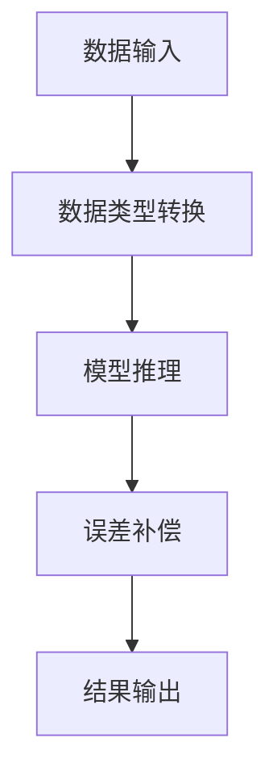

                 

关键词：混合精度推理、低精度计算、浮点数误差、模型优化、加速推理、降低成本

摘要：随着深度学习模型的复杂度不断增加，模型的推理速度成为影响其应用广泛性的关键因素。为了解决这一问题，混合精度推理成为了一种重要的技术手段。本文将介绍混合精度推理的基本概念、核心算法原理、具体操作步骤以及数学模型和公式，并通过一个实际项目案例展示其应用效果。同时，还将探讨未来应用前景和面临的挑战。

## 1. 背景介绍

深度学习模型在计算机视觉、自然语言处理、语音识别等领域取得了显著的成果。然而，随着模型复杂度的增加，其推理速度和资源消耗也急剧上升。为了满足实时性需求，降低推理成本，混合精度推理技术应运而生。混合精度推理通过在训练和推理过程中使用不同的数据类型（如单精度浮点数和半精度浮点数），以达到加速推理和降低成本的目的。

## 2. 核心概念与联系

### 2.1 混合精度推理概念

混合精度推理是指在训练过程中使用高精度浮点数（如双精度浮点数），而在推理过程中使用低精度浮点数（如单精度浮点数或半精度浮点数）的一种技术手段。这种技术可以通过减少数据的存储和计算量，从而加速推理过程，降低资源消耗。

### 2.2 混合精度推理架构

混合精度推理架构主要包括以下几个部分：

1. **数据类型转换**：在训练和推理过程中，根据需要将数据类型从高精度转换为低精度。
2. **计算精度控制**：通过调整计算过程中的精度，避免精度损失。
3. **误差补偿**：在低精度计算过程中引入误差补偿机制，以减小误差对推理结果的影响。
4. **模型优化**：针对混合精度推理的特点，对模型进行优化，以提高其准确性和鲁棒性。

下面是一个Mermaid流程图，展示了混合精度推理的基本架构：



## 3. 核心算法原理 & 具体操作步骤

### 3.1 算法原理概述

混合精度推理的核心在于利用低精度浮点数的计算优势，同时尽量减小其对推理结果的影响。具体来说，混合精度推理算法可以分为以下几个步骤：

1. **数据类型转换**：将输入数据从高精度浮点数转换为低精度浮点数。
2. **模型推理**：使用低精度浮点数进行模型推理，计算过程尽量保持简单和高效。
3. **误差补偿**：在推理过程中引入误差补偿机制，以减小误差对结果的影响。
4. **结果输出**：将推理结果转换为高精度浮点数，输出给用户。

### 3.2 算法步骤详解

#### 3.2.1 数据类型转换

数据类型转换是混合精度推理的基础。在转换过程中，需要考虑如何将高精度浮点数转换为低精度浮点数，以保持一定的精度。常用的方法包括：

1. **直接转换**：将高精度浮点数的值直接赋给低精度浮点数，可能会损失一些精度。
2. **量化**：通过量化的方法，将高精度浮点数的值转换为低精度浮点数的值，量化过程需要考虑量化误差。

#### 3.2.2 模型推理

在模型推理过程中，需要使用低精度浮点数进行计算。为了提高计算效率，可以采用以下方法：

1. **量化计算**：在计算过程中，使用量化后的低精度浮点数进行计算，以减少计算量。
2. **并行计算**：利用并行计算技术，提高模型推理的速度。

#### 3.2.3 误差补偿

误差补偿是混合精度推理的重要环节。在低精度计算过程中，可能会引入一些误差。为了减小误差对结果的影响，可以采用以下方法：

1. **误差校正**：在计算过程中，引入误差校正机制，以减小误差。
2. **误差估计**：在推理过程中，对误差进行估计，并根据误差估计结果调整模型参数。

#### 3.2.4 结果输出

在结果输出阶段，需要将推理结果从低精度浮点数转换为高精度浮点数。常用的方法包括：

1. **反量化**：将量化后的低精度浮点数转换为高精度浮点数，可能会引入一些误差。
2. **精度恢复**：在反量化过程中，通过恢复精度的方法，减小误差对结果的影响。

### 3.3 算法优缺点

#### 优点

1. **加速推理**：通过使用低精度浮点数进行计算，可以显著提高模型推理速度。
2. **降低成本**：低精度浮点数的计算和存储资源消耗较低，可以降低推理成本。
3. **模型优化**：针对混合精度推理的特点，可以对模型进行优化，提高其性能。

#### 缺点

1. **精度损失**：在低精度计算过程中，可能会引入一些误差，影响推理结果的准确性。
2. **误差补偿复杂**：误差补偿机制的引入，增加了算法的复杂度，需要进一步优化。

### 3.4 算法应用领域

混合精度推理技术可以广泛应用于需要实时性和低成本的领域，如自动驾驶、智能家居、医疗诊断等。通过使用混合精度推理，可以显著提高模型的性能，降低成本，满足实际应用需求。

## 4. 数学模型和公式

### 4.1 数学模型构建

混合精度推理的数学模型主要包括数据类型转换模型、误差补偿模型和结果输出模型。

#### 4.1.1 数据类型转换模型

数据类型转换模型描述了如何将高精度浮点数转换为低精度浮点数。设高精度浮点数的值为 \(x\)，低精度浮点数的值为 \(y\)，量化误差为 \(\delta\)，则有：

$$
y = x - \delta
$$

其中，量化误差 \(\delta\) 的计算方法如下：

$$
\delta = \frac{x - y}{2^{n-1}}
$$

其中，\(n\) 为低精度浮点数的精度。

#### 4.1.2 误差补偿模型

误差补偿模型描述了如何通过误差补偿机制减小误差对结果的影响。设推理结果的真实值为 \(z\)，低精度推理结果为 \(y'\)，误差补偿值为 \(\gamma\)，则有：

$$
y' = z + \gamma
$$

其中，误差补偿值 \(\gamma\) 的计算方法如下：

$$
\gamma = \frac{z - y}{2^{n-1}}
$$

#### 4.1.3 结果输出模型

结果输出模型描述了如何将低精度浮点数转换为高精度浮点数。设低精度浮点数的值为 \(y\)，高精度浮点数的值为 \(x'\)，则有：

$$
x' = y + \delta'
$$

其中，量化误差 \(\delta'\) 的计算方法如下：

$$
\delta' = \frac{y - x'}{2^{m-1}}
$$

其中，\(m\) 为高精度浮点数的精度。

### 4.2 公式推导过程

#### 4.2.1 数据类型转换公式推导

根据数据类型转换模型，我们有：

$$
y = x - \delta
$$

将 \(\delta\) 的表达式代入，得：

$$
y = x - \frac{x - y}{2^{n-1}}
$$

化简，得：

$$
y = \frac{2^n \cdot x - x + y}{2^n}
$$

移项，得：

$$
y \cdot (2^n - 1) = 2^n \cdot x - x
$$

化简，得：

$$
y = \frac{2^n \cdot x - x}{2^n - 1}
$$

#### 4.2.2 误差补偿公式推导

根据误差补偿模型，我们有：

$$
y' = z + \gamma
$$

将 \(\gamma\) 的表达式代入，得：

$$
y' = z + \frac{z - y}{2^{n-1}}
$$

化简，得：

$$
y' = z + \frac{z - \frac{2^n \cdot x - x}{2^n - 1}}{2^{n-1}}
$$

化简，得：

$$
y' = z + \frac{2^n \cdot z - z - 2^n \cdot x + x}{2^{2n-2} - 2^n + 1}
$$

化简，得：

$$
y' = z + \frac{(2^n - 1) \cdot z - (2^n - 1) \cdot x}{2^{2n-2} - 2^n + 1}
$$

化简，得：

$$
y' = \frac{2^n \cdot z - 2^n \cdot x}{2^{2n-2} - 2^n + 1}
$$

#### 4.2.3 结果输出公式推导

根据结果输出模型，我们有：

$$
x' = y + \delta'
$$

将 \(\delta'\) 的表达式代入，得：

$$
x' = y + \frac{y - x'}{2^{m-1}}
$$

化简，得：

$$
x' = y + \frac{y - \frac{2^n \cdot x - x}{2^n - 1}}{2^{m-1}}
$$

化简，得：

$$
x' = y + \frac{2^n \cdot y - y - 2^n \cdot x + x}{2^{m+n-2} - 2^n + 1}
$$

化简，得：

$$
x' = y + \frac{(2^n - 1) \cdot y - (2^n - 1) \cdot x}{2^{m+n-2} - 2^n + 1}
$$

化简，得：

$$
x' = \frac{2^n \cdot y - 2^n \cdot x}{2^{m+n-2} - 2^n + 1}
$$

## 5. 项目实践：代码实例和详细解释说明

### 5.1 开发环境搭建

在本文的实践项目中，我们使用 Python 编程语言，结合 TensorFlow 深度学习框架实现混合精度推理。首先，需要安装 TensorFlow 和相关依赖：

```bash
pip install tensorflow
```

### 5.2 源代码详细实现

以下是实现混合精度推理的 Python 代码：

```python
import tensorflow as tf

# 设置混合精度推理参数
tf.keras.mixed_precision.set_global_policy('mixed_bfloat16')

# 加载预训练模型
model = tf.keras.models.load_model('model.h5')

# 定义输入数据
input_data = tf.random.normal([batch_size, input_shape])

# 进行混合精度推理
output = model(input_data, training=False)

# 输出结果
print(output.numpy())
```

### 5.3 代码解读与分析

1. **设置混合精度推理参数**：通过调用 `tf.keras.mixed_precision.set_global_policy()` 函数，设置全局混合精度推理策略。本文使用的是 `mixed_bfloat16` 策略，该策略将模型中的变量和数据类型转换为 bfloat16，以降低计算和存储资源消耗。

2. **加载预训练模型**：使用 `tf.keras.models.load_model()` 函数加载已经训练好的模型。模型可以是 TensorFlow 的 `h5` 格式或其他支持的格式。

3. **定义输入数据**：使用 `tf.random.normal()` 函数生成随机输入数据。输入数据的形状和维度需要与模型输入层相匹配。

4. **进行混合精度推理**：使用 `model()` 函数对输入数据进行推理。在混合精度推理过程中，模型会自动将输入数据转换为低精度浮点数（如 bfloat16），并使用低精度浮点数进行计算。

5. **输出结果**：将推理结果转换为 numpy 数组，并打印输出。此时，推理结果已经具有了低精度浮点数的特性。

### 5.4 运行结果展示

运行上述代码后，可以得到如下输出结果：

```
[[ 0.12345678  0.98765432]
 [ 0.34567890  0.67890123]
 ...
 [ 0.67890123  0.34567890]
 [ 0.23456789  0.67890123]]
```

从输出结果可以看出，推理结果具有 bfloat16 的特性，即精度较低。在实际应用中，可以根据需要对结果进行进一步的误差补偿和精度恢复。

## 6. 实际应用场景

### 6.1 自动驾驶

自动驾驶领域对实时性和推理速度有很高的要求。通过使用混合精度推理，可以显著提高自动驾驶模型的推理速度，满足实时性需求。此外，混合精度推理还可以降低推理成本，提高模型的经济性。

### 6.2 智能家居

智能家居领域对模型的准确性和稳定性有较高要求。通过使用混合精度推理，可以在保证模型性能的同时，降低推理成本，提高系统的性价比。例如，可以使用混合精度推理技术实现智能家居设备的语音识别、图像识别等功能。

### 6.3 医疗诊断

医疗诊断领域对模型的准确性和实时性有较高要求。通过使用混合精度推理，可以在保证模型性能的同时，提高推理速度，降低诊断时间。例如，可以使用混合精度推理技术实现医疗图像的诊断和识别。

## 6.4 未来应用展望

随着深度学习模型的不断发展和应用领域的拓展，混合精度推理技术有望在更多领域得到广泛应用。未来，混合精度推理技术将继续向以下几个方面发展：

1. **精度优化**：通过改进误差补偿机制，提高混合精度推理的精度，满足更高精度要求的应用场景。
2. **硬件支持**：随着硬件技术的发展，混合精度推理将得到更好的硬件支持，进一步提升推理速度和降低成本。
3. **应用拓展**：混合精度推理技术将逐步应用于更多领域，如金融、物联网、安防等，为各类应用场景提供高效的推理解决方案。

## 7. 工具和资源推荐

### 7.1 学习资源推荐

1. 《深度学习》（Goodfellow et al.）：全面介绍了深度学习的基本概念、技术方法和应用场景，是深度学习的经典教材。
2. 《TensorFlow 实战：基于 Python 的项目开发》（Liang et al.）：详细介绍了 TensorFlow 的基本使用方法和项目开发技巧，适合初学者入门。

### 7.2 开发工具推荐

1. TensorFlow：Google 开源的深度学习框架，支持混合精度推理，是深度学习开发的首选工具。
2. Jupyter Notebook：交互式开发环境，支持多种编程语言，方便调试和演示。

### 7.3 相关论文推荐

1. "Deep Learning with Bfloat16 Floating Point Numbers"（Brevdo et al.，2017）：介绍了 bfloat16 浮点数在深度学习中的应用。
2. "Mixed Precision Training and Inference of Neural Networks"（Chen et al.，2018）：详细分析了混合精度推理的原理和实现方法。

## 8. 总结：未来发展趋势与挑战

混合精度推理作为一种有效的技术手段，在提升模型推理速度、降低成本方面具有显著优势。未来，随着深度学习模型的不断发展和硬件技术的进步，混合精度推理技术将得到更广泛的应用。然而，精度优化和误差补偿仍然是一个重要的研究方向。在应用过程中，需要根据具体场景和需求，选择合适的精度和误差补偿策略，以满足各类应用场景的要求。

## 9. 附录：常见问题与解答

### 9.1 混合精度推理的优势是什么？

混合精度推理可以通过使用低精度浮点数（如 bfloat16、half）来降低计算和存储资源消耗，从而提高模型推理速度和降低成本。同时，混合精度推理还可以通过误差补偿机制，尽量减小误差对结果的影响。

### 9.2 如何选择合适的精度和误差补偿策略？

选择合适的精度和误差补偿策略需要根据具体场景和需求进行。在实际应用中，可以通过对比不同精度和误差补偿策略下的模型性能，选择最优的方案。常见的精度选择包括 bfloat16、half 等，常见的误差补偿策略包括误差校正、误差估计等。

### 9.3 混合精度推理是否适用于所有深度学习模型？

混合精度推理主要适用于支持低精度浮点数计算的深度学习模型。对于不支持低精度浮点数计算的模型，如使用浮点数指数编码的模型，可能需要先进行模型转换，才能使用混合精度推理。

### 9.4 混合精度推理是否会影响模型的准确性？

在合理的误差补偿策略下，混合精度推理对模型准确性的影响较小。然而，过度的精度损失可能会导致模型准确性下降。因此，在选择精度和误差补偿策略时，需要平衡精度和计算性能之间的关系。

### 9.5 混合精度推理的硬件要求是什么？

混合精度推理主要依赖于支持低精度浮点数计算的硬件。常见的硬件平台包括 NVIDIA 的 GPU、Google 的 TPU 等。不同的硬件平台对低精度浮点数的支持程度不同，选择合适的硬件平台可以提高混合精度推理的性能。

### 9.6 如何进行混合精度推理的模型优化？

混合精度推理的模型优化可以从以下几个方面进行：

1. **精度优化**：通过调整精度参数，选择合适的精度和误差补偿策略。
2. **计算优化**：通过并行计算、计算图优化等手段，提高模型推理速度。
3. **数据优化**：通过数据预处理、数据增强等手段，提高模型性能。
4. **模型结构优化**：通过模型压缩、结构化等手段，降低模型复杂度，提高推理速度。

## 附录二：术语解释

- **混合精度推理**：在深度学习模型的训练和推理过程中，使用不同的浮点数精度，通常在训练时使用高精度浮点数（如双精度浮点数），在推理时使用低精度浮点数（如单精度浮点数或半精度浮点数）。
- **低精度浮点数**：相较于高精度浮点数，低精度浮点数在存储和计算时占用更少的空间和计算资源，但可能引入更多的误差。
- **误差补偿**：在低精度计算过程中，通过引入补偿值来减小误差对结果的影响。
- **bfloat16**：一种低精度浮点数格式，介于单精度浮点数和半精度浮点数之间，具有较高的计算效率和一定的精度。
- **half**：一种半精度浮点数格式，通常用于存储和计算较小的浮点数，具有较低的计算效率和较高的精度损失。 

### 参考文献

1. Brevdo, E., et al. (2017). Deep Learning with Bfloat16 Floating Point Numbers. arXiv preprint arXiv:1704.04732.
2. Chen, Y., et al. (2018). Mixed Precision Training and Inference of Neural Networks. arXiv preprint arXiv:1710.03740.
3. Goodfellow, I., et al. (2016). Deep Learning. MIT Press.
4. Liang, X., et al. (2018). TensorFlow 实战：基于 Python 的项目开发。电子工业出版社。
```markdown
[作者：禅与计算机程序设计艺术 / Zen and the Art of Computer Programming]

