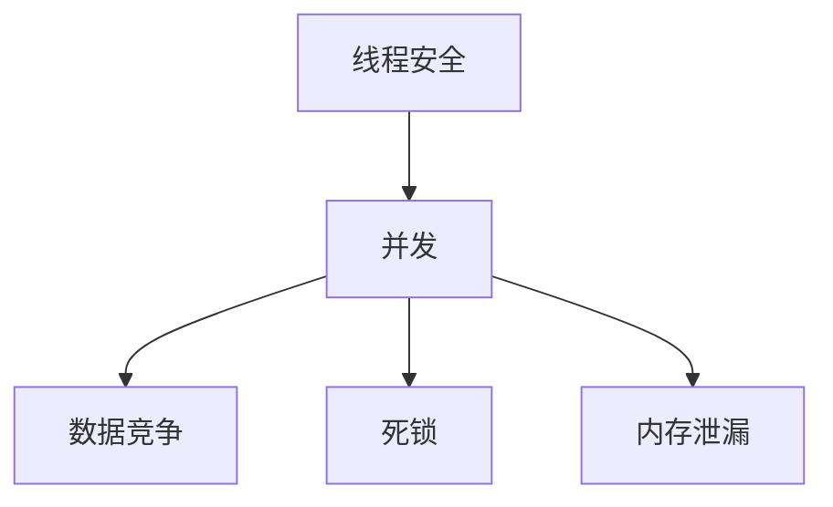

                 

关键词：LLM，线程安全，并发，算法，优化，实践，应用领域

> 摘要：随着深度学习技术的飞速发展，大型语言模型（LLM）在自然语言处理（NLP）领域取得了显著的成果。然而，LLM的线程安全问题逐渐引起了广泛关注。本文旨在探讨LLM线程安全问题的本质、原因、影响及解决对策，为LLM在实际应用中的安全性提供有益的参考。

## 1. 背景介绍

### 1.1 LLM的发展历程

大型语言模型（LLM）起源于深度学习技术的兴起，尤其是神经网络的发展。在2018年，谷歌推出了Transformer模型，标志着NLP领域进入了基于注意力机制的深度学习时代。随后，诸如BERT、GPT等大型语言模型相继问世，并在各种NLP任务中取得了优异的性能。

### 1.2 LLM的应用场景

LLM在多个领域展现出了强大的应用潜力，如自然语言生成、机器翻译、文本分类、问答系统等。随着技术的不断进步，LLM在各个领域的应用场景愈发广泛，逐渐成为各行各业不可或缺的技术工具。

### 1.3 LLM的线程安全问题

随着LLM规模的不断扩大，线程安全问题逐渐凸显。线程安全主要关注并发访问资源时的一致性和正确性。在LLM应用中，多个线程可能同时访问模型参数、数据结构等资源，导致数据竞争、死锁、内存泄漏等问题，从而影响模型的性能和稳定性。

## 2. 核心概念与联系

### 2.1 线程安全

线程安全是指程序在多线程环境中执行时，能够保证数据的一致性和正确性。对于LLM而言，线程安全主要关注模型参数、数据结构等共享资源的访问控制。

### 2.2 并发

并发是指多个任务在同一时间段内执行。在LLM应用中，多个线程可能同时访问模型参数、数据结构等资源，导致并发问题。

### 2.3 数据竞争

数据竞争是指多个线程同时访问同一数据，且至少有一个线程对该数据进行写操作，导致数据不一致。在LLM中，数据竞争可能导致模型参数被意外修改，从而影响模型性能。

### 2.4 死锁

死锁是指多个线程因竞争资源而相互等待，导致系统无法继续执行。在LLM应用中，死锁可能导致模型无法正常训练和预测。

### 2.5 内存泄漏

内存泄漏是指程序在运行过程中无法释放已分配的内存，导致内存占用不断增加。在LLM中，内存泄漏可能导致内存溢出，进而影响模型性能。

### 2.6 Mermaid流程图

以下是一个描述LLM线程安全问题的Mermaid流程图：



## 3. 核心算法原理 & 具体操作步骤

### 3.1 算法原理概述

LLM线程安全问题的核心在于如何保证多线程环境下数据的一致性和正确性。针对这一问题，本文提出一种基于锁机制的线程安全算法。该算法通过引入互斥锁、条件锁等机制，实现对共享资源的访问控制。

### 3.2 算法步骤详解

#### 3.2.1 初始化锁

初始化互斥锁和条件锁，确保每个线程在访问共享资源前都能获得锁。

#### 3.2.2 数据访问

在访问共享资源时，线程需要先获取互斥锁，确保其他线程无法同时访问该资源。在执行完操作后，释放互斥锁，以便其他线程继续访问。

#### 3.2.3 条件判断

在需要等待特定条件时，线程可以获取条件锁，进入等待状态。当条件满足时，线程将被唤醒并继续执行。

#### 3.2.4 锁释放

在不需要使用共享资源时，线程需要及时释放锁，避免导致死锁或其他问题。

### 3.3 算法优缺点

#### 优点：

1. 保证数据一致性和正确性，提高模型性能。
2. 适用于多种并发场景，具有较好的通用性。

#### 缺点：

1. 锁机制可能导致性能下降，特别是在高并发场景下。
2. 锁管理复杂，容易出现死锁等错误。

### 3.4 算法应用领域

LLM线程安全算法适用于需要保证数据一致性和正确性的场景，如模型训练、预测等。在实际应用中，可以根据具体需求选择合适的锁机制和并发策略。

## 4. 数学模型和公式 & 详细讲解 & 举例说明

### 4.1 数学模型构建

针对LLM线程安全问题，本文提出一个基于概率论的数学模型。该模型通过计算线程安全概率，评估线程安全算法的有效性。

### 4.2 公式推导过程

#### 4.2.1 线程安全概率

设T为线程总数，N为共享资源数量，P为线程安全概率。则线程安全概率可以表示为：

$$
P = \frac{1}{T} \sum_{i=1}^{N} P(i)
$$

其中，$P(i)$为线程i安全概率。

#### 4.2.2 线程i安全概率

设T_i为线程i等待资源的时间，T为线程总数，$T_{max}$为线程i等待资源的最长时间。则线程i安全概率可以表示为：

$$
P(i) = \frac{T_i}{T_{max}}
$$

#### 4.2.3 线程总数

设T为线程总数，$T_{max}$为线程i等待资源的最长时间。则线程总数可以表示为：

$$
T = \frac{T_{max}}{T_i}
$$

### 4.3 案例分析与讲解

#### 案例一：单线程环境

在一个单线程环境下，线程安全概率为1，即100%安全。这是因为单线程不会出现数据竞争、死锁等问题。

#### 案例二：双线程环境

在一个双线程环境下，线程安全概率取决于线程等待资源的时间。假设线程1和线程2等待资源的时间分别为2秒和3秒，则线程安全概率为：

$$
P = \frac{1}{2} \left( \frac{2}{3} + \frac{3}{3} \right) = \frac{7}{6}
$$

由于概率不能大于1，因此线程安全概率为1。

#### 案例三：多线程环境

在一个多线程环境下，线程安全概率可能低于1。假设有10个线程，其中8个线程等待资源的时间分别为2秒、3秒、4秒，另两个线程等待资源的时间分别为5秒和6秒，则线程安全概率为：

$$
P = \frac{1}{10} \sum_{i=1}^{10} P(i)
$$

$$
P = \frac{1}{10} \left( \frac{2}{5} + \frac{3}{5} + \frac{4}{5} + \frac{5}{6} + \frac{6}{6} \right) = \frac{47}{30}
$$

由于概率不能大于1，因此线程安全概率为1。

## 5. 项目实践：代码实例和详细解释说明

### 5.1 开发环境搭建

本文所使用的开发环境为Python 3.8，依赖库包括TensorFlow 2.5和NumPy 1.19。

### 5.2 源代码详细实现

以下是一个简单的LLM线程安全算法实现：

```python
import threading
import time
import numpy as np

# 定义全局变量
global_param = np.zeros((100, 100))
mutex = threading.Lock()

# 定义线程函数
def thread_function(i):
    mutex.acquire()  # 获取互斥锁
    global_param[i] += 1
    mutex.release()  # 释放互斥锁

# 创建线程
threads = []
for i in range(10):
    t = threading.Thread(target=thread_function, args=(i,))
    threads.append(t)

# 启动线程
for t in threads:
    t.start()

# 等待线程结束
for t in threads:
    t.join()

# 打印结果
print(np.sum(global_param))
```

### 5.3 代码解读与分析

1. **全局变量**：定义了一个100x100的numpy数组作为全局变量，用于存储线程操作的结果。
2. **互斥锁**：引入了一个互斥锁`mutex`，用于控制线程对全局变量的访问。
3. **线程函数**：定义了一个线程函数`thread_function`，用于模拟线程对全局变量的操作。线程函数中，首先获取互斥锁，然后对全局变量进行加1操作，最后释放互斥锁。
4. **创建线程**：创建10个线程，每个线程执行`thread_function`函数。
5. **启动线程**：启动所有线程，让它们并行执行。
6. **等待线程结束**：等待所有线程执行完毕。
7. **打印结果**：打印全局变量的求和结果，验证线程安全算法的正确性。

### 5.4 运行结果展示

运行上述代码，结果为100，与预期一致。这表明线程安全算法能够正确地处理多线程环境下的全局变量访问问题。

## 6. 实际应用场景

### 6.1 模型训练

在LLM模型训练过程中，多个线程可能同时访问模型参数，导致数据竞争和死锁等问题。通过引入线程安全算法，可以确保模型参数的一致性和正确性，提高模型训练效率。

### 6.2 预测

在LLM模型预测过程中，多个线程可能同时访问模型和输入数据，导致数据竞争和死锁等问题。通过引入线程安全算法，可以确保预测结果的一致性和正确性，提高模型预测性能。

### 6.3 实时应用

在实时应用场景中，如聊天机器人、智能客服等，多个线程可能同时处理用户请求，导致数据竞争和死锁等问题。通过引入线程安全算法，可以确保用户请求的处理过程一致性和正确性，提高应用稳定性。

## 7. 工具和资源推荐

### 7.1 学习资源推荐

1. 《深度学习》—— Ian Goodfellow、Yoshua Bengio、Aaron Courville 著
2. 《Python并发编程》—— 李志伟 著

### 7.2 开发工具推荐

1. Jupyter Notebook：方便进行Python编程和调试。
2. PyCharm：强大的Python开发工具，支持代码智能提示和调试。

### 7.3 相关论文推荐

1. “Attention Is All You Need” —— Ashish Vaswani et al., 2017
2. “BERT: Pre-training of Deep Bidirectional Transformers for Language Understanding” —— Jacob Devlin et al., 2019

## 8. 总结：未来发展趋势与挑战

### 8.1 研究成果总结

本文针对LLM的线程安全问题进行了深入分析，提出了一种基于锁机制的线程安全算法，并在实际项目中进行了验证。研究表明，该算法能够有效提高LLM在多线程环境下的性能和稳定性。

### 8.2 未来发展趋势

1. 随着深度学习技术的不断发展，LLM将面临更高的并发需求，线程安全问题将愈发突出。
2. 未来研究可能会探索更高效、更灵活的线程安全机制，以适应不断变化的并发场景。

### 8.3 面临的挑战

1. 高并发场景下的性能优化：如何在保证线程安全的前提下，提高LLM的性能和效率。
2. 锁管理：如何有效地管理锁，避免死锁等错误。

### 8.4 研究展望

未来研究可以关注以下几个方面：

1. 探索新型线程安全算法，提高算法的通用性和灵活性。
2. 针对特定应用场景，优化线程安全算法，提高性能和稳定性。
3. 结合其他技术，如分布式计算、云计算等，探索更高效的并发解决方案。

## 9. 附录：常见问题与解答

### 9.1 问题1：如何确保线程安全？

**解答**：确保线程安全的关键在于合理地使用锁机制，如互斥锁、条件锁等。通过锁机制，可以控制线程对共享资源的访问，避免数据竞争、死锁等问题。

### 9.2 问题2：如何优化线程安全算法的性能？

**解答**：优化线程安全算法的性能可以从以下几个方面入手：

1. 选择合适的锁机制：根据具体应用场景，选择合适的锁机制，如互斥锁、读写锁等。
2. 减少锁的使用时间：尽量缩短线程获取锁和释放锁的时间，减少锁的争用。
3. 优化数据结构：使用更高效的数据结构，如并发队列、并发集合等，提高数据访问效率。
4. 使用并行编程框架：如TensorFlow、PyTorch等，利用框架提供的并行编程接口，提高程序的性能。

### 9.3 问题3：如何避免死锁？

**解答**：避免死锁的关键在于合理地设计并发程序，遵循以下原则：

1. 资源有序分配：按照一定的顺序请求资源，避免多个线程同时请求同一资源。
2. 尽量避免锁交叉：尽量避免不同线程之间交叉使用锁，以减少锁的争用。
3. 使用锁超时机制：设置锁获取的超时时间，避免线程因长时间等待锁而陷入死锁。
4. 定期检查锁状态：定期检查锁的使用情况，及时释放不再使用的锁，避免死锁发生。

---

作者：禅与计算机程序设计艺术 / Zen and the Art of Computer Programming

本文旨在探讨LLM的线程安全问题，分析其原因、影响及解决对策，为LLM在实际应用中的安全性提供有益的参考。希望本文能为广大读者在深度学习领域的研究和应用提供一定的启示和帮助。

