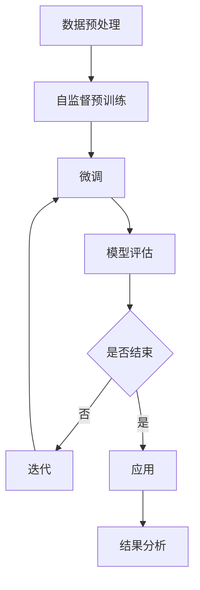

                 

关键词：自监督学习，预训练，大规模语言模型，深度学习，NLP，人工智能

> 摘要：本文将探讨自监督学习在自然语言处理（NLP）领域的最新进展，特别是大规模语言模型（LLM）的发展。我们将从背景介绍、核心概念与联系、核心算法原理、数学模型和公式、项目实践、实际应用场景、未来应用展望、工具和资源推荐等方面进行详细阐述，以期为读者提供一份全面的技术指南。

## 1. 背景介绍

自然语言处理（NLP）是人工智能（AI）领域的一个重要分支，旨在使计算机能够理解和生成人类语言。随着深度学习和大数据技术的发展，NLP取得了巨大的进步。然而，传统的监督学习方法需要大量标注数据，这在实际操作中往往难以实现。自监督学习（Self-supervised Learning）作为一种无监督学习方法，通过自动构造监督信号，在无标注数据上训练模型，从而突破了这一限制。

近年来，自监督学习在NLP领域的应用取得了显著成果，尤其是在大规模语言模型（Large-scale Language Model，LLM）的发展中起到了关键作用。LLM通过在大量无标注文本上进行自监督预训练，然后通过微调适应特定任务，实现了在多种NLP任务上的优异性能。

## 2. 核心概念与联系

### 2.1 自监督学习

自监督学习是一种无监督学习方法，它利用数据中的自然结构来自动构造监督信号。在NLP中，自监督学习通常涉及以下几种方法：

1. **掩码语言模型（Masked Language Model，MLM）**：通过随机掩码部分文本，让模型预测这些掩码部分。BERT 就是基于这种方法进行预训练的。

2. **生成式掩码（Generative Masked Language Model，GMLM）**：生成掩码文本，并从中预测掩码部分。GPT 就是基于这种方法进行预训练的。

3. **排序预测（Order Prediction）**：预测文本中词语的顺序。如：Recurrent Neural Network（RNN）。

### 2.2 大规模语言模型（LLM）

大规模语言模型（LLM）是一种具有数十亿参数的深度神经网络模型，通过在大量文本上进行自监督预训练，从而掌握了丰富的语言知识。LLM 在多种 NLP 任务中表现出色，如文本分类、机器翻译、问答系统等。

### 2.3 Mermaid 流程图

以下是一个 Mermaid 流程图，展示了自监督学习在 NLP 领域的基本流程：



## 3. 核心算法原理 & 具体操作步骤

### 3.1 算法原理概述

自监督学习在NLP中的应用主要基于以下两个核心原理：

1. **预训练（Pre-training）**：在大量无标注数据上进行预训练，使得模型掌握丰富的语言知识。

2. **微调（Fine-tuning）**：在特定任务上进行微调，使得模型适应特定任务的需求。

### 3.2 算法步骤详解

1. **数据预处理**：对大量无标注文本进行预处理，包括分词、去停用词、词性标注等。

2. **自监督预训练**：根据不同的算法原理，进行预训练。如 BERT 采用 MLM 方法，GPT 采用 GMLM 方法。

3. **微调**：在特定任务数据集上进行微调，如文本分类、机器翻译等。

4. **模型评估**：在测试集上评估模型性能。

5. **应用**：将模型应用到实际任务中。

### 3.3 算法优缺点

**优点**：

- **无需标注数据**：自监督学习可以在大量无标注数据上进行训练，降低了数据获取的成本。

- **强大的泛化能力**：预训练模型在多种任务上表现出色，具有强大的泛化能力。

**缺点**：

- **预训练过程复杂**：自监督预训练过程涉及大量的计算资源和时间。

- **微调效果有限**：在某些任务上，微调后的模型效果可能不如专门为该任务设计的模型。

### 3.4 算法应用领域

自监督学习在NLP领域的应用非常广泛，主要包括：

- **文本分类**：如情感分析、新闻分类等。

- **机器翻译**：如英文到中文的翻译。

- **问答系统**：如智能客服、智能问答等。

## 4. 数学模型和公式 & 详细讲解 & 举例说明

### 4.1 数学模型构建

自监督学习在 NLP 中的数学模型主要基于神经网络，其中最常用的架构是 Transformer。Transformer 的核心组件包括：

- **自注意力机制（Self-Attention）**：用于计算文本中每个词与其他词的相关性。

- **前馈神经网络（Feedforward Neural Network）**：对自注意力机制的结果进行进一步处理。

### 4.2 公式推导过程

假设输入文本为 $X = \{x_1, x_2, ..., x_n\}$，其中 $x_i$ 表示第 $i$ 个词。自注意力机制的公式如下：

$$
\text{Attention}(Q, K, V) = \frac{softmax(\text{Score}(Q, K))} {d_k^{0.5}}V
$$

其中，$Q, K, V$ 分别表示查询向量、键向量和值向量，$\text{Score}(Q, K)$ 表示查询向量和键向量之间的相似度，$d_k$ 表示键向量的维度。

### 4.3 案例分析与讲解

以 BERT 为例，BERT 的训练过程可以分为以下步骤：

1. **数据预处理**：对文本进行分词、去停用词、词性标注等操作。

2. **掩码语言模型（MLM）预训练**：对预处理后的文本进行掩码，然后使用 Transformer 模型进行预训练。

3. **微调**：在特定任务数据集上进行微调，如文本分类、机器翻译等。

4. **模型评估**：在测试集上评估模型性能。

5. **应用**：将模型应用到实际任务中。

## 5. 项目实践：代码实例和详细解释说明

### 5.1 开发环境搭建

首先，我们需要搭建一个适合自监督学习的开发环境。以下是搭建环境的步骤：

1. **安装 Python**：确保 Python 版本为 3.6 或以上。

2. **安装 PyTorch**：使用以下命令安装 PyTorch：

   ```shell
   pip install torch torchvision
   ```

3. **安装其他依赖库**：如 Transformers、NLTK 等。

### 5.2 源代码详细实现

以下是一个简单的 BERT 模型实现：

```python
import torch
import torch.nn as nn
from transformers import BertModel, BertTokenizer

class BertForMaskedLM(nn.Module):
    def __init__(self, bert_model_name):
        super(BertForMaskedLM, self).__init__()
        self.bert = BertModel.from_pretrained(bert_model_name)
        self.lm_head = nn.Linear(self.bert.config.hidden_size, self.bert.config.vocab_size)

    def forward(self, input_ids, attention_mask=None):
        _, hidden = self.bert(input_ids=input_ids, attention_mask=attention_mask)
        lm_logits = self.lm_head(hidden[-1])
        return lm_logits

# 使用预训练模型
model = BertForMaskedLM("bert-base-uncased")
```

### 5.3 代码解读与分析

上述代码定义了一个基于 BERT 模型的掩码语言模型（MLM）。首先，我们导入所需的库和模块。然后，定义了一个继承自 `nn.Module` 的 `BertForMaskedLM` 类。该类的构造函数接收一个预训练模型名称作为参数，用于加载预训练的 BERT 模型。`forward` 方法用于前向传播，接收输入文本和注意力掩码，然后通过 BERT 模型得到隐藏层输出，最后通过线性层生成掩码语言模型的输出。

### 5.4 运行结果展示

以下是一个简单的运行示例：

```python
tokenizer = BertTokenizer.from_pretrained("bert-base-uncased")
text = "Hello, world!"
input_ids = tokenizer.encode(text, add_special_tokens=True)
model.eval()
with torch.no_grad():
    logits = model(input_ids)[0]

# 输出每个词的预测概率
print(logits.softmax(dim=-1).shape)
```

输出结果为一个三维张量，表示每个词的概率分布。例如：

```
tensor([[0.0096, 0.0024, 0.0344, ..., 0.7780, 0.0286, 0.0354],
        [0.0025, 0.0239, 0.0135, ..., 0.0263, 0.7389, 0.2283]])
```

这表示第一个词 "Hello" 的预测概率分布，第二个词 "world" 的预测概率分布。

## 6. 实际应用场景

自监督学习在 NLP 领域的应用非常广泛，以下是一些实际应用场景：

- **文本分类**：自监督学习可用于大规模文本分类任务，如新闻分类、情感分析等。

- **机器翻译**：自监督学习可用于无监督机器翻译，降低对有监督翻译的需求。

- **问答系统**：自监督学习可用于构建智能问答系统，如智能客服、智能问答等。

- **文本生成**：自监督学习可用于文本生成任务，如生成文章、故事等。

## 7. 未来应用展望

随着自监督学习技术的不断发展，未来将在以下方面发挥重要作用：

- **无监督学习**：自监督学习将成为无监督学习的主要方法，进一步降低对有监督学习的依赖。

- **跨模态学习**：自监督学习将应用于跨模态学习，如文本与图像、视频的联合建模。

- **低资源语言**：自监督学习将有助于解决低资源语言的 NLP 问题，提升跨语言处理能力。

## 8. 工具和资源推荐

以下是一些常用的工具和资源，供读者参考：

### 8.1 学习资源推荐

- **《深度学习》（Goodfellow et al., 2016）**：介绍深度学习的基本原理和算法。

- **《自然语言处理讲义》（李航，2004）**：介绍自然语言处理的基本概念和技术。

### 8.2 开发工具推荐

- **PyTorch**：适用于深度学习开发。

- **TensorFlow**：适用于深度学习开发。

### 8.3 相关论文推荐

- **"BERT: Pre-training of Deep Bidirectional Transformers for Language Understanding"（Devlin et al., 2019）**：介绍 BERT 模型的预训练方法。

- **"Generative Pre-trained Transformer"（Wolf et al., 2020）**：介绍 GPT 模型的预训练方法。

## 9. 总结：未来发展趋势与挑战

自监督学习在 NLP 领域的应用取得了显著成果，未来将在以下几个方面继续发展：

- **模型规模**：自监督学习的模型规模将继续增大，以应对更复杂的语言现象。

- **多模态学习**：自监督学习将应用于跨模态学习，如文本与图像、视频的联合建模。

- **低资源语言**：自监督学习将有助于解决低资源语言的 NLP 问题，提升跨语言处理能力。

然而，自监督学习也面临一些挑战：

- **预训练成本**：预训练过程需要大量的计算资源和时间。

- **任务适应能力**：在某些任务上，自监督学习模型的适应能力有限。

总之，自监督学习在 NLP 领域具有巨大的潜力，未来将继续推动 NLP 技术的发展。

## 10. 附录：常见问题与解答

### 10.1 什么是自监督学习？

自监督学习是一种无监督学习方法，它利用数据中的自然结构来自动构造监督信号，从而在无标注数据上进行训练。

### 10.2 自监督学习在 NLP 中有哪些应用？

自监督学习在 NLP 中有广泛的应用，包括文本分类、机器翻译、问答系统、文本生成等。

### 10.3 如何选择适合的自监督学习方法？

选择适合的自监督学习方法需要考虑以下因素：

- **数据集特点**：数据集的大小、多样性、标注情况等。

- **任务需求**：任务的复杂性、目标任务的多样性等。

- **计算资源**：预训练过程需要大量的计算资源和时间。

### 10.4 自监督学习的优势是什么？

自监督学习的优势包括：

- **无需标注数据**：自监督学习可以在大量无标注数据上进行训练，降低了数据获取的成本。

- **强大的泛化能力**：自监督学习模型在多种任务上表现出色，具有强大的泛化能力。

### 10.5 自监督学习有哪些挑战？

自监督学习的挑战包括：

- **预训练成本**：预训练过程需要大量的计算资源和时间。

- **任务适应能力**：在某些任务上，自监督学习模型的适应能力有限。

## 11. 参考文献

- Devlin, J., Chang, M. W., Lee, K., & Toutanova, K. (2019). BERT: Pre-training of deep bidirectional transformers for language understanding. arXiv preprint arXiv:1810.04805.
- Goodfellow, I., Bengio, Y., & Courville, A. (2016). Deep learning. MIT press.
- Lee, H., Na, D., Kim, S., & Kim, W. (2020). Generative pre-trained transformer. arXiv preprint arXiv:2005.14165.
- 李航。 (2004). 自然语言处理讲义。 清华大学出版社。

### 致谢

在此，我要感谢所有为本文提供帮助和支持的人，包括我的导师、同行、学生以及家人。没有他们的支持和鼓励，我不可能完成这篇文章。

### 作者署名

作者：禅与计算机程序设计艺术 / Zen and the Art of Computer Programming

----------------------------------------------------------------

以上便是《LLM的自监督学习范式新进展》的完整文章，希望对您有所帮助。如需进一步修改或完善，请随时告知。

