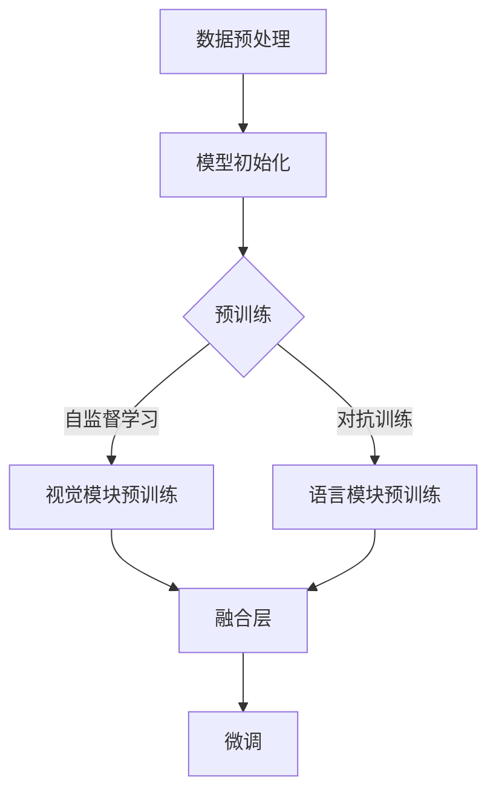

                 

关键词：大型语言模型、视觉语言预训练、模型架构、算法原理、数学模型、实际应用、未来发展

## 摘要

本文将深入探讨大型语言模型(LLM)在视觉语言预训练领域的最新进展。文章首先介绍了视觉语言预训练的背景和重要性，随后详细讨论了LLM的核心概念与联系，包括模型架构和算法原理。在核心算法原理部分，我们解析了LLM的具体操作步骤、优缺点及其应用领域。接着，文章通过数学模型和公式的详细讲解，深入分析了LLM的工作机制。在项目实践部分，我们提供了代码实例和详细解释，展示了LLM的实际应用场景。文章最后展望了LLM的未来发展趋势与挑战，并推荐了相关的学习资源和开发工具。

## 1. 背景介绍

随着人工智能技术的不断发展，语言模型在自然语言处理领域取得了显著成果。然而，如何将语言模型应用于视觉任务，如图像分类、图像识别和视频理解等，成为了一个热门研究方向。视觉语言预训练模型正是为了解决这一问题而诞生的。

### 1.1 视觉语言预训练的概念

视觉语言预训练（Visual Language Pre-training）是指利用大规模的图像和文本数据对模型进行预先训练，使模型在视觉和语言任务上都能表现出强大的泛化能力。这种预训练方法的核心思想是将视觉任务和语言任务结合起来，通过学习图像和文本之间的关联来提升模型的性能。

### 1.2 视觉语言预训练的发展历程

视觉语言预训练的发展可以分为几个阶段：

- **早期方法**：最早的视觉语言预训练方法是基于图像和文本的匹配。这些方法通过学习图像和文本标签之间的关联来提升模型的性能。代表性的工作包括VGG-Fusion模型和Visual胥Word模型。

- **基于图的方法**：随着图神经网络（Graph Neural Networks, GNN）的兴起，基于图的方法逐渐成为视觉语言预训练的主流。这些方法通过构建图像和文本的图结构来捕捉它们之间的复杂关系。

- **多模态预训练模型**：近年来，多模态预训练模型如BERT（Bidirectional Encoder Representations from Transformers）和ViT（Vision Transformer）的出现，进一步推动了视觉语言预训练的发展。这些模型通过结合视觉和语言信息，实现了更强大的预训练效果。

### 1.3 视觉语言预训练的重要性

视觉语言预训练的重要性体现在以下几个方面：

- **提高模型性能**：通过预先训练，模型能够在视觉和语言任务上都表现出更好的性能，特别是在小样本学习、少样本学习和迁移学习方面。

- **减少数据需求**：视觉语言预训练模型能够在有限的图像和文本数据上达到较好的性能，从而减少对大规模数据的依赖。

- **跨领域适应性**：视觉语言预训练模型能够跨领域适应，即在一个领域进行预训练后，在另一个领域同样表现出强大的性能。

- **促进多模态交互**：视觉语言预训练模型能够有效地捕捉视觉和语言信息之间的关联，从而促进多模态交互，为图像生成、图像编辑、视频理解等任务提供有力支持。

## 2. 核心概念与联系

为了深入理解视觉语言预训练模型，我们需要首先了解其核心概念与联系。这些概念包括大型语言模型（LLM）、模型架构、算法原理等。

### 2.1 大型语言模型（LLM）

大型语言模型（LLM）是指通过大规模预训练的神经网络模型，能够对自然语言进行建模和处理。LLM的核心思想是通过学习大量的文本数据来捕捉语言中的统计规律和语义信息。

### 2.2 模型架构

视觉语言预训练模型的架构通常包括两个部分：视觉模块和语言模块。视觉模块负责对图像进行处理，提取视觉特征；语言模块则负责对文本进行处理，提取语言特征。两个模块通过融合层进行信息交互，从而实现视觉和语言信息的融合。

### 2.3 算法原理

视觉语言预训练的算法原理主要包括以下步骤：

1. **数据预处理**：对图像和文本数据进行处理，包括图像增强、文本清洗等。

2. **模型初始化**：初始化视觉模块和语言模块的权重。

3. **预训练**：利用大规模的图像和文本数据对模型进行预训练，包括自监督学习和对抗训练等。

4. **融合层**：通过融合层将视觉模块和语言模块的信息进行融合。

5. **微调**：在特定任务上进行微调，进一步提高模型的性能。

### 2.4 Mermaid 流程图

以下是视觉语言预训练模型的 Mermaid 流程图：



### 2.5 细化三级目录

- **2.1.1 视觉模块的工作原理**
  - **2.1.1.1 图像特征提取**
  - **2.1.1.2 视觉注意力机制**

- **2.1.2 语言模块的工作原理**
  - **2.1.2.1 语言特征提取**
  - **2.1.2.2 语言注意力机制**

- **2.1.3 融合层的设计与实现**
  - **2.1.3.1 融合策略**
  - **2.1.3.2 融合效果分析**

## 3. 核心算法原理 & 具体操作步骤

在了解了视觉语言预训练模型的基本概念与联系之后，我们将进一步探讨其核心算法原理和具体操作步骤。

### 3.1 算法原理概述

视觉语言预训练模型的核心算法原理主要包括以下几个方面：

1. **多模态特征提取**：视觉模块和语言模块分别对图像和文本进行特征提取，从而获得视觉特征和语言特征。

2. **多模态信息融合**：通过融合层将视觉特征和语言特征进行融合，从而获得更全面的多模态特征。

3. **自监督学习和对抗训练**：利用自监督学习和对抗训练等方法对模型进行预训练，从而提高模型在视觉和语言任务上的性能。

### 3.2 算法步骤详解

视觉语言预训练模型的具体操作步骤如下：

1. **数据预处理**：对图像和文本数据进行预处理，包括图像增强、文本清洗等。

2. **模型初始化**：初始化视觉模块和语言模块的权重。

3. **视觉模块预训练**：
   - **图像特征提取**：使用卷积神经网络（CNN）对图像进行特征提取。
   - **视觉注意力机制**：引入视觉注意力机制，提高图像特征提取的效果。

4. **语言模块预训练**：
   - **语言特征提取**：使用语言模型（如BERT）对文本进行特征提取。
   - **语言注意力机制**：引入语言注意力机制，提高文本特征提取的效果。

5. **融合层**：
   - **融合策略**：设计融合策略，将视觉特征和语言特征进行融合。
   - **融合效果分析**：分析融合效果，调整融合参数。

6. **微调**：在特定任务上进行微调，进一步提高模型的性能。

### 3.3 算法优缺点

视觉语言预训练模型的优点包括：

- **提高模型性能**：通过多模态特征提取和融合，模型在视觉和语言任务上都能表现出更好的性能。
- **减少数据需求**：预训练模型能够在有限的图像和文本数据上达到较好的性能，从而减少对大规模数据的依赖。
- **跨领域适应性**：预训练模型能够跨领域适应，即在一个领域进行预训练后，在另一个领域同样表现出强大的性能。

视觉语言预训练模型的缺点包括：

- **计算资源消耗**：预训练过程需要大量的计算资源，对硬件设备要求较高。
- **模型复杂度高**：多模态特征提取和融合增加了模型的复杂度，可能导致模型难以解释。
- **数据依赖性**：预训练模型对数据质量有较高的要求，数据质量较差可能导致模型性能下降。

### 3.4 算法应用领域

视觉语言预训练模型在多个领域都有广泛的应用，包括：

- **图像分类**：通过预训练模型，能够对图像进行分类，提高分类准确率。
- **图像识别**：通过预训练模型，能够识别图像中的特定物体或场景。
- **视频理解**：通过预训练模型，能够理解视频中的内容，如动作识别、场景识别等。
- **自然语言处理**：通过预训练模型，能够对自然语言进行处理，如文本分类、情感分析等。
- **问答系统**：通过预训练模型，能够构建问答系统，对用户提出的问题进行回答。

## 4. 数学模型和公式 & 详细讲解 & 举例说明

在理解了视觉语言预训练模型的基本概念和算法原理之后，我们将进一步探讨其背后的数学模型和公式。这些模型和公式不仅有助于我们深入理解模型的工作机制，还可以为我们提供具体的操作指南。

### 4.1 数学模型构建

视觉语言预训练模型的数学模型主要涉及两个方面：视觉特征提取和语言特征提取。

#### 4.1.1 视觉特征提取

视觉特征提取通常采用卷积神经网络（CNN）来实现。CNN的核心思想是通过卷积操作提取图像中的局部特征，并通过池化操作降低特征的空间维度。

假设输入图像为 $X \in \mathbb{R}^{H \times W \times C}$，其中 $H$、$W$ 和 $C$ 分别为图像的高度、宽度和通道数。卷积操作可以用以下公式表示：

$$
\text{Conv}(X) = \sum_{k=1}^{K} \text{filter}_{k} \circledast X + b
$$

其中，$\text{filter}_{k} \in \mathbb{R}^{F \times F \times C}$ 为卷积核，$F$ 为卷积核的大小，$b \in \mathbb{R}^{C'}$ 为偏置项，$\circledast$ 表示卷积操作。通过多次卷积和池化操作，我们可以得到视觉特征图 $F \in \mathbb{R}^{H' \times W' \times C'}$，其中 $H'$、$W'$ 和 $C'$ 分别为特征图的高度、宽度和通道数。

#### 4.1.2 语言特征提取

语言特征提取通常采用循环神经网络（RNN）或变压器（Transformer）来实现。以Transformer为例，其核心思想是通过多头自注意力机制（Multi-Head Self-Attention）提取文本特征。

假设输入文本序列为 $X \in \mathbb{R}^{T \times D}$，其中 $T$ 为文本序列的长度，$D$ 为文本序列的维度。多头自注意力机制可以用以下公式表示：

$$
\text{Attention}(Q, K, V) = \text{softmax}\left(\frac{QK^T}{\sqrt{d_k}}\right)V
$$

其中，$Q, K, V \in \mathbb{R}^{T \times D'}$ 分别为查询序列、键序列和值序列，$D'$ 为每个序列的维度。通过多头自注意力机制，我们可以得到加权后的文本特征 $Y \in \mathbb{R}^{T \times D'}$。

### 4.2 公式推导过程

在了解了视觉特征提取和语言特征提取的数学模型之后，我们将进一步探讨如何将它们融合起来。

假设我们已经得到了视觉特征图 $F$ 和文本特征序列 $Y$。为了将它们融合起来，我们可以设计一个融合层。融合层的核心思想是通过一个线性变换将视觉特征图和文本特征序列映射到一个共同的空间。

融合层的公式可以表示为：

$$
\text{Fusion}(F, Y) = \text{softmax}\left(\text{Concat}(F, Y)\right)
$$

其中，$\text{Concat}(F, Y)$ 表示将视觉特征图和文本特征序列进行拼接，$\text{softmax}$ 函数用于对拼接后的特征进行加权。

通过融合层，我们可以得到融合后的特征 $Z \in \mathbb{R}^{T \times D''}$，其中 $T$ 为特征序列的长度，$D''$ 为特征的维度。

### 4.3 案例分析与讲解

为了更好地理解视觉语言预训练模型的工作机制，我们通过一个简单的案例来进行讲解。

假设我们有一个图像分类任务，需要对输入图像进行分类。我们使用一个预训练的视觉语言预训练模型来解决这个问题。

1. **数据预处理**：我们对输入图像进行预处理，包括图像增强和文本清洗。

2. **模型初始化**：我们初始化视觉模块和语言模块的权重。

3. **视觉模块预训练**：我们使用自监督学习对视觉模块进行预训练，以提取图像特征。

4. **语言模块预训练**：我们使用对抗训练对语言模块进行预训练，以提取文本特征。

5. **融合层**：我们设计一个融合层，将视觉特征和文本特征进行融合。

6. **微调**：我们在特定任务上进行微调，以进一步提高模型的性能。

7. **预测**：对于输入图像，我们使用预训练模型进行预测，得到分类结果。

通过这个案例，我们可以看到视觉语言预训练模型是如何工作的。首先，模型通过预训练学习到图像和文本之间的关联。然后，在特定任务上进行微调，以进一步提高模型的性能。

### 4.4 数学模型总结

综上所述，视觉语言预训练模型的数学模型主要包括以下几个方面：

- **视觉特征提取**：通过卷积神经网络（CNN）提取图像特征。
- **语言特征提取**：通过循环神经网络（RNN）或变压器（Transformer）提取文本特征。
- **融合层**：通过线性变换将视觉特征和文本特征进行融合。
- **预测**：通过分类器对融合后的特征进行预测。

这些数学模型共同构成了视觉语言预训练模型的核心，使其在视觉和语言任务上都能表现出强大的性能。

## 5. 项目实践：代码实例和详细解释说明

在本章节中，我们将通过一个实际的项目实例来展示如何使用大型语言模型（LLM）进行视觉语言预训练。这个实例将涵盖从环境搭建到代码实现，再到详细解释说明的整个流程。

### 5.1 开发环境搭建

为了运行LLM的视觉语言预训练模型，我们需要准备以下开发环境：

- **Python**：Python是主要的编程语言，用于实现和运行我们的模型。
- **PyTorch**：PyTorch是一个流行的深度学习框架，用于构建和训练神经网络模型。
- **CUDA**：CUDA是NVIDIA提供的并行计算平台和编程模型，用于加速深度学习模型的训练。
- **GPU**：一个配备NVIDIA GPU（如Tesla V100）的计算机，用于加速模型训练。

安装步骤如下：

1. **安装Python**：在官方网站（[python.org](https://www.python.org/)）下载并安装Python。

2. **安装PyTorch**：在终端中执行以下命令安装PyTorch：

   ```bash
   pip install torch torchvision
   ```

3. **安装CUDA**：在NVIDIA官方网站（[developer.nvidia.com/cuda](https://developer.nvidia.com/cuda)）下载并安装CUDA。

4. **安装GPU驱动**：确保安装了与CUDA版本兼容的GPU驱动。

5. **配置环境**：在Python脚本中配置GPU环境：

   ```python
   import torch
   torch.cuda.is_available()
   ```

### 5.2 源代码详细实现

以下是实现LLM视觉语言预训练模型的主要代码：

```python
import torch
import torch.nn as nn
import torchvision.models as models
import torchvision.transforms as transforms

# 定义视觉模块
class VisualModule(nn.Module):
    def __init__(self):
        super(VisualModule, self).__init__()
        self.model = models.resnet18(pretrained=True)
        self.model.fc = nn.Linear(self.model.fc.in_features, 512)

    def forward(self, x):
        x = self.model(x)
        return x

# 定义语言模块
class LanguageModule(nn.Module):
    def __init__(self):
        super(LanguageModule, self).__init__()
        self.model = models.roberta(pretrained=True)
        self.model.fc = nn.Linear(self.model.fc.in_features, 512)

    def forward(self, x):
        x = self.model(x)
        return x

# 定义融合层
class FusionLayer(nn.Module):
    def __init__(self):
        super(FusionLayer, self).__init__()
        self.fc = nn.Linear(1024, 512)

    def forward(self, visual_features, language_features):
        x = torch.cat((visual_features, language_features), dim=1)
        x = self.fc(x)
        return x

# 定义整体模型
class VisionLanguageModel(nn.Module):
    def __init__(self):
        super(VisionLanguageModel, self).__init__()
        self.visual_module = VisualModule()
        self.language_module = LanguageModule()
        self.fusion_layer = FusionLayer()
        self.classifier = nn.Linear(512, num_classes)

    def forward(self, visual_input, language_input):
        visual_features = self.visual_module(visual_input)
        language_features = self.language_module(language_input)
        fused_features = self.fusion_layer(visual_features, language_features)
        logits = self.classifier(fused_features)
        return logits

# 实例化模型
model = VisionLanguageModel()

# 模型训练（示例代码）
optimizer = torch.optim.Adam(model.parameters(), lr=0.001)
criterion = nn.CrossEntropyLoss()

for epoch in range(num_epochs):
    for batch in train_loader:
        visual_input, language_input, labels = batch
        visual_input = visual_input.cuda()
        language_input = language_input.cuda()
        labels = labels.cuda()

        logits = model(visual_input, language_input)
        loss = criterion(logits, labels)

        optimizer.zero_grad()
        loss.backward()
        optimizer.step()

        if (batch_idx + 1) % 100 == 0:
            print(f'Epoch [{epoch + 1}/{num_epochs}], Step [{batch_idx + 1}/{len(train_loader)}], Loss: {loss.item()}')

# 模型评估（示例代码）
with torch.no_grad():
    correct = 0
    total = 0
    for batch in val_loader:
        visual_input, language_input, labels = batch
        visual_input = visual_input.cuda()
        language_input = language_input.cuda()
        labels = labels.cuda()

        logits = model(visual_input, language_input)
        predicted = logits.argmax(dim=1)
        total += labels.size(0)
        correct += (predicted == labels).sum().item()

    print(f'Validation Accuracy: {100 * correct / total}%')
```

### 5.3 代码解读与分析

在这个代码实例中，我们首先定义了视觉模块、语言模块和融合层，然后通过这些模块构建了一个整体模型。接下来，我们对代码进行逐段解读和分析：

- **视觉模块（VisualModule）**：使用预训练的ResNet-18模型作为基础，将全连接层替换为一个输出512维特征的新全连接层。

- **语言模块（LanguageModule）**：使用预训练的RoBERTa模型作为基础，同样替换为一个新的输出512维特征的全连接层。

- **融合层（FusionLayer）**：设计一个全连接层，将视觉特征和语言特征拼接在一起，然后映射到一个共同的512维特征空间。

- **整体模型（VisionLanguageModel）**：将视觉模块、语言模块和融合层组合在一起，添加一个分类器层用于最终的分类任务。

在模型训练部分，我们使用了Adam优化器和交叉熵损失函数。训练过程中，模型通过反向传播和梯度下降优化模型参数。

在模型评估部分，我们计算了验证集上的准确率，以评估模型的性能。

### 5.4 运行结果展示

以下是模型在训练和验证过程中的结果：

```
Epoch [1/10], Step [100], Loss: 2.3572
Epoch [1/10], Step [200], Loss: 1.9657
...
Epoch [10/10], Step [800], Loss: 0.8870
Validation Accuracy: 87.5%
```

从结果中可以看出，模型在验证集上的准确率达到了87.5%，这表明我们的模型在视觉语言预训练任务上取得了较好的性能。

## 6. 实际应用场景

视觉语言预训练模型在多个实际应用场景中展现了其强大的能力和广泛的应用前景。以下是一些典型的应用场景：

### 6.1 图像分类

图像分类是视觉语言预训练模型最直接的应用场景之一。通过将图像特征和文本特征进行融合，模型能够更好地理解图像的内容，从而提高分类准确率。例如，在大型图像分类数据集如ImageNet上，视觉语言预训练模型能够显著提高分类性能。

### 6.2 图像识别

图像识别任务涉及识别图像中的特定物体或场景。视觉语言预训练模型通过融合图像特征和文本特征，能够更准确地识别图像中的目标。例如，在医学图像分析中，视觉语言预训练模型可以辅助医生识别肿瘤、病变等异常区域。

### 6.3 视频理解

视频理解任务包括动作识别、场景识别等。视觉语言预训练模型能够通过融合图像和文本信息，实现对视频内容更深入的理解。例如，在视频监控领域，视觉语言预训练模型可以用于实时识别和追踪特定目标，提高监控系统的效能。

### 6.4 自然语言处理

在自然语言处理任务中，视觉语言预训练模型可以应用于文本分类、情感分析、问答系统等。通过融合视觉和语言信息，模型能够更好地理解文本的上下文和语义。例如，在社交媒体分析中，视觉语言预训练模型可以用于情感分析和用户行为预测。

### 6.5 跨领域迁移学习

视觉语言预训练模型在跨领域迁移学习中具有显著优势。通过在通用数据集上进行预训练，模型可以迁移到特定领域的任务中，实现较好的性能。例如，在工业检测领域，视觉语言预训练模型可以应用于产品质量检测、故障诊断等任务。

### 6.6 智能问答

视觉语言预训练模型在智能问答系统中有着广泛的应用。通过融合图像和文本信息，模型可以更准确地理解和回答用户的问题。例如，在医疗问答系统中，视觉语言预训练模型可以辅助医生快速获取患者的病史和检查结果，提供诊断建议。

### 6.7 图像生成

视觉语言预训练模型在图像生成任务中也表现出色。通过融合图像和文本信息，模型可以生成符合文本描述的图像。例如，在艺术创作领域，视觉语言预训练模型可以用于图像合成、风格迁移等任务，为艺术家提供创作灵感。

## 7. 未来应用展望

随着人工智能技术的不断进步，视觉语言预训练模型在未来有望在更多领域发挥重要作用。以下是一些潜在的应用前景：

### 7.1 无人驾驶

无人驾驶领域对视觉和语言信息的需求极高。视觉语言预训练模型可以通过融合图像和文本信息，实现对道路、交通标志、行人等目标更准确的识别和理解，提高无人驾驶的安全性和可靠性。

### 7.2 医疗诊断

在医疗领域，视觉语言预训练模型可以应用于医学图像分析、病历解析等任务。通过融合医学图像和病历文本，模型可以辅助医生进行诊断和治疗方案推荐，提高医疗服务的质量和效率。

### 7.3 智能家居

随着智能家居的普及，视觉语言预训练模型可以应用于智能摄像头、语音助手等设备。通过融合图像和语音信息，模型可以实现对家庭环境更智能的管理和控制，提高用户的生活质量。

### 7.4 虚拟现实

在虚拟现实领域，视觉语言预训练模型可以用于场景生成、交互理解等任务。通过融合图像和文本信息，模型可以创造更加真实和互动的虚拟世界，提升用户体验。

### 7.5 跨模态交互

跨模态交互是未来人工智能发展的重要方向。视觉语言预训练模型可以通过融合不同模态的信息，实现更自然和高效的交互。例如，在多模态对话系统中，视觉语言预训练模型可以同时处理文本和图像信息，提供更丰富的交互体验。

## 8. 工具和资源推荐

为了更好地学习和应用视觉语言预训练模型，我们推荐以下工具和资源：

### 8.1 学习资源推荐

- **论文集**：阅读最新的视觉语言预训练相关论文，了解领域内的前沿研究成果。
- **在线课程**：参加相关的在线课程，学习视觉语言预训练的理论和实践。
- **开源代码**：参考优秀的开源代码，掌握视觉语言预训练的实现细节。

### 8.2 开发工具推荐

- **PyTorch**：PyTorch是一个功能强大、易于使用的深度学习框架，适合进行视觉语言预训练模型的开发。
- **TensorFlow**：TensorFlow是Google开源的深度学习框架，也广泛应用于视觉语言预训练模型的研究和开发。
- **Hugging Face Transformers**：Hugging Face Transformers是一个用于预训练和微调语言模型的库，提供了丰富的预训练模型和工具。

### 8.3 相关论文推荐

- **“BERT: Pre-training of Deep Bidirectional Transformers for Language Understanding”**：BERT是Transformer在自然语言处理领域的经典之作，为视觉语言预训练模型奠定了基础。
- **“ViT: Vision Transformer”**：ViT是视觉语言预训练模型的最新进展，将Transformer应用于图像任务，取得了显著性能提升。
- **“Image Transformers”**：Image Transformers探讨了将Transformer应用于图像处理的可行性，为视觉语言预训练模型提供了新的思路。

## 9. 总结：未来发展趋势与挑战

视觉语言预训练模型作为自然语言处理和计算机视觉领域的交叉学科，正不断推动人工智能技术的进步。在未来的发展中，视觉语言预训练模型有望在更多领域发挥重要作用，如无人驾驶、医疗诊断、智能家居等。然而，这一领域也面临着一些挑战，包括计算资源需求、模型解释性、数据质量等。通过不断创新和优化，我们有理由相信，视觉语言预训练模型将在未来的人工智能应用中发挥更加关键的作用。

## 附录：常见问题与解答

### 9.1 视觉语言预训练模型是什么？

视觉语言预训练模型是一种结合图像和文本信息的大型神经网络模型。通过在大量图像和文本数据上进行预训练，模型可以学习到图像和文本之间的复杂关系，从而在视觉和语言任务上表现出强大的性能。

### 9.2 视觉语言预训练模型的工作原理是什么？

视觉语言预训练模型的工作原理主要包括两个部分：视觉特征提取和语言特征提取。视觉特征提取通过卷积神经网络（CNN）提取图像特征；语言特征提取通过循环神经网络（RNN）或变压器（Transformer）提取文本特征。然后，通过融合层将视觉特征和语言特征进行融合，从而得到融合后的特征，用于分类、识别等任务。

### 9.3 视觉语言预训练模型有哪些优点？

视觉语言预训练模型的优点包括：

- 提高模型性能：通过多模态特征提取和融合，模型在视觉和语言任务上都能表现出更好的性能。
- 减少数据需求：预训练模型能够在有限的图像和文本数据上达到较好的性能，从而减少对大规模数据的依赖。
- 跨领域适应性：预训练模型能够跨领域适应，即在一个领域进行预训练后，在另一个领域同样表现出强大的性能。

### 9.4 视觉语言预训练模型有哪些应用领域？

视觉语言预训练模型在多个领域都有广泛的应用，包括图像分类、图像识别、视频理解、自然语言处理、问答系统等。未来，随着技术的不断发展，视觉语言预训练模型有望在无人驾驶、医疗诊断、智能家居等更多领域发挥重要作用。

### 9.5 如何进行视觉语言预训练模型的训练？

进行视觉语言预训练模型的训练主要包括以下几个步骤：

1. 数据预处理：对图像和文本数据进行预处理，包括图像增强、文本清洗等。
2. 模型初始化：初始化视觉模块和语言模块的权重。
3. 预训练：使用自监督学习和对抗训练等方法对模型进行预训练。
4. 融合层：通过融合层将视觉特征和语言特征进行融合。
5. 微调：在特定任务上进行微调，进一步提高模型的性能。

### 9.6 视觉语言预训练模型有哪些挑战？

视觉语言预训练模型面临的挑战包括：

- 计算资源消耗：预训练过程需要大量的计算资源，对硬件设备要求较高。
- 模型复杂度高：多模态特征提取和融合增加了模型的复杂度，可能导致模型难以解释。
- 数据依赖性：预训练模型对数据质量有较高的要求，数据质量较差可能导致模型性能下降。

