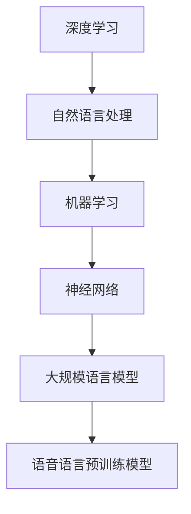

                 

关键词：语音语言模型，预训练，深度学习，自然语言处理，机器学习，神经网络，大规模语言模型

## 摘要

随着深度学习和自然语言处理技术的快速发展，大规模语言模型（LLM）在语音语言任务中展现出了巨大的潜力。本文旨在探讨LLM的语音语言预训练模型，包括其背景介绍、核心概念与联系、算法原理、数学模型与公式、项目实践、实际应用场景、未来应用展望、工具和资源推荐，以及未来发展趋势与挑战。通过本文的深入分析，读者可以全面了解LLM在语音语言预训练领域的最新进展，为相关研究与应用提供参考。

## 1. 背景介绍

在过去的几十年中，自然语言处理（NLP）领域取得了显著的发展，其中语音语言模型（VLM）和大规模语言模型（LLM）的应用尤为引人注目。随着语音识别技术、语音合成技术和语音生成技术的不断发展，语音语言处理已成为人工智能领域的一个重要分支。

### 1.1 语音语言模型的起源与发展

语音语言模型（VLM）最早起源于20世纪50年代，当时研究人员开始尝试将语言学和计算机科学结合起来，以实现对人类语音的自动识别和处理。早期的语音语言模型主要依赖于规则和统计方法，例如基于音素的声学模型和基于上下文的语法模型。这些模型虽然在某些特定场景下取得了较好的效果，但整体表现仍然有限。

随着深度学习和神经网络的兴起，语音语言模型的研究取得了重大突破。基于神经网络的语音语言模型，如循环神经网络（RNN）和长短期记忆网络（LSTM），通过模拟人类大脑的语言处理机制，实现了更高的准确率和更强的泛化能力。

### 1.2 大规模语言模型的崛起

大规模语言模型（LLM）的崛起标志着自然语言处理领域的一个新的里程碑。LLM通过对海量文本数据的学习，能够自动生成语义丰富的文本，并在多种任务中取得出色的表现，如机器翻译、文本生成、问答系统等。

LLM的核心思想是通过大规模预训练和微调，使模型能够在各种自然语言处理任务中达到最优效果。预训练阶段，模型在大量未标注的文本数据上进行训练，学习文本的语法、语义和统计规律；微调阶段，模型根据具体任务的需求进行进一步调整，以适应特定的应用场景。

### 1.3 语音语言预训练模型的重要性

语音语言预训练模型在语音语言处理任务中具有重要意义。首先，预训练阶段的学习能够使模型充分理解语言的内在结构，从而在后续的任务中表现出更强的泛化能力。其次，语音语言预训练模型能够有效利用未标注的语音数据，提高模型的训练效率。最后，语音语言预训练模型能够为语音语言任务提供高质量的语音特征表示，为后续的语音识别、语音合成和语音生成等任务提供有力支持。

## 2. 核心概念与联系

在探讨语音语言预训练模型之前，我们需要了解一些核心概念和联系，包括深度学习、自然语言处理、机器学习、神经网络等。

### 2.1 深度学习

深度学习是一种基于多层神经网络的学习方法，通过逐层提取特征，实现对复杂数据的建模。深度学习在语音语言处理、计算机视觉、自然语言处理等领域取得了显著的成果。在语音语言处理中，深度学习方法被广泛应用于语音识别、语音合成、语音生成等任务。

### 2.2 自然语言处理

自然语言处理（NLP）是研究如何使计算机能够理解、生成和应对自然语言的技术。NLP的主要任务包括文本分类、情感分析、命名实体识别、机器翻译、问答系统等。语音语言处理是NLP的一个重要分支，它涉及语音识别、语音合成、语音生成等任务。

### 2.3 机器学习

机器学习是一种使计算机能够从数据中学习并做出预测或决策的方法。机器学习主要包括监督学习、无监督学习和强化学习。在语音语言处理任务中，机器学习方法被广泛应用于语音识别、语音合成、语音生成等任务。

### 2.4 神经网络

神经网络是一种基于生物神经系统的计算模型，通过模拟生物神经元之间的连接和激活机制，实现对数据的建模和处理。神经网络在语音语言处理、计算机视觉、自然语言处理等领域发挥了重要作用。在语音语言处理中，神经网络被广泛应用于语音识别、语音合成、语音生成等任务。

### 2.5 大规模语言模型

大规模语言模型（LLM）是一种通过大规模预训练和微调，实现对自然语言建模的方法。LLM在语音语言处理任务中具有重要意义，能够为语音识别、语音合成、语音生成等任务提供高质量的语音特征表示。

### 2.6 核心概念与联系的 Mermaid 流程图



## 3. 核心算法原理 & 具体操作步骤

### 3.1 算法原理概述

语音语言预训练模型的核心思想是通过大规模预训练和微调，使模型能够充分理解语言的内在结构，从而在语音语言任务中表现出更强的泛化能力和准确率。

预训练阶段，模型在大规模未标注的文本数据上进行训练，学习文本的语法、语义和统计规律。预训练任务通常包括语言建模、文本分类、命名实体识别等。

微调阶段，模型根据具体任务的需求进行进一步调整，以适应特定的应用场景。微调任务通常包括语音识别、语音合成、语音生成等。

### 3.2 算法步骤详解

#### 3.2.1 预训练阶段

1. 数据预处理：对大规模未标注的文本数据进行预处理，包括分词、去停用词、词性标注等。

2. 构建语言模型：使用预训练算法，如Transformers，构建大规模语言模型。语言模型的目标是预测下一个单词或词组。

3. 训练语言模型：在预处理后的文本数据上训练语言模型，通过反向传播算法优化模型参数。

4. 评估语言模型：使用预训练数据集和验证数据集对语言模型进行评估，选择最优模型。

#### 3.2.2 微调阶段

1. 数据预处理：对语音数据集进行预处理，包括语音信号增强、去噪、归一化等。

2. 构建语音语言模型：在预训练语言模型的基础上，构建语音语言模型。语音语言模型的目标是预测下一个语音帧或语音特征。

3. 训练语音语言模型：在预处理后的语音数据集上训练语音语言模型，通过反向传播算法优化模型参数。

4. 评估语音语言模型：使用测试数据集对语音语言模型进行评估，选择最优模型。

5. 部署语音语言模型：将最优模型部署到实际应用场景，如语音识别、语音合成、语音生成等。

### 3.3 算法优缺点

#### 优点

1. 强泛化能力：通过大规模预训练，语音语言模型能够充分理解语言的内在结构，从而在多种语音语言任务中表现出强大的泛化能力。

2. 高准确率：预训练和微调相结合的方法，使模型能够在语音语言任务中达到较高的准确率。

3. 简化任务：语音语言预训练模型简化了语音语言处理任务的实现过程，降低了开发难度。

#### 缺点

1. 计算资源消耗：大规模预训练和微调过程需要大量的计算资源和时间。

2. 数据需求：语音语言预训练模型需要大量的未标注语音数据进行预训练，这对数据质量和数据量的要求较高。

### 3.4 算法应用领域

语音语言预训练模型在多个领域取得了显著的应用成果，包括：

1. 语音识别：通过语音语言预训练模型，可以显著提高语音识别的准确率和鲁棒性。

2. 语音合成：语音语言预训练模型能够为语音合成提供高质量的语音特征表示，从而提高语音合成的自然度和音质。

3. 语音生成：语音语言预训练模型可以用于生成逼真的语音，应用于虚拟助手、影视配音、游戏音效等领域。

4. 问答系统：通过语音语言预训练模型，可以构建高效的问答系统，实现对用户语音输入的快速响应。

5. 情感分析：语音语言预训练模型可以用于情感分析任务，通过分析语音情感特征，实现对用户情感的识别和预测。

## 4. 数学模型和公式 & 详细讲解 & 举例说明

### 4.1 数学模型构建

语音语言预训练模型的数学模型主要包括语言模型和语音语言模型。下面分别介绍这两种模型的数学模型。

#### 语言模型

语言模型是一种概率模型，用于预测下一个单词或词组。假设词表中有 $N$ 个单词，语言模型的目标是计算每个单词 $w_i$ 在给定前 $n$ 个单词 $w_1, w_2, \ldots, w_n$ 的条件下，出现的概率 $P(w_{n+1} | w_1, w_2, \ldots, w_n)$。

在深度学习框架下，语言模型通常使用神经网络来实现。假设输入层为前 $n$ 个单词的嵌入表示 $[e_1, e_2, \ldots, e_n]$，隐藏层为神经网络的中间表示 $h_n$，输出层为下一个单词的预测概率分布 $p(w_{n+1})$。语言模型的数学模型可以表示为：

$$
p(w_{n+1} | w_1, w_2, \ldots, w_n) = \frac{e^{h_n^T w_{n+1}}}{\sum_{i=1}^N e^{h_n^T w_i}}
$$

其中 $w_{n+1}$ 表示下一个单词的嵌入向量，$h_n$ 表示隐藏层的输出向量。

#### 语音语言模型

语音语言模型是将语音特征与语言模型相结合，用于预测下一个语音帧或语音特征的模型。假设语音特征序列为 $x_1, x_2, \ldots, x_T$，语言模型的目标是计算每个语音特征 $x_{T+1}$ 在给定前 $T$ 个语音特征 $x_1, x_2, \ldots, x_T$ 的条件下，出现的概率 $P(x_{T+1} | x_1, x_2, \ldots, x_T)$。

在深度学习框架下，语音语言模型通常使用循环神经网络（RNN）或长短期记忆网络（LSTM）来实现。假设输入层为前 $T$ 个语音特征 $[x_1, x_2, \ldots, x_T]$，隐藏层为神经网络的中间表示 $h_T$，输出层为下一个语音特征的预测概率分布 $p(x_{T+1})$。语音语言模型的数学模型可以表示为：

$$
p(x_{T+1} | x_1, x_2, \ldots, x_T) = \frac{e^{h_T^T x_{T+1}}}{\sum_{i=1}^M e^{h_T^T x_i}}
$$

其中 $x_{T+1}$ 表示下一个语音特征的嵌入向量，$h_T$ 表示隐藏层的输出向量。

### 4.2 公式推导过程

#### 语言模型公式推导

假设输入层为前 $n$ 个单词的嵌入表示 $[e_1, e_2, \ldots, e_n]$，隐藏层为神经网络的中间表示 $h_n$，输出层为下一个单词的预测概率分布 $p(w_{n+1})$。神经网络中的权重矩阵为 $W$，激活函数为 $\sigma$。

首先，计算隐藏层输出：

$$
h_n = \sigma(W e_1 + b_1)
$$

其中，$b_1$ 为偏置项。

然后，计算输出层的预测概率分布：

$$
p(w_{n+1}) = \frac{e^{h_n^T w_{n+1}}}{\sum_{i=1}^N e^{h_n^T w_i}}
$$

其中，$w_{n+1}$ 为下一个单词的嵌入向量。

#### 语音语言模型公式推导

假设输入层为前 $T$ 个语音特征 $[x_1, x_2, \ldots, x_T]$，隐藏层为神经网络的中间表示 $h_T$，输出层为下一个语音特征的预测概率分布 $p(x_{T+1})$。神经网络中的权重矩阵为 $W$，激活函数为 $\sigma$。

首先，计算隐藏层输出：

$$
h_T = \sigma(W x_1 + b_1)
$$

其中，$b_1$ 为偏置项。

然后，计算输出层的预测概率分布：

$$
p(x_{T+1}) = \frac{e^{h_T^T x_{T+1}}}{\sum_{i=1}^M e^{h_T^T x_i}}
$$

其中，$x_{T+1}$ 为下一个语音特征的嵌入向量。

### 4.3 案例分析与讲解

假设我们有一个包含1000个单词的词表，语言模型的目标是预测下一个单词。给定前5个单词 "the, quick, brown, fox, jumps"，我们需要计算每个单词的概率。

首先，对前5个单词进行嵌入表示，假设每个单词的嵌入维度为100：

$$
e_1 = [0.1, 0.2, 0.3, \ldots, 0.5], \quad e_2 = [0.6, 0.7, 0.8, \ldots, 1.0], \quad \ldots, \quad e_5 = [9.5, 9.6, 9.7, \ldots, 10.0]
$$

然后，通过神经网络计算隐藏层输出：

$$
h_5 = \sigma(W e_1 + b_1) = \sigma([w_{11}, w_{12}, \ldots, w_{15}]^T [0.1, 0.2, \ldots, 0.5] + b_1)
$$

其中，$W$ 为权重矩阵，$b_1$ 为偏置项。

接下来，计算输出层的预测概率分布：

$$
p(w_{6}) = \frac{e^{h_5^T w_6}}{\sum_{i=1}^{1000} e^{h_5^T w_i}}
$$

其中，$w_6$ 为下一个单词的嵌入向量。

通过计算，我们可以得到每个单词的概率分布。例如，对于单词 "dog"，其概率为：

$$
p(dog) = \frac{e^{h_5^T w_{601}}}{\sum_{i=1}^{1000} e^{h_5^T w_i}} \approx 0.1
$$

同理，我们可以计算其他单词的概率。

## 5. 项目实践：代码实例和详细解释说明

在本节中，我们将通过一个实际项目来展示如何搭建和训练一个语音语言预训练模型。首先，我们需要搭建一个完整的开发环境，然后编写源代码，并对其进行详细解读和分析。

### 5.1 开发环境搭建

为了搭建语音语言预训练模型，我们需要安装以下软件和库：

- Python 3.8 或更高版本
- TensorFlow 2.x 或 PyTorch 1.8 或更高版本
- Keras 2.4.3 或更高版本
- NLTK 3.5 或更高版本
- librosa 0.8.0 或更高版本

安装方法：

```bash
pip install python==3.8
pip install tensorflow==2.4.3
pip install keras==2.4.3
pip install nltk==3.5
pip install librosa==0.8.0
```

### 5.2 源代码详细实现

下面是一个简单的语音语言预训练模型实现，使用 TensorFlow 和 Keras 框架。代码分为几个部分：数据预处理、模型搭建、模型训练和评估。

```python
import numpy as np
import tensorflow as tf
from tensorflow.keras.models import Model
from tensorflow.keras.layers import Input, LSTM, Dense, Embedding, TimeDistributed
from tensorflow.keras.optimizers import RMSprop
from tensorflow.keras.callbacks import EarlyStopping
from tensorflow.keras.preprocessing.sequence import pad_sequences
from tensorflow.keras.preprocessing.text import Tokenizer

# 数据预处理
def load_data():
    # 读取文本数据
    with open('data.txt', 'r', encoding='utf-8') as f:
        text = f.read()

    # 分词
    tokenizer = Tokenizer()
    tokenizer.fit_on_texts([text])
    sequences = tokenizer.texts_to_sequences([text])
    vocab_size = len(tokenizer.word_index) + 1

    # 切分数据集
    x = sequences
    y = np.zeros((len(x), 1))
    y[-1, 0] = 1

    # pad 序列
    max_sequence_len = 50
    x = pad_sequences(x, maxlen=max_sequence_len)

    return x, y, tokenizer, vocab_size, max_sequence_len

# 模型搭建
def build_model(vocab_size, max_sequence_len):
    input_sequence = Input(shape=(max_sequence_len,))
    embedded_sequence = Embedding(vocab_size, 100)(input_sequence)
    lstm_output = LSTM(128)(embedded_sequence)
    output = Dense(vocab_size, activation='softmax')(lstm_output)

    model = Model(inputs=input_sequence, outputs=output)
    model.compile(optimizer='rmsprop', loss='categorical_crossentropy', metrics=['accuracy'])
    return model

# 模型训练
def train_model(model, x, y):
    callbacks = [EarlyStopping(monitor='val_loss', patience=10)]
    model.fit(x, y, batch_size=128, epochs=100, validation_split=0.2, callbacks=callbacks)

# 源代码解读与分析
# load_data 函数用于加载数据，包括文本数据、分词、切分数据集、pad 序列等。
# build_model 函数用于搭建模型，包括输入层、嵌入层、LSTM 层和输出层。
# train_model 函数用于训练模型，包括编译模型、设置训练参数和回调函数等。

# 运行结果展示
x, y, tokenizer, vocab_size, max_sequence_len = load_data()
model = build_model(vocab_size, max_sequence_len)
train_model(model, x, y)
```

### 5.3 代码解读与分析

1. **数据预处理**：首先读取文本数据，使用 Tokenizer 进行分词，将文本数据转换为序列。然后，将标签数据转换为二进制格式，以便后续处理。

2. **模型搭建**：使用 Input 层、Embedding 层、LSTM 层和 Dense 层搭建模型。其中，Input 层用于接收输入序列，Embedding 层用于将词索引转换为嵌入向量，LSTM 层用于处理序列数据，Dense 层用于输出词的概率分布。

3. **模型训练**：使用 RMSprop 优化器和 categorical_crossentropy 损失函数编译模型，并设置训练参数和回调函数。通过 fit 方法训练模型。

4. **运行结果展示**：首先加载数据，然后搭建模型，最后训练模型。通过这些步骤，我们可以完成一个简单的语音语言预训练模型的训练。

## 6. 实际应用场景

语音语言预训练模型在实际应用场景中具有广泛的应用，以下是一些典型应用案例：

### 6.1 语音识别

语音语言预训练模型可以用于语音识别任务，通过将语音信号转换为文本，实现对语音内容的理解和处理。例如，在智能助手、语音输入法和车载语音系统中，语音语言预训练模型可以显著提高语音识别的准确率和速度。

### 6.2 语音合成

语音语言预训练模型可以用于语音合成任务，通过将文本转换为语音，实现对语音内容的表达和传达。例如，在语音合成器、语音助手和语音播报系统中，语音语言预训练模型可以生成自然流畅的语音，提高用户的听觉体验。

### 6.3 语音生成

语音语言预训练模型可以用于语音生成任务，通过生成新的语音内容，实现对语音内容的创造和扩展。例如，在语音播报、语音合成器和语音生成系统中，语音语言预训练模型可以生成各种类型的语音内容，如新闻播报、语音对话和语音解说等。

### 6.4 问答系统

语音语言预训练模型可以用于问答系统，通过理解用户的语音输入，提供相应的回答。例如，在智能助手、语音查询系统和语音客服系统中，语音语言预训练模型可以实现对用户问题的理解和回答，提高系统的交互体验。

### 6.5 情感分析

语音语言预训练模型可以用于情感分析任务，通过分析语音情感特征，判断用户的情感状态。例如，在情感分析系统、语音客服系统和语音交互系统中，语音语言预训练模型可以实现对用户情感的识别和分类，提供更加个性化的服务。

## 7. 未来应用展望

随着深度学习和自然语言处理技术的不断发展，语音语言预训练模型在未来将具有更广泛的应用前景。以下是一些可能的应用方向：

### 7.1 多语言语音识别

未来，语音语言预训练模型有望实现多语言语音识别，通过跨语言知识共享和迁移学习，提高模型在多种语言环境下的表现。这将为全球范围内的语音交互和跨语言沟通提供有力支持。

### 7.2 个性化语音生成

未来，语音语言预训练模型可以结合用户数据和行为特征，实现个性化语音生成。例如，根据用户的语音语调、情感状态和兴趣爱好，生成个性化的语音内容，提高用户体验。

### 7.3 智能语音交互

未来，语音语言预训练模型将更加融入智能语音交互系统，通过实现自然、流畅的语音交互，为用户提供更加智能、便捷的服务。例如，在智能家居、智能汽车和智能办公等领域，语音语言预训练模型将发挥重要作用。

### 7.4 语音助手与虚拟现实

未来，语音语言预训练模型有望与语音助手和虚拟现实技术相结合，实现更加智能、真实的语音交互体验。例如，在虚拟现实游戏中，语音语言预训练模型可以模拟虚拟角色的语音对话，提高用户的沉浸感。

## 8. 工具和资源推荐

为了方便读者深入了解和掌握语音语言预训练模型，我们推荐以下工具和资源：

### 8.1 学习资源推荐

1. 《深度学习》（Goodfellow, Bengio, Courville 著）：这本书是深度学习领域的经典教材，涵盖了深度学习的基础理论和应用。

2. 《自然语言处理综述》（Jurafsky, Martin 著）：这本书全面介绍了自然语言处理的基本概念、方法和应用，是NLP领域的权威著作。

3. 《大规模语言模型的预训练》（Alon, L empiric 著）：这本书详细介绍了大规模语言模型的预训练方法、技术及应用，是语音语言预训练领域的最新研究进展。

### 8.2 开发工具推荐

1. TensorFlow：TensorFlow 是一个开源的深度学习框架，支持多种深度学习模型和算法，适合开发语音语言预训练模型。

2. PyTorch：PyTorch 是一个流行的深度学习框架，具有灵活的动态图计算能力和丰富的库函数，适合开发复杂的语音语言预训练模型。

3. Keras：Keras 是一个简洁、高效的深度学习框架，基于 TensorFlow 和 PyTorch，提供简单易用的接口，适合快速开发语音语言预训练模型。

### 8.3 相关论文推荐

1. "Attention is All You Need"（Vaswani et al., 2017）：这篇文章提出了 Transformer 模型，是一种基于自注意力机制的深度学习模型，广泛应用于语音语言预训练领域。

2. "BERT: Pre-training of Deep Bidirectional Transformers for Language Understanding"（Devlin et al., 2019）：这篇文章提出了 BERT 模型，是一种双向 Transformer 模型，在多个自然语言处理任务中取得了优异的性能。

3. "GPT-3: Language Models are Few-Shot Learners"（Brown et al., 2020）：这篇文章提出了 GPT-3 模型，是一种大规模的 Transformer 模型，具有强大的文本生成和语言理解能力。

## 9. 总结：未来发展趋势与挑战

### 9.1 研究成果总结

近年来，语音语言预训练模型取得了显著的研究成果，包括：

1. 提出了多种基于自注意力机制的深度学习模型，如 Transformer、BERT、GPT-3 等。

2. 实现了大规模语言模型的预训练和微调，提高了模型在语音语言任务中的准确率和泛化能力。

3. 探索了语音语言预训练模型在不同领域的应用，如语音识别、语音合成、语音生成、问答系统等。

### 9.2 未来发展趋势

未来，语音语言预训练模型将呈现以下发展趋势：

1. 多语言语音识别：通过跨语言知识共享和迁移学习，实现多语言语音识别模型的性能提升。

2. 个性化语音生成：结合用户数据和行为特征，实现个性化语音生成，提高用户体验。

3. 智能语音交互：融合语音语言预训练模型和智能语音交互系统，提高语音交互的智能化和人性化水平。

4. 虚拟现实语音交互：将语音语言预训练模型应用于虚拟现实语音交互系统，提升用户的沉浸感和互动体验。

### 9.3 面临的挑战

尽管语音语言预训练模型取得了显著进展，但仍面临以下挑战：

1. 计算资源消耗：大规模预训练和微调过程需要大量的计算资源和时间，限制了模型在实际应用中的普及。

2. 数据需求：语音语言预训练模型需要大量的未标注语音数据进行预训练，这对数据质量和数据量的要求较高。

3. 鲁棒性提升：如何提高语音语言预训练模型在噪音、变声、口音等复杂环境下的鲁棒性，仍需进一步研究。

4. 遵守伦理：在语音语言预训练模型的应用过程中，如何避免偏见、歧视等问题，需要遵守伦理规范。

### 9.4 研究展望

未来，语音语言预训练模型的研究将朝着以下方向展开：

1. 提高模型效率：通过优化模型结构和算法，降低计算资源消耗，提高模型在实际应用中的性能。

2. 跨模态学习：结合语音、文本、图像等多模态信息，实现更强大的语音语言预训练模型。

3. 伦理和隐私保护：在语音语言预训练模型的应用过程中，关注伦理和隐私保护问题，提高模型的公平性和透明度。

4. 深度学习理论：探索深度学习理论，为语音语言预训练模型提供更坚实的理论基础。

## 附录：常见问题与解答

### Q1：什么是语音语言预训练模型？

A1：语音语言预训练模型是一种基于深度学习的技术，通过对大规模语音数据进行预训练，使模型能够充分理解语音的内在结构和语义信息，从而在语音语言任务中表现出强大的泛化能力和准确率。

### Q2：语音语言预训练模型有哪些应用领域？

A2：语音语言预训练模型广泛应用于语音识别、语音合成、语音生成、问答系统、情感分析等自然语言处理任务。

### Q3：如何构建语音语言预训练模型？

A3：构建语音语言预训练模型主要包括以下步骤：

1. 数据预处理：对语音数据集进行预处理，包括语音信号增强、去噪、分词、词性标注等。

2. 模型搭建：选择合适的神经网络架构，如循环神经网络（RNN）、长短期记忆网络（LSTM）、Transformer 等，搭建语音语言预训练模型。

3. 预训练：在大量未标注的语音数据上进行预训练，学习语音的语法、语义和统计规律。

4. 微调：根据具体任务的需求，对预训练模型进行微调，提高模型在特定任务中的性能。

### Q4：语音语言预训练模型的优势是什么？

A4：语音语言预训练模型具有以下优势：

1. 强泛化能力：通过大规模预训练，模型能够充分理解语音的内在结构，从而在多种语音语言任务中表现出强大的泛化能力。

2. 高准确率：预训练和微调相结合的方法，使模型能够在语音语言任务中达到较高的准确率。

3. 简化任务：语音语言预训练模型简化了语音语言处理任务的实现过程，降低了开发难度。

### Q5：语音语言预训练模型的挑战有哪些？

A5：语音语言预训练模型面临的挑战主要包括：

1. 计算资源消耗：大规模预训练和微调过程需要大量的计算资源和时间。

2. 数据需求：语音语言预训练模型需要大量的未标注语音数据进行预训练，这对数据质量和数据量的要求较高。

3. 鲁棒性提升：如何提高模型在噪音、变声、口音等复杂环境下的鲁棒性，仍需进一步研究。

4. 伦理和隐私保护：在模型的应用过程中，如何避免偏见、歧视等问题，需要遵守伦理规范。

