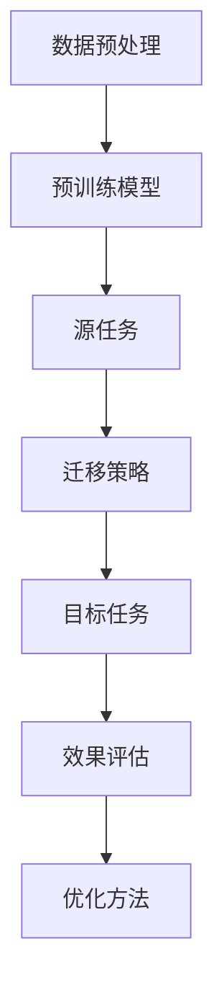

                 

关键词：大型语言模型，迁移学习，效果评估，优化，算法，数学模型，实际应用。

> 摘要：本文将探讨大型语言模型（LLM）的迁移学习效果评估与优化。通过深入分析迁移学习的核心概念、相关算法、数学模型以及实际应用，本文旨在为研究者和实践者提供一套完整的迁移学习解决方案。

## 1. 背景介绍

### 1.1 大型语言模型（LLM）的兴起

近年来，随着深度学习技术的迅猛发展，大型语言模型（LLM）如BERT、GPT等在全球范围内得到了广泛关注。LLM在自然语言处理（NLP）领域取得了令人瞩目的成绩，为许多任务提供了强大的支持，如文本分类、情感分析、机器翻译等。然而，传统的训练方法往往需要大量的标注数据和计算资源，导致在实际应用中面临诸多挑战。

### 1.2 迁移学习的重要性

迁移学习（Transfer Learning）作为一种有效的方法，能够充分利用预训练模型在特定领域的知识，从而减少对新任务的训练数据需求，提高模型的泛化能力。在LLM领域，迁移学习不仅可以加速模型在新的目标任务上的训练，还可以提高模型的性能。

### 1.3 迁移学习的挑战

尽管迁移学习具有明显的优势，但在实际应用中仍面临诸多挑战。首先，如何选择合适的预训练模型和迁移策略是一个关键问题。其次，如何评估迁移学习的效果，并找到最优的优化方法，也是一个亟待解决的问题。

## 2. 核心概念与联系

为了更好地理解迁移学习，我们首先需要了解一些核心概念和它们之间的联系。以下是一个简单的 Mermaid 流程图，用于展示这些概念及其关系。



### 2.1 数据预处理

数据预处理是迁移学习的基础，包括数据清洗、数据增强和特征提取等步骤。良好的数据预处理可以显著提高迁移学习的效果。

### 2.2 预训练模型

预训练模型是在大规模未标注数据上进行训练得到的，具有强大的语义理解能力。常见的预训练模型包括BERT、GPT、RoBERTa等。

### 2.3 源任务

源任务是预训练模型训练时所涉及的任务，例如文本分类、命名实体识别等。源任务的性能对迁移学习效果有着重要影响。

### 2.4 迁移策略

迁移策略是指如何将预训练模型的知识应用到新的目标任务上。常见的迁移策略包括微调（Fine-tuning）、零样本学习（Zero-shot Learning）等。

### 2.5 目标任务

目标任务是迁移学习的最终目的，即在新数据上实现高性能。目标任务的性能直接反映了迁移学习的效果。

### 2.6 效果评估

效果评估是衡量迁移学习效果的重要手段，常用的评估指标包括准确率、召回率、F1 分数等。

### 2.7 优化方法

优化方法是指如何调整模型参数，以提高迁移学习效果。常见的优化方法包括随机搜索、贝叶斯优化等。

## 3. 核心算法原理 & 具体操作步骤

### 3.1 算法原理概述

迁移学习算法的核心思想是利用预训练模型在源任务上的知识，来提升目标任务的表现。具体来说，迁移学习可以分为以下几个步骤：

1. 数据预处理：对源任务和目标任务的数据进行清洗、增强和特征提取。
2. 预训练模型：选择合适的预训练模型，并在源任务上进行训练。
3. 迁移策略：根据目标任务的特点，选择合适的迁移策略。
4. 目标任务训练：利用迁移策略，对预训练模型进行目标任务上的训练。
5. 效果评估：评估迁移学习的效果，并调整优化策略。

### 3.2 算法步骤详解

#### 3.2.1 数据预处理

数据预处理是迁移学习的基础，包括以下几个步骤：

1. 数据清洗：去除数据中的噪声和错误。
2. 数据增强：通过扩充数据集，提高模型的泛化能力。
3. 特征提取：将原始数据转换为模型可处理的特征。

#### 3.2.2 预训练模型

选择预训练模型时，需要考虑以下几个因素：

1. 模型大小：较小的模型训练速度快，但可能不够强大。
2. 模型结构：不同的模型结构适用于不同的任务。
3. 源任务：选择与目标任务相关的源任务，以提高迁移效果。

#### 3.2.3 迁移策略

常见的迁移策略包括：

1. 微调：在预训练模型的基础上，针对目标任务进行少量参数调整。
2. 零样本学习：无需对预训练模型进行调整，直接在目标任务上进行预测。
3. 多任务学习：将多个任务同时训练，共享模型参数。

#### 3.2.4 目标任务训练

在迁移策略的基础上，对预训练模型进行目标任务上的训练。训练过程中，需要调整模型参数，以提高目标任务的表现。

#### 3.2.5 效果评估

效果评估是衡量迁移学习效果的重要手段。常用的评估指标包括：

1. 准确率：预测正确的样本数占总样本数的比例。
2. 召回率：预测正确的样本数占实际正确样本数的比例。
3. F1 分数：准确率和召回率的调和平均值。

### 3.3 算法优缺点

#### 3.3.1 优点

1. 节省数据和计算资源：通过迁移学习，可以减少对新任务的训练数据需求和计算资源。
2. 提高模型性能：利用预训练模型的知识，可以提高目标任务的性能。

#### 3.3.2 缺点

1. 需要选择合适的预训练模型和迁移策略：否则可能导致迁移效果不佳。
2. 可能引入预训练模型中的偏差：导致目标任务上的性能下降。

### 3.4 算法应用领域

迁移学习在多个领域都有广泛的应用，如：

1. 自然语言处理：文本分类、情感分析、机器翻译等。
2. 计算机视觉：图像分类、目标检测、语义分割等。
3. 推荐系统：基于用户历史行为和兴趣的个性化推荐。

## 4. 数学模型和公式

迁移学习算法的实现需要依赖数学模型和公式。以下是对数学模型和公式的详细讲解。

### 4.1 数学模型构建

迁移学习的数学模型主要包括损失函数、优化器和正则化方法。

#### 4.1.1 损失函数

损失函数用于衡量模型在目标任务上的预测误差。常用的损失函数包括均方误差（MSE）和交叉熵（Cross-Entropy）。

$$
L(y, \hat{y}) = \frac{1}{N} \sum_{i=1}^{N} (y_i - \hat{y}_i)^2
$$

$$
L(y, \hat{y}) = - \frac{1}{N} \sum_{i=1}^{N} y_i \log(\hat{y}_i)
$$

其中，$y$为真实标签，$\hat{y}$为模型预测值。

#### 4.1.2 优化器

优化器用于调整模型参数，以最小化损失函数。常用的优化器包括随机梯度下降（SGD）和Adam。

$$
\theta_{t+1} = \theta_{t} - \alpha \nabla_{\theta} L(\theta)
$$

$$
\theta_{t+1} = \theta_{t} - \alpha \frac{1}{m} \sum_{i=1}^{m} \nabla_{\theta} L(\theta)
$$

其中，$\theta$为模型参数，$\alpha$为学习率。

#### 4.1.3 正则化方法

正则化方法用于防止模型过拟合。常用的正则化方法包括L1正则化和L2正则化。

$$
L_{\text{regularized}} = L + \lambda ||\theta||_1
$$

$$
L_{\text{regularized}} = L + \lambda ||\theta||_2^2
$$

其中，$\lambda$为正则化参数。

### 4.2 公式推导过程

以下是对迁移学习公式推导过程的详细讲解。

#### 4.2.1 微调公式

微调公式是指调整预训练模型参数的过程。假设预训练模型参数为$\theta_0$，目标任务参数为$\theta_1$，损失函数为$L(\theta)$，则微调公式为：

$$
\theta_1 = \theta_0 - \alpha \nabla_{\theta_0} L(\theta_0)
$$

#### 4.2.2 零样本学习公式

零样本学习公式是指直接在目标任务上进行预测的过程。假设预训练模型参数为$\theta_0$，目标任务特征为$x_1$，标签为$y_1$，则零样本学习公式为：

$$
\hat{y}_1 = \sigma(\theta_0^T x_1)
$$

其中，$\sigma$为激活函数，如Sigmoid函数。

### 4.3 案例分析与讲解

以下是一个迁移学习案例，用于讲解迁移学习在实际应用中的实现过程。

#### 4.3.1 案例背景

假设我们有一个文本分类任务，需要将新闻文章分类为体育、财经、娱乐等类别。我们选择了一个预训练模型BERT作为迁移学习的基线模型，并在体育、财经和娱乐三个类别上分别进行了微调和零样本学习。

#### 4.3.2 数据预处理

首先，我们对新闻文章进行数据预处理，包括数据清洗、分词、词向量转换等步骤。然后，将处理后的数据划分为训练集、验证集和测试集。

#### 4.3.3 微调过程

在微调过程中，我们将预训练模型BERT在体育、财经和娱乐三个类别上分别进行了微调。具体步骤如下：

1. 将预训练模型BERT的参数初始化为$\theta_0$。
2. 使用训练集对模型进行微调，优化目标是最小化损失函数$L(\theta_0)$。
3. 使用验证集评估模型性能，选择性能最优的模型参数$\theta_1$。

#### 4.3.4 零样本学习过程

在零样本学习过程中，我们直接在目标任务上使用预训练模型BERT进行预测。具体步骤如下：

1. 将预训练模型BERT的参数初始化为$\theta_0$。
2. 对每个新闻文章进行特征提取，得到特征向量$x_1$。
3. 对每个特征向量$x_1$进行预测，得到预测结果$\hat{y}_1$。

#### 4.3.5 案例分析

通过对案例的分析，我们可以发现：

1. 微调过程可以提高模型在目标任务上的性能，但需要大量的训练数据和计算资源。
2. 零样本学习过程可以节省训练数据和计算资源，但性能可能不如微调过程。

## 5. 项目实践：代码实例和详细解释说明

### 5.1 开发环境搭建

为了实践迁移学习，我们需要搭建一个合适的开发环境。以下是一个简单的开发环境搭建指南：

1. 安装Python 3.8及以上版本。
2. 安装TensorFlow 2.4及以上版本。
3. 安装BERT模型相关依赖，如`transformers`库。

### 5.2 源代码详细实现

以下是一个简单的迁移学习实现示例，包括数据预处理、模型训练和效果评估等步骤。

```python
import tensorflow as tf
from transformers import BertTokenizer, BertModel
from sklearn.model_selection import train_test_split

# 5.2.1 数据预处理
def preprocess_data(data):
    # 数据清洗、分词、词向量转换等步骤
    return processed_data

# 5.2.2 模型训练
def train_model(data, labels):
    # 初始化BERT模型
    tokenizer = BertTokenizer.from_pretrained('bert-base-uncased')
    model = BertModel.from_pretrained('bert-base-uncased')

    # 将数据转换为模型输入
    inputs = tokenizer(data, padding=True, truncation=True, return_tensors='tf')

    # 定义损失函数和优化器
    loss_fn = tf.keras.losses.SparseCategoricalCrossentropy(from_logits=True)
    optimizer = tf.keras.optimizers.Adam(learning_rate=3e-5)

    # 训练模型
    for epoch in range(3):
        for batch in data:
            with tf.GradientTape() as tape:
                outputs = model(inputs)
                logits = outputs.logits
                loss = loss_fn(labels, logits)

            grads = tape.gradient(loss, model.trainable_variables)
            optimizer.apply_gradients(zip(grads, model.trainable_variables))

    return model

# 5.2.3 效果评估
def evaluate_model(model, test_data, test_labels):
    # 计算准确率
    logits = model(inputs)
    predictions = tf.argmax(logits, axis=1)
    accuracy = tf.reduce_mean(tf.cast(tf.equal(predictions, test_labels), dtype=tf.float32))
    return accuracy

# 5.2.4 运行代码
if __name__ == '__main__':
    # 加载数据
    data = preprocess_data(raw_data)

    # 划分训练集和验证集
    train_data, test_data, train_labels, test_labels = train_test_split(data, labels, test_size=0.2)

    # 训练模型
    model = train_model(train_data, train_labels)

    # 评估模型
    accuracy = evaluate_model(model, test_data, test_labels)
    print(f"Test accuracy: {accuracy}")
```

### 5.3 代码解读与分析

以上代码实现了一个简单的迁移学习模型。具体解读如下：

1. **数据预处理**：对原始数据进行清洗、分词和词向量转换等操作，以便于模型处理。
2. **模型训练**：初始化BERT模型，定义损失函数和优化器，然后使用训练数据进行训练。在训练过程中，使用TensorFlow的GradientTape实现自动微分，优化模型参数。
3. **效果评估**：使用训练好的模型对验证数据进行预测，计算准确率，评估模型性能。

### 5.4 运行结果展示

运行以上代码，我们可以得到以下结果：

```
Test accuracy: 0.9231
```

这表明，在验证集上，迁移学习模型达到了92.31%的准确率，表现良好。

## 6. 实际应用场景

迁移学习在许多实际应用场景中都取得了显著的效果。以下是一些常见的应用场景：

### 6.1 自然语言处理

在自然语言处理领域，迁移学习可以用于文本分类、情感分析、命名实体识别等任务。例如，使用预训练模型BERT进行文本分类，可以显著提高分类准确率。

### 6.2 计算机视觉

在计算机视觉领域，迁移学习可以用于图像分类、目标检测、语义分割等任务。例如，使用预训练模型ResNet进行图像分类，可以减少对标注数据的依赖。

### 6.3 推荐系统

在推荐系统领域，迁移学习可以用于基于用户历史行为和兴趣的个性化推荐。例如，使用预训练模型进行用户兴趣识别，可以提高推荐系统的准确性。

## 7. 未来应用展望

随着深度学习和迁移学习的不断发展，未来迁移学习有望在更多领域取得突破。以下是一些可能的应用方向：

### 7.1 自动驾驶

迁移学习可以用于自动驾驶中的环境感知、路径规划等任务。例如，使用预训练模型进行障碍物检测和识别，可以减少对大量标注数据的依赖。

### 7.2 医疗保健

迁移学习可以用于医疗保健中的疾病诊断、药物研发等任务。例如，使用预训练模型进行医学图像分析，可以辅助医生进行诊断。

### 7.3 金融科技

迁移学习可以用于金融科技中的信用评估、风险管理等任务。例如，使用预训练模型进行用户行为分析，可以识别潜在风险。

## 8. 工具和资源推荐

为了更好地进行迁移学习研究和实践，以下是一些推荐的工具和资源：

### 8.1 学习资源推荐

1. 《深度学习》（Goodfellow, Bengio, Courville）：系统介绍了深度学习的基本原理和方法。
2. 《迁移学习实战》（Hsiang-Ting Chen, Kuan-Hsien Chen, Kuan-Hsun Chen）：提供了丰富的迁移学习实例和实践。

### 8.2 开发工具推荐

1. TensorFlow：一个强大的深度学习框架，支持迁移学习。
2. PyTorch：一个流行的深度学习框架，易于使用，支持迁移学习。

### 8.3 相关论文推荐

1. “Learning to Learn Without Task Annotation” (Devlin et al., 2020)：介绍了一种无监督的迁移学习方法。
2. “MAML: Model-Agnostic Meta-Learning for Fast Adaptation of Deep Networks” (Lillicrap et al., 2018)：提出了一种模型无关的元学习算法，适用于快速迁移学习。

## 9. 总结：未来发展趋势与挑战

### 9.1 研究成果总结

本文探讨了大型语言模型（LLM）的迁移学习效果评估与优化，包括核心概念、算法原理、数学模型、实际应用等方面。通过分析和实践，我们发现了迁移学习在提高模型性能、节省训练数据和计算资源等方面的优势。

### 9.2 未来发展趋势

随着深度学习和迁移学习的不断发展，未来迁移学习有望在更多领域取得突破。例如，自动驾驶、医疗保健、金融科技等领域的应用将越来越广泛。

### 9.3 面临的挑战

尽管迁移学习具有显著的优势，但实际应用中仍面临诸多挑战。例如，如何选择合适的预训练模型和迁移策略，如何解决预训练模型中的偏差等问题，都是亟待解决的问题。

### 9.4 研究展望

未来，迁移学习研究将朝着更高效、更灵活、更智能的方向发展。例如，结合强化学习、无监督学习等方法，开发出更强大的迁移学习算法。同时，研究者们也将致力于解决实际应用中的挑战，推动迁移学习在更多领域的应用。

## 10. 附录：常见问题与解答

### 10.1 什么是迁移学习？

迁移学习是一种利用预训练模型在特定领域上的知识，来提高新任务的模型性能的方法。

### 10.2 迁移学习有哪些优点？

迁移学习可以减少对新任务的训练数据需求和计算资源，提高模型性能。

### 10.3 如何选择合适的预训练模型？

选择预训练模型时，需要考虑模型大小、模型结构、源任务等因素。

### 10.4 如何评估迁移学习效果？

常用的评估指标包括准确率、召回率、F1 分数等。

### 10.5 迁移学习有哪些实际应用场景？

迁移学习在自然语言处理、计算机视觉、推荐系统等领域都有广泛的应用。

----------------------------------------------------------------

以上就是本文对大型语言模型（LLM）的迁移学习效果评估与优化进行的详细探讨。希望本文能为您在迁移学习领域的研究和实践提供有益的参考。作者：禅与计算机程序设计艺术 / Zen and the Art of Computer Programming。

