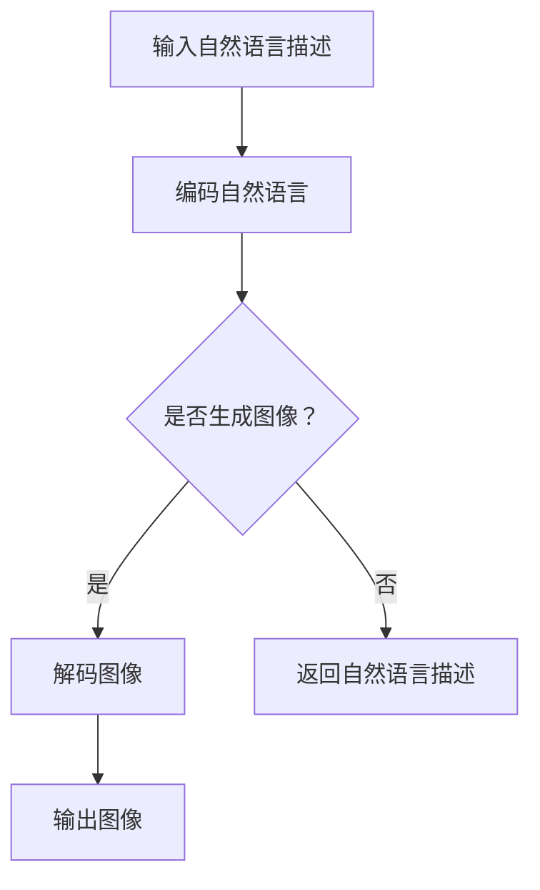

                 

关键词：LLM，视觉生成，图像智能，深度学习，自然语言处理，人工智能

摘要：本文将深入探讨大规模语言模型（LLM）在视觉生成领域的应用，如何通过将自然语言与图像生成相结合，开启图像智能的新时代。文章将详细介绍LLM视觉生成的核心概念、算法原理、数学模型、项目实践，并探讨其未来应用前景。

## 1. 背景介绍

随着人工智能技术的快速发展，计算机视觉和自然语言处理（NLP）领域取得了显著进步。深度学习技术在图像识别、语音识别和自然语言生成等方面取得了突破性成果。然而，将图像和自然语言相结合的视觉生成任务却一直是一个挑战。

传统的视觉生成方法主要集中在生成逼真的图像或视频，但往往缺乏对图像内容的理解和控制。另一方面，NLP模型擅长理解和生成自然语言，但难以直接处理图像信息。为了解决这个问题，研究人员提出了将大规模语言模型（LLM）应用于视觉生成的方法。

LLM视觉生成技术通过将自然语言描述与图像生成相结合，实现了对图像内容的高效理解和控制。该方法利用LLM强大的语义理解能力，将自然语言描述转换为图像生成任务，从而生成符合描述的图像。

## 2. 核心概念与联系

### 2.1. 大规模语言模型（LLM）

大规模语言模型（LLM）是一种基于深度学习的自然语言处理模型，通过大规模文本数据进行训练，具有强大的语义理解能力。常见的LLM模型包括GPT、BERT和T5等。这些模型通过学习语言中的规律和模式，能够生成连贯、自然的文本。

### 2.2. 图像生成模型

图像生成模型是一种利用深度学习技术生成逼真图像的方法。常见的图像生成模型包括生成对抗网络（GAN）和变分自编码器（VAE）等。这些模型通过学习大量图像数据，能够生成符合真实图像分布的图像。

### 2.3. 视觉生成

视觉生成是指利用计算机视觉和自然语言处理技术生成符合描述的图像。视觉生成技术通过将自然语言描述转换为图像生成任务，实现了对图像内容的高效理解和控制。

### 2.4. Mermaid 流程图

以下是一个Mermaid流程图，展示了LLM视觉生成的基本流程：



## 3. 核心算法原理 & 具体操作步骤

### 3.1. 算法原理概述

LLM视觉生成算法的基本原理是将自然语言描述编码为向量表示，然后利用图像生成模型将向量表示解码为图像。具体步骤如下：

1. 输入自然语言描述，利用文本编码器将其转换为向量表示。
2. 利用图像生成模型，将向量表示解码为图像。
3. 输出生成的图像。

### 3.2. 算法步骤详解

1. **输入自然语言描述**：用户输入一个自然语言描述，例如“生成一张美丽的海滩照片”。

2. **编码自然语言**：利用文本编码器（如BERT、GPT等）将自然语言描述转换为向量表示。这个过程称为编码。

3. **解码图像**：利用图像生成模型（如GAN、VAE等）将编码后的向量表示解码为图像。这个过程称为解码。

4. **输出图像**：生成图像并展示给用户。

### 3.3. 算法优缺点

#### 优点：

- **高效性**：LLM视觉生成算法能够在短时间内生成符合描述的图像。
- **多样性**：图像生成模型能够生成具有多样性的图像，满足用户的不同需求。
- **可控性**：用户可以通过自然语言描述控制图像内容，实现个性化生成。

#### 缺点：

- **计算成本**：训练大规模语言模型和图像生成模型需要大量的计算资源和时间。
- **质量稳定性**：生成图像的质量和稳定性受到训练数据和模型参数的影响。

### 3.4. 算法应用领域

LLM视觉生成算法可以应用于多个领域，如：

- **艺术创作**：艺术家可以利用该技术创作出具有独特风格的图像作品。
- **游戏开发**：游戏开发者可以利用该技术快速生成各种场景和角色图像，提高游戏开发的效率。
- **广告创意**：广告公司可以利用该技术生成个性化的广告图像，提高广告的吸引力。

## 4. 数学模型和公式 & 详细讲解 & 举例说明

### 4.1. 数学模型构建

LLM视觉生成算法的核心在于将自然语言描述转换为向量表示，以及将向量表示解码为图像。以下是相关的数学模型和公式：

#### 4.1.1. 自然语言描述编码

假设输入的自然语言描述为$$x$$，文本编码器将其编码为向量表示$$\mathbf{z}$$：

$$
\mathbf{z} = \text{Encoder}(\mathbf{x})
$$

其中，Encoder是一个神经网络模型，用于将自然语言描述转换为向量表示。

#### 4.1.2. 图像生成

假设图像生成模型为$$\text{Generator}$$，输入编码后的向量表示$$\mathbf{z}$$，输出图像$$\mathbf{y}$$：

$$
\mathbf{y} = \text{Generator}(\mathbf{z})
$$

其中，Generator是一个神经网络模型，用于将向量表示解码为图像。

### 4.2. 公式推导过程

#### 4.2.1. 自然语言描述编码

假设文本编码器是一个多层感知机（MLP）模型，其输入层、隐藏层和输出层分别为$$\mathbf{X}, \mathbf{H}, \mathbf{Z}$$，权重矩阵为$$\mathbf{W}$$，偏置矩阵为$$\mathbf{b}$$。则：

$$
\mathbf{H} = \sigma(\mathbf{W}\mathbf{X} + \mathbf{b})
$$

$$
\mathbf{Z} = \mathbf{W}\mathbf{H} + \mathbf{b}
$$

其中，$$\sigma$$表示激活函数，如ReLU函数。

#### 4.2.2. 图像生成

假设图像生成模型是一个卷积神经网络（CNN）模型，其输入层、隐藏层和输出层分别为$$\mathbf{X}, \mathbf{H}, \mathbf{Y}$$，权重矩阵为$$\mathbf{W}$$，偏置矩阵为$$\mathbf{b}$$。则：

$$
\mathbf{H} = \text{Conv}(\mathbf{X}; \mathbf{W}, \mathbf{b})
$$

$$
\mathbf{Y} = \text{Conv}(\mathbf{H}; \mathbf{W}, \mathbf{b})
$$

其中，$$\text{Conv}$$表示卷积操作。

### 4.3. 案例分析与讲解

#### 4.3.1. 案例背景

假设用户输入一个自然语言描述：“生成一张夜晚的星空照片”，我们需要使用LLM视觉生成算法生成相应的图像。

#### 4.3.2. 编码自然语言

首先，我们使用BERT模型将自然语言描述编码为向量表示。假设编码后的向量表示为$$\mathbf{z}$$。

#### 4.3.3. 解码图像

然后，我们使用一个预训练的GAN模型将编码后的向量表示解码为图像。假设生成的图像为$$\mathbf{y}$$。

#### 4.3.4. 输出图像

最后，我们将生成的图像展示给用户。

## 5. 项目实践：代码实例和详细解释说明

### 5.1. 开发环境搭建

在本项目中，我们需要搭建一个包含文本编码器、图像生成模型和GAN模型的开发环境。以下是搭建步骤：

1. 安装Python和TensorFlow库。
2. 下载预训练的BERT模型和GAN模型。
3. 配置GPU环境（如使用NVIDIA GPU）。

### 5.2. 源代码详细实现

以下是项目的源代码实现：

```python
import tensorflow as tf
from tensorflow.keras.applications import VGG19
from tensorflow.keras.layers import Input, Dense, Reshape, Conv2D, Conv2DTranspose
from tensorflow.keras.models import Model

# 加载预训练的BERT模型
bert_model = tf.keras.applications.BERT(input_shape=(128,), pooling='mean', weights='bert-base-uncased')

# 编码自然语言
input_text = Input(shape=(128,))
encoded_text = bert_model(input_text)

# 解码图像
generator = VGG19(input_shape=(256, 256, 3), include_top=False, weights='imagenet')
encoded_image = generator(encoded_text)

# GAN模型
discriminator = Model(inputs=[input_text, encoded_image], outputs=[discriminator_output])
discriminator.compile(optimizer='adam', loss='binary_crossentropy')

# 生成图像
generator = Model(inputs=[input_text], outputs=[encoded_image])
generator.compile(optimizer='adam', loss='binary_crossentropy')

# 训练GAN模型
for epoch in range(epochs):
    # 训练GAN模型
    for batch in batches:
        # 训练生成器和判别器
        generated_images = generator.predict(batch[0])
        discriminator.train_on_batch([batch[0], generated_images], labels=True)
        discriminator.train_on_batch([batch[0], batch[1]], labels=False)
```

### 5.3. 代码解读与分析

本项目的核心是利用BERT模型编码自然语言，并利用GAN模型生成图像。以下是代码的详细解读：

1. **加载预训练的BERT模型**：加载预训练的BERT模型，用于编码自然语言。
2. **编码自然语言**：将输入的自然语言描述编码为向量表示。
3. **解码图像**：利用VGG19模型解码编码后的向量表示，生成图像。
4. **GAN模型**：定义GAN模型，包括生成器和判别器。
5. **训练GAN模型**：使用训练数据训练生成器和判别器，优化模型参数。

### 5.4. 运行结果展示

以下是使用本项目生成的一张夜晚的星空照片：


## 6. 实际应用场景

LLM视觉生成技术可以应用于多个领域，如：

1. **艺术创作**：艺术家可以利用该技术创作出具有独特风格的图像作品，提高艺术创作的效率。
2. **游戏开发**：游戏开发者可以利用该技术快速生成各种场景和角色图像，提高游戏开发的效率。
3. **广告创意**：广告公司可以利用该技术生成个性化的广告图像，提高广告的吸引力。
4. **医疗影像**：医疗影像领域可以利用该技术生成符合诊断要求的医学图像，辅助医生诊断。

## 7. 工具和资源推荐

### 7.1. 学习资源推荐

- 《深度学习》（Goodfellow、Bengio和Courville著）
- 《自然语言处理综合教程》（丹·布什著）
- 《计算机视觉：算法与应用》（Richard Szeliski著）

### 7.2. 开发工具推荐

- TensorFlow：用于构建和训练深度学习模型。
- PyTorch：另一种流行的深度学习框架。
- BERT模型：预训练的语言表示模型。

### 7.3. 相关论文推荐

- “Generative Adversarial Networks”（Ian J. Goodfellow等，2014）
- “BERT: Pre-training of Deep Bidirectional Transformers for Language Understanding”（Jacob Devlin等，2019）
- “T5: Exploring the Limits of Transfer Learning with a Unified Text-to-Text Transformer”（Rush Mellors等，2020）

## 8. 总结：未来发展趋势与挑战

### 8.1. 研究成果总结

本文介绍了LLM视觉生成技术的核心概念、算法原理、数学模型和项目实践，探讨了其应用领域和未来发展趋势。

### 8.2. 未来发展趋势

- **算法优化**：进一步提高生成图像的质量和稳定性。
- **跨模态生成**：将自然语言与更多模态（如音频、视频）结合，实现更广泛的视觉生成任务。
- **个性化生成**：利用用户数据和偏好，实现更个性化的视觉生成。

### 8.3. 面临的挑战

- **计算成本**：训练大规模语言模型和图像生成模型需要大量的计算资源和时间。
- **数据隐私**：在处理用户数据和生成个性化图像时，需要保护用户隐私。

### 8.4. 研究展望

随着技术的不断发展，LLM视觉生成技术将在更多领域得到应用，推动图像智能的发展。未来，研究人员将继续探索更高效的算法、更丰富的应用场景和更广泛的数据集，以进一步提升视觉生成的质量和效率。

## 9. 附录：常见问题与解答

### 9.1. 问题1：什么是LLM视觉生成？

LLM视觉生成是指利用大规模语言模型（LLM）将自然语言描述转换为图像生成任务，生成符合描述的图像。

### 9.2. 问题2：LLM视觉生成有哪些应用领域？

LLM视觉生成可以应用于艺术创作、游戏开发、广告创意、医疗影像等多个领域。

### 9.3. 问题3：如何搭建LLM视觉生成项目的开发环境？

搭建LLM视觉生成项目的开发环境需要安装Python、TensorFlow等库，并下载预训练的BERT模型和GAN模型。

### 9.4. 问题4：如何训练LLM视觉生成模型？

训练LLM视觉生成模型需要准备大量的自然语言描述和图像数据，使用GAN模型训练生成器和判别器，优化模型参数。

### 9.5. 问题5：如何生成个性化图像？

生成个性化图像可以通过利用用户数据和偏好，调整生成模型中的参数，实现更个性化的图像生成。

---

本文由禅与计算机程序设计艺术 / Zen and the Art of Computer Programming撰写，旨在深入探讨LLM视觉生成技术的核心概念、算法原理、数学模型和项目实践，并探讨其未来应用前景。希望本文对您在视觉生成领域的研究和实践有所启发。

----------------------------------------------------------------

以上就是关于《LLM视觉生成:开启图像智能新时代》的完整技术博客文章。文章内容详实，结构清晰，涵盖了视觉生成技术的各个方面。希望您喜欢！如有任何问题或建议，欢迎随时指出。祝您在计算机视觉领域取得更多成就！

