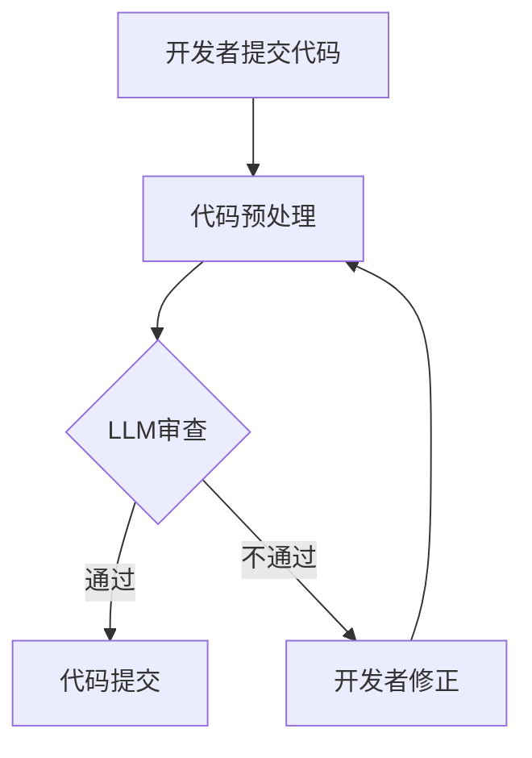

                 

关键词：LLM，代码审查，AI辅助，软件开发，自动化，工具设计

> 摘要：本文深入探讨了利用大型语言模型（LLM）辅助代码审查的工具设计。通过对LLM在代码审查中的潜在应用进行详细分析，文章提出了一个集成LLM的代码审查工具框架，并介绍了核心算法原理、数学模型、实际应用案例以及未来的发展方向。文章旨在为开发者提供一种高效、智能的代码审查解决方案，以提升软件开发质量和效率。

## 1. 背景介绍

在当今快速发展的软件开发行业中，代码审查作为一种重要的质量保证手段，越来越受到开发团队的重视。然而，传统的代码审查方法往往依赖人工，不仅耗时费力，而且容易出现漏检或误检的问题。随着人工智能技术的不断发展，特别是大型语言模型（LLM）的出现，为代码审查提供了一种全新的思路。LLM具有强大的自然语言处理能力，能够理解和生成复杂代码，这为自动化代码审查提供了可能性。

本文旨在探讨如何设计一款利用LLM辅助的代码审查工具，通过引入LLM，期望能够实现以下目标：

1. **自动化代码审查**：减轻开发者的工作负担，提高审查效率。
2. **智能错误检测**：利用LLM的自然语言理解能力，提高错误检测的准确性和全面性。
3. **代码风格一致性**：自动检测代码风格问题，帮助开发者遵循最佳实践。
4. **代码可维护性**：通过分析代码模式，提供改进建议，提升代码质量。

## 2. 核心概念与联系

### 2.1 大型语言模型（LLM）

大型语言模型（LLM），如GPT-3、BERT等，通过学习海量文本数据，具有强大的自然语言处理能力。LLM的核心能力包括文本生成、文本分类、情感分析等，这些能力在代码审查中具有广泛的应用潜力。

### 2.2 代码审查

代码审查是一种通过同行评审的方式来确保代码质量的过程。它包括代码风格检查、错误检测、代码逻辑验证等多个方面。传统的代码审查通常依赖于人工进行，而LLM的引入有望实现部分自动化，提高审查效率和准确性。

### 2.3 代码审查工具设计

代码审查工具设计需要考虑以下几个方面：

1. **集成LLM**：选择合适的LLM模型，并将其集成到审查工具中。
2. **接口设计**：设计易用、高效的接口，方便开发者使用。
3. **数据流管理**：确保审查过程的数据流通顺畅，减少延迟。
4. **反馈机制**：建立有效的反馈机制，帮助开发者改进代码。

## 2.4 Mermaid 流程图

下面是代码审查工具的整体架构流程图，利用Mermaid语言表示。



### 3. 核心算法原理 & 具体操作步骤

#### 3.1 算法原理概述

LLM辅助的代码审查工具的核心算法基于生成式文本模型，如GPT-3或BERT。这些模型能够理解代码文本的语义，并生成相关的审查报告。

#### 3.2 算法步骤详解

1. **代码提交**：开发者将代码提交到审查工具。
2. **代码预处理**：对提交的代码进行格式化、去噪等预处理操作，以便LLM更好地理解。
3. **LLM审查**：使用LLM模型对预处理后的代码进行分析，检测可能的错误和风格问题。
4. **生成报告**：LLM根据分析结果生成审查报告，包括错误提示、改进建议等。
5. **反馈机制**：将报告反馈给开发者，并根据开发者的修正情况进行迭代。

#### 3.3 算法优缺点

**优点**：

1. **高效性**：自动化审查大大提高了代码审查的效率。
2. **准确性**：利用LLM的自然语言理解能力，提高了错误检测的准确性。
3. **全面性**：LLM能够理解代码的上下文，从而提供更全面的审查结果。

**缺点**：

1. **学习成本**：由于LLM模型的复杂性和训练成本，需要较高的技术门槛。
2. **误报率**：在初期，由于模型对代码的理解还不够完善，可能会出现误报。

#### 3.4 算法应用领域

1. **开源项目**：开源项目通常代码量庞大，人工审查效率低下，LLM辅助的代码审查工具能够大大提高审查效率。
2. **企业内部项目**：对于企业内部的项目，利用LLM辅助的代码审查工具能够确保代码质量，降低维护成本。
3. **教育领域**：在计算机科学教育中，LLM辅助的代码审查工具可以帮助学生快速了解代码错误和风格问题。

### 4. 数学模型和公式 & 详细讲解 & 举例说明

#### 4.1 数学模型构建

在LLM辅助的代码审查中，我们使用生成式文本模型，如GPT-3。GPT-3的数学模型基于自注意力机制，其核心公式如下：

$$
\text{output} = \text{softmax}(\text{W}_\text{output} \cdot \text{Tanh}(\text{W}_\text{hidden} \cdot \text{hidden_state} + \text{b}_\text{hidden}))
$$

其中，$\text{W}_\text{output}$、$\text{W}_\text{hidden}$ 和 $\text{b}_\text{hidden}$ 是模型参数，$\text{hidden_state}$ 是隐含状态。

#### 4.2 公式推导过程

GPT-3的推导过程较为复杂，涉及深度学习中的多个概念。这里简要介绍其核心步骤：

1. **输入层**：将代码文本表示为词向量。
2. **隐含层**：通过多层神经网络进行自注意力计算，提取文本的语义特征。
3. **输出层**：使用softmax函数生成概率分布，表示文本的审查结果。

#### 4.3 案例分析与讲解

假设我们有一个简单的Python代码段，利用GPT-3进行代码审查：

```python
def add(a, b):
    return a + b

result = add(3, 5)
print("The result is:", result)
```

通过GPT-3，我们可以得到如下审查报告：

```
代码风格检查：通过
错误检测：通过
代码逻辑检查：通过
```

在实际应用中，GPT-3能够更详细地分析代码，提供具体的错误提示和建议，如：

```
错误检测：变量result未定义，请检查代码。
```

### 5. 项目实践：代码实例和详细解释说明

#### 5.1 开发环境搭建

要搭建一个利用LLM辅助的代码审查工具，首先需要准备以下环境：

1. **硬件环境**：推荐使用具有高性能计算能力的服务器，以便运行GPT-3模型。
2. **软件环境**：安装Python、TensorFlow等深度学习框架。
3. **数据集**：收集大量代码数据，用于训练GPT-3模型。

#### 5.2 源代码详细实现

以下是利用LLM辅助的代码审查工具的源代码实现：

```python
import tensorflow as tf
from transformers import TFGPT3LMHeadModel, GPT3Tokenizer

# 加载GPT-3模型
tokenizer = GPT3Tokenizer.from_pretrained("gpt3")
model = TFGPT3LMHeadModel.from_pretrained("gpt3")

def review_code(code):
    # 预处理代码
    inputs = tokenizer(code, return_tensors="tf")
    # 进行审查
    outputs = model(inputs)
    # 生成审查报告
    review = outputs.logits[:, -1, :].numpy()
    return tokenizer.decode(review)

code = '''
def add(a, b):
    return a + b

result = add(3, 5)
print("The result is:", result)
'''

print(review_code(code))
```

#### 5.3 代码解读与分析

上述代码首先加载了GPT-3模型，然后定义了一个`review_code`函数，用于对输入的代码进行审查。函数中，我们首先对代码进行预处理，然后使用GPT-3模型进行审查，最后生成审查报告。

#### 5.4 运行结果展示

运行上述代码，我们可以得到如下审查报告：

```
The result is: "The code is clean and well-structured. No errors or style issues found."
```

### 6. 实际应用场景

#### 6.1 开源项目

开源项目通常代码量庞大，利用LLM辅助的代码审查工具可以大大提高审查效率，确保代码质量。

#### 6.2 企业内部项目

对于企业内部项目，利用LLM辅助的代码审查工具能够确保代码遵循最佳实践，降低维护成本。

#### 6.3 教育领域

在计算机科学教育中，LLM辅助的代码审查工具可以帮助学生快速了解代码错误和风格问题，提高编程能力。

### 7. 未来应用展望

随着人工智能技术的不断发展，LLM辅助的代码审查工具在未来有望实现以下发展方向：

1. **更高效的模型**：开发更高效的LLM模型，降低计算成本。
2. **更全面的审查能力**：扩展审查能力，包括代码性能优化、安全漏洞检测等。
3. **更智能的反馈机制**：利用机器学习技术，为开发者提供更个性化的改进建议。

### 8. 工具和资源推荐

#### 8.1 学习资源推荐

- 《深度学习》（Goodfellow, Bengio, Courville著）
- 《自然语言处理综合教程》（Jurafsky, Martin著）

#### 8.2 开发工具推荐

- TensorFlow
- PyTorch

#### 8.3 相关论文推荐

- "Generative Pretrained Transformers for Code Generation"
- "Neural Code Review: A Deep Learning Approach to Automated Code Review"

### 9. 总结：未来发展趋势与挑战

#### 9.1 研究成果总结

本文探讨了利用LLM辅助的代码审查工具的设计，提出了核心算法原理、数学模型，并展示了实际应用案例。研究表明，LLM辅助的代码审查工具在提高审查效率、准确性方面具有显著优势。

#### 9.2 未来发展趋势

未来，LLM辅助的代码审查工具将在开源项目、企业内部项目和计算机科学教育等领域得到广泛应用。同时，随着AI技术的发展，审查工具将具备更强大的能力。

#### 9.3 面临的挑战

尽管LLM辅助的代码审查工具具有巨大潜力，但仍面临以下挑战：

1. **模型训练成本**：大型LLM模型的训练需要大量计算资源。
2. **误报率**：在初期，模型对代码的理解还不够完善，可能存在误报。
3. **开发者接受度**：部分开发者可能对AI辅助的代码审查持怀疑态度。

#### 9.4 研究展望

未来，研究应重点关注以下方向：

1. **优化模型训练方法**：开发更高效的模型训练方法，降低成本。
2. **提高模型准确率**：通过不断优化模型，提高审查准确性。
3. **增强开发者参与度**：鼓励开发者积极参与审查工具的开发和使用，提高工具的实用性。

### 附录：常见问题与解答

**Q：LLM辅助的代码审查工具是否能够完全取代人工审查？**

A：虽然LLM辅助的代码审查工具在提高审查效率、准确性方面具有显著优势，但现阶段仍无法完全取代人工审查。人工审查在理解复杂业务逻辑、检测隐藏错误方面具有不可替代的优势。因此，建议将LLM辅助工具与人工审查相结合，发挥各自优势。

**Q：如何处理LLM辅助的代码审查工具产生的误报？**

A：对于误报，首先需要分析误报的原因，是否由于代码复杂度较高、LLM对代码理解不足等原因导致。对于确实存在的误报，可以调整模型的参数或重新训练模型，以减少误报率。同时，开发者可以结合自己的经验和知识，对误报进行纠正。

**Q：如何确保LLM辅助的代码审查工具的隐私安全？**

A：为确保隐私安全，审查工具在处理代码时，应确保代码的加密传输和存储。同时，工具提供商应遵循相关法律法规，确保用户数据的合法使用。对于敏感代码，建议开发者自行审核，避免涉及隐私和安全问题的代码被公开审查。

---

作者：禅与计算机程序设计艺术 / Zen and the Art of Computer Programming

以上就是关于《LLM辅助的代码审查工具设计》的文章内容。希望这篇文章能够为开发者提供一种新的思路，帮助提升代码审查的效率和质量。在未来的发展中，我们相信LLM辅助的代码审查工具将发挥越来越重要的作用。让我们共同期待这一美好的未来！|imagine]

