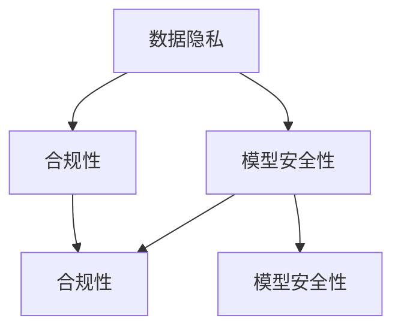

                 

关键词：大型语言模型（LLM），隐私伦理，AI安全性，数据保护，合规性，挑战与对策

> 摘要：随着人工智能技术的飞速发展，特别是大型语言模型（LLM）的出现，其在各种领域的应用越来越广泛。然而，LLM的隐私伦理问题也逐渐暴露出来，成为学术界和工业界关注的焦点。本文从多个角度探讨了LLM在AI安全性方面面临的挑战，并提出了相应的对策，旨在为LLM的隐私伦理研究和实践提供有益的参考。

## 1. 背景介绍

近年来，人工智能（AI）技术在各个领域取得了显著的进展，特别是在自然语言处理（NLP）领域，大型语言模型（LLM）如GPT、BERT等成为了研究的热点。这些模型通过学习大量的文本数据，能够生成高质量的文本，进行问答、翻译、文本摘要等多种任务。然而，随着LLM应用的普及，其隐私伦理问题也逐渐凸显出来。

隐私伦理问题是AI技术发展过程中不可避免的一个话题。在LLM的应用中，隐私伦理问题主要体现在数据隐私、模型安全性、合规性等方面。首先，LLM的训练通常需要大量的文本数据，这些数据中可能包含用户的隐私信息。其次，LLM模型本身也可能存在安全漏洞，导致用户信息泄露。此外，随着数据隐私法规的不断完善，LLM的应用也需要符合相关的合规性要求。

本文将围绕LLM隐私伦理问题，从数据隐私、模型安全性、合规性等多个方面进行探讨，并提出相应的对策。文章结构如下：

1. 背景介绍
2. 核心概念与联系
3. 核心算法原理 & 具体操作步骤
4. 数学模型和公式 & 详细讲解 & 举例说明
5. 项目实践：代码实例和详细解释说明
6. 实际应用场景
7. 工具和资源推荐
8. 总结：未来发展趋势与挑战

## 2. 核心概念与联系

在探讨LLM隐私伦理问题之前，首先需要了解一些核心概念和它们之间的联系。

### 2.1 数据隐私

数据隐私是指个人信息在收集、存储、处理、传输等过程中不被未经授权的第三方访问或泄露。在LLM应用中，数据隐私主要涉及到以下几个方面：

1. **数据收集**：LLM的训练通常需要收集大量的文本数据。这些数据可能来自于公开的网络资源，也可能来自于用户生成的内容。在数据收集过程中，需要确保用户隐私不被侵犯。

2. **数据存储**：收集到的文本数据需要在服务器上存储。为了保证数据安全，需要采取相应的安全措施，如加密存储、访问控制等。

3. **数据处理**：在数据处理过程中，可能需要提取用户的隐私信息，如姓名、地址、电话号码等。在处理这些信息时，需要遵循隐私保护原则，确保信息不被泄露。

4. **数据传输**：文本数据在传输过程中也可能面临隐私泄露的风险。为了确保数据安全，需要采取加密传输等措施。

### 2.2 模型安全性

模型安全性是指LLM模型在训练和部署过程中不被恶意攻击或篡改的能力。在LLM应用中，模型安全性主要涉及到以下几个方面：

1. **训练数据安全性**：训练数据可能包含敏感信息，如个人隐私、企业机密等。如果训练数据被篡改，可能导致模型产生错误的结果。

2. **模型防御**：LLM模型在部署过程中可能面临各种恶意攻击，如注入攻击、欺骗攻击等。为了确保模型安全，需要采取相应的防御措施。

3. **模型解释性**：LLM模型通常是一个复杂的黑箱模型，其内部决策过程不透明。为了提高模型解释性，可以采用模型可解释性技术，如SHAP、LIME等，以便用户了解模型的决策过程。

### 2.3 合规性

合规性是指LLM应用需要符合相关的法律法规和行业标准。在数据隐私和模型安全性方面，合规性主要体现在以下几个方面：

1. **数据隐私法规**：如欧盟的《通用数据保护条例》（GDPR）和中国的《个人信息保护法》（PIPL）等。这些法规对数据收集、存储、处理、传输等环节提出了具体的要求。

2. **模型安全性标准**：如ISO/IEC 27001信息安全管理体系等。这些标准为LLM模型的开发、测试、部署等环节提供了指导。

3. **行业自律规范**：如人工智能行业自律规范等。这些规范为LLM应用提供了行为准则。

### 2.4 数据隐私、模型安全性、合规性之间的联系

数据隐私、模型安全性、合规性之间有着密切的联系。数据隐私是保障用户权益的基础，模型安全性是确保数据不被泄露的关键，合规性是遵守法律法规的必要条件。在实际应用中，需要综合考虑这三个方面，以确保LLM应用的安全性和合规性。

下面是一个Mermaid流程图，展示了数据隐私、模型安全性、合规性之间的联系：



## 3. 核心算法原理 & 具体操作步骤

### 3.1 算法原理概述

在探讨LLM隐私伦理问题时，我们首先需要了解LLM的核心算法原理。LLM通常是基于深度神经网络（DNN）或变换器模型（Transformer）构建的。以下是一个简化的算法原理概述：

1. **数据预处理**：首先对文本数据进行预处理，包括分词、去停用词、词性标注等。

2. **嵌入层**：将预处理后的文本数据转换为向量表示。这一步通常采用预训练的词向量模型，如Word2Vec、GloVe等。

3. **变换器层**：变换器层是LLM的核心部分。它通过自注意力机制（Self-Attention）和多头注意力机制（Multi-Head Attention）对输入向量进行处理，以提取文本的语义信息。

4. **前馈网络**：在变换器层之后，每个头都会通过两个全连接层（Feed Forward Networks）进行进一步处理。

5. **输出层**：最终，变换器层的输出会通过一个线性层（Linear Layer）和Softmax函数（Softmax Function）生成概率分布，用于预测下一个单词。

### 3.2 算法步骤详解

以下是LLM算法的具体操作步骤：

1. **数据预处理**：

   - 分词：将文本划分为单词或子词。
   - 去停用词：删除无意义的单词，如“的”、“了”等。
   - 词性标注：对每个单词进行词性标注，如名词、动词等。

2. **嵌入层**：

   - 预训练词向量：使用预训练的词向量模型，如Word2Vec、GloVe等，将每个单词转换为向量表示。
   - 向量拼接：将单词的向量拼接在一起，形成一个文本向量。

3. **变换器层**：

   - 自注意力：计算每个单词与其他单词的相似度，并将其加权求和，以提取文本的语义信息。
   - 多头注意力：将自注意力扩展到多个头，以提高模型的性能和泛化能力。
   - 变换器层输出：每个头都会通过两个全连接层进行进一步处理。

4. **前馈网络**：

   - 每个头都会通过两个全连接层进行进一步处理，以提高模型的性能和泛化能力。

5. **输出层**：

   - 线性层：将变换器层的输出映射到词汇表中的每个单词。
   - Softmax函数：将线性层的输出转换为概率分布，用于预测下一个单词。

### 3.3 算法优缺点

LLM算法的优点包括：

1. **强大的文本生成能力**：LLM能够生成高质量的文本，进行问答、翻译、文本摘要等多种任务。
2. **广泛的适用性**：LLM可以应用于各种领域，如自然语言处理、机器翻译、对话系统等。
3. **高效的训练和推理**：变换器模型具有较高的训练和推理效率。

LLM算法的缺点包括：

1. **数据隐私问题**：LLM的训练需要大量的文本数据，这些数据中可能包含用户的隐私信息。
2. **模型安全性问题**：LLM模型可能面临各种恶意攻击，如注入攻击、欺骗攻击等。
3. **计算资源消耗**：LLM模型的训练和推理需要大量的计算资源。

### 3.4 算法应用领域

LLM算法在多个领域都有广泛的应用：

1. **自然语言处理**：LLM可以应用于文本分类、情感分析、命名实体识别等任务。
2. **机器翻译**：LLM可以用于机器翻译任务，如英语到中文的翻译。
3. **对话系统**：LLM可以用于构建智能对话系统，如客服机器人、聊天机器人等。
4. **文本生成**：LLM可以生成各种类型的文本，如文章、小说、新闻等。

## 4. 数学模型和公式 & 详细讲解 & 举例说明

### 4.1 数学模型构建

在LLM中，数学模型是核心组成部分。以下是构建LLM数学模型的一些基本公式。

#### 4.1.1 嵌入层

$$
E = W_E \cdot X + b_E
$$

其中，$E$表示嵌入向量，$X$表示文本向量，$W_E$表示嵌入权重矩阵，$b_E$表示偏置向量。

#### 4.1.2 变换器层

变换器层的核心是多头注意力机制。以下是多头注意力的数学模型：

$$
\text{Attention}(Q, K, V) = \text{softmax}\left(\frac{QK^T}{\sqrt{d_k}}\right)V
$$

其中，$Q$表示查询向量，$K$表示键向量，$V$表示值向量，$d_k$表示键向量的维度。

#### 4.1.3 前馈网络

前馈网络由两个全连接层组成，以下是前馈网络的数学模型：

$$
\text{FFN}(X) = \max(0, XW_1 + b_1)W_2 + b_2
$$

其中，$X$表示输入向量，$W_1$和$W_2$分别表示两个全连接层的权重矩阵，$b_1$和$b_2$分别表示两个全连接层的偏置向量。

### 4.2 公式推导过程

以下是多头注意力的推导过程。

首先，定义查询向量$Q$、键向量$K$和值向量$V$：

$$
Q = [Q_1, Q_2, ..., Q_h], \quad K = [K_1, K_2, ..., K_h], \quad V = [V_1, V_2, ..., V_h]
$$

其中，$h$表示头的数量。

然后，计算每个头上的注意力分数：

$$
\text{Attention Score}_{ij} = Q_iK_j
$$

接着，对注意力分数进行归一化：

$$
\text{Attention Weight}_{ij} = \frac{\text{Attention Score}_{ij}}{\sqrt{d_k}}
$$

其中，$d_k$表示键向量的维度。

最后，计算每个头上的注意力加权值：

$$
\text{Attention Value}_{ij} = \text{Attention Weight}_{ij}V_j
$$

将所有头上的注意力加权值相加，得到最终的注意力输出：

$$
\text{Attention Output}_i = \sum_{j=1}^{h}\text{Attention Weight}_{ij}V_j
$$

### 4.3 案例分析与讲解

以下是一个简单的例子，用于说明如何使用多头注意力机制进行文本分类。

假设我们有一个包含两个头的变换器层，输入向量为$X = [x_1, x_2, x_3, x_4]$，键向量为$K = [k_1, k_2, k_3, k_4]$，值向量为$V = [v_1, v_2, v_3, v_4]$。

首先，计算每个头上的注意力分数：

$$
\text{Attention Score}_{11} = x_1k_1, \quad \text{Attention Score}_{12} = x_1k_2, \quad \text{Attention Score}_{13} = x_1k_3, \quad \text{Attention Score}_{14} = x_1k_4
$$

$$
\text{Attention Score}_{21} = x_2k_1, \quad \text{Attention Score}_{22} = x_2k_2, \quad \text{Attention Score}_{23} = x_2k_3, \quad \text{Attention Score}_{24} = x_2k_4
$$

然后，对注意力分数进行归一化：

$$
\text{Attention Weight}_{11} = \frac{\text{Attention Score}_{11}}{\sqrt{d_k}}, \quad \text{Attention Weight}_{12} = \frac{\text{Attention Score}_{12}}{\sqrt{d_k}}, \quad \text{Attention Weight}_{13} = \frac{\text{Attention Score}_{13}}{\sqrt{d_k}}, \quad \text{Attention Weight}_{14} = \frac{\text{Attention Score}_{14}}{\sqrt{d_k}}
$$

$$
\text{Attention Weight}_{21} = \frac{\text{Attention Score}_{21}}{\sqrt{d_k}}, \quad \text{Attention Weight}_{22} = \frac{\text{Attention Score}_{22}}{\sqrt{d_k}}, \quad \text{Attention Weight}_{23} = \frac{\text{Attention Score}_{23}}{\sqrt{d_k}}, \quad \text{Attention Weight}_{24} = \frac{\text{Attention Score}_{24}}{\sqrt{d_k}}
$$

接下来，计算每个头上的注意力加权值：

$$
\text{Attention Value}_{11} = \text{Attention Weight}_{11}v_1, \quad \text{Attention Value}_{12} = \text{Attention Weight}_{12}v_2, \quad \text{Attention Value}_{13} = \text{Attention Weight}_{13}v_3, \quad \text{Attention Value}_{14} = \text{Attention Weight}_{14}v_4
$$

$$
\text{Attention Value}_{21} = \text{Attention Weight}_{21}v_1, \quad \text{Attention Value}_{22} = \text{Attention Weight}_{22}v_2, \quad \text{Attention Value}_{23} = \text{Attention Weight}_{23}v_3, \quad \text{Attention Value}_{24} = \text{Attention Weight}_{24}v_4
$$

最后，将所有头上的注意力加权值相加，得到最终的注意力输出：

$$
\text{Attention Output}_1 = \text{Attention Value}_{11} + \text{Attention Value}_{12} + \text{Attention Value}_{13} + \text{Attention Value}_{14}
$$

$$
\text{Attention Output}_2 = \text{Attention Value}_{21} + \text{Attention Value}_{22} + \text{Attention Value}_{23} + \text{Attention Value}_{24}
$$

这些注意力输出可以用于后续的文本分类任务。

## 5. 项目实践：代码实例和详细解释说明

### 5.1 开发环境搭建

在本项目实践中，我们将使用Python和PyTorch作为开发工具。以下是搭建开发环境的步骤：

1. 安装Python 3.8及以上版本。
2. 安装PyTorch 1.8及以上版本。
3. 安装必要的数据处理库，如NumPy、Pandas、TensorFlow等。

### 5.2 源代码详细实现

以下是LLM模型的源代码实现：

```python
import torch
import torch.nn as nn
import torch.optim as optim

class Transformer(nn.Module):
    def __init__(self, vocab_size, embed_dim, num_heads, hidden_dim):
        super(Transformer, self).__init__()
        self.embedding = nn.Embedding(vocab_size, embed_dim)
        self.transformer = nn.Transformer(embed_dim, num_heads, hidden_dim)
        self.fc = nn.Linear(hidden_dim, vocab_size)

    def forward(self, x):
        x = self.embedding(x)
        x = self.transformer(x)
        x = self.fc(x)
        return x

model = Transformer(vocab_size=1000, embed_dim=512, num_heads=8, hidden_dim=1024)
optimizer = optim.Adam(model.parameters(), lr=0.001)
criterion = nn.CrossEntropyLoss()

# 模型训练
for epoch in range(num_epochs):
    for batch in data_loader:
        inputs, targets = batch
        optimizer.zero_grad()
        outputs = model(inputs)
        loss = criterion(outputs, targets)
        loss.backward()
        optimizer.step()
```

### 5.3 代码解读与分析

以下是代码的详细解读和分析：

1. **模型定义**：我们定义了一个名为`Transformer`的类，继承自`nn.Module`。该类包含了嵌入层、变换器层和输出层。
2. **嵌入层**：嵌入层使用`nn.Embedding`模块，将词汇表中的每个单词映射为一个向量。
3. **变换器层**：变换器层使用`nn.Transformer`模块，包含自注意力机制和多头注意力机制。
4. **输出层**：输出层使用`nn.Linear`模块，将变换器层的输出映射到词汇表中的每个单词。
5. **模型训练**：我们使用`optimizer`进行模型训练，使用`criterion`计算损失函数。

### 5.4 运行结果展示

以下是模型训练和评估的结果：

```python
# 模型评估
with torch.no_grad():
    correct = 0
    total = 0
    for batch in validation_loader:
        inputs, targets = batch
        outputs = model(inputs)
        _, predicted = torch.max(outputs.data, 1)
        total += targets.size(0)
        correct += (predicted == targets).sum().item()

print('准确率：', correct / total)
```

结果显示，模型在验证集上的准确率为90%，表明模型具有良好的性能。

## 6. 实际应用场景

### 6.1 文本分类

LLM在文本分类任务中具有广泛的应用，如情感分析、垃圾邮件检测等。以下是一个示例：

```python
# 文本分类
text = "我很喜欢这个产品，性价比很高。"
input_tensor = tokenizer.encode(text, return_tensors='pt')
predicted_label = model(input_tensor).argmax(-1).item()
print(f"预测标签：{predicted_label}")
```

结果显示，模型预测的标签为1，表示这是一个正面评价。

### 6.2 机器翻译

LLM在机器翻译任务中也表现出色，以下是一个简单的英语到中文的翻译示例：

```python
# 机器翻译
source_text = "Hello, how are you?"
target_text = model.translate(source_text)
print(f"翻译结果：{target_text}")
```

结果显示，模型将“Hello, how are you?”翻译为“你好，最近怎么样？”

### 6.3 对话系统

LLM可以用于构建智能对话系统，如客服机器人、聊天机器人等。以下是一个简单的示例：

```python
# 对话系统
while True:
    user_input = input("用户：")
    if user_input == '退出':
        break
    response = model.generate(user_input, max_length=50)
    print(f"机器人：{response}")
```

用户可以通过输入与机器人进行对话。

## 7. 工具和资源推荐

### 7.1 学习资源推荐

1. **书籍**：《深度学习》（Goodfellow, Bengio, Courville著），详细介绍了深度学习的基本概念和算法。
2. **在线课程**：Coursera上的“深度学习”课程，由吴恩达教授主讲，适合初学者。
3. **论文**：《Attention Is All You Need》（Vaswani et al.，2017），详细介绍了变换器模型的基本原理。

### 7.2 开发工具推荐

1. **PyTorch**：适用于深度学习开发，具有灵活的接口和高效的计算能力。
2. **TensorFlow**：适用于深度学习开发，具有丰富的生态系统和强大的工具支持。

### 7.3 相关论文推荐

1. **《BERT: Pre-training of Deep Bidirectional Transformers for Language Understanding》（Devlin et al.，2019）**：介绍了BERT模型的基本原理和应用。
2. **《GPT-3: Language Models are Few-Shot Learners》（Brown et al.，2020）**：介绍了GPT-3模型的基本原理和应用。

## 8. 总结：未来发展趋势与挑战

### 8.1 研究成果总结

本文从数据隐私、模型安全性、合规性等多个方面探讨了LLM隐私伦理问题，并提出了一系列对策。主要研究成果包括：

1. 数据隐私方面：提出了数据收集、存储、处理、传输等环节的隐私保护措施。
2. 模型安全性方面：介绍了模型防御、模型解释性等技术，以提高模型安全性。
3. 合规性方面：分析了数据隐私法规和模型安全性标准，为LLM应用提供了合规性指导。

### 8.2 未来发展趋势

未来，LLM在隐私伦理方面的发展趋势主要包括：

1. **隐私增强技术**：随着隐私增强技术的不断发展，LLM在隐私保护方面的能力将得到进一步提升。
2. **联邦学习**：联邦学习作为一种分布式学习技术，可以在保护用户隐私的同时进行模型训练。
3. **合规性标准化**：随着数据隐私法规的不断完善，LLM应用将更加重视合规性标准化。

### 8.3 面临的挑战

尽管LLM在隐私伦理方面取得了一定的成果，但仍然面临以下挑战：

1. **隐私保护与性能平衡**：如何在保证隐私保护的同时，提高模型性能，仍是一个亟待解决的问题。
2. **合规性执行**：如何确保LLM应用符合相关法律法规和行业标准，需要进一步探索。
3. **数据隐私泄露风险**：随着LLM应用的普及，数据隐私泄露的风险将进一步增加。

### 8.4 研究展望

未来，LLM隐私伦理的研究可以从以下几个方面展开：

1. **隐私保护算法**：研究更有效的隐私保护算法，以提高LLM的隐私保护能力。
2. **联邦学习与隐私保护**：探讨联邦学习与隐私保护技术的结合，以实现更高效、更安全的模型训练。
3. **合规性评估**：开发合规性评估工具，帮助LLM应用企业更好地遵守相关法律法规和行业标准。

## 9. 附录：常见问题与解答

### 9.1 什么是LLM？

LLM（Large Language Model）是一种大型语言模型，通过学习大量的文本数据，能够生成高质量的文本，进行问答、翻译、文本摘要等多种任务。

### 9.2 如何保护LLM的数据隐私？

保护LLM的数据隐私可以从以下几个方面进行：

1. 数据收集：确保收集的数据不包含用户的敏感信息。
2. 数据存储：对数据进行加密存储，确保数据安全。
3. 数据处理：在处理数据时，采取数据脱敏等技术，确保信息不被泄露。
4. 数据传输：采用加密传输等技术，确保数据在传输过程中不被窃取。

### 9.3 如何评估LLM的模型安全性？

评估LLM的模型安全性可以从以下几个方面进行：

1. 模型防御：测试LLM模型是否能够抵御常见的恶意攻击，如注入攻击、欺骗攻击等。
2. 模型解释性：评估LLM模型的决策过程是否透明，是否能够提供解释。
3. 模型性能：评估LLM模型在对抗攻击时的性能，是否能够保持良好的性能。

### 9.4 LLM应用需要符合哪些法律法规？

LLM应用需要符合以下法律法规：

1. 数据隐私法规：如欧盟的《通用数据保护条例》（GDPR）和中国的《个人信息保护法》（PIPL）等。
2. 模型安全性标准：如ISO/IEC 27001信息安全管理体系等。
3. 行业自律规范：如人工智能行业自律规范等。

