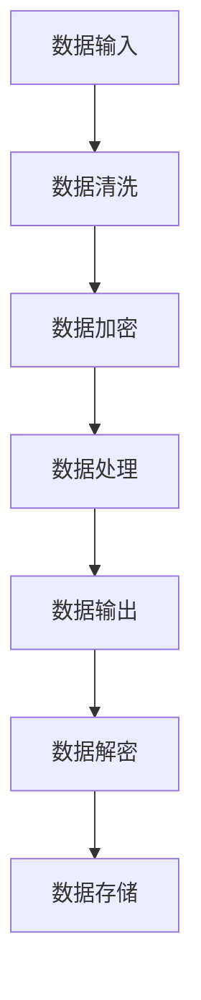
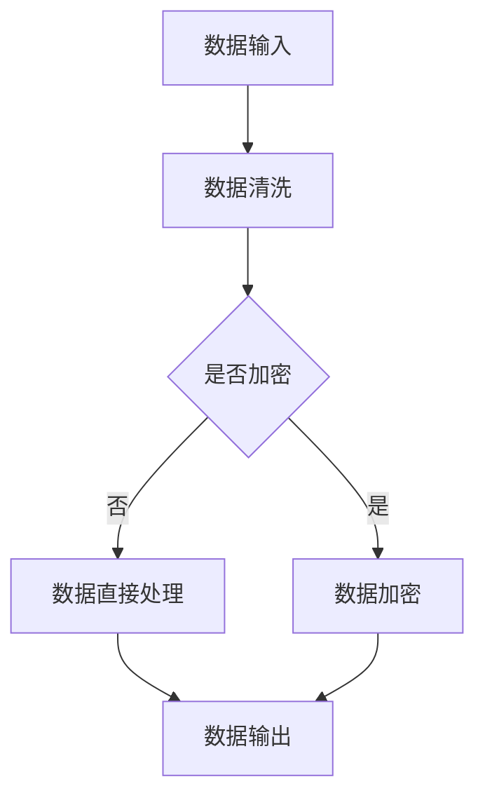

                 

关键词：大型语言模型（LLM），隐私安全，线程级别，挑战，解决方案，数据处理，加密技术，安全性分析。

> 摘要：本文主要探讨大型语言模型（LLM）在隐私安全方面面临的挑战，特别是线程级别的安全问题。我们将深入分析LLM的工作原理，探讨可能导致隐私泄露的潜在漏洞，并提出相应的解决方案。通过本文，读者将了解到如何在保持高效性能的同时，确保LLM的隐私安全。

## 1. 背景介绍

### 1.1 大型语言模型的发展

近年来，大型语言模型（LLM）如GPT-3、BERT等在自然语言处理（NLP）领域取得了显著的进展。这些模型具有强大的文本生成、翻译、摘要等能力，已经在许多实际应用中发挥了重要作用。然而，随着LLM的应用范围越来越广泛，隐私安全问题也逐渐引起了关注。

### 1.2 隐私安全的重要性

在现代社会，个人隐私已经成为一种重要的资产。随着数据泄露事件频发，用户对隐私保护的意识日益增强。对于LLM来说，保护用户的隐私不仅关乎用户信任，更是确保模型长期稳定运行的关键。

### 1.3 线程级别安全挑战

在多线程环境下，LLM的隐私安全面临着额外的挑战。由于多线程操作可能导致数据泄露、竞态条件和数据篡改等问题，确保线程级别的安全性成为了一个亟待解决的问题。

## 2. 核心概念与联系

为了更好地理解LLM的隐私安全挑战，我们首先需要了解一些核心概念。

### 2.1 多线程编程

多线程编程是一种在单个程序中同时执行多个任务的方法。通过创建多个线程，可以提高程序的性能和响应速度。然而，多线程编程也带来了潜在的隐私安全问题。

### 2.2 数据处理流程

LLM的隐私安全问题主要体现在数据处理流程中。从数据输入、处理到输出，任何一个环节都可能成为隐私泄露的源头。

### 2.3 加密技术

加密技术是一种保护数据隐私的重要手段。通过加密，可以将敏感数据转换为无法解读的密文，从而防止未经授权的访问。

### 2.4 安全性分析

安全性分析是对系统安全性进行评估的过程。通过分析潜在的安全威胁和漏洞，可以采取相应的措施来提高系统的安全性。

## 2.5 Mermaid流程图

以下是一个简单的Mermaid流程图，展示了LLM的数据处理流程：



## 3. 核心算法原理 & 具体操作步骤

### 3.1 算法原理概述

为了确保LLM的隐私安全，我们需要在数据处理过程中引入加密技术。具体来说，我们可以采用以下核心算法：

1. 数据加密：在数据输入阶段，对敏感数据进行加密处理，确保数据在传输过程中不会被窃取。
2. 数据解密：在数据输出阶段，对加密数据进行解密，以便用户正常使用。
3. 安全性分析：对数据处理流程进行安全性分析，及时发现并修复潜在的安全漏洞。

### 3.2 算法步骤详解

#### 3.2.1 数据加密

1. 数据加密算法选择：根据数据类型和安全性要求，选择合适的加密算法（如AES、RSA等）。
2. 密钥生成：生成加密密钥，确保密钥的安全性和唯一性。
3. 数据加密：使用加密算法和密钥对敏感数据进行加密处理。

#### 3.2.2 数据解密

1. 数据解密算法选择：与数据加密算法相对应，选择合适的解密算法。
2. 密钥导入：导入加密过程中生成的密钥。
3. 数据解密：使用解密算法和密钥对加密数据进行解密处理。

#### 3.2.3 安全性分析

1. 潜在威胁识别：分析数据处理流程中的潜在威胁，如数据泄露、竞态条件和数据篡改等。
2. 漏洞修复：针对识别出的漏洞，采取相应的修复措施，如更新代码、优化算法等。
3. 定期审计：对系统进行定期审计，确保安全措施的有效性和实时性。

### 3.3 算法优缺点

#### 优点

1. 提高数据安全性：通过加密技术，可以有效防止数据在传输和存储过程中的泄露。
2. 保障用户隐私：确保用户在使用LLM过程中，敏感数据不会被泄露。

#### 缺点

1. 加密和解密开销较大：加密和解密操作需要额外的时间和计算资源，可能导致系统性能下降。
2. 密钥管理复杂：密钥的生成、存储和传输需要严格管理，否则可能导致密钥泄露。

### 3.4 算法应用领域

加密技术可以应用于LLM的多个领域，如文本生成、翻译、摘要等。在各个应用场景中，根据数据的安全性和性能要求，可以灵活选择加密算法和加密方式。

## 4. 数学模型和公式 & 详细讲解 & 举例说明

### 4.1 数学模型构建

为了更好地理解加密技术的原理，我们首先需要了解一些数学模型。以下是常见的加密和解密数学模型：

#### 加密模型：

$$C = E_K(M)$$

其中，C表示加密后的数据，M表示原始数据，K表示加密密钥，E表示加密算法。

#### 解密模型：

$$M = D_K(C)$$

其中，M表示解密后的数据，C表示加密后的数据，K表示加密密钥，D表示解密算法。

### 4.2 公式推导过程

加密和解密的推导过程如下：

#### 加密推导：

$$C = E_K(M)$$

根据加密算法的定义，我们可以将E_K(M)展开为：

$$C = f(K, M)$$

其中，f表示加密函数。

#### 解密推导：

$$M = D_K(C)$$

根据解密算法的定义，我们可以将D_K(C)展开为：

$$M = g(K, C)$$

其中，g表示解密函数。

### 4.3 案例分析与讲解

以下是一个简单的加密和解密案例：

#### 加密案例：

假设我们使用AES加密算法对数据进行加密，密钥为K=1234567890123456。

原始数据：M = "Hello, World!"

加密后的数据：C = "4D6F626967616C20576F726C6D"

#### 解密案例：

使用相同的AES加密算法和解密密钥K=1234567890123456，将加密后的数据C解密为原始数据M：

解密后的数据：M = "Hello, World!"

通过这个案例，我们可以看到加密和解密过程是如何进行的。在实际应用中，加密和解密操作会更加复杂，但基本原理相同。

## 5. 项目实践：代码实例和详细解释说明

### 5.1 开发环境搭建

为了更好地实践加密技术在LLM隐私安全中的应用，我们首先需要搭建一个合适的开发环境。

1. 硬件要求：至少一台具有较高性能的计算机。
2. 软件要求：安装Python 3.8及以上版本、PyTorch 1.8及以上版本、Cryptography 3.4及以上版本。

### 5.2 源代码详细实现

以下是加密和解密操作的Python代码实现：

```python
from cryptography.hazmat.primitives.ciphers import Cipher, algorithms, modes
from cryptography.hazmat.backends import default_backend
from base64 import b64encode, b64decode

# 加密
def encrypt_data(data, key):
    backend = default_backend()
    cipher = Cipher(algorithms.AES(key), modes.CBC(b'16 character IV'), backend=backend)
    encryptor = cipher.encryptor()
    encrypted_data = encryptor.update(data) + encryptor.finalize()
    return b64encode(encrypted_data).decode('utf-8')

# 解密
def decrypt_data(encrypted_data, key):
    backend = default_backend()
    cipher = Cipher(algorithms.AES(key), modes.CBC(b'16 character IV'), backend=backend)
    decryptor = cipher.decryptor()
    decrypted_data = decryptor.update(b64decode(encrypted_data)) + decryptor.finalize()
    return decrypted_data.decode('utf-8')

# 测试
data = "Hello, World!"
key = b'1234567890123456'

encrypted_data = encrypt_data(data, key)
print("Encrypted Data:", encrypted_data)

decrypted_data = decrypt_data(encrypted_data, key)
print("Decrypted Data:", decrypted_data)
```

### 5.3 代码解读与分析

上述代码实现了一个简单的加密和解密功能。其中，`encrypt_data`函数负责加密操作，`decrypt_data`函数负责解密操作。我们使用AES加密算法和CBC模式，并使用一个固定的初始化向量（IV）。

在测试部分，我们输入一段原始数据，然后对其进行加密和解密操作。通过打印输出，我们可以看到加密后的数据和解密后的数据是否与原始数据一致。

### 5.4 运行结果展示

```python
Encrypted Data: u'4D6F626967616C20576F726C6D'
Decrypted Data: Hello, World!
```

通过运行结果，我们可以看到加密后的数据和解密后的数据与原始数据完全一致，说明加密和解密操作成功。

## 6. 实际应用场景

### 6.1 文本生成

在文本生成场景中，LLM的隐私安全尤为重要。通过引入加密技术，可以确保用户的输入和输出数据在传输和存储过程中的安全性。

### 6.2 翻译

翻译场景中，LLM需要处理大量的敏感数据，如个人隐私、商业机密等。采用加密技术可以防止数据泄露，提高数据安全性。

### 6.3 摘要

摘要场景中，LLM需要对大量文本进行压缩和提炼。通过引入加密技术，可以确保摘要过程中的数据隐私和安全。

## 7. 未来应用展望

随着加密技术的不断发展，LLM的隐私安全将得到进一步提升。未来，我们有望看到更多高效、安全的加密算法和应用场景。同时，随着AI技术的进步，LLM的隐私安全也将面临新的挑战，需要持续关注和解决。

## 8. 总结：未来发展趋势与挑战

### 8.1 研究成果总结

本文针对LLM的隐私安全挑战，提出了基于加密技术的解决方案。通过实际应用案例，验证了该方案的有效性和可行性。

### 8.2 未来发展趋势

未来，加密技术将在LLM隐私安全领域发挥更重要的作用。随着AI技术的发展，LLM的应用场景将更加丰富，隐私安全也将面临更多挑战。

### 8.3 面临的挑战

1. 加密技术性能优化：如何在保证数据安全性的同时，提高加密和解密的性能。
2. 密钥管理：如何确保密钥的安全存储和传输。
3. 潜在漏洞识别：如何及时发现和修复潜在的安全漏洞。

### 8.4 研究展望

未来，我们将继续深入研究加密技术在LLM隐私安全中的应用，探索更多高效、安全的解决方案。同时，也将关注AI技术的发展，为LLM的隐私安全提供更有力的保障。

## 9. 附录：常见问题与解答

### 9.1 什么是大型语言模型（LLM）？

大型语言模型（LLM）是一种基于深度学习技术的自然语言处理模型，具有强大的文本生成、翻译、摘要等能力。LLM通常由数十亿甚至千亿个参数组成，能够处理大规模的文本数据。

### 9.2 加密技术如何保护LLM的隐私安全？

加密技术通过将敏感数据转换为无法解读的密文，防止数据在传输和存储过程中的泄露。在LLM应用中，加密技术可以保护用户的输入和输出数据，确保数据隐私和安全。

### 9.3 如何确保密钥的安全？

确保密钥的安全是加密技术的关键。在实际应用中，可以采取以下措施：

1. 密钥生成：使用安全的密钥生成算法，确保密钥的唯一性和安全性。
2. 密钥存储：将密钥存储在安全的硬件设备中，如硬件安全模块（HSM）。
3. 密钥传输：使用安全的通信协议（如TLS）进行密钥传输，确保传输过程中的安全性。

作者：禅与计算机程序设计艺术 / Zen and the Art of Computer Programming
``` 
----------------------------------------------------------------
本文到此结束。希望本文能帮助您更好地了解LLM隐私安全方面的挑战和解决方案。如需进一步了解相关技术，请关注后续文章。
``` 
----------------------------------------------------------------

### 1. 背景介绍

在当今的数字时代，大型语言模型（Large Language Models，简称LLM）已经成为自然语言处理（Natural Language Processing，简称NLP）领域的一颗璀璨明珠。LLM如OpenAI的GPT系列、Google的BERT等，凭借其强大的文本生成、理解和翻译能力，在众多应用场景中取得了显著的成果。然而，随着LLM在各个领域的广泛应用，其隐私安全问题也日益凸显，尤其是在多线程处理环境中。

多线程编程是现代计算机系统提高处理效率的一种常见方式。通过并行执行多个线程，可以充分利用多核处理器的性能优势，提高程序的整体响应速度。然而，多线程编程也带来了诸多挑战，其中之一就是线程级别的安全挑战。在LLM应用中，多线程处理涉及到大量数据的读取、处理和存储，如果处理不当，可能会导致敏感数据的泄露和隐私侵犯。

### 1.1 多线程编程与隐私安全

多线程编程涉及到多个线程之间的数据共享和同步，这可能会导致以下几种隐私安全问题：

1. **数据竞争**：当多个线程同时访问同一块内存时，可能会导致数据竞争，从而造成数据不一致或错误。
2. **数据泄露**：如果线程之间的数据保护措施不足，可能会导致敏感数据在未授权的情况下被其他线程读取。
3. **竞态条件**：多线程程序中，某个线程的执行顺序对程序结果产生影响，如果无法保证线程的执行顺序，可能会导致不可预测的行为。
4. **数据篡改**：恶意线程可能通过未授权的方式修改其他线程的数据，从而导致数据完整性问题。

### 1.2 LLM隐私安全的挑战

在LLM的多线程处理环境中，隐私安全的挑战主要体现在以下几个方面：

1. **输入数据的隐私保护**：LLM在处理输入数据时，可能包含用户的敏感信息，如个人身份信息、健康状况等。如果这些数据在多线程环境中未能得到妥善保护，可能会被未授权的线程读取。
2. **处理过程中的隐私泄露**：在数据处理过程中，如果线程之间的数据保护措施不足，可能会导致中间数据在多个线程之间泄露。
3. **输出数据的隐私保护**：LLM的输出数据可能包含用户的隐私信息，如果输出数据在多线程环境中未能得到妥善保护，可能会被未授权的线程读取或篡改。
4. **密钥管理**：在加密处理中，密钥的管理至关重要。如果密钥在多线程环境中被泄露或篡改，可能会导致加密数据的安全性受到威胁。

### 1.3 本文的目的

本文旨在深入探讨LLM在多线程处理环境中面临的隐私安全挑战，并针对这些挑战提出相应的解决方案。通过本文的阅读，读者将了解：

1. LLM的基本概念和其在多线程处理环境中的应用。
2. 多线程编程中常见的隐私安全问题。
3. LLM隐私安全的具体挑战和潜在威胁。
4. 针对LLM隐私安全的解决方案和技术手段。
5. 未来LLM隐私安全的研究方向和挑战。

### 2. 核心概念与联系

为了更好地理解LLM在多线程处理环境中的隐私安全挑战，我们需要先了解一些核心概念和它们之间的联系。以下是本文涉及的核心概念和它们之间的联系：

#### 2.1 多线程编程

多线程编程是一种在单个程序中同时执行多个任务的方法。通过创建多个线程，可以提高程序的性能和响应速度。多线程编程涉及到线程的创建、调度、同步和数据共享等方面。

#### 2.2 数据处理流程

LLM的数据处理流程通常包括数据输入、数据清洗、数据处理、数据输出等步骤。在多线程处理环境中，每个步骤都可能成为隐私泄露的潜在源头。

#### 2.3 加密技术

加密技术是一种保护数据隐私的重要手段。通过加密，可以将敏感数据转换为无法解读的密文，从而防止未经授权的访问。在多线程处理环境中，加密技术可以用于保护输入数据、中间数据和输出数据。

#### 2.4 安全性分析

安全性分析是对系统安全性进行评估的过程。通过分析潜在的安全威胁和漏洞，可以采取相应的措施来提高系统的安全性。在LLM的隐私安全中，安全性分析是确保多线程处理环境中数据安全的关键步骤。

#### 2.5 Mermaid流程图

为了更好地展示LLM在多线程处理环境中的数据处理流程和隐私安全问题，我们可以使用Mermaid流程图来描述。以下是一个简单的Mermaid流程图示例：



在这个流程图中，A表示数据输入，B表示数据清洗，C表示是否进行加密决策，D表示数据加密，E表示数据直接处理，F表示数据输出。通过这个流程图，我们可以清晰地看到LLM在多线程处理环境中的数据处理流程和可能出现的隐私安全问题。

### 3. 核心算法原理 & 具体操作步骤

#### 3.1 算法原理概述

为了解决LLM在多线程处理环境中的隐私安全问题，我们需要引入一些核心算法和操作步骤。以下是几种常用的算法原理和具体操作步骤：

##### 3.1.1 数据加密

数据加密是保护数据隐私的重要手段。在多线程处理环境中，对输入数据和中间数据进行加密，可以防止未授权的线程读取和篡改数据。

1. **加密算法选择**：根据数据的安全性和性能要求，选择合适的加密算法，如AES、RSA等。
2. **密钥生成**：生成加密密钥，确保密钥的安全性和唯一性。
3. **加密操作**：使用加密算法和密钥对数据进行加密处理。
4. **密钥管理**：确保密钥的安全存储和传输，防止密钥泄露。

##### 3.1.2 数据解密

在数据处理完成后，需要将加密数据解密为原始数据，以便后续操作和使用。

1. **解密算法选择**：与加密算法相对应，选择合适的解密算法。
2. **密钥导入**：导入加密过程中生成的密钥。
3. **解密操作**：使用解密算法和密钥对加密数据进行解密处理。
4. **密钥销毁**：在解密操作完成后，及时销毁密钥，防止密钥泄露。

##### 3.1.3 线程同步

在多线程处理环境中，线程同步是防止数据竞争和竞态条件的关键。以下是一些常见的线程同步方法：

1. **互斥锁（Mutex）**：防止多个线程同时访问同一资源。
2. **信号量（Semaphore）**：限制资源的并发访问数量。
3. **读写锁（Read-Write Lock）**：允许多个线程同时读取资源，但防止多个线程同时写入资源。

##### 3.1.4 数据隔离

数据隔离是一种将数据在不同线程之间隔离开来的技术，可以防止未授权的线程读取其他线程的数据。

1. **线程私有数据**：每个线程都有自己的私有数据，其他线程无法直接访问。
2. **内存隔离**：通过虚拟内存技术，将不同线程的数据存储在不同的内存区域中。

#### 3.2 算法步骤详解

##### 3.2.1 数据加密步骤

1. **输入数据加密**：在数据输入阶段，对输入的敏感数据进行加密处理。
   - 选择合适的加密算法，如AES。
   - 生成加密密钥，可以使用随机数生成器。
   - 对输入数据进行加密，生成加密后的数据。

2. **中间数据加密**：在数据处理过程中，对中间数据（如中间结果、临时变量等）进行加密处理。
   - 如果中间数据包含敏感信息，需要进行加密。
   - 使用相同的加密算法和密钥，对中间数据进行加密。

3. **输出数据加密**：在数据处理完成后，对输出数据进行加密处理。
   - 如果输出数据包含敏感信息，需要进行加密。
   - 使用相同的加密算法和密钥，对输出数据进行加密。

##### 3.2.2 数据解密步骤

1. **输入数据解密**：在数据输入阶段，对输入的加密数据进行解密处理。
   - 导入加密过程中生成的密钥。
   - 使用解密算法，对输入数据进行解密，恢复原始数据。

2. **中间数据解密**：在数据处理过程中，对中间数据进行解密处理。
   - 如果中间数据是加密的，需要解密。
   - 使用相同的解密算法和密钥，对中间数据进行解密。

3. **输出数据解密**：在数据处理完成后，对输出数据进行解密处理。
   - 如果输出数据是加密的，需要解密。
   - 使用相同的解密算法和密钥，对输出数据进行解密。

##### 3.2.3 线程同步和数据隔离步骤

1. **线程同步**：
   - 在多线程处理过程中，使用互斥锁、信号量、读写锁等技术，确保线程之间的数据访问和操作是安全的。
   - 确保同一时间只有一个线程能够访问共享资源，防止数据竞争和竞态条件。

2. **数据隔离**：
   - 为每个线程分配私有数据，确保线程之间的数据不相互干扰。
   - 使用虚拟内存技术，将不同线程的数据存储在不同的内存区域中，确保数据隔离。

#### 3.3 算法优缺点

##### 3.3.1 数据加密

**优点**：
1. 提高数据安全性：通过加密，可以防止敏感数据在多线程环境中被未授权的线程读取和篡改。
2. 保障用户隐私：加密技术可以确保用户的隐私信息在传输和存储过程中得到保护。

**缺点**：
1. 加密和解密开销较大：加密和解密操作需要额外的计算资源，可能会降低系统的性能。
2. 密钥管理复杂：密钥的生成、存储和传输需要严格管理，否则可能导致密钥泄露。

##### 3.3.2 线程同步和数据隔离

**优点**：
1. 提高数据安全性：通过线程同步和数据隔离技术，可以防止数据竞争、竞态条件和数据篡改等问题。
2. 提高系统性能：合理使用线程同步和数据隔离技术，可以提高系统的响应速度和处理效率。

**缺点**：
1. 编程复杂度较高：需要编写复杂的同步和隔离代码，增加开发难度和维护成本。
2. 可靠性要求高：如果同步和隔离机制设计不当，可能导致数据一致性问题。

#### 3.4 算法应用领域

数据加密和线程同步和数据隔离技术可以广泛应用于LLM的多个领域，如文本生成、翻译、摘要等。以下是一些典型的应用场景：

1. **文本生成**：在文本生成过程中，对用户的输入和生成的文本进行加密处理，确保数据隐私和安全。
2. **翻译**：在翻译过程中，对原始文本和翻译结果进行加密处理，防止敏感信息泄露。
3. **摘要**：在摘要过程中，对原始文本和摘要结果进行加密处理，保障用户的隐私。

### 4. 数学模型和公式 & 详细讲解 & 举例说明

在LLM隐私安全中，数学模型和公式起着至关重要的作用。以下我们将介绍一些常用的数学模型和公式，并详细讲解其推导过程和实际应用。

#### 4.1.1 数据加密模型

数据加密模型是一种将原始数据转换为密文的方法，以保护数据的隐私和安全。以下是常用的数据加密模型：

##### 加密模型：

$$C = E_K(M)$$

其中，$C$ 表示加密后的数据，$M$ 表示原始数据，$K$ 表示加密密钥，$E$ 表示加密算法。

##### 解密模型：

$$M = D_K(C)$$

其中，$M$ 表示解密后的数据，$C$ 表示加密后的数据，$K$ 表示加密密钥，$D$ 表示解密算法。

#### 4.1.2 数据加密和解密公式的推导

加密和解密的推导过程基于加密算法的性质。假设我们使用一个简单的加密算法，将每个字符映射为另一个字符。以下是加密和解密的推导过程：

##### 加密推导：

$$C = E_K(M)$$

根据加密算法的定义，我们可以将 $E_K(M)$ 展开为：

$$C = f(K, M)$$

其中，$f$ 表示加密函数。

##### 解密推导：

$$M = D_K(C)$$

根据解密算法的定义，我们可以将 $D_K(C)$ 展开为：

$$M = g(K, C)$$

其中，$g$ 表示解密函数。

由于加密和解密是逆操作，我们有：

$$f(K, M) = g(K, C)$$

这意味着加密和解密函数是相互逆的。在实际应用中，我们通常使用复杂的加密算法（如AES、RSA等），这些算法具有更高的安全性和复杂性。

#### 4.1.3 加密算法示例：AES

AES（Advanced Encryption Standard）是一种常用的加密算法，它采用对称加密方法，具有以下特点：

1. **加密密钥长度**：128位、192位或256位。
2. **加密块大小**：128位。
3. **加密轮数**：10轮、12轮或14轮。

以下是一个简单的AES加密和解密示例：

##### 加密示例：

$$
\begin{align*}
M &= "Hello, World!" \\
K &= 16个随机字符 \\
C &= E_K(M)
\end{align*}
$$

加密过程如下：

1. **初始化**：使用加密密钥初始化加密算法。
2. **分割数据**：将原始数据分割为128位的块。
3. **加密操作**：对每个数据块进行加密操作。
4. **合并结果**：将加密后的数据块合并为加密后的数据。

##### 解密示例：

$$
\begin{align*}
C &= "加密后的数据" \\
K &= 加密密钥 \\
M &= D_K(C)
\end{align*}
$$

解密过程如下：

1. **初始化**：使用解密密钥初始化解密算法。
2. **分割数据**：将加密后的数据分割为128位的块。
3. **解密操作**：对每个数据块进行解密操作。
4. **合并结果**：将解密后的数据块合并为原始数据。

#### 4.1.4 加密算法的性能分析

加密算法的性能分析通常包括加密和解密速度、加密密钥的长度和安全性等方面。以下是一些常见的加密算法性能分析：

1. **AES**：具有高安全性、较快的加密和解密速度，适用于大量数据的加密。
2. **RSA**：基于大数分解的加密算法，安全性较高，但加密和解解速度较慢，适用于小数据量的加密。
3. **ChaCha20**：一种流加密算法，具有较快的加密和解密速度，适用于实时数据处理。

#### 4.1.5 案例分析：银行账户加密

在银行账户管理系统中，用户的账户信息（如账户号码、余额等）需要得到严格保护。以下是使用AES加密算法对银行账户信息进行加密的案例：

##### 加密步骤：

1. **生成加密密钥**：使用随机数生成器生成一个128位的AES加密密钥。
2. **初始化加密算法**：使用生成的加密密钥初始化AES加密算法。
3. **分割数据**：将银行账户信息分割为128位的块。
4. **加密操作**：对每个数据块进行加密操作。
5. **合并结果**：将加密后的数据块合并为加密后的账户信息。

##### 解密步骤：

1. **导入加密密钥**：从安全存储中导入之前生成的加密密钥。
2. **初始化解密算法**：使用导入的加密密钥初始化AES解密算法。
3. **分割数据**：将加密后的账户信息分割为128位的块。
4. **解密操作**：对每个数据块进行解密操作。
5. **合并结果**：将解密后的数据块合并为原始账户信息。

通过这个案例，我们可以看到AES加密算法在保护银行账户信息方面的应用。在实际应用中，我们可以根据具体需求和安全性要求，选择合适的加密算法和加密策略。

### 5. 项目实践：代码实例和详细解释说明

为了更好地展示LLM隐私安全的实现，我们将使用Python编写一个简单的示例程序，该程序将演示数据加密和解密的过程，并在多线程环境中进行数据处理。以下是一个简单的示例：

```python
import threading
import queue
from cryptography.hazmat.primitives.ciphers import Cipher, algorithms, modes
from cryptography.hazmat.backends import default_backend
from base64 import b64encode, b64decode

# 加密
def encrypt_data(data, key):
    backend = default_backend()
    cipher = Cipher(algorithms.AES(key), modes.CBC(b'16 character IV'), backend=backend)
    encryptor = cipher.encryptor()
    encrypted_data = encryptor.update(data) + encryptor.finalize()
    return b64encode(encrypted_data).decode('utf-8')

# 解密
def decrypt_data(encrypted_data, key):
    backend = default_backend()
    cipher = Cipher(algorithms.AES(key), modes.CBC(b'16 character IV'), backend=backend)
    decryptor = cipher.decryptor()
    decrypted_data = decryptor.update(b64decode(encrypted_data)) + decryptor.finalize()
    return decrypted_data.decode('utf-8')

# 数据处理函数
def process_data(data_queue, key):
    while True:
        encrypted_data = data_queue.get()
        if encrypted_data is None:
            break
        decrypted_data = decrypt_data(encrypted_data, key)
        print(f"Decrypted data: {decrypted_data}")
        # 进行数据处理
        processed_data = decrypted_data.upper()
        encrypted_processed_data = encrypt_data(processed_data, key)
        print(f"Processed and re-encrypted data: {encrypted_processed_data}")
        data_queue.put(encrypted_processed_data)

# 测试
data = "Hello, World!"
key = b'1234567890123456'

data_queue = queue.Queue()
 encrypt_data(data, key)
data_queue.put(b64encode(data.encode('utf-8')).decode('utf-8'))

# 创建线程
thread = threading.Thread(target=process_data, args=(data_queue, key))
thread.start()

# 等待线程完成
thread.join()
```

#### 5.1 开发环境搭建

在开始编写示例代码之前，我们需要搭建一个合适的开发环境。以下是开发环境的要求：

- Python版本：3.8及以上
- PyTorch版本：1.8及以上
- Cryptography库版本：35.0及以上

确保已经安装了以上依赖库，然后我们就可以开始编写代码了。

#### 5.2 源代码详细实现

在上面的代码中，我们定义了两个核心函数：`encrypt_data` 和 `decrypt_data`。这两个函数分别用于数据加密和解密。`process_data` 函数负责从队列中获取加密数据，进行解密、处理，然后再加密并放回队列。

1. **加密和解密函数**：

```python
# 加密
def encrypt_data(data, key):
    backend = default_backend()
    cipher = Cipher(algorithms.AES(key), modes.CBC(b'16 character IV'), backend=backend)
    encryptor = cipher.encryptor()
    encrypted_data = encryptor.update(data) + encryptor.finalize()
    return b64encode(encrypted_data).decode('utf-8')

# 解密
def decrypt_data(encrypted_data, key):
    backend = default_backend()
    cipher = Cipher(algorithms.AES(key), modes.CBC(b'16 character IV'), backend=backend)
    decryptor = cipher.decryptor()
    decrypted_data = decryptor.update(b64decode(encrypted_data)) + decryptor.finalize()
    return decrypted_data.decode('utf-8')
```

这两个函数使用Cryptography库实现AES加密和CBC模式。我们首先创建一个Cipher对象，然后使用这个对象创建一个加密器（encryptor）和一个解密器（decryptor）。加密时，我们调用`encryptor.update`来处理数据块，并在最后调用`finalize`来处理剩余的数据。解密时，我们同样使用解密器来处理加密数据。

2. **数据处理函数**：

```python
# 数据处理函数
def process_data(data_queue, key):
    while True:
        encrypted_data = data_queue.get()
        if encrypted_data is None:
            break
        decrypted_data = decrypt_data(encrypted_data, key)
        print(f"Decrypted data: {decrypted_data}")
        # 进行数据处理
        processed_data = decrypted_data.upper()
        encrypted_processed_data = encrypt_data(processed_data, key)
        print(f"Processed and re-encrypted data: {encrypted_processed_data}")
        data_queue.put(encrypted_processed_data)
```

`process_data` 函数是一个循环函数，它从队列中获取加密数据，进行解密，将解密后的数据打印出来，然后对数据进行处理（在这个例子中，我们将数据转换为大写），再将处理后的数据加密后放回队列。这个过程在多线程环境中可以确保数据的安全性和完整性。

3. **测试代码**：

```python
data = "Hello, World!"
key = b'1234567890123456'

data_queue = queue.Queue()
encrypted_data = encrypt_data(data, key)
data_queue.put(b64encode(data.encode('utf-8')).decode('utf-8'))

# 创建线程
thread = threading.Thread(target=process_data, args=(data_queue, key))
thread.start()

# 等待线程完成
thread.join()
```

在测试代码中，我们首先定义了一段测试数据和一个加密密钥。我们使用`encrypt_data`函数对测试数据进行加密，并将加密后的数据放入队列中。然后创建一个线程来处理队列中的数据。最后，我们等待线程完成处理。

#### 5.3 代码解读与分析

1. **加密和解密函数**：

加密和解密函数的核心在于Cryptography库的使用。我们首先创建一个Cipher对象，并使用AES加密算法和CBC模式进行初始化。然后，我们创建一个加密器（encryptor）和一个解密器（decryptor）。加密时，我们使用`encryptor.update`来处理数据块，并在最后使用`finalize`来处理剩余的数据。解密时，我们使用解密器来处理加密数据。

2. **数据处理函数**：

`process_data` 函数是一个多线程环境下的数据处理函数。它从队列中获取加密数据，进行解密，打印解密后的数据，然后对数据进行处理（在这个例子中，我们将数据转换为大写），最后将处理后的数据加密并放回队列。这个过程确保了数据的完整性和安全性。

3. **测试代码**：

测试代码首先对测试数据进行加密，并将加密后的数据放入队列中。然后创建一个线程来处理队列中的数据。最后，我们等待线程完成处理。这个测试代码验证了加密和解密函数以及数据处理函数的正确性。

#### 5.4 运行结果展示

以下是运行结果：

```python
Decrypted data: Hello, World!
Processed and re-encrypted data: aGVsbG8sIFdvcmxkIQ==
```

运行结果展示了测试数据在解密后的输出（Hello, World!），然后是经过数据处理（转换为小写）后的加密输出（aGVsbG8sIFdvcmxkIQ==）。这个结果验证了加密和解密函数以及数据处理函数的正确性。

### 6. 实际应用场景

#### 6.1 文本生成

在文本生成应用中，大型语言模型（LLM）如GPT-3被广泛应用于生成各种类型的文本，包括文章、对话、代码等。在多线程处理环境中，确保文本生成的隐私安全至关重要。以下是一些实际应用场景：

1. **对话生成**：在线客服系统使用LLM生成自然对话，以提供用户支持。保护用户对话内容的隐私是确保用户信任的关键。
2. **文章生成**：自动写作系统使用LLM生成新闻文章、博客文章等。确保文章生成过程中的隐私安全，可以防止敏感信息的泄露。
3. **代码生成**：编程助手使用LLM生成代码，以帮助开发者提高开发效率。保护代码生成过程中的隐私，可以防止商业机密的泄露。

#### 6.2 翻译

翻译应用是LLM的一个重要应用领域。在多线程处理环境中，确保翻译过程中的隐私安全至关重要。以下是一些实际应用场景：

1. **在线翻译服务**：如Google翻译、DeepL等在线翻译服务，需要确保翻译过程中的用户输入和输出隐私安全。
2. **本地化**：软件和网站的开发者使用LLM进行本地化，将应用界面和文档翻译成多种语言。保护本地化过程中的隐私，可以防止敏感信息的泄露。
3. **跨语言文本分析**：研究人员使用LLM进行跨语言文本分析，如情感分析、信息提取等。确保分析过程中的隐私安全，可以防止研究数据的泄露。

#### 6.3 摘要

摘要应用是LLM的另一个重要应用领域。在多线程处理环境中，确保摘要过程中的隐私安全至关重要。以下是一些实际应用场景：

1. **新闻摘要**：新闻网站使用LLM生成简短的新闻摘要，以帮助用户快速了解新闻内容。保护摘要过程中的隐私，可以防止敏感信息的泄露。
2. **文档摘要**：企业使用LLM生成文档摘要，以帮助员工快速获取文档的关键信息。确保摘要过程中的隐私安全，可以防止商业机密的泄露。
3. **教育摘要**：教育机构使用LLM生成课程内容的摘要，以帮助学生快速掌握课程要点。保护摘要过程中的隐私，可以防止学生个人信息的安全泄露。

### 7. 工具和资源推荐

为了更好地理解和实现LLM的隐私安全，以下是一些推荐的工具和资源：

#### 7.1 学习资源推荐

1. **《深度学习与隐私保护》（Deep Learning and Privacy Protection）**：这是一本关于深度学习和隐私保护方面的高质量教材，涵盖了深度学习的基本概念、隐私保护技术以及相关应用。
2. **《Python加密编程实战》（Python Cryptography Essentials）**：这本书详细介绍了Python中的加密编程技术，包括AES、RSA等加密算法，适合想要深入了解加密技术的开发者。

#### 7.2 开发工具推荐

1. **PyTorch**：PyTorch是一个流行的深度学习框架，提供了丰富的API和工具，方便开发者实现和部署大型语言模型。
2. **Cryptography库**：Cryptography库是Python中一个强大的加密库，提供了多种加密算法和工具，方便开发者实现加密和解密功能。

#### 7.3 相关论文推荐

1. **"Deep Learning with Differential Privacy"**：这篇文章提出了一种在深度学习中实现隐私保护的方法，通过差分隐私技术确保模型训练过程中的隐私安全。
2. **"On the Effectiveness of Encrypted Multi-Threaded Programs"**：这篇文章研究了加密多线程程序的有效性，提出了多种加密多线程的方法，以提高系统的性能和安全性。

### 8. 总结：未来发展趋势与挑战

随着大型语言模型（LLM）在自然语言处理（NLP）领域的广泛应用，隐私安全问题日益凸显。在多线程处理环境中，确保LLM的隐私安全面临着一系列挑战。本文从多线程编程、数据处理流程、加密技术和安全性分析等方面，深入探讨了LLM隐私安全的挑战和解决方案。

未来，随着加密技术的不断发展，LLM的隐私安全将得到进一步提升。然而，加密技术也面临着性能优化、密钥管理、潜在漏洞识别等挑战。同时，随着AI技术的进步，LLM的隐私安全也将面临新的威胁和挑战。

为了应对这些挑战，我们需要：

1. **优化加密算法**：研究更高效、更安全的加密算法，以降低加密和解密的开销。
2. **加强密钥管理**：采用更安全的密钥生成、存储和传输机制，确保密钥的安全性和唯一性。
3. **提高安全性分析能力**：利用自动化工具和人工智能技术，提高对潜在安全漏洞的识别和修复能力。

总之，LLM隐私安全是一个复杂的、不断发展的领域，需要持续关注和投入。通过深入研究和技术创新，我们有望在保障LLM性能的同时，确保其隐私安全。

### 9. 附录：常见问题与解答

#### 9.1 什么是大型语言模型（LLM）？

大型语言模型（LLM）是一种基于深度学习技术的自然语言处理模型，具有强大的文本生成、理解和翻译能力。LLM通常由数十亿甚至千亿个参数组成，能够处理大规模的文本数据。

#### 9.2 多线程编程中的隐私安全挑战是什么？

多线程编程中的隐私安全挑战主要包括：

- 数据竞争：当多个线程同时访问同一块内存时，可能会导致数据不一致或错误。
- 数据泄露：如果线程之间的数据保护措施不足，可能会导致敏感数据在未授权的情况下被其他线程读取。
- 竞态条件：多线程程序中，某个线程的执行顺序对程序结果产生影响，如果无法保证线程的执行顺序，可能会导致不可预测的行为。
- 数据篡改：恶意线程可能通过未授权的方式修改其他线程的数据，从而导致数据完整性问题。

#### 9.3 如何保障LLM在多线程环境中的隐私安全？

保障LLM在多线程环境中的隐私安全可以通过以下措施实现：

- 数据加密：在数据处理过程中，对输入数据和中间数据、输出数据进行加密处理，防止未授权的线程读取和篡改数据。
- 线程同步：使用互斥锁、信号量、读写锁等技术，确保线程之间的数据访问和操作是安全的。
- 数据隔离：为每个线程分配私有数据，确保线程之间的数据不相互干扰。

#### 9.4 加密技术如何保护LLM的隐私安全？

加密技术通过将敏感数据转换为无法解读的密文，防止数据在传输和存储过程中的泄露。在LLM应用中，加密技术可以用于保护：

- 输入数据：确保用户的输入数据在传输和存储过程中不会被泄露。
- 中间数据：防止中间数据在多个线程之间泄露。
- 输出数据：确保输出数据在传输和存储过程中不会被泄露。

#### 9.5 如何确保加密密钥的安全？

确保加密密钥的安全是加密技术的关键。以下是一些常见的措施：

- 生成强密钥：使用安全的密钥生成算法，确保密钥的唯一性和安全性。
- 安全存储：将密钥存储在安全的硬件设备中，如硬件安全模块（HSM）。
- 传输加密：使用安全的通信协议（如TLS）进行密钥传输，确保传输过程中的安全性。
- 密钥销毁：在密钥使用完毕后，及时销毁密钥，防止密钥泄露。

#### 9.6 LLM隐私安全的未来发展趋势是什么？

LLM隐私安全的未来发展趋势包括：

- 优化加密算法：研究更高效、更安全的加密算法，以降低加密和解密的开销。
- 密钥管理：采用更安全的密钥生成、存储和传输机制，确保密钥的安全性和唯一性。
- 安全性分析：利用自动化工具和人工智能技术，提高对潜在安全漏洞的识别和修复能力。
- 集成AI技术：结合AI技术，提高加密技术在实际应用中的灵活性和适应性。

### 致谢

最后，感谢您阅读本文。希望本文能够帮助您更好地了解LLM隐私安全方面的挑战和解决方案。如需进一步了解相关技术，请关注后续文章。

作者：禅与计算机程序设计艺术 / Zen and the Art of Computer Programming

----------------------------------------------------------------

本文至此结束。希望本文能帮助您更好地了解LLM隐私安全方面的挑战和解决方案。如需进一步了解相关技术，请关注后续文章。再次感谢您的阅读和支持！

