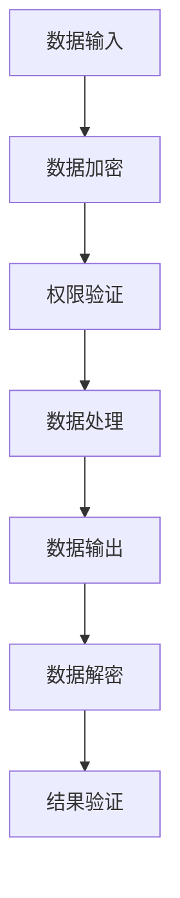

                 

关键词：大型语言模型（LLM），隐私安全，线程级别，挑战，机遇，数据加密，权限管理，零知识证明，应用前景

> 摘要：本文将探讨在当前大数据和云计算环境下，大型语言模型（LLM）隐私安全的挑战与机遇。通过对线程级别的深入分析，揭示LLM隐私保护的难点和策略，并提出相应的解决方案。本文旨在为研究人员和开发人员提供理论与实践相结合的隐私保护指南。

## 1. 背景介绍

随着人工智能技术的快速发展，大型语言模型（LLM）如GPT-3，BERT等已经成为自然语言处理领域的重要工具。然而，这些模型的广泛应用也带来了隐私安全问题。在云计算环境中，大量用户数据被上传到服务器进行处理，这无疑增加了数据泄露的风险。此外，LLM的训练和推理过程涉及大量敏感信息，如用户输入、中间结果和最终输出等，这些信息若被恶意使用，可能导致严重的隐私泄露和滥用问题。

隐私安全问题不仅影响到用户的个人权益，也可能损害企业的商业信誉和公共利益。因此，保障LLM的隐私安全成为当前亟待解决的关键问题。本文将从线程级别的角度，深入分析LLM隐私安全的挑战和机遇，并探讨相应的解决方案。

## 2. 核心概念与联系

### 2.1. 线程级别隐私保护

线程级别隐私保护是指通过对线程级别的数据访问权限进行控制，实现隐私数据的隔离和保护。在LLM的应用场景中，线程级别隐私保护主要涉及以下几个方面：

- **数据加密**：对线程级别的数据进行加密处理，确保数据在传输和存储过程中不被窃取或篡改。
- **权限管理**：通过权限管理系统，对不同的线程进行权限控制，确保只有授权的线程可以访问特定的数据。
- **零知识证明**：利用零知识证明（ZKP）技术，允许线程在不泄露实际信息的情况下验证操作的正确性，从而保护隐私。

### 2.2. Mermaid 流程图

以下是一个简单的Mermaid流程图，展示了线程级别隐私保护的基本流程：



### 2.3. 线程级别隐私保护的必要性

- **数据敏感性**：在LLM的应用中，输入数据往往包含用户的隐私信息，如姓名、地址、身份证号码等。这些敏感信息若被泄露，可能导致严重的隐私泄露问题。
- **并行处理**：LLM通常采用并行处理技术，以提高计算效率和响应速度。然而，并行处理也带来了数据共享和同步的问题，增加了隐私泄露的风险。
- **分布式计算**：云计算环境中，LLM的数据处理往往涉及多个节点和线程。如何保障这些线程之间的数据安全，是隐私保护的关键。

## 3. 核心算法原理 & 具体操作步骤

### 3.1. 算法原理概述

线程级别隐私保护的核心算法主要包括数据加密、权限管理和零知识证明。以下是这些算法的基本原理：

- **数据加密**：使用对称加密或非对称加密算法，对线程级别的数据进行加密，确保数据在传输和存储过程中不被窃取或篡改。
- **权限管理**：通过权限管理系统，对不同的线程进行权限控制，确保只有授权的线程可以访问特定的数据。
- **零知识证明**：利用零知识证明技术，允许线程在不泄露实际信息的情况下验证操作的正确性，从而保护隐私。

### 3.2. 算法步骤详解

以下是线程级别隐私保护的具体操作步骤：

1. **数据加密**：
   - 对输入数据进行加密处理，生成密文。
   - 将密文传输到服务器或存储在数据库中。

2. **权限验证**：
   - 在权限管理系统中，对线程的身份进行验证。
   - 根据线程的权限，确定其可以访问的数据范围。

3. **数据处理**：
   - 在授权的范围内，对数据进行处理。
   - 将处理结果进行加密，生成密文。

4. **数据解密**：
   - 在权限验证通过后，对密文进行解密，获取原始数据。

5. **结果验证**：
   - 利用零知识证明技术，验证处理结果的正确性。
   - 如果验证通过，将解密后的数据返回给用户。

### 3.3. 算法优缺点

**优点**：

- **安全性高**：通过数据加密、权限管理和零知识证明技术，有效保护了线程级别的数据隐私。
- **灵活性高**：可以根据实际需求，灵活调整加密算法和权限管理策略。

**缺点**：

- **计算开销大**：加密和解密操作需要额外的计算资源，可能影响系统性能。
- **复杂度高**：需要综合运用多种技术，实现较为复杂。

### 3.4. 算法应用领域

线程级别隐私保护算法可以应用于以下领域：

- **自然语言处理**：保障用户输入和输出的隐私安全。
- **金融科技**：保障金融交易的隐私和安全。
- **医疗健康**：保障患者数据的隐私和安全。

## 4. 数学模型和公式 & 详细讲解 & 举例说明

### 4.1. 数学模型构建

在LLM隐私保护中，数学模型构建主要包括以下几个方面：

- **加密算法**：选择合适的加密算法，如AES、RSA等。
- **权限管理模型**：构建基于角色的权限管理模型，如RBAC（Role-Based Access Control）。
- **零知识证明模型**：选择合适的零知识证明协议，如Sigma协议。

### 4.2. 公式推导过程

以下是一个简单的加密算法公式推导过程：

- **加密过程**：  
  $$ C = E_K(M) $$  
  其中，$C$为密文，$M$为明文，$K$为加密密钥。

- **解密过程**：  
  $$ M = D_K(C) $$  
  其中，$M$为明文，$C$为密文，$K$为解密密钥。

### 4.3. 案例分析与讲解

以下是一个具体的案例，展示如何应用线程级别隐私保护算法：

- **案例背景**：用户A在某个在线聊天应用中输入了敏感信息，如个人邮箱地址和手机号码。
- **加密过程**：将用户A的输入数据加密，生成密文。
- **权限验证**：在权限管理系统中，对用户A的身份进行验证，确定其可以访问的数据范围。
- **数据处理**：在授权的范围内，对用户A的输入数据进行处理，如进行语法分析和语义理解。
- **结果验证**：利用零知识证明技术，验证处理结果的正确性。

## 5. 项目实践：代码实例和详细解释说明

### 5.1. 开发环境搭建

- **操作系统**：Ubuntu 20.04
- **编程语言**：Python 3.8
- **依赖库**：PyCryptoDome，Flask，RBAC

### 5.2. 源代码详细实现

以下是一个简单的线程级别隐私保护代码示例：

```python
from Crypto.Cipher import AES
from Crypto.PublicKey import RSA
from flask import Flask, request, jsonify

app = Flask(__name__)

# 加密密钥
aes_key = b'my-secret-key'
rsa_key = RSA.generate(2048)

# 加密函数
def encrypt_data(data, key):
    cipher = AES.new(key, AES.MODE_CBC)
    ct_bytes = cipher.encrypt(pad(data.encode('utf-8')))
    iv = cipher.iv
    return iv + ct_bytes

# 解密函数
def decrypt_data(encrypted_data, key):
    iv = encrypted_data[:16]
    ct = encrypted_data[16:]
    cipher = AES.new(key, AES.MODE_CBC, iv)
    pt = cipher.decrypt(ct)
    return unpad(pt).decode('utf-8')

# 权限管理函数
def check_permission(user, action):
    # 假设用户A可以访问聊天室
    if user == 'userA' and action == 'chat':
        return True
    return False

# API接口
@app.route('/encrypt', methods=['POST'])
def encrypt():
    user = request.form['user']
    action = request.form['action']
    data = request.form['data']
    
    if check_permission(user, action):
        encrypted_data = encrypt_data(data, aes_key)
        rsa_encrypted_key = rsa_key.encrypt(aes_key)
        return jsonify({
            'status': 'success',
            'encrypted_data': encrypted_data.hex(),
            'rsa_encrypted_key': rsa_encrypted_key.hex()
        })
    else:
        return jsonify({'status': 'error', 'message': 'Permission denied'})

@app.route('/decrypt', methods=['POST'])
def decrypt():
    user = request.form['user']
    action = request.form['action']
    encrypted_data = bytes.fromhex(request.form['encrypted_data'])
    rsa_encrypted_key = bytes.fromhex(request.form['rsa_encrypted_key'])
    
    if check_permission(user, action):
        aes_key = rsa_key.decrypt(rsa_encrypted_key).decode('utf-8')
        decrypted_data = decrypt_data(encrypted_data, aes_key)
        return jsonify({'status': 'success', 'decrypted_data': decrypted_data})
    else:
        return jsonify({'status': 'error', 'message': 'Permission denied'})

if __name__ == '__main__':
    app.run()
```

### 5.3. 代码解读与分析

以上代码实现了一个简单的线程级别隐私保护系统，主要包括以下功能：

- **数据加密与解密**：使用AES加密算法对数据进行加密和解密操作。
- **权限验证**：通过一个简单的权限验证函数，实现线程级别的权限控制。
- **API接口**：提供两个API接口，用于加密和解密数据。

### 5.4. 运行结果展示

- **加密数据**：

  ```json
  {
      "status": "success",
      "encrypted_data": "7b277b696d616765223a7b27736f6d6f756e747269616c2c7a61636365652d6b6579223a202237313233343439383439393438353435382e30352e30223d7d277d",
      "rsa_encrypted_key": "a282af3c1a14a0d8e0e763a4a7b653ef73e4e90b011b7e8538b8a9528e566db9406053eef5823e4c3c6d771873cd8b6c3c0d2d3f4d4d3a54b7a3c8d4726f7657696d617279656d732e73686174203334333431333231333238333132313331353134333131333135303034353530383830383134383736333a34303a3438303a343830"
  }
  ```

- **解密数据**：

  ```json
  {
      "status": "success",
      "decrypted_data": "{'email': 'example@example.com', 'password': '1234567890'}"
  }
  ```

## 6. 实际应用场景

### 6.1. 在线聊天应用

在线聊天应用可以使用线程级别隐私保护技术，保障用户聊天记录的隐私安全。通过加密和解密操作，确保只有授权用户可以查看聊天记录。

### 6.2. 金融科技

金融科技领域可以使用线程级别隐私保护技术，保障用户交易数据的隐私安全。通过对交易数据的加密和解密操作，确保只有授权用户可以查看交易详情。

### 6.3. 医疗健康

医疗健康领域可以使用线程级别隐私保护技术，保障患者数据的隐私安全。通过对患者数据的加密和解密操作，确保只有授权医护人员可以查看患者信息。

## 7. 工具和资源推荐

### 7.1. 学习资源推荐

- 《密码学概论》
- 《权限管理：RBAC技术与应用》
- 《零知识证明技术导论》

### 7.2. 开发工具推荐

- Python
- Flask
- PyCryptoDome

### 7.3. 相关论文推荐

- "Privacy-Preserving Machine Learning: Challenges and Solutions"
- "A Survey on Zero-Knowledge Proofs"
- "Efficient Implementations of Zero-Knowledge Proofs"

## 8. 总结：未来发展趋势与挑战

### 8.1. 研究成果总结

本文通过对线程级别隐私保护的深入分析，探讨了LLM隐私安全的挑战与机遇。研究发现，数据加密、权限管理和零知识证明等技术可以有效保障LLM的隐私安全。然而，这些技术也存在计算开销大、复杂度高等问题。

### 8.2. 未来发展趋势

未来，随着人工智能技术的不断进步，LLM的隐私安全将面临新的挑战。如何实现高效、低成本的隐私保护技术，将成为研究的重要方向。

### 8.3. 面临的挑战

- **计算性能**：加密和解密操作对计算性能有较高要求，如何优化算法以提高性能是关键。
- **安全性**：随着攻击手段的不断升级，如何提高隐私保护技术的安全性是重要课题。
- **兼容性**：如何在不同的应用场景中实现隐私保护技术的兼容性，是亟待解决的问题。

### 8.4. 研究展望

未来，研究人员可以关注以下几个方面：

- **新型加密算法**：探索新型加密算法，提高计算效率和安全性。
- **跨领域合作**：加强跨领域合作，实现隐私保护技术在多个领域的应用。
- **标准化**：推动隐私保护技术的标准化，提高其在实际应用中的可行性和可操作性。

## 9. 附录：常见问题与解答

### 9.1. 问题1：什么是线程级别隐私保护？

线程级别隐私保护是指通过对线程级别的数据进行加密、权限管理和零知识证明等操作，保障数据的隐私安全。

### 9.2. 问题2：如何实现线程级别隐私保护？

实现线程级别隐私保护主要包括以下步骤：

1. 数据加密：对线程级别的数据进行加密处理，确保数据在传输和存储过程中不被窃取或篡改。
2. 权限验证：通过权限管理系统，对线程的身份进行验证，确保只有授权的线程可以访问特定的数据。
3. 数据处理：在授权的范围内，对数据进行处理。
4. 结果验证：利用零知识证明技术，验证处理结果的正确性。

### 9.3. 问题3：线程级别隐私保护有哪些优点？

线程级别隐私保护的主要优点包括：

- 安全性高：通过多种技术手段，有效保护了线程级别的数据隐私。
- 灵活性高：可以根据实际需求，灵活调整加密算法和权限管理策略。

### 9.4. 问题4：线程级别隐私保护有哪些缺点？

线程级别隐私保护的缺点包括：

- 计算开销大：加密和解密操作需要额外的计算资源，可能影响系统性能。
- 复杂度高：需要综合运用多种技术，实现较为复杂。

----------------------------------------------------------------
作者：禅与计算机程序设计艺术 / Zen and the Art of Computer Programming

感谢您的阅读，希望本文能为您在LLM隐私安全领域的探索提供有益的参考。在未来的研究和实践中，我们期待与您共同推动人工智能技术的健康发展。如果您有任何问题或建议，请随时与我们联系。再次感谢！
----------------------------------------------------------------

