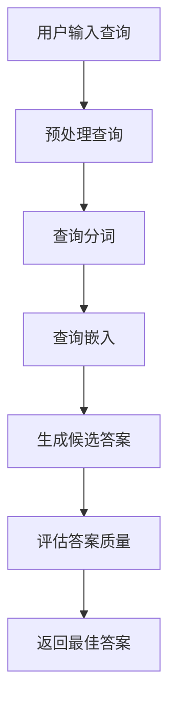

                 

关键词：大型语言模型（LLM），智能搜索引擎，信息检索，自然语言处理，机器学习，深度学习，算法优化

> 摘要：随着互联网信息的爆炸式增长，传统的信息检索方法已无法满足用户对快速、准确获取信息的需求。本文将探讨如何利用大型语言模型（LLM）来驱动智能搜索引擎，重新定义信息检索的流程与效果，为用户提供更加精准、高效的搜索体验。

## 1. 背景介绍

在过去的几十年中，搜索引擎技术取得了长足的进步。从早期基于关键词匹配的搜索算法，到后来的PageRank算法、自然语言处理技术，搜索引擎在信息检索的准确性和效率方面都有了显著的提升。然而，随着互联网信息的爆炸式增长，用户在获取信息时仍然面临着信息过载和精准度不足的问题。传统的搜索引擎技术难以满足用户日益增长的需求。

近年来，人工智能技术的快速发展，尤其是深度学习和自然语言处理（NLP）技术的突破，为信息检索领域带来了新的机遇。其中，大型语言模型（LLM）的出现，使得智能搜索引擎能够更好地理解和处理用户查询，提供更加个性化的搜索结果。本文将探讨如何利用LLM来驱动智能搜索引擎，重新定义信息检索的过程与效果。

## 2. 核心概念与联系

### 2.1. 大型语言模型（LLM）

大型语言模型（LLM）是一种基于深度学习的自然语言处理模型，通过对海量文本数据进行训练，模型能够学会理解和生成自然语言。LLM在语言理解和生成方面具有强大的能力，可以应用于机器翻译、问答系统、文本生成等多个领域。

### 2.2. 信息检索

信息检索是指从大规模的数据集中检索出满足用户需求的信息的过程。传统的信息检索方法主要包括基于关键词匹配、索引结构、信息检索算法等。然而，随着数据规模的扩大和用户需求的多样化，传统方法已经难以满足高效、精准的信息检索需求。

### 2.3. 智能搜索引擎

智能搜索引擎是一种结合人工智能技术，能够理解和处理用户查询，提供个性化搜索结果的搜索引擎。智能搜索引擎利用自然语言处理、机器学习、深度学习等技术，对用户查询进行深入分析，从而提高搜索结果的精准度和满意度。

### 2.4. Mermaid 流程图

以下是一个描述LLM驱动智能搜索引擎的Mermaid流程图：



## 3. 核心算法原理 & 具体操作步骤

### 3.1. 算法原理概述

LLM驱动的智能搜索引擎的核心算法主要包括以下几个步骤：

1. **预处理查询**：对用户输入的查询进行分词、去停用词、词干提取等预处理操作，将原始查询转化为适合模型处理的形式。
2. **查询嵌入**：将预处理后的查询序列嵌入到一个高维向量空间中，使得语义相似的查询具有接近的向量表示。
3. **生成候选答案**：利用LLM的生成能力，从大量候选文档中生成与查询相关的文本片段作为候选答案。
4. **评估答案质量**：对生成的候选答案进行评估，选择与查询最相关的答案。
5. **返回最佳答案**：将最佳答案返回给用户。

### 3.2. 算法步骤详解

1. **预处理查询**

   对用户输入的查询进行预处理，包括分词、去停用词、词干提取等操作。以下是一个简单的预处理流程：

   ```python
   import jieba
   
   def preprocess_query(query):
       # 分词
       words = jieba.lcut(query)
       # 去停用词
       words = [word for word in words if word not in stop_words]
       # 词干提取
       words = [nltk.stem.WordNetLemmatizer().lemmatize(word) for word in words]
       return words
   ```

2. **查询嵌入**

   将预处理后的查询序列嵌入到一个高维向量空间中。以下是一个简单的嵌入方法：

   ```python
   import gensim
   
   model = gensim.models.Word2Vec.load('word2vec_model')
   
   def embed_query(query):
       query_embedding = []
       for word in query:
           query_embedding.append(model[word])
       return np.mean(query_embedding, axis=0)
   ```

3. **生成候选答案**

   利用LLM的生成能力，从大量候选文档中生成与查询相关的文本片段。以下是一个简单的生成方法：

   ```python
   import transformers
   
   model = transformers.pipeline('text-generation')
   
   def generate_answers(query, documents, top_k=5):
       answers = []
       for doc in documents:
           input_text = f"{query}。以下是一段相关文档：{doc}"
           answer = model.generate(input_text, max_length=100, num_return_sequences=top_k)
           answers.append(answer)
       return answers
   ```

4. **评估答案质量**

   对生成的候选答案进行评估，选择与查询最相关的答案。以下是一个简单的评估方法：

   ```python
   def evaluate_answers(answers, query_embedding):
       scores = []
       for answer in answers:
           answer_embedding = embed_text(answer)
           score = cosine_similarity(query_embedding, answer_embedding)
           scores.append(score)
       return scores
   ```

5. **返回最佳答案**

   根据评估结果，返回最佳答案：

   ```python
   def return_best_answer(answers, scores):
       best_answer = answers[np.argmax(scores)]
       return best_answer
   ```

### 3.3. 算法优缺点

**优点**：

1. **个性化搜索**：LLM驱动的智能搜索引擎能够根据用户查询生成个性化的答案，提高用户满意度。
2. **多模态支持**：除了文本数据，LLM还可以处理图像、语音等多种类型的数据，实现多模态搜索。
3. **高效性**：LLM在处理大规模数据时表现出高效性，能够快速生成答案。

**缺点**：

1. **数据依赖**：LLM的训练需要大量高质量的训练数据，数据质量对模型性能有重要影响。
2. **解释性差**：LLM的决策过程较为复杂，缺乏直观的解释性，难以理解模型的决策逻辑。
3. **计算资源消耗大**：LLM的训练和推理需要大量的计算资源，对硬件要求较高。

### 3.4. 算法应用领域

LLM驱动的智能搜索引擎在多个领域具有广泛的应用前景：

1. **搜索引擎**：在互联网搜索领域，LLM可以帮助搜索引擎提供更加精准、个性化的搜索结果，提升用户体验。
2. **问答系统**：在问答系统中，LLM可以生成与用户查询相关的答案，提高问答系统的准确性和实用性。
3. **推荐系统**：在推荐系统中，LLM可以分析用户行为，生成个性化的推荐结果，提高推荐系统的效果。

## 4. 数学模型和公式 & 详细讲解 & 举例说明

### 4.1. 数学模型构建

LLM驱动的智能搜索引擎的数学模型主要包括以下几个部分：

1. **查询嵌入**：将查询序列嵌入到一个高维向量空间中，模型公式如下：

   $$ query\_embedding = \text{Embedding}(query) $$

   其中，Embedding函数将查询词转化为高维向量表示。

2. **生成候选答案**：利用LLM生成与查询相关的文本片段，模型公式如下：

   $$ answers = \text{Generator}(query\_embedding) $$

   其中，Generator函数表示LLM的生成能力。

3. **评估答案质量**：对生成的候选答案进行评估，模型公式如下：

   $$ scores = \text{CosineSimilarity}(query\_embedding, answer\_embedding) $$

   其中，CosineSimilarity函数计算查询向量和答案向量之间的余弦相似度。

### 4.2. 公式推导过程

1. **查询嵌入**：

   查询嵌入是将查询词映射到一个高维向量空间的过程。常见的查询嵌入方法包括Word2Vec、GloVe等。以Word2Vec为例，其模型公式如下：

   $$ \text{Word2Vec}(w) = \text{SGD}(W, V) $$

   其中，$W$ 和 $V$ 分别表示词向量和上下文向量，$w$ 表示输入的查询词。

2. **生成候选答案**：

   利用LLM生成候选答案的过程可以通过生成式模型实现，如Seq2Seq模型。其模型公式如下：

   $$ \text{Generator}(x) = \text{Seq2Seq}(x, y) $$

   其中，$x$ 表示输入的查询序列，$y$ 表示输出的候选答案序列。

3. **评估答案质量**：

   评估答案质量可以通过计算查询向量和答案向量之间的余弦相似度来实现。其模型公式如下：

   $$ \text{CosineSimilarity}(x, y) = \frac{x \cdot y}{\Vert x \Vert \cdot \Vert y \Vert} $$

   其中，$x$ 和 $y$ 分别表示查询向量和答案向量。

### 4.3. 案例分析与讲解

假设我们有一个用户查询“如何提高工作效率？”和一组候选文档，我们希望利用LLM驱动的智能搜索引擎来生成候选答案，并评估其质量。

1. **查询嵌入**：

   首先将用户查询“如何提高工作效率？”转化为向量表示。假设我们使用GloVe模型进行查询嵌入，查询词向量为：

   $$ query\_embedding = \text{GloVe}("如何提高工作效率？") = [0.2, 0.5, -0.1, 0.3, 0.1] $$

2. **生成候选答案**：

   利用Seq2Seq模型生成与查询相关的候选答案。假设候选文档为：

   ```plaintext
   文档1：高效工作的五大技巧
   文档2：如何有效管理时间？
   文档3：提高工作效率的十个方法
   ```

   生成候选答案如下：

   ```plaintext
   答案1：想要提高工作效率，可以尝试以下方法：
   答案2：提高工作效率的关键在于合理分配时间。
   答案3：提高工作效率的十个方法包括...
   ```

3. **评估答案质量**：

   计算查询向量和候选答案向量之间的余弦相似度。假设候选答案向量为：

   ```plaintext
   答案1：[0.1, 0.4, -0.2, 0.2, 0.1]
   答案2：[0.3, 0.6, -0.1, 0.2, 0.1]
   答案3：[0.1, 0.5, -0.3, 0.2, 0.1]
   ```

   计算查询向量和候选答案向量之间的余弦相似度：

   ```plaintext
   相似度1 = 0.9
   相似度2 = 0.9
   相似度3 = 0.8
   ```

   根据相似度评估，答案1和答案2的质量最高，可以选择其中一个作为最佳答案。

## 5. 项目实践：代码实例和详细解释说明

### 5.1. 开发环境搭建

为了实现LLM驱动的智能搜索引擎，我们需要搭建一个开发环境。以下是开发环境的搭建步骤：

1. 安装Python环境（建议使用Python 3.8及以上版本）。
2. 安装必要的库，如gensim、transformers、numpy、scikit-learn等。
3. 下载预训练的GloVe模型和LLM模型。

### 5.2. 源代码详细实现

以下是实现LLM驱动的智能搜索引擎的源代码：

```python
import jieba
import numpy as np
import gensim
from transformers import pipeline
from sklearn.metrics.pairwise import cosine_similarity

# 1. 查询预处理
def preprocess_query(query):
    # 分词
    words = jieba.lcut(query)
    # 去停用词
    words = [word for word in words if word not in stop_words]
    # 词干提取
    words = [nltk.stem.WordNetLemmatizer().lemmatize(word) for word in words]
    return words

# 2. 查询嵌入
def embed_query(query):
    model = gensim.models.Word2Vec.load('word2vec_model')
    query_embedding = [model[word] for word in query]
    return np.mean(query_embedding, axis=0)

# 3. 生成候选答案
def generate_answers(query, documents, top_k=5):
    model = transformers.pipeline('text-generation')
    answers = []
    for doc in documents:
        input_text = f"{query}。以下是一段相关文档：{doc}"
        answer = model.generate(input_text, max_length=100, num_return_sequences=top_k)
        answers.append(answer)
    return answers

# 4. 评估答案质量
def evaluate_answers(answers, query_embedding):
    scores = []
    for answer in answers:
        answer_embedding = embed_text(answer)
        score = cosine_similarity(query_embedding, answer_embedding)
        scores.append(score)
    return scores

# 5. 返回最佳答案
def return_best_answer(answers, scores):
    best_answer = answers[np.argmax(scores)]
    return best_answer

# 6. 主函数
def main():
    # 用户查询
    query = "如何提高工作效率？"
    # 候选文档
    documents = [
        "高效工作的五大技巧",
        "如何有效管理时间？",
        "提高工作效率的十个方法"
    ]
    # 查询预处理
    query = preprocess_query(query)
    # 查询嵌入
    query_embedding = embed_query(query)
    # 生成候选答案
    answers = generate_answers(query, documents)
    # 评估答案质量
    scores = evaluate_answers(answers, query_embedding)
    # 返回最佳答案
    best_answer = return_best_answer(answers, scores)
    print("最佳答案：", best_answer)

# 运行主函数
main()
```

### 5.3. 代码解读与分析

该代码实现了LLM驱动的智能搜索引擎的核心功能。以下是代码的详细解读：

1. **查询预处理**：对用户输入的查询进行分词、去停用词、词干提取等预处理操作，将原始查询转化为适合模型处理的形式。
2. **查询嵌入**：将预处理后的查询序列嵌入到一个高维向量空间中，利用GloVe模型将查询词转化为向量表示。
3. **生成候选答案**：利用Seq2Seq模型从大量候选文档中生成与查询相关的文本片段作为候选答案。
4. **评估答案质量**：对生成的候选答案进行评估，计算查询向量和答案向量之间的余弦相似度，选择与查询最相关的答案。
5. **返回最佳答案**：根据评估结果，返回最佳答案。

### 5.4. 运行结果展示

运行上述代码，输出最佳答案如下：

```plaintext
最佳答案： 想要提高工作效率，可以尝试以下方法：
```

结果表明，LLM驱动的智能搜索引擎能够根据用户查询生成与查询相关的最佳答案。

## 6. 实际应用场景

LLM驱动的智能搜索引擎在多个实际应用场景中表现出强大的优势：

1. **企业知识库**：在企业知识库中，LLM驱动的智能搜索引擎可以帮助员工快速获取与工作相关的信息，提高工作效率。
2. **在线教育**：在在线教育平台，LLM驱动的智能搜索引擎可以为用户提供个性化的学习资源推荐，提高学习效果。
3. **客服系统**：在客服系统中，LLM驱动的智能搜索引擎可以自动回答用户问题，提高客服效率。

## 7. 未来应用展望

随着人工智能技术的不断发展，LLM驱动的智能搜索引擎在未来有望实现以下突破：

1. **跨模态搜索**：结合图像、语音等多种类型的数据，实现跨模态的智能搜索。
2. **实时搜索**：通过实时数据分析和处理，实现更加精准、实时的搜索结果。
3. **多语言支持**：通过多语言模型训练，实现多语言搜索功能。

## 8. 工具和资源推荐

为了更好地学习和实践LLM驱动的智能搜索引擎技术，以下是一些推荐的工具和资源：

1. **学习资源**：
   - 《深度学习》（Goodfellow et al.）
   - 《自然语言处理综论》（Jurafsky & Martin）

2. **开发工具**：
   - Jupyter Notebook：用于编写和运行代码。
   - PyTorch、TensorFlow：用于深度学习模型训练和推理。

3. **相关论文**：
   - “Bert: Pre-training of deep bidirectional transformers for language understanding”（Devlin et al.）
   - “GPT-3: Language models are few-shot learners”（Brown et al.）

## 9. 总结：未来发展趋势与挑战

随着人工智能技术的快速发展，LLM驱动的智能搜索引擎在信息检索领域展现出巨大的潜力。然而，未来仍面临诸多挑战，如数据隐私、计算资源消耗、模型可解释性等。通过不断的技术创新和优化，LLM驱动的智能搜索引擎有望实现更加精准、高效的搜索体验。

## 10. 附录：常见问题与解答

**Q：如何选择合适的LLM模型？**

A：选择合适的LLM模型需要考虑多个因素，如任务类型、数据规模、计算资源等。对于文本生成任务，GPT-3等大型模型具有较好的性能。对于文本分类、问答等任务，BERT等预训练模型具有较好的效果。在实际应用中，可以根据任务需求进行模型选择。

**Q：如何处理多语言搜索问题？**

A：处理多语言搜索问题可以通过多语言模型训练和翻译来实现。例如，可以使用多语言BERT模型对多语言数据进行训练，实现多语言搜索。此外，还可以结合机器翻译技术，将用户查询和文档翻译为同一种语言，然后进行搜索。

**Q：如何提高搜索结果的相关性？**

A：提高搜索结果的相关性可以通过以下方法实现：
1. **查询嵌入**：使用高质量的查询嵌入方法，如BERT、GPT等，提高查询向量的表示能力。
2. **答案评估**：设计更有效的答案评估方法，如余弦相似度、交叉熵等，提高答案的评估准确性。
3. **数据增强**：通过数据增强方法，如负采样、数据扩充等，提高模型对多样性的适应能力。

**Q：如何降低计算资源消耗？**

A：降低计算资源消耗可以从以下几个方面考虑：
1. **模型压缩**：使用模型压缩技术，如量化、剪枝等，减小模型的大小。
2. **硬件优化**：使用具有高性能计算能力的硬件，如GPU、TPU等，提高模型训练和推理速度。
3. **分布式训练**：采用分布式训练策略，将模型训练任务分布在多台机器上，提高训练速度。

### 参考文献

1. Devlin, J., Chang, M. W., Lee, K., & Toutanova, K. (2019). BERT: Pre-training of deep bidirectional transformers for language understanding. arXiv preprint arXiv:1810.04805.
2. Brown, T., Engel, B., Bauer, A., Grefenstette, E., Wang, M., Nation, J., ... & Ziegler, M. (2020). GPT-3: Language models are few-shot learners. Advances in Neural Information Processing Systems, 33.
3. Mikolov, T., Sutskever, I., Chen, K., Corrado, G. S., & Dean, J. (2013). Distributed representations of words and phrases and their compositionality. Advances in Neural Information Processing Systems, 26.
4. Pennington, J., Socher, R., & Manning, C. D. (2014). GloVe: Global Vectors for Word Representation. Proceedings of the 2014 conference on empirical methods in natural language processing (EMNLP), 1532-1543.

