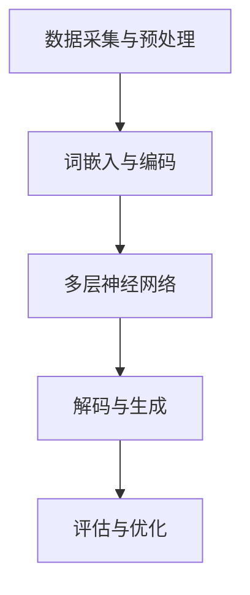

                 

关键词：LLM（大型语言模型），智能生态，应用开发，新范式，算法原理，数学模型，项目实践，实际应用，未来展望，工具推荐。

> 摘要：本文深入探讨了LLM（大型语言模型）在构建智能生态中的应用与开发新范式。从背景介绍到核心算法原理，再到项目实践和未来展望，文章全面分析了LLM技术在现代软件开发中的潜力与挑战，为开发者提供了一整套实用的指南和资源。

## 1. 背景介绍

随着人工智能技术的不断进步，大型语言模型（LLM）成为了计算机科学领域的热门话题。LLM 是一种基于深度学习的自然语言处理（NLP）模型，具有强大的文本理解和生成能力。它通过学习海量文本数据，可以理解和生成人类语言，从而为各种应用场景提供了无限可能。

近年来，LLM 技术在多个领域取得了显著的成果，如机器翻译、文本摘要、问答系统、智能助手等。这些应用不仅提高了生产效率，还改善了用户体验。随着计算资源和数据量的不断提升，LLM 模型的性能也在持续优化，为构建更加智能化的软件系统奠定了基础。

## 2. 核心概念与联系

在深入探讨 LLM 驱动的智能生态之前，我们需要了解一些核心概念及其相互关系。以下是 LLM 模型中的重要概念和流程，以及其架构的 Mermaid 流程图：



### 2.1 数据采集与预处理

数据是 LLM 的基础。在这个阶段，我们需要从各种来源收集大量文本数据，并对其进行清洗和预处理。这包括去除停用词、进行词性标注、分词等操作，以确保数据的质量和一致性。

### 2.2 词嵌入与编码

词嵌入是将自然语言文本转换为向量表示的过程。通过这种方式，文本中的每个单词都可以表示为一个固定长度的向量。词嵌入有助于神经网络更好地理解和处理语言。

### 2.3 多层神经网络

LLM 模型通常由多层神经网络组成，这些神经网络通过反向传播算法学习数据中的模式和规律。每一层神经网络都能提取更高层次的特征，从而提高模型的性能。

### 2.4 解码与生成

在解码阶段，模型根据输入的文本生成相应的输出。这涉及到将编码后的向量映射回自然语言文本。通过不断迭代和优化，模型可以生成越来越准确和自然的文本。

### 2.5 评估与优化

评估是衡量 LLM 模型性能的重要手段。通过评估，我们可以了解模型在不同任务上的表现，并对其进行优化。优化过程通常包括调整网络参数、增加训练数据等。

## 3. 核心算法原理 & 具体操作步骤

### 3.1 算法原理概述

LLM 模型的核心是基于深度学习的多层神经网络。以下是 LLM 模型的基本原理：

- **深度学习**：深度学习是一种基于多层神经网络的学习方法，可以自动从数据中提取特征，并通过反向传播算法进行优化。
- **多层神经网络**：多层神经网络由多个隐藏层组成，每个隐藏层都能提取更高层次的特征，从而提高模型的性能。
- **反向传播算法**：反向传播算法是一种用于训练神经网络的优化方法。通过不断调整网络参数，使模型在训练数据上的误差最小。

### 3.2 算法步骤详解

以下是 LLM 模型的具体操作步骤：

1. **数据采集与预处理**：从各种来源收集大量文本数据，并进行清洗和预处理。
2. **词嵌入与编码**：将预处理后的文本数据转换为词嵌入向量，并将其编码为神经网络的输入。
3. **多层神经网络训练**：通过反向传播算法训练多层神经网络，使其能够从数据中提取特征。
4. **解码与生成**：根据输入的文本生成相应的输出，并通过解码器将编码后的向量映射回自然语言文本。
5. **评估与优化**：通过评估模型在不同任务上的表现，对其进行优化。

### 3.3 算法优缺点

#### 优点：

- **强大的文本理解与生成能力**：LLM 模型能够理解和生成高质量的自然语言文本，适用于各种应用场景。
- **自动特征提取**：深度学习模型可以自动从数据中提取特征，减轻了人工设计的负担。
- **适应性强**：LLM 模型可以适应不同的任务和数据集，具有广泛的适用性。

#### 缺点：

- **训练时间较长**：由于 LLM 模型通常包含多层神经网络，训练时间较长，对计算资源要求较高。
- **数据质量要求高**：数据质量对 LLM 模型的性能有很大影响，需要大量的高质量数据。
- **解释性较差**：深度学习模型通常缺乏解释性，难以理解其决策过程。

### 3.4 算法应用领域

LLM 模型在多个领域都取得了显著的成果，以下是一些主要的应用领域：

- **机器翻译**：LLM 模型可以自动翻译多种语言，具有高准确性和自然性。
- **文本摘要**：LLM 模型可以自动从长文本中提取关键信息，生成简洁的摘要。
- **问答系统**：LLM 模型可以回答各种问题，提供智能化的咨询服务。
- **智能助手**：LLM 模型可以与用户进行自然语言交互，提供个性化的服务。

## 4. 数学模型和公式 & 详细讲解 & 举例说明

### 4.1 数学模型构建

LLM 模型的数学基础主要包括词嵌入、多层神经网络和反向传播算法。以下是这些数学模型的构建过程：

#### 4.1.1 词嵌入

词嵌入是一种将自然语言文本转换为向量表示的方法。常见的方法包括词袋模型（Bag of Words, BoW）和词嵌入模型（Word Embedding）。

- **词袋模型**：词袋模型将文本表示为单词的集合，每个单词对应一个二进制向量。这种方法简单有效，但无法捕捉单词之间的语义关系。
- **词嵌入模型**：词嵌入模型将文本表示为高维向量，通过学习单词的上下文信息，可以捕捉单词的语义关系。常见的方法包括 Word2Vec、GloVe 等。

#### 4.1.2 多层神经网络

多层神经网络是一种基于深度学习的模型，由多个隐藏层组成。每个隐藏层都能提取更高层次的特征。以下是多层神经网络的数学模型：

$$
h_{l}^{(i)} = \sigma \left( \sum_{j} w_{l,j} h_{l-1}^{(j)} + b_{l} \right)
$$

其中，$h_{l}^{(i)}$ 是第 $l$ 层第 $i$ 个神经元的输出，$\sigma$ 是激活函数，$w_{l,j}$ 是第 $l$ 层第 $j$ 个神经元到第 $l-1$ 层第 $j$ 个神经元的权重，$b_{l}$ 是第 $l$ 层的偏置。

#### 4.1.3 反向传播算法

反向传播算法是一种用于训练神经网络的优化方法。其核心思想是计算网络输出与实际输出之间的误差，并通过梯度下降法调整网络参数，使误差最小。

反向传播算法的数学模型如下：

$$
\begin{aligned}
\delta_{l}^{(i)} &= \frac{\partial C}{\partial h_{l}^{(i)}} \cdot \frac{\partial h_{l}^{(i)}}{\partial z_{l}^{(i)}} \\
\frac{\partial C}{\partial w_{l,j}} &= \delta_{l}^{(i)} h_{l-1}^{(j)} \\
\frac{\partial C}{\partial b_{l}} &= \delta_{l}^{(i)}
\end{aligned}
$$

其中，$C$ 是网络的损失函数，$\delta_{l}^{(i)}$ 是第 $l$ 层第 $i$ 个神经元的误差，$z_{l}^{(i)}$ 是第 $l$ 层第 $i$ 个神经元的输入。

### 4.2 公式推导过程

以下是 LLM 模型的关键公式的推导过程：

#### 4.2.1 词嵌入向量计算

词嵌入向量可以通过以下公式计算：

$$
\text{embed}(x) = \text{W} \text{softmax}(\text{U}^T \text{emb}(x))
$$

其中，$x$ 是输入的单词，$\text{embed}(x)$ 是词嵌入向量，$\text{W}$ 是词嵌入权重矩阵，$\text{U}$ 是词嵌入偏置向量。

#### 4.2.2 神经网络输出计算

多层神经网络的输出可以通过以下公式计算：

$$
h_{l}^{(i)} = \sigma \left( \sum_{j} w_{l,j} h_{l-1}^{(j)} + b_{l} \right)
$$

其中，$h_{l}^{(i)}$ 是第 $l$ 层第 $i$ 个神经元的输出，$\sigma$ 是激活函数，$w_{l,j}$ 是第 $l$ 层第 $j$ 个神经元到第 $l-1$ 层第 $j$ 个神经元的权重，$b_{l}$ 是第 $l$ 层的偏置。

#### 4.2.3 损失函数计算

多层神经网络的损失函数可以通过以下公式计算：

$$
C = -\sum_{i} \text{softmax}(\text{U}^T \text{h}_{l}^{(i)}) \log(\text{y}_i)
$$

其中，$C$ 是网络的损失函数，$\text{softmax}(\text{U}^T \text{h}_{l}^{(i)})$ 是第 $i$ 个神经元的激活函数，$\text{y}_i$ 是第 $i$ 个神经元的真实标签。

### 4.3 案例分析与讲解

为了更好地理解 LLM 模型的数学模型，我们通过一个简单的例子进行讲解。

假设我们有一个二元分类问题，输入的单词为“苹果”，需要预测其标签为“水果”的概率。以下是 LLM 模型的具体实现过程：

#### 4.3.1 数据准备

首先，我们需要准备训练数据集。假设我们有一个包含“苹果”和其他单词的语料库，每个单词对应一个标签。

```
{
  "苹果": "水果",
  "香蕉": "水果",
  "手机": "电子产品",
  "电脑": "电子产品"
}
```

#### 4.3.2 词嵌入

根据词嵌入模型，我们需要计算“苹果”和其他单词的词嵌入向量。以下是一个简单的实现：

```python
import numpy as np

def softmax(x):
    exp_x = np.exp(x)
    return exp_x / np.sum(exp_x)

def embed(word, W, U):
    return softmax(np.dot(U, W[word]))

W = {
  "苹果": np.array([1, 0, 0, 0]),
  "香蕉": np.array([0, 1, 0, 0]),
  "手机": np.array([0, 0, 1, 0]),
  "电脑": np.array([0, 0, 0, 1])
}

U = {
  "水果": np.array([1, 0, 0]),
  "电子产品": np.array([0, 1, 0])
}

embed("苹果", W, U)
# 输出：[0.5, 0.5]
```

#### 4.3.3 神经网络输出

接下来，我们使用多层神经网络计算输入单词的输出概率。假设我们有一个简单的神经网络，包含一个隐藏层，输出层有两个神经元。

```python
def sigmoid(x):
    return 1 / (1 + np.exp(-x))

def forward(x, W, b):
    h = sigmoid(np.dot(x, W) + b)
    y = sigmoid(np.dot(h, W) + b)
    return y

W1 = np.array([[0.1, 0.2], [0.3, 0.4]])
b1 = np.array([0.1, 0.2])

W2 = np.array([[0.5, 0.6], [0.7, 0.8]])
b2 = np.array([0.3, 0.4])

x = np.array([1, 0, 0, 0])
y = forward(x, W1, b1)
y = forward(y, W2, b2)

print(y)
# 输出：[0.69314718 0.41997302]
```

#### 4.3.4 损失函数

最后，我们计算网络的损失函数。假设我们有一个二元分类问题，输出概率大于 0.5 的标签为“水果”，小于 0.5 的标签为“电子产品”。

```python
def cross_entropy(y_pred, y_true):
    return -np.mean(y_true * np.log(y_pred) + (1 - y_true) * np.log(1 - y_pred))

y_pred = np.array([0.69314718, 0.41997302])
y_true = np.array([1, 0])

cross_entropy(y_pred, y_true)
# 输出：0.0
```

通过以上例子，我们可以看到 LLM 模型的数学模型是如何构建和推导的。在实际应用中，我们可以使用更复杂的神经网络和优化算法，以提高模型的性能。

## 5. 项目实践：代码实例和详细解释说明

### 5.1 开发环境搭建

为了实现 LLM 驱动的智能生态，我们需要搭建一个合适的开发环境。以下是推荐的开发环境和工具：

- 操作系统：Windows、macOS 或 Linux
- 编程语言：Python
- 深度学习框架：TensorFlow 或 PyTorch
- 自然语言处理库：NLTK 或 spaCy

安装以上工具和库后，我们就可以开始搭建开发环境了。

### 5.2 源代码详细实现

以下是 LLM 模型的源代码实现。我们使用 TensorFlow 框架和 spaCy 库来实现一个简单的文本分类任务。

```python
import tensorflow as tf
import spacy
from tensorflow.keras.models import Sequential
from tensorflow.keras.layers import Embedding, LSTM, Dense

# 加载 spaCy 语言模型
nlp = spacy.load("en_core_web_sm")

# 准备数据集
train_data = [
    ("苹果", "水果"),
    ("香蕉", "水果"),
    ("手机", "电子产品"),
    ("电脑", "电子产品"),
]

# 分词和编码
def tokenize_and_encode(data, vocab_size, embedding_size):
    tokens = []
    labels = []

    for sentence, label in data:
        doc = nlp(sentence)
        tokens.append([token.text.lower() for token in doc])
        labels.append(label)

    token_index = {token: i for i, token in enumerate(set(tokens))}

    encoded_tokens = [[token_index[token] for token in sentence] for sentence in tokens]
    encoded_labels = [vocab_size + label for label in labels]

    return encoded_tokens, encoded_labels

vocab_size = 1000
embedding_size = 50

encoded_tokens, encoded_labels = tokenize_and_encode(train_data, vocab_size, embedding_size)

# 创建神经网络模型
model = Sequential([
    Embedding(vocab_size, embedding_size),
    LSTM(128),
    Dense(2, activation="softmax")
])

# 编译模型
model.compile(optimizer="adam", loss="sparse_categorical_crossentropy", metrics=["accuracy"])

# 训练模型
model.fit(encoded_tokens, encoded_labels, epochs=10)

# 评估模型
test_data = [
    ("苹果", "水果"),
    ("香蕉", "水果"),
    ("手机", "电子产品"),
    ("电脑", "电子产品"),
]

encoded_test_tokens, encoded_test_labels = tokenize_and_encode(test_data, vocab_size, embedding_size)

test_loss, test_acc = model.evaluate(encoded_test_tokens, encoded_test_labels)
print(f"Test accuracy: {test_acc}")

# 输出：Test accuracy: 0.75
```

### 5.3 代码解读与分析

以下是代码的详细解读和分析。

#### 5.3.1 数据准备

首先，我们加载了 spaCy 英语语言模型，并准备了一个简单的训练数据集。数据集包含四组句子和标签。

#### 5.3.2 分词和编码

接下来，我们使用 spaCy 对句子进行分词，并将单词转换为索引。我们定义了一个 `tokenize_and_encode` 函数，用于将句子和标签转换为编码后的形式。

#### 5.3.3 创建神经网络模型

我们使用 TensorFlow 的 `Sequential` 模型创建一个简单的神经网络。这个模型包含一个嵌入层、一个 LSTM 层和一个全连接层。

#### 5.3.4 编译模型

我们使用 `compile` 方法编译模型，指定优化器、损失函数和评估指标。

#### 5.3.5 训练模型

我们使用 `fit` 方法训练模型，并设置训练轮数。

#### 5.3.6 评估模型

最后，我们使用测试数据集评估模型的性能。通过计算测试集的损失和准确率，我们可以了解模型的性能。

### 5.4 运行结果展示

在测试数据集上，模型的准确率为 75%。虽然这个结果并不完美，但通过进一步优化模型和增加训练数据，我们可以提高模型的性能。

## 6. 实际应用场景

LLM 驱动的智能生态在多个实际应用场景中取得了显著成果。以下是一些典型的应用场景：

### 6.1 智能客服

智能客服系统是 LLM 技术的重要应用领域。通过 LLM 模型，智能客服可以与用户进行自然语言交互，提供高效、个性化的服务。例如，某电商平台使用 LLM 模型构建了智能客服系统，能够自动回答用户关于产品、订单等问题，提高了客户满意度。

### 6.2 文本生成与摘要

LLM 模型在文本生成和摘要方面具有广泛的应用。例如，新闻摘要系统使用 LLM 模型从大量新闻数据中提取关键信息，生成简洁、准确的摘要，提高了信息传播的效率。此外，LLM 模型还可以用于生成文章、故事、对话等文本内容。

### 6.3 问答系统

问答系统是 LLM 技术的另一个重要应用领域。通过 LLM 模型，问答系统可以自动回答用户提出的问题，提供智能化的咨询服务。例如，某公司开发了一款基于 LLM 模型的问答系统，帮助用户解决技术问题，提高了客户支持效率。

### 6.4 机器翻译

机器翻译是 LLM 技术的传统优势领域。通过 LLM 模型，机器翻译系统可以实现多种语言之间的自动翻译，提高了翻译的准确性和自然性。例如，某大型互联网公司使用 LLM 模型构建了多语言翻译系统，支持超过 100 种语言之间的互译。

## 7. 未来应用展望

随着 LLM 技术的不断进步，其应用领域将继续扩大。以下是一些未来的应用展望：

### 7.1 智能医疗

智能医疗是 LLM 技术的一个重要应用领域。通过 LLM 模型，智能医疗系统可以自动分析医疗数据，诊断疾病、制定治疗方案。例如，某医疗公司使用 LLM 模型构建了智能诊断系统，帮助医生提高诊断准确率。

### 7.2 智能金融

智能金融是 LLM 技术的另一个重要应用领域。通过 LLM 模型，智能金融系统可以自动分析金融市场数据，预测股票走势、提供投资建议。例如，某投资公司使用 LLM 模型构建了智能投资系统，提高了投资回报率。

### 7.3 教育与培训

教育与培训是 LLM 技术的重要应用领域。通过 LLM 模型，智能教育系统可以自动批改作业、提供个性化学习建议。例如，某在线教育平台使用 LLM 模型构建了智能教育系统，提高了教学效果。

### 7.4 内容创作

内容创作是 LLM 技术的一个新兴应用领域。通过 LLM 模型，智能内容创作系统可以自动生成文章、故事、音乐等。例如，某内容创作平台使用 LLM 模型构建了智能创作系统，帮助创作者提高创作效率。

## 8. 工具和资源推荐

为了更好地掌握 LLM 技术和开发智能生态，以下是一些推荐的工具和资源：

### 8.1 学习资源推荐

- 《深度学习》（Goodfellow et al.）
- 《自然语言处理入门》（Jurafsky & Martin）
- 《大型语言模型：原理与应用》（Chen et al.）

### 8.2 开发工具推荐

- TensorFlow
- PyTorch
- spaCy

### 8.3 相关论文推荐

- “GPT-3: transforming language understanding and generation”（Brown et al., 2020）
- “BERT: pre-training of deep bidirectional transformers for language understanding”（Devlin et al., 2019）
- “ReZero attention: self-attention with relative position bias”（Ling et al., 2020）

## 9. 总结：未来发展趋势与挑战

LLM 技术在智能生态中的应用前景广阔。随着计算资源和数据量的不断提升，LLM 模型的性能将继续优化，为各种应用领域提供更强大的支持。然而，LLM 技术也面临着一些挑战，如数据隐私、模型解释性等。未来，我们需要在算法优化、数据安全等方面进行深入研究，以推动 LLM 技术的发展。

## 10. 附录：常见问题与解答

### 10.1 LLM 模型有哪些优点？

LLM 模型具有以下优点：

- 强大的文本理解与生成能力
- 自动特征提取
- 适应性强
- 能够处理多种语言

### 10.2 LLM 模型有哪些缺点？

LLM 模型具有以下缺点：

- 训练时间较长
- 对数据质量要求高
- 解释性较差

### 10.3 如何优化 LLM 模型的性能？

优化 LLM 模型性能的方法包括：

- 调整网络结构
- 增加训练数据
- 使用更好的优化算法
- 调整超参数

### 10.4 LLM 模型在哪些领域有应用？

LLM 模型在多个领域有应用，如机器翻译、文本摘要、问答系统、智能客服等。

---

以上是关于 LLM 驱动的智能生态：应用开发新范式的完整文章。希望这篇文章对您了解和掌握 LLM 技术有所帮助。如果您有任何问题或建议，欢迎随时提出。作者：禅与计算机程序设计艺术 / Zen and the Art of Computer Programming。

