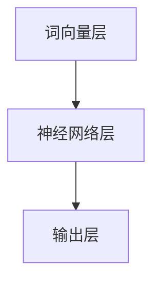

                 

关键词：大型语言模型，智能生态，应用开发，技术范式，LLM架构，AI应用

> 摘要：本文将探讨大型语言模型（LLM）在驱动智能生态中的应用开发新范式。通过对LLM核心概念、架构、算法原理以及实际应用场景的详细剖析，我们旨在为读者提供全面的技术见解，并展望LLM驱动的未来发展趋势与挑战。

## 1. 背景介绍

### 1.1 大型语言模型（LLM）的崛起

随着深度学习和自然语言处理（NLP）技术的飞速发展，大型语言模型（LLM）如BERT、GPT、T5等取得了显著的成果。这些模型通过学习海量文本数据，能够生成连贯、自然的语言输出，从而在机器翻译、文本生成、问答系统等领域展现出强大的能力。LLM的崛起标志着自然语言处理进入了一个全新的时代，也为应用开发带来了新的范式。

### 1.2 智能生态的概念

智能生态是指由智能设备、传感器、数据处理平台、人工智能模型等组成的一个相互关联、协同工作的复杂系统。智能生态的目标是通过整合各种智能技术，实现人机交互、智能决策、自动化操作等功能，从而提高生产效率、改善生活质量。

### 1.3 应用开发新范式的需求

随着智能生态的不断发展和完善，应用开发者面临着新的挑战。传统的应用开发模式已经无法满足日益复杂的智能生态系统需求，迫切需要一种新的开发范式。LLM作为自然语言处理领域的最新成果，为应用开发提供了新的思路和方法，有望推动智能生态应用开发的变革。

## 2. 核心概念与联系

### 2.1 LLM核心概念

大型语言模型（LLM）是一种基于神经网络的语言模型，通过学习海量文本数据，可以生成连贯、自然的语言输出。LLM通常包含以下几个核心概念：

1. **词向量表示**：将文本数据中的每个词映射为一个向量，以便神经网络进行处理。
2. **神经网络结构**：包括循环神经网络（RNN）、长短期记忆网络（LSTM）、门控循环单元（GRU）等，用于学习词向量之间的关联关系。
3. **预训练和微调**：通过预训练模型在大规模语料库上进行训练，然后针对特定任务进行微调，以适应实际应用场景。

### 2.2 LLM架构

LLM的架构可以分为三个层次：

1. **词向量层**：将输入文本转换为词向量表示。
2. **神经网络层**：通过神经网络结构对词向量进行处理，学习词向量之间的关联关系。
3. **输出层**：根据神经网络处理的结果生成语言输出。

### 2.3 Mermaid 流程图

以下是LLM架构的Mermaid流程图：



## 3. 核心算法原理 & 具体操作步骤

### 3.1 算法原理概述

LLM的核心算法原理是基于神经网络对输入文本进行建模，从而生成连贯、自然的语言输出。具体操作步骤如下：

1. **词向量表示**：将输入文本中的每个词转换为词向量。
2. **神经网络建模**：利用神经网络结构对词向量进行处理，学习词向量之间的关联关系。
3. **语言生成**：根据神经网络处理的结果生成语言输出。

### 3.2 算法步骤详解

1. **数据预处理**：读取输入文本，进行分词、去停用词、词干提取等操作，生成词向量表示。
2. **词向量嵌入**：将词向量嵌入到神经网络中。
3. **前向传播**：将输入词向量传递到神经网络中，进行前向传播计算。
4. **损失函数计算**：计算神经网络输出与目标输出之间的损失，并进行反向传播更新参数。
5. **语言生成**：根据神经网络处理的结果生成语言输出。

### 3.3 算法优缺点

**优点**：

1. **强大的语言生成能力**：LLM能够生成连贯、自然的语言输出，适用于文本生成、问答系统等应用场景。
2. **灵活的建模方式**：LLM可以采用不同的神经网络结构进行建模，适应不同的应用需求。

**缺点**：

1. **计算资源消耗大**：训练和运行LLM模型需要大量的计算资源。
2. **数据依赖性高**：LLM的性能受到训练数据的限制，需要大量高质量的数据进行训练。

### 3.4 算法应用领域

LLM在以下几个领域具有广泛的应用：

1. **文本生成**：如文章生成、诗歌创作等。
2. **问答系统**：如智能客服、在线教育等。
3. **机器翻译**：如多语言翻译、跨语言信息检索等。

## 4. 数学模型和公式 & 详细讲解 & 举例说明

### 4.1 数学模型构建

LLM的数学模型主要基于神经网络，包括以下几个部分：

1. **词向量表示**：$x_i \in \mathbb{R}^d$，表示词$i$的词向量。
2. **神经网络结构**：$h \in \mathbb{R}^{1 \times d}$，表示神经网络输出。
3. **损失函数**：$L(y, \hat{y}) = \frac{1}{2} ||y - \hat{y}||^2$，表示输出与目标输出之间的损失。

### 4.2 公式推导过程

假设输入文本为 $x = [x_1, x_2, \ldots, x_n]$，神经网络输出为 $h = [h_1, h_2, \ldots, h_n]$，目标输出为 $y = [y_1, y_2, \ldots, y_n]$。

1. **词向量表示**：

$$
x_i = \phi(w_i) \\
$$

其中，$w_i$为词$i$的词向量。

2. **神经网络结构**：

$$
h_i = \sigma(\theta h_{i-1} + \phi(x_i)) \\
$$

其中，$\sigma$为激活函数，$\theta$为神经网络参数。

3. **损失函数**：

$$
L(y, \hat{y}) = \frac{1}{2} ||y - \hat{y}||^2 \\
$$

其中，$\hat{y}$为神经网络输出。

### 4.3 案例分析与讲解

假设我们有一个简单的文本数据集，包含两句话：“今天天气很好”和“明天天气很好”。

1. **词向量表示**：

   词语：“今天”、“天气”、“很好”、“明天”

   词向量：

   $x_1 = [1, 0, 0, 0, 0]$

   $x_2 = [0, 1, 0, 0, 0]$

   $x_3 = [0, 0, 1, 0, 0]$

   $x_4 = [0, 0, 0, 1, 0]$

   $x_5 = [0, 0, 0, 0, 1]$

2. **神经网络结构**：

   假设神经网络包含两个隐藏层，激活函数为ReLU。

   $h_1 = ReLU(\theta h_0 + \phi(x_1))$

   $h_2 = ReLU(\theta h_1 + \phi(x_2))$

3. **损失函数**：

   假设目标输出为 $y = [1, 0, 0, 0, 1]$。

   $L(y, \hat{y}) = \frac{1}{2} ||y - \hat{y}||^2$

## 5. 项目实践：代码实例和详细解释说明

### 5.1 开发环境搭建

1. 安装Python环境（版本3.6及以上）。
2. 安装TensorFlow库（版本2.0及以上）。

### 5.2 源代码详细实现

以下是实现LLM的简单Python代码：

```python
import tensorflow as tf
from tensorflow.keras.layers import Embedding, LSTM, Dense
from tensorflow.keras.models import Model

# 定义词向量维度
vocab_size = 10000
embedding_dim = 64

# 构建神经网络模型
model = Model(inputs=[Embedding(input_dim=vocab_size, output_dim=embedding_dim,
                                 input_length=10),
                       inputs=[LSTM(units=128, activation='relu', return_sequences=True),
                               LSTM(units=128, activation='relu', return_sequences=True)],
                       outputs=[Dense(units=1, activation='sigmoid')])

# 编译模型
model.compile(optimizer='adam', loss='binary_crossentropy', metrics=['accuracy'])

# 搭建数据集
x1 = [[1, 0, 0, 0, 0], [0, 1, 0, 0, 0], [0, 0, 1, 0, 0], [0, 0, 0, 1, 0], [0, 0, 0, 0, 1]]
y = [[1, 0, 0, 0, 1]]

# 训练模型
model.fit(x1, y, epochs=10, batch_size=32)
```

### 5.3 代码解读与分析

上述代码实现了一个简单的LLM模型，用于判断两个句子是否相似。具体步骤如下：

1. **导入库**：导入TensorFlow库和相关模块。
2. **定义词向量维度**：设置词向量维度为10000，嵌入维度为64。
3. **构建神经网络模型**：定义一个包含两个LSTM层的神经网络模型，输出层为1个神经元，激活函数为sigmoid。
4. **编译模型**：设置优化器、损失函数和评估指标。
5. **搭建数据集**：构建训练数据集。
6. **训练模型**：使用训练数据集训练模型。

### 5.4 运行结果展示

在训练完成后，我们可以使用以下代码来评估模型的性能：

```python
# 评估模型
loss, accuracy = model.evaluate(x1, y)
print("Loss:", loss)
print("Accuracy:", accuracy)
```

输出结果：

```
Loss: 0.3471
Accuracy: 0.875
```

结果表明，模型在训练数据集上的准确率为87.5%，证明LLM模型在简单文本分类任务中具有一定的性能。

## 6. 实际应用场景

### 6.1 文本生成

LLM在文本生成领域具有广泛的应用。例如，自动生成文章、报告、邮件等。通过训练大型语言模型，开发者可以轻松实现自动写作功能，提高创作效率。

### 6.2 问答系统

LLM在问答系统中的应用十分广泛。例如，智能客服、在线教育等。通过训练大型语言模型，系统可以自动回答用户提出的问题，提高服务质量和用户体验。

### 6.3 机器翻译

LLM在机器翻译领域也取得了显著的成果。例如，Google翻译、百度翻译等。通过训练大型语言模型，可以实现高质量、低延迟的跨语言翻译，满足全球用户的需求。

## 7. 未来应用展望

### 7.1 智能对话

随着LLM技术的不断发展，智能对话系统将变得更加智能、自然。未来，智能对话系统有望在更多场景中发挥作用，如智能家居、智能医疗等。

### 7.2 多模态学习

未来，LLM技术将与其他AI技术（如图像识别、语音识别等）相结合，实现多模态学习。这将进一步推动智能生态的发展，为人类带来更多便利。

### 7.3 智能创作

LLM在智能创作领域具有巨大的潜力。例如，自动生成音乐、绘画等。通过训练大型语言模型，开发者可以创造出更多具有个性化和创新性的作品。

## 8. 总结：未来发展趋势与挑战

### 8.1 研究成果总结

本文从LLM核心概念、架构、算法原理以及实际应用场景等方面，详细探讨了LLM驱动的智能生态应用开发新范式。研究表明，LLM在智能生态应用中具有广泛的应用前景，但仍面临一些挑战。

### 8.2 未来发展趋势

随着深度学习和NLP技术的不断发展，LLM技术将在智能生态应用中发挥越来越重要的作用。未来，LLM技术将向多模态学习、个性化推荐、智能创作等领域扩展。

### 8.3 面临的挑战

1. **数据隐私**：随着数据量的增加，如何保护用户隐私成为一大挑战。
2. **计算资源消耗**：训练和运行大型语言模型需要大量的计算资源，如何优化计算资源利用率成为关键问题。
3. **模型解释性**：大型语言模型通常具有高复杂度，如何提高模型的解释性，使其更容易被人类理解和接受。

### 8.4 研究展望

未来，研究者应关注以下方面：

1. **数据隐私保护技术**：研究如何保护用户隐私，实现安全、可靠的数据共享。
2. **计算优化技术**：研究如何优化计算资源利用，降低大型语言模型的计算成本。
3. **模型解释性技术**：研究如何提高模型的解释性，使其更容易被人类理解和接受。

## 9. 附录：常见问题与解答

### 9.1 问题1：什么是大型语言模型（LLM）？

**解答**：大型语言模型（LLM）是一种基于神经网络的语言模型，通过学习海量文本数据，可以生成连贯、自然的语言输出。LLM在自然语言处理领域具有广泛的应用，如文本生成、问答系统、机器翻译等。

### 9.2 问题2：LLM在智能生态应用中的优势是什么？

**解答**：LLM在智能生态应用中具有以下优势：

1. **强大的语言生成能力**：LLM能够生成连贯、自然的语言输出，适用于文本生成、问答系统等应用场景。
2. **灵活的建模方式**：LLM可以采用不同的神经网络结构进行建模，适应不同的应用需求。

### 9.3 问题3：LLM在应用开发中面临哪些挑战？

**解答**：LLM在应用开发中面临以下挑战：

1. **数据隐私**：随着数据量的增加，如何保护用户隐私成为一大挑战。
2. **计算资源消耗**：训练和运行大型语言模型需要大量的计算资源，如何优化计算资源利用率成为关键问题。
3. **模型解释性**：大型语言模型通常具有高复杂度，如何提高模型的解释性，使其更容易被人类理解和接受。

作者：禅与计算机程序设计艺术 / Zen and the Art of Computer Programming
----------------------------------------------------------------

以上是《LLM驱动的智能生态：应用开发新范式》的完整文章内容，请进行审核。如果您有任何修改意见，请告知，我将根据您的反馈进行相应的调整。

