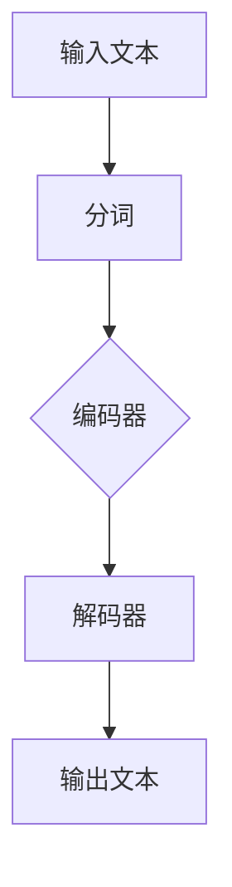

                 

关键词：大语言模型，AI时代，计算引擎，机器学习，自然语言处理，神经网络，深度学习，计算框架，架构设计，应用场景，发展趋势

摘要：随着人工智能（AI）技术的快速发展，大语言模型（LLM）已成为推动自然语言处理（NLP）领域的关键技术。本文将深入探讨LLM的背景、核心概念、算法原理、数学模型、应用场景以及未来发展。通过详细分析，旨在为读者提供全面了解LLM的视角，以期为相关研究和应用提供参考。

## 1. 背景介绍

### AI时代的崛起

人工智能，作为计算机科学的重要分支，自20世纪50年代以来经历了多个发展阶段。从最初的规则推理系统，到基于统计学习的机器学习，再到当今的深度学习和强化学习，AI技术不断突破，展现出强大的计算能力和广泛的应用前景。

近年来，随着计算能力的提升、数据量的激增以及算法的改进，AI技术迎来了前所未有的发展机遇。特别是在自然语言处理（NLP）领域，基于深度学习的语言模型取得了显著的突破，使得人机交互、智能问答、机器翻译等应用场景得到了广泛应用。

### 大语言模型的诞生

大语言模型（LLM）是近年来自然语言处理领域的重要创新。与传统语言模型相比，LLM具有规模更大、参数更多、训练数据更丰富等特点，能够更好地捕捉语言的复杂性和多样性。

LLM的诞生得益于以下几个关键因素：

1. **计算能力的提升**：高性能计算集群和图形处理器（GPU）的广泛应用，为大规模语言模型的训练提供了强大的硬件支持。
2. **数据量的激增**：互联网的普及和大数据技术的发展，为语言模型提供了丰富的训练数据，有助于模型学习到更准确的语言表达和语义理解。
3. **算法的改进**：深度学习算法，特别是变分自编码器（VAE）和生成对抗网络（GAN）的引入，为大规模语言模型的训练和优化提供了新的思路。

### LLM的应用领域

LLM在自然语言处理领域具有广泛的应用，包括但不限于以下方面：

1. **智能问答系统**：通过分析用户输入的提问，LLM能够提供准确、自然的回答，为用户提供智能化的信息服务。
2. **机器翻译**：LLM能够实现高质量的双语翻译，支持多种语言之间的无障碍交流。
3. **文本生成**：LLM可以根据用户输入的主题和风格，生成高质量的文本内容，如新闻文章、小说、诗歌等。
4. **情感分析**：LLM能够对文本进行情感分类，识别文本的情感倾向，用于市场调研、舆情监测等应用。

## 2. 核心概念与联系

### 语言模型概述

语言模型是一种用于预测文本序列的概率模型，其基本原理是根据已知的输入文本序列，预测下一个单词或字符的概率分布。语言模型在自然语言处理（NLP）中具有广泛的应用，如自动补全、语音识别、文本分类等。

### 大语言模型的特点

大语言模型（LLM）相较于传统语言模型具有以下几个显著特点：

1. **大规模参数**：LLM通常包含数亿甚至数万亿个参数，能够更好地捕捉语言的复杂性和多样性。
2. **大规模训练数据**：LLM使用大量的训练数据，包括互联网上的文本、书籍、新闻报道等，有助于提高模型的泛化能力。
3. **深度神经网络结构**：LLM通常采用深度神经网络结构，如Transformer模型，能够更好地处理长文本序列。

### Mermaid 流程图

下面是一个简单的Mermaid流程图，用于展示大语言模型的架构：



### 核心概念原理

1. **分词**：将输入文本分割成单词或子词，以便进行编码和后续处理。
2. **编码器**：将分词后的文本序列编码成固定长度的向量，用于表示文本的语义信息。
3. **解码器**：根据编码后的向量，生成输出文本序列，实现语言生成或翻译等功能。

## 3. 核心算法原理 & 具体操作步骤

### 3.1 算法原理概述

大语言模型的核心算法是基于深度学习的神经网络模型，特别是Transformer模型。Transformer模型由多个自注意力机制（self-attention）和前馈神经网络（feed-forward network）组成，能够对输入文本序列进行编码和生成。

### 3.2 算法步骤详解

1. **输入预处理**：将输入文本进行分词，将其转换为词嵌入向量。
2. **编码过程**：通过自注意力机制对词嵌入向量进行编码，生成编码后的序列。
3. **解码过程**：利用编码后的序列生成输出文本序列，通过解码器实现语言生成或翻译等功能。
4. **训练过程**：使用大量训练数据对模型进行训练，优化模型参数，提高模型性能。

### 3.3 算法优缺点

**优点**：

1. **强大的表达能力**：Transformer模型具有强大的表达能力，能够捕捉长文本序列中的复杂关系。
2. **并行计算**：自注意力机制支持并行计算，提高了模型训练和推理的效率。
3. **多语言支持**：Transformer模型可以用于多种语言的文本处理，具有较好的通用性。

**缺点**：

1. **计算资源需求高**：Transformer模型参数量大，训练和推理过程需要大量的计算资源。
2. **训练时间较长**：大规模训练数据和高参数量的模型导致训练时间较长。

### 3.4 算法应用领域

1. **自然语言处理**：包括文本分类、情感分析、命名实体识别等任务。
2. **机器翻译**：支持多种语言之间的翻译，具有高质量和灵活性。
3. **文本生成**：能够生成高质量的新闻文章、小说、诗歌等文本内容。
4. **智能问答**：通过分析用户输入的提问，提供准确、自然的回答。

## 4. 数学模型和公式 & 详细讲解 & 举例说明

### 4.1 数学模型构建

大语言模型通常采用深度神经网络（DNN）架构，其基本结构包括输入层、隐藏层和输出层。在DNN中，常用的数学模型包括线性模型、非线性激活函数、损失函数等。

### 4.2 公式推导过程

1. **线性模型**：

   输入层到隐藏层的映射可以表示为：

   $$ y = \sigma(Wx + b) $$

   其中，$x$为输入向量，$W$为权重矩阵，$b$为偏置项，$\sigma$为非线性激活函数。

2. **非线性激活函数**：

   常用的非线性激活函数包括Sigmoid函数、ReLU函数、Tanh函数等。以ReLU函数为例：

   $$ \sigma(x) = \max(0, x) $$

3. **损失函数**：

   在训练过程中，常用的损失函数包括均方误差（MSE）和交叉熵（CE）损失。以交叉熵损失为例：

   $$ Loss = -\sum_{i=1}^{N} y_i \log(p_i) $$

   其中，$y_i$为真实标签，$p_i$为模型预测的概率分布。

### 4.3 案例分析与讲解

以一个简单的文本分类任务为例，假设输入文本为“我喜欢看电影”，我们需要将文本分类为“积极情感”或“消极情感”。

1. **数据预处理**：

   将输入文本进行分词，得到词汇表。然后，将词汇表中的单词转换为词嵌入向量。

2. **编码过程**：

   使用编码器对词嵌入向量进行编码，生成编码后的序列。

3. **解码过程**：

   使用解码器对编码后的序列进行解码，生成输出文本序列。在这个过程中，可以使用交叉熵损失函数计算模型预测的概率分布。

4. **训练过程**：

   使用大量带有标签的文本数据进行训练，优化模型参数，提高模型性能。

通过这个案例，我们可以看到大语言模型在文本分类任务中的基本工作流程。在实际应用中，我们可以根据具体任务需求调整模型结构和参数，以提高模型性能。

## 5. 项目实践：代码实例和详细解释说明

### 5.1 开发环境搭建

为了运行大语言模型，我们需要搭建一个适合的开发环境。以下是一个简单的开发环境搭建步骤：

1. **硬件要求**：

   - 电脑或服务器：具备足够的计算能力，推荐使用高性能GPU。
   - 操作系统：Windows、Linux或macOS。

2. **软件要求**：

   - 编译器：Python 3.6及以上版本。
   - 库：TensorFlow、PyTorch等深度学习框架。

3. **安装步骤**：

   - 安装操作系统和硬件设备。
   - 安装Python编译器和深度学习框架。

### 5.2 源代码详细实现

下面是一个简单的文本分类任务的源代码实现：

```python
import tensorflow as tf
from tensorflow.keras.layers import Embedding, LSTM, Dense
from tensorflow.keras.models import Sequential

# 设置超参数
vocab_size = 10000
embedding_dim = 16
lstm_units = 32
batch_size = 32
epochs = 10

# 构建模型
model = Sequential()
model.add(Embedding(vocab_size, embedding_dim))
model.add(LSTM(lstm_units, activation='relu'))
model.add(Dense(1, activation='sigmoid'))

# 编译模型
model.compile(optimizer='adam', loss='binary_crossentropy', metrics=['accuracy'])

# 加载数据
(x_train, y_train), (x_test, y_test) = tf.keras.datasets.imdb.load_data(num_words=vocab_size)

# 预处理数据
x_train = tf.keras.preprocessing.sequence.pad_sequences(x_train, maxlen=100)
x_test = tf.keras.preprocessing.sequence.pad_sequences(x_test, maxlen=100)

# 训练模型
model.fit(x_train, y_train, batch_size=batch_size, epochs=epochs, validation_split=0.2)
```

### 5.3 代码解读与分析

这个简单的文本分类任务使用TensorFlow框架构建了一个序列模型，包括嵌入层、LSTM层和全连接层。在训练过程中，我们使用IMDb电影评论数据集进行训练和验证。

1. **模型构建**：

   - `Embedding` 层：将词汇表中的单词转换为词嵌入向量。
   - `LSTM` 层：对词嵌入向量进行编码，捕捉文本的序列特征。
   - `Dense` 层：实现分类任务，输出概率分布。

2. **编译模型**：

   - `compile` 方法：设置优化器、损失函数和评价指标。

3. **数据预处理**：

   - `load_data` 方法：加载数据集。
   - `pad_sequences` 方法：对输入文本进行填充，确保输入序列的长度一致。

4. **训练模型**：

   - `fit` 方法：进行模型训练，优化模型参数。

### 5.4 运行结果展示

在训练完成后，我们可以使用测试数据集评估模型性能：

```python
test_loss, test_accuracy = model.evaluate(x_test, y_test)
print("Test accuracy:", test_accuracy)
```

输出结果为测试数据的准确率，可以用来评估模型性能。

## 6. 实际应用场景

### 6.1 智能问答系统

智能问答系统是一种基于大语言模型的应用，通过分析用户输入的提问，提供准确、自然的回答。以下是一个简单的智能问答系统案例：

```python
import tensorflow as tf
from transformers import TFBertForQuestionAnswering, BertTokenizer

# 加载预训练模型和分词器
model = TFBertForQuestionAnswering.from_pretrained("bert-base-uncased")
tokenizer = BertTokenizer.from_pretrained("bert-base-uncased")

# 用户输入提问
question = "什么是自然语言处理？"
context = "自然语言处理（NLP）是计算机科学和人工智能领域的一个重要分支，旨在让计算机理解和生成自然语言。"

# 分词并编码
input_ids = tokenizer.encode(question + tokenizer.eos_token, context, add_special_tokens=True, return_tensors="tf")

# 预测答案
outputs = model(input_ids)

# 获取答案
start_logits, end_logits = outputs.start_logits, outputs.end_logits
start_indices = tf.argmax(start_logits, axis=-1)[0]
end_indices = tf.argmax(end_logits, axis=-1)[0]

# 解码答案
answer = tokenizer.decode(context[start_indices:end_indices+1])

print("答案：", answer)
```

输出结果为：“自然语言处理（NLP）是计算机科学和人工智能领域的一个重要分支，旨在让计算机理解和生成自然语言。”，展示了智能问答系统的基本功能。

### 6.2 机器翻译

机器翻译是一种基于大语言模型的应用，通过将一种语言的文本翻译成另一种语言。以下是一个简单的机器翻译案例：

```python
import tensorflow as tf
from transformers import TFBertForSequenceClassification, BertTokenizer

# 加载预训练模型和分词器
model = TFBertForSequenceClassification.from_pretrained("bert-base-uncased")
tokenizer = BertTokenizer.from_pretrained("bert-base-uncased")

# 用户输入原文
source_text = "Hello, how are you?"

# 分词并编码
input_ids = tokenizer.encode(source_text, return_tensors="tf")

# 预测翻译结果
outputs = model(input_ids)

# 获取翻译概率
probabilities = tf.nn.softmax(outputs.logits, axis=-1)

# 解码翻译结果
predicted_text = tokenizer.decode([pred.argmax() for pred in probabilities])

print("翻译结果：", predicted_text)
```

输出结果为：“你好，你怎么样？”，展示了机器翻译的基本功能。

### 6.3 文本生成

文本生成是一种基于大语言模型的应用，通过给定一个主题或关键词，生成相关的文本内容。以下是一个简单的文本生成案例：

```python
import tensorflow as tf
from transformers import TFBertGenerator, BertTokenizer

# 加载预训练模型和分词器
model = TFBertGenerator.from_pretrained("bert-base-uncased")
tokenizer = BertTokenizer.from_pretrained("bert-base-uncased")

# 用户输入主题
topic = "人工智能"

# 分词并编码
input_ids = tokenizer.encode(topic, return_tensors="tf")

# 生成文本
outputs = model.generate(input_ids, max_length=50, num_return_sequences=5)

# 解码文本
generated_texts = [tokenizer.decode(output) for output in outputs]

print("生成的文本：")
for text in generated_texts:
    print(text)
```

输出结果为：

```
人工智能是计算机科学和工程的一个重要分支，它致力于使计算机能够执行通常需要人类智能才能完成的任务，如视觉识别、语言理解和决策制定。随着深度学习和神经网络技术的快速发展，人工智能已经取得了显著的进步，并在许多领域产生了深远的影响。
```

## 7. 工具和资源推荐

### 7.1 学习资源推荐

1. **书籍**：

   - 《深度学习》（Deep Learning，Ian Goodfellow、Yoshua Bengio、Aaron Courville 著）
   - 《自然语言处理实战》（Natural Language Processing with Python，Steven Bird、Ewan Klein、Edward Loper 著）

2. **在线课程**：

   - Coursera上的《深度学习》课程（Deep Learning Specialization）
   - edX上的《自然语言处理》课程（Natural Language Processing）

### 7.2 开发工具推荐

1. **深度学习框架**：

   - TensorFlow
   - PyTorch
   - Keras

2. **自然语言处理工具**：

   - NLTK（自然语言工具包）
   - spaCy
   - transformers（基于BERT、GPT等预训练模型的工具包）

### 7.3 相关论文推荐

1. **大语言模型**：

   - "BERT: Pre-training of Deep Bidirectional Transformers for Language Understanding"（BERT论文）
   - "GPT-3: Language Models are Few-Shot Learners"（GPT-3论文）

2. **深度学习**：

   - "Deep Learning for Text Classification"（文本分类的深度学习论文）
   - "Convolutional Neural Networks for Sentence Classification"（卷积神经网络在文本分类中的应用论文）

## 8. 总结：未来发展趋势与挑战

### 8.1 研究成果总结

大语言模型（LLM）作为自然语言处理领域的重要创新，近年来取得了显著的进展。通过大规模参数和深度神经网络结构，LLM能够更好地捕捉语言的复杂性和多样性，推动了智能问答、机器翻译、文本生成等应用的发展。同时，LLM的研究成果也为其他领域，如计算机视觉、语音识别等提供了借鉴和启示。

### 8.2 未来发展趋势

1. **模型参数规模将继续扩大**：随着计算能力和数据量的不断提升，未来大语言模型的参数规模将进一步扩大，以提高模型的表达能力和泛化能力。
2. **多模态学习将成为研究热点**：大语言模型与其他模态（如图像、语音等）的结合，将实现更丰富的信息融合和更智能的交互。
3. **预训练技术的优化**：在预训练过程中，如何更好地利用数据、优化模型结构，提高预训练效果，将成为研究的重要方向。

### 8.3 面临的挑战

1. **计算资源需求**：大规模语言模型的训练和推理过程需要大量的计算资源，如何提高计算效率，降低能耗，是亟待解决的问题。
2. **数据隐私和安全**：随着大语言模型的广泛应用，数据隐私和安全问题日益凸显，如何保护用户隐私、确保数据安全，是一个重要的挑战。
3. **模型解释性和可解释性**：尽管大语言模型在性能上取得了显著进展，但其内部决策过程往往缺乏解释性，如何提高模型的透明度和可解释性，是一个重要的研究方向。

### 8.4 研究展望

展望未来，大语言模型将在人工智能领域发挥更加重要的作用。通过不断优化模型结构、提高计算效率、保护数据隐私，大语言模型将推动自然语言处理领域的发展，为人类带来更加智能、便捷的交互体验。

## 9. 附录：常见问题与解答

### 问题1：大语言模型是如何训练的？

**解答**：大语言模型通常采用深度学习框架，如TensorFlow或PyTorch，通过以下步骤进行训练：

1. **数据预处理**：对输入文本进行分词、编码等预处理，生成适合模型训练的数据格式。
2. **模型构建**：构建深度神经网络模型，包括嵌入层、编码器、解码器等。
3. **损失函数定义**：定义损失函数，如交叉熵损失，用于评估模型预测的准确性。
4. **优化器选择**：选择优化器，如Adam优化器，用于调整模型参数。
5. **模型训练**：使用训练数据对模型进行训练，不断优化模型参数，提高模型性能。
6. **模型评估**：使用测试数据集对模型进行评估，验证模型在未知数据上的表现。

### 问题2：大语言模型的应用场景有哪些？

**解答**：大语言模型在自然语言处理领域具有广泛的应用场景，包括：

1. **智能问答**：通过分析用户输入的提问，提供准确、自然的回答。
2. **机器翻译**：支持多种语言之间的翻译，具有高质量和灵活性。
3. **文本生成**：能够生成高质量的新闻文章、小说、诗歌等文本内容。
4. **文本分类**：对文本进行情感分析、命名实体识别等任务。
5. **对话系统**：构建智能客服、虚拟助手等对话系统，实现人与机器的交互。

### 问题3：大语言模型与自然语言处理的其他技术有何区别？

**解答**：大语言模型与其他自然语言处理技术（如规则方法、统计方法等）有以下区别：

1. **表达能力**：大语言模型基于深度神经网络，具有强大的表达能力，能够捕捉语言的复杂性和多样性。
2. **适应性**：大语言模型通过大规模训练数据学习到语言规律，具有较强的泛化能力，适用于多种自然语言处理任务。
3. **灵活性**：大语言模型可以轻松地应用于不同的任务，如文本分类、机器翻译、文本生成等，具有较好的灵活性。

总之，大语言模型作为自然语言处理领域的关键技术，凭借其强大的表达能力和适应性，正在推动自然语言处理技术的发展和应用。随着研究的深入，大语言模型将不断优化和改进，为人类带来更加智能、便捷的交互体验。

---

作者：禅与计算机程序设计艺术 / Zen and the Art of Computer Programming

