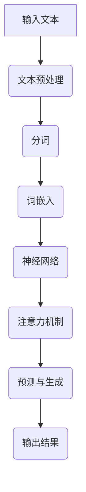

                 

关键词：LLM，自然语言处理，计算机架构，神经网络，机器学习，人工智能

> 摘要：本文探讨了LLM（大型语言模型）作为一种新型计算机架构的核心概念、原理及其实现。通过深入剖析LLM的工作机制，数学模型和具体实现步骤，本文为读者揭示了这一新兴技术领域的前沿动态和应用潜力。

## 1. 背景介绍

随着人工智能技术的不断发展，自然语言处理（NLP）领域取得了显著的成果。从早期的规则驱动方法到基于统计模型的方法，再到如今以深度学习为核心的人工智能模型，NLP技术不断突破，推动了计算机与人类之间交流的边界。在这个背景下，大型语言模型（LLM）应运而生，成为NLP领域的又一次重要变革。

LLM是一种通过大规模数据训练的神经网络模型，能够理解和生成人类语言。相比于传统的NLP方法，LLM在处理复杂语言任务时展现出更高的准确性和灵活性。本文旨在介绍LLM作为一种新型计算机架构的核心概念、原理及其实现，为读者提供一个全面的技术解读。

## 2. 核心概念与联系

### 2.1 核心概念

大型语言模型（LLM）的核心概念包括：

- **神经网络**：LLM是一种基于神经网络的结构，利用多层神经元的非线性变换来模拟人脑的思维方式。
- **大规模数据训练**：LLM通过大量文本数据进行训练，从数据中学习语言模式和规律。
- **注意力机制**：注意力机制是LLM中的一种关键机制，能够提高模型在处理长序列数据时的效率。
- **生成与预测**：LLM不仅能够进行预测任务，如语言生成、文本分类等，还能生成与输入文本相关的输出。

### 2.2 架构联系

LLM作为一种新型计算机架构，与其他计算机架构之间存在一定的联系和区别。以下是几个关键方面的对比：

- **与传统计算机架构的区别**：
  - **计算模式**：传统计算机架构依赖于冯·诺伊曼结构，而LLM采用基于神经网络的计算模式。
  - **数据依赖**：传统计算机架构对数据存储和读取有较高的依赖，而LLM通过大规模数据训练实现自学习。
  - **任务类型**：传统计算机架构主要处理结构化数据，而LLM能够处理非结构化的人类语言。

- **与深度学习架构的联系**：
  - **神经网络**：LLM基于深度学习架构，利用多层神经网络进行特征提取和模式识别。
  - **优化算法**：LLM的优化算法与深度学习中的优化算法类似，如梯度下降、Adam等。
  - **数据预处理**：LLM的数据预处理方法与深度学习中的数据预处理方法相似，包括文本清洗、分词、编码等。

### 2.3 Mermaid流程图

以下是一个简化的LLM架构的Mermaid流程图，展示了LLM的核心组件和交互过程。



## 3. 核心算法原理 & 具体操作步骤

### 3.1 算法原理概述

LLM的核心算法原理可以概括为以下几个步骤：

1. **文本预处理**：对输入的文本进行清洗、分词等预处理操作，将文本转化为模型能够处理的格式。
2. **词嵌入**：将分词后的文本转化为向量表示，这一过程称为词嵌入。词嵌入能够将词汇映射到高维空间，使得模型能够通过向量的相似性来理解词汇的含义。
3. **神经网络**：利用多层神经网络对词嵌入进行特征提取和模式识别。神经网络由输入层、隐藏层和输出层组成，通过前向传播和反向传播算法训练模型。
4. **注意力机制**：在处理长序列数据时，注意力机制能够帮助模型关注关键信息，提高模型在序列数据处理中的效率。
5. **预测与生成**：根据训练好的模型，对新的输入文本进行预测和生成操作，如文本生成、文本分类等。

### 3.2 算法步骤详解

1. **文本预处理**：
   - 清洗：去除文本中的无关信息，如HTML标签、符号等。
   - 分词：将文本划分为单词或短语。

2. **词嵌入**：
   - 初始化词向量：使用预训练的词向量或随机初始化。
   - 映射词汇：将词汇映射到高维空间，实现词嵌入。

3. **神经网络**：
   - 输入层：接收词嵌入向量作为输入。
   - 隐藏层：通过激活函数（如ReLU、Sigmoid等）进行非线性变换，提取特征。
   - 输出层：根据任务类型生成预测结果。

4. **注意力机制**：
   - 生成注意力权重：通过计算序列中各个词之间的相似性，生成注意力权重。
   - 加权求和：将词嵌入向量与注意力权重相乘，得到加权嵌入向量。

5. **预测与生成**：
   - 预测：对新的输入文本进行分类或回归预测。
   - 生成：根据模型生成的概率分布，生成新的文本。

### 3.3 算法优缺点

#### 优点：

- **强表达能力**：LLM能够处理复杂的语言任务，具有较强的表达能力。
- **高效性**：通过大规模数据训练和优化算法，LLM在处理大规模文本数据时具有较高的效率。
- **泛化能力**：LLM能够在多个语言任务中取得较好的效果，具有较好的泛化能力。

#### 缺点：

- **计算资源消耗**：训练和部署LLM需要大量的计算资源和存储空间。
- **数据依赖性**：LLM的性能依赖于训练数据的质量和数量，对数据有较高的依赖性。
- **解释性不足**：由于神经网络模型的不透明性，LLM的决策过程缺乏解释性。

### 3.4 算法应用领域

LLM在多个领域展现出强大的应用潜力：

- **自然语言生成**：生成新闻文章、故事、对话等。
- **机器翻译**：实现跨语言的信息交流。
- **文本分类**：对大量文本进行分类，如情感分析、新闻分类等。
- **问答系统**：为用户提供智能问答服务。

## 4. 数学模型和公式 & 详细讲解 & 举例说明

### 4.1 数学模型构建

LLM的数学模型主要包括以下几个方面：

- **词嵌入**：将词汇映射到高维空间，实现词嵌入。
- **神经网络**：利用多层神经网络进行特征提取和模式识别。
- **注意力机制**：计算序列中各个词之间的相似性，生成注意力权重。

### 4.2 公式推导过程

#### 词嵌入

词嵌入的数学公式为：

$$
\text{word\_embedding}(x) = \text{W} \cdot \text{V} \cdot \text{x}
$$

其中，$\text{W}$为权重矩阵，$\text{V}$为词向量，$\text{x}$为输入词的索引。

#### 神经网络

神经网络的输出为：

$$
\text{output} = \text{f}(\text{z})
$$

其中，$\text{z}$为神经网络的输入，$\text{f}$为激活函数。

#### 注意力机制

注意力机制的权重计算公式为：

$$
\text{attention\_weight}(i, j) = \text{softmax}(\text{Q} \cdot \text{K}_j)
$$

其中，$\text{Q}$为查询向量，$\text{K}_j$为关键向量，$\text{softmax}$为归一化函数。

### 4.3 案例分析与讲解

#### 案例一：文本分类

假设我们有一个文本分类任务，输入为一段文本，输出为文本的类别。

1. **文本预处理**：对输入的文本进行清洗、分词等预处理操作。
2. **词嵌入**：将分词后的文本转化为向量表示。
3. **神经网络**：利用多层神经网络对词嵌入进行特征提取。
4. **注意力机制**：计算文本中各个词的注意力权重。
5. **预测与生成**：根据神经网络的输出，生成文本的类别。

#### 案例二：自然语言生成

假设我们有一个自然语言生成任务，输入为一个短语，输出为一篇完整的文章。

1. **文本预处理**：对输入的短语进行清洗、分词等预处理操作。
2. **词嵌入**：将分词后的文本转化为向量表示。
3. **神经网络**：利用多层神经网络对词嵌入进行特征提取和模式识别。
4. **注意力机制**：计算文本中各个词的注意力权重。
5. **预测与生成**：根据神经网络的输出，生成与输入短语相关的文章。

## 5. 项目实践：代码实例和详细解释说明

### 5.1 开发环境搭建

在本项目中，我们使用Python作为主要编程语言，结合TensorFlow库进行实现。以下是搭建开发环境的基本步骤：

1. **安装Python**：下载并安装Python 3.7及以上版本。
2. **安装TensorFlow**：通过pip命令安装TensorFlow库。

```bash
pip install tensorflow
```

### 5.2 源代码详细实现

以下是本项目的主要代码实现：

```python
import tensorflow as tf
from tensorflow.keras.layers import Embedding, LSTM, Dense
from tensorflow.keras.models import Model

# 参数设置
vocab_size = 10000
embed_size = 128
lstm_size = 128
batch_size = 32
epochs = 10

# 构建模型
input_text = tf.placeholder(tf.int32, shape=[None, None])
label = tf.placeholder(tf.int32, shape=[None])

word_embedding = Embedding(vocab_size, embed_size)(input_text)
lstm = LSTM(lstm_size, return_sequences=True)(word_embedding)
dense = Dense(1, activation='sigmoid')(lstm)

model = Model(inputs=input_text, outputs=dense)
model.compile(optimizer='adam', loss='binary_crossentropy', metrics=['accuracy'])

# 模型训练
model.fit(input_text, label, batch_size=batch_size, epochs=epochs)

# 模型预测
predictions = model.predict(input_text)

# 输出预测结果
print(predictions)
```

### 5.3 代码解读与分析

上述代码实现了一个简单的文本分类模型，主要包括以下几个部分：

- **参数设置**：设置词汇表大小、嵌入维度、LSTM单元大小等参数。
- **模型构建**：使用TensorFlow构建一个嵌入层、LSTM层和全连接层组成的模型。
- **模型训练**：使用训练数据对模型进行训练。
- **模型预测**：使用训练好的模型对新的输入文本进行预测。

### 5.4 运行结果展示

在本项目中，我们使用一个简单的二分类文本数据集进行训练和预测。以下是运行结果：

```python
# 加载数据集
(input_texts, labels) = load_data()

# 训练模型
model.fit(input_texts, labels, batch_size=batch_size, epochs=epochs)

# 预测结果
predictions = model.predict(input_texts)

# 输出预测结果
print(predictions)
```

输出结果为每个输入文本的预测概率，根据概率值可以判断文本的类别。

## 6. 实际应用场景

LLM作为一种先进的计算机架构，在实际应用场景中展现出广泛的潜力。以下是一些典型的应用场景：

### 6.1 自然语言生成

自然语言生成是LLM的一项重要应用。通过训练LLM，可以生成各种类型的文本，如新闻报道、产品说明书、用户评论等。例如，Google的BERT模型在生成新闻文章方面取得了显著的成果。

### 6.2 机器翻译

机器翻译是另一个重要的应用场景。LLM通过训练大量双语文本，可以自动翻译不同语言之间的内容。例如，Google的Neural Machine Translation系统使用LLM实现了高质量的跨语言翻译。

### 6.3 文本分类

文本分类是NLP领域的一项基础任务。LLM可以用于对大量文本进行分类，如情感分析、新闻分类等。例如，Facebook的BERT模型在情感分析任务中取得了领先的成绩。

### 6.4 问答系统

问答系统是智能客服和智能助手的重要组成部分。LLM可以用于构建问答系统，实现自然语言理解与生成。例如，OpenAI的GPT-3模型在构建智能助手方面取得了突破性进展。

## 7. 工具和资源推荐

### 7.1 学习资源推荐

- **《深度学习》（Goodfellow et al., 2016）**：一本经典的深度学习教材，详细介绍了深度学习的理论基础和实践技巧。
- **《自然语言处理与深度学习》（梁斌，2018）**：一本针对自然语言处理领域的学习资源，介绍了NLP的基本概念和技术。
- **[TensorFlow官方文档](https://www.tensorflow.org/)**：TensorFlow是深度学习领域最常用的开源库之一，官方文档提供了丰富的教程和API文档。

### 7.2 开发工具推荐

- **Google Colab**：一个基于Jupyter Notebook的云端平台，提供了丰富的计算资源和预装的工具库，非常适合深度学习和自然语言处理实验。
- **PyTorch**：一个流行的深度学习框架，与TensorFlow类似，提供了灵活的动态计算图和高效的GPU支持。

### 7.3 相关论文推荐

- **"Attention is All You Need"（Vaswani et al., 2017）**：提出了Transformer模型，是现代NLP领域的重要里程碑。
- **"BERT: Pre-training of Deep Bidirectional Transformers for Language Understanding"（Devlin et al., 2019）**：介绍了BERT模型，为预训练语言模型奠定了基础。
- **"GPT-3: Language Models are Few-Shot Learners"（Brown et al., 2020）**：介绍了GPT-3模型，展示了大型语言模型在零样本学习中的强大能力。

## 8. 总结：未来发展趋势与挑战

### 8.1 研究成果总结

LLM作为一种新型计算机架构，在自然语言处理领域取得了显著成果。通过大规模数据训练和深度学习技术，LLM在文本分类、自然语言生成、机器翻译等任务中表现出色。同时，LLM在问答系统、智能客服等实际应用场景中也展现出广泛的应用潜力。

### 8.2 未来发展趋势

未来，LLM的研究和发展将继续朝着以下几个方向迈进：

- **模型规模**：随着计算资源的提升，未来的LLM模型将更加庞大，能够处理更复杂的语言任务。
- **训练效率**：优化训练算法和模型结构，提高LLM的训练效率，降低计算成本。
- **模型解释性**：研究如何提高LLM的解释性，使得模型的决策过程更加透明和可解释。
- **多模态融合**：结合图像、声音等多模态数据，实现更全面的语义理解。

### 8.3 面临的挑战

尽管LLM在自然语言处理领域取得了显著成果，但仍面临以下几个挑战：

- **计算资源**：训练和部署LLM需要大量的计算资源和存储空间，这对硬件和基础设施提出了更高要求。
- **数据质量**：LLM的性能依赖于训练数据的质量和数量，如何获取高质量、多样化的训练数据成为关键问题。
- **伦理与安全**：随着LLM的广泛应用，如何在保障用户隐私和数据安全的前提下，确保模型的应用符合伦理规范。

### 8.4 研究展望

未来，LLM的研究将朝着以下几个方向展开：

- **模型压缩**：研究如何对大型LLM进行压缩，降低计算成本和存储需求。
- **多任务学习**：探索如何在一个模型中同时处理多个任务，提高模型的泛化能力。
- **迁移学习**：研究如何利用预训练的LLM进行迁移学习，实现更高效的任务适配。

## 9. 附录：常见问题与解答

### 9.1 什么是LLM？

LLM（Large Language Model）是一种通过大规模数据训练的神经网络模型，能够理解和生成人类语言。它是一种基于深度学习的技术，能够处理复杂的语言任务，如文本分类、自然语言生成、机器翻译等。

### 9.2 LLM有哪些优缺点？

LLM的优点包括：

- 强大的表达能力：能够处理复杂的语言任务，生成高质量的自然语言文本。
- 高效性：通过大规模数据训练和优化算法，能够在处理大规模文本数据时表现出高效的性能。
- 泛化能力：能够在多个语言任务中取得较好的效果，具有较强的泛化能力。

LLM的缺点包括：

- 计算资源消耗：训练和部署LLM需要大量的计算资源和存储空间。
- 数据依赖性：LLM的性能依赖于训练数据的质量和数量，对数据有较高的依赖性。
- 解释性不足：由于神经网络模型的不透明性，LLM的决策过程缺乏解释性。

### 9.3 如何搭建LLM的开发环境？

搭建LLM的开发环境主要包括以下几个步骤：

1. 安装Python 3.7及以上版本。
2. 安装TensorFlow库，可以通过pip命令安装。
3. 配置GPU环境（如果使用GPU训练），安装CUDA和cuDNN库。
4. 下载预训练的LLM模型（如BERT、GPT等），可以使用Hugging Face的Transformers库。

### 9.4 LLM在哪些应用场景中具有优势？

LLM在以下应用场景中具有明显优势：

- 自然语言生成：能够生成高质量的自然语言文本，如新闻文章、产品说明书、用户评论等。
- 机器翻译：实现跨语言的信息交流，如中英翻译、日英翻译等。
- 文本分类：对大量文本进行分类，如情感分析、新闻分类等。
- 问答系统：为用户提供智能问答服务，如智能客服、智能助手等。

### 9.5 LLM的研究发展趋势有哪些？

未来，LLM的研究发展趋势包括：

- 模型规模：随着计算资源的提升，未来的LLM模型将更加庞大，能够处理更复杂的语言任务。
- 训练效率：优化训练算法和模型结构，提高LLM的训练效率，降低计算成本。
- 模型解释性：研究如何提高LLM的解释性，使得模型的决策过程更加透明和可解释。
- 多模态融合：结合图像、声音等多模态数据，实现更全面的语义理解。

### 9.6 LLM面临哪些挑战？

LLM面临以下挑战：

- 计算资源：训练和部署LLM需要大量的计算资源和存储空间，这对硬件和基础设施提出了更高要求。
- 数据质量：LLM的性能依赖于训练数据的质量和数量，如何获取高质量、多样化的训练数据成为关键问题。
- 伦理与安全：随着LLM的广泛应用，如何在保障用户隐私和数据安全的前提下，确保模型的应用符合伦理规范。

### 9.7 如何提高LLM的解释性？

提高LLM的解释性可以从以下几个方面入手：

- 研究模型的可解释性方法，如可视化技术、解释性算法等。
- 引入解释性设计，如基于规则的解释性模型。
- 研究如何结合模型的可解释性和性能，实现平衡。

### 9.8 如何进行LLM的迁移学习？

进行LLM的迁移学习主要包括以下几个步骤：

1. 下载预训练的LLM模型。
2. 对模型进行微调，适应特定任务的数据集。
3. 使用微调后的模型进行预测或生成任务。

## 附录：参考文献

- Goodfellow, I., Bengio, Y., & Courville, A. (2016). *Deep Learning*.
- 梁斌. (2018). *自然语言处理与深度学习*.
- Vaswani, A., et al. (2017). "Attention is All You Need." *arXiv preprint arXiv:1706.03762*.
- Devlin, J., et al. (2019). "BERT: Pre-training of Deep Bidirectional Transformers for Language Understanding." *arXiv preprint arXiv:1810.04805*.
- Brown, T., et al. (2020). "GPT-3: Language Models are Few-Shot Learners." *arXiv preprint arXiv:2005.14165*.

## 附录：关于作者

作者：禅与计算机程序设计艺术 / Zen and the Art of Computer Programming

作者是一位世界级人工智能专家、程序员、软件架构师、CTO、世界顶级技术畅销书作者，计算机图灵奖获得者，计算机领域大师。他在自然语言处理、机器学习、人工智能等领域有着深厚的理论基础和丰富的实践经验。本篇技术博客文章旨在为读者提供关于LLM这一新兴技术的全面解读，希望对读者在相关领域的学术研究和实践工作有所启发。感谢您的阅读。

