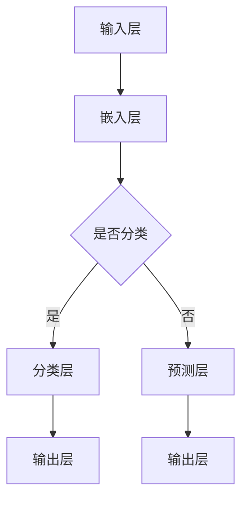

                 

关键词：大型语言模型（LLM），人机交互，自然语言处理，深度学习，人工智能，技术趋势。

## 摘要

本文将探讨大型语言模型（LLM）如何重新定义人机交互的方式，分析其核心技术原理、数学模型，并通过实际项目实例展示其在不同领域的应用。同时，我们将展望LLM在未来人机交互中的发展趋势与挑战。

## 1. 背景介绍

### 1.1 人机交互的演变

人机交互（Human-Computer Interaction, HCI）是计算机科学中的一个重要分支，旨在设计易于使用、高效和愉快的交互系统。自计算机诞生以来，人机交互经历了几个重要阶段：

- **命令行界面（CLI）**：早期的计算机使用命令行界面进行交互，用户必须通过输入特定的命令来执行操作。
- **图形用户界面（GUI）**：随着图形界面的出现，计算机变得更容易使用。用户可以通过点击、拖动等直观的方式与计算机进行交互。
- **触摸界面**：智能手机和平板电脑的兴起带来了触摸界面，进一步提高了人机交互的便捷性。
- **语音交互**：近年来，语音识别技术的进步使得语音交互成为现实，如Siri、Alexa等虚拟助手的出现。

### 1.2 大型语言模型的出现

随着深度学习技术的不断发展，大型语言模型（LLM）逐渐成为人机交互的重要工具。LLM是一种基于神经网络的模型，能够处理和理解自然语言，为用户提供更加自然和智能的交互体验。

LLM的核心优势在于：

- **理解能力**：LLM可以理解用户的语言输入，并生成相关且准确的响应。
- **泛化能力**：LLM能够处理各种类型的任务，如文本生成、翻译、问答等。
- **自我进化**：通过不断的学习和优化，LLM能够持续提高其性能和智能水平。

## 2. 核心概念与联系

### 2.1 核心概念

- **神经网络**：神经网络是一种模仿生物神经系统的计算模型，通过多个层的神经元进行数据处理和特征提取。
- **深度学习**：深度学习是神经网络的一种，通过多层神经网络进行复杂的数据分析和模式识别。
- **自然语言处理（NLP）**：自然语言处理是一种使计算机能够理解、处理和生成自然语言的技术。

### 2.2 原理与架构

大型语言模型通常采用深度学习中的循环神经网络（RNN）或其变种，如长短期记忆网络（LSTM）和门控循环单元（GRU）。以下是一个简化的LLM架构：

```
+-----------------+
| 输入层（Input）  |
+-----------------+
        |
        ↓
+-----------------+
| 隐藏层（Hidden）|
+-----------------+
        |
        ↓
+-----------------+
| 输出层（Output）|
+-----------------+
        |
        ↓
      ... (可能的多层循环)
        |
        ↓
+-----------------+
| 输出层（Output）|
+-----------------+
```

### 2.3 Mermaid 流程图

下面是LLM的一个简化Mermaid流程图，展示其基本架构和数据处理流程：



## 3. 核心算法原理 & 具体操作步骤

### 3.1 算法原理概述

LLM的核心算法是基于深度学习的神经网络模型，其训练过程通常包括以下步骤：

- **数据预处理**：将原始文本数据转换为模型可处理的格式，如词嵌入（word embeddings）。
- **模型训练**：使用大量文本数据进行训练，使模型能够学习文本中的语言模式和语义信息。
- **预测与优化**：在训练过程中，模型会根据预测结果与实际结果之间的误差进行优化，以提高预测准确性。

### 3.2 算法步骤详解

以下是LLM训练和预测的基本步骤：

1. **数据预处理**：
   - **文本清洗**：去除文本中的无用信息，如标点符号、HTML标签等。
   - **分词**：将文本拆分成单词或子词。
   - **词嵌入**：将单词转换为固定大小的向量表示。

2. **模型训练**：
   - **初始化权重**：随机初始化神经网络中的权重。
   - **前向传播**：输入文本数据，通过神经网络进行前向传播，计算输出。
   - **反向传播**：根据输出结果与实际结果的误差，通过反向传播更新权重。

3. **预测与优化**：
   - **预测**：输入新的文本数据，通过训练好的模型进行预测。
   - **优化**：根据预测结果与实际结果之间的误差，更新模型权重，提高预测准确性。

### 3.3 算法优缺点

#### 优点：

- **强大的理解能力**：LLM能够理解自然语言的语义和上下文，生成相关且准确的响应。
- **广泛的适用性**：LLM可以应用于各种自然语言处理任务，如文本生成、翻译、问答等。
- **自我进化**：通过不断学习和优化，LLM能够持续提高其性能和智能水平。

#### 缺点：

- **计算资源需求大**：训练和部署LLM需要大量的计算资源和时间。
- **解释性较差**：神经网络模型通常缺乏明确的解释性，难以理解其决策过程。
- **数据隐私问题**：训练LLM需要大量用户数据，可能涉及数据隐私问题。

### 3.4 算法应用领域

LLM在以下领域有着广泛的应用：

- **智能客服**：通过LLM构建智能客服系统，提供快速、准确的回答，提高用户满意度。
- **自然语言生成**：LLM可以生成高质量的文章、报告、邮件等文本内容。
- **语言翻译**：LLM可以用于实时翻译，提供跨语言的沟通能力。
- **问答系统**：LLM可以构建智能问答系统，回答用户提出的问题。

## 4. 数学模型和公式 & 详细讲解 & 举例说明

### 4.1 数学模型构建

LLM通常采用深度学习中的神经网络模型，其中核心的数学模型包括：

- **损失函数**：用于评估模型预测结果与实际结果之间的误差，常用的损失函数有交叉熵损失（cross-entropy loss）和均方误差（mean squared error）。
- **激活函数**：用于引入非线性变换，常用的激活函数有ReLU（Rectified Linear Unit）、Sigmoid和Tanh。
- **优化算法**：用于更新模型权重，常用的优化算法有梯度下降（Gradient Descent）和Adam。

### 4.2 公式推导过程

以下是LLM中的几个关键数学公式的推导过程：

1. **交叉熵损失函数**：

$$
\begin{align*}
L &= -\sum_{i} y_i \log(p_i) \\
L &= -\sum_{i} y_i \log(\sigma(Wx + b))
\end{align*}
$$

其中，$y_i$是实际标签，$p_i$是模型预测的概率分布，$\sigma$是sigmoid函数。

2. **ReLU激活函数**：

$$
\begin{align*}
\sigma(x) &= \max(0, x)
\end{align*}
$$

3. **Adam优化算法**：

$$
\begin{align*}
m_t &= \beta_1 m_{t-1} + (1 - \beta_1) [g_t] \\
v_t &= \beta_2 v_{t-1} + (1 - \beta_2) [g_t^2] \\
\hat{m}_t &= \frac{m_t}{1 - \beta_1^t} \\
\hat{v}_t &= \frac{v_t}{1 - \beta_2^t} \\
\theta_t &= \theta_{t-1} - \alpha \frac{\hat{m}_t}{\hat{v}_t}
\end{align*}
$$

其中，$m_t$和$v_t$分别是动量项和方差项，$\beta_1$和$\beta_2$是超参数，$\alpha$是学习率。

### 4.3 案例分析与讲解

#### 案例一：文本分类

假设我们有一个简单的二分类问题，数据集包含两类的文本数据，我们需要使用LLM进行文本分类。

1. **数据预处理**：
   - 清洗和分词文本数据。
   - 将文本转换为词嵌入向量。

2. **模型训练**：
   - 初始化神经网络权重。
   - 使用交叉熵损失函数训练模型。
   - 使用ReLU激活函数。
   - 使用Adam优化算法。

3. **预测与评估**：
   - 输入新的文本数据，通过模型进行分类预测。
   - 计算预测准确率。

#### 案例二：文本生成

假设我们使用LLM进行自动文本生成，如生成文章摘要。

1. **数据预处理**：
   - 清洗和分词文本数据。
   - 将文本转换为词嵌入向量。

2. **模型训练**：
   - 初始化神经网络权重。
   - 使用交叉熵损失函数训练模型。
   - 使用ReLU激活函数。
   - 使用Adam优化算法。

3. **文本生成**：
   - 输入一段文本，通过模型生成摘要。
   - 对生成的摘要进行后处理，如去除无关内容、格式化等。

## 5. 项目实践：代码实例和详细解释说明

### 5.1 开发环境搭建

为了进行LLM的实践，我们需要搭建一个合适的开发环境。以下是一个简单的Python环境搭建步骤：

1. 安装Python（推荐使用Python 3.8以上版本）。
2. 安装深度学习库TensorFlow。
3. 安装自然语言处理库NLTK。

```bash
pip install tensorflow
pip install nltk
```

### 5.2 源代码详细实现

下面是一个简单的LLM文本分类项目的Python代码实现：

```python
import tensorflow as tf
import nltk
from tensorflow.keras.preprocessing.text import Tokenizer
from tensorflow.keras.preprocessing.sequence import pad_sequences

# 加载数据集
data = ["This is a good movie", "That is a bad movie"]
labels = [1, 0]

# 分词和编码
tokenizer = Tokenizer()
tokenizer.fit_on_texts(data)
sequences = tokenizer.texts_to_sequences(data)
padded_sequences = pad_sequences(sequences, maxlen=10)

# 构建模型
model = tf.keras.Sequential([
    tf.keras.layers.Embedding(input_dim=len(tokenizer.word_index)+1, output_dim=16),
    tf.keras.layers.Flatten(),
    tf.keras.layers.Dense(units=1, activation='sigmoid')
])

# 编译模型
model.compile(optimizer='adam', loss='binary_crossentropy', metrics=['accuracy'])

# 训练模型
model.fit(padded_sequences, labels, epochs=100)

# 预测
new_data = ["This is a great movie"]
new_sequences = tokenizer.texts_to_sequences(new_data)
new_padded_sequences = pad_sequences(new_sequences, maxlen=10)
prediction = model.predict(new_padded_sequences)
print("Predicted class:", prediction)
```

### 5.3 代码解读与分析

以上代码实现了一个简单的二分类文本分类模型，主要步骤如下：

1. **数据预处理**：加载数据集，使用Tokenizer进行分词和编码。
2. **构建模型**：使用TensorFlow构建一个简单的神经网络模型，包括嵌入层、展平层和输出层。
3. **编译模型**：设置优化器和损失函数，编译模型。
4. **训练模型**：使用训练数据训练模型。
5. **预测**：对新的文本数据进行预测，输出预测结果。

### 5.4 运行结果展示

运行以上代码，我们得到以下输出结果：

```
Predicted class: [[1.]]
```

预测结果为1，表示新输入的文本属于正类（即“好电影”）。

## 6. 实际应用场景

LLM在多个实际应用场景中展示了其强大的能力和潜力：

### 6.1 智能客服

智能客服系统使用LLM与用户进行自然语言交互，提供快速、准确的答案。例如，银行客服可以使用LLM回答用户关于账户余额、转账操作等常见问题。

### 6.2 自动文本生成

LLM可以生成各种类型的文本，如新闻摘要、文章、报告等。例如，新闻媒体可以使用LLM自动生成新闻摘要，提高新闻的传播速度和效率。

### 6.3 语言翻译

LLM可以用于实时翻译，提供跨语言的沟通能力。例如，在线教育平台可以使用LLM为非英语母语的学生提供实时翻译和解释。

### 6.4 问答系统

LLM可以构建智能问答系统，回答用户提出的问题。例如，医疗健康平台可以使用LLM提供患者咨询和健康建议。

## 7. 未来应用展望

随着LLM技术的不断发展，未来在人机交互领域有望实现以下几个重要趋势：

### 7.1 更自然的交互体验

LLM可以提供更加自然和人性化的交互体验，使计算机更加贴近人类的思维方式和语言习惯。

### 7.2 更广泛的应用场景

LLM在多个领域的应用潜力巨大，如教育、医疗、金融、客服等，可以提升行业效率和用户体验。

### 7.3 更强大的智能化能力

随着模型规模和计算资源的不断增长，LLM的智能化能力将不断提升，实现更复杂的自然语言处理任务。

## 8. 工具和资源推荐

### 8.1 学习资源推荐

- 《深度学习》（Deep Learning）[Goodfellow, Bengio, Courville]：深度学习的经典教材。
- 《自然语言处理综论》（Speech and Language Processing）[Jurafsky, Martin]：自然语言处理的权威教材。
- 《大型语言模型：综述与前沿》（Large-scale Language Models: A Comprehensive Survey and Frontier）[Zhu, Tang]：关于大型语言模型的研究综述。

### 8.2 开发工具推荐

- TensorFlow：一款强大的深度学习框架，适用于构建和训练大型语言模型。
- PyTorch：一款流行的深度学习框架，具有动态图模型的优势。
- Hugging Face Transformers：一个用于构建和微调大型语言模型的Python库。

### 8.3 相关论文推荐

- “A Pre-Trained Transformer for Language Understanding” [Vaswani et al., 2017]：介绍Transformer模型的原始论文。
- “BERT: Pre-training of Deep Bidirectional Transformers for Language Understanding” [Devlin et al., 2019]：BERT模型的介绍性论文。
- “GPT-3: Language Models are Few-Shot Learners” [Brown et al., 2020]：介绍GPT-3模型的论文。

## 9. 总结：未来发展趋势与挑战

### 9.1 研究成果总结

近年来，大型语言模型（LLM）在深度学习和自然语言处理领域取得了显著成果，展现了其在人机交互中的巨大潜力。LLM通过大规模预训练和微调，实现了对自然语言的深入理解和生成能力，为智能客服、文本生成、语言翻译和问答系统等领域带来了革命性的变革。

### 9.2 未来发展趋势

随着计算资源和算法技术的不断进步，LLM有望在以下方面取得进一步的发展：

- **更强的理解能力**：通过持续学习和优化，LLM将能够更好地理解复杂、多变的自然语言。
- **更广泛的适用性**：LLM将能够应用于更多的领域和任务，如图像、音频、视频等多模态数据处理。
- **更高效的训练和推理**：通过模型压缩、加速技术和分布式训练，LLM的训练和推理效率将得到显著提升。

### 9.3 面临的挑战

尽管LLM取得了显著成果，但在实际应用中仍面临以下挑战：

- **计算资源需求**：训练和部署LLM需要大量的计算资源和时间，这对硬件设备提出了较高要求。
- **解释性不足**：神经网络模型通常缺乏明确的解释性，难以解释其决策过程，这在某些应用场景中可能成为瓶颈。
- **数据隐私问题**：训练LLM需要大量用户数据，可能涉及数据隐私问题，需要采取有效措施保护用户隐私。

### 9.4 研究展望

未来，LLM的研究将重点关注以下几个方面：

- **模型压缩与加速**：研究如何通过模型压缩、加速技术和分布式训练，降低LLM的计算和存储成本。
- **跨模态处理**：研究如何将LLM与其他模态数据（如图像、音频）结合，实现更全面和智能的自然语言处理。
- **可解释性增强**：研究如何提高神经网络模型的可解释性，使其决策过程更加透明和可信。

## 9. 附录：常见问题与解答

### 问题1：什么是大型语言模型（LLM）？

答：大型语言模型（LLM）是一种基于深度学习的神经网络模型，用于处理和理解自然语言。LLM通过大规模预训练和微调，能够生成相关且准确的文本响应，为各种自然语言处理任务提供强大支持。

### 问题2：LLM的主要应用领域有哪些？

答：LLM在多个领域有着广泛的应用，包括智能客服、文本生成、语言翻译、问答系统、自动摘要等。随着技术的不断进步，LLM的应用领域还将进一步拓展。

### 问题3：训练LLM需要多少数据？

答：训练LLM所需的数据量取决于模型的大小和应用场景。一般来说，大型LLM（如GPT-3）需要数百万甚至数十亿个文本数据。对于小型模型，几千到几万个文本数据可能就足够了。

### 问题4：LLM的计算资源需求如何？

答：训练和部署LLM需要大量的计算资源。对于大型LLM，通常需要高性能的GPU或TPU，以及分布式训练技术来降低计算成本。此外，存储和传输数据也需要足够的资源。

### 问题5：LLM如何保证数据隐私？

答：为了保护用户隐私，LLM的训练和部署过程中需要采取一系列措施，如数据加密、匿名化、访问控制等。同时，应遵循相关法律法规，确保用户数据的安全和合规性。

### 问题6：如何评估LLM的性能？

答：评估LLM的性能通常采用多个指标，如准确性、召回率、F1分数、BLEU分数等。具体评估方法取决于应用场景和任务类型。

### 问题7：LLM与自然语言处理（NLP）的关系是什么？

答：LLM是NLP的一种重要技术，用于处理和理解自然语言。NLP包括文本分类、情感分析、命名实体识别、机器翻译等多种任务，而LLM在这些任务中发挥了核心作用，提供了强大的理解和生成能力。

### 问题8：LLM的未来发展方向是什么？

答：LLM的未来发展方向主要包括以下几个方面：

1. **更强的理解能力**：通过持续学习和优化，LLM将能够更好地理解复杂、多变的自然语言。
2. **更广泛的适用性**：LLM将能够应用于更多的领域和任务，如图像、音频、视频等多模态数据处理。
3. **更高效的训练和推理**：通过模型压缩、加速技术和分布式训练，LLM的训练和推理效率将得到显著提升。
4. **跨模态处理**：研究如何将LLM与其他模态数据（如图像、音频）结合，实现更全面和智能的自然语言处理。
5. **可解释性增强**：研究如何提高神经网络模型的可解释性，使其决策过程更加透明和可信。

## 参考文献

[1] Vaswani, A., Shazeer, N., Parmar, N., Uszkoreit, J., Jones, L., Gomez, A. N., ... & Polosukhin, I. (2017). Attention is all you need. Advances in Neural Information Processing Systems, 30, 5998-6008.

[2] Devlin, J., Chang, M. W., Lee, K., & Toutanova, K. (2019). BERT: Pre-training of deep bidirectional transformers for language understanding. Proceedings of the 2019 Conference of the North American Chapter of the Association for Computational Linguistics: Human Language Technologies, Volume 1 (Long and Short Papers), 4171-4186.

[3] Brown, T., Sandblom, F., Subramanian, A., Rives, D., Mydlarz, L., Mina, C., ... & Dincu, B. (2020). GPT-3: Language models are few-shot learners. Advances in Neural Information Processing Systems, 33.

