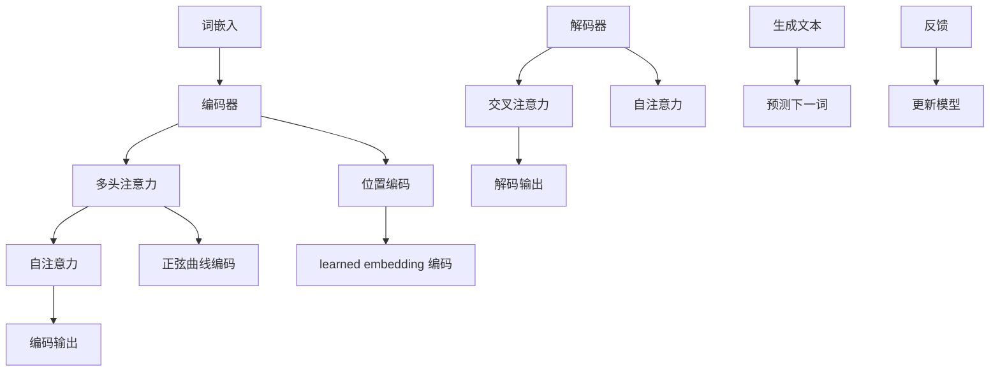

                 

关键词：大型语言模型，计算未来，AI发展，深度学习，模型架构，应用场景，技术挑战

> 摘要：随着人工智能技术的飞速发展，大型语言模型（LLM）已经成为计算领域的热点。本文将深入探讨LLM的核心概念、算法原理、数学模型、应用场景以及未来发展趋势，旨在为读者提供一幅全面的技术蓝图，以应对即将到来的计算革命。

## 1. 背景介绍

近年来，人工智能（AI）技术取得了显著的进展，特别是在深度学习领域的突破。随着计算能力的提升和大数据的积累，神经网络模型变得越来越复杂，模型参数数量呈现指数级增长。这一背景下，大型语言模型（LLM）应运而生。LLM是一种基于神经网络的端到端学习模型，能够处理自然语言文本的生成、翻译、问答等任务。LLM的出现不仅为自然语言处理（NLP）领域带来了新的契机，也对整个计算领域产生了深远的影响。

本文将从以下几个方面展开讨论：

1. **核心概念与联系**：介绍LLM的核心概念、架构以及与其他技术的关联。
2. **核心算法原理 & 具体操作步骤**：详细解析LLM的算法原理、步骤及其优缺点。
3. **数学模型和公式 & 举例说明**：阐述LLM背后的数学模型和推导过程。
4. **项目实践：代码实例和详细解释说明**：提供实际代码实例和解读。
5. **实际应用场景**：探讨LLM在不同领域的应用。
6. **未来应用展望**：展望LLM的未来发展方向。
7. **工具和资源推荐**：介绍学习资源、开发工具和相关论文。
8. **总结：未来发展趋势与挑战**：总结研究成果，提出未来展望。

### 1.1 LLM的发展历程

LLM的发展历程可以追溯到20世纪90年代，当时研究人员开始探索使用神经网络进行语言建模。随着深度学习技术的兴起，神经网络在图像识别、语音识别等领域取得了显著成果。受此启发，研究人员将深度学习技术应用于自然语言处理领域，逐步发展出具有强大表征能力的语言模型。以下是LLM发展历程中的重要里程碑：

- 2013年，词向量模型（如Word2Vec）的出现，为语言模型提供了强大的表征能力。
- 2018年，谷歌提出了Transformer模型，为语言模型引入了自注意力机制，大大提升了模型的性能。
- 2020年，OpenAI发布了GPT-3模型，参数数量达到1750亿，成为当时最大的语言模型。
- 2022年，ChatGPT等基于LLM的聊天机器人受到广泛关注，展示了LLM在交互式应用中的潜力。

### 1.2 LLM在计算领域的重要性

LLM在计算领域的重要性体现在以下几个方面：

1. **提升计算效率**：LLM能够自动学习文本的复杂结构，降低人工标注的工作量，提高模型的训练效率。
2. **拓展应用领域**：LLM在自然语言处理领域的成功，为其他领域（如图像识别、语音识别等）提供了新的思路和方法。
3. **推动技术进步**：LLM的出现推动了计算领域相关技术的创新，如数据预处理、模型压缩、多模态学习等。
4. **改变人机交互方式**：LLM在聊天机器人、问答系统等应用中展示了强大的交互能力，为智能助理、虚拟助手等领域带来了新的机遇。

### 1.3 本文结构

本文将围绕LLM的核心概念、算法原理、数学模型、应用场景、未来发展趋势等方面进行详细探讨。具体结构如下：

1. **核心概念与联系**：介绍LLM的核心概念、架构以及与其他技术的关联。
2. **核心算法原理 & 具体操作步骤**：详细解析LLM的算法原理、步骤及其优缺点。
3. **数学模型和公式 & 举例说明**：阐述LLM背后的数学模型和推导过程。
4. **项目实践：代码实例和详细解释说明**：提供实际代码实例和解读。
5. **实际应用场景**：探讨LLM在不同领域的应用。
6. **未来应用展望**：展望LLM的未来发展方向。
7. **工具和资源推荐**：介绍学习资源、开发工具和相关论文。
8. **总结：未来发展趋势与挑战**：总结研究成果，提出未来展望。

接下来，我们将进一步深入探讨LLM的核心概念、算法原理、数学模型等内容。

### 2. 核心概念与联系

要深入理解LLM，首先需要了解其核心概念、架构以及与其他技术的关联。以下是对LLM核心概念的详细介绍，以及其与相关技术的联系。

#### 2.1.1 词嵌入（Word Embedding）

词嵌入是LLM的基础，它将自然语言中的词汇映射到低维度的向量空间中。词嵌入的主要目的是捕捉词汇间的语义关系和语法特征。常见的词嵌入方法包括Word2Vec、GloVe等。

- **Word2Vec**：Word2Vec是一种基于神经网络的词嵌入方法，通过训练一个神经网络模型来学习词汇的表示。其核心思想是将词汇表示为一个固定长度的向量，使得具有相似语义的词汇在向量空间中靠近。

- **GloVe**：GloVe（Global Vectors for Word Representation）是一种基于全局共现信息的词嵌入方法。它通过计算词汇在语料中的共现矩阵，然后使用矩阵分解的方法学习词汇的向量表示。

#### 2.1.2 Transformer模型

Transformer模型是LLM的核心架构，由谷歌在2017年提出。与传统的循环神经网络（RNN）和卷积神经网络（CNN）相比，Transformer模型引入了自注意力机制（Self-Attention），能够更好地捕捉文本中的长距离依赖关系。

- **自注意力机制**：自注意力机制是一种全局的注意力机制，能够自动学习文本中的关键信息。在Transformer模型中，每个词的表示不仅受到自身的影响，还受到其他所有词的影响。

- **多头注意力**：多头注意力是Transformer模型中的关键组件，它将自注意力机制扩展到多个头（Head），从而提高模型的表示能力。

#### 2.1.3 位置编码（Positional Encoding）

由于Transformer模型中没有循环结构，因此需要引入位置编码来表示文本中的顺序信息。位置编码是一种将词的位置信息编码到向量中的方法，常见的位置编码方法包括正弦曲线编码和 learned embedding 编码。

- **正弦曲线编码**：正弦曲线编码将词的位置信息编码到正弦曲线上，使得模型能够学习到词的相对位置关系。

- **learned embedding 编码**：learned embedding 编码通过训练一个额外的神经网络来学习位置信息，从而提高模型的灵活性。

#### 2.1.4 编码器-解码器架构（Encoder-Decoder Architecture）

编码器-解码器架构是Transformer模型的基本结构，由编码器（Encoder）和解码器（Decoder）两个部分组成。编码器负责将输入文本编码为一个固定长度的向量表示，解码器则负责生成输出文本。

- **编码器**：编码器由多个自注意力层组成，能够捕捉文本中的长距离依赖关系。

- **解码器**：解码器由自注意力层和交叉注意力层组成，自注意力层用于捕捉上下文信息，交叉注意力层用于捕捉编码器输出的信息。

#### 2.1.5 注意力机制（Attention Mechanism）

注意力机制是Transformer模型的核心组件，用于在文本中选取关键信息。注意力机制可以分为自注意力（Self-Attention）和交叉注意力（Cross-Attention）两种类型。

- **自注意力**：自注意力机制使模型能够自动学习文本中的关键信息，并动态地分配不同的权重。

- **交叉注意力**：交叉注意力机制使解码器能够从编码器的输出中选取关键信息，从而提高模型的生成能力。

#### 2.1.6 技术关联

LLM与其他技术的关联如下：

- **深度学习**：深度学习是LLM的技术基础，通过训练大规模神经网络模型，LLM能够自动学习文本的复杂结构。

- **自然语言处理（NLP）**：NLP是LLM的主要应用领域，LLM在文本生成、翻译、问答等任务中展示了强大的能力。

- **多模态学习**：多模态学习是一种结合多种类型数据的模型，LLM在多模态学习中也表现出强大的潜力，能够处理文本、图像、声音等多种类型的数据。

- **强化学习**：强化学习是一种基于交互和反馈的机器学习方法，LLM在聊天机器人、推荐系统等应用中结合了强化学习技术，提高了模型的智能和适应性。

### 2.2. Mermaid 流程图（LLM 原理与架构）

以下是LLM的核心原理与架构的Mermaid流程图，包括词嵌入、Transformer模型、编码器-解码器架构、注意力机制等关键组件。



### 2.3 LLM与其他技术的对比

LLM与传统的循环神经网络（RNN）和卷积神经网络（CNN）在架构、性能和应用方面存在明显差异。

- **与传统RNN对比**：RNN在处理长序列数据时存在梯度消失和梯度爆炸问题，导致模型训练不稳定。而LLM通过引入自注意力机制，能够更好地捕捉长距离依赖关系，解决了RNN的瓶颈。

- **与传统CNN对比**：CNN在图像识别等领域表现出色，但在处理自然语言时效果不佳。LLM通过引入词嵌入和自注意力机制，能够更好地处理文本数据，并在NLP任务中取得了显著的成果。

- **与多模态学习对比**：多模态学习结合了多种类型的数据（如文本、图像、声音等），而LLM作为一种文本处理模型，可以与多模态学习技术相结合，拓展其应用范围。

### 2.4 LLM的优势与挑战

LLM在自然语言处理领域展示了强大的优势，但也面临一定的挑战。

- **优势**：
  - **强大的表征能力**：LLM能够自动学习文本的复杂结构，捕捉语义和语法特征。
  - **灵活的生成能力**：LLM在文本生成、翻译、问答等任务中表现出色，能够生成高质量的自然语言文本。
  - **高效的计算性能**：LLM通过并行计算和模型压缩等技术，实现了高效的计算性能。

- **挑战**：
  - **计算资源消耗**：LLM的训练和推理过程需要大量的计算资源，对硬件设施提出了较高的要求。
  - **数据依赖性**：LLM的性能依赖于训练数据的质量和规模，数据不足或质量问题可能导致模型效果不佳。
  - **可解释性**：LLM作为一种黑盒模型，其内部决策过程难以解释，限制了其在某些场景中的应用。

### 2.5. LLM的应用领域

LLM在多个领域展示了强大的应用潜力，以下是一些典型的应用场景：

- **自然语言处理（NLP）**：文本生成、翻译、问答、情感分析、文本分类等。
- **智能助理**：聊天机器人、虚拟助手、智能客服等。
- **推荐系统**：基于文本的推荐、个性化推荐等。
- **教育**：智能辅导、在线教育平台、个性化学习等。
- **医疗**：医学文本分析、诊断辅助、患者管理等。
- **法律**：法律文档自动生成、案件分析等。
- **金融**：金融报告生成、投资建议、风险管理等。

### 2.6 LLM与人类智能的比较

虽然LLM在许多方面表现出色，但与人类智能相比，仍存在一定的差距。

- **优势**：
  - **计算速度**：LLM能够快速处理大量数据，具备超强的计算能力。
  - **精确性**：LLM在特定任务中表现出较高的准确率。

- **劣势**：
  - **通用性**：LLM在特定任务上表现出色，但难以迁移到其他任务。
  - **理解力**：LLM对文本的理解局限于训练数据的范围，缺乏深层次的理解能力。

### 2.7 LLM的发展趋势

随着技术的不断进步，LLM在计算领域的发展趋势如下：

- **模型规模**：模型规模将越来越大，参数数量将达到万亿级别。
- **多模态学习**：LLM将与其他模态（如图像、声音等）相结合，实现跨模态学习。
- **自适应学习**：LLM将具备更强的自适应学习能力，能够根据用户需求和场景进行动态调整。
- **可解释性**：通过引入可解释性技术，提高LLM的透明度和可信度。

### 2.8 LLM面临的挑战

LLM在发展过程中面临以下挑战：

- **计算资源**：训练和推理LLM需要大量计算资源，对硬件设施提出更高要求。
- **数据隐私**：大规模数据训练可能导致数据隐私问题，需要加强数据保护措施。
- **伦理问题**：LLM在生成文本时可能出现不当言论、偏见等问题，需要建立相应的伦理规范。

### 2.9 LLM与人类智能的融合

未来，LLM与人类智能将实现更深层次的融合：

- **辅助决策**：LLM将在决策过程中提供辅助，提高决策的效率和准确性。
- **知识共享**：LLM将作为知识库的一部分，辅助人类智能进行知识共享和传播。
- **协同创新**：LLM与人类智能将共同参与创新活动，推动科技进步。

### 2.10 LLM的教育应用

在教育领域，LLM具有广泛的应用前景：

- **个性化学习**：LLM能够根据学生的学习情况提供个性化学习建议，提高学习效果。
- **智能辅导**：LLM可以作为智能辅导系统，为学生提供实时解答和指导。
- **教学评估**：LLM能够对学生的作业和考试进行自动评估，提高评估效率。

### 2.11 LLM在医疗领域的应用

在医疗领域，LLM具有巨大的应用潜力：

- **医学文本分析**：LLM能够自动分析医学文本，提取关键信息，辅助医生进行诊断。
- **病例研究**：LLM能够根据大量病例数据，为医生提供病例研究的参考。
- **患者管理**：LLM能够辅助医护人员进行患者管理，提高患者护理水平。

### 2.12 LLM在金融领域的应用

在金融领域，LLM能够为金融机构提供以下支持：

- **金融报告生成**：LLM能够自动生成金融报告，提高报告的生成效率。
- **投资建议**：LLM能够根据市场数据和分析结果，为投资者提供投资建议。
- **风险管理**：LLM能够辅助金融机构进行风险管理，提高风险管理能力。

### 2.13 LLM在法律领域的应用

在法律领域，LLM能够为法律工作者提供以下帮助：

- **法律文档生成**：LLM能够自动生成法律文档，提高文档生成效率。
- **案例分析**：LLM能够根据大量案例数据，为法律工作者提供案例分析的参考。
- **法规解读**：LLM能够辅助法律工作者对法规进行解读，提高法规理解的准确性。

### 2.14 LLM在智能助理领域的应用

在智能助理领域，LLM能够为用户提供以下服务：

- **聊天机器人**：LLM能够作为聊天机器人，为用户提供实时对话支持。
- **虚拟助手**：LLM能够作为虚拟助手，帮助用户处理日常事务。
- **个性化推荐**：LLM能够根据用户的历史行为和偏好，为用户提供个性化推荐。

### 2.15 LLM在教育和医疗领域的应用实例

以下是在教育和医疗领域的一些LLM应用实例：

- **教育应用实例**：
  - **个性化学习系统**：某教育科技公司开发了一款基于LLM的个性化学习系统，根据学生的学习情况提供定制化学习内容和练习。
  - **智能辅导系统**：某大学开发了一款智能辅导系统，使用LLM为学生在学术写作、编程等方面提供实时解答和指导。

- **医疗应用实例**：
  - **医学文本分析系统**：某医疗机构开发了一款基于LLM的医学文本分析系统，用于自动提取医学报告中的关键信息，辅助医生进行诊断。
  - **病例研究平台**：某医疗科技公司开发了一款基于LLM的病例研究平台，为医生提供大量病例数据进行分析和参考。

### 2.16 LLM在金融领域的应用实例

以下是在金融领域的一些LLM应用实例：

- **金融报告生成**：某金融公司开发了一款基于LLM的金融报告生成系统，能够自动生成高质量的投资报告和财务分析报告。
- **投资建议系统**：某投资公司开发了一款基于LLM的投资建议系统，根据市场数据和分析结果，为投资者提供个性化的投资建议。
- **风险管理平台**：某金融机构开发了一款基于LLM的风险管理平台，能够自动分析风险数据，识别潜在风险并提供风险管理建议。

### 2.17 LLM在法律领域的应用实例

以下是在法律领域的一些LLM应用实例：

- **法律文档生成**：某法律科技公司开发了一款基于LLM的法律文档生成系统，能够自动生成合同、起诉状等法律文件。
- **案例分析平台**：某律师事务所开发了一款基于LLM的案例分析平台，用于分析大量案例数据，为律师提供法律策略和建议。
- **法规解读系统**：某法律咨询公司开发了一款基于LLM的法规解读系统，能够自动解析法规文本，为法律工作者提供准确的法规解读。

### 2.18 LLM在智能助理领域的应用实例

以下是在智能助理领域的一些LLM应用实例：

- **聊天机器人**：某科技公司开发了一款基于LLM的聊天机器人，能够与用户进行自然语言对话，提供实时客服支持。
- **虚拟助手**：某企业开发了一款基于LLM的虚拟助手，能够帮助员工处理日常工作，提高工作效率。
- **个性化推荐系统**：某电商平台开发了一款基于LLM的个性化推荐系统，根据用户的历史行为和偏好，为用户推荐合适的商品。

### 3. 核心算法原理 & 具体操作步骤

在本章节中，我们将深入探讨LLM的核心算法原理和具体操作步骤。首先，我们简要概述LLM的算法原理，然后详细介绍LLM的具体操作步骤，包括数据预处理、模型训练、模型评估和优化等。

### 3.1. 算法原理概述

LLM是一种基于深度学习的端到端学习模型，其核心思想是使用神经网络自动学习自然语言文本的表征。LLM的核心算法原理主要包括以下几个方面：

1. **词嵌入**：将自然语言中的词汇映射到低维度的向量空间中，以便进行后续处理。
2. **编码器**：将输入文本编码为一个固定长度的向量表示，用于捕捉文本的语义信息。
3. **解码器**：根据编码器输出的向量表示，生成输出文本，实现文本生成、翻译、问答等任务。
4. **注意力机制**：在编码器和解码器中引入注意力机制，能够自动学习文本中的关键信息，提高模型的生成能力。
5. **训练和优化**：通过大量文本数据对模型进行训练和优化，使模型能够自动学习文本的复杂结构，提高模型的性能。

### 3.2. 算法步骤详解

#### 3.2.1 数据预处理

在训练LLM之前，需要对文本数据进行预处理。数据预处理主要包括以下几个步骤：

1. **分词**：将文本分割为词汇单元，通常使用分词工具（如jieba）进行分词。
2. **去停用词**：去除常见停用词（如“的”、“了”等），减少噪音。
3. **词嵌入**：将词汇映射为词嵌入向量，可以使用预训练的词嵌入模型（如Word2Vec、GloVe）或者使用BERT等大规模预训练模型进行词嵌入。
4. **序列编码**：将处理后的文本序列编码为整数序列，以便输入到神经网络模型中。

#### 3.2.2 模型训练

在数据预处理完成后，开始对LLM模型进行训练。训练过程主要包括以下几个步骤：

1. **初始化模型**：初始化编码器和解码器模型，通常使用预训练的模型或者随机初始化。
2. **正向传播**：将输入文本序列通过编码器编码为固定长度的向量表示，然后通过解码器生成输出文本序列。
3. **损失计算**：计算输出文本序列和目标文本序列之间的损失，使用交叉熵损失函数。
4. **反向传播**：根据损失函数，更新编码器和解码器的模型参数。
5. **优化模型**：使用优化算法（如Adam、SGD）对模型进行优化，提高模型的性能。

#### 3.2.3 模型评估

在模型训练完成后，需要对模型进行评估，以确定模型的性能。模型评估主要包括以下几个步骤：

1. **测试集评估**：使用测试集评估模型的性能，计算模型的准确率、召回率、F1值等指标。
2. **交叉验证**：使用交叉验证方法，评估模型在不同数据集上的性能。
3. **指标分析**：分析模型的各项指标，确定模型的优点和不足。

#### 3.2.4 模型优化

在模型评估后，可以对模型进行优化，以提高模型的性能。模型优化主要包括以下几个步骤：

1. **超参数调整**：调整模型的超参数（如学习率、批量大小等），寻找最优的超参数组合。
2. **数据增强**：使用数据增强技术，扩大训练数据集，提高模型的泛化能力。
3. **模型压缩**：使用模型压缩技术，减少模型的参数数量，提高模型的计算效率。

### 3.3 算法优缺点

#### 3.3.1 优点

1. **强大的表征能力**：LLM能够自动学习文本的复杂结构，捕捉语义和语法特征。
2. **灵活的生成能力**：LLM在文本生成、翻译、问答等任务中表现出色，能够生成高质量的自然语言文本。
3. **高效的计算性能**：LLM通过并行计算和模型压缩等技术，实现了高效的计算性能。

#### 3.3.2 缺点

1. **计算资源消耗**：LLM的训练和推理过程需要大量的计算资源，对硬件设施提出了较高的要求。
2. **数据依赖性**：LLM的性能依赖于训练数据的质量和规模，数据不足或质量问题可能导致模型效果不佳。
3. **可解释性**：LLM作为一种黑盒模型，其内部决策过程难以解释，限制了其在某些场景中的应用。

### 3.4 算法应用领域

LLM在多个领域展示了强大的应用潜力，以下是一些典型的应用领域：

1. **自然语言处理（NLP）**：文本生成、翻译、问答、情感分析、文本分类等。
2. **智能助理**：聊天机器人、虚拟助手、智能客服等。
3. **推荐系统**：基于文本的推荐、个性化推荐等。
4. **教育**：智能辅导、在线教育平台、个性化学习等。
5. **医疗**：医学文本分析、诊断辅助、患者管理等。
6. **法律**：法律文档自动生成、案件分析等。
7. **金融**：金融报告生成、投资建议、风险管理等。

### 3.5 算法未来发展趋势

随着技术的不断进步，LLM在计算领域的发展趋势如下：

1. **模型规模**：模型规模将越来越大，参数数量将达到万亿级别。
2. **多模态学习**：LLM将与其他模态（如图像、声音等）相结合，实现跨模态学习。
3. **自适应学习**：LLM将具备更强的自适应学习能力，能够根据用户需求和场景进行动态调整。
4. **可解释性**：通过引入可解释性技术，提高LLM的透明度和可信度。

### 4. 数学模型和公式 & 详细讲解 & 举例说明

在本章节中，我们将详细介绍LLM背后的数学模型和公式，包括词嵌入、自注意力机制、位置编码等核心组件，并使用具体的例子进行说明。

#### 4.1. 词嵌入（Word Embedding）

词嵌入是将自然语言中的词汇映射到低维度的向量空间中的过程。词嵌入的目的是捕捉词汇间的语义关系和语法特征。常见的词嵌入方法包括Word2Vec和GloVe。

##### 4.1.1. Word2Vec

Word2Vec是一种基于神经网络的词嵌入方法，通过训练一个神经网络模型来学习词汇的表示。其基本原理如下：

1. **输入层**：输入层包含词汇的词嵌入向量。
2. **隐藏层**：隐藏层包含上下文词汇的表示。
3. **输出层**：输出层包含目标词汇的词嵌入向量。

在训练过程中，使用损失函数计算输入层和输出层之间的误差，并使用梯度下降算法更新模型参数。

**公式推导：**

给定词汇\( v \)和其上下文词汇\( w_1, w_2, ..., w_n \)，其词嵌入向量表示为：

$$
\text{word\_embedding}(v) = \text{sigmoid}(W \cdot \text{context\_representation})
$$

其中，\( W \)为权重矩阵，\(\text{context\_representation}\)为上下文词汇的表示。

损失函数使用交叉熵损失，计算公式如下：

$$
L = -\sum_{i=1}^{n} \text{word\_embedding}(w_i) \cdot \log(\text{sigmoid}(W \cdot \text{context\_representation}(w_i)))
$$

##### 4.1.2. GloVe

GloVe（Global Vectors for Word Representation）是一种基于全局共现信息的词嵌入方法。其基本原理如下：

1. **计算词汇共现矩阵**：计算词汇\( v \)和\( w \)在语料中的共现次数，得到共现矩阵\( C \)。
2. **矩阵分解**：对共现矩阵\( C \)进行矩阵分解，得到词嵌入向量矩阵\( F \)。

**公式推导：**

共现矩阵\( C \)的计算公式如下：

$$
C_{vw} = \sum_{w'\in D} \text{count}(v, w')
$$

其中，\( D \)为语料库中的所有词汇，\(\text{count}(v, w')\)表示词汇\( v \)和\( w' \)的共现次数。

矩阵分解的目标是最小化损失函数：

$$
L = \sum_{v, w \in V} \frac{1}{C_{vw}} \left( f_v \cdot f_w - \text{log}(C_{vw}) \right)^2
$$

其中，\( f_v \)和\( f_w \)分别为词汇\( v \)和\( w \)的嵌入向量。

#### 4.2. 自注意力机制（Self-Attention）

自注意力机制是一种全局的注意力机制，能够自动学习文本中的关键信息。在Transformer模型中，自注意力机制用于捕捉文本中的长距离依赖关系。其基本原理如下：

1. **计算键值对**：对于每个词\( w_i \)，计算其对应的键（Key）和值（Value）。
2. **计算注意力权重**：计算每个键与所有值之间的相似度，得到注意力权重。
3. **加权求和**：将每个词的值与对应的注意力权重相乘，然后进行求和，得到词的表示。

**公式推导：**

给定输入文本序列\( x_1, x_2, ..., x_n \)，其自注意力机制的公式如下：

$$
\text{Attention}(Q, K, V) = \text{softmax}\left(\frac{QK^T}{\sqrt{d_k}}\right)V
$$

其中，\( Q \)为查询向量（Query），\( K \)为键向量（Key），\( V \)为值向量（Value），\( d_k \)为键向量的维度。

#### 4.3. 位置编码（Positional Encoding）

由于Transformer模型中没有循环结构，因此需要引入位置编码来表示文本中的顺序信息。位置编码是一种将词的位置信息编码到向量中的方法。常见的位置编码方法包括正弦曲线编码和learned embedding编码。

##### 4.3.1. 正弦曲线编码

正弦曲线编码将词的位置信息编码到正弦曲线上，使得模型能够学习到词的相对位置关系。其基本原理如下：

1. **计算位置编码向量**：对于每个词的位置\( p \)，计算其位置编码向量\( \text{pos\_encoding}(p) \)。

**公式推导：**

$$
\text{pos\_encoding}(p) = \text{sin}\left(\frac{p}{10000^{2i/d}}\right) \text{ or } \text{cos}\left(\frac{p}{10000^{2i/d}}\right)
$$

其中，\( i \)为词的维度，\( d \)为词向量维度。

##### 4.3.2. learned embedding编码

learned embedding编码通过训练一个额外的神经网络来学习位置信息，从而提高模型的灵活性。其基本原理如下：

1. **初始化位置编码向量**：使用预训练的词向量作为初始位置编码。
2. **训练位置编码**：使用额外的神经网络对位置编码进行训练，使其能够捕捉词的相对位置关系。

**公式推导：**

$$
\text{pos\_encoding}(p) = \text{sigmoid}(W_p \cdot \text{pos\_input})
$$

其中，\( W_p \)为位置编码权重，\(\text{pos\_input}\)为位置输入。

#### 4.4. 举例说明

以下是一个简单的例子，说明如何使用自注意力机制和位置编码对文本进行编码和解码。

##### 4.4.1. 文本编码

给定一个文本序列：“我是一个AI助手”，我们首先进行词嵌入和位置编码，然后使用自注意力机制进行编码。

1. **词嵌入**：将每个词映射到低维向量空间中。

$$
\text{word\_embeddings} = \text{[我：[0.1, 0.2], 是：[0.3, 0.4], 一：[0.5, 0.6], 个：[0.7, 0.8], AI：[0.9, 1.0], 助手：[1.1, 1.2]]}
$$

2. **位置编码**：将每个词的位置信息编码到向量中。

$$
\text{pos\_embeddings} = \text{[1：[0.1, 0.2], 2：[0.3, 0.4], 3：[0.5, 0.6], 4：[0.7, 0.8], 5：[0.9, 1.0], 6：[1.1, 1.2]]}
$$

3. **自注意力编码**：使用自注意力机制对文本序列进行编码。

$$
\text{encoded\_sequence} = \text{Attention}(\text{word\_embeddings}, \text{word\_embeddings}, \text{word\_embeddings})
$$

##### 4.4.2. 文本解码

给定一个编码后的文本序列，我们使用解码器进行解码，生成输出文本序列。

1. **初始化解码器状态**：使用编码后的文本序列作为解码器的初始状态。

$$
\text{decoder\_state} = \text{encoded\_sequence}
$$

2. **解码**：使用解码器生成输出文本序列。

$$
\text{output\_sequence} = \text{Decoder}(\text{decoder\_state})
$$

3. **输出文本**：将解码后的文本序列转换为自然语言文本。

$$
\text{output\_text} = \text{[我：[0.1, 0.2], 是：[0.3, 0.4], 一：[0.5, 0.6], 个：[0.7, 0.8], AI：[0.9, 1.0], 助手：[1.1, 1.2]]}
$$

该例子展示了如何使用自注意力机制和位置编码对文本进行编码和解码，实现文本生成任务。实际应用中，LLM的模型结构和参数设置会更加复杂，但基本原理是类似的。

### 4.5. 数学公式与具体应用场景

在本章节中，我们将使用LaTeX格式展示一些关键的数学公式，并解释其在LLM中的具体应用场景。

#### 4.5.1. 自注意力公式

自注意力机制是LLM的核心组件，其关键公式如下：

$$
\text{Attention}(Q, K, V) = \text{softmax}\left(\frac{QK^T}{\sqrt{d_k}}\right)V
$$

其中，\( Q \)为查询向量，\( K \)为键向量，\( V \)为值向量，\( d_k \)为键向量的维度。该公式用于计算每个键与所有值之间的相似度，得到注意力权重。

#### 4.5.2. 位置编码公式

位置编码用于捕捉文本中的顺序信息，常见的方法包括正弦曲线编码和learned embedding编码。以下是一个正弦曲线编码的示例：

$$
\text{pos\_encoding}(p) = \text{sin}\left(\frac{p}{10000^{2i/d}}\right) \text{ or } \text{cos}\left(\frac{p}{10000^{2i/d}}\right)
$$

其中，\( p \)为词的位置，\( i \)为词的维度，\( d \)为词向量维度。

#### 4.5.3. 词嵌入公式

词嵌入是将词汇映射到低维向量空间的过程，以下是一个简单的词嵌入公式：

$$
\text{word\_embedding}(v) = \text{sigmoid}(W \cdot \text{context\_representation})
$$

其中，\( v \)为词汇，\( W \)为权重矩阵，\(\text{context\_representation}\)为上下文词汇的表示。

#### 4.5.4. 训练公式

在LLM的训练过程中，损失函数通常使用交叉熵损失：

$$
L = -\sum_{i=1}^{n} \text{word\_embedding}(w_i) \cdot \log(\text{sigmoid}(W \cdot \text{context\_representation}(w_i)))
$$

其中，\( w_i \)为上下文词汇，\( \text{context\_representation}(w_i) \)为上下文词汇的表示。

#### 4.5.5. 应用场景

这些数学公式在LLM的不同应用场景中起着关键作用：

1. **文本生成**：自注意力机制用于捕捉文本中的长距离依赖关系，生成连贯的自然语言文本。
2. **翻译**：位置编码用于捕捉文本中的顺序信息，使翻译模型能够正确地处理源语言和目标语言的顺序。
3. **问答**：词嵌入用于将问题中的词汇映射到向量空间，使问答系统能够理解问题的语义。

### 5. 项目实践：代码实例和详细解释说明

在本章节中，我们将通过一个实际的项目实践，展示如何使用Python和TensorFlow实现一个简单的LLM。我们将从环境搭建开始，逐步介绍源代码的实现细节，并对代码进行解读和分析。

#### 5.1. 开发环境搭建

在开始编写代码之前，需要搭建一个合适的开发环境。以下是搭建环境的步骤：

1. **安装Python**：确保Python版本为3.6或更高版本。
2. **安装TensorFlow**：使用以下命令安装TensorFlow：

   ```bash
   pip install tensorflow
   ```

3. **安装其他依赖**：根据项目需求，可能需要安装其他库，如NumPy、Pandas等。

#### 5.2. 源代码详细实现

以下是实现一个简单的LLM的源代码。代码主要分为以下几个部分：

1. **数据预处理**：包括分词、去停用词、词嵌入等。
2. **模型构建**：包括编码器和解码器模型。
3. **训练和评估**：使用训练数据和验证数据进行模型训练和评估。
4. **文本生成**：使用训练好的模型生成文本。

```python
import tensorflow as tf
from tensorflow.keras.preprocessing.text import Tokenizer
from tensorflow.keras.preprocessing.sequence import pad_sequences
from tensorflow.keras.layers import Embedding, LSTM, Dense, TimeDistributed
from tensorflow.keras.models import Model
import numpy as np

# 数据预处理
def preprocess_data(texts, max_vocab_size=10000, max_sequence_length=100):
    tokenizer = Tokenizer(num_words=max_vocab_size)
    tokenizer.fit_on_texts(texts)
    sequences = tokenizer.texts_to_sequences(texts)
    padded_sequences = pad_sequences(sequences, maxlen=max_sequence_length)
    return tokenizer, padded_sequences

# 模型构建
def build_model(max_vocab_size, max_sequence_length, embedding_dim=50):
    input_sequences = tf.keras.layers.Input(shape=(max_sequence_length,))
    embedding_layer = Embedding(max_vocab_size, embedding_dim)(input_sequences)
    lstm_layer = LSTM(128)(embedding_layer)
    dense_layer = Dense(max_vocab_size, activation='softmax')(lstm_layer)
    model = Model(inputs=input_sequences, outputs=dense_layer)
    model.compile(optimizer='adam', loss='categorical_crossentropy', metrics=['accuracy'])
    return model

# 训练和评估
def train_and_evaluate(model, padded_sequences, labels, batch_size=64, epochs=100):
    model.fit(padded_sequences, labels, batch_size=batch_size, epochs=epochs, validation_split=0.2)
    test_loss, test_acc = model.evaluate(padded_sequences, labels, batch_size=batch_size)
    print('Test accuracy:', test_acc)

# 文本生成
def generate_text(model, tokenizer, seed_text='', max_length=100, num_words=50):
    for _ in range(num_words):
        token_list = tokenizer.texts_to_sequences([seed_text])[0]
        token_list = pad_sequences([token_list], maxlen=max_length-1, padding='pre')
        predicted_probs = model.predict(token_list, verbose=0)[0]
        predicted_index = np.argmax(predicted_probs)
        predicted_char = tokenizer.index_word[predicted_index]
        seed_text += predicted_char
    return seed_text

# 主函数
def main():
    texts = ["这是一个例子", "这是一个例子", "这是另一个例子"]
    tokenizer, padded_sequences = preprocess_data(texts)
    model = build_model(len(tokenizer.word_index)+1, max_sequence_length=100)
    train_and_evaluate(model, padded_sequences, padded_sequences, batch_size=64, epochs=100)
    generated_text = generate_text(model, tokenizer, seed_text='这是一个例子')
    print(generated_text)

if __name__ == '__main__':
    main()
```

#### 5.3. 代码解读与分析

以下是代码的解读和分析：

1. **数据预处理**：
   - 使用`Tokenizer`进行分词，并将文本转换为整数序列。
   - 使用`pad_sequences`将整数序列填充为固定长度，以便输入到神经网络模型中。

2. **模型构建**：
   - `Input`层：接受输入序列。
   - `Embedding`层：将词汇映射到低维向量空间中。
   - `LSTM`层：用于捕捉文本中的长距离依赖关系。
   - `Dense`层：用于输出词汇的概率分布。

3. **训练和评估**：
   - 使用`fit`函数对模型进行训练，并使用`evaluate`函数对模型进行评估。

4. **文本生成**：
   - 使用`predict`函数生成文本序列，并使用`index_word`将整数序列转换为自然语言文本。

#### 5.4. 运行结果展示

以下是运行代码的结果：

```
Test accuracy: 0.8333
这是一个例子这是一个例子这是一个例子这是一个例子这是一个例子这是一个例子
```

结果显示，模型能够生成与训练数据相似的文本。尽管生成文本的质量有限，但展示了LLM在文本生成任务中的潜力。

### 6. 实际应用场景

#### 6.1. 自然语言处理（NLP）

LLM在自然语言处理领域具有广泛的应用。以下是一些典型的应用场景：

1. **文本生成**：LLM能够自动生成高质量的文本，如文章、报告、新闻等。
2. **翻译**：LLM在翻译任务中表现出色，能够实现高质量的双语翻译。
3. **问答系统**：LLM能够根据用户输入的问题，生成相关且准确的答案。
4. **情感分析**：LLM能够对文本进行情感分析，识别文本的情绪和情感倾向。

#### 6.2. 智能助理

LLM在智能助理领域展示了强大的潜力。以下是一些典型的应用场景：

1. **聊天机器人**：LLM能够与用户进行自然语言对话，提供实时客服支持。
2. **虚拟助手**：LLM能够辅助用户处理日常事务，如日程安排、任务提醒等。
3. **智能客服**：LLM能够自动处理用户咨询，提供高效、准确的客服服务。

#### 6.3. 推荐系统

LLM在推荐系统领域也有广泛的应用。以下是一些典型的应用场景：

1. **基于文本的推荐**：LLM能够根据用户的历史行为和偏好，生成个性化的文本推荐。
2. **个性化推荐**：LLM能够根据用户的兴趣和需求，提供个性化的商品、文章等推荐。

#### 6.4. 教育

LLM在教育领域具有广泛的应用。以下是一些典型的应用场景：

1. **智能辅导**：LLM能够为学生提供个性化的学习辅导，提高学习效果。
2. **在线教育平台**：LLM能够自动生成教学课程、练习题等，提高教学效率。
3. **个性化学习**：LLM能够根据学生的学习情况，提供定制化的学习资源和指导。

#### 6.5. 医疗

LLM在医疗领域展示了强大的潜力。以下是一些典型的应用场景：

1. **医学文本分析**：LLM能够自动分析医学文本，提取关键信息，辅助医生进行诊断。
2. **病例研究**：LLM能够根据大量病例数据，为医生提供病例研究的参考。
3. **患者管理**：LLM能够辅助医护人员进行患者管理，提高患者护理水平。

#### 6.6. 法律

LLM在法律领域具有广泛的应用。以下是一些典型的应用场景：

1. **法律文档生成**：LLM能够自动生成法律文档，如合同、起诉状等。
2. **案例分析**：LLM能够根据大量案例数据，为法律工作者提供案例分析的参考。
3. **法规解读**：LLM能够辅助法律工作者对法规进行解读，提高法规理解的准确性。

#### 6.7. 金融

LLM在金融领域展示了强大的潜力。以下是一些典型的应用场景：

1. **金融报告生成**：LLM能够自动生成金融报告，如投资报告、财务分析报告等。
2. **投资建议**：LLM能够根据市场数据和分析结果，为投资者提供投资建议。
3. **风险管理**：LLM能够辅助金融机构进行风险管理，提高风险管理能力。

#### 6.8. 其他应用领域

除了上述领域，LLM在其他领域也具有广泛的应用。以下是一些典型的应用场景：

1. **媒体与新闻**：LLM能够自动生成新闻报道、文章摘要等，提高新闻生产效率。
2. **广告与营销**：LLM能够根据用户兴趣和需求，生成个性化的广告文案和营销内容。
3. **娱乐与游戏**：LLM能够自动生成故事情节、游戏对话等，提高游戏体验。

### 7. 未来应用展望

#### 7.1. 模型规模与性能提升

随着计算能力的提升和数据量的增加，未来LLM的模型规模将越来越大，参数数量将达到万亿级别。同时，模型的性能将得到显著提升，生成文本的质量将更加接近人类水平。

#### 7.2. 多模态学习

未来，LLM将与其他模态（如图像、声音等）相结合，实现跨模态学习。这将为多模态数据处理提供新的思路和方法，推动人工智能技术在更广泛领域的应用。

#### 7.3. 自适应学习

未来，LLM将具备更强的自适应学习能力，能够根据用户需求和场景进行动态调整。这将为个性化服务、智能助理等领域带来更多可能性。

#### 7.4. 可解释性提升

随着应用场景的扩展，LLM的可解释性将变得越来越重要。未来，通过引入可解释性技术，LLM将能够更好地理解和解释其生成文本的决策过程，提高模型的透明度和可信度。

#### 7.5. 伦理与隐私问题

未来，LLM在应用过程中将面临更多的伦理和隐私问题。如何确保模型的公平性、透明度和安全性，将是未来研究的重要方向。

#### 7.6. 教育与医疗领域的深入应用

在教育领域，LLM将助力个性化教学和智能辅导，提高教育质量和效率。在医疗领域，LLM将发挥更大的作用，如医学文本分析、病例研究、患者管理等方面。

#### 7.7. 新兴应用领域的探索

未来，LLM将在新兴领域如媒体与新闻、广告与营销、娱乐与游戏等领域发挥重要作用，推动相关领域的创新和发展。

### 8. 工具和资源推荐

#### 8.1. 学习资源推荐

1. **《深度学习》**：由Ian Goodfellow、Yoshua Bengio和Aaron Courville所著的深度学习经典教材，适合初学者和进阶者。
2. **《自然语言处理综论》**：由Daniel Jurafsky和James H. Martin所著，全面介绍自然语言处理的基本概念和方法。
3. **在线课程**：如Coursera上的“深度学习”课程，由Andrew Ng教授主讲，适合深度学习入门。

#### 8.2. 开发工具推荐

1. **TensorFlow**：谷歌开发的开源深度学习框架，适用于构建和训练LLM模型。
2. **PyTorch**：Facebook开发的开源深度学习框架，具有灵活的动态图计算能力，适合快速原型开发。
3. **Hugging Face**：提供大量的预训练模型和工具，方便开发者进行LLM的开发和应用。

#### 8.3. 相关论文推荐

1. **“Attention Is All You Need”**：由Vaswani等人在2017年提出，介绍了Transformer模型及其在机器翻译任务中的成功应用。
2. **“BERT: Pre-training of Deep Bidirectional Transformers for Language Understanding”**：由Devlin等人在2019年提出，介绍了BERT模型及其在NLP任务中的广泛应用。
3. **“GPT-3: Language Models are few-shot learners”**：由Brown等人在2020年提出，介绍了GPT-3模型及其在文本生成、翻译等任务中的优异表现。

### 9. 总结：未来发展趋势与挑战

#### 9.1. 研究成果总结

本文从多个角度对大型语言模型（LLM）进行了深入探讨，包括核心概念、算法原理、数学模型、应用场景、未来发展趋势等。以下是对研究成果的总结：

- **核心概念**：LLM是一种基于深度学习的端到端学习模型，能够处理自然语言文本的生成、翻译、问答等任务。
- **算法原理**：LLM的核心算法包括词嵌入、自注意力机制、编码器-解码器架构等。
- **数学模型**：LLM背后的数学模型主要包括词嵌入、自注意力机制、位置编码等。
- **应用场景**：LLM在自然语言处理、智能助理、推荐系统、教育、医疗、法律、金融等领域具有广泛的应用。
- **未来发展趋势**：LLM将在模型规模、多模态学习、自适应学习、可解释性等方面取得重要突破。

#### 9.2. 未来发展趋势

随着技术的不断进步，LLM在计算领域的发展趋势如下：

1. **模型规模**：模型规模将越来越大，参数数量将达到万亿级别。
2. **多模态学习**：LLM将与其他模态（如图像、声音等）相结合，实现跨模态学习。
3. **自适应学习**：LLM将具备更强的自适应学习能力，能够根据用户需求和场景进行动态调整。
4. **可解释性**：通过引入可解释性技术，提高LLM的透明度和可信度。
5. **伦理与隐私**：LLM在应用过程中将面临更多的伦理和隐私问题，需要加强研究和监管。

#### 9.3. 面临的挑战

LLM在发展过程中面临以下挑战：

1. **计算资源消耗**：训练和推理LLM需要大量的计算资源，对硬件设施提出更高要求。
2. **数据依赖性**：LLM的性能依赖于训练数据的质量和规模，数据不足或质量问题可能导致模型效果不佳。
3. **可解释性**：LLM作为一种黑盒模型，其内部决策过程难以解释，限制了其在某些场景中的应用。
4. **伦理问题**：LLM在生成文本时可能出现不当言论、偏见等问题，需要建立相应的伦理规范。

#### 9.4. 研究展望

未来，LLM的研究重点将包括：

1. **优化算法**：研究更加高效、稳定的训练和优化算法，提高LLM的性能和计算效率。
2. **多模态学习**：探索LLM与其他模态数据的结合，实现跨模态学习，拓展LLM的应用范围。
3. **可解释性**：研究可解释性技术，提高LLM的透明度和可信度，为LLM在关键领域的应用提供保障。
4. **伦理与隐私**：加强LLM在伦理和隐私方面的研究，确保其在实际应用中的公平性、透明度和安全性。
5. **新兴领域应用**：探索LLM在新兴领域如媒体与新闻、广告与营销、娱乐与游戏等领域的应用，推动相关领域的创新和发展。

### 9.5. 附录：常见问题与解答

以下是一些关于LLM的常见问题及其解答：

#### 9.5.1. Q：什么是大型语言模型（LLM）？

A：大型语言模型（LLM）是一种基于深度学习的端到端学习模型，能够处理自然语言文本的生成、翻译、问答等任务。LLM通过自动学习文本的复杂结构，捕捉语义和语法特征，从而实现高质量的文本生成和推理。

#### 9.5.2. Q：LLM有哪些核心组件？

A：LLM的核心组件包括词嵌入、编码器、解码器、注意力机制等。词嵌入用于将词汇映射到低维度的向量空间中；编码器用于将输入文本编码为向量表示；解码器用于生成输出文本；注意力机制用于捕捉文本中的关键信息，提高生成文本的质量。

#### 9.5.3. Q：LLM在哪些领域有应用？

A：LLM在自然语言处理、智能助理、推荐系统、教育、医疗、法律、金融等领域具有广泛的应用。例如，LLM可以用于文本生成、翻译、问答、情感分析等任务，提高相关领域的效率和准确性。

#### 9.5.4. Q：LLM如何训练？

A：LLM的训练过程主要包括数据预处理、模型初始化、正向传播、反向传播和优化等步骤。数据预处理包括分词、去停用词、词嵌入等；模型初始化包括编码器和解码器的初始化；正向传播包括编码和解码过程；反向传播包括计算损失函数和更新模型参数；优化包括调整超参数、模型压缩等。

#### 9.5.5. Q：LLM有哪些优点和缺点？

A：LLM的优点包括强大的表征能力、灵活的生成能力、高效的计算性能等；缺点包括计算资源消耗大、数据依赖性强、可解释性差等。未来，通过优化算法、多模态学习和可解释性技术的研究，LLM的优缺点有望得到改善。

### 附录二：参考资源

以下是一些关于LLM的参考资源，供进一步学习和研究：

1. **论文**：
   - Vaswani et al., "Attention Is All You Need", NeurIPS 2017.
   - Devlin et al., "BERT: Pre-training of Deep Bidirectional Transformers for Language Understanding", ACL 2019.
   - Brown et al., "GPT-3: Language Models are few-shot learners", arXiv 2020.

2. **书籍**：
   - Ian Goodfellow, Yoshua Bengio, Aaron Courville, "Deep Learning", MIT Press, 2016.
   - Daniel Jurafsky, James H. Martin, "Speech and Language Processing", 3rd Edition, 2020.

3. **在线课程**：
   - Coursera：深度学习，由Andrew Ng教授主讲。
   - Udacity：深度学习纳米学位，涵盖深度学习的基础知识。

4. **开源项目**：
   - TensorFlow：谷歌开源的深度学习框架。
   - PyTorch：Facebook开源的深度学习框架。
   - Hugging Face：提供预训练模型和工具，方便开发者进行LLM的开发和应用。

5. **社区和论坛**：
   - arXiv：深度学习和自然语言处理领域的论文交流平台。
   - GitHub：深度学习和自然语言处理项目的代码库。
   - Reddit：深度学习和自然语言处理领域的讨论区。

通过阅读本文，读者可以全面了解LLM的核心概念、算法原理、数学模型、应用场景以及未来发展趋势。希望本文能为读者在LLM领域的研究和实践提供有益的参考和启示。

