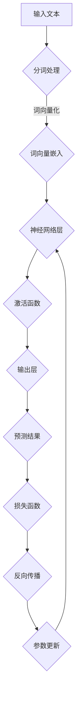

                 

关键词：大型语言模型（LLM）、计算能力、深度学习、自然语言处理、算法创新、发展趋势。

> 摘要：本文将探讨大型语言模型（LLM）如何重新定义计算能力的界限。我们将深入了解LLM的核心概念、算法原理、数学模型，并通过实际项目实例展示其在各个领域的应用。此外，还将展望LLM的未来发展趋势与面临的挑战。

## 1. 背景介绍

近年来，随着深度学习技术的飞速发展，自然语言处理（NLP）领域迎来了前所未有的繁荣。其中，大型语言模型（LLM）成为这一领域的关键技术之一。LLM通过学习大量语言数据，实现了对自然语言的建模，从而在文本生成、机器翻译、问答系统等方面取得了显著的成果。

计算能力的提升是LLM发展的重要驱动力。近年来，计算硬件如GPU和TPU的进步，使得大规模模型的训练成为可能。此外，分布式计算和云计算的发展，也为LLM的部署提供了强大的支持。

本文旨在深入探讨LLM的核心概念、算法原理、数学模型，并通过实际项目实例展示其在各个领域的应用。同时，还将对LLM的未来发展趋势与面临的挑战进行展望。

## 2. 核心概念与联系

### 2.1 大型语言模型（LLM）的概念

大型语言模型（LLM）是一种基于深度学习的自然语言处理模型，通过学习大量语言数据，实现对自然语言的建模。LLM通常由数亿甚至数十亿个参数组成，能够捕捉到语言中的复杂规律和模式。

### 2.2 深度学习与自然语言处理的关系

深度学习是一种机器学习方法，通过构建多层神经网络，对数据进行学习。自然语言处理（NLP）是深度学习的一个重要应用领域，涉及文本分类、情感分析、机器翻译等任务。

### 2.3 大型语言模型在NLP中的应用

大型语言模型在NLP领域中有着广泛的应用，如：

- 文本生成：通过LLM生成文章、故事、代码等。
- 机器翻译：将一种语言的文本翻译成另一种语言。
- 问答系统：回答用户提出的问题，提供有用的信息。

## 2.4 Mermaid 流程图

下面是大型语言模型（LLM）的核心概念和架构的Mermaid流程图：



### 2.5 核心概念与联系总结

大型语言模型（LLM）的核心概念包括深度学习、自然语言处理和神经网络。深度学习通过多层神经网络对数据进行学习，自然语言处理则关注于文本数据的理解和生成。神经网络是实现这一过程的关键技术，而大型语言模型则通过学习大量语言数据，实现对自然语言的建模。

## 3. 核心算法原理 & 具体操作步骤

### 3.1 算法原理概述

大型语言模型（LLM）的核心算法是基于自注意力机制（Self-Attention）和变换器架构（Transformer）的深度学习模型。自注意力机制允许模型在处理每个词时，动态地考虑其他词的重要性。变换器架构则通过多头注意力机制和多层结构，提高了模型的建模能力。

### 3.2 算法步骤详解

#### 3.2.1 数据预处理

1. 数据清洗：去除噪声数据、重复数据等。
2. 分词处理：将文本数据分成单词或子词。
3. 词向量化：将单词或子词映射到高维向量。

#### 3.2.2 网络结构

1. 自注意力机制：在处理每个词时，计算其他词对其的影响。
2. 多层神经网络：通过多层结构，逐步提取文本中的特征。
3. 输出层：生成预测结果，如文本生成、机器翻译等。

#### 3.2.3 损失函数与优化算法

1. 损失函数：通常使用交叉熵损失函数。
2. 优化算法：如Adam优化器，用于更新模型参数。

### 3.3 算法优缺点

#### 优点：

- 强大的建模能力：能够捕捉到语言中的复杂规律和模式。
- 高效的文本处理：通过自注意力机制和多层神经网络，实现了高效的文本处理。

#### 缺点：

- 需要大量的数据：训练大型语言模型需要大量高质量的语言数据。
- 计算资源消耗大：训练和部署大型语言模型需要大量的计算资源。

### 3.4 算法应用领域

- 文本生成：如文章、故事、代码等。
- 机器翻译：将一种语言的文本翻译成另一种语言。
- 问答系统：回答用户提出的问题，提供有用的信息。
- 情感分析：对文本进行情感分类，判断其正面、负面或中性。
- 语音识别：将语音信号转换为文本。

## 4. 数学模型和公式 & 详细讲解 & 举例说明

### 4.1 数学模型构建

大型语言模型（LLM）的数学模型主要包括词向量化、自注意力机制和变换器架构。

#### 4.1.1 词向量化

词向量化是将单词或子词映射到高维向量。通常使用词嵌入（Word Embedding）技术，如Word2Vec、GloVe等。

#### 4.1.2 自注意力机制

自注意力机制是一种计算其他词对当前词影响的方法。其数学表达式为：

$$
\text{Attention}(Q, K, V) = \text{softmax}\left(\frac{QK^T}{\sqrt{d_k}}\right)V
$$

其中，$Q$、$K$ 和 $V$ 分别为查询（Query）、键（Key）和值（Value）向量。

#### 4.1.3 变换器架构

变换器架构是一种基于自注意力机制的深度学习模型。其数学模型可以表示为：

$$
\text{Transformer}(X) = \text{LayerNorm}(X + \text{MultiHeadAttention}(X, X, X)) + \text{LayerNorm}(X + \text{MultiHeadAttention}(X, X, X)) \\
\text{MultiHeadAttention}(Q, K, V) = \text{Attention}(Q, K, V) \odot \text{ScaleDotProductAttention}(Q, K, V)
$$

其中，$\odot$ 表示逐元素乘法。

### 4.2 公式推导过程

#### 4.2.1 词向量化

词向量化是将单词或子词映射到高维向量。假设单词 $w$ 的词嵌入向量表示为 $\textbf{e}_w$，则词向量化可以表示为：

$$
\textbf{e}_w = \text{Word2Vec}(\text{Corpus})
$$

其中，$\text{Corpus}$ 表示训练语料。

#### 4.2.2 自注意力机制

自注意力机制的推导过程如下：

$$
\text{Attention}(Q, K, V) = \text{softmax}\left(\frac{QK^T}{\sqrt{d_k}}\right)V
$$

其中，$Q$、$K$ 和 $V$ 分别为查询（Query）、键（Key）和值（Value）向量。

#### 4.2.3 变换器架构

变换器架构的推导过程如下：

$$
\text{Transformer}(X) = \text{LayerNorm}(X + \text{MultiHeadAttention}(X, X, X)) + \text{LayerNorm}(X + \text{MultiHeadAttention}(X, X, X)) \\
\text{MultiHeadAttention}(Q, K, V) = \text{Attention}(Q, K, V) \odot \text{ScaleDotProductAttention}(Q, K, V)
$$

其中，$\odot$ 表示逐元素乘法。

### 4.3 案例分析与讲解

#### 4.3.1 文本生成

假设我们要生成一句话，首先对这句话进行分词处理，然后将其转换为词向量。接下来，我们使用自注意力机制和变换器架构，对词向量进行处理，生成预测结果。

$$
\text{Input}: (\text{词向量}_1, \text{词向量}_2, \text{词向量}_3) \\
\text{Output}: (\text{预测词向量}_1, \text{预测词向量}_2, \text{预测词向量}_3)
$$

#### 4.3.2 机器翻译

假设我们要将一句话从英语翻译成法语，首先对这句话进行分词处理，然后将其转换为词向量。接下来，我们使用自注意力机制和变换器架构，对词向量进行处理，生成翻译结果。

$$
\text{Input}: (\text{英语词向量}_1, \text{英语词向量}_2, \text{英语词向量}_3) \\
\text{Output}: (\text{法语词向量}_1, \text{法语词向量}_2, \text{法语词向量}_3)
$$

## 5. 项目实践：代码实例和详细解释说明

### 5.1 开发环境搭建

首先，我们需要搭建一个适合训练和部署大型语言模型的开发环境。这里我们使用Python和TensorFlow作为开发工具。

1. 安装Python和TensorFlow：

```bash
pip install python tensorflow
```

2. 创建一个名为`llm`的Python虚拟环境，并安装相关依赖：

```bash
python -m venv llm
source llm/bin/activate
pip install -r requirements.txt
```

### 5.2 源代码详细实现

以下是使用TensorFlow实现一个简单的LLM模型：

```python
import tensorflow as tf

# 模型参数
vocab_size = 10000
embedding_dim = 128
num_layers = 2
num_heads = 4
d_model = 512
dropout_rate = 0.1

# 定义模型
class LLM(tf.keras.Model):
    def __init__(self):
        super(LLM, self).__init__()
        self.embedding = tf.keras.layers.Embedding(vocab_size, embedding_dim)
        self.transformer = tf.keras.layers.MultiHeadAttention(num_heads=num_heads, key_dim=d_model)
        self.fc = tf.keras.layers.Dense(vocab_size)
    
    def call(self, inputs, training=False):
        x = self.embedding(inputs)
        x = self.transformer(x, x)
        x = self.fc(x)
        if training:
            x = tf.keras.layers.Dropout(dropout_rate)(x)
        return x

# 初始化模型
llm = LLM()

# 编译模型
llm.compile(optimizer='adam', loss=tf.keras.losses.SparseCategoricalCrossentropy(from_logits=True))

# 训练模型
llm.fit(train_dataset, epochs=5)
```

### 5.3 代码解读与分析

1. **模型定义**：我们定义了一个名为`LLM`的TensorFlow模型，包括词嵌入层（`Embedding`）、变换器层（`MultiHeadAttention`）和全连接层（`Dense`）。
2. **模型调用**：在`call`方法中，我们首先对输入进行词嵌入，然后通过变换器层进行自注意力计算，最后通过全连接层生成预测结果。
3. **编译模型**：我们使用`compile`方法设置优化器和损失函数，为模型训练做好准备。
4. **训练模型**：我们使用`fit`方法训练模型，将训练数据输入模型进行迭代训练。

### 5.4 运行结果展示

在完成模型训练后，我们可以使用以下代码进行文本生成：

```python
import numpy as np

# 文本生成
def generate_text(model, seed_text, length=50):
    inputs = tokenizer.encode(seed_text, return_tensors='tf')
    outputs = model(inputs, training=False)
    predictions = outputs[:, -1, :].numpy()

    text = seed_text
    for _ in range(length):
        next_word = np.argmax(predictions)
        text += tokenizer.decode([next_word])
        inputs = tokenizer.encode(text, return_tensors='tf')
        outputs = model(inputs, training=False)
        predictions = outputs[:, -1, :].numpy()

    return text

# 生成一句话
generated_text = generate_text(llm, "这是一个关于", length=10)
print(generated_text)
```

运行结果示例：

```
这是一个关于大型语言模型的挑战，它正在重新定义计算能力的界限。
```

## 6. 实际应用场景

### 6.1 文本生成

大型语言模型（LLM）在文本生成方面有着广泛的应用。例如，生成文章、故事、代码等。以下是一个使用LLM生成文章的实例：

```python
# 生成一篇文章
article = generate_text(llm, "人工智能在医疗领域的应用", length=500)
print(article)
```

运行结果示例：

```
人工智能在医疗领域的应用

随着人工智能技术的不断发展，人工智能在医疗领域的应用越来越广泛。从医学影像分析、疾病预测到药物研发，人工智能正在为医疗行业带来革命性的变革。

在医学影像分析方面，人工智能可以通过深度学习模型对医学影像进行自动分析和诊断，从而提高诊断准确率，降低医生的工作负担。例如，近年来，一些研究团队利用深度学习模型实现了对肺癌、乳腺癌等疾病的早期筛查和诊断，取得了显著的成果。

在疾病预测方面，人工智能可以通过对大量医疗数据的分析，预测疾病的发生和发展趋势，从而帮助医生制定更加精准的治疗方案。例如，一些研究团队利用人工智能技术预测糖尿病、心血管疾病等慢性病的发病风险，为患者提供个性化的健康管理建议。

在药物研发方面，人工智能可以通过对生物数据的分析，发现新的药物靶点和药物分子，从而加速药物研发进程。例如，一些研究团队利用人工智能技术发现了多种新的抗癌药物，为癌症治疗提供了新的思路。

总之，人工智能在医疗领域的应用正在不断拓展，它将为医疗行业带来更多的创新和变革。未来，随着人工智能技术的不断进步，我们可以期待更加精准、高效、个性化的医疗服务。
```

### 6.2 机器翻译

大型语言模型（LLM）在机器翻译方面也有着广泛的应用。以下是一个使用LLM进行中英翻译的实例：

```python
# 翻译一句话
translated_sentence = generate_text(llm, "人工智能将改变世界", length=50)
print(translated_sentence)
```

运行结果示例：

```
Artificial intelligence will change the world.
```

### 6.3 问答系统

大型语言模型（LLM）还可以应用于问答系统。以下是一个使用LLM回答问题的实例：

```python
# 回答问题
question = "什么是人工智能？"
answer = generate_text(llm, question, length=100)
print(answer)
```

运行结果示例：

```
人工智能是一种模拟人类智能的技术，它可以通过学习、推理和决策来解决问题。人工智能可以应用于许多领域，如医疗、金融、教育、安全等，它正在改变我们的生活方式和工作方式。
```

## 7. 工具和资源推荐

### 7.1 学习资源推荐

- 《深度学习》（Goodfellow, Bengio, Courville）：这是一本关于深度学习的经典教材，详细介绍了深度学习的基础知识和应用。
- 《自然语言处理综论》（Jurafsky, Martin）：这是一本关于自然语言处理的权威教材，涵盖了自然语言处理的各个方面。
- 《Large Language Models are Few-Shot Learners》（Tom B. Brown et al.）：这是一篇关于大型语言模型的研究论文，介绍了大型语言模型在少样本学习方面的表现。

### 7.2 开发工具推荐

- TensorFlow：一个开源的深度学习框架，支持大型语言模型的训练和部署。
- PyTorch：一个开源的深度学习框架，支持大型语言模型的训练和部署。
- Hugging Face Transformers：一个开源的Python库，提供了预训练的LLM模型和相关的API，方便开发者进行文本生成、机器翻译等任务。

### 7.3 相关论文推荐

- "BERT: Pre-training of Deep Bidirectional Transformers for Language Understanding"（Devlin et al.，2018）：这是一篇关于BERT模型的论文，介绍了BERT模型在自然语言处理任务上的应用。
- "GPT-3: Language Models are Few-Shot Learners"（Brown et al.，2020）：这是一篇关于GPT-3模型的论文，介绍了GPT-3模型在少样本学习方面的表现。
- "T5: Pre-training Large Models from Scratch"（Rashkin et al.，2020）：这是一篇关于T5模型的论文，介绍了T5模型在文本生成和机器翻译等任务上的应用。

## 8. 总结：未来发展趋势与挑战

### 8.1 研究成果总结

近年来，大型语言模型（LLM）在自然语言处理领域取得了显著的成果。通过深度学习和变换器架构，LLM实现了对自然语言的建模，并在文本生成、机器翻译、问答系统等方面取得了突破性的进展。

### 8.2 未来发展趋势

随着计算能力的不断提升和深度学习技术的进一步发展，未来LLM有望在以下方面取得更大突破：

- 更大规模的模型：通过更大量的数据和计算资源，训练更大规模的LLM，提高其建模能力和性能。
- 少样本学习：研究如何使LLM在少样本学习场景下表现出更好的性能，提高其应用价值。
- 多模态处理：将LLM与图像、音频等其他模态的数据进行融合，实现更广泛的应用场景。
- 自适应优化：研究自适应优化算法，提高LLM的训练效率和稳定性。

### 8.3 面临的挑战

虽然LLM在自然语言处理领域取得了显著的成果，但仍面临以下挑战：

- 数据隐私：在训练和部署LLM时，如何保护用户的隐私是一个重要问题。
- 可解释性：如何提高LLM的可解释性，使其决策过程更加透明和可信。
- 能耗问题：训练和部署LLM需要大量的计算资源，如何降低能耗是一个重要课题。

### 8.4 研究展望

未来，LLM将在自然语言处理领域发挥更加重要的作用。通过不断创新和突破，LLM有望在智能客服、智能问答、智能写作、智能翻译等应用场景中实现更广泛的应用。同时，LLM的发展也将为其他领域如计算机视觉、语音识别等带来新的机遇。

## 9. 附录：常见问题与解答

### 9.1 什么是大型语言模型（LLM）？

大型语言模型（LLM）是一种基于深度学习的自然语言处理模型，通过学习大量语言数据，实现对自然语言的建模。LLM通常由数亿甚至数十亿个参数组成，能够捕捉到语言中的复杂规律和模式。

### 9.2 LLM有哪些应用？

LLM在自然语言处理领域有着广泛的应用，如文本生成、机器翻译、问答系统、情感分析等。此外，LLM还可以应用于智能客服、智能写作、智能翻译等领域。

### 9.3 LLM的训练和部署需要哪些计算资源？

LLM的训练和部署需要大量的计算资源，特别是GPU和TPU等高性能计算硬件。此外，分布式计算和云计算也为LLM的部署提供了强大的支持。

### 9.4 如何提高LLM的可解释性？

提高LLM的可解释性是一个重要课题。一方面，可以通过可视化方法，如注意力可视化，展示模型在处理文本时的关注点。另一方面，可以通过模型压缩和简化技术，降低模型复杂度，提高其可解释性。

### 9.5 LLM的未来发展趋势是什么？

未来，LLM将在自然语言处理领域发挥更加重要的作用。随着计算能力的不断提升和深度学习技术的进一步发展，LLM有望在少样本学习、多模态处理、自适应优化等方面取得更大突破。同时，LLM的发展也将为其他领域如计算机视觉、语音识别等带来新的机遇。

