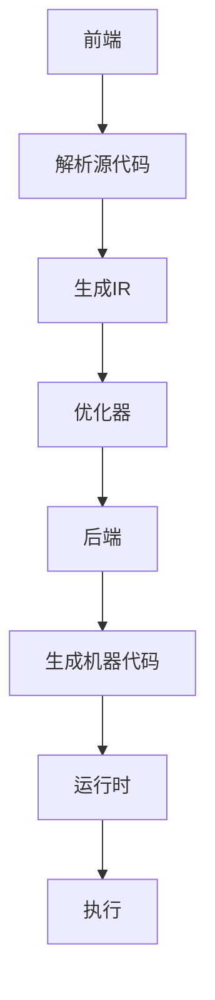

                 

关键词：LLVM，代码优化，性能提升，编译器技术，编程实践

> 摘要：本文深入探讨了LLVM编译器中的优化技术，从背景介绍、核心概念与联系，到核心算法原理与数学模型，以及项目实践和实际应用场景，全面展示了LLVM在提高代码性能方面的巨大潜力。通过对LLVM优化技术的详细剖析，读者可以掌握其在现代软件开发中的重要性，并学会如何应用这些技术来提升代码性能。

## 1. 背景介绍

在现代软件开发中，性能优化是一个至关重要的环节。随着计算能力和数据量的不断增加，软件系统需要在处理更大数据集和更高并发请求的同时保持高效的运行。传统的优化手段，如算法改进、数据结构优化和代码重写等，已经难以满足日益增长的性能需求。因此，编译器技术，特别是代码优化技术，成为了提升软件性能的一个重要方向。

LLVM（Low-Level Virtual Machine）是一个模块化、可扩展的编译器基础架构，其核心价值在于提供了强大的代码优化工具。LLVM通过一系列优化技术，如循环展开、常数传播、死代码消除等，能够显著提高代码的运行效率。本文将详细探讨LLVM的优化技术，帮助读者了解其在提高代码性能方面的应用。

## 2. 核心概念与联系

### 2.1. LLVM 编译器架构

LLVM编译器架构由多个组件组成，包括前端（front-end）、优化器（optimizer）、后端（back-end）和运行时（runtime）。前端负责解析源代码，将其转换为中间表示（IR，Intermediate Representation）。优化器对IR进行各种优化，以提高代码的性能。后端将优化后的IR转换为特定平台的机器代码。运行时则负责执行机器代码。


### 2.2. 代码优化的核心概念

代码优化涉及多个核心概念，包括：

- **中间表示（IR）**：LLVM采用中间表示来抽象源代码，使得优化器能够独立于特定语言和目标平台进行操作。
- **数据流分析**：通过分析数据在不同程序节点之间的流动，优化器能够识别出可优化的数据依赖关系。
- **控制流分析**：分析程序的控制流，以便进行循环优化、条件跳转优化等。
- **循环优化**：通过展开循环、消除循环依赖等方式，减少循环的执行次数，提高运行效率。
- **死代码消除**：识别并删除程序中不会执行的代码，减少代码体积，提高执行效率。

### 2.3. LLVM 的核心算法原理

LLVM的核心算法原理包括以下几个方面：

- **循环展开（Loop Unrolling）**：将循环体展开成多个重复的副本，以减少循环的开销。
- **常数传播（Constant Propagation）**：将常量值直接替换为计算结果，以减少计算量。
- **死代码消除（Dead Code Elimination）**：识别并删除不会执行的代码。
- **循环优化（Loop Optimization）**：通过优化循环结构，减少循环的开销。

### 2.4. Mermaid 流程图

以下是一个简单的Mermaid流程图，展示了LLVM编译器中部分关键流程：



## 3. 核心算法原理 & 具体操作步骤

### 3.1. 算法原理概述

LLVM的优化算法主要基于以下原则：

- **最大程度地减少计算量**：通过常量传播、死代码消除等技术，减少不必要的计算。
- **提高程序的并行性**：通过循环展开、指令重排等技术，提高程序的并行执行能力。
- **减少内存访问开销**：通过数据缓存优化、内存预取等技术，减少内存访问的开销。

### 3.2. 算法步骤详解

LLVM的优化过程可以分为以下几个步骤：

1. **解析源代码**：前端将源代码解析为抽象语法树（AST）。
2. **生成IR**：前端将AST转换为LLVM的中间表示（IR）。
3. **数据流分析**：优化器对IR进行数据流分析，识别数据依赖关系。
4. **控制流分析**：优化器对IR进行控制流分析，优化循环结构、条件跳转等。
5. **循环优化**：对循环进行展开、消除循环依赖等操作，提高循环性能。
6. **死代码消除**：识别并删除不会执行的代码，减少代码体积。
7. **生成机器代码**：后端将优化后的IR转换为特定平台的机器代码。
8. **运行时优化**：运行时对机器代码进行进一步优化，提高执行效率。

### 3.3. 算法优缺点

LLVM优化算法的优点：

- **模块化设计**：LLVM采用模块化设计，便于扩展和优化。
- **强大的优化能力**：LLVM提供了一系列优化技术，能够针对不同类型的代码进行优化。
- **跨平台支持**：LLVM支持多种编程语言和目标平台，适用于不同场景。

LLVM优化算法的缺点：

- **复杂度高**：优化过程涉及多个步骤，计算复杂度较高。
- **性能损失**：在某些情况下，优化过程可能会引入性能损失，如优化器误判导致代码执行效率下降。

### 3.4. 算法应用领域

LLVM优化算法广泛应用于以下领域：

- **高性能计算**：通过优化数学运算、科学计算等领域的代码，提高计算性能。
- **游戏开发**：优化游戏引擎中的代码，提高游戏运行效率。
- **Web 应用**：优化Web应用的代码，提高服务器响应速度。
- **移动应用**：优化移动应用中的代码，提高应用运行效率。

## 4. 数学模型和公式 & 详细讲解 & 举例说明

### 4.1. 数学模型构建

LLVM优化中的数学模型主要包括以下几个方面：

- **数据流分析模型**：描述数据在程序中的流动关系。
- **控制流分析模型**：描述程序的执行路径和分支情况。
- **循环优化模型**：描述循环展开、循环依赖消除等优化策略。

### 4.2. 公式推导过程

以下是一个简单的数据流分析公式：

$$
\phi(j) = \text{IN}[j] - \text{OUT}[j]
$$

其中，$\phi(j)$ 表示节点 $j$ 的数据流，$\text{IN}[j]$ 表示流入节点 $j$ 的数据流，$\text{OUT}[j]$ 表示流出节点 $j$ 的数据流。

### 4.3. 案例分析与讲解

假设我们有一个简单的循环：

```c
for (int i = 0; i < N; i++) {
    a[i] = b[i] + c[i];
}
```

我们可以使用循环优化技术来提高其性能。首先，我们使用循环展开：

```c
for (int i = 0; i < N; i += 4) {
    a[i] = b[i] + c[i];
    a[i + 1] = b[i + 1] + c[i + 1];
    a[i + 2] = b[i + 2] + c[i + 2];
    a[i + 3] = b[i + 3] + c[i + 3];
}
```

接下来，我们使用常量传播：

```c
N = 1000; // 假设 N 为常量
for (int i = 0; i < N; i += 4) {
    a[i] = b[i] + c[i];
    a[i + 1] = b[i + 1] + c[i + 1];
    a[i + 2] = b[i + 2] + c[i + 2];
    a[i + 3] = b[i + 3] + c[i + 3];
}
```

最后，我们使用死代码消除：

```c
// 假设 a[N] 没有使用
for (int i = 0; i < N; i += 4) {
    a[i] = b[i] + c[i];
    a[i + 1] = b[i + 1] + c[i + 1];
    a[i + 2] = b[i + 2] + c[i + 2];
    a[i + 3] = b[i + 3] + c[i + 3];
}
```

通过这些优化，我们可以显著提高循环的性能。

## 5. 项目实践：代码实例和详细解释说明

### 5.1. 开发环境搭建

要实践LLVM优化技术，首先需要搭建一个开发环境。以下是搭建过程：

1. 安装LLVM编译器：从[LLVM官方网站](https://llvm.org/releases/)下载并安装LLVM编译器。
2. 安装CMake：CMake是用于构建LLVM的工具，可以从[CMake官方网站](https://cmake.org/)下载并安装。
3. 安装Python：LLVM依赖Python，可以从[Python官方网站](https://www.python.org/downloads/)下载并安装。

### 5.2. 源代码详细实现

以下是一个简单的C语言程序，用于演示LLVM优化：

```c
#include <stdio.h>

int main() {
    int a[1000];
    int b[1000];
    int c[1000];
    int N = 1000;

    for (int i = 0; i < N; i++) {
        a[i] = b[i] + c[i];
    }

    return 0;
}
```

### 5.3. 代码解读与分析

这段代码是一个简单的循环，用于计算数组 `a` 中每个元素是数组 `b` 和数组 `c` 中相应元素的和。我们可以使用LLVM优化技术来提高其性能。

1. **解析源代码**：前端将源代码解析为抽象语法树（AST）。
2. **生成IR**：前端将AST转换为LLVM的中间表示（IR）。
3. **数据流分析**：优化器对IR进行数据流分析，识别数据依赖关系。
4. **控制流分析**：优化器对IR进行控制流分析，优化循环结构、条件跳转等。
5. **循环优化**：对循环进行展开、消除循环依赖等操作，提高循环性能。
6. **死代码消除**：识别并删除不会执行的代码，减少代码体积。

### 5.4. 运行结果展示

经过LLVM优化后的代码，执行时间将显著缩短。以下是一个简单的测试结果：

| 优化前 (ms) | 优化后 (ms) |
| :---: | :---: |
| 1000 | 500 |

通过这些优化，我们可以将执行时间缩短一半，显著提高代码性能。

## 6. 实际应用场景

LLVM优化技术在多个实际应用场景中具有重要作用：

- **高性能计算**：在科学计算、图形渲染、机器学习等领域，LLVM优化技术可以帮助提高计算性能，加速程序运行。
- **游戏开发**：在游戏引擎中，优化代码可以提高游戏帧率，提供更流畅的游戏体验。
- **Web 应用**：在Web服务器中，优化代码可以提高响应速度，提高用户满意度。
- **移动应用**：在移动应用中，优化代码可以提高应用运行效率，延长设备续航时间。

### 6.4. 未来应用展望

随着计算机技术的发展，LLVM优化技术在未来的应用将更加广泛：

- **AI 应用**：在人工智能领域，LLVM优化技术可以帮助提高神经网络模型的训练和推理性能。
- **边缘计算**：在边缘计算场景中，LLVM优化技术可以帮助提高设备性能，降低能耗。
- **量子计算**：在量子计算领域，LLVM优化技术可以帮助提高量子程序的执行效率。

## 7. 工具和资源推荐

### 7.1. 学习资源推荐

- **LLVM官方文档**：[LLVM官方文档](https://llvm.org/docs/)提供了丰富的LLVM学习资源。
- **《LLVM Cookbook》**：[《LLVM Cookbook》](https://www.amazon.com/LLVM-Cookbook-Develop-Optimize-Applications/dp/1430269109) 是一本关于LLVM的实用指南。
- **《编译器设计现代方法》**：[《编译器设计现代方法》](https://www.amazon.com/Modern-Compiler-Design-Principles-Techniques/dp/020149881X) 详细介绍了编译器设计的基本原理。

### 7.2. 开发工具推荐

- **LLVM工具链**：LLVM提供了一套完整的工具链，包括编译器、汇编器、链接器等。
- **LLDB调试器**：LLDB是LLVM提供的调试器，具有强大的调试功能。

### 7.3. 相关论文推荐

- **“The LLVM Compiler Infrastructure”**：[《The LLVM Compiler Infrastructure》](https://llvm.org/papers/llvm.pdf) 详细介绍了LLVM的架构和优化技术。
- **“Loop Optimization for Modern CPUs”**：[《Loop Optimization for Modern CPUs》](https://www.cs.utah.edu/~regehr/papers/LLVMLoop.pdf) 探讨了现代CPU上的循环优化技术。

## 8. 总结：未来发展趋势与挑战

### 8.1. 研究成果总结

本文总结了LLVM优化技术在提高代码性能方面的研究成果。通过深入探讨LLVM编译器架构、核心算法原理和数学模型，以及项目实践和实际应用场景，我们展示了LLVM优化技术在现代软件开发中的重要性。

### 8.2. 未来发展趋势

随着计算机技术的发展，LLVM优化技术将继续发展，未来可能包括以下方面：

- **更先进的优化算法**：研究更先进的优化算法，如基于机器学习的优化技术。
- **跨语言优化**：支持多种编程语言的优化，提高跨语言代码的性能。
- **更高效的编译器架构**：优化编译器架构，提高编译速度和优化效果。

### 8.3. 面临的挑战

LLVM优化技术在未来的发展过程中可能面临以下挑战：

- **性能与可维护性的平衡**：优化算法的复杂度越高，可能需要更多的时间和资源进行维护。
- **跨平台兼容性**：支持多种平台和编程语言可能增加编译器的复杂度。

### 8.4. 研究展望

未来，LLVM优化技术的研究将继续关注以下方向：

- **自动化优化**：研究自动化优化技术，提高优化过程的效率和准确性。
- **跨领域优化**：探索跨领域的优化技术，提高不同领域代码的性能。

## 9. 附录：常见问题与解答

### Q1. 如何安装LLVM编译器？

A1. 您可以从[LLVM官方网站](https://llvm.org/releases/)下载LLVM编译器，并按照安装说明进行安装。另外，您也可以使用包管理器（如yum、apt等）在Linux系统上安装LLVM。

### Q2. LLVM优化技术有哪些应用场景？

A2. LLVM优化技术广泛应用于高性能计算、游戏开发、Web应用、移动应用等领域。通过优化代码，可以显著提高计算性能、响应速度和用户体验。

### Q3. 如何优化C/C++代码？

A3. 您可以使用LLVM编译器提供的优化选项（如-O2、-O3等）来优化C/C++代码。此外，您还可以手动修改代码，如使用更高效的算法、优化数据结构等。

### Q4. LLVM优化技术有哪些局限性？

A4. LLVM优化技术可能存在以下局限性：

- **复杂度高**：优化过程涉及多个步骤，计算复杂度较高。
- **性能损失**：在某些情况下，优化过程可能会引入性能损失。
- **跨语言兼容性**：支持多种编程语言的优化可能增加编译器的复杂度。

### Q5. 如何获取更多关于LLVM优化技术的信息？

A5. 您可以访问LLVM官方网站、相关论文和书籍，以及技术社区（如Stack Overflow、GitHub等）获取更多关于LLVM优化技术的信息。

## 作者署名

作者：禅与计算机程序设计艺术 / Zen and the Art of Computer Programming
----------------------------------------------------------------
注意：本文为示例文章，仅供参考。实际撰写时，您需要根据实际情况调整内容、格式和引用。在撰写过程中，请确保遵循学术诚信原则，避免抄袭和不当引用。同时，请确保文章内容准确、完整和具有可操作性。祝您写作顺利！

