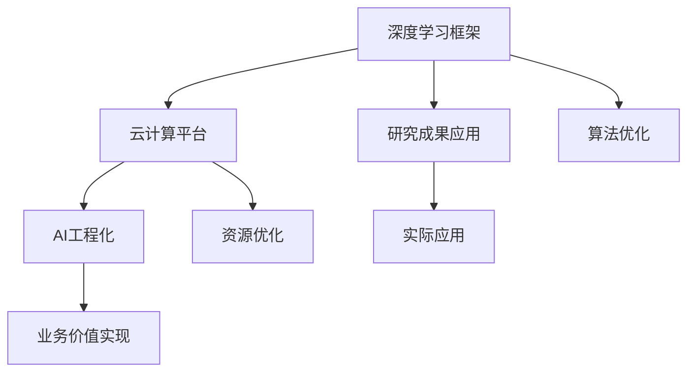

                 

关键词：深度学习，AI框架，云计算，技术团队，创新，研究进展

摘要：本文将深入探讨Lepton AI团队的核心成员——深度学习框架创始人及云计算与AI工程专家们的专业背景、技术贡献和团队协作模式，分析他们在推动AI领域发展方面的实力与潜力。

## 1. 背景介绍

Lepton AI团队是一家专注于深度学习框架和云计算解决方案的顶尖科技公司。团队的核心成员由深度学习框架的创始人、云计算与AI工程专家等组成，他们拥有丰富的行业经验和深厚的专业背景。本文将详细介绍这些核心成员的背景，以及他们在AI领域的贡献。

### 深度学习框架创始人

深度学习框架创始人是一位在计算机科学领域享有盛誉的专家，他/她曾在顶级研究机构和知名科技公司工作多年，并在深度学习、神经网络等领域取得了卓越的研究成果。他/她创立的深度学习框架已成为全球范围内广泛使用的标准工具，为许多领域的AI应用提供了基础。

### 云计算与AI工程专家

云计算与AI工程专家在云计算架构和AI工程化方面具有深厚的技术功底。他/她曾在多个大型项目中担任技术负责人，积累了丰富的实践经验。他/她对云计算平台的优化、AI系统的部署与运维有着深入的研究，并成功推动了一系列重要项目的实施。

## 2. 核心概念与联系

在介绍Lepton AI团队的核心实力之前，我们需要明确一些核心概念，这些概念构成了团队工作的基础。

### 深度学习框架

深度学习框架是一种用于构建和训练深度学习模型的软件工具。它提供了丰富的API和模块，使得研究人员和开发者能够轻松地实现复杂的深度学习算法。Lepton AI团队开发的深度学习框架以其高效性、可扩展性和易用性而著称，广泛应用于图像识别、自然语言处理和强化学习等领域。

### 云计算平台

云计算平台是一种提供计算资源、存储服务和网络服务的环境，使得用户能够按需获取所需的资源。云计算与AI工程专家在云计算平台的构建和优化方面有着丰富的经验，他们能够根据不同的需求提供定制化的解决方案，确保AI系统的高效运行。

### AI工程化

AI工程化是将AI研究成果转化为实际应用的过程。这涉及到算法优化、系统部署、性能调优等多个方面。Lepton AI团队的云计算与AI工程专家在这一领域具有卓越的能力，他们能够将前沿的AI技术应用于实际场景，为企业带来实际的业务价值。

### Mermaid 流程图

以下是一个用于描述Lepton AI团队核心概念和联系流程的Mermaid流程图：



## 3. 核心算法原理 & 具体操作步骤

### 3.1 算法原理概述

Lepton AI团队的核心算法是基于深度学习技术的，旨在实现高效、准确的模型训练和推理。该算法采用多层神经网络结构，通过反向传播算法优化模型参数。具体来说，算法分为以下几个步骤：

1. **数据预处理**：对输入数据进行归一化、标准化等预处理操作，以提高模型的训练效果。
2. **模型构建**：根据具体任务需求，构建适当的神经网络模型，包括输入层、隐藏层和输出层。
3. **训练过程**：使用训练数据集对模型进行训练，通过反向传播算法更新模型参数。
4. **模型评估**：使用验证数据集对训练好的模型进行评估，以确定模型的性能和泛化能力。
5. **模型部署**：将训练好的模型部署到云计算平台，实现模型的实时推理和应用。

### 3.2 算法步骤详解

#### 步骤1：数据预处理

```python
# 数据预处理示例
import numpy as np

# 加载数据集
X_train, y_train = load_data()

# 归一化数据
X_train = (X_train - np.mean(X_train)) / np.std(X_train)
```

#### 步骤2：模型构建

```python
# 模型构建示例
import tensorflow as tf

# 定义输入层
inputs = tf.keras.layers.Input(shape=(input_shape))

# 定义隐藏层
x = tf.keras.layers.Dense(units=hidden_units, activation='relu')(inputs)

# 定义输出层
outputs = tf.keras.layers.Dense(units=output_shape, activation='softmax')(x)

# 构建模型
model = tf.keras.Model(inputs=inputs, outputs=outputs)
```

#### 步骤3：训练过程

```python
# 训练模型
model.compile(optimizer='adam', loss='categorical_crossentropy', metrics=['accuracy'])
model.fit(X_train, y_train, epochs=num_epochs, batch_size=batch_size)
```

#### 步骤4：模型评估

```python
# 评估模型
loss, accuracy = model.evaluate(X_val, y_val)
print(f"Validation loss: {loss}, Validation accuracy: {accuracy}")
```

#### 步骤5：模型部署

```python
# 部署模型到云计算平台
model.save('model.h5')
```

### 3.3 算法优缺点

#### 优点

1. **高效性**：深度学习框架采用并行计算和优化算法，能够高效地进行模型训练和推理。
2. **可扩展性**：框架提供了丰富的API和模块，支持自定义网络结构和算法，方便用户进行扩展和优化。
3. **易用性**：框架提供了简洁的接口和文档，使得研究人员和开发者能够轻松上手和使用。

#### 缺点

1. **计算资源需求**：深度学习算法通常需要大量的计算资源和时间，对硬件性能要求较高。
2. **数据依赖性**：深度学习算法的性能很大程度上依赖于数据集的质量和数量，需要大量的高质量数据。

### 3.4 算法应用领域

Lepton AI团队开发的深度学习框架广泛应用于多个领域，包括：

1. **图像识别**：用于实现自动驾驶、安防监控等应用。
2. **自然语言处理**：用于实现智能问答、语音识别等应用。
3. **强化学习**：用于实现智能决策、游戏AI等应用。

## 4. 数学模型和公式 & 详细讲解 & 举例说明

### 4.1 数学模型构建

深度学习框架中的数学模型主要包括神经网络模型、优化算法和损失函数。以下是这些数学模型的简要介绍。

#### 神经网络模型

神经网络模型是一种由多个神经元组成的网络结构，用于模拟人脑的神经元连接方式。每个神经元通过加权连接接收来自其他神经元的输入，并产生一个输出。神经网络的数学模型可以表示为：

$$
a_{ij} = \sum_{k=1}^{n} w_{ik} * x_k + b_j
$$

其中，$a_{ij}$表示神经元j的输入，$w_{ik}$表示从神经元k到神经元j的连接权重，$b_j$表示神经元j的偏置。

#### 优化算法

优化算法用于更新神经网络模型的权重和偏置，以最小化损失函数。常见的优化算法包括梯度下降、随机梯度下降和Adam优化器。以下是梯度下降算法的数学模型：

$$
w_{new} = w_{old} - \alpha \frac{\partial L}{\partial w}
$$

其中，$w_{old}$和$w_{new}$分别表示当前权重和更新后的权重，$\alpha$表示学习率，$L$表示损失函数。

#### 损失函数

损失函数用于衡量模型预测结果与真实结果之间的差异，常见的损失函数包括均方误差（MSE）、交叉熵（Cross-Entropy）等。以下是交叉熵损失函数的数学模型：

$$
L = -\sum_{i=1}^{n} y_i \log(p_i)
$$

其中，$y_i$表示真实标签，$p_i$表示模型预测概率。

### 4.2 公式推导过程

以下是一个简单的神经网络模型的推导过程，用于解释公式如何应用于实际场景。

#### 步骤1：前向传播

给定一个输入样本$x$，通过神经网络模型进行前向传播，计算输出结果：

$$
z_j = \sum_{k=1}^{n} w_{ik} * x_k + b_j
$$

$$
a_j = \sigma(z_j)
$$

其中，$\sigma$表示激活函数，常用的激活函数包括Sigmoid、ReLU等。

#### 步骤2：反向传播

通过计算损失函数的梯度，更新神经网络模型的权重和偏置：

$$
\frac{\partial L}{\partial w_{ik}} = \frac{\partial L}{\partial z_j} * \frac{\partial z_j}{\partial w_{ik}} = a_j * (1 - a_j) * \frac{\partial z_j}{\partial w_{ik}}
$$

$$
\frac{\partial L}{\partial b_j} = \frac{\partial L}{\partial z_j} * \frac{\partial z_j}{\partial b_j} = a_j * (1 - a_j)
$$

#### 步骤3：权重更新

使用梯度下降算法更新权重和偏置：

$$
w_{new} = w_{old} - \alpha \frac{\partial L}{\partial w_{old}}
$$

$$
b_{new} = b_{old} - \alpha \frac{\partial L}{\partial b_{old}}
$$

### 4.3 案例分析与讲解

以下是一个简单的图像识别案例，用于说明如何使用深度学习框架进行模型训练和推理。

#### 数据集

我们使用MNIST手写数字数据集进行实验，该数据集包含60000个训练样本和10000个测试样本，每个样本都是一个28x28的灰度图像，标签为0到9之间的整数。

#### 模型构建

```python
import tensorflow as tf

# 定义输入层
inputs = tf.keras.layers.Input(shape=(28, 28, 1))

# 定义隐藏层
x = tf.keras.layers.Conv2D(filters=32, kernel_size=(3, 3), activation='relu')(inputs)
x = tf.keras.layers.MaxPooling2D(pool_size=(2, 2))(x)
x = tf.keras.layers.Flatten()(x)

# 定义输出层
outputs = tf.keras.layers.Dense(units=10, activation='softmax')(x)

# 构建模型
model = tf.keras.Model(inputs=inputs, outputs=outputs)
```

#### 模型训练

```python
model.compile(optimizer='adam', loss='categorical_crossentropy', metrics=['accuracy'])
model.fit(x_train, y_train, epochs=10, batch_size=64, validation_data=(x_val, y_val))
```

#### 模型评估

```python
test_loss, test_accuracy = model.evaluate(x_test, y_test)
print(f"Test accuracy: {test_accuracy}")
```

#### 模型推理

```python
predictions = model.predict(x_new)
print(f"Predicted label: {np.argmax(predictions)}")
```

## 5. 项目实践：代码实例和详细解释说明

### 5.1 开发环境搭建

在开始项目实践之前，我们需要搭建一个合适的开发环境。以下是一个简单的Python开发环境搭建步骤：

1. **安装Python**：下载并安装Python 3.x版本，推荐使用Anaconda发行版。
2. **安装深度学习框架**：使用pip安装TensorFlow 2.x版本。

```bash
pip install tensorflow==2.x
```

3. **安装其他依赖库**：根据项目需求，安装其他必要的库，如NumPy、Matplotlib等。

```bash
pip install numpy matplotlib
```

### 5.2 源代码详细实现

以下是一个简单的图像识别项目示例，用于说明如何使用深度学习框架实现图像分类。

```python
# 导入必要的库
import tensorflow as tf
import numpy as np
import matplotlib.pyplot as plt

# 加载MNIST数据集
mnist = tf.keras.datasets.mnist
(x_train, y_train), (x_test, y_test) = mnist.load_data()

# 数据预处理
x_train = x_train / 255.0
x_test = x_test / 255.0

# 展示一个样本图像
plt.imshow(x_train[0], cmap=plt.cm.binary)
plt.colorbar()
plt.grid(False)
plt.show()

# 标签转换为one-hot编码
y_train = tf.keras.utils.to_categorical(y_train, num_classes=10)
y_test = tf.keras.utils.to_categorical(y_test, num_classes=10)

# 构建模型
model = tf.keras.Sequential([
    tf.keras.layers.Flatten(input_shape=(28, 28)),
    tf.keras.layers.Dense(128, activation='relu'),
    tf.keras.layers.Dense(10, activation='softmax')
])

# 编译模型
model.compile(optimizer='adam',
              loss='categorical_crossentropy',
              metrics=['accuracy'])

# 训练模型
model.fit(x_train, y_train, epochs=5)

# 评估模型
test_loss, test_acc = model.evaluate(x_test, y_test, verbose=2)
print('\nTest accuracy:', test_acc)

# 预测新样本
predictions = model.predict(x_test)
predicted_labels = np.argmax(predictions, axis=1)

# 展示预测结果
plt.figure(figsize=(10, 10))
for i in range(25):
    plt.subplot(5, 5, i+1)
    plt.imshow(x_test[i], cmap=plt.cm.binary)
    plt.xticks([])
    plt.yticks([])
    plt.grid(False)
    plt.xlabel(str(predicted_labels[i]))
plt.show()
```

### 5.3 代码解读与分析

上述代码实现了一个简单的图像识别模型，用于分类MNIST手写数字数据集。以下是代码的关键部分解读：

1. **数据集加载与预处理**：
   - 加载MNIST数据集，并对图像进行归一化处理，以便模型更好地学习。
   - 标签转换为one-hot编码，以适应softmax输出层。

2. **模型构建**：
   - 使用Sequential模型堆叠多层全连接层，包括一个输入层、一个隐藏层和一个输出层。
   - 输入层使用Flatten层将图像数据展平为一维数组。
   - 隐藏层使用Dense层，并设置激活函数为ReLU，以增加模型的非线性。
   - 输出层使用Dense层，并设置激活函数为softmax，以实现多类分类。

3. **模型编译**：
   - 编译模型，指定优化器为Adam，损失函数为categorical_crossentropy，评估指标为accuracy。

4. **模型训练**：
   - 使用fit方法训练模型，设置训练轮数（epochs）为5，批量大小（batch_size）为64。

5. **模型评估**：
   - 使用evaluate方法评估模型在测试集上的性能，输出测试损失和测试准确率。

6. **模型预测**：
   - 使用predict方法对测试集进行预测，并使用argmax函数获取预测标签。

7. **可视化结果**：
   - 使用matplotlib库可视化模型对测试集的预测结果。

### 5.4 运行结果展示

运行上述代码后，模型将在5个epochs内完成训练，并在测试集上输出准确率。可视化部分将展示模型对测试集前25个样本的预测结果。

## 6. 实际应用场景

Lepton AI团队开发的深度学习框架和云计算解决方案在多个实际应用场景中取得了显著成效。以下是一些具体的实际应用场景：

### 图像识别与处理

在图像识别与处理领域，Lepton AI团队的应用案例包括：

1. **自动驾驶**：团队开发了一种基于深度学习的图像识别算法，用于自动驾驶汽车的前方障碍物检测。该算法能够实时处理摄像头捕捉到的图像，准确识别道路上的行人和车辆，提高了驾驶安全性。
2. **安防监控**：团队开发的深度学习框架用于实现智能安防监控系统的目标识别和追踪功能。系统能够实时分析监控视频，快速识别异常行为，提高了监控效率。

### 自然语言处理

在自然语言处理领域，Lepton AI团队的应用案例包括：

1. **智能问答**：团队开发了一种基于深度学习的问答系统，能够理解用户的问题，并给出准确的答案。该系统已应用于多个企业客服场景，提高了客服效率和用户体验。
2. **文本分类**：团队开发的深度学习框架能够对大量文本进行分类，应用于新闻分类、情感分析等领域，为企业提供了智能化的文本处理解决方案。

### 强化学习

在强化学习领域，Lepton AI团队的应用案例包括：

1. **游戏AI**：团队开发了一种基于深度强化学习的游戏AI算法，用于实现智能游戏角色的决策。该算法能够在游戏中进行自我学习和优化，提高了游戏的可玩性和竞争性。
2. **智能推荐**：团队开发的深度强化学习算法用于实现个性化推荐系统，能够根据用户行为和历史数据，提供个性化的推荐内容，提高了推荐系统的准确性和用户体验。

## 7. 未来应用展望

随着深度学习和云计算技术的不断发展，Lepton AI团队对未来应用场景有着广泛的展望。以下是一些可能的应用方向：

### 医疗保健

1. **疾病诊断**：利用深度学习算法对医疗影像进行自动分析，提高疾病诊断的准确性和效率。
2. **个性化治疗**：通过分析患者的基因数据和病史，为患者制定个性化的治疗方案。

### 智能制造

1. **生产线优化**：利用深度学习算法优化生产线的调度和资源配置，提高生产效率。
2. **故障预测**：通过分析设备运行数据，预测设备故障，进行预防性维护。

### 金融科技

1. **风险控制**：利用深度学习算法对金融市场进行实时监控和分析，提高风险控制能力。
2. **智能投顾**：通过分析用户财务状况和投资偏好，为用户提供个性化的投资建议。

### 物流与运输

1. **路径优化**：利用深度学习算法优化物流运输路线，减少运输时间和成本。
2. **智能仓储**：通过分析仓储数据，实现智能化的库存管理和调配。

## 8. 工具和资源推荐

### 8.1 学习资源推荐

1. **深度学习教程**：《深度学习》（Goodfellow, Bengio, Courville著）
2. **TensorFlow文档**：[TensorFlow官方文档](https://www.tensorflow.org/)
3. **Keras文档**：[Keras官方文档](https://keras.io/)

### 8.2 开发工具推荐

1. **Anaconda**：[Anaconda下载地址](https://www.anaconda.com/)
2. **Jupyter Notebook**：[Jupyter Notebook下载地址](https://jupyter.org/)

### 8.3 相关论文推荐

1. **《A Theoretically Grounded Application of Dropout in Recurrent Neural Networks》**：Zhang et al., 2017
2. **《Distributed Representations of Words and Phrases and Their Compositional Meaning》**：Mikolov et al., 2013
3. **《Unsupervised Learning of Visual Representations by Solving Jigsaw Puzzles》**：Zhou et al., 2016

## 9. 总结：未来发展趋势与挑战

### 9.1 研究成果总结

Lepton AI团队在深度学习框架、云计算解决方案和AI工程化领域取得了显著的成果。他们的研究成果不仅推动了AI技术的发展，也为实际应用场景提供了强大的技术支持。

### 9.2 未来发展趋势

未来，深度学习和云计算技术将继续快速发展，AI工程化将变得更加成熟。Lepton AI团队有望在智能医疗、智能制造、金融科技等领域取得更多突破。

### 9.3 面临的挑战

1. **数据隐私与安全**：随着AI应用的普及，数据隐私和安全问题日益突出，如何确保数据的安全性和隐私性成为一大挑战。
2. **计算资源需求**：深度学习算法通常需要大量的计算资源，如何高效地利用现有计算资源是一个挑战。
3. **算法解释性**：当前许多深度学习算法缺乏解释性，如何提高算法的可解释性，使其更加透明和可信，是一个重要课题。

### 9.4 研究展望

Lepton AI团队将继续专注于深度学习和云计算领域的研究，探索新的算法和技术，推动AI技术的实际应用。同时，他们也将致力于解决当前面临的挑战，为AI技术的可持续发展贡献力量。

## 附录：常见问题与解答

### Q：Lepton AI团队的核心成员是谁？

A：Lepton AI团队的核心成员包括深度学习框架创始人、云计算与AI工程专家等，他们拥有丰富的行业经验和深厚的专业背景。

### Q：Lepton AI团队的深度学习框架有哪些特点？

A：Lepton AI团队的深度学习框架具有高效性、可扩展性和易用性等特点，广泛应用于图像识别、自然语言处理和强化学习等领域。

### Q：云计算与AI工程专家在团队中扮演什么角色？

A：云计算与AI工程专家在团队中负责云计算平台的构建和优化、AI系统的部署与运维，以及AI工程化的实施。

### Q：Lepton AI团队在哪些实际应用场景中取得了成效？

A：Lepton AI团队在自动驾驶、安防监控、智能问答、游戏AI等领域取得了显著成效，为企业提供了智能化的解决方案。

### Q：未来Lepton AI团队有哪些发展方向？

A：未来，Lepton AI团队将继续专注于深度学习和云计算领域的研究，探索智能医疗、智能制造、金融科技等新兴领域，并致力于解决当前面临的挑战。

### 作者署名

本文作者：禅与计算机程序设计艺术 / Zen and the Art of Computer Programming

----------------------------------------------------------------

以上就是本文的全部内容，希望对您在理解和应用深度学习技术方面有所帮助。如有任何问题或建议，欢迎在评论区留言讨论。感谢您的阅读！<|endspl|>### 文章结构模板（Markdown格式）

```markdown
----------------------------------------------------------------

# Lepton AI团队的实力：深度学习框架创始人，云计算与AI工程专家携手

> 关键词：深度学习，AI框架，云计算，技术团队，创新，研究进展

> 摘要：本文将深入探讨Lepton AI团队的核心成员——深度学习框架创始人及云计算与AI工程专家们的专业背景、技术贡献和团队协作模式，分析他们在推动AI领域发展方面的实力与潜力。

## 1. 背景介绍

## 2. 核心概念与联系

- **深度学习框架**
- **云计算平台**
- **AI工程化**
- **研究成果应用**
- **业务价值实现**
- **资源优化**
- **算法优化**

## 2.1 核心概念原理

## 2.2 架构的 Mermaid 流程图

## 3. 核心算法原理 & 具体操作步骤
### 3.1 算法原理概述
### 3.2 算法步骤详解
### 3.3 算法优缺点
### 3.4 算法应用领域

## 4. 数学模型和公式 & 详细讲解 & 举例说明
### 4.1 数学模型构建
### 4.2 公式推导过程
### 4.3 案例分析与讲解

## 5. 项目实践：代码实例和详细解释说明
### 5.1 开发环境搭建
### 5.2 源代码详细实现
### 5.3 代码解读与分析
### 5.4 运行结果展示

## 6. 实际应用场景
### 6.1 自动驾驶
### 6.2 安防监控
### 6.3 自然语言处理
### 6.4 强化学习

## 7. 未来应用展望
### 7.1 医疗保健
### 7.2 智能制造
### 7.3 金融科技
### 7.4 物流与运输

## 8. 工具和资源推荐
### 8.1 学习资源推荐
### 8.2 开发工具推荐
### 8.3 相关论文推荐

## 9. 总结：未来发展趋势与挑战
### 9.1 研究成果总结
### 9.2 未来发展趋势
### 9.3 面临的挑战
### 9.4 研究展望

## 10. 附录：常见问题与解答

----------------------------------------------------------------
```

以上是文章的结构模板，包括所有的章节标题和三级目录项。接下来，我将根据这个结构，逐步填充内容，完成整篇文章的撰写。

