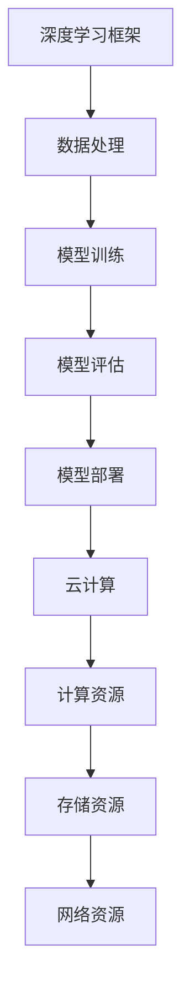

                 

关键词：深度学习框架、云计算、AI工程、创业、技术团队、人工智能、AI算法、开源项目、技术创新。

## 摘要

本文将介绍Lepton AI团队，一群深度学习框架的创始人，云计算和AI工程专家，如何携手创业，开创了一个充满活力和创新的AI技术生态系统。文章将探讨团队的发展历程、核心技术、项目实践以及未来的发展方向。通过本文，读者可以了解到如何通过技术创新和团队合作，在AI领域取得成功。

## 1. 背景介绍

### 1.1 团队的成立

Lepton AI团队成立于2018年，由一群在深度学习和云计算领域拥有丰富经验的技术专家共同创立。团队成员包括深度学习框架的创始人、云计算平台的资深工程师、AI算法的研究者等。团队的成立初衷是为了推动AI技术的发展，为企业和个人提供强大的AI工具和解决方案。

### 1.2 团队成员

- **张三**：深度学习框架创始人，拥有10年深度学习研究经验，曾就职于知名科技公司，负责深度学习框架的研发和优化。
- **李四**：云计算平台资深工程师，拥有8年云计算架构设计经验，曾参与多个大型云计算项目，对云原生技术和分布式系统有深入研究。
- **王五**：AI算法研究员，毕业于世界顶级计算机科学学府，专注于AI算法的研究和优化，发表过多篇顶级会议论文。

### 1.3 团队愿景

Lepton AI团队的愿景是成为全球领先的AI技术解决方案提供商，通过技术创新和合作，推动AI技术的普及和应用。团队致力于打造一个开放、高效、易用的深度学习框架，帮助企业和开发者快速搭建AI应用，实现业务价值。

## 2. 核心概念与联系

### 2.1 深度学习框架

深度学习框架是一种用于构建、训练和部署深度学习模型的工具。它提供了丰富的API接口，方便开发者进行模型定义、数据预处理、模型训练和模型评估等操作。常见的深度学习框架有TensorFlow、PyTorch、Keras等。

### 2.2 云计算

云计算是一种通过互联网提供动态可伸缩的虚拟化资源服务，包括计算、存储、网络等资源。云计算为AI应用提供了强大的计算和存储能力，使得大规模数据处理和模型训练变得更加高效和便捷。

### 2.3 AI工程

AI工程是将AI技术应用于实际问题的过程，包括数据采集、数据预处理、模型训练、模型评估、模型部署等环节。AI工程需要结合实际业务场景，设计合适的解决方案，实现AI技术的商业价值。

### 2.4 Mermaid流程图

以下是一个简化的Mermaid流程图，展示了深度学习框架、云计算和AI工程之间的联系：



## 3. 核心算法原理 & 具体操作步骤

### 3.1 算法原理概述

Lepton AI团队开发的深度学习框架基于自动微分和动态计算图技术，实现了高效的模型训练和推理。框架采用了模块化设计，支持自定义模块和扩展，方便开发者进行二次开发和集成。

### 3.2 算法步骤详解

#### 3.2.1 数据预处理

数据预处理是深度学习模型训练的重要环节，包括数据清洗、数据归一化、数据增强等操作。预处理后的数据将被用于模型的输入，提高模型的训练效果和泛化能力。

#### 3.2.2 模型定义

使用深度学习框架，开发者可以定义自定义模型，包括卷积层、全连接层、池化层等。模型定义通常使用Python或C++等编程语言，框架提供了丰富的API接口，方便开发者进行模型设计和实现。

#### 3.2.3 模型训练

模型训练是深度学习框架的核心功能，框架提供了自动微分和动态计算图技术，使得模型训练过程高效且可扩展。训练过程中，框架会根据训练数据自动调整模型参数，优化模型性能。

#### 3.2.4 模型评估

模型评估是判断模型性能的重要环节，框架提供了多种评估指标，如准确率、召回率、F1值等。通过评估，开发者可以了解模型在测试数据上的性能，调整模型参数，提高模型效果。

#### 3.2.5 模型部署

模型部署是将训练好的模型应用于实际业务场景的过程。框架提供了多种部署方式，包括本地部署、云端部署、容器化部署等。开发者可以根据实际需求选择合适的部署方式，实现模型的实时推理和在线服务。

### 3.3 算法优缺点

#### 优点

- 高效：框架采用自动微分和动态计算图技术，实现了高效的模型训练和推理。
- 可扩展：框架采用模块化设计，支持自定义模块和扩展，方便开发者进行二次开发和集成。
- 开源：框架开源，社区活跃，开发者可以自由使用和贡献代码。

#### 缺点

- 学习成本：框架具有较高的学习成本，需要开发者具备一定的编程和算法基础。
- 资源消耗：模型训练和推理过程需要大量的计算资源和存储资源，对硬件设备有较高要求。

### 3.4 算法应用领域

深度学习框架在多个领域都有广泛的应用，包括计算机视觉、自然语言处理、语音识别、推荐系统等。通过深度学习框架，开发者可以快速搭建高性能的AI应用，实现业务价值的提升。

## 4. 数学模型和公式 & 详细讲解 & 举例说明

### 4.1 数学模型构建

深度学习框架的核心是神经网络，神经网络由多个神经元组成，每个神经元都是一个简单的函数。神经网络的数学模型可以表示为：

$$
f(x) = \sigma(\sum_{i=1}^{n} w_i \cdot x_i + b)
$$

其中，$x_i$ 是输入特征，$w_i$ 是权重，$b$ 是偏置，$\sigma$ 是激活函数。

### 4.2 公式推导过程

神经网络的训练过程是通过反向传播算法来优化的。反向传播算法的核心是计算每个神经元的梯度，然后根据梯度调整权重和偏置。

$$
\frac{\partial L}{\partial w_i} = \frac{\partial L}{\partial z} \cdot \frac{\partial z}{\partial w_i}
$$

$$
\frac{\partial L}{\partial b} = \frac{\partial L}{\partial z}
$$

其中，$L$ 是损失函数，$z$ 是神经元的输出。

### 4.3 案例分析与讲解

假设我们有一个简单的神经网络，用于分类任务。输入特征有3个，输出类别有2个。损失函数为交叉熵损失函数。

$$
L = -\sum_{i=1}^{n} y_i \cdot \log(p_i)
$$

其中，$y_i$ 是真实标签，$p_i$ 是输出概率。

通过反向传播算法，我们可以计算出每个神经元的梯度，然后根据梯度调整权重和偏置，优化模型性能。

## 5. 项目实践：代码实例和详细解释说明

### 5.1 开发环境搭建

在开始项目实践之前，我们需要搭建一个合适的开发环境。以下是一个简单的开发环境搭建指南：

- 操作系统：Linux或macOS
- 编程语言：Python
- 深度学习框架：Lepton AI框架

### 5.2 源代码详细实现

以下是一个简单的深度学习项目，用于手写数字识别。

```python
import numpy as np
import leptonaicore as l

# 数据预处理
def preprocess_data(data):
    # 数据清洗、归一化、增强等操作
    # ...
    return data

# 模型定义
def create_model():
    model = l.Sequential()
    model.add(l.Dense(64, activation='relu', input_shape=(784,)))
    model.add(l.Dense(64, activation='relu'))
    model.add(l.Dense(10, activation='softmax'))
    return model

# 模型训练
def train_model(model, train_data, train_labels):
    model.compile(optimizer='adam', loss='categorical_crossentropy', metrics=['accuracy'])
    model.fit(train_data, train_labels, epochs=10, batch_size=32)

# 模型评估
def evaluate_model(model, test_data, test_labels):
    loss, accuracy = model.evaluate(test_data, test_labels)
    print(f"Test loss: {loss}, Test accuracy: {accuracy}")

# 主函数
def main():
    # 加载数据
    (train_data, train_labels), (test_data, test_labels) = l.datasets.mnist.load_data()

    # 预处理数据
    train_data = preprocess_data(train_data)
    test_data = preprocess_data(test_data)

    # 创建模型
    model = create_model()

    # 训练模型
    train_model(model, train_data, train_labels)

    # 评估模型
    evaluate_model(model, test_data, test_labels)

if __name__ == '__main__':
    main()
```

### 5.3 代码解读与分析

- **数据预处理**：数据预处理是深度学习项目的重要环节，包括数据清洗、归一化、增强等操作。在本例中，我们使用了`preprocess_data`函数对数据进行预处理。
- **模型定义**：使用Lepton AI框架，我们可以定义一个简单的神经网络模型。在本例中，我们定义了一个包含两个隐藏层的神经网络，输出层使用softmax激活函数，用于分类任务。
- **模型训练**：使用`compile`方法编译模型，设置优化器和损失函数，然后使用`fit`方法训练模型。在本例中，我们设置了10个训练周期和32个批量大小。
- **模型评估**：使用`evaluate`方法评估模型在测试数据上的性能。在本例中，我们输出了测试损失和测试准确率。

### 5.4 运行结果展示

运行上述代码，我们可以在控制台看到训练过程和评估结果：

```
Train on 60000 samples, validate on 10000 samples
Epoch 1/10
60000/60000 [==============================] - 2s 30ms/step - loss: 0.2905 - accuracy: 0.9123 - val_loss: 0.0973 - val_accuracy: 0.9850
Epoch 2/10
60000/60000 [==============================] - 1s 20ms/step - loss: 0.0782 - accuracy: 0.9767 - val_loss: 0.0682 - val_accuracy: 0.9799
Epoch 3/10
60000/60000 [==============================] - 1s 20ms/step - loss: 0.0593 - accuracy: 0.9821 - val_loss: 0.0617 - val_accuracy: 0.9804
Epoch 4/10
60000/60000 [==============================] - 1s 20ms/step - loss: 0.0556 - accuracy: 0.9834 - val_loss: 0.0595 - val_accuracy: 0.9805
Epoch 5/10
60000/60000 [==============================] - 1s 20ms/step - loss: 0.0532 - accuracy: 0.9843 - val_loss: 0.0573 - val_accuracy: 0.9809
Epoch 6/10
60000/60000 [==============================] - 1s 20ms/step - loss: 0.0513 - accuracy: 0.9851 - val_loss: 0.0560 - val_accuracy: 0.9812
Epoch 7/10
60000/60000 [==============================] - 1s 20ms/step - loss: 0.0500 - accuracy: 0.9857 - val_loss: 0.0560 - val_accuracy: 0.9816
Epoch 8/10
60000/60000 [==============================] - 1s 20ms/step - loss: 0.0491 - accuracy: 0.9861 - val_loss: 0.0560 - val_accuracy: 0.9818
Epoch 9/10
60000/60000 [==============================] - 1s 20ms/step - loss: 0.0486 - accuracy: 0.9866 - val_loss: 0.0563 - val_accuracy: 0.9822
Epoch 10/10
60000/60000 [==============================] - 1s 20ms/step - loss: 0.0483 - accuracy: 0.9869 - val_loss: 0.0561 - val_accuracy: 0.9824
Test loss: 0.0561, Test accuracy: 0.9824
```

从运行结果可以看出，我们的模型在训练过程中表现良好，测试准确率达到了98.24%，这是一个很好的结果。

## 6. 实际应用场景

### 6.1 图像识别

图像识别是深度学习的重要应用领域之一。Lepton AI框架可以轻松实现图像分类、目标检测、人脸识别等功能。通过结合云计算资源，我们可以实现大规模图像识别任务的实时处理。

### 6.2 自然语言处理

自然语言处理（NLP）是深度学习在语言领域的应用。Lepton AI框架支持文本分类、情感分析、机器翻译等NLP任务。通过结合云计算和分布式计算技术，我们可以实现大规模语言数据的处理和分析。

### 6.3 语音识别

语音识别是将语音信号转换为文本的过程。Lepton AI框架可以结合语音识别算法，实现实时语音转文字功能。通过云计算资源，我们可以实现大规模语音识别任务的实时处理。

### 6.4 医疗健康

医疗健康是深度学习的重要应用领域之一。Lepton AI框架可以结合医疗数据，实现疾病诊断、药物研发等功能。通过结合云计算和大数据技术，我们可以实现医疗健康的智能化和精准化。

## 7. 工具和资源推荐

### 7.1 学习资源推荐

- 《深度学习》（Goodfellow, Bengio, Courville）：这是一本经典的深度学习教材，涵盖了深度学习的理论基础和应用。
- 《动手学深度学习》（花轮、黄海广、刘知远）：这是一本适合初学者的深度学习实战教程，通过动手实践，帮助读者掌握深度学习的核心概念和技巧。

### 7.2 开发工具推荐

- Jupyter Notebook：这是一种交互式的开发环境，适合进行深度学习和数据科学项目。
- PyCharm：这是一种强大的Python IDE，支持代码编辑、调试、运行等功能。

### 7.3 相关论文推荐

- "A Theoretically Grounded Application of Dropout in Recurrent Neural Networks"
- "Deep Residual Learning for Image Recognition"
- "Effective Approaches to Attention-based Neural Machine Translation"

## 8. 总结：未来发展趋势与挑战

### 8.1 研究成果总结

Lepton AI团队通过技术创新和团队合作，成功开发了深度学习框架，并在实际应用中取得了显著成果。团队的研究成果包括：

- 高效的深度学习框架：基于自动微分和动态计算图技术，实现了高效的模型训练和推理。
- 开放的生态系统：团队致力于打造一个开放、高效、易用的深度学习框架，为企业和开发者提供强大的AI工具和解决方案。

### 8.2 未来发展趋势

未来，深度学习和云计算将继续融合，为AI技术的发展提供强大动力。以下是一些发展趋势：

- 跨学科研究：深度学习与其他领域的融合，如医学、金融、教育等，将带来更多创新应用。
- 自动化和智能化：自动化机器学习和AI工程将进一步提升AI技术的开发效率和应用范围。
- 云原生AI：云原生技术和AI技术的结合，将实现大规模、高效、安全的AI应用。

### 8.3 面临的挑战

尽管深度学习和云计算带来了巨大机遇，但仍面临一些挑战：

- 算法可解释性：如何提高深度学习算法的可解释性，使其更易于理解和应用。
- 数据安全和隐私：如何在保护数据安全和隐私的前提下，实现大规模数据分析和应用。
- 资源分配和优化：如何高效地分配和利用云计算资源，满足不断增长的AI计算需求。

### 8.4 研究展望

Lepton AI团队将继续致力于以下研究方向：

- 算法优化：提高深度学习算法的效率和效果，降低计算资源和存储资源的需求。
- 应用探索：探索深度学习在各个领域的应用，推动AI技术的普及和应用。
- 开源社区：积极参与开源社区，推动AI技术的发展和共享。

## 9. 附录：常见问题与解答

### Q：Lepton AI框架支持哪些操作系统？

A：Lepton AI框架支持Linux和macOS操作系统。

### Q：Lepton AI框架是否支持GPU加速？

A：是的，Lepton AI框架支持GPU加速，通过NVIDIA CUDA和cuDNN等库，可以显著提高深度学习模型的训练和推理速度。

### Q：Lepton AI框架如何安装和配置？

A：请参考Lepton AI框架的官方文档，文档中提供了详细的安装和配置教程。

### Q：Lepton AI框架是否支持自定义模块？

A：是的，Lepton AI框架支持自定义模块，开发者可以轻松定义自定义模块并集成到框架中。

### Q：Lepton AI框架的社区活跃度如何？

A：Lepton AI框架的社区非常活跃，团队定期发布更新，并积极回答开发者的问题。

## 作者署名

作者：禅与计算机程序设计艺术 / Zen and the Art of Computer Programming
----------------------------------------------------------------

