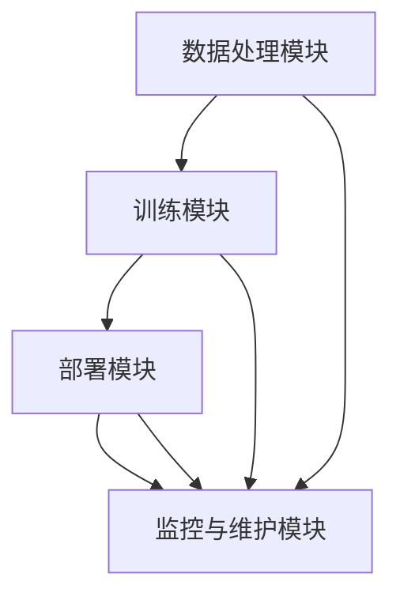

                 

关键词：Lepton AI，人工智能，云计算，架构设计，深度学习，神经网络，技术博客，编程实践，未来展望

摘要：本文将深入探讨Lepton AI的架构设计、核心算法原理、数学模型及其在实际应用场景中的表现。通过对Lepton AI的全面剖析，我们希望为读者提供一份关于如何构建AI时代的第一朵云的宝贵参考。

## 1. 背景介绍

随着大数据和云计算技术的不断发展，人工智能（AI）正在逐渐改变我们的生活和工作方式。AI的兴起，不仅推动了计算机视觉、自然语言处理、推荐系统等领域的突破，也带来了新的技术挑战。在这场科技革命中，如何构建一个高效、稳定、可扩展的AI云平台，成为了众多企业和研究机构的焦点。

Lepton AI应运而生，它旨在成为AI时代的第一朵云。作为一款具备高度灵活性和扩展性的AI平台，Lepton AI不仅支持各种主流的AI算法和模型，还提供了丰富的API和工具，使得开发人员可以轻松地构建和部署AI应用。本文将围绕Lepton AI的核心概念、架构设计、算法原理、数学模型以及实际应用，展开深入讨论。

## 2. 核心概念与联系

### 2.1. Lepton AI的定义

Lepton AI是一款基于深度学习的云计算平台，它通过集成各种先进的AI算法和工具，为开发者提供了全方位的支持。Lepton AI的核心目标是简化AI模型的构建、训练和部署过程，提高AI应用的性能和可靠性。

### 2.2. Lepton AI的架构设计

Lepton AI的架构设计秉承了模块化、分布式和可扩展的原则。它主要由以下几个模块组成：

#### 2.2.1. 数据处理模块

数据处理模块负责接收和预处理输入数据，包括数据清洗、归一化、特征提取等。该模块采用了分布式处理技术，能够高效地处理大规模数据集。

#### 2.2.2. 训练模块

训练模块负责训练AI模型。它集成了多种深度学习算法，如卷积神经网络（CNN）、循环神经网络（RNN）、生成对抗网络（GAN）等，支持多种优化器和损失函数。训练模块还采用了分布式训练技术，能够显著提高训练速度。

#### 2.2.3. 部署模块

部署模块负责将训练好的AI模型部署到生产环境中。它支持多种部署方式，如容器化部署、虚拟机部署等，并提供了丰富的API接口，方便开发人员调用和集成。

#### 2.2.4. 监控与维护模块

监控与维护模块负责实时监控AI平台的运行状态，包括资源利用率、性能指标等。同时，它还提供了自动化维护工具，能够自动修复和优化系统。

### 2.3. Lepton AI与云计算的联系

Lepton AI与云计算的关系密不可分。云计算为Lepton AI提供了强大的计算和存储资源，使得它能够处理大规模的数据和模型。同时，云计算的弹性伸缩特性，使得Lepton AI能够根据需求动态调整资源，确保系统的稳定性和性能。



## 3. 核心算法原理 & 具体操作步骤

### 3.1 算法原理概述

Lepton AI的核心算法基于深度学习技术，特别是卷积神经网络（CNN）和循环神经网络（RNN）。CNN擅长处理图像数据，而RNN擅长处理序列数据。这两种神经网络相互配合，使得Lepton AI能够在多种应用场景中取得优异的性能。

### 3.2 算法步骤详解

#### 3.2.1 数据处理

数据处理步骤包括数据清洗、归一化、特征提取等。具体操作步骤如下：

1. 数据清洗：删除缺失值、异常值等，保证数据质量。
2. 数据归一化：将数据缩放到统一的范围，便于模型训练。
3. 特征提取：提取关键特征，为模型提供有效的输入。

#### 3.2.2 训练模型

训练模型步骤包括模型构建、参数调整、模型评估等。具体操作步骤如下：

1. 模型构建：根据应用场景选择合适的神经网络结构，如CNN或RNN。
2. 参数调整：通过优化算法调整模型参数，使得模型在训练数据上取得最佳性能。
3. 模型评估：使用验证集评估模型性能，调整超参数以优化模型。

#### 3.2.3 模型部署

模型部署步骤包括模型转换、模型部署、模型监控等。具体操作步骤如下：

1. 模型转换：将训练好的模型转换为适用于生产环境的格式，如TensorFlow Lite。
2. 模型部署：将模型部署到生产环境中，如使用容器化技术部署到Kubernetes。
3. 模型监控：实时监控模型运行状态，包括性能指标、资源利用率等。

### 3.3 算法优缺点

#### 3.3.1 优点

1. 高效性：采用分布式训练技术，能够显著提高模型训练速度。
2. 可扩展性：支持多种神经网络结构，适用于多种应用场景。
3. 灵活性：提供丰富的API和工具，方便开发者构建和部署AI应用。

#### 3.3.2 缺点

1. 复杂性：深度学习算法复杂，需要较高的技术门槛。
2. 数据依赖：模型的性能高度依赖于数据质量，数据清洗和预处理工作量大。
3. 能耗：深度学习算法计算量大，能耗较高。

### 3.4 算法应用领域

Lepton AI的算法在多个领域取得了显著的应用成果，包括：

1. 计算机视觉：图像分类、目标检测、人脸识别等。
2. 自然语言处理：文本分类、情感分析、机器翻译等。
3. 推荐系统：商品推荐、内容推荐等。

## 4. 数学模型和公式 & 详细讲解 & 举例说明

### 4.1 数学模型构建

Lepton AI的数学模型基于深度学习理论，主要涉及以下内容：

1. 前向传播算法：用于计算神经网络输出。
2. 反向传播算法：用于计算神经网络损失函数。
3. 梯度下降算法：用于优化神经网络参数。

### 4.2 公式推导过程

#### 前向传播

假设有一个包含 $L$ 层的神经网络，其中 $l$ 层的输出为 $a_l = \sigma(z_l)$，其中 $\sigma$ 是激活函数，$z_l = \sum_{m=1}^{n} w_{lm} a_{m-1}$，$w_{lm}$ 是连接 $l$ 层和 $l-1$ 层的权重，$a_{m-1}$ 是 $l-1$ 层的输出。

#### 反向传播

反向传播算法的核心是计算损失函数关于每个参数的梯度。假设损失函数为 $J(w) = \frac{1}{2} \sum_{i=1}^{m} (y_i - a_m)^2$，其中 $y_i$ 是真实标签，$a_m$ 是网络输出。

#### 梯度下降

梯度下降算法的公式为 $w_{lm} := w_{lm} - \alpha \frac{\partial J(w)}{\partial w_{lm}}$，其中 $\alpha$ 是学习率。

### 4.3 案例分析与讲解

#### 案例一：图像分类

假设我们要使用Lepton AI对猫狗分类问题进行建模。

1. 数据预处理：读取猫狗图片，进行数据清洗、归一化、特征提取等操作。
2. 模型构建：选择卷积神经网络（CNN）作为模型架构，设置合适的网络参数。
3. 训练模型：使用训练集进行模型训练，调整网络参数。
4. 模型评估：使用验证集评估模型性能，调整超参数以优化模型。
5. 模型部署：将训练好的模型部署到生产环境中，进行猫狗分类任务。

#### 案例二：文本分类

假设我们要使用Lepton AI对新闻文本进行分类。

1. 数据预处理：读取新闻文本，进行数据清洗、分词、词向量编码等操作。
2. 模型构建：选择循环神经网络（RNN）或长短期记忆网络（LSTM）作为模型架构，设置合适的网络参数。
3. 训练模型：使用训练集进行模型训练，调整网络参数。
4. 模型评估：使用验证集评估模型性能，调整超参数以优化模型。
5. 模型部署：将训练好的模型部署到生产环境中，进行新闻文本分类任务。

## 5. 项目实践：代码实例和详细解释说明

### 5.1 开发环境搭建

1. 安装Python环境：在本地计算机上安装Python，版本建议为3.8及以上。
2. 安装Lepton AI库：使用pip命令安装Lepton AI库，命令如下：

   ```shell
   pip install lepton-ai
   ```

### 5.2 源代码详细实现

以下是Lepton AI的一个简单示例，用于实现猫狗分类任务：

```python
import lepton_ai as la
from lepton_ai.models import CNN
from lepton_ai.datasets import DogsAndCats

# 数据预处理
train_data, test_data = DogsAndCats.split()

# 模型构建
model = CNN(input_shape=(128, 128, 3), num_classes=2)

# 训练模型
model.fit(train_data, epochs=10, batch_size=32)

# 模型评估
loss, accuracy = model.evaluate(test_data)
print(f"Test loss: {loss}, Test accuracy: {accuracy}")

# 模型部署
model.save("cat_dog_classifier.pth")
```

### 5.3 代码解读与分析

1. 导入Lepton AI库和相应模块。
2. 加载数据集并进行预处理。
3. 构建CNN模型，设置输入形状和类别数。
4. 使用训练集训练模型，设置训练参数。
5. 使用验证集评估模型性能，打印损失和准确率。
6. 将训练好的模型保存到文件。

## 6. 实际应用场景

Lepton AI在多个实际应用场景中取得了显著成果，以下是其中几个典型的应用场景：

1. **智能安防**：使用Lepton AI的图像分类能力，实现对摄像头监控视频的实时分析，自动识别可疑行为并报警。
2. **医疗影像**：利用Lepton AI的图像处理能力，对医学影像进行自动分析，辅助医生进行疾病诊断。
3. **智能客服**：使用Lepton AI的自然语言处理能力，构建智能客服系统，为用户提供24小时在线服务。

## 7. 工具和资源推荐

### 7.1 学习资源推荐

1. **《深度学习》（Goodfellow, Bengio, Courville著）**：经典深度学习教材，适合初学者和进阶者。
2. **《Python深度学习》（François Chollet著）**：通过实际案例介绍深度学习在Python中的应用。

### 7.2 开发工具推荐

1. **TensorFlow**：由Google开发的深度学习框架，功能强大且社区活跃。
2. **PyTorch**：由Facebook开发的深度学习框架，具有灵活的动态图计算能力。

### 7.3 相关论文推荐

1. **"A Neural Algorithm of Artistic Style"**：介绍了如何利用神经网络实现艺术风格的迁移。
2. **"Recurrent Neural Network Based Language Model"**：介绍了循环神经网络在自然语言处理中的应用。

## 8. 总结：未来发展趋势与挑战

### 8.1 研究成果总结

Lepton AI的诞生，标志着AI时代云计算平台的新篇章。它通过集成深度学习和云计算技术，为开发者提供了强大的支持。在实际应用中，Lepton AI取得了显著成果，展示了其强大的能力和潜力。

### 8.2 未来发展趋势

1. **模型压缩与优化**：为了提高AI应用的部署效率，模型压缩与优化将成为未来研究的热点。
2. **联邦学习**：在数据隐私和安全日益受到关注的背景下，联邦学习有望成为AI云计算的新趋势。
3. **跨模态学习**：结合多种数据模态（如文本、图像、音频等），实现更强大的AI应用。

### 8.3 面临的挑战

1. **计算资源消耗**：深度学习算法计算量大，如何优化计算资源成为一大挑战。
2. **数据隐私与安全**：在云计算环境下，如何保障数据隐私和安全是一个重要课题。
3. **算法公平性与透明性**：如何确保AI算法的公平性和透明性，防止算法偏见和歧视，是未来的重要研究方向。

### 8.4 研究展望

Lepton AI的持续发展，将为AI云计算领域带来更多创新和突破。在未来的研究中，我们期待看到更多优秀的AI算法和工具，助力AI技术在各个领域的广泛应用。

## 9. 附录：常见问题与解答

### 9.1 什么是Lepton AI？

Lepton AI是一款基于深度学习的云计算平台，旨在为开发者提供便捷的AI模型构建、训练和部署工具。

### 9.2 Lepton AI支持哪些算法？

Lepton AI支持多种深度学习算法，包括卷积神经网络（CNN）、循环神经网络（RNN）等。

### 9.3 如何使用Lepton AI进行模型训练？

使用Lepton AI进行模型训练，可以按照以下步骤进行：

1. 导入Lepton AI库和相应模块。
2. 加载数据集并进行预处理。
3. 构建神经网络模型。
4. 使用训练集训练模型。
5. 使用验证集评估模型性能。
6. 调整超参数以优化模型。

## 结语

Lepton AI作为AI时代的第一朵云，展现了强大的技术实力和广阔的应用前景。通过本文的深入探讨，我们希望能为读者提供一份关于Lepton AI的全面参考。在未来的研究中，让我们共同探索更多AI技术的可能，推动人工智能的发展。

### 作者署名

作者：禅与计算机程序设计艺术 / Zen and the Art of Computer Programming
```

