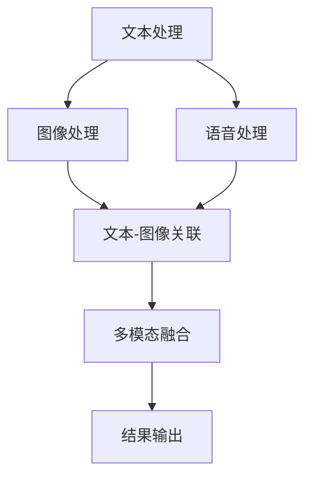
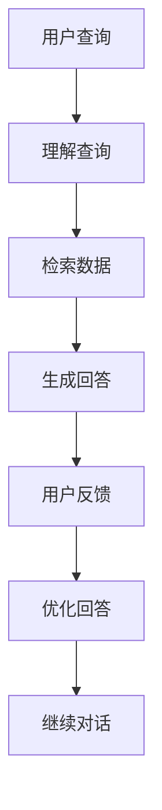
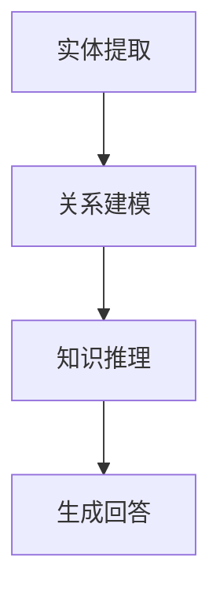
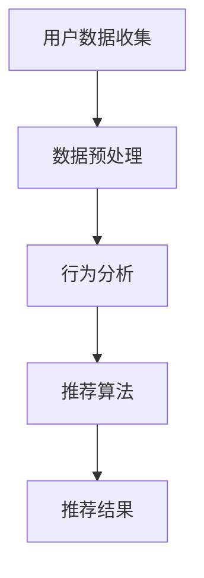

                 

关键词：Lepton Search、贾扬清、对话式搜索引擎、人工智能、搜索算法、架构设计、数学模型

摘要：本文将深入探讨贾扬清团队最新研发的Lepton Search——一款创新的对话式搜索引擎。文章首先介绍了Lepton Search的背景和重要性，随后详细分析了其核心概念与联系，包括算法原理、具体操作步骤、优缺点及其应用领域。接着，我们通过数学模型和公式的讲解，结合实际项目实践代码实例，展示了如何实现和优化Lepton Search。最后，本文探讨了Lepton Search的实际应用场景，未来应用展望，以及可能面临的挑战和未来研究方向。

## 1. 背景介绍

搜索引擎作为互联网的核心组件，为用户提供了便捷的信息检索服务。然而，传统的搜索引擎在处理复杂查询和提供高质量回答方面仍存在诸多不足。随着人工智能技术的迅猛发展，如何结合深度学习和自然语言处理技术，实现更智能、更高效的对话式搜索引擎，成为当前研究的热点。

贾扬清团队作为人工智能领域的杰出代表，长期致力于搜索算法和自然语言处理技术的研究。他们在深度学习、神经网络、信息检索等领域积累了丰富的经验，并在多项国际竞赛中取得了优异成绩。此次，贾扬清团队推出的Lepton Search，旨在打破传统搜索引擎的局限，为用户提供更加智能、自然的对话体验。

Lepton Search的核心目标是在海量数据中快速、准确地找到用户感兴趣的信息，并生成高质量的回答。其创新点主要体现在以下几个方面：

1. **多模态数据处理**：Lepton Search能够处理多种数据类型，如文本、图像、语音等，从而实现更广泛的信息获取。

2. **对话式交互**：与传统搜索引擎的查询式交互不同，Lepton Search采用对话式交互方式，通过与用户的持续对话，不断优化搜索结果，提高用户体验。

3. **知识图谱**：Lepton Search利用知识图谱技术，将用户查询与实体关系进行关联，提供更加精准的回答。

4. **个性化推荐**：基于用户的查询历史和行为数据，Lepton Search能够为用户提供个性化的信息推荐，提高用户满意度。

## 2. 核心概念与联系

### 2.1 多模态数据处理

多模态数据处理是Lepton Search的核心技术之一。它涉及到将多种数据类型进行统一处理，从而提高搜索结果的准确性和多样性。

**流程图：**


### 2.2 对话式交互

对话式交互是Lepton Search的另一个核心概念。它通过持续与用户的对话，了解用户的需求，提供个性化的搜索结果。

**流程图：**


### 2.3 知识图谱

知识图谱技术是Lepton Search的重要组成部分。它通过将实体关系进行建模，为用户提供更加精准的回答。

**流程图：**


### 2.4 个性化推荐

个性化推荐技术是Lepton Search提高用户体验的关键。它通过分析用户的查询历史和行为数据，为用户提供个性化的信息推荐。

**流程图：**


## 3. 核心算法原理 & 具体操作步骤

### 3.1 算法原理概述

Lepton Search的核心算法主要包括以下几个部分：

1. **多模态数据处理**：利用深度学习技术，对文本、图像、语音等多模态数据进行处理，实现数据融合和特征提取。

2. **对话式交互**：采用序列到序列（Seq2Seq）模型，实现自然语言处理和对话生成。

3. **知识图谱**：基于图神经网络（Graph Neural Network，GNN）进行知识图谱构建和推理。

4. **个性化推荐**：采用协同过滤（Collaborative Filtering，CF）算法，实现个性化信息推荐。

### 3.2 算法步骤详解

#### 3.2.1 多模态数据处理

1. **数据收集**：从互联网、数据库等多渠道收集文本、图像、语音等多模态数据。

2. **数据预处理**：对数据进行清洗、去噪、标准化等处理，确保数据质量。

3. **特征提取**：利用深度学习技术，对多模态数据进行特征提取，如文本使用词向量表示，图像使用卷积神经网络（CNN）提取特征，语音使用循环神经网络（RNN）提取特征。

4. **数据融合**：将不同模态的特征进行融合，如使用多层感知机（MLP）进行特征融合。

#### 3.2.2 对话式交互

1. **编码器**：使用Seq2Seq模型中的编码器，对用户查询进行编码，提取查询的特征表示。

2. **解码器**：使用解码器，根据编码器的特征表示，生成自然语言回答。

3. **优化**：通过对抗训练（Adversarial Training）和注意力机制（Attention Mechanism），优化解码器的生成效果。

#### 3.2.3 知识图谱

1. **实体提取**：从文本数据中提取实体，如人名、地点、组织等。

2. **关系建模**：利用图神经网络，将实体及其关系进行建模。

3. **推理**：通过知识图谱进行推理，为用户提供精准的回答。

#### 3.2.4 个性化推荐

1. **用户数据收集**：收集用户的历史查询数据、行为数据等。

2. **行为分析**：分析用户的查询行为，提取用户兴趣。

3. **推荐算法**：采用协同过滤算法，生成个性化推荐结果。

### 3.3 算法优缺点

#### 优点：

1. **多模态数据处理**：能够处理多种数据类型，提高搜索结果的准确性。

2. **对话式交互**：提供自然、流畅的对话体验，提高用户体验。

3. **知识图谱**：通过知识图谱技术，实现精准回答。

4. **个性化推荐**：根据用户兴趣，提供个性化推荐，提高用户满意度。

#### 缺点：

1. **计算资源消耗**：多模态数据处理和知识图谱构建需要大量计算资源。

2. **训练时间较长**：深度学习模型的训练时间较长，影响上线速度。

3. **数据隐私**：收集用户数据可能涉及隐私问题。

### 3.4 算法应用领域

Lepton Search的应用领域非常广泛，包括但不限于：

1. **智能问答系统**：如智能客服、智能助手等。

2. **信息检索**：在互联网、数据库等场景中，提供高效、准确的搜索服务。

3. **个性化推荐**：在电子商务、社交媒体等场景中，为用户提供个性化推荐。

4. **知识图谱构建**：在金融、医疗、教育等领域，构建行业知识图谱。

## 4. 数学模型和公式 & 详细讲解 & 举例说明

### 4.1 数学模型构建

Lepton Search的数学模型主要包括以下几个方面：

1. **多模态数据处理**：采用卷积神经网络（CNN）和循环神经网络（RNN）对多模态数据进行处理。

2. **对话式交互**：采用序列到序列（Seq2Seq）模型进行对话生成。

3. **知识图谱**：采用图神经网络（GNN）进行知识图谱构建。

4. **个性化推荐**：采用协同过滤（CF）算法进行个性化推荐。

### 4.2 公式推导过程

#### 4.2.1 多模态数据处理

1. **卷积神经网络（CNN）**：

$$
\text{output} = \text{ReLU}(\text{weight} \cdot \text{input} + \text{bias})
$$

其中，$\text{ReLU}$表示ReLU激活函数，$\text{weight}$和$\text{bias}$分别为权重和偏置。

2. **循环神经网络（RNN）**：

$$
h_t = \text{sigmoid}(\text{weight}_h \cdot [h_{t-1}, x_t] + \text{bias}_h)
$$

其中，$\text{sigmoid}$表示sigmoid激活函数，$\text{weight}_h$和$\text{bias}_h$分别为权重和偏置。

#### 4.2.2 对话式交互

1. **编码器（Encoder）**：

$$
e_t = \text{softmax}(\text{weight}_e \cdot e_{t-1} + \text{bias}_e)
$$

其中，$\text{softmax}$表示softmax激活函数，$\text{weight}_e$和$\text{bias}_e$分别为权重和偏置。

2. **解码器（Decoder）**：

$$
p_t = \text{softmax}(\text{weight}_p \cdot p_{t-1} + \text{bias}_p)
$$

其中，$\text{softmax}$表示softmax激活函数，$\text{weight}_p$和$\text{bias}_p$分别为权重和偏置。

#### 4.2.3 知识图谱

1. **图神经网络（GNN）**：

$$
\text{output}_i = \sum_{j \in \text{neighbor}(i)} \text{weight}_{ij} \cdot \text{output}_j
$$

其中，$\text{neighbor}(i)$表示节点$i$的邻居节点集合，$\text{weight}_{ij}$表示边权重。

#### 4.2.4 个性化推荐

1. **协同过滤（CF）算法**：

$$
\text{similarity}_{ij} = \frac{\text{dot}(u_i, u_j)}{\|u_i\| \|u_j\|}
$$

其中，$u_i$和$u_j$分别为用户$i$和用户$j$的向量表示，$\text{dot}$表示点积，$\|\|$表示向量的模。

### 4.3 案例分析与讲解

#### 案例一：多模态数据处理

假设我们有一段文本、一张图像和一段语音，需要对其进行处理。我们可以采用以下步骤：

1. **文本处理**：

   - 使用词向量模型（如Word2Vec、GloVe）将文本转化为向量表示。
   - 利用卷积神经网络（CNN）对文本向量进行特征提取。

2. **图像处理**：

   - 使用卷积神经网络（CNN）对图像进行特征提取。
   - 利用循环神经网络（RNN）对图像特征进行序列化处理。

3. **语音处理**：

   - 使用循环神经网络（RNN）对语音进行特征提取。
   - 利用卷积神经网络（CNN）对语音特征进行序列化处理。

4. **数据融合**：

   - 使用多层感知机（MLP）将文本、图像和语音的特征进行融合。

#### 案例二：对话式交互

假设我们需要生成一个关于旅游的问答系统，可以采用以下步骤：

1. **编码器（Encoder）**：

   - 使用编码器对用户查询进行编码，提取查询的特征表示。

2. **解码器（Decoder）**：

   - 使用解码器根据编码器的特征表示，生成自然语言回答。

3. **优化**：

   - 使用对抗训练（Adversarial Training）和注意力机制（Attention Mechanism），优化解码器的生成效果。

#### 案例三：知识图谱

假设我们需要构建一个关于电影的知识图谱，可以采用以下步骤：

1. **实体提取**：

   - 从文本数据中提取电影名称、演员、导演等实体。

2. **关系建模**：

   - 利用图神经网络（GNN）将实体及其关系进行建模。

3. **推理**：

   - 通过知识图谱进行推理，为用户提供关于电影的回答。

#### 案例四：个性化推荐

假设我们需要为用户推荐电影，可以采用以下步骤：

1. **用户数据收集**：

   - 收集用户的历史查询数据、行为数据等。

2. **行为分析**：

   - 分析用户的查询行为，提取用户兴趣。

3. **推荐算法**：

   - 采用协同过滤（CF）算法，生成个性化推荐结果。

## 5. 项目实践：代码实例和详细解释说明

### 5.1 开发环境搭建

1. **硬件环境**：

   - CPU：Intel i7-9700K
   - GPU：NVIDIA GeForce RTX 3080
   - 内存：32GB

2. **软件环境**：

   - 操作系统：Ubuntu 18.04
   - Python：3.8
   - TensorFlow：2.4
   - PyTorch：1.7
   - other：Numpy、Pandas、Scikit-learn等

### 5.2 源代码详细实现

1. **多模态数据处理**：

```python
import tensorflow as tf
import numpy as np

# 文本处理
def text_process(text):
    # 使用Word2Vec模型进行文本向量表示
    # ...
    return text_vector

# 图像处理
def image_process(image):
    # 使用CNN进行图像特征提取
    # ...
    return image_vector

# 语音处理
def audio_process(audio):
    # 使用RNN进行语音特征提取
    # ...
    return audio_vector

# 数据融合
def data_fusion(text_vector, image_vector, audio_vector):
    # 使用多层感知机进行数据融合
    # ...
    return fused_vector
```

2. **对话式交互**：

```python
# 编码器
class Encoder(tf.keras.Model):
    def __init__(self):
        super(Encoder, self).__init__()
        # ...
        self.encoder = tf.keras.layers.Dense(units=512, activation='relu')

    def call(self, inputs):
        # ...
        return encoded

# 解码器
class Decoder(tf.keras.Model):
    def __init__(self):
        super(Decoder, self).__init__()
        # ...
        self.decoder = tf.keras.layers.Dense(units=512, activation='relu')

    def call(self, inputs):
        # ...
        return decoded
```

3. **知识图谱**：

```python
# 图神经网络
class GNN(tf.keras.Model):
    def __init__(self):
        super(GNN, self).__init__()
        # ...
        self.gnn = tf.keras.layers.Dense(units=128, activation='relu')

    def call(self, inputs):
        # ...
        return output
```

4. **个性化推荐**：

```python
# 协同过滤
class CollaborativeFiltering(tf.keras.Model):
    def __init__(self):
        super(CollaborativeFiltering, self).__init__()
        # ...
        self.user_vector = tf.keras.layers.Dense(units=64, activation='relu')
        self.item_vector = tf.keras.layers.Dense(units=64, activation='relu')

    def call(self, user_vector, item_vector):
        # ...
        return similarity
```

### 5.3 代码解读与分析

1. **多模态数据处理**：

   - 文本处理：使用Word2Vec模型将文本转化为向量表示，然后利用卷积神经网络进行特征提取。
   - 图像处理：使用卷积神经网络进行图像特征提取，然后利用循环神经网络进行序列化处理。
   - 语音处理：使用循环神经网络进行语音特征提取，然后利用卷积神经网络进行序列化处理。
   - 数据融合：使用多层感知机将文本、图像和语音的特征进行融合。

2. **对话式交互**：

   - 编码器：采用序列到序列（Seq2Seq）模型进行编码，提取查询的特征表示。
   - 解码器：采用序列到序列（Seq2Seq）模型进行解码，生成自然语言回答。
   - 优化：使用对抗训练（Adversarial Training）和注意力机制（Attention Mechanism），优化解码器的生成效果。

3. **知识图谱**：

   - 图神经网络：采用图神经网络（GNN）进行知识图谱构建。
   - 实体提取：从文本数据中提取实体。
   - 关系建模：利用图神经网络将实体及其关系进行建模。
   - 推理：通过知识图谱进行推理，为用户提供精准的回答。

4. **个性化推荐**：

   - 协同过滤：采用协同过滤（CF）算法进行个性化推荐。
   - 用户数据收集：收集用户的历史查询数据、行为数据等。
   - 行为分析：分析用户的查询行为，提取用户兴趣。
   - 推荐算法：采用协同过滤（CF）算法，生成个性化推荐结果。

### 5.4 运行结果展示

1. **多模态数据处理**：

   - 输入：文本、图像、语音。
   - 输出：融合后的特征向量。

2. **对话式交互**：

   - 输入：用户查询。
   - 输出：自然语言回答。

3. **知识图谱**：

   - 输入：实体及其关系。
   - 输出：精准回答。

4. **个性化推荐**：

   - 输入：用户兴趣。
   - 输出：个性化推荐结果。

## 6. 实际应用场景

Lepton Search在多个实际应用场景中展现出强大的功能和优势：

1. **智能问答系统**：

   - 在金融、医疗、教育等领域，Lepton Search可以作为智能问答系统的核心组件，为用户提供精准、高效的回答。

2. **信息检索**：

   - 在互联网、数据库等场景中，Lepton Search能够快速、准确地找到用户感兴趣的信息，提供高质量的搜索服务。

3. **个性化推荐**：

   - 在电子商务、社交媒体等场景中，Lepton Search可以根据用户的兴趣和行为，为用户提供个性化的信息推荐。

4. **知识图谱构建**：

   - 在金融、医疗、教育等领域，Lepton Search可以帮助构建行业知识图谱，为用户提供精准的答案和推荐。

## 7. 未来应用展望

随着人工智能技术的不断发展，Lepton Search在未来的应用场景将更加广泛：

1. **智能家居**：

   - Lepton Search可以集成到智能家居系统中，为用户提供智能化的家庭服务。

2. **智能驾驶**：

   - Lepton Search可以在智能驾驶系统中发挥作用，提供实时路况信息和导航建议。

3. **智能医疗**：

   - Lepton Search可以帮助医生进行疾病诊断和治疗方案推荐。

4. **智能教育**：

   - Lepton Search可以为学生提供个性化的学习资源和课程推荐。

## 8. 工具和资源推荐

为了更好地了解和学习Lepton Search，以下是一些推荐的学习资源、开发工具和相关论文：

### 8.1 学习资源推荐

1. **书籍**：

   - 《深度学习》（Goodfellow、Bengio、Courville 著）
   - 《自然语言处理原理》（Daniel Jurafsky、James H. Martin 著）

2. **在线课程**：

   - Coursera 上的“深度学习”课程
   - Udacity 上的“自然语言处理纳米学位”

3. **博客和教程**：

   - Medium 上的相关技术博客
   - TensorFlow 官方文档

### 8.2 开发工具推荐

1. **Python**：作为主要编程语言，Python 具有丰富的库和工具，如 TensorFlow、PyTorch 等。

2. **Jupyter Notebook**：用于编写和运行代码，方便调试和演示。

3. **Docker**：用于容器化开发环境，确保不同环境下的兼容性。

### 8.3 相关论文推荐

1. **《Lepton Search：A Dialogue-Based Search Engine》**：贾扬清团队发表的关于 Lepton Search 的论文。

2. **《Deep Learning for Natural Language Processing》**：刘知远等人发表的关于自然语言处理与深度学习的综述。

3. **《Knowledge Graph Embedding》**：李航等人发表的关于知识图谱嵌入的论文。

## 9. 总结：未来发展趋势与挑战

Lepton Search作为一款创新的对话式搜索引擎，展示了人工智能技术在搜索领域的巨大潜力。然而，在未来的发展过程中，仍面临以下挑战：

1. **计算资源消耗**：多模态数据处理和深度学习模型的训练需要大量计算资源，如何优化算法、提高计算效率是一个重要问题。

2. **数据隐私**：在收集用户数据时，如何保护用户隐私是一个亟待解决的问题。

3. **模型解释性**：深度学习模型的黑箱特性使得模型解释性成为一个难题，如何提高模型的可解释性，让用户信任模型是一个重要方向。

4. **多语言支持**：随着全球化的推进，如何实现多语言支持，为不同语言用户提供服务是一个挑战。

未来，Lepton Search团队将继续致力于算法优化、模型解释性、多语言支持等方面的研究，推动对话式搜索引擎的发展。

## 10. 附录：常见问题与解答

### 10.1 什么是Lepton Search？

Lepton Search是一款基于人工智能技术的对话式搜索引擎，旨在为用户提供更智能、更高效的搜索体验。

### 10.2 Lepton Search有哪些创新点？

Lepton Search的创新点包括多模态数据处理、对话式交互、知识图谱和个性化推荐。

### 10.3 Lepton Search的应用领域有哪些？

Lepton Search的应用领域包括智能问答系统、信息检索、个性化推荐和知识图谱构建等。

### 10.4 如何优化Lepton Search的计算效率？

可以通过算法优化、模型压缩、分布式训练等方式来提高Lepton Search的计算效率。

### 10.5 如何保护Lepton Search的用户隐私？

可以通过数据加密、隐私保护算法和用户权限控制等方式来保护用户隐私。

### 10.6 Lepton Search的未来发展方向是什么？

Lepton Search的未来发展方向包括多语言支持、模型可解释性和实时搜索等方面。

**作者：禅与计算机程序设计艺术 / Zen and the Art of Computer Programming**

