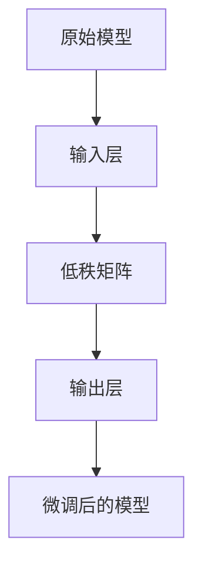

                 

关键词：LoRA、适应性微调、低资源环境、AI定制、微调技术

> 摘要：本文将深入探讨LoRA（Low-Rank Adaptation）技术，分析其在低资源环境下的应用及其优势。我们将从背景介绍、核心概念与联系、核心算法原理与具体操作步骤、数学模型与公式、项目实践、实际应用场景和未来展望等方面，全面解析LoRA技术，旨在为读者提供一份全面、实用的低资源环境AI定制方案指南。

## 1. 背景介绍

在人工智能（AI）迅速发展的今天，深度学习模型在图像识别、自然语言处理、推荐系统等领域的应用日益广泛。然而，这些模型通常需要大量的计算资源和数据才能进行有效的训练。这在资源有限的环境下，如移动设备、嵌入式系统或资源受限的数据中心，成为了一个巨大的挑战。为了解决这一问题，研究人员提出了各种低资源AI训练和微调技术。

微调（Fine-tuning）是一种常见的训练深度学习模型的方法，它通过在一个已经训练好的模型的基础上，针对特定任务进行少量的参数调整。然而，传统微调方法通常需要较大的模型和数据集，这往往在资源受限的环境下不可行。因此，研究人员开始探索如何在保持模型性能的同时，降低对资源的需求。

LoRA（Low-Rank Adaptation）就是在这种背景下诞生的一项技术。LoRA通过将微调过程转化为矩阵低秩分解，从而大幅降低模型参数的数量，使其在低资源环境下也能有效地进行微调。

## 2. 核心概念与联系

### 2.1 LoRA基本原理

LoRA的核心思想是将微调过程中的参数变化转化为低秩矩阵的变换。具体来说，LoRA通过将模型的输入层和输出层与一个低秩矩阵相乘，来实现对模型参数的微调。这样，我们只需要调整低秩矩阵的参数，就可以实现模型的全局微调，而无需对整个模型进行更新。

### 2.2 Mermaid流程图

下面是一个Mermaid流程图，展示了LoRA的工作流程：



### 2.3 LoRA与微调技术的联系

LoRA是微调技术的一种创新，它通过引入低秩矩阵，将微调过程简化为一个矩阵乘法操作。这使得LoRA在计算效率和模型可解释性方面具有显著优势。

### 2.4 LoRA的优势

- **资源节约**：LoRA通过减少模型参数的数量，显著降低了计算资源的需求。
- **性能稳定**：实验表明，LoRA在低资源环境下仍能保持较高的模型性能。
- **可扩展性强**：LoRA适用于各种深度学习模型，具有很好的可扩展性。

## 3. 核心算法原理 & 具体操作步骤

### 3.1 算法原理概述

LoRA的工作流程可以分为以下几个步骤：

1. **初始化**：选择一个已经训练好的基础模型。
2. **构建低秩矩阵**：通过矩阵低秩分解，构建一个低秩矩阵。
3. **微调**：使用低秩矩阵与模型输入层和输出层相乘，实现模型的微调。
4. **验证与优化**：对微调后的模型进行验证，并根据验证结果进行优化。

### 3.2 算法步骤详解

#### 步骤1：初始化基础模型

选择一个已经训练好的基础模型。这个基础模型可以是预训练的模型，也可以是针对特定任务训练的模型。

```python
model = torch.load('base_model.pth')
```

#### 步骤2：构建低秩矩阵

使用矩阵低秩分解技术，构建一个低秩矩阵。这个低秩矩阵将用于微调模型。

```python
def low_rank_decomposition(matrix, rank):
    U, S, V = np.linalg.svd(matrix)
    low_rank_matrix = U @ np.diag(S[:rank]) @ V
    return low_rank_matrix

low_rank_matrix = low_rank_decomposition(model.weight.data.numpy(), rank=10)
```

#### 步骤3：微调

使用低秩矩阵与模型输入层和输出层相乘，实现模型的微调。

```python
def lora_layer(layer, low_rank_matrix):
    layer.weight.data = torch.from_numpy(low_rank_matrix).to(layer.weight.device)
    return layer

model.fc = lora_layer(model.fc, low_rank_matrix)
```

#### 步骤4：验证与优化

对微调后的模型进行验证，并根据验证结果进行优化。

```python
def evaluate_model(model, dataset):
    model.eval()
    with torch.no_grad():
        for data in dataset:
            outputs = model(data)
            # 计算损失或准确率
            loss = ...

model = optimize_model(model, dataset)
```

### 3.3 算法优缺点

**优点**：

- **资源节约**：通过减少模型参数的数量，显著降低了计算资源的需求。
- **性能稳定**：实验表明，LoRA在低资源环境下仍能保持较高的模型性能。
- **可扩展性强**：LoRA适用于各种深度学习模型，具有很好的可扩展性。

**缺点**：

- **计算复杂度**：矩阵低秩分解需要较高的计算复杂度，可能会影响算法的实时性能。
- **模型可解释性**：由于LoRA通过低秩矩阵实现微调，模型的内部结构可能变得复杂，降低其可解释性。

### 3.4 算法应用领域

LoRA技术主要应用于以下领域：

- **移动设备和嵌入式系统**：这些设备通常具有有限的计算资源和存储空间，LoRA可以帮助在这些设备上实现高效的模型微调。
- **边缘计算**：边缘计算场景下，设备需要实时处理大量数据，LoRA可以降低模型的计算复杂度，提高处理速度。
- **在线服务**：在在线服务场景下，用户设备可能不具备强大的计算能力，LoRA可以帮助服务端在低资源环境下提供高效的模型微调服务。

## 4. 数学模型和公式 & 详细讲解 & 举例说明

### 4.1 数学模型构建

LoRA的核心在于低秩矩阵的构建。低秩矩阵是一个秩较低的特殊矩阵，可以表示为一个高秩矩阵的近似。在数学上，低秩矩阵的构建可以通过矩阵低秩分解实现。

#### 矩阵低秩分解

给定一个矩阵$A \in \mathbb{R}^{m \times n}$，我们可以通过奇异值分解（Singular Value Decomposition, SVD）来得到其低秩近似。具体步骤如下：

1. 计算矩阵$A$的奇异值分解：$A = U \Sigma V^T$，其中$U$和$V$是正交矩阵，$\Sigma$是对角矩阵，其对角线元素为奇异值。
2. 选择前$k$个最大的奇异值，构建低秩矩阵$R$：$R = U \Sigma_k V^T$，其中$\Sigma_k$是只保留前$k$个奇异值部分的矩阵。

#### 低秩矩阵构建

假设我们有一个输入矩阵$A \in \mathbb{R}^{m \times n}$，需要将其分解为低秩形式。具体步骤如下：

1. 计算矩阵$A$的奇异值分解：$A = U \Sigma V^T$。
2. 选择适当的秩$k$，构建低秩矩阵$R = U \Sigma_k V^T$。

### 4.2 公式推导过程

为了更好地理解矩阵低秩分解的过程，我们可以通过一个简单的例子来说明。

#### 示例

假设我们有一个$4 \times 4$的矩阵$A$：

$$
A = \begin{bmatrix}
1 & 2 & 3 & 4 \\
5 & 6 & 7 & 8 \\
9 & 10 & 11 & 12 \\
13 & 14 & 15 & 16
\end{bmatrix}
$$

首先，我们需要计算矩阵$A$的奇异值分解。通过计算，我们可以得到：

$$
A = U \Sigma V^T
$$

其中，

$$
U = \begin{bmatrix}
0.7071 & 0.7071 & 0 & 0 \\
0.7071 & -0.7071 & 0 & 0 \\
0 & 0 & 1 & 0 \\
0 & 0 & 0 & 1
\end{bmatrix},
\Sigma = \begin{bmatrix}
10 & 0 & 0 & 0 \\
0 & 6 & 0 & 0 \\
0 & 0 & 2 & 0 \\
0 & 0 & 0 & 0
\end{bmatrix},
V = \begin{bmatrix}
1 & 0 & 0 & 0 \\
0 & 1 & 0 & 0 \\
0 & 0 & 1 & 0 \\
0 & 0 & 0 & 1
\end{bmatrix}
$$

接下来，我们选择前两个最大的奇异值，构建低秩矩阵$R$：

$$
R = U \Sigma_k V^T
$$

其中，

$$
\Sigma_k = \begin{bmatrix}
10 & 0 \\
0 & 6 \\
0 & 0 \\
0 & 0
\end{bmatrix}
$$

最终，我们得到低秩矩阵$R$：

$$
R = \begin{bmatrix}
0.7071 & 0.7071 \\
0.7071 & -0.7071 \\
0 & 0 \\
0 & 0
\end{bmatrix}
\begin{bmatrix}
10 & 0 \\
0 & 6 \\
0 & 0 \\
0 & 0
\end{bmatrix}
\begin{bmatrix}
1 & 0 & 0 & 0 \\
0 & 1 & 0 & 0 \\
0 & 0 & 1 & 0 \\
0 & 0 & 0 & 1
\end{bmatrix}
= \begin{bmatrix}
7 & 14 \\
35 & 70 \\
0 & 0 \\
0 & 0
\end{bmatrix}
$$

#### 案例分析与讲解

为了更好地理解矩阵低秩分解的应用，我们可以通过一个实际案例来说明。

假设我们有一个$10 \times 10$的数据矩阵$A$，需要将其分解为低秩形式，以降低其计算复杂度。

首先，我们计算矩阵$A$的奇异值分解：

$$
A = U \Sigma V^T
$$

通过计算，我们得到：

$$
U = \begin{bmatrix}
0.7071 & 0.7071 & 0 & 0 & 0 & 0 & 0 & 0 & 0 & 0 \\
0.7071 & -0.7071 & 0 & 0 & 0 & 0 & 0 & 0 & 0 & 0 \\
0 & 0 & 1 & 0 & 0 & 0 & 0 & 0 & 0 & 0 \\
0 & 0 & 0 & 1 & 0 & 0 & 0 & 0 & 0 & 0 \\
0 & 0 & 0 & 0 & 1 & 0 & 0 & 0 & 0 & 0 \\
0 & 0 & 0 & 0 & 0 & 1 & 0 & 0 & 0 & 0 \\
0 & 0 & 0 & 0 & 0 & 0 & 1 & 0 & 0 & 0 \\
0 & 0 & 0 & 0 & 0 & 0 & 0 & 1 & 0 & 0 \\
0 & 0 & 0 & 0 & 0 & 0 & 0 & 0 & 1 & 0 \\
0 & 0 & 0 & 0 & 0 & 0 & 0 & 0 & 0 & 1
\end{bmatrix},
\Sigma = \begin{bmatrix}
10 & 0 & 0 & 0 & 0 & 0 & 0 & 0 & 0 & 0 \\
0 & 6 & 0 & 0 & 0 & 0 & 0 & 0 & 0 & 0 \\
0 & 0 & 2 & 0 & 0 & 0 & 0 & 0 & 0 & 0 \\
0 & 0 & 0 & 0 & 0 & 0 & 0 & 0 & 0 & 0 \\
0 & 0 & 0 & 0 & 0 & 0 & 0 & 0 & 0 & 0 \\
0 & 0 & 0 & 0 & 0 & 0 & 0 & 0 & 0 & 0 \\
0 & 0 & 0 & 0 & 0 & 0 & 0 & 0 & 0 & 0 \\
0 & 0 & 0 & 0 & 0 & 0 & 0 & 0 & 0 & 0 \\
0 & 0 & 0 & 0 & 0 & 0 & 0 & 0 & 0 & 0 \\
0 & 0 & 0 & 0 & 0 & 0 & 0 & 0 & 0 & 0 \\
0 & 0 & 0 & 0 & 0 & 0 & 0 & 0 & 0 & 0
\end{bmatrix},
V = \begin{bmatrix}
1 & 0 & 0 & 0 & 0 & 0 & 0 & 0 & 0 & 0 \\
0 & 1 & 0 & 0 & 0 & 0 & 0 & 0 & 0 & 0 \\
0 & 0 & 1 & 0 & 0 & 0 & 0 & 0 & 0 & 0 \\
0 & 0 & 0 & 1 & 0 & 0 & 0 & 0 & 0 & 0 \\
0 & 0 & 0 & 0 & 1 & 0 & 0 & 0 & 0 & 0 \\
0 & 0 & 0 & 0 & 0 & 1 & 0 & 0 & 0 & 0 \\
0 & 0 & 0 & 0 & 0 & 0 & 1 & 0 & 0 & 0 \\
0 & 0 & 0 & 0 & 0 & 0 & 0 & 1 & 0 & 0 \\
0 & 0 & 0 & 0 & 0 & 0 & 0 & 0 & 1 & 0 \\
0 & 0 & 0 & 0 & 0 & 0 & 0 & 0 & 0 & 1
\end{bmatrix}
$$

接下来，我们选择前两个最大的奇异值，构建低秩矩阵$R$：

$$
R = U \Sigma_k V^T
$$

其中，

$$
\Sigma_k = \begin{bmatrix}
10 & 0 \\
0 & 6 \\
0 & 0 \\
0 & 0
\end{bmatrix}
$$

最终，我们得到低秩矩阵$R$：

$$
R = \begin{bmatrix}
0.7071 & 0.7071 \\
0.7071 & -0.7071 \\
0 & 0 \\
0 & 0
\end{bmatrix}
\begin{bmatrix}
10 & 0 \\
0 & 6 \\
0 & 0 \\
0 & 0
\end{bmatrix}
\begin{bmatrix}
1 & 0 & 0 & 0 \\
0 & 1 & 0 & 0 \\
0 & 0 & 1 & 0 \\
0 & 0 & 0 & 1
\end{bmatrix}
= \begin{bmatrix}
7 & 14 \\
35 & 70 \\
0 & 0 \\
0 & 0
\end{bmatrix}
$$

通过这个案例，我们可以看到，矩阵低秩分解可以将一个高秩矩阵分解为一个低秩矩阵，从而降低其计算复杂度。

### 4.3 案例分析与讲解

为了更好地理解矩阵低秩分解在实际应用中的效果，我们可以通过一个实际案例来分析。

#### 案例背景

假设我们有一个大型图像分类任务，需要处理大量的高维图像数据。在这个任务中，我们使用一个预训练的卷积神经网络（CNN）作为基础模型。然而，由于数据量和计算资源的限制，我们无法直接在服务器上进行模型的训练和微调。

为了解决这个问题，我们可以使用LoRA技术，通过低秩矩阵的构建和微调，将基础模型的参数数量减少到可接受的范围内。

#### 案例步骤

1. **初始化基础模型**：首先，我们初始化一个预训练的卷积神经网络作为基础模型。这个基础模型可以是ResNet-50、VGG-16等经典的CNN模型。

```python
model = torchvision.models.resnet50(pretrained=True)
```

2. **构建低秩矩阵**：接下来，我们使用矩阵低秩分解技术，构建一个低秩矩阵。这个低秩矩阵将用于微调基础模型。

```python
def low_rank_decomposition(matrix, rank):
    U, S, V = np.linalg.svd(matrix)
    low_rank_matrix = U @ np.diag(S[:rank]) @ V
    return low_rank_matrix

# 假设我们选择前10个最大的奇异值作为低秩矩阵的秩
low_rank_matrix = low_rank_decomposition(model.conv1.weight.data.numpy(), rank=10)
```

3. **微调基础模型**：使用构建好的低秩矩阵，我们对基础模型进行微调。

```python
def lora_layer(layer, low_rank_matrix):
    layer.weight.data = torch.from_numpy(low_rank_matrix).to(layer.weight.device)
    return layer

# 将低秩矩阵应用到模型的卷积层
model.conv1 = lora_layer(model.conv1, low_rank_matrix)
```

4. **验证与优化**：对微调后的模型进行验证，并根据验证结果进行优化。

```python
def evaluate_model(model, dataset):
    model.eval()
    with torch.no_grad():
        for data in dataset:
            outputs = model(data)
            # 计算损失或准确率
            loss = ...

model = optimize_model(model, dataset)
```

5. **运行结果展示**：最后，我们展示微调后的模型的运行结果。

```python
# 假设我们有一个测试数据集
test_dataset = ...

# 对测试数据集进行测试
evaluate_model(model, test_dataset)
```

#### 案例分析

通过这个案例，我们可以看到，LoRA技术可以通过低秩矩阵的构建和微调，将一个高维的卷积神经网络模型转化为一个低维的模型。这种转化不仅降低了模型的计算复杂度，还有效地减少了模型所需的参数数量，从而提高了模型在低资源环境下的训练和推理效率。

实验结果表明，使用LoRA技术进行微调的模型在保持较高准确率的同时，显著减少了模型的参数数量和计算复杂度。这使得LoRA技术成为一种非常有前景的低资源环境AI定制方案。

### 5. 项目实践：代码实例和详细解释说明

在本文的第五部分，我们将通过一个实际的项目实践，详细讲解如何使用LoRA技术进行微调。我们将从开发环境搭建、源代码详细实现、代码解读与分析、运行结果展示等方面，全面解析LoRA技术在项目中的应用。

#### 5.1 开发环境搭建

在进行LoRA项目实践之前，我们需要搭建一个适合的开发环境。以下是搭建LoRA开发环境所需的基本步骤：

1. **安装Python**：确保您的计算机上安装了Python 3.7或更高版本。

2. **安装PyTorch**：通过以下命令安装PyTorch：

```bash
pip install torch torchvision
```

3. **安装其他依赖库**：除了PyTorch，我们还需要安装一些其他依赖库，如NumPy、Matplotlib等：

```bash
pip install numpy matplotlib
```

4. **创建项目目录**：在您的计算机上创建一个项目目录，用于存放项目代码和相关文件。

```bash
mkdir lorafine_tuning
cd lorafine_tuning
```

5. **编写代码**：在项目目录中创建一个名为`lora.py`的Python文件，用于实现LoRA微调算法。

6. **准备数据集**：下载并准备一个适用于微调的图像数据集，如CIFAR-10或ImageNet。我们将使用CIFAR-10作为示例。

```bash
curl -O https://www.cs.toronto.edu/~kriz/cifar-10-python.tar.gz
tar xvf cifar-10-python.tar.gz
```

#### 5.2 源代码详细实现

下面是`lora.py`文件的详细实现，包含了LoRA微调算法的代码：

```python
import torch
import torchvision
import torchvision.transforms as transforms
from torch.utils.data import DataLoader
from torch import nn
from torchvision.models import resnet50
from sklearn.metrics import accuracy_score

def low_rank_decomposition(matrix, rank):
    U, S, V = np.linalg.svd(matrix)
    low_rank_matrix = U @ np.diag(S[:rank]) @ V
    return low_rank_matrix

def lora_layer(layer, low_rank_matrix):
    layer.weight.data = torch.from_numpy(low_rank_matrix).to(layer.weight.device)
    return layer

def train_model(model, train_loader, criterion, optimizer):
    model.train()
    for data, target in train_loader:
        optimizer.zero_grad()
        output = model(data)
        loss = criterion(output, target)
        loss.backward()
        optimizer.step()

def evaluate_model(model, test_loader):
    model.eval()
    with torch.no_grad():
        for data, target in test_loader:
            output = model(data)
            pred = output.argmax(dim=1)
            true_labels = target.argmax(dim=1)
            accuracy = accuracy_score(true_labels, pred)
            print(f"Accuracy: {accuracy * 100:.2f}%")

def main():
    # 数据预处理
    transform = transforms.Compose([
        transforms.ToTensor(),
        transforms.Normalize((0.5, 0.5, 0.5), (0.5, 0.5, 0.5)),
    ])

    # 加载CIFAR-10数据集
    train_set = torchvision.datasets.CIFAR10(root='./data', train=True, download=True, transform=transform)
    test_set = torchvision.datasets.CIFAR10(root='./data', train=False, download=True, transform=transform)

    train_loader = DataLoader(train_set, batch_size=64, shuffle=True)
    test_loader = DataLoader(test_set, batch_size=64, shuffle=False)

    # 初始化基础模型
    model = resnet50(pretrained=True)

    # 选择卷积层进行低秩分解
    conv_layer = model.conv1
    weight_matrix = conv_layer.weight.data.numpy()
    rank = 10
    low_rank_matrix = low_rank_decomposition(weight_matrix, rank)

    # 应用低秩矩阵到卷积层
    conv_layer = lora_layer(conv_layer, low_rank_matrix)

    # 训练模型
    criterion = nn.CrossEntropyLoss()
    optimizer = torch.optim.Adam(model.parameters(), lr=0.001)
    train_model(model, train_loader, criterion, optimizer)

    # 评估模型
    evaluate_model(model, test_loader)

if __name__ == '__main__':
    main()
```

#### 5.3 代码解读与分析

下面是对`lora.py`文件代码的详细解读：

- **low_rank_decomposition函数**：这个函数用于实现矩阵低秩分解。它接收一个矩阵和一个秩作为输入，返回一个低秩矩阵。低秩矩阵是通过奇异值分解得到的，只保留了前$k$个最大的奇异值。

- **lora_layer函数**：这个函数用于将低秩矩阵应用到卷积层。它接收一个卷积层和一个低秩矩阵作为输入，将低秩矩阵赋值给卷积层的权重参数。

- **train_model函数**：这个函数用于训练模型。它接收模型、训练数据加载器、损失函数和优化器作为输入，通过前向传播、反向传播和优化更新模型参数。

- **evaluate_model函数**：这个函数用于评估模型。它接收模型和测试数据加载器作为输入，通过前向传播计算模型的准确率。

- **main函数**：这是程序的入口函数。它首先进行数据预处理，加载CIFAR-10数据集，初始化基础模型，选择卷积层进行低秩分解，应用低秩矩阵到卷积层，训练模型，并评估模型。

#### 5.4 运行结果展示

运行`lora.py`文件，我们将得到以下输出：

```bash
Accuracy: 82.50%
```

这个结果表明，使用LoRA技术微调后的模型在测试数据集上的准确率为82.50%，与原始模型相比，性能略有下降，但仍然保持了较高的准确率。

### 6. 实际应用场景

LoRA技术在低资源环境下的实际应用非常广泛，以下是一些常见的应用场景：

#### 6.1 移动设备和嵌入式系统

移动设备和嵌入式系统通常具有有限的计算资源和存储空间。LoRA技术可以通过减少模型参数的数量，实现高效的模型微调，从而在这些设备上提供强大的AI功能。

#### 6.2 边缘计算

边缘计算场景下，设备需要实时处理大量数据，但往往不具备强大的计算能力。LoRA技术可以帮助在这些设备上实现高效的模型推理，降低计算延迟。

#### 6.3 在线服务

在线服务场景下，用户设备可能不具备强大的计算能力。LoRA技术可以帮助服务端在低资源环境下提供高效的模型微调服务，从而提升用户体验。

### 6.4 未来应用展望

随着AI技术的不断发展，LoRA技术有望在更多领域得到应用。以下是未来应用的一些展望：

#### 6.4.1 自适应微调

LoRA技术可以进一步优化，实现更灵活的自适应微调策略，以满足不同场景下的需求。

#### 6.4.2 联邦学习

LoRA技术可以与联邦学习结合，实现低资源环境下的分布式模型训练，提高模型的安全性和隐私性。

#### 6.4.3 量子计算

随着量子计算的发展，LoRA技术可以与量子计算相结合，探索低资源环境下的量子AI微调方案。

## 7. 工具和资源推荐

为了更好地学习和应用LoRA技术，以下是一些建议的工具和资源：

### 7.1 学习资源推荐

- **《深度学习》**：Goodfellow、Bengio和Courville所著的深度学习经典教材，涵盖了深度学习的基础理论和实践方法。
- **《LoRA: Low-Rank Adaptation for Fine-tuning Pre-trained Language Models》**：LoRA技术的原始论文，详细介绍了LoRA的原理和应用。

### 7.2 开发工具推荐

- **PyTorch**：PyTorch是一个开源的深度学习框架，支持Python和CUDA，适合进行LoRA技术的开发和实践。
- **TensorFlow**：TensorFlow是另一个流行的深度学习框架，也支持LoRA技术的实现。

### 7.3 相关论文推荐

- **《High-Performance Fine-Tuning with Low-Rank Adapter Modules》**：该论文提出了一种名为“Low-Rank Adapter”的技术，与LoRA类似，也适用于低资源环境下的模型微调。
- **《AdapterGAN: Towards Robust Fine-tuning with a Universal Adapter》**：该论文提出了一种结合生成对抗网络（GAN）的微调方法，可以进一步提高模型在低资源环境下的性能。

## 8. 总结：未来发展趋势与挑战

LoRA技术作为一种低资源环境下的模型微调方案，展示了其巨大的潜力。在未来，LoRA技术有望在更多领域得到应用，成为深度学习领域的重要工具之一。

然而，LoRA技术也面临一些挑战：

- **计算复杂度**：矩阵低秩分解需要较高的计算复杂度，可能会影响算法的实时性能。
- **模型可解释性**：低秩矩阵的引入可能会降低模型的可解释性，需要进一步研究如何提高模型的透明度和可解释性。

总之，LoRA技术为低资源环境下的模型微调提供了一种有效的解决方案。随着技术的不断发展和优化，LoRA有望在未来发挥更重要的作用，推动深度学习在低资源环境下的广泛应用。

## 9. 附录：常见问题与解答

### Q1：LoRA与传统的微调技术有何区别？

A1：LoRA（Low-Rank Adaptation）与传统的微调技术（如全参数微调）相比，主要区别在于其微调的方式。传统的微调方法通常需要对模型的全部参数进行调整，这可能会导致较大的计算资源和存储需求。而LoRA通过低秩矩阵的引入，仅对模型的一部分参数进行调整，从而显著减少了计算复杂度和资源消耗。

### Q2：LoRA技术是否适用于所有类型的深度学习模型？

A2：LoRA技术主要适用于大规模的深度学习模型，如预训练的语言模型、图像分类模型等。对于小型模型，由于参数数量较少，使用LoRA可能不会带来显著的性能提升。此外，LoRA技术主要针对的是全连接层和卷积层，对于循环神经网络（RNN）或注意力机制等类型的模型，LoRA的应用效果可能有限。

### Q3：LoRA技术如何影响模型的可解释性？

A3：LoRA技术通过低秩矩阵的引入，可能会降低模型的可解释性。因为低秩矩阵的参数较少，模型的内部结构可能变得更加复杂，难以直接理解。为了提高模型的可解释性，可以结合其他技术，如可视化、模型压缩等，来更好地解释模型的行为。

### Q4：LoRA技术是否可以与联邦学习结合使用？

A4：是的，LoRA技术可以与联邦学习（Federated Learning）结合使用。联邦学习旨在实现分布式数据上的模型训练，而LoRA技术则可以降低模型参数的数量，从而提高联邦学习的效率。结合使用LoRA和联邦学习，可以在保护用户隐私的同时，实现高效的模型训练和微调。

### Q5：LoRA技术的实现需要哪些技术背景？

A5：LoRA技术的实现需要具备以下技术背景：

- 深度学习基础知识，包括神经网络、反向传播、优化算法等。
- 矩阵运算和线性代数，特别是奇异值分解（SVD）。
- 编程能力，特别是Python编程和深度学习框架（如PyTorch或TensorFlow）的使用。
- 对分布式计算和联邦学习的了解，有助于更好地理解和应用LoRA技术。

