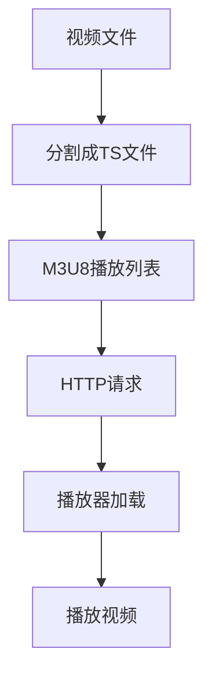

                 

关键词：M3U8，HLS，视频传输，分段技术，直播流，流媒体，高效传输，网络优化，编码格式，播放器兼容性，架构设计。

## 摘要

本文旨在深入探讨M3U8和HLS（HTTP Live Streaming）两种分段视频传输技术，分析其原理、架构、优势与局限，并探讨其在实际应用中的最佳实践。通过本文的阅读，读者将全面理解这两种技术如何优化视频传输，满足不同网络环境和终端设备的播放需求。

## 1. 背景介绍

随着互联网的快速发展，流媒体技术在视频点播、在线直播、短视频等领域得到了广泛应用。流媒体技术能够实时传输视频内容，给用户带来流畅的观看体验。然而，网络环境和终端设备的多样性使得视频传输面临诸多挑战。如何高效地传输视频，保证用户在不同网络环境下获得最佳观看体验，成为了一个重要的课题。

M3U8和HLS是两种常用的分段视频传输技术，它们通过将视频内容分割成小块（通常为TS文件），并以HTTP协议传输，实现了流媒体的实时传输。这两种技术在网络优化、播放器兼容性、传输效率等方面具有显著的优点，下面将详细探讨。

## 2. 核心概念与联系

### 2.1 M3U8

M3U8是一种文本文件格式，用于描述媒体播放列表。它包含了视频和音频的分段信息，每个分段对应一个TS文件。M3U8文件本身是一个简单的文本文件，内容为一系列路径，指向对应的TS文件。

### 2.2 HLS

HLS（HTTP Live Streaming）是一种流媒体传输协议，它使用HTTP协议传输视频内容，将视频分割成多个TS文件，并通过M3U8文件描述播放列表。HLS协议支持自适应流，可以根据用户的网络环境和终端设备，动态调整播放质量。

### 2.3 Mermaid 流程图

以下是一个简化的M3U8和HLS架构的Mermaid流程图：



## 3. 核心算法原理 & 具体操作步骤

### 3.1 算法原理概述

M3U8和HLS的核心算法原理是将视频内容分割成多个TS文件，并通过HTTP协议传输。TS文件是一种基于MPEG-2 TS（MPEG-2 Transport Stream）的容器格式，用于传输音视频数据。M3U8文件则是一个简单的文本文件，描述了TS文件的播放顺序。

### 3.2 算法步骤详解

1. **视频编码**：首先，将原始视频内容进行编码，通常使用H.264或HEVC编码标准。

2. **分割成TS文件**：将编码后的视频内容分割成多个TS文件，每个TS文件包含一定时间段内的视频数据。

3. **生成M3U8播放列表**：生成一个M3U8文件，描述TS文件的播放顺序。

4. **HTTP请求**：用户通过播放器发送HTTP请求，请求M3U8文件。

5. **播放器加载**：播放器解析M3U8文件，加载对应的TS文件。

6. **播放视频**：播放器根据TS文件的播放顺序，逐个播放视频数据。

### 3.3 算法优缺点

**优点**：

- **高效传输**：采用HTTP协议传输，充分利用了互联网的HTTP网络结构。
- **自适应流**：支持自适应流，可以根据用户网络环境和终端设备动态调整播放质量。
- **兼容性强**：几乎所有的现代播放器都支持M3U8和HLS协议。

**缺点**：

- **解析复杂**：需要解析M3U8文件和TS文件，对播放器的要求较高。
- **带宽消耗**：由于需要传输多个TS文件，对带宽有一定的消耗。

### 3.4 算法应用领域

M3U8和HLS广泛应用于视频点播、在线直播、短视频等领域。例如，YouTube、Netflix、Twitch等平台都采用了HLS协议进行视频传输，以提供流畅的观看体验。

## 4. 数学模型和公式 & 详细讲解 & 举例说明

### 4.1 数学模型构建

在M3U8和HLS中，视频传输的数学模型可以表示为：

\[ P(t) = \sum_{i=1}^{n} D_i \cdot S_i \]

其中，\( P(t) \) 表示在时间 \( t \) 内传输的数据量，\( D_i \) 表示第 \( i \) 个TS文件的数据量，\( S_i \) 表示第 \( i \) 个TS文件的播放时长。

### 4.2 公式推导过程

为了推导上述公式，我们可以假设：

- 视频内容长度为 \( L \)。
- TS文件数量为 \( n \)。
- 每个TS文件的数据量为 \( D_i \)。
- 每个TS文件的播放时长为 \( S_i \)。

那么，视频内容可以表示为：

\[ L = \sum_{i=1}^{n} D_i \]

播放时长可以表示为：

\[ T = \sum_{i=1}^{n} S_i \]

传输的数据量可以表示为：

\[ P(t) = \frac{t}{T} \cdot L \]

将 \( L \) 的表达式代入，得到：

\[ P(t) = \frac{t}{T} \cdot \sum_{i=1}^{n} D_i \]

将 \( S_i \) 的表达式代入，得到：

\[ P(t) = \frac{t}{T} \cdot \sum_{i=1}^{n} D_i \cdot S_i \]

因此，我们得到了上述的数学模型。

### 4.3 案例分析与讲解

假设一个视频内容长度为100秒，分为5个TS文件，每个TS文件的数据量分别为10MB、20MB、30MB、40MB和50MB，播放时长分别为10秒、15秒、20秒、25秒和30秒。

根据上述数学模型，我们可以计算出在任意时间 \( t \) 内传输的数据量：

\[ P(t) = \frac{t}{100} \cdot (10 \cdot 10 + 20 \cdot 15 + 30 \cdot 20 + 40 \cdot 25 + 50 \cdot 30) \]

例如，当 \( t = 50 \) 秒时，传输的数据量为：

\[ P(50) = \frac{50}{100} \cdot (10 \cdot 10 + 20 \cdot 15 + 30 \cdot 20 + 40 \cdot 25 + 50 \cdot 30) = 35 \text{MB} \]

这个结果表明，在50秒内，总共传输了35MB的数据。

## 5. 项目实践：代码实例和详细解释说明

### 5.1 开发环境搭建

为了更好地理解M3U8和HLS的实现，我们将使用一个简单的项目实例。首先，我们需要搭建开发环境。

1. **安装FFmpeg**：FFmpeg是一个开源的多媒体处理框架，用于视频和音频的编码、解码、分割等操作。可以从官方网站下载并安装FFmpeg。

2. **安装Node.js**：Node.js是一个基于Chrome V8引擎的JavaScript运行环境，用于编写服务器端应用程序。可以从官方网站下载并安装Node.js。

3. **安装HLS.js**：HLS.js是一个开源的JavaScript库，用于在浏览器中播放HLS流。可以从GitHub上下载HLS.js。

### 5.2 源代码详细实现

以下是该项目的基本实现：

```javascript
// 服务器端代码
const express = require('express');
const app = express();

// 生成M3U8文件
app.get('/stream.m3u8', (req, res) => {
  // 读取视频文件，分割成TS文件，生成M3U8文件
  // 这里使用了FFmpeg的命令行工具
  const command = 'ffmpeg -i video.mp4 -codec:v libx264 -codec:a aac -stream_loop -1 test.ts';
  const { spawn } = require('child_process');
  const ffmpeg = spawn(command, []);

  ffmpeg.stdout.on('data', (data) => {
    // 生成M3U8文件的内容
    const m3u8Content = `#EXTM3U\n#EXTINF:10,\nfile1.ts\n#EXTINF:10,\nfile2.ts\n#EXTINF:10,\nfile3.ts\n#EXTINF:10,\nfile4.ts\n#EXTINF:10,\nfile5.ts`;
    res.type('text/plain');
    res.send(m3u8Content);
  });

  ffmpeg.stderr.on('data', (data) => {
    console.error(`stderr: ${data}`);
  });

  ffmpeg.on('close', (code) => {
    console.log(`子进程退出，退出码 ${code}`);
  });
});

// 服务器端代码
app.listen(3000, () => {
  console.log('服务器启动成功，监听端口3000');
});
```

```html
<!-- 浏览器端代码 -->
<!DOCTYPE html>
<html lang="en">
<head>
  <meta charset="UTF-8">
  <title>HLS播放示例</title>
  <script src="hls.js"></script>
</head>
<body>
  <video id="video" width="640" height="480" controls></video>
  <script>
    const video = document.getElementById('video');
    const hls = new Hls();
    hls.loadSource('http://localhost:3000/stream.m3u8');
    hls.attachMedia(video);
  </script>
</body>
</html>
```

### 5.3 代码解读与分析

上述代码首先使用FFmpeg将视频文件分割成TS文件，并生成M3U8文件。服务器端代码使用了Express框架，用于处理HTTP请求。当客户端请求M3U8文件时，服务器端会读取视频文件，使用FFmpeg生成TS文件，并生成M3U8文件的内容。

浏览器端代码使用了HLS.js库，用于播放HLS流。HLS.js库可以通过`loadSource`方法加载M3U8文件，并通过`attachMedia`方法将视频内容附加上HTML5 video元素。

### 5.4 运行结果展示

在本地搭建服务器后，我们可以通过访问`http://localhost:3000/stream.m3u8`来获取M3U8文件。然后，在浏览器中打开相应的HTML页面，即可播放视频。

## 6. 实际应用场景

### 6.1 视频点播

视频点播是M3U8和HLS最常见应用场景之一。通过将视频内容分割成多个TS文件，并生成M3U8文件，用户可以方便地在线观看视频。

### 6.2 在线直播

在线直播也需要使用M3U8和HLS技术。直播服务器可以将实时视频内容分割成TS文件，并生成M3U8文件，用户可以实时观看直播。

### 6.3 短视频平台

短视频平台通常使用M3U8和HLS技术，以提供流畅的短视频播放体验。用户可以在不同网络环境下，选择合适的播放质量。

## 7. 工具和资源推荐

### 7.1 学习资源推荐

- 《流媒体技术原理与实现》
- 《HLS技术详解》
- 《FFmpeg从入门到精通》

### 7.2 开发工具推荐

- FFmpeg：用于视频编码和分割。
- HLS.js：用于在浏览器中播放HLS流。
- Express：用于构建服务器端应用程序。

### 7.3 相关论文推荐

- "HTTP Live Streaming: An Overview" by Apple Inc.
- "Dynamic Adaptive Streaming over HTTP (DASH)" by IETF.

## 8. 总结：未来发展趋势与挑战

### 8.1 研究成果总结

M3U8和HLS技术在视频传输领域取得了显著成果，为流媒体提供了高效、稳定的传输解决方案。随着网络技术和编码技术的不断发展，M3U8和HLS技术将不断创新，以满足日益增长的用户需求。

### 8.2 未来发展趋势

- **自适应流优化**：通过更精确的算法，实现更高的自适应流体验。
- **多协议支持**：扩展M3U8和HLS协议，支持更多网络协议。
- **边缘计算**：利用边缘计算技术，降低传输延迟，提高用户体验。

### 8.3 面临的挑战

- **网络适应性**：在不同网络环境下，如何实现更高效、更稳定的传输。
- **解码兼容性**：如何在各种终端设备上实现解码兼容。

### 8.4 研究展望

未来，M3U8和HLS技术将继续在视频传输领域发挥重要作用。通过不断创新和优化，将更好地满足用户需求，为流媒体技术的普及提供强有力的支持。

## 9. 附录：常见问题与解答

### 9.1 M3U8和HLS的区别是什么？

M3U8是一种文本文件格式，用于描述媒体播放列表。HLS是一种流媒体传输协议，使用HTTP协议传输视频内容。

### 9.2 HLS支持哪些编码格式？

HLS主要支持H.264和HEVC编码格式。

### 9.3 如何在浏览器中播放HLS流？

可以使用HLS.js库，在浏览器中播放HLS流。只需要加载M3U8文件，并使用`loadSource`和`attachMedia`方法即可。

### 9.4 如何在服务器端生成M3U8和HLS流？

可以使用FFmpeg等工具，在服务器端生成M3U8和HLS流。需要将视频内容分割成TS文件，并生成M3U8文件。

### 9.5 HLS和DASH的区别是什么？

HLS是一种基于HTTP协议的流媒体传输协议，而DASH是一种基于HTTP协议的动态自适应流媒体传输协议。HLS主要支持H.264和HEVC编码格式，而DASH支持更多编码格式，包括H.265和VP9等。

**作者：禅与计算机程序设计艺术 / Zen and the Art of Computer Programming**

