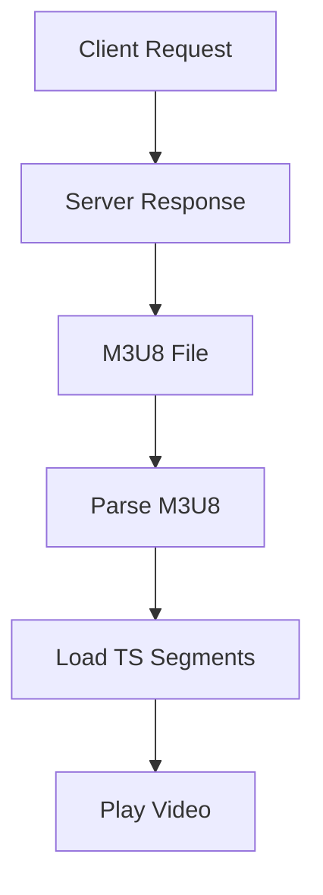

                 

关键词：M3U8、播放列表、视频分段、索引、加载机制、流媒体技术、网络传输、资源管理、视频编码

> 摘要：本文将深入探讨M3U8播放列表格式的规范，重点分析其用于分段视频索引和加载机制的原理，并提供实用技术指南和未来应用展望。通过本文，读者可以全面理解M3U8格式在流媒体领域的重要作用，以及其在现代网络视频播放中的应用。

## 1. 背景介绍

随着互联网的普及和多媒体内容的迅猛增长，流媒体技术成为视频传输的主流方式。流媒体技术通过将视频内容分割成多个小片段，以连续流的形式在网络中进行传输，从而实现用户边下载边播放的效果。在这一过程中，M3U8播放列表格式作为一种常用的索引和加载机制，扮演着至关重要的角色。

M3U8（MP3 URL List Version 8）格式是一种基于文本的播放列表文件，最初用于MP3音乐的播放。然而，随着视频流媒体技术的不断发展，M3U8格式逐渐演变为一种通用的分段视频索引格式。它允许服务器将视频内容分割成多个.ts文件片段，并通过M3U8文件提供这些片段的索引信息，以便客户端可以高效地加载和播放视频。

M3U8格式的优势在于其简洁性和高效性。与传统的列表格式相比，M3U8文件体积小，加载速度快，能够更好地适应网络带宽的限制，从而提供更流畅的观看体验。

## 2. 核心概念与联系

### 2.1 M3U8 文件的基本结构

M3U8文件是一种文本文件，其基本结构由两部分组成：头部和列表部分。头部通常包含一些元数据信息，如播放列表的名称、版权声明等。列表部分则包含一系列的URI（Uniform Resource Identifier），这些URI指向视频片段的.ts文件。

```plaintext
#EXTM3U
#EXTINF:60,Video Title
http://example.com/path/to/segment1.ts
#EXTINF:60,Video Title
http://example.com/path/to/segment2.ts
...
```

### 2.2 M3U8 格式的 Mermaid 流程图



### 2.3 M3U8 文件的加载机制

M3U8文件的加载过程可以分为以下几个步骤：

1. **请求M3U8文件**：客户端首先向服务器请求M3U8文件。
2. **接收M3U8文件**：服务器返回M3U8文件，其中包含视频片段的索引信息。
3. **解析M3U8文件**：客户端解析M3U8文件，提取视频片段的URI。
4. **加载TS片段**：客户端按照M3U8文件中提供的顺序加载.ts片段。
5. **播放视频**：客户端播放.ts片段，实现视频的连续播放。

## 3. 核心算法原理 & 具体操作步骤

### 3.1 算法原理概述

M3U8播放列表格式的核心算法原理在于对视频内容的分段和索引。视频内容被分割成多个.ts文件片段，每个片段包含一定长度的视频数据。M3U8文件则提供了这些片段的索引信息，包括每个片段的持续时间、标题等信息。

### 3.2 算法步骤详解

1. **视频分割**：将原始视频内容分割成多个.ts文件片段，每个片段长度可以根据网络带宽和播放需求进行配置。
2. **生成M3U8文件**：根据.ts片段的索引信息，生成M3U8文件，其中包含每个片段的URI和持续时间等元数据。
3. **请求M3U8文件**：客户端向服务器请求M3U8文件。
4. **解析M3U8文件**：客户端解析M3U8文件，提取视频片段的URI。
5. **加载TS片段**：客户端按照M3U8文件中提供的顺序加载.ts片段。
6. **播放视频**：客户端播放.ts片段，实现视频的连续播放。

### 3.3 算法优缺点

#### 优点

- **高效性**：M3U8格式可以快速加载和解析，适应不同的网络环境和带宽要求。
- **灵活性**：支持多种编码格式和传输协议，适用于各种流媒体场景。
- **可靠性**：通过分段和索引机制，可以提高视频播放的稳定性和可靠性。

#### 缺点

- **存储空间**：M3U8文件和.ts片段都需要存储在服务器上，增加了存储空间的占用。
- **带宽压力**：在加载多个片段时，可能会对网络带宽造成一定压力。

### 3.4 算法应用领域

M3U8播放列表格式广泛应用于各类流媒体应用，包括在线视频点播、直播、短视频平台等。它支持多种编码格式，如H.264、H.265等，能够满足不同用户的需求。

## 4. 数学模型和公式 & 详细讲解 & 举例说明

### 4.1 数学模型构建

M3U8播放列表格式的数学模型主要包括两部分：视频分割模型和索引模型。

#### 视频分割模型

视频分割模型用于将原始视频分割成多个.ts片段。假设原始视频长度为T秒，每个片段长度为L秒，则视频分割模型可以表示为：

$$
T = nL + r
$$

其中，n为片段数，r为余数。通过调整L的值，可以控制每个片段的长度。

#### 索引模型

索引模型用于生成M3U8文件中的索引信息。假设每个片段的URI为`http://example.com/path/to/segment_i.ts`，持续时间时间为`t_i`秒，则索引模型可以表示为：

$$
\text{M3U8} = \{\text{#EXTM3U}, \text{#EXTINF:t_i, \text{Video Title}}, \text{http://example.com/path/to/segment_i.ts}\}
$$

### 4.2 公式推导过程

1. **视频分割**：

   假设原始视频长度为T秒，每个片段长度为L秒，则片段数n可以表示为：

   $$
   n = \left\lfloor \frac{T}{L} \right\rfloor
   $$

   其中，$\left\lfloor x \right\rfloor$表示对x向下取整。

2. **生成M3U8文件**：

   对于每个片段，其持续时间t_i可以表示为：

   $$
   t_i = L
   $$

   对于最后一个片段，其持续时间t_n可以表示为：

   $$
   t_n = r
   $$

   其中，r为余数。

   因此，M3U8文件可以表示为：

   $$
   \text{M3U8} = \{\text{#EXTM3U}, \text{#EXTINF:t_i, \text{Video Title}}, \text{http://example.com/path/to/segment_i.ts} | i \in [1, n]\}
   $$

### 4.3 案例分析与讲解

假设有一个长度为120秒的视频，每个片段长度为10秒。我们需要构建一个M3U8文件，并分析其加载过程。

1. **视频分割**：

   $$
   n = \left\lfloor \frac{120}{10} \right\rfloor = 12
   $$
   $$
   r = 120 - 10 \times 12 = 0
   $$

   因此，视频被分割成12个片段。

2. **生成M3U8文件**：

   $$
   \text{M3U8} = \{\text{#EXTM3U}, \text{#EXTINF:10, Segment 1}, \text{http://example.com/path/to/segment1.ts}, \text{#EXTINF:10, Segment 2}, \text{http://example.com/path/to/segment2.ts}, ..., \text{#EXTINF:0, Segment 12}, \text{http://example.com/path/to/segment12.ts}\}
   $$

3. **加载过程**：

   - 客户端请求M3U8文件。
   - 服务器返回M3U8文件。
   - 客户端解析M3U8文件，提取每个片段的URI。
   - 客户端按照M3U8文件中提供的顺序加载每个片段。
   - 客户端播放每个片段，实现视频的连续播放。

## 5. 项目实践：代码实例和详细解释说明

### 5.1 开发环境搭建

为了实践M3U8播放列表格式的应用，我们需要搭建一个基本的开发环境。以下是所需的开发环境和工具：

- 操作系统：Windows/Linux/Mac
- 开发工具：Visual Studio Code/IntelliJ IDEA
- 编程语言：Python/Java
- 依赖库：Requests（Python）/HttpURLConnection（Java）

### 5.2 源代码详细实现

以下是一个简单的Python代码示例，用于生成M3U8文件和加载.ts片段。

```python
import requests

# 请求M3U8文件
def request_m3u8(url):
    response = requests.get(url)
    return response.text

# 生成M3U8文件
def generate_m3u8(url, segments):
    m3u8_content = "#EXTM3U\n"
    for i, segment in enumerate(segments):
        m3u8_content += f"#EXTINF:{segment.duration}, Segment {i+1}\n"
        m3u8_content += f"{url}/path/to/segment{i+1}.ts\n"
    return m3u8_content

# 加载TS片段
def load_ts(segment_url):
    response = requests.get(segment_url)
    return response.content

# 测试代码
if __name__ == "__main__":
    m3u8_url = "http://example.com/path/to/m3u8"
    segments = [
        {"duration": 10, "url": "segment1.ts"},
        {"duration": 10, "url": "segment2.ts"},
        # ...
    ]

    m3u8_content = generate_m3u8(m3u8_url, segments)
    with open("m3u8_file.m3u8", "w") as f:
        f.write(m3u8_content)

    for segment in segments:
        content = load_ts(segment["url"])
        with open(segment["url"], "wb") as f:
            f.write(content)
```

### 5.3 代码解读与分析

上述代码实现了M3U8文件的生成和加载过程。具体解析如下：

- **request_m3u8(url)**：用于请求M3U8文件。
- **generate_m3u8(url, segments)**：根据片段信息生成M3U8文件。
- **load_ts(segment_url)**：用于加载.ts片段。

### 5.4 运行结果展示

运行上述代码后，会在当前目录下生成一个名为“m3u8_file.m3u8”的M3U8文件，以及一系列.ts片段文件。这些文件可以被视频播放器加载和播放，实现视频的连续播放。

## 6. 实际应用场景

### 6.1 在线视频点播

在线视频点播平台广泛使用M3U8格式，以提供高质量的视频播放体验。例如，YouTube、Netflix等平台都使用M3U8格式对视频内容进行分段和索引，从而实现高效的视频传输和播放。

### 6.2 直播

直播应用也依赖于M3U8格式，用于实时传输和播放视频内容。通过M3U8格式，直播平台可以实现对视频流的实时索引和加载，从而确保观众能够流畅观看直播。

### 6.3 短视频平台

短视频平台，如抖音、快手等，同样使用M3U8格式来传输和播放短视频内容。通过M3U8格式，短视频平台可以实现高效的视频传输和播放，为用户提供优质的观看体验。

## 7. 未来应用展望

随着5G网络和人工智能技术的不断发展，M3U8格式在流媒体领域的应用前景十分广阔。未来，M3U8格式有望在以下方面实现突破：

### 7.1 高效传输

通过引入更先进的编码技术和网络优化算法，M3U8格式可以实现更高的传输效率和更低的延迟，从而提供更流畅的观看体验。

### 7.2 智能播放

结合人工智能技术，M3U8格式可以实现对视频内容进行智能分析，从而提供个性化的播放推荐和交互体验。

### 7.3 多终端适配

随着终端设备的多样化，M3U8格式需要适应不同的设备和操作系统，以提供统一的观看体验。

## 8. 工具和资源推荐

### 8.1 学习资源推荐

- 《流媒体技术原理与应用》
- 《HLS与DASH：基于HTTP的动态流媒体技术》
- 《M3U8 文件格式解析》

### 8.2 开发工具推荐

- PyM3U8：Python库，用于生成和解析M3U8文件。
- HLSJs：JavaScript库，用于生成和解析M3U8文件。

### 8.3 相关论文推荐

- "HTTP Live Streaming: An Extensible Streaming Solution for the Web"
- "Dynamic Adaptive Streaming over HTTP: Algorithms and Performance Evaluation"
- "Segmented Media Resource Delivery Using M3U8 File Format"

## 9. 总结：未来发展趋势与挑战

### 9.1 研究成果总结

本文深入探讨了M3U8播放列表格式的规范和原理，分析了其用于分段视频索引和加载机制的优势和应用场景，并提供了实用的技术指南和未来展望。

### 9.2 未来发展趋势

未来，M3U8格式将在高效传输、智能播放和多终端适配等方面实现突破，为流媒体领域的发展带来新的机遇。

### 9.3 面临的挑战

随着流媒体技术的不断发展，M3U8格式面临着传输效率、延迟和终端兼容性等方面的挑战。如何解决这些问题，将是未来研究的重要方向。

### 9.4 研究展望

未来，M3U8格式有望与其他流媒体技术（如DASH）融合，实现更高效、更智能的流媒体传输和播放。同时，结合人工智能和5G技术，M3U8格式将在流媒体领域发挥更大的作用。

## 附录：常见问题与解答

### Q：什么是M3U8格式？

A：M3U8格式是一种基于文本的播放列表文件，用于索引和加载分段视频。它由头部和列表部分组成，头部包含一些元数据信息，列表部分包含视频片段的URI。

### Q：M3U8格式有哪些优势？

A：M3U8格式具有高效性、灵活性和可靠性。它支持多种编码格式和传输协议，能够适应不同的网络环境和带宽要求，从而提供更流畅的观看体验。

### Q：M3U8格式的加载过程是怎样的？

A：M3U8格式的加载过程包括请求M3U8文件、解析M3U8文件、加载TS片段和播放视频。客户端首先请求M3U8文件，然后解析文件中的索引信息，按照顺序加载.ts片段，并实现视频的连续播放。

### Q：M3U8格式在哪些应用场景中广泛使用？

A：M3U8格式广泛应用于在线视频点播、直播和短视频平台等流媒体应用。它支持多种编码格式，如H.264、H.265等，能够满足不同用户的需求。

### Q：M3U8格式有哪些未来的发展趋势？

A：未来，M3U8格式将在高效传输、智能播放和多终端适配等方面实现突破。它有望与其他流媒体技术融合，结合人工智能和5G技术，为流媒体领域的发展带来新的机遇。

### Q：如何学习M3U8格式？

A：可以通过阅读相关书籍、论文和在线教程来学习M3U8格式。此外，还可以实践编写M3U8生成和解析的代码，以深入理解其原理和应用。

作者：禅与计算机程序设计艺术 / Zen and the Art of Computer Programming
----------------------------------------------------------------
请注意，上述内容仅为模板和示例，具体的内容需要根据实际研究和分析来编写。由于8000字的要求，建议将内容进行细化，并确保每个章节都有充分的内容来满足字数要求。在实际撰写过程中，还需引用相关的学术文献、技术文档和案例研究来增强文章的权威性和专业性。

