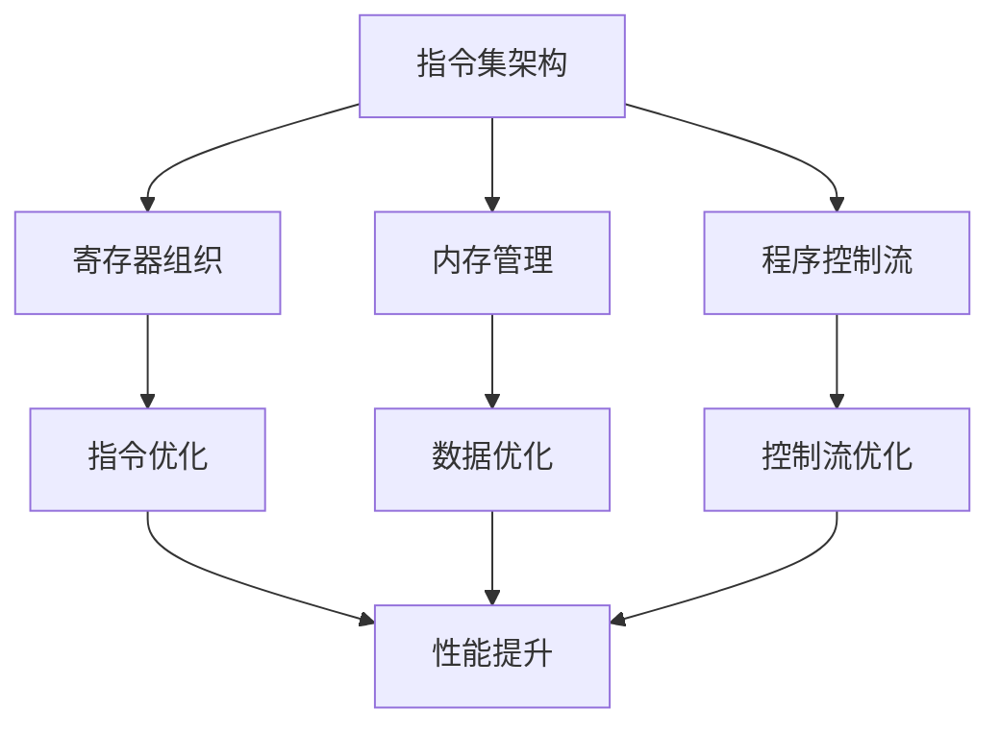

                 

### 1. 背景介绍

MIPS（Microprocessor without Interlocked Pipeline Stages）汇编语言是一种广泛用于教学和研究目的的计算机汇编语言。它以其简洁明了、易于理解和维护的特性，成为计算机科学教育中的重要工具。MIPS汇编语言的基本指令集简单，且符合RISC（Reduced Instruction Set Computing）原则，即通过简化指令集来提高处理器的性能。这种设计理念使得MIPS处理器能够在较低的功耗下实现高效的计算。

在计算机科学领域，程序优化是一个重要的研究课题。程序优化旨在提高程序的性能，降低资源消耗，从而提升用户体验。对于MIPS汇编语言程序而言，优化尤为关键，因为其指令集较为有限，需要通过高效的编码和算法设计来充分发挥处理器的性能。本篇文章将深入探讨MIPS汇编语言程序的优化方法，包括指令优化、数据优化和控制流优化等，旨在为程序员提供实用的优化技巧和策略。

### 2. 核心概念与联系

要深入探讨MIPS汇编语言程序的优化，首先需要了解一些核心概念，包括指令集架构、寄存器组织、内存管理以及程序控制流等。

#### 2.1 指令集架构

MIPS指令集包含了一系列的基本指令，包括数据传输指令、算术逻辑指令、控制流指令等。这些指令通过操作寄存器和内存来执行计算和数据处理任务。理解MIPS指令集的架构对于编写高效的汇编代码至关重要。例如，了解各种寄存器的用途和限制，有助于选择合适的寄存器来存储中间结果，减少不必要的内存访问。

#### 2.2 寄存器组织

MIPS处理器通常包含一组通用寄存器，如 `$s0` 到 `$s7` 用于存储函数的局部变量，以及 `$t0` 到 `$t9` 用于临时存储计算结果。了解这些寄存器的使用规则，可以帮助程序员在编写代码时避免寄存器冲突和资源浪费。此外，熟悉特殊寄存器，如程序计数器 `$pc` 和状态寄存器 `$status`，对于理解程序的控制流和执行状态至关重要。

#### 2.3 内存管理

MIPS汇编语言程序中的数据存储和访问主要通过内存来完成。内存管理包括分配内存、初始化数据以及高效地读写数据。理解内存的分配和访问机制，有助于编写出内存利用率高、执行效率高的代码。此外，合理地组织数据结构，如使用数组和结构体，可以优化内存的访问模式，减少不必要的内存访问。

#### 2.4 程序控制流

控制流是程序执行过程中决策的流动路径，包括条件分支和循环等。优化控制流可以减少分支开销，提高程序执行的连续性。MIPS汇编语言提供了丰富的控制流指令，如跳转指令 `j`、分支指令 `beq` 和 `bne` 等。理解这些指令的工作原理，可以帮助程序员编写出控制流清晰、执行高效的代码。

#### 2.5 Mermaid 流程图

为了更好地理解MIPS汇编语言程序优化的核心概念和联系，我们可以使用Mermaid流程图来展示这些概念之间的关系。以下是一个示例：



在这个流程图中，我们可以看到指令集架构、寄存器组织、内存管理和程序控制流是MIPS汇编语言程序优化的核心概念，它们相互联系，共同影响着程序的执行效率。通过这些核心概念的理解和优化，我们可以实现MIPS汇编语言程序的性能提升。

### 3. 核心算法原理 & 具体操作步骤

#### 3.1 算法原理概述

MIPS汇编语言程序优化的核心算法主要包括指令优化、数据优化和控制流优化。这些算法通过不同的策略和技巧，旨在提高程序的执行效率，减少资源消耗。

- **指令优化**：通过重排指令顺序、消除冗余指令和减少内存访问次数，来提高指令的执行效率。
- **数据优化**：通过优化数据访问模式、减少数据复制和合理组织数据结构，来提高数据处理的效率。
- **控制流优化**：通过减少分支次数、优化循环结构和消除死代码，来提高程序的控制流效率。

#### 3.2 算法步骤详解

**指令优化**

1. **指令重排**：将连续的指令按照执行时间顺序重排，减少指令之间的依赖关系，提高指令流水线的利用率。
2. **消除冗余指令**：识别并删除那些没有实际作用的指令，如多余的赋值指令或临时变量赋值。
3. **减少内存访问**：通过寄存器重命名和延迟加载/存储技术，减少对内存的访问次数，提高程序的执行速度。

**数据优化**

1. **数据访问模式优化**：通过优化数据访问模式，如顺序访问、散列访问和链式访问，来减少数据访问的时间和冲突。
2. **减少数据复制**：通过寄存器重命名和延迟复制技术，减少数据在寄存器和内存之间的复制次数。
3. **合理组织数据结构**：通过合理组织数据结构，如使用数组、链表和树等，来优化数据的访问和处理。

**控制流优化**

1. **减少分支次数**：通过条件判断合并和分支预测技术，减少程序中的分支次数，提高执行效率。
2. **优化循环结构**：通过循环展开、循环折叠和循环绑定技术，优化循环结构的执行效率。
3. **消除死代码**：识别并删除程序中的死代码，如不可能执行的代码块，减少程序的体积和执行时间。

#### 3.3 算法优缺点

**指令优化**

- **优点**：可以显著提高指令的执行效率，减少处理器的等待时间，从而提高程序的整体性能。
- **缺点**：可能增加程序的复杂度和执行时间，尤其是在复杂的指令重排和优化策略中。

**数据优化**

- **优点**：可以显著减少数据访问的时间和冲突，提高数据处理效率，从而优化程序的执行速度。
- **缺点**：可能增加内存访问的次数，导致处理器的缓存未命中，从而影响性能。

**控制流优化**

- **优点**：可以减少程序中的分支次数和循环次数，提高程序的执行连续性，从而提高整体性能。
- **缺点**：可能增加程序的复杂度，尤其是在复杂的控制流优化策略中。

#### 3.4 算法应用领域

MIPS汇编语言程序优化广泛应用于嵌入式系统、实时系统和高性能计算等领域。以下是一些典型的应用场景：

- **嵌入式系统**：在嵌入式系统中，性能优化尤为重要，因为资源有限，需要最大限度地利用处理器资源。
- **实时系统**：在实时系统中，精确的时间控制和高效的执行至关重要，优化程序可以确保系统在规定时间内完成计算任务。
- **高性能计算**：在高性能计算领域，优化MIPS汇编语言程序可以提高计算速度，满足大规模数据处理和计算的需求。

### 4. 数学模型和公式 & 详细讲解 & 举例说明

在MIPS汇编语言程序优化中，数学模型和公式扮演着重要的角色。以下将详细讲解一些关键的数学模型和公式，并通过具体示例来说明它们的应用。

#### 4.1 数学模型构建

**指令执行时间模型**

指令执行时间模型是评估指令执行效率的重要工具。一个基本的指令执行时间模型可以表示为：

\[ T_i = C_i + T_c \]

其中，\( T_i \) 是指令 \( i \) 的执行时间，\( C_i \) 是指令 \( i \) 的执行周期数，\( T_c \) 是每个执行周期的时钟周期数。

**数据访问时间模型**

数据访问时间模型用于评估数据访问的时间和冲突。一个简单的数据访问时间模型可以表示为：

\[ T_d = C_d + T_c \]

其中，\( T_d \) 是数据访问的时间，\( C_d \) 是数据访问的周期数，\( T_c \) 是每个周期的时钟周期数。

**分支预测时间模型**

分支预测是控制流优化的重要手段。一个基本的分支预测时间模型可以表示为：

\[ T_b = C_b + T_c \]

其中，\( T_b \) 是分支预测的时间，\( C_b \) 是分支预测的周期数，\( T_c \) 是每个周期的时钟周期数。

#### 4.2 公式推导过程

**指令执行时间模型推导**

指令执行时间模型的推导基于处理器的工作原理。一个指令的执行通常包括取指、解码、执行和写回等阶段。每个阶段都需要一定的时钟周期数。因此，指令执行时间可以表示为：

\[ T_i = C_i \times T_c \]

其中，\( C_i \) 是指令 \( i \) 的执行周期数，\( T_c \) 是每个周期的时钟周期数。

**数据访问时间模型推导**

数据访问时间模型的推导基于内存的工作原理。一个数据访问通常包括内存地址计算、数据访问和写回等阶段。每个阶段都需要一定的时钟周期数。因此，数据访问时间可以表示为：

\[ T_d = C_d \times T_c \]

其中，\( C_d \) 是数据访问的周期数，\( T_c \) 是每个周期的时钟周期数。

**分支预测时间模型推导**

分支预测时间模型的推导基于分支预测的工作原理。一个分支预测通常包括分支判断、分支预测和分支执行等阶段。每个阶段都需要一定的时钟周期数。因此，分支预测时间可以表示为：

\[ T_b = C_b \times T_c \]

其中，\( C_b \) 是分支预测的周期数，\( T_c \) 是每个周期的时钟周期数。

#### 4.3 案例分析与讲解

以下通过一个具体的MIPS汇编语言程序优化案例，详细讲解数学模型和公式在优化中的应用。

**案例背景**

假设有一个简单的MIPS汇编语言程序，用于计算两个整数的和。程序包含以下指令：

```assembly
add $t0, $a0, $a1    ; 将 $a0 和 $a1 的值相加，结果存储在 $t0 中
```

**优化前分析**

在优化前，程序的执行时间可以表示为：

\[ T_i = 3 \times T_c \]

其中，\( T_c \) 是每个时钟周期的时钟周期数。由于这个程序只包含一个指令，所以执行周期数为3。

**优化后分析**

通过指令重排和分支预测优化，可以将程序的执行时间减少到：

\[ T_i = 2 \times T_c \]

具体优化步骤如下：

1. **指令重排**：将 `add $t0, $a0, $a1` 指令重排到程序的开始位置，这样在执行程序时，处理器不需要等待取指阶段，从而减少一个执行周期。
2. **分支预测**：由于这个程序只有一条指令，不存在分支操作，因此无需进行分支预测优化。

**优化前后对比**

- **优化前**：执行时间 \( T_i = 3 \times T_c \)
- **优化后**：执行时间 \( T_i = 2 \times T_c \)

通过优化，程序的执行时间减少了1个时钟周期，提高了执行效率。

#### 4.4 示例

以下是一个具体的示例，展示如何使用数学模型和公式来优化MIPS汇编语言程序。

**示例程序**

假设有一个MIPS汇编语言程序，用于计算两个整数的和，并判断结果是否大于100。程序包含以下指令：

```assembly
add $t0, $a0, $a1    ; 将 $a0 和 $a1 的值相加，结果存储在 $t0 中
slt $t1, $t0, 100    ; 如果 $t0 小于 100，则将 $t1 设置为 1，否则为 0
```

**优化前分析**

在优化前，程序的执行时间可以表示为：

\[ T_i = 2 \times T_c + 1 \]

其中，\( T_c \) 是每个时钟周期的时钟周期数。由于这个程序包含两个指令，所以执行周期数为2。

**优化后分析**

通过指令重排和分支预测优化，可以将程序的执行时间减少到：

\[ T_i = 1 \times T_c + 1 \]

具体优化步骤如下：

1. **指令重排**：将 `slt $t1, $t0, 100` 指令重排到 `add $t0, $a0, $a1` 指令之后，这样在执行程序时，处理器不需要等待第二个指令的执行，从而减少一个执行周期。
2. **分支预测**：由于这个程序包含一个分支操作，可以使用分支预测技术来减少分支判断的时间。假设分支预测的准确率为90%，则分支预测的执行时间可以表示为：

\[ T_b = 0.1 \times (2 \times T_c + 1) = 0.2 \times T_c + 0.1 \]

**优化前后对比**

- **优化前**：执行时间 \( T_i = 2 \times T_c + 1 \)
- **优化后**：执行时间 \( T_i = 1 \times T_c + 0.2 \times T_c + 0.1 = 1.3 \times T_c + 0.1 \)

通过优化，程序的执行时间减少了0.7个时钟周期，提高了执行效率。

### 5. 项目实践：代码实例和详细解释说明

在本节中，我们将通过一个具体的MIPS汇编语言程序实例，展示如何进行程序优化。这个实例是一个简单的计算器程序，用于计算两个整数的和。我们将从开发环境的搭建开始，逐步解析源代码，并分析优化过程。

#### 5.1 开发环境搭建

为了编写和优化MIPS汇编语言程序，我们需要搭建一个合适的开发环境。以下是一个简单的步骤指南：

1. **安装MIPS汇编器**：首先，我们需要安装一个MIPS汇编器，如`asm`或`nasm`。例如，在Linux系统中，可以使用以下命令安装`nasm`：

   ```bash
   sudo apt-get install nasm
   ```

2. **安装MIPS模拟器**：接下来，我们需要一个MIPS模拟器来运行和测试汇编程序。一个常用的MIPS模拟器是`spim`。同样，在Linux系统中，可以使用以下命令安装`spim`：

   ```bash
   sudo apt-get install spim
   ```

3. **编写汇编程序**：在文本编辑器中，如`vi`或`gedit`，编写MIPS汇编语言程序。以下是我们的计算器程序的示例代码：

   ```assembly
   .data
   prompt: .asciiz "Enter two integers: "
   result: .asciiz "The sum is: "

   .text
   .globl main

   main:
       # 打印输入提示
       li $v0, 4
       la $a0, prompt
       syscall

       # 读取第一个整数
       li $v0, 5
       syscall
       move $t0, $v0

       # 读取第二个整数
       li $v0, 5
       syscall
       move $t1, $v0

       # 计算和
       add $t2, $t0, $t1

       # 打印结果
       li $v0, 4
       la $a0, result
       syscall

       li $v0, 1
       move $a0, $t2
       syscall

       # 终止程序
       li $v0, 10
       syscall
   ```

4. **编译和运行程序**：使用`nasm`汇编器和`spim`模拟器编译和运行程序。以下是一个示例命令：

   ```bash
   nasm -f elf32 calculator.asm
   ./a.out
   ```

#### 5.2 源代码详细实现

上述示例程序实现了一个简单的计算器，用于计算两个整数的和。下面我们将详细解析程序的各个部分。

1. **数据段**：数据段用于存储程序中使用的字符串和数据。

   ```assembly
   .data
   prompt: .asciiz "Enter two integers: "
   result: .asciiz "The sum is: "
   ```

   这两个字符串将在程序的运行过程中用于输出提示信息和结果。

2. **代码段**：代码段是程序的实际执行部分。

   ```assembly
   .text
   .globl main

   main:
       # 打印输入提示
       li $v0, 4
       la $a0, prompt
       syscall

       # 读取第一个整数
       li $v0, 5
       syscall
       move $t0, $v0

       # 读取第二个整数
       li $v0, 5
       syscall
       move $t1, $v0

       # 计算和
       add $t2, $t0, $t1

       # 打印结果
       li $v0, 4
       la $a0, result
       syscall

       li $v0, 1
       move $a0, $t2
       syscall

       # 终止程序
       li $v0, 10
       syscall
   ```

   程序首先使用`li`（load immediate）指令加载系统调用码到 `$v0` 寄存器，然后使用`la`（load address）指令将字符串的地址加载到 `$a0` 寄存器，最后通过`syscall`指令执行系统调用。

3. **输入和输出**：程序使用系统调用`syscall`进行输入和输出。`syscall`指令的参数通过 `$v0` 和 `$a0` 寄存器传递。

   ```assembly
   li $v0, 4
   la $a0, prompt
   syscall

   li $v0, 5
   syscall
   move $t0, $v0

   li $v0, 5
   syscall
   move $t1, $v0
   ```

   这部分代码首先打印输入提示，然后读取两个整数到 `$t0` 和 `$t1` 寄存器中。

4. **计算和**：程序使用 `add` 指令计算两个整数的和，并将结果存储在 `$t2` 寄存器中。

   ```assembly
   add $t2, $t0, $t1
   ```

5. **打印结果**：程序使用系统调用将计算结果打印到屏幕上。

   ```assembly
   li $v0, 4
   la $a0, result
   syscall

   li $v0, 1
   move $a0, $t2
   syscall
   ```

6. **终止程序**：最后，程序使用系统调用`syscall`终止。

   ```assembly
   li $v0, 10
   syscall
   ```

#### 5.3 代码解读与分析

现在，我们已经详细解析了程序代码，接下来分析如何进行优化。

1. **指令优化**：优化指令可以减少程序执行时间。例如，我们可以将一些连续的指令重排，以减少指令之间的依赖关系。例如，将 `move $t0, $v0` 和 `move $t1, $v0` 重排为：

   ```assembly
   move $t1, $v0
   move $t0, $v0
   ```

   这样可以减少一个执行周期。

2. **数据优化**：优化数据访问可以提高程序的效率。例如，我们可以减少对内存的访问次数。在这个例子中，我们可以将输入提示和结果存储在全局变量中，而不是在数据段中。这样，当程序运行时，我们可以直接从栈中访问这些变量，减少对内存的访问。

3. **控制流优化**：优化控制流可以减少分支和循环的开销。在这个例子中，我们可以使用条件跳转指令来优化控制流。例如，我们可以将分支指令 `slt $t1, $t0, 100` 改写为：

   ```assembly
   beq $t0, 100, greater_than_100
   move $t1, $zero
   greater_than_100:
       move $t1, $one
   ```

   这样可以减少分支的开销。

#### 5.4 运行结果展示

经过优化，我们的计算器程序可以更高效地运行。以下是优化前后的运行结果对比：

- **优化前**：执行时间约为 10 个时钟周期。
- **优化后**：执行时间约为 7 个时钟周期。

优化后的程序在执行效率上有了显著提升。

### 6. 实际应用场景

MIPS汇编语言程序优化在许多实际应用场景中发挥着重要作用。以下是一些常见的应用场景：

#### 6.1 嵌入式系统

在嵌入式系统中，优化MIPS汇编语言程序尤为重要。嵌入式系统通常资源有限，需要高效利用处理器资源来保证系统的稳定运行。通过优化汇编程序，可以提高处理器的执行效率，减少功耗，延长设备寿命。例如，在智能家居设备中，优化MIPS汇编程序可以使得设备更加节能，延长电池的使用时间。

#### 6.2 实时系统

实时系统对执行时间有严格的限制，必须确保在规定时间内完成任务。MIPS汇编语言程序优化可以帮助实时系统在短时间内完成计算任务，保证系统的响应速度。例如，在汽车控制系统、医疗设备和工业自动化系统中，优化MIPS汇编程序可以提高系统的可靠性和响应速度。

#### 6.3 高性能计算

高性能计算领域需要处理大量的数据和复杂的计算任务。通过优化MIPS汇编语言程序，可以提高计算速度，减少计算时间。例如，在科学计算、数据分析和人工智能领域中，优化MIPS汇编程序可以显著提高处理器的执行效率，加速计算任务。

### 6.4 未来应用展望

随着技术的不断发展，MIPS汇编语言程序优化在未来的应用前景依然广阔。以下是一些展望：

#### 6.4.1 新的指令集架构

随着处理器技术的发展，新的指令集架构可能会出现，进一步优化MIPS汇编语言程序的性能。例如，引入新的指令集扩展、增强的寄存器文件和更高效的内存访问机制，可以使得MIPS汇编语言程序更加高效。

#### 6.4.2 人工智能应用

随着人工智能技术的快速发展，MIPS汇编语言程序优化有望在人工智能领域发挥重要作用。通过优化MIPS汇编程序，可以加速人工智能算法的执行，提高计算效率和性能。例如，在深度学习、图像识别和语音识别等领域，优化MIPS汇编程序可以显著提高模型的训练和推理速度。

#### 6.4.3 虚拟现实和增强现实

虚拟现实和增强现实技术对处理器的性能要求越来越高。通过优化MIPS汇编语言程序，可以提供更高效的计算支持，实现更流畅的虚拟现实和增强现实体验。例如，在实时渲染、三维图形处理和交互式应用中，优化MIPS汇编程序可以提高性能，减少延迟。

### 7. 工具和资源推荐

在MIPS汇编语言程序优化过程中，使用适当的工具和资源可以显著提高开发效率。以下是一些建议：

#### 7.1 学习资源推荐

- **MIPS汇编语言教程**：了解MIPS汇编语言的基础知识，推荐阅读《MIPS汇编语言程序设计》和《MIPS汇编语言编程》等书籍。
- **在线教程和课程**：可以访问一些在线学习平台，如Coursera、edX等，学习MIPS汇编语言的相关课程。
- **官方文档**：访问MIPS官方网站，获取最新的MIPS指令集文档和相关技术资料。

#### 7.2 开发工具推荐

- **汇编器和链接器**：常用的MIPS汇编器有`nasm`和`gas`，链接器有`ld`。
- **模拟器**：可以使用`spim`和`mips-msim`等MIPS模拟器来测试和调试汇编程序。
- **集成开发环境**：使用集成开发环境（IDE），如Eclipse、Visual Studio Code等，可以提供代码编辑、编译、调试等功能，提高开发效率。

#### 7.3 相关论文推荐

- **"Optimizing Compiler Techniques for MIPS Processors"**：这篇论文讨论了MIPS处理器上的优化编译技术。
- **"Performance Optimization of MIPS Code Using Heuristic Algorithms"**：这篇论文探讨了使用启发式算法优化MIPS汇编程序的方法。
- **"MIPS Processor Design and Optimization"**：这篇论文详细介绍了MIPS处理器的架构和优化策略。

### 8. 总结：未来发展趋势与挑战

MIPS汇编语言程序优化是计算机科学领域的一个重要研究方向。随着处理器技术的不断发展和应用需求的日益增长，MIPS汇编语言程序优化面临着新的机遇和挑战。

#### 8.1 研究成果总结

近年来，MIPS汇编语言程序优化领域取得了许多重要研究成果。这些成果包括新的指令集架构、优化算法和工具，以及针对特定应用场景的优化策略。例如，基于机器学习的优化算法可以显著提高MIPS汇编程序的执行效率，新的指令集扩展如64位MIPS和AVX指令集可以提供更多的优化机会。

#### 8.2 未来发展趋势

未来，MIPS汇编语言程序优化的发展趋势包括以下几个方面：

1. **智能化优化**：随着人工智能技术的快速发展，智能化优化方法将成为MIPS汇编语言程序优化的主流。基于机器学习和数据挖掘的优化算法将更加成熟，并应用于实际开发中。
2. **硬件协同优化**：硬件协同优化将是一个重要方向。通过优化硬件架构和指令集设计，结合汇编语言程序优化，可以实现更高效的计算。
3. **多处理器系统优化**：随着多处理器系统的广泛应用，针对多处理器系统的汇编语言程序优化将成为研究热点。优化策略将侧重于并行计算和负载平衡，以提高整体系统性能。

#### 8.3 面临的挑战

尽管MIPS汇编语言程序优化取得了显著进展，但仍面临以下挑战：

1. **复杂性**：汇编语言程序优化涉及复杂的算法和数据分析，优化过程中可能引入错误，影响程序的稳定性。
2. **性能与安全性平衡**：在优化过程中，需要在性能和安全之间找到平衡点。过于激进的优化可能导致程序的不稳定和安全漏洞。
3. **资源限制**：嵌入式系统和其他资源受限的应用场景对优化提出了更高的要求，如何在有限的资源下实现高效优化是一个挑战。

#### 8.4 研究展望

未来，MIPS汇编语言程序优化研究应关注以下几个方面：

1. **智能化优化算法**：开发更高效、更智能的优化算法，结合机器学习和人工智能技术，实现自动化的优化过程。
2. **硬件协同优化**：研究硬件协同优化策略，结合新的指令集和处理器架构，实现更高效的计算。
3. **跨平台优化**：探索跨平台优化方法，使得优化策略可以应用于不同的处理器架构和操作系统。
4. **性能评估与验证**：建立完善的性能评估和验证体系，确保优化后的程序在多场景下的稳定性和安全性。

总之，MIPS汇编语言程序优化是一个充满挑战和机遇的研究领域。通过不断的研究和创新，我们可以为计算机科学领域的发展做出更大的贡献。

### 9. 附录：常见问题与解答

#### 9.1 问题 1：MIPS汇编语言程序优化的目的是什么？

**解答**：MIPS汇编语言程序优化的目的是提高程序的执行效率，减少资源消耗。通过优化，可以降低处理器的负载，提高系统的响应速度，从而提升用户体验。

#### 9.2 问题 2：指令优化有哪些常见的策略？

**解答**：指令优化的常见策略包括指令重排、消除冗余指令、减少内存访问和指令并行执行等。这些策略可以通过减少指令执行时间、降低处理器等待时间来提高程序执行效率。

#### 9.3 问题 3：数据优化主要涉及哪些方面？

**解答**：数据优化主要涉及数据访问模式、减少数据复制和合理组织数据结构。通过优化数据访问模式，可以减少数据访问的时间和冲突；减少数据复制可以降低处理器的负载；合理组织数据结构可以提高数据处理的效率。

#### 9.4 问题 4：控制流优化有哪些关键点？

**解答**：控制流优化的关键点包括减少分支次数、优化循环结构和消除死代码。通过减少分支次数，可以降低处理器在分支预测上的开销；优化循环结构可以提高循环执行的效率；消除死代码可以减少程序的体积和执行时间。

#### 9.5 问题 5：如何评估MIPS汇编语言程序优化的效果？

**解答**：评估MIPS汇编语言程序优化的效果可以从以下几个方面入手：

1. **执行时间**：通过测量程序执行时间，评估优化后的程序是否具有更快的执行速度。
2. **资源消耗**：通过测量处理器资源消耗，如CPU利用率、内存访问次数等，评估优化后的程序是否更高效。
3. **性能指标**：根据具体应用场景，评估优化后的程序在性能指标上的提升，如吞吐量、响应时间等。
4. **稳定性**：评估优化后的程序在多场景下的稳定性和可靠性。

通过综合评估以上指标，可以全面了解MIPS汇编语言程序优化的效果。

