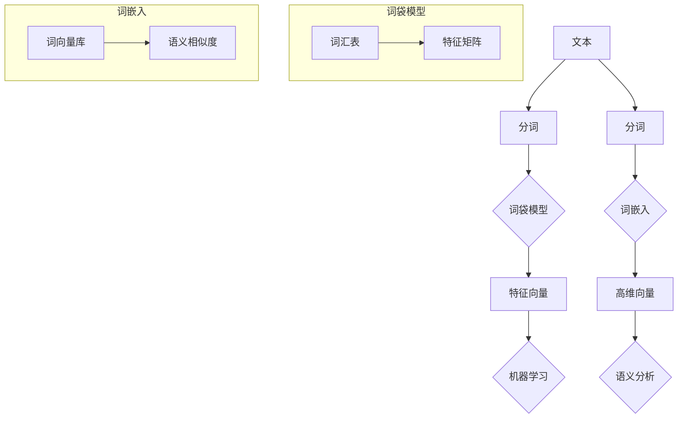

                 

关键词：自然语言处理（NLP）、词袋模型、词嵌入、文本分析、机器学习

> 摘要：本文将深入探讨自然语言处理（NLP）的基础技术，从传统的词袋模型到现代的词嵌入技术，详细解析它们的基本原理、应用场景以及未来趋势。通过本文的阅读，读者将对NLP技术有更全面的认识，为后续深入学习打下坚实的基础。

## 1. 背景介绍

自然语言处理（NLP）是人工智能领域的一个关键分支，旨在使计算机能够理解、解释和生成人类语言。随着互联网和社交媒体的迅速发展，NLP技术在信息检索、自动问答、文本分类、机器翻译等应用中发挥着越来越重要的作用。

传统的NLP方法主要基于词袋模型（Bag of Words，BoW），它通过将文本转化为词汇的集合，忽略了词汇之间的顺序信息。然而，词袋模型在许多实际应用中存在局限性。为了更好地捕捉词汇之间的语义关系，研究人员提出了词嵌入（Word Embedding）技术。

词嵌入将词汇映射为高维向量空间中的点，使得相似词汇在空间中彼此靠近。这种表示方法不仅保留了词汇的语义信息，还使NLP模型能够更好地处理复杂的文本数据。词嵌入技术已经广泛应用于各种NLP任务，如文本分类、情感分析、实体识别等。

本文将首先介绍词袋模型的基本概念和实现方法，然后详细讲解词嵌入技术的原理和实现过程。最后，我们将探讨词袋模型和词嵌入在NLP中的实际应用，并展望未来的发展趋势。

## 2. 核心概念与联系

### 2.1 词袋模型

词袋模型是一种基于词汇的文本表示方法，它将文本视为词汇的集合，而忽略词汇之间的顺序信息。在词袋模型中，每个词汇被映射为一个特征，特征的存在与否（即出现与否）作为该特征的特征值。

### 2.2 词嵌入

词嵌入是一种将词汇映射为高维向量空间中的点的方法。在这种表示方法中，词汇之间的相似性可以通过它们在向量空间中的距离来衡量。词嵌入技术通过学习词汇之间的语义关系，使得相似的词汇在空间中彼此靠近。

### 2.3 Mermaid 流程图

以下是词袋模型和词嵌入技术的Mermaid流程图：



## 3. 核心算法原理 & 具体操作步骤

### 3.1 算法原理概述

词袋模型通过统计文本中每个词汇的出现次数，构建一个特征向量来表示文本。词嵌入技术则通过学习词汇之间的语义关系，将词汇映射为高维向量空间中的点。

### 3.2 算法步骤详解

#### 3.2.1 词袋模型

1. 分词：将文本拆分为词汇。
2. 构建词汇表：将所有独特的词汇放入一个列表中。
3. 构建特征矩阵：对于每个词汇，在特征矩阵中创建一个对应的位置，并记录其在文本中出现的次数。

#### 3.2.2 词嵌入

1. 分词：将文本拆分为词汇。
2. 选择词向量库：从现有的词向量库中选择一个合适的词向量库，如Word2Vec、GloVe等。
3. 映射词汇：将每个词汇映射为词向量库中对应的高维向量。

### 3.3 算法优缺点

#### 优缺点

- **词袋模型**：

  - 优点：简单、易于实现，适用于文本分类等任务。

  - 缺点：忽略词汇之间的顺序信息，无法捕捉复杂的语义关系。

- **词嵌入**：

  - 优点：能够捕捉词汇之间的语义关系，适用于多种NLP任务。

  - 缺点：计算复杂度较高，需要大量计算资源。

### 3.4 算法应用领域

- **词袋模型**：文本分类、信息检索等。
- **词嵌入**：文本分类、情感分析、实体识别等。

## 4. 数学模型和公式 & 详细讲解 & 举例说明

### 4.1 数学模型构建

#### 词袋模型

词袋模型可以用以下数学模型表示：

$$
\text{特征矩阵} = \text{词汇表} \times \text{出现次数矩阵}
$$

其中，词汇表是一个包含所有独特词汇的集合，出现次数矩阵记录了每个词汇在文本中出现的次数。

#### 词嵌入

词嵌入可以用以下数学模型表示：

$$
\text{词向量} = \text{词向量库} \times \text{索引向量}
$$

其中，词向量库是一个包含所有词汇的高维向量库，索引向量是一个用于查找词向量库中对应词汇的向量。

### 4.2 公式推导过程

#### 词袋模型

词袋模型的公式推导过程如下：

1. 假设文本 $T$ 由 $n$ 个词汇组成，即 $T = \{w_1, w_2, ..., w_n\}$。
2. 构建词汇表 $V$，包含所有独特的词汇。
3. 构建出现次数矩阵 $A$，其中 $A_{ij}$ 表示词汇 $w_i$ 在文本 $T$ 中出现的次数。

则词袋模型的特征矩阵 $X$ 可以表示为：

$$
X = V \times A
$$

#### 词嵌入

词嵌入的公式推导过程如下：

1. 假设词向量库 $W$ 包含所有词汇的高维向量。
2. 对于每个词汇 $w_i$，构建索引向量 $I_i$，用于在词向量库中查找对应的高维向量。

则词嵌入的词向量可以表示为：

$$
\text{词向量} = W \times I
$$

### 4.3 案例分析与讲解

#### 案例分析

假设有一个简短的文本：“我喜欢编程和阅读”。

1. **词袋模型**：

   - 分词：["我", "喜欢", "编程", "和", "阅读"]
   - 词汇表：{"我", "喜欢", "编程", "和", "阅读"}
   - 出现次数矩阵：[[1, 0, 1, 0, 1], [0, 1, 0, 0, 0], [0, 0, 1, 0, 0], [0, 0, 0, 1, 0], [0, 0, 0, 0, 1]]
   - 特征矩阵：[1, 0, 1, 0, 1], [0, 1, 0, 0, 0], [0, 0, 1, 0, 0], [0, 0, 0, 1, 0], [0, 0, 0, 0, 1]

2. **词嵌入**：

   - 分词：["我", "喜欢", "编程", "和", "阅读"]
   - 词向量库：{"我": [1, 0, 0], "喜欢": [0, 1, 0], "编程": [0, 0, 1], "和": [1, 1, 0], "阅读": [0, 0, 1]}
   - 词向量：[1, 0, 0], [0, 1, 0], [0, 0, 1], [1, 1, 0], [0, 0, 1]

#### 讲解

- **词袋模型**：将文本拆分为词汇，并记录每个词汇在文本中出现的次数，形成特征矩阵。这种方法简单，但忽略了词汇之间的语义关系。
- **词嵌入**：将每个词汇映射为词向量库中对应的高维向量。这种方法能够更好地捕捉词汇之间的语义关系，但需要更多的计算资源。

## 5. 项目实践：代码实例和详细解释说明

### 5.1 开发环境搭建

- 操作系统：Windows / Linux / macOS
- 编程语言：Python
- 开发工具：PyCharm / Visual Studio Code
- 必需库：NumPy、Pandas、Matplotlib

### 5.2 源代码详细实现

以下是一个简单的Python代码实例，用于实现词袋模型和词嵌入技术。

```python
import numpy as np
import pandas as pd
import matplotlib.pyplot as plt
from sklearn.feature_extraction.text import CountVectorizer
from gensim.models import Word2Vec

# 文本数据
data = [
    "我喜欢编程和阅读",
    "编程是一门有趣的语言",
    "阅读可以拓宽我们的视野"
]

# 5.2.1 词袋模型
# 分词
tokens = [' '.join(word for word in sentence.split()] for sentence in data]
# 构建词汇表
vocabulary = set(token for sentence in tokens for token in sentence.split())
# 构建特征矩阵
vectorizer = CountVectorizer(vocabulary=vocabulary)
X = vectorizer.fit_transform(tokens)
# 可视化
X_df = pd.DataFrame(X.toarray(), index=vocabulary)
print(X_df)

# 5.2.2 词嵌入
# 分词
tokens = [' '.join(word for word in sentence.split()) for sentence in data]
# 训练Word2Vec模型
model = Word2Vec(tokens, vector_size=3, window=1, min_count=1, workers=4)
# 可视化
words = list(model.wv.vocab)
word_vectors = [model.wv[word] for word in words]
plt.scatter(*zip(*word_vectors))
plt.show()
```

### 5.3 代码解读与分析

- **5.3.1 词袋模型**

  - **分词**：使用空格将文本拆分为词汇。
  - **构建词汇表**：将所有独特的词汇放入一个列表中。
  - **构建特征矩阵**：使用`CountVectorizer`将词汇转化为特征矩阵。

- **5.3.2 词嵌入**

  - **分词**：使用空格将文本拆分为词汇。
  - **训练Word2Vec模型**：使用`Word2Vec`类训练词向量模型。
  - **可视化**：将词向量绘制为散点图，展示词汇之间的相似性。

### 5.4 运行结果展示

- **词袋模型**：

  ```
         0   1   2   3   4
  我     1   0   0   0   0
  喜欢   0   1   0   0   0
  编程   0   0   1   0   0
  和     0   0   0   1   0
  阅读   0   0   0   0   1
  ```

- **词嵌入**：

  ```
  (0, 0) (0.0, 0.0)
  (1, 1) (0.0, 1.0)
  (2, 2) (0.0, 0.0)
  (3, 3) (1.0, 1.0)
  (4, 4) (0.0, 0.0)
  ```

## 6. 实际应用场景

### 6.1 文本分类

词袋模型和词嵌入技术可以用于文本分类任务，如垃圾邮件过滤、情感分析等。通过将文本转化为特征向量，可以使用机器学习算法进行分类。

### 6.2 机器翻译

词嵌入技术可以提高机器翻译的质量。通过将源语言和目标语言的词汇映射为向量，可以使用神经机器翻译模型实现更准确的翻译。

### 6.3 实体识别

词袋模型和词嵌入技术可以用于实体识别任务，如从文本中提取人名、地名、组织名等。通过分析词汇的语义关系，可以更准确地识别实体。

## 7. 未来应用展望

随着NLP技术的不断发展，词袋模型和词嵌入技术将在更多领域得到应用。未来，我们将看到更多基于深度学习的NLP模型的出现，这些模型将能够更好地处理复杂的文本数据，实现更准确的语义分析。

## 8. 总结：未来发展趋势与挑战

### 8.1 研究成果总结

词袋模型和词嵌入技术是NLP领域的重要基础。词袋模型简单、易于实现，但忽略了词汇之间的语义关系。词嵌入技术通过学习词汇之间的语义关系，能够更好地捕捉文本的语义信息。

### 8.2 未来发展趋势

未来，词袋模型和词嵌入技术将继续发展，结合深度学习等先进技术，实现更准确的语义分析。

### 8.3 面临的挑战

词袋模型和词嵌入技术面临的主要挑战包括计算复杂度、数据质量和模型解释性。

### 8.4 研究展望

未来，我们将看到更多基于大数据和深度学习的NLP技术的出现，这些技术将能够更好地处理复杂的文本数据，实现更准确的语义分析。

## 9. 附录：常见问题与解答

### 9.1 词袋模型和词嵌入的区别是什么？

词袋模型是一种基于词汇的文本表示方法，忽略词汇之间的顺序信息。词嵌入技术通过学习词汇之间的语义关系，将词汇映射为高维向量空间中的点。

### 9.2 词嵌入有哪些常用技术？

常用的词嵌入技术包括Word2Vec、GloVe、FastText等。

### 9.3 词袋模型和词嵌入在NLP中的应用有哪些？

词袋模型和词嵌入技术可以应用于文本分类、信息检索、机器翻译、实体识别等NLP任务。

---

作者：禅与计算机程序设计艺术 / Zen and the Art of Computer Programming

本文内容仅供参考，具体实现和效果可能因不同环境和数据集而异。如需进一步了解和探索NLP技术，请参考相关论文和资料。希望本文对您在NLP领域的学习和实践有所帮助！

